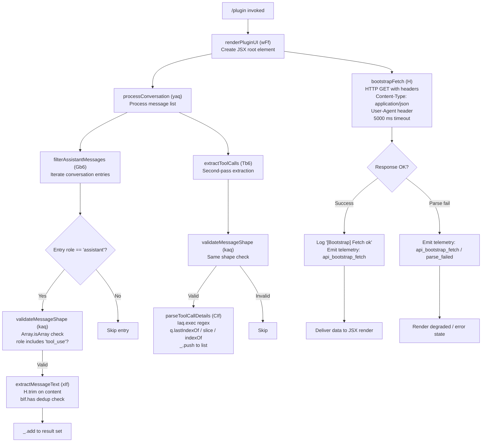

# `/plugin`

> Analysis basis: CC v2.1.169 bundle.js (AST extraction + Claude interpretation)
> Minimum version: v2.1.169

---

## Overview

The `/plugin` command (also reachable as `/plugins` and `/marketplace`) provides an interactive JSX-rendered interface for managing Claude Code plugins. It renders a React component via the handler `wFf`, which bootstraps plugin data through an authenticated HTTP fetch and processes the resulting message/tool-call history to build a display model for the plugin marketplace UI.

## Registration

| Field | Value |
|---|---|
| type | `local-jsx` |
| name | `plugin` |
| description | `Manage Claude Code plugins` |
| aliases | `plugins`, `marketplace` |
| immediate | `true` |
| module_id | `P7K` |
| load_inline | `true` |
| loc_byte | `12727754` |
| loc_byte_end | `12728044` |
| loc_line | `9104` |
| arbor_handler.name | `wFf` |
| arbor_handler.fqn | `claude-2.1.169::wFf` |
| arbor_handler.kind | `AsyncFunction` |
| arbor_handler.resolution_path | `module_id` |
| arbor_handler.n_hits | `0` |

Analysis basis: CC v2.1.169 bundle.js:+12727754

## Input Branching

The handler exhibits 4+ distinct paths: JSX element creation, two separate conversation-list processing branches (assistant-role filtering and tool-use filtering), and the bootstrap fetch pipeline (success vs. parse-failure). A Mermaid flowchart is required.



## Behavioral Spec

### Top-Level Render Handler

```
async function renderPluginUI(context):
    root = createElement(UIFramework, ...)             // XMA.createElement
    result = await processConversation(context.messages)
    return root(result)
```

Analysis basis: CC v2.1.169 bundle.js:+12724940, +12725005

---

### Conversation Processor

```
function processConversation(messageList):
    assistantEntries = filterAssistantMessages(messageList)
    toolCallEntries   = extractToolCalls(messageList)
    return merge(assistantEntries, toolCallEntries)
```

Analysis basis: CC v2.1.169 bundle.js:+11863468, +11863485

---

### Assistant Message Filter

```
function filterAssistantMessages(messageList):
    resultSet = new Set()
    for entry in messageList:
        if not validateMessageShape(entry):
            continue
        text = extractMessageText(entry)
        if text is not null and not resultSet.has(text):
            resultSet.add(text)
    return resultSet
```

Analysis basis: CC v2.1.169 bundle.js:+11862805, +11862819, +11862831

---

### Message Shape Validator

```
function validateMessageShape(entry):
    // Checks structural preconditions before further processing
    if not Array.isArray(entry.content):
        return false
    if not roleList.includes("tool_use"):        // Uk.includes
        return false
    return true
```

- Role constant checked: `"assistant"` (bundle.js:+11862529)
- Content-type constant checked: `"tool_use"` (bundle.js:+11862619)

Analysis basis: CC v2.1.169 bundle.js:+11862542, +11862631

---

### Message Text Extractor

```
function extractMessageText(entry):
    trimmed = entry.content.trim()               // H.trim
    if deduplicationSet.has(trimmed):            // bIf.has
        return null
    return trimmed
```

Analysis basis: CC v2.1.169 bundle.js:+11863201, +11863279

---

### Tool Call Extractor

```
function extractToolCalls(messageList):
    resultList = []
    for entry in messageList:
        if not validateMessageShape(entry):
            continue
        details = parseToolCallDetails(entry)
        if details is not null:
            resultList.push(details)             // _.push
        deduplicationSet.add(entry)              // _.add
    return resultList
```

Analysis basis: CC v2.1.169 bundle.js:+11863121, +11863141, +11863148

---

### Tool Call Detail Parser

```
function parseToolCallDetails(entry):
    match = TOOL_CALL_REGEX.exec(entry)          // Iaq.exec (index 0)
    if match is null:
        return null
    lastSep = entry.lastIndexOf(separator)       // index 1
    prefix  = entry.slice(0, lastSep)
    offset  = entry.indexOf(marker)
    result  = buildDetail(prefix, offset)
    resultList.push(result)                      // _.push
    return result
```

- Regex applied at index `0` (bundle.js:+11862905)
- Separator scan starts at index `1` (bundle.js:+11862945)
- Entry type constant: `"command"` (bundle.js:+11862701)

Analysis basis: CC v2.1.169 bundle.js:+11862916, +11862964, +11862995, +11863014, +11863059

---

### Bootstrap Fetch

```
async function bootstrapFetch(url):
    log("[Bootstrap] Fetching", url)             // literal at +16097956
    response = await httpGet(url, {
        headers: {
            "Content-Type": "application/json",  // +16098041 / +16098056
            "User-Agent": <cc_user_agent>        // +16098075
        },
        timeout: 5000                            // +16098157
    })
    if response.ok:
        log("[Bootstrap] Fetch ok")              // +16098330
        emitTelemetry("api_bootstrap_fetch")     // +16098278
        return parseJSON(response)
    else:
        emitTelemetry("api_bootstrap_fetch", { status: "parse_failed" })  // +16098300
        return null
```

- HTTP timeout: **5000 ms** (bundle.js:+16098157)
- Buffer / chunk size constant: **1024** (bundle.js:+16413011)
- Data field key: `"data"` (bundle.js:+16412958)

Analysis basis: CC v2.1.169 bundle.js:+16097954, +16098088, +16098096, +16098127, +16098139, +16098142, +16098166, +16098275

---

## State & Side Effects

| Item | Detail |
|---|---|
| Telemetry | `api_bootstrap_fetch` (success path, bundle.js:+16098278); `api_bootstrap_fetch` with sub-status `parse_failed` (error path, bundle.js:+16098300) |
| Hook registration | None detected in depth-2 traversal |
| appState changes | <!-- TODO: not found in depth-2 traversal; needs --depth 4 --> |
| Sound | None detected in depth-2 traversal |
| Network I/O | Outbound HTTP GET during bootstrap fetch; `Content-Type: application/json`, 5000 ms timeout |
| JSX render | Renders interactive plugin/marketplace UI via `XMA.createElement` (bundle.js:+12724940) |
| Deduplication state | Internal `Set` (`bIf`) used to suppress duplicate message text entries |

## Version History

| Version | Change |
|---|---|
| v2.1.169 | Initial analysis |

## Common Mistakes

1. **Using `/plugin` expecting an immediate text response** — this command is `local-jsx` with `immediate: true`, so it renders an interactive UI component rather than producing a plain-text assistant reply.
2. **Forgetting the aliases** — `/plugins` and `/marketplace` are fully equivalent entry points; avoid documenting them separately or treating them as distinct commands.
3. **Assuming offline operation** — the command performs a live bootstrap fetch with a 5000 ms timeout; in air-gapped or rate-limited environments the marketplace data may fail to load and the UI will render in a degraded state.
4. **Expecting telemetry on every invocation** — telemetry events (`api_bootstrap_fetch`) are emitted only during the bootstrap fetch lifecycle, not on every render cycle.
5. **Misidentifying the handler module** — the handler is resolved via `module_id: "P7K"` using the `module_id` resolution path; the inline load shape (`load_inline: true`) means there is no separate `load_ident` indirection to trace.

## Appendix — Identifier Mapping

> For bundle debugging only. Identifiers change across versions.

| Identifier | Role |
|---|---|
| `wFf` | Top-level async render handler for the plugin UI (`renderPluginUI`) |
| `yaq` | Conversation processor — orchestrates both filter passes (`processConversation`) |
| `Gb6` | Assistant message filter — iterates message list for assistant-role entries (`filterAssistantMessages`) |
| `kaq` | Message shape validator — checks `Array.isArray` and role membership (`validateMessageShape`) |
| `xIf` | Message text extractor — trims and deduplicates content strings (`extractMessageText`) |
| `H` | Bootstrap fetch function — performs outbound HTTP GET with headers and timeout (`bootstrapFetch`) |
| `_` | Mutable accumulator (Set or Array) used across filter and extractor passes |
| `Tb6` | Tool call extractor — second-pass iterator over message list (`extractToolCalls`) |
| `CIf` | Tool call detail parser — applies regex and string operations to parse tool call shape (`parseToolCallDetails`) |
| `q` | Input string buffer used inside `parseToolCallDetails` (subject of `lastIndexOf`, `slice`, `indexOf`) |
| `Iaq` | Compiled regex used in tool call detection (`TOOL_CALL_REGEX`) |
| `bIf` | Deduplication Set for already-seen message text strings |
| `Uk` | Role/type allowlist used in `validateMessageShape` |
| `XMA` | JSX/React-compatible element factory (aliased framework, e.g. React or Ink) |

---

Note: index built via Arbor fallback; some signals (telemetry, literals) may be missing — see arbor-fallback.js.