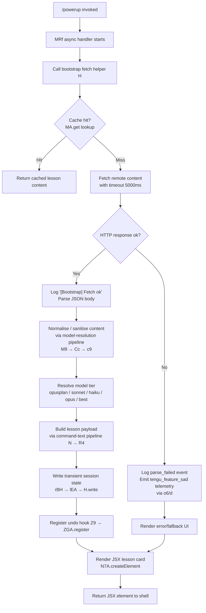

# `/powerup`

> Analysis basis: CC v2.1.169 bundle.js (AST extraction + Claude interpretation)
> Minimum version: v2.1.169

---

## Overview

`/powerup` is an interactive, JSX-rendered slash command that delivers quick educational lessons about Claude Code features. When invoked, the handler (`MRf`) bootstraps lesson content — fetching it remotely if needed — and presents an interactive UI component to the user. The command is designed as a lightweight onboarding and discovery mechanism, not as an agent task trigger.

---

## Registration

| Field | Value |
|---|---|
| type | `local-jsx` |
| name | `powerup` |
| description | `Discover Claude Code features through quick interactive lessons` |
| module_id | `FHK` |
| load_inline | `true` |
| loc_byte | `12145030` |
| loc_byte_end | `12145210` |
| loc_line | `8359` |
| arbor_handler.name | `MRf` |
| arbor_handler.fqn | `claude-2.1.169::MRf` |
| arbor_handler.kind | `AsyncFunction` |
| arbor_handler.resolution_path | `module_id` |
| arbor_handler.n_hits | `0` |

Analysis basis: CC v2.1.169 bundle.js:+12145030

---

## Input Branching

The handler involves 4+ distinct paths: bootstrap fetch success, parse failure, lesson content render, and the telemetry-triggered sad-path. A Mermaid flowchart is required.



---

## Behavioral Spec

### 1. Handler Entry — `MRf` (AsyncFunction)

The handler is an `AsyncFunction` resolved via `module_id` → `FHK`. It constructs a JSX element (`N7A.createElement`) and immediately delegates to the bootstrap helper (`H`) to obtain lesson content.

```
async function powerupHandler(context):
    lessonData = await bootstrapFetch(context)
    element    = createElement(LessonCardComponent, { data: lessonData, role: "system" })
    return element
```

Analysis basis: CC v2.1.169 bundle.js:+12144904, +12144939, +12144952

The literal `"system"` is passed as a role prop to the created element (bundle.js:+12144952).

---

### 2. Bootstrap Fetch — `bootstrapFetch` (`H`)

Fetches remote lesson content with a hard timeout of **5000 ms** (bundle.js:+16098157). Sends `Content-Type: application/json` and a `User-Agent` header. Logs `"[Bootstrap] Fetching"` on initiation and `"[Bootstrap] Fetch ok"` on success.

```
async function bootstrapFetch(context):
    log("[Bootstrap] Fetching")
    cached = contentCache.get(key)
    if cached exists:
        return cached

    response = await fetch(remoteURL, {
        headers: {
            "Content-Type": "application/json",
            "User-Agent":   buildUserAgent()
        },
        timeout: 5000
    })

    if response not ok:
        emitTelemetry("api_bootstrap_fetch", { result: "parse_failed" })
        triggerSadPath()
        return fallbackContent

    body = await response.json()
    log("[Bootstrap] Fetch ok")
    contentCache.set(key, body)
    return body
```

Analysis basis: CC v2.1.169 bundle.js:+16097954, +16097956, +16098041, +16098056, +16098075, +16098157, +16098278, +16098300, +16098330

---

### 3. Sad-Path Telemetry — `sadPathReporter` (`o6`)

When the bootstrap fetch fails or content cannot be parsed, `o6` is invoked, which calls `d` to emit the `tengu_feature_sad` telemetry event. A further call to `K6` → `c76` constructs the error payload, citing the canonical issue-report URL `https://github.com/anthropics/claude-code/issues`.

```
function sadPathReporter(errorContext):
    emitTelemetry("tengu_feature_sad", errorContext)   // via d
    payload = buildErrorPayload(errorContext)           // via K6 → c76
    return payload
```

Analysis basis: CC v2.1.169 bundle.js:+1014067, +1014069, +1014108, +3628, +3999

---

### 4. Command-Text Normalisation Pipeline — `commandTextNormaliser` (`N`)

Receives the raw command arguments. Performs the following steps in order:

1. Check `sBH` for feature-flag gate (bundle.js:+208915).
2. Invoke `ItK` → `RI` / `fZA` / `vGA` for input sanitisation; `vGA` further calls `yoK` and `hoK` for character-class checks (bundle.js:+208933).
3. Test `H.includes` for substring presence (bundle.js:+208955).
4. Serialise context via `CH` → `JSON.stringify` (bundle.js:+208973, +187585).
5. Upper-case the command token via `_.toUpperCase` (bundle.js:+209017).
6. Delegate to `commandArgParser` (`R4`) to extract the final argument tokens (bundle.js:+209037).
7. Trim trailing whitespace via `H.trim` (bundle.js:+209040).
8. Invoke `$h` and `rBH` for state annotation and write-back (bundle.js:+209056, +209062).
9. Hand off to `fileWriteOrchestrator` (`StK`) for persistence (bundle.js:+209076).

```
function commandTextNormaliser(rawInput, context):
    if not featureGate(rawInput):
        return noOp

    sanitised = sanitiseInput(rawInput)          // ItK
    present   = sanitised.includes(marker)
    payload   = serialiseContext(context)        // CH → JSON.stringify
    upper     = token.toUpperCase()
    args      = commandArgParser(upper, payload) // R4
    trimmed   = args.trim()
    annotateState(trimmed)                       // $h
    writeBack(trimmed)                           // rBH → lEA → H.write
    fileWriteOrchestrator(trimmed, context)      // StK
    return trimmed
```

Analysis basis: CC v2.1.169 bundle.js:+208915, +208933, +208955, +208973, +209017, +209037, +209040, +209056, +209062, +209076

---

### 5. Command Argument Parser — `commandArgParser` (`R4`)

Parses the normalised command string into discrete argument tokens. Applies a `[REDACTED]` substitution pattern (bundle.js:+200573) to scrub sensitive values before token splitting. Uses `q.at` with index `2` (bundle.js:+200631) and `A.lastIndexOf` / `A.slice` for boundary extraction. The path-mapping helper `qZA` iterates over a known list (`ZtK.map`) to match argument patterns (bundle.js:+200494, +200209).

```
function commandArgParser(input, context):
    mapped   = pathMapping(input)                  // qZA → ZtK.map
    redacted = input.replace(pattern, "[REDACTED]") // R4 → H.replace
    token    = redacted.at(2)                       // index 2
    last     = redacted.lastIndexOf(delimiter)
    segment  = redacted.slice(last)
    return { mapped, token, segment }
```

The constant `2` indexes into the split token array; `"[REDACTED]"` is the sanitisation sentinel.

Analysis basis: CC v2.1.169 bundle.js:+200494, +200521, +200573, +200602, +200631, +200657, +200683

---

### 6. Model Resolution — `modelResolver` (`M9`)

Resolves the target Anthropic model for lesson delivery. Delegates to `Cc` (composite model selector) and `c9` (tier normaliser). Recognised tier strings (bundle.js:+2252174, +2252215, +2252254, +2252293, +2252330):

| Tier string | Meaning |
|---|---|
| `opusplan` | Opus-class planning model |
| `sonnet` | Sonnet-class model |
| `haiku` | Haiku-class model |
| `opus` | Opus model |
| `best` | Highest available tier |

The `[1m]` prefix tag (bundle.js:+2252200) is appended for first-party (`firstParty`) provider paths. `anthropicAws` and `gateway` are recognised alternative provider strings (bundle.js:+2105867, +2105887). The `mantle` provider variant is also handled (bundle.js:+2249023). Model IDs containing the `anthropic.` prefix (bundle.js:+2246054) are routed through the AWS Bedrock variant (`anthropicAws`).

```
function modelResolver(requestContext):
    providerTag = detectProvider(requestContext)  // tY, pU, FA
    modelTier   = normaliseTier(providerTag)      // c9 → lower-case + replace
    if tier in ["opusplan","sonnet","haiku","opus","best"]:
        return selectModel(tier, providerTag)     // Mk / QcH / AE / dG1 / zM
    return defaultModel
```

Analysis basis: CC v2.1.169 bundle.js:+2248110, +2252107, +2252174, +2252215, +2252254, +2252293, +2252330, +2105867, +2105887, +2248333

---

### 7. File Write Orchestrator — `fileWriteOrchestrator` (`StK`)

Persists session / lesson state to disk. Key behaviour:

- Computes the target directory via `P6H.dirname` (bundle.js:+208436).
- Checks readiness via `RI` and `l6` (bundle.js:+208466, +208481).
- Tests for the `EISDIR` error code when a path unexpectedly resolves to a directory (bundle.js:+178013 via `n56` → `E8`).
- Resolves the full output path via `MZA` → `P6H.join` and `I6` (bundle.js:+208573).
- Stats the candidate file via `Vo8` → `Mh.stat`; handles `.txt` suffix stripping (bundle.js:+207832, +207843) and renames/unlinks stale files (`Mh.rename`, `Mh.unlink`) (bundle.js:+207884, +207924).
- Measures content size with `Buffer.byteLength` (bundle.js:+208611).
- Appends to the file via `htK` → `Mh.mkdir` + `Mh.appendFile` (bundle.js:+208157, +208216).
- Uses a debounced write queue (`TBH`) with a **1000 ms** debounce interval and a **100-item** queue limit (bundle.js:+61630, +61651), managing `clearTimeout` / `setTimeout` / `setImmediate` internally.
- Registers an undo/cleanup hook via `Z9` → `ZGA.register` after the write completes (bundle.js:+208766, +62328).

```
function fileWriteOrchestrator(content, context):
    dir      = path.dirname(targetPath)
    fullPath = resolvePath(dir, context)         // MZA

    try:
        stat = fs.stat(fullPath)
        if fullPath.endsWith(".txt"):
            fullPath = fullPath.slice(0, -4)     // strip .txt, constant 4
        fs.rename(oldPath, fullPath)
    except EISDIR:
        fs.unlink(stale)

    size = Buffer.byteLength(content)
    enqueueDebounced(content, size)              // TBH: debounce=1000ms, maxQueue=100
    writeQueue.then(appendHandler.bind(...))     // htK

    registerUndoHook()                           // Z9 → ZGA.register
```

Analysis basis: CC v2.1.169 bundle.js:+208403, +208428, +208436, +208466, +208573, +208605, +208611, +208644, +208661, +208670, +208766, +61630, +61651, +62328, +178013, +207832, +207843, +207854, +207884, +207924

---

### 8. Argument Splitting — `argumentSplitter` (`w2_`)

Splits raw command-line text into a structured argument array:

1. Split on whitespace delimiters (bundle.js:+2984790).
2. Trim each token (bundle.js:+2984829).
3. Find separator index via `indexOf` (bundle.js:+2984853).
4. Slice the array at the separator (bundle.js:+2984893).

The `data` field name (bundle.js:+16412958) and chunk size limit of **1024** (bundle.js:+16413011) are used during SSE / streaming data slicing within the same call neighbourhood. A line-wrap limit of **40** characters (bundle.js:+16533353) governs display rendering of argument tokens.

```
function argumentSplitter(rawText):
    parts     = rawText.split(delimiter)
    parts     = parts.map(t => t.trim())
    sepIndex  = parts.indexOf(separator)
    if sepIndex >= 0:
        return parts.slice(sepIndex + 1)
    return parts
```

Analysis basis: CC v2.1.169 bundle.js:+2984790, +2984829, +2984853, +2984893, +16412958, +16413011, +16533353

---

## State & Side Effects

| Item | Detail |
|---|---|
| Telemetry | `tengu_feature_sad` (emitted on bootstrap fetch failure or content parse error; bundle.js:+1014069) |
| Bootstrap telemetry | `api_bootstrap_fetch` with property `parse_failed` (bundle.js:+16098278, +16098300) |
| Hook registration | `ZGA.register` called after successful file write to record an undo hook (bundle.js:+62328) |
| File system writes | `Mh.mkdir`, `Mh.appendFile`, `Mh.rename`, `Mh.unlink` via orchestrator `StK` / `htK` / `Vo8` |
| Write queue state | Debounced write queue (1000 ms delay, 100-item cap) managed by `TBH`; uses `clearTimeout`, `setTimeout`, `setImmediate` |
| Cache (read) | `MA.get` consulted for previously fetched bootstrap content (bundle.js:+16097992) |
| Session state write | `rBH` → `lEA` → `H.write` annotates transient session state with normalised command text (bundle.js:+209062) |
| Debug logging | Literal `"debug"` level used within the write orchestrator path (bundle.js:+208891) |
| Sound | <!-- TODO: not found in depth-2 traversal; needs --depth 4 --> |

---

## Version History

| Version | Change |
|---|---|
| v2.1.169 | Initial analysis |

---

## Common Mistakes

1. **Assuming `/powerup` triggers an agent task**: the command renders a JSX lesson card directly; it does not queue an agentic tool-call chain. The handler returns a React element, not a prompt string.
2. **Ignoring the 5000 ms fetch timeout**: network-restricted environments (proxies, air-gapped setups) will silently fall back to the sad-path, emitting `tengu_feature_sad` with no visible error unless telemetry logging is enabled.
3. **Conflating model-tier resolution with model selection**: `modelResolver` only resolves a tier string (`sonnet`, `haiku`, etc.); the actual model ID is chosen downstream and may differ depending on provider (`firstParty`, `anthropicAws`, `gateway`, `mantle`).
4. **Expecting `/powerup` to accept meaningful arguments**: the command-text normalisation pipeline trims, upper-cases, and redacts arguments before use — no free-form argument is passed verbatim to the lesson content engine.
5. **Not accounting for the debounced write queue**: rapid successive invocations within a 1000 ms window will be coalesced by the write debouncer; only the last-queued item before the timeout fires will be written.

---

## Appendix — Identifier Mapping

> For bundle debugging only. Identifiers change across versions.

| Identifier | Role |
|---|---|
| `MRf` | Main handler — async function for `/powerup` |
| `H` | Bootstrap fetch orchestrator (fetches remote lesson content, manages cache) |
| `N` | Command-text normalisation pipeline |
| `ItK` | Input sanitiser (called from normaliser) |
| `vGA` | Character-class checker (called from sanitiser) |
| `CH` | Context serialiser (wraps `JSON.stringify`) |
| `R4` | Command argument parser |
| `qZA` | Path-pattern mapper (iterates `ZtK`) |
| `q` | Token array (argument split result) |
| `A` | String helper / lowercase path builder |
| `rBH` | Session state write-back trigger |
| `lEA` | Low-level write wrapper (calls `H.write`) |
| `StK` | File write orchestrator |
| `TBH` | Debounced write queue manager |
| `_4H` | Path assembly helper (joins segments via `P6H.join`) |
| `l6` | Readiness / lock checker |
| `n56` | `EISDIR` error handler |
| `MZA` | Full output-path resolver (`P6H.join` + `I6`) |
| `Vo8` | File stat / rename / unlink helper |
| `htK` | Mkdir + appendFile handler (bound to write queue promise) |
| `Z9` | Undo-hook registrar (`ZGA.register`) |
| `P$` | Secondary bootstrap helper (post-cache path) |
| `w2_` | Raw argument splitter |
| `u6H` | Set-membership checker (`vO4.has`) |
| `n3` | String replacement helper (`H.replace`) |
| `M9` | Model resolver (top-level) |
| `Cc` | Composite model selector |
| `tY` | Provider-type detector (used in `Cc`) |
| `pU` | Provider-flag extractor (used in `Cc`) |
| `CC` | Model-ID builder / trimmer |
| `c9` | Tier normaliser (lower-case + replace) |
| `u2` | Tier string utility (`ZLH`) |
| `TLH` | Provider inclusion checker (`GLH.includes`) |
| `Mk` | `opusplan` / `[1m]` model selector |
| `QcH` | `haiku`-tier model selector |
| `AE` | `opus`-tier model selector |
| `dG1` | `best`-tier model selector (delegates to `AE`) |
| `zM` | AWS/provider variant resolver (`YA`) |
| `__8` | Model-ID suffix checker (`Q5L.includes`) |
| `dcH` | Fallback model path (`_6`) |
| `eD` | Extended model dispatch (calls `c9` + `hG`) |
| `hG` | Full model-resolution sub-pipeline |
| `o6` | Sad-path reporter (emits `tengu_feature_sad`) |
| `d` | Telemetry emit primitive |
| `K6` | Error payload builder |
| `c76` | Error payload low-level constructor |

---

Note: index built via Arbor fallback; some signals (telemetry, literals) may be missing — see arbor-fallback.js.