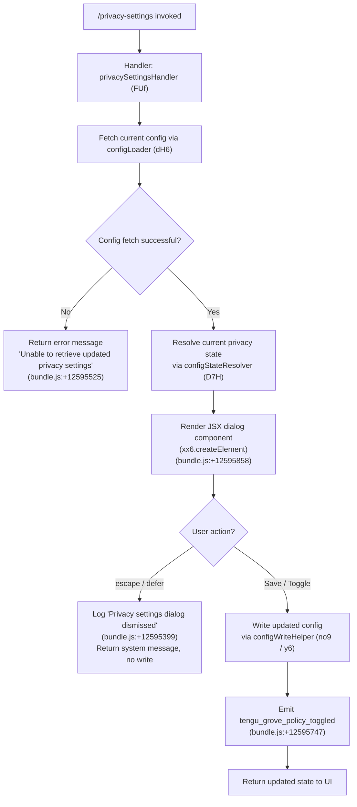

# `/privacy-settings`

> Analysis basis: CC v2.1.169 bundle.js (AST extraction + Claude interpretation)
> Minimum version: v2.1.169

---

## Overview

`/privacy-settings` is a local JSX command that opens an interactive dialog allowing users to view and update their privacy settings within Claude Code. The command reads the current privacy policy state from configuration, renders a UI component, and persists any user changes—emitting a telemetry event when the policy toggle occurs. If the user dismisses the dialog without saving, the action is logged and no changes are written.

---

## Registration

| Field | Value |
|---|---|
| type | `local-jsx` |
| name | `privacy-settings` |
| description | `View and update your privacy settings` |
| module_id | `oKK` |
| load_inline | `true` |
| loc_byte | `12596211` |
| loc_byte_end | `12596403` |
| loc_line | `8903` |
| arbor_handler.name | `FUf` |
| arbor_handler.fqn | `claude-2.1.169::FUf` |
| arbor_handler.kind | `AsyncFunction` |
| arbor_handler.resolution_path | `module_id` |
| arbor_handler.n_hits | `0` |

Analysis basis: CC v2.1.169 bundle.js:+12596211

---

## Input Branching

The command has three distinct execution branches based on how the privacy-settings dialog resolves: the user accepts/saves changes, the user dismisses (escape/defer), or the config fetch fails. A Mermaid flowchart is used.



---

## Behavioral Spec

### Handler Entry — `privacySettingsHandler` (`FUf`)

The Arbor-resolved handler `FUf` is an `AsyncFunction` reached via `module_id → oKK`.

```
async function privacySettingsHandler(context):
    # Parallel data setup
    [configData, sessionState] = await Promise.all([
        configLoader(context),          # dH6
        grokeStateResolver(context)     # Z2H (via FUf → Z2H at +12595269)
    ])

    if configData is unavailable:
        return errorMessage("Unable to retrieve updated privacy settings")
        # Literal: bundle.js:+12595525

    currentState = resolveConfigState(configData)   # D7H
    policyView   = buildPolicyView(currentState)    # M (MCP/settings model)

    dialogResult = await renderPrivacyDialog(policyView)
    # xx6.createElement call at bundle.js:+12595858

    if dialogResult.action in ["escape", "defer"]:
        # Literals at bundle.js:+12595374 ("escape"), +12595388 ("defer")
        log("Privacy settings dialog dismissed")
        # Literal at bundle.js:+12595399
        return systemMessage("settings", dialogResult)
        # Literal "system" at +12595444, "settings" at +12595811

    # User confirmed a change
    writeUpdatedConfig(dialogResult.newSettings)    # no9 / y6 path
    emit("tengu_grove_policy_toggled")              # +12595747
    return updatedSettingsMessage(dialogResult.newSettings)
```

Analysis basis: CC v2.1.169 bundle.js:+12595211 (handler entry via `FUf → dH6`)

---

### Config Loading — `configLoader` (`dH6`)

`dH6` is responsible for loading and caching the configuration with Grove-style freshness semantics.

```
function configLoader(context):
    # Three cache states produce log messages:
    # "Grove: No cache, fetching config in background (dialog skipped this session)"
    #   Literal at bundle.js:+7323549
    # "Grove: Cache stale, returning cached data and refreshing in background"
    #   Literal at bundle.js:+7323669
    # "Grove: Using fresh cached config"
    #   Literal at bundle.js:+7323775

    cachedConfig = groveCache.get()         # FL path
    configAge    = Date.now() - cachedConfig.timestamp   # +7323523

    if cachedConfig is absent:
        scheduleBackgroundFetch(context)    # no9 async path
        return null   # triggers "dialog skipped" branch

    if cachedConfig is stale:
        scheduleBackgroundFetch(context)
        return cachedConfig   # stale-while-revalidate

    return cachedConfig   # fresh path
```

Analysis basis: CC v2.1.169 bundle.js:+7323494 (`dH6 → y6`), +7323629 (`dH6 → no9`)

---

### Config State Resolution — `configStateResolver` (`D7H`)

`D7H` maps raw config values to structured state objects used by the privacy dialog renderer.

```
function resolveConfigState(rawConfig):
    baseState  = buildBaseState(rawConfig)     # Oq
    mergedView = buildMergedView(rawConfig)    # yA
    fieldList  = buildFieldList(rawConfig)     # jg1

    return { baseState, mergedView, fieldList }
```

`buildBaseState` (`Oq`) reads credential helpers and API-key related fields:
- Checks for `ANTHROPIC_API_KEY` presence (literal at bundle.js:+3008134)
- Checks for `apiKeyHelper` setting (literal at bundle.js:+3008159)
- Falls back to index `0` sentinel (literal at bundle.js:+3008016)

`buildMergedView` (`yA`) calls `IY` (settings aggregator) and `kC` (array-check helper using `Array.isArray` at +2113239).

Analysis basis: CC v2.1.169 bundle.js:+3031666 (`D7H → Oq`), +3031678 (`D7H → yA`), +3031694 (`D7H → jg1`)

---

### Privacy Policy Write Path — `configSaveWithLock` (`no9` / `UL8`)

When the user confirms a policy change, the handler routes through the background-fetch/save path:

```
async function savePrivacyPolicy(newSettings):
    timestamp = Date.now()             # +7323973

    fileState = saveConfigWithLock(newSettings)   # X8 → UL8
    # Guards against auth-wiping:
    # "saveConfigWithLock: re-read config is missing auth that cache has;
    #  refusing to write to avoid wiping ~/.claude.json. See GH #3117."
    #   Literal at bundle.js:+3272641

    # Also: "saveGlobalConfig fallback: re-read config is missing auth …"
    #   Literal at bundle.js:+3269335

    if lockContention detected:
        emit("tengu_config_lock_contention")    # +3272314
        log warning about concurrent Claude instance
        # Literal: "Lock acquisition took longer than expected …" at +3272225

    if staleWriteDetected:
        emit("tengu_config_stale_write")        # +3272450

    if authLossPrevented:
        emit("tengu_config_auth_loss_prevented")  # +3272793

    updateGroveCache(newSettings)

    emit("tengu_grove_policy_toggled")          # +12595747
```

Lock timeout constant: **60 000 ms** (bundle.js:+3272995)
Backup file retention: **5** backups (bundle.js:+3273244)
Backup chunk size: **384** bytes (bundle.js:+3273526)

Analysis basis: CC v2.1.169 bundle.js:+7323865 (`no9 → Z2H`), +3269309 (`X8 → y7H`), +3272641

---

### Settings Model — `settingsModelLoader` (`M`)

`M` orchestrates the broader settings surface that backs the privacy dialog, including MCP configuration state. The call to `M` at bundle.js:+12595468 sets up the data model before the JSX render.

```
function settingsModelLoader(context):
    mcpState    = loadMcpConnections()     # mSH
    slotUpdater = applyConnectionResult()  # cd8
    liveValues  = getLiveConfig()          # L.get / L.values

    return { mcpState, slotUpdater, liveValues }
```

`loadMcpConnections` (`mSH`) iterates all configured MCP servers (Object.entries at +6687581), handles transport types `stdio` (+6687781), `sse-ide` (+6687880), `ws-ide` (+6687916), `claudeai-proxy` (+6688188), and applies connection results.

Analysis basis: CC v2.1.169 bundle.js:+16176031 (`M → mSH`), +16176041 (`M → cd8`)

---

## State & Side Effects

| Item | Detail |
|---|---|
| Telemetry: `tengu_grove_policy_toggled` | Fired when the user saves a changed privacy policy (bundle.js:+12595747) |
| Telemetry: `tengu_config_lock_contention` | Fired when config file lock takes longer than expected (bundle.js:+3272314) |
| Telemetry: `tengu_config_stale_write` | Fired when a stale write is detected during config save (bundle.js:+3272450) |
| Telemetry: `tengu_config_auth_loss_prevented` | Fired when a write that would erase auth credentials is blocked (bundle.js:+3272793) |
| Telemetry: `tengu_config_parse_error` | Fired when the config file cannot be parsed (bundle.js:+3274889) |
| Telemetry: `tengu_feature_sad` | General feature error path (bundle.js:+1014069) |
| Config write | Updates `~/.claude.json` via lock-guarded `saveConfigWithLock`; protects against auth-credential loss (GH #3117) |
| Config backup | Keeps up to 5 rolling backups with `.backup.` prefix (bundle.js:+3273244, +3273111) |
| Grove cache | Read and updated on both load and save paths; stale-while-revalidate semantics |
| JSX render | Renders an interactive privacy dialog via `xx6.createElement` (bundle.js:+12595858) |
| Dismissal log | Logs `"Privacy settings dialog dismissed"` on escape/defer without writing (bundle.js:+12595399) |
| appState changes | Returns a `system`-typed message with key `"settings"` on save (bundle.js:+12595444, +12595811) |
| Sound | None identified in depth-2 traversal |

---

## Version History

| Version | Change |
|---|---|
| v2.1.169 | Initial analysis |

---

## Common Mistakes

1. **Dismissing instead of saving**: Pressing `Escape` or deferring exits the dialog without writing any changes. The dismissal is logged but the policy remains unchanged. Users must explicitly confirm to persist.
2. **Concurrent Claude instances**: If another Claude Code process holds the config file lock, the write will be delayed (up to 60 000 ms timeout) and `tengu_config_lock_contention` will fire. Edits to the config file externally during this window can block the save.
3. **Auth-credential protection**: The save path will refuse to write if the re-read config is missing credentials that the in-memory cache contains (GH #3117 guard, bundle.js:+3272641). In this case the privacy change is silently dropped; check logs for `saveConfigWithLock: re-read config is missing auth` messages.
4. **Stale cache**: When no cache exists, the command skips the dialog for the session (Grove "dialog skipped" path, bundle.js:+7323549). Re-invoking after the background fetch completes will show the dialog normally.
5. **Type confusion on return value**: The command returns a `"system"`-typed message (not a user-visible reply) on both the success and dismiss paths; downstream code that expects a plain string response will mishandle it.

---

## Appendix — Identifier Mapping

> For bundle debugging only. Identifiers change across versions.

| Identifier | Role |
|---|---|
| `FUf` | Main async handler for `/privacy-settings` (`privacySettingsHandler`) |
| `dH6` | Config loader with Grove freshness / stale-while-revalidate semantics |
| `D7H` | Config state resolver; maps raw config to structured dialog model |
| `Oq` | Base-state builder; reads API key and credential helper fields |
| `k3_` | Sub-helper called by base-state builder (role unclear at depth-2) |
| `I3_` | Sub-helper called by base-state builder (role unclear at depth-2) |
| `IY` | Settings aggregator; collects all setting fields into a unified object |
| `yA` | Merged-view builder; combines IY output with array validation |
| `kC` | Array-check helper using `Array.isArray` / `H.includes` |
| `jg1` | Field-list builder for config state |
| `FL` | Grove cache reader |
| `y6` | Config file read/watch helper with backup logic |
| `l6` | File-path resolver utility |
| `NG_` | Config normalization helper |
| `y7H` | Low-level config file I/O (readFileSync, mkdirSync, copyFileSync) |
| `jhL` | File-watch registration helper (`xL8.watchFile`) |
| `N` | Generic logger / notification utility |
| `ItK` | Logger sub-component |
| `vGA` | Logger transport initializer |
| `H` | Bootstrap / HTTP fetch helper (used for config API requests) |
| `P$` | HTTP request header builder |
| `w2_` | String-splitting / trimming utility |
| `u6H` | Set-membership check helper |
| `n3` | String-replacement utility |
| `M9` | Message-construction helper |
| `o6` | Feature-flag / sad-path reporter |
| `CH` | JSON.stringify wrapper |
| `R4` | Path-suffix / extension helper |
| `qZA` | Path-mapping helper |
| `rBH` | Write-stream helper |
| `lEA` | Low-level write helper |
| `StK` | Config persist orchestrator (manages lock, backup, append) |
| `TBH` | Debounced write scheduler (setTimeout/setImmediate) |
| `_4H` | Path-join helper for config file locations |
| `n56` | Error-code handler (EISDIR) |
| `MZA` | Config path resolver |
| `Vo8` | File rename/unlink helper |
| `htK` | Async append-file helper |
| `Z9` | Signal/hook registration helper (`ZGA.register`) |
| `no9` | Background config-fetch scheduler |
| `X8` | Save-config-with-lock orchestrator |
| `UL8` | Full save-with-lock implementation (mkdir, statSync, copyFileSync, readdirStringSync) |
| `OJH` | Lock-state checker |
| `Ie1` | Object-entries iterator for lock entries |
| `MP6` | Timestamp/lock-age calculator |
| `ViH` | Lock validation helper |
| `d` | Generic utility / constant holder |
| `pL8` | Config write path helper |
| `M` | Settings model loader (MCP + privacy) |
| `mSH` | MCP connection loader; iterates all server slots |
| `yn` | MCP server-state aggregator |
| `XE6` | MCP server-entry builder |
| `Tt` | MCP transport resolver |
| `sF` | MCP SDK-transport builder |
| `yw8` | MCP warning colorizer (red/yellow) |
| `JE6` | MCP SSE/HTTP connection handler |
| `VV` | Config-value validator |
| `kY` | Config-value cache helper |
| `vu_` | Config-value fallback helper |
| `K` | Padded-column formatter |
| `L` | Async-task queue manager |
| `f` | Stream/connection lifecycle manager |
| `g8` | Generic underscore utility wrapper |
| `OZ6` | MCP filter helper |
| `TF9` | MCP connection result processor |
| `jp_` | MCP needs-auth cache reader |
| `PPH` | MCP config hasher (SHA-256) |
| `JD8` | MCP object-keys differ |
| `jD8` | MCP diff orchestrator |
| `BP` | MCP config hash builder |
| `DD8` | MCP config-value extractor |
| `V4` | Config value transformer |
| `O8` | MCP debug logger |
| `sw8` | MCP connection executor |
| `rJ7` | MCP connection pre-flight checker |
| `Mc` | MCP client factory |
| `iAH` | MCP claudeai-proxy connector |
| `rAH` | MCP reconnect helper |
| `K1H` | MCP OAuth flow orchestrator |
| `gtH` | MCP in-flight request tracker |
| `D` | Process exit / abort handler |
| `ew8` | MCP error-result builder |
| `Cn` | MCP reconnect logic handler |
| `Nu` | MCP client capability resolver |
| `Y` | Renderer / output writer |
| `u7` | MCP error logger |
| `EH` | String-coercion error helper |
| `oJ7` | MCP connection result finalizer |
| `iJ7` | MCP SSH/remote-session detector |
| `tw8` | MCP `complete_authentication` tool handler |
| `FtH` | MCP in-flight OAuth state reader |
| `QtH` | MCP deferred-auth state reader |
| `yF9` | MCP tool-result error formatter |
| `C9` | Async-storage store getter |
| `oJ8` | MCP error path joiner |
| `uu_` | MCP auth-status checker |
| `J` | Process signal / kill manager |
| `S` | Background worker / daemon manager |
| `EN` | MCP skills telemetry emitter |
| `D6` | MCP skills loader |
| `Vu_` | MCP server inclusion checker |
| `y` | Chokidar file-watcher wrapper |
| `M6` | Module-constant provider |
| `R` | Output-stream writer |
| `vF9` | Async iterator / stream mapper |
| `NF` | Async iterator implementation |
| `DeH` | parseInt-based version parser (major) |
| `aJ8` | parseInt-based version parser (minor) |
| `cd8` | MCP connection-result applier |
| `uSH` | MCP config-hash updater |
| `UE` | MCP cleanup orchestrator |
| `zeH` | MCP connection-state cleaner |
| `$` | Daemon-status writer |
| `D3K` | Daemon status file updater |
| `Oa` | Daemon status record builder |
| `tx6` | Daemon status file path builder |
| `dXA` | MCP slot-update dispatcher |
| `mw8` | MCP server filter (checks EJ7/yu_ sets) |
| `a8` | Retry-with-timeout helper |
| `O` | Background-session status constant holder |

---

Note: index built via Arbor fallback; some signals (telemetry, literals) may be missing — see arbor-fallback.js.