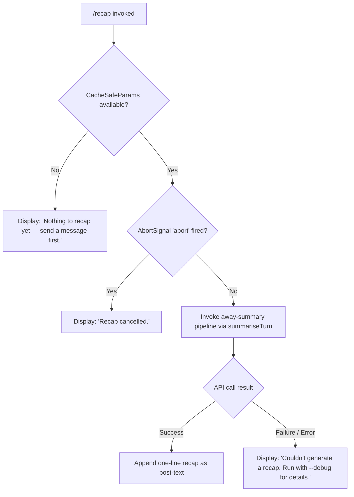

# `/recap`

> Analysis basis: CC v2.1.169 bundle.js (AST extraction + Claude interpretation)
> Minimum version: v2.1.169

---

## Overview

`/recap` generates a concise one-line summary of the current session on demand. It is implemented as an async local command (handler `Yif`) that invokes the away-summary pipeline to produce and display a recap, respecting session state such as turn availability and abortion signals. The command is not available in non-interactive mode and dispatches its result as post-text output.

---

## Registration

| Field | Value |
|---|---|
| type | `local` |
| name | `recap` |
| description | `Generate a one-line session recap now` |
| loc_byte | `13133107` |
| loc_byte_end | `13133323` |
| supportsNonInteractive | `false` |
| thinClientDispatch | `post-text` |
| load_inline | `true` |
| load_ident | `Yif` |
| arbor_handler.name | `Yif` |
| arbor_handler.fqn | `claude-2.1.169::Yif` |
| arbor_handler.kind | `AsyncFunction` |
| arbor_handler.resolution_path | `load_ident` |
| arbor_handler.n_hits | `0` |

Analysis basis: CC v2.1.169 bundle.js:+13133107

---

## Input Branching

The handler has four distinct outcome paths depending on session state, cancellation, and API success:



Analysis basis: CC v2.1.169 bundle.js:+13132857, +13132949, +13133007, +6889701, +6889759, +6889815

---

## Behavioral Spec

### Top-level Handler: `recapCommandHandler` (bundle ident: `Yif`)

```
async function recapCommandHandler(context):
    result = await invokeAwaySummaryPipeline(context)
    return result
```

Analysis basis: CC v2.1.169 bundle.js:+13132715

---

### Away-Summary Dispatcher: `awaySummaryDispatcher` (bundle ident: `tj8`)

This function orchestrates session-state checks, abort wiring, and the summary pipeline.

```
async function awaySummaryDispatcher(context):
    params = loadCacheSafeParams(context)            // W1H call
    if params is null or empty:
        display("Nothing to recap yet — send a message first.")
        return "no-turn"

    abortController = new AbortController()
    context.signal.addEventListener("abort", () => abortController.abort())

    summaryResult = await runAwaySummary(params, abortController.signal)  // rG call

    if summaryResult.status == "aborted":
        display("Recap cancelled.")
        return

    if summaryResult.status == "api-error" or summaryResult.status == "other":
        display("Couldn't generate a recap. Run with --debug for details.")
        return

    if summaryResult.status == "ok":
        appendPostText(summaryResult.text)           // _c9 call
        return
```

Key outcome labels observed in literals:
- `"no-turn"` — no turns exist yet (bundle.js:+6889759)
- `"abort"` — abort event name registered (bundle.js:+6889815)
- `"aborted"` — result status when cancelled (bundle.js:+6890219)
- `"api-error"` — result status on API failure (bundle.js:+6890308)
- `"other"` — result status for other failures (bundle.js:+6890060)
- `"ok"` — result status on success (bundle.js:+6890369)
- `"away_summary"` — internal pipeline tag (bundle.js:+6890075)

Analysis basis: CC v2.1.169 bundle.js:+6889680, +6889699, +6889796, +6889827, +6889874, +6890236, +6890325

---

### Session Recap Pipeline: `runAwaySummary` (bundle ident: `rG`)

This is the core async function that performs the API call to generate the recap. It invokes the shared query infrastructure with tool-use denied (tools blocked for away-summary), builds a message context from the current conversation state, and returns a structured result.

```
async function runAwaySummary(params, signal):
    startTime = Date.now()

    // Build a summarize-turn request using existing conversation context
    request = buildSummarizeTurnRequest(params)     // Qk8 call

    // Attach abort handler
    signal.addEventListener("abort", () => request.abort())

    // Check for tool-use denial — away summary cannot use tools
    permissionHandler = setupDenyAllTools()          // a9H call
    // literal "Away summary cannot use tools" at bundle.js:+6890007

    // Filter messages to "ant" role (assistant messages) only
    relevantMessages = filterMessages(params.messages, role = "ant")  // NuH call

    // Run the main query loop
    outcome = await runQueryLoop(request, permissionHandler)   // pp call

    if signal.aborted:
        return { status: "aborted" }

    if outcome.error:
        return { status: "api-error" }

    return { status: "ok", text: outcome.lastAssistantText }
```

Analysis basis: CC v2.1.169 bundle.js:+10578350, +10578473, +10578687, +10578705, +10578729, +10578749, +10578819, +10578880, +10579080

---

### Conversation State Reader: `loadCacheSafeParams` (bundle ident: `W1H`)

Reads the current session's cache-safe parameters from application state. Returns `null` when no turns have been exchanged yet.

```
function loadCacheSafeParams(context):
    state = context.getAppState()
    if state.cacheSafeParams is undefined or null:
        log.debug("[awaySummary] no CacheSafeParams saved, skipping")
        // literal at bundle.js:+6889701
        return null
    return state.cacheSafeParams
```

Analysis basis: CC v2.1.169 bundle.js:+6889680

---

### Message Filter for Away Summary: `filterAntMessages` (bundle ident: `NuH`)

Filters conversation messages to include only those relevant to recap generation. Only assistant-role (`"ant"`) messages from the current session window are retained.

```
function filterAntMessages(messages):
    filtered = messages.filter(m => m.role == "ant")    // "ant" literal at +13385132
    filtered = applyBU8Filter(filtered)
    filtered = applySU8Filter(filtered)
    filtered = applyPafFilter(filtered)
    return filtered
```

Analysis basis: CC v2.1.169 bundle.js:+13385107, +13385124, +13385172, +13385186

---

### Permission Gate for Tool-Use Denial: `setupDenyAllTools` (bundle ident: `a9H`)

Sets up a permission handler that denies all tool-use requests during away-summary execution.

```
function setupDenyAllTools(context):
    register = createRegistrationEntry()        // o4 → Z9 call chain
    handler = buildNoToolsHandler()             // NuH provides the filter
    // Any tool request is answered with deny + "Away summary cannot use tools"
    // literal at bundle.js:+6890007
    return { register, handler }
```

Analysis basis: CC v2.1.169 bundle.js:+13345151, +13345175

---

### Post-Text Appender: `appendRecapText` (bundle ident: `_c9`)

Receives the final recap string and appends it as a flat-mapped post-text result for display.

```
function appendRecapText(messages):
    return messages.flatMap(m => extractTextParts(m))
```

Analysis basis: CC v2.1.169 bundle.js:+6890325, +6890535

---

### Transcript Writer: `sessionTranscriptWriter` (bundle ident: `StK`)

Manages writing session data to disk as part of the broader query infrastructure. Handles directory creation, file appending, rotation, size checking, and JSONL log flushing.

```
async function sessionTranscriptWriter(params):
    dir = path.dirname(params.logPath)          // P6H.dirname call
    content = buildLogContent(params)           // _4H call
    byteLength = Buffer.byteLength(content)

    if byteLength exceeds rotation threshold:
        rotateFile(params.logPath)              // Vo8 call
        // Vo8 checks .txt suffix (bundle.js:+207832), slices 4 chars (+207843)
        // renames then unlinks old file

    await ensureDir(dir)                        // htK → Mh.mkdir
    await appendContent(params.logPath, content) // htK → Mh.appendFile

    registerCleanupHandler()                    // Z9 → ZGA.register
```

Analysis basis: CC v2.1.169 bundle.js:+208403, +208428, +208436, +208466, +208556, +208573, +208605, +208611, +208644, +208661, +208670, +208766

---

## State & Side Effects

| Item | Detail |
|---|---|
| Telemetry (direct path) | No `tengu_*` events fire exclusively from the `/recap` handler path itself within depth-2; events below are from shared infrastructure reached via the query loop (`nwf`) |
| Telemetry (query infrastructure) | `tengu_auto_compact_rapid_refill_breaker`, `tengu_auto_compact_succeeded`, `tengu_ptl_surfaced_to_user`, `tengu_refusal_fallback_suppressed`, `tengu_rotunda_pennant_applied`, `tengu_rotunda_pennant_tools`, `tengu_refusal_fallback_dialog_suppressed`, `tengu_refusal_fallback_prompt_shown`, `tengu_refusal_fallback_prompt_choice`, `tengu_convolute_arcades_retry`, `tengu_refusal_fallback_triggered`, `tengu_orphaned_messages_tombstoned`, `tengu_refusal_fallback_supersedes`, `tengu_convolute_arcades_retry_outcome`, `tengu_model_fallback_triggered`, `tengu_query_error`, `tengu_model_response_keyword_detected`, `tengu_malformed_tool_use_response`, `tengu_stop_hook_block_count`, `tengu_loop_dynamic_wakeup_ends_turn`, `tengu_post_autocompact_turn`, `tengu_query_before_attachments`, `tengu_query_after_attachments`, `tengu_mcp_tools_refreshed_mid_turn`, `tengu_feature_ok`, `tengu_feature_bad`, `tengu_feature_sad`, `tengu_forked_agent_default_turns_exceeded`, `tengu_fork_agent_query` |
| Abort wiring | Registers a listener on `context.signal` for the `"abort"` event; propagates to an internal `AbortController` that cancels the API request |
| Tool-use | All tools denied during recap — `"Away summary cannot use tools"` is the denial reason |
| appState changes | Reads `cacheSafeParams` from app state; calls `setAppState` via query loop infrastructure (`Qk8 → H.setAppState`) |
| Session transcript | `StK` may write/rotate the session JSONL transcript as a side-effect of the shared query call |
| Sound | Not observed in this command's call graph |
| Non-interactive | `supportsNonInteractive: false` — command is blocked in non-interactive sessions |
| Output dispatch | `thinClientDispatch: "post-text"` — result text appended after current output |
| Cleanup hook | `Z9 → ZGA.register` registers a process cleanup handler for transcript flushing |

---

## Version History

| Version | Change |
|---|---|
| v2.1.169 | Initial analysis |

---

## Common Mistakes

1. **Running `/recap` before any messages are sent** — The command immediately returns `"Nothing to recap yet — send a message first."` if no `CacheSafeParams` have been saved to session state. At least one full exchange (user turn + assistant response) must have completed.

2. **Expecting tool usage during recap** — The away-summary pipeline explicitly denies all tool calls. Any assumption that the recap generation will invoke file reads, shell commands, or MCP tools is incorrect.

3. **Using in non-interactive mode** — `supportsNonInteractive` is `false`. Attempting to invoke `/recap` in a piped or script-driven session will not work as expected.

4. **Interrupting and expecting partial output** — If the abort signal fires (e.g., user presses Ctrl+C), the result is `"Recap cancelled."` with no partial text. There is no streaming partial-result path for this command.

5. **Confusing `/recap` with the automatic compact summary** — The `nwf` query loop also generates session summaries during auto-compact operations (`query_autocompact_start` / `query_autocompact_end`). `/recap` is a user-triggered, on-demand single-line summary and is separate from auto-compact behavior.

---

## Appendix — Identifier Mapping

> For bundle debugging only. Identifiers change across versions.

| Identifier | Role |
|---|---|
| `Yif` | Top-level recap command handler (AsyncFunction); entry point resolved via `load_ident` |
| `tj8` | Away-summary dispatcher; checks session params, wires abort, routes to pipeline |
| `W1H` | Cache-safe params loader; reads session state to determine if turns exist |
| `N` | HTTP/fetch utility used by bootstrap and query infrastructure |
| `ItK` | Inner fetch helper; calls `RI`, `fZA`, `vGA` |
| `vGA` | Response handler utility; calls `yoK`, `hoK` |
| `H` | Multi-role utility (fetch wrapper, string operations, state accessor) |
| `P$` | Fetch pipeline sub-helper |
| `w2_` | String parsing utility (split, trim, indexOf, slice) |
| `u6H` | Set membership checker (`vO4.has`) |
| `n3` | String replacement utility |
| `M9` | Message formatter; calls `Cc`, `c9`, `eD` |
| `o6` | Output helper; calls `d`, `K6` |
| `CH` | JSON serializer wrapper (`JSON.stringify`) |
| `R4` | Path/string manipulation utility (replace, at, lastIndexOf, slice) |
| `qZA` | Map utility over `ZtK` |
| `rBH` | Write dispatcher; calls `lEA` |
| `lEA` | Low-level write helper (`H.write`) |
| `StK` | Session transcript writer; manages JSONL log file rotation and appending |
| `TBH` | Debounce/flush scheduler (clearTimeout, setTimeout, setImmediate) |
| `_4H` | Log content builder; calls `_M6`, `P6H.join`, `A_`, `I6` |
| `n56` | Error-code helper (`EISDIR` handling) |
| `MZA` | Path joiner for log directory |
| `Vo8` | Log file rotation handler (stat, rename, unlink, `.txt` suffix check) |
| `htK` | File append worker (mkdir, appendFile, rotation, size check) |
| `Z9` | Cleanup hook registrar (`ZGA.register`) |
| `rG` | Core away-summary runner; builds request, wires abort, calls query loop |
| `Qk8` | Query request builder; sets up model call context and app state |
| `xb` | Request context initializer; calls `fK`, `I29` |
| `A5H` | State loader/dumper; calls `bb`, `_.load`, `H.dump` |
| `WXH` | Query context helper |
| `Wm9` | Query metadata helper |
| `M` | Message map/lookup utility |
| `pS8` | Query parameter builder |
| `CS` | Session ID / random-bytes utility (randomBytes, replace, randomUUID) |
| `dk8` | Query lifecycle helper |
| `a9H` | Permission gate setup for away-summary (deny all tools) |
| `o4` | Registration entry creator; calls `Z9` |
| `NuH` | Message filter for away-summary (assistant/ant messages only) |
| `pp` | Query loop entry point; calls `nwf`, `Qh8`, `SH`, `bH` |
| `nwf` | Main query/agent loop; handles streaming, tool use, compaction, fallbacks |
| `Qh8` | Turn cleanup handler; calls `Uh8`, `np.get/delete`, `gh8`, etc. |
| `SH` | Turn result handler (success path); calls `d`, `K6` |
| `bH` | Turn result handler (error/other path); calls `d`, `K6` |
| `xT` | Context/state accessor utility |
| `ER6` | Message-type set membership checker (`MJf.has`) |
| `$qH` | Query state helper |
| `FS8` | Query flow helper |
| `Puq` | Pending query checker; calls `ER6` |
| `D` | Process/exit controller; calls `Bj`, `process.exit`, `z.abort` |
| `Bj` | Forced shutdown helper |
| `z` | Abort controller wrapper; calls `SH`, `bH`, `rh`, `PU` |
| `o5H` | Active-session filter; calls `Zj`, `Dv7`, `H.filter`, `L.has`, `H.push` |
| `Zj` | Session lookup helper |
| `Dv7` | Session find helper (`H.find`) |
| `L` | Promise/Set lifecycle manager (`q.add`, `f.finally`, `q.delete`) |
| `d` | Core display/render primitive |
| `$Jf` | Forked-agent query helper; calls `d`, `K6`; emits `tengu_fork_agent_query` |
| `K6` | UI component renderer (`c76`) |
| `x8` | UUID generator + context initializer |
| `P` | Buffer/stream processor (concat, indexOf, subarray, setTimeout) |
| `X` | Stream multiplexer; calls `M`, `q.setTimeout` |
| `J` | Process manager (values, kill) |
| `Df` | Stream end/close helper; calls `H.end`, `CH` |
| `Lj5` | Daemon/PTY session protocol handler (large multiplex handler) |
| `EH` | String coercion wrapper |
| `_c9` | Post-text appender; flatMaps messages into text parts |

---

Note: index built via Arbor fallback; some signals (telemetry, literals) may be missing — see arbor-fallback.js.