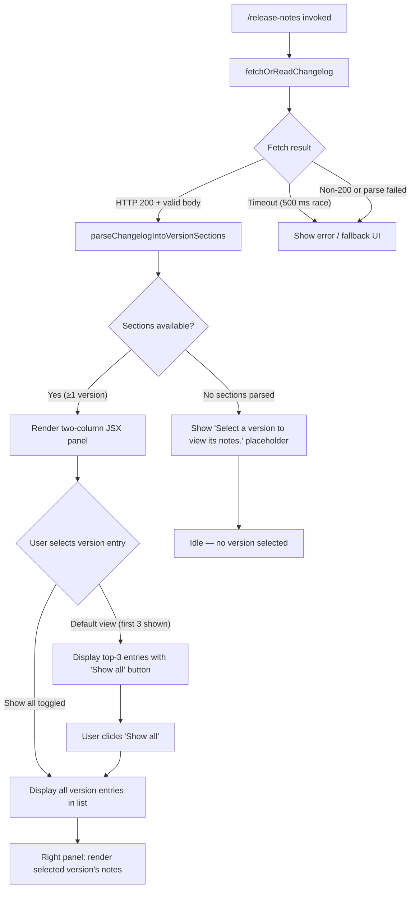

# `/release-notes`

> Analysis basis: CC v2.1.169 bundle.js (AST extraction + Claude interpretation)
> Minimum version: v2.1.169

---

## Overview

The `/release-notes` command opens an interactive JSX panel that allows the user to browse per-version release notes for Claude Code. It fetches or reads a changelog document (cached locally as `changelog.md`), parses it into versioned sections, and renders a two-column selector UI: a scrollable version list on the left and the selected version's notes on the right.

---

## Registration

| Field | Value |
|---|---|
| type | `local-jsx` |
| name | `release-notes` |
| description | `View release notes` |
| loc_byte | `12150354` |
| loc_byte_end | `12150495` |
| loc_line | `8364` |
| module_id | `tHK` |
| load_inline | `true` |
| arbor_handler.name | `YRf` |
| arbor_handler.fqn | `claude-2.1.169::YRf` |
| arbor_handler.kind | `AsyncFunction` |
| arbor_handler.resolution_path | `module_id` |
| arbor_handler.n_hits | `0` |

Analysis basis: CC v2.1.169 bundle.js:+12150354

---

## Input Branching

The command has four distinct rendering paths based on changelog fetch/parse state and user interaction, so a Mermaid flowchart is used.



Analysis basis: CC v2.1.169 bundle.js:+12148610 (timeout race), +12145257 (`changelog.md` cache path), +12149642 (placeholder string), +12149000 (`Show all` button), +12149083 (initial display count of 3)

---

## Behavioral Spec

### 1. Handler Entry Point — `releaseNotesHandler` (YRf)

The Arbor-resolved handler is `YRf`, an `AsyncFunction` resolved via `module_id → tHK`.

```
async function releaseNotesHandler(commandContext):
    // Race the changelog fetch against a 500 ms timeout
    timeoutPromise = new Promise((_, reject) =>
        setTimeout(() => reject(new Error("Timeout")), 500)
    )
    changelogResult = await Promise.race([
        fetchChangelogData(commandContext),   // y7A
        timeoutPromise
    ])
    if changelogResult is error or null:
        return renderErrorPanel()
    
    // Build the React element tree
    versionList = buildVersionList(changelogResult)   // Hx6
    renderPanel = buildRenderPanel(changelogResult)   // Hu8
    return <ReleaseNotesPanel versionList renderPanel />
```

Analysis basis: CC v2.1.169 bundle.js:+12148610, +12148628, +12148646, +12148660, +12148674, +12148703, +12148711

---

### 2. Changelog Fetch and Cache — `fetchChangelogData` (y7A)

```
async function fetchChangelogData(ctx):
    cacheDir  = joinPath(getBaseDir(), "cache")         // k7A → eb6.join + "cache"
    cachePath = joinPath(cacheDir, "changelog.md")      // literal "changelog.md"
    
    storeCtx = getAsyncLocalStore()                     // C9 → dSL.getStore
    
    // Attempt HTTP fetch via bootstrapFetch (X8 → UL8)
    response = await bootstrapFetch(changelogEndpoint, {
        headers: { "Content-Type": "application/json",
                   "User-Agent": <ua> }
    })
    
    if response.status == 200:                          // literal 200
        body = await response.json()
        writeToCache(cachePath, body)                   // UL8 → L.mkdirSync + write
        return body
    else:
        // Fall back to cached file if present
        return readCachedChangelog(cachePath)           // y7H → q.readFileSync, "utf-8"
```

Analysis basis: CC v2.1.169 bundle.js:+12145495, +12145510, +12145540, +12145257, +12145249, +12145606, +12145618, +12145629, +12145679, +12145690, +200 at +12145564, `"changelog.md"` at +12145257, `"cache"` at +12145249

---

### 3. Bootstrap Fetch Subsystem — `bootstrapFetch` (X8 / UL8)

```
function bootstrapFetch(url, opts):
    // Logs "[Bootstrap] Fetching" before dispatch
    debugLog("[Bootstrap] Fetching", url)               // literal at +16097956
    
    result = httpGet(url, {
        "Content-Type": "application/json",             // +16098041, +16098056
        "User-Agent":   <agent>,                        // +16098075
        timeout:        5000                            // +16098157
    })
    
    if parseFails:
        emitTelemetry("api_bootstrap_fetch", {
            status: "parse_failed"                      // +16098278, +16098300
        })
    else:
        debugLog("[Bootstrap] Fetch ok")                // +16098330
    
    return result
```

Analysis basis: CC v2.1.169 bundle.js:+16097954, +16097956, +16098041, +16098056, +16098075, +16098127, +16098157, +16098278, +16098300, +16098330

---

### 4. Changelog Parsing — `parseVersionSections` (_x6)

```
function parseVersionSections(rawText):
    lines = rawText.split("\n")                         // _x6 → H.split
    sections = []
    
    for each line in lines:
        line = line.trim()                              // q.trim
        if line starts with version heading:
            // Extract version label and date
            // " - " used as separator between version and date  // literal " - " at +12146065
            parts = line.split(" - ")
            versionLabel = parts[0].trim()
            dateLabel    = parts[1]?.trim()
            
            // Extract changelog bullet list starting with "- "  // literal "- " at +12146143
            bodyLines = collectUntilNextHeading(lines, currentIndex)
            sections.push({ version: versionLabel, date: dateLabel, body: bodyLines })
    
    return sections
```

Analysis basis: CC v2.1.169 bundle.js:+12145934, +12145983, +12146060, +12146065, +12146100, +12146123, +12146143

---

### 5. Version List Component — `buildVersionList` (Hx6)

```
function buildVersionList(changelogData):
    // Uses k7A to resolve file paths for assets
    cacheDirPath = resolveChangeCacheDir()              // k7A → eb6.join
    storeCtx = getAsyncLocalStore()                     // C9
    return <VersionListComponent data={changelogData} cachePath={cacheDirPath} />
```

Analysis basis: CC v2.1.169 bundle.js:+12145784, +12145806

---

### 6. Release Notes Panel Renderer — `buildRenderPanel` (Hu8)

```
function buildRenderPanel(changelogData):
    // Parse sections from changelog text
    sections  = parseVersionSections(changelogData)     // _x6
    keys      = Object.keys(sections)                   // +12146604
    filtered  = keys.filter(isValidSection)             // K.filter at +12146704
    
    // Dispatch individual section rendering
    for key in filtered:
        renderSection(sections[key], errorHandler)      // hH, wA
    
    return <PanelComponent sections={filtered} />
```

Analysis basis: CC v2.1.169 bundle.js:+12146573, +12146590, +12146604, +12146631, +12146704, +12146802, +12146805

---

### 7. JSX Panel Layout — `releaseNotesJSXComponent` (sHK)

```
function releaseNotesJSXComponent(props):
    // Initialize React memo cache (sentinel "react.memo_cache_sentinel") // +12149501
    cache = initMemoCache(19)                           // 19 cache slots, +12150077
    
    [selectedVersion, setSelectedVersion] = useState(null)
    [showAll, setShowAll] = useState(false)
    
    allVersions = props.versions                        // A.map at +12149098
    
    // Display logic: show first 3 versions by default  // literal 3 at +12149083
    displayVersions = showAll
        ? allVersions
        : allVersions.slice(0, 3)                      // aHK → H.slice at +12148485
    
    selectedNotes = allVersions.find(                  // A.find at +12149243
        v => v.version === selectedVersion
    )
    
    // Layout: column container                         // "column" at +12149575
    return (
        <Box flexDirection="column">
            <Text>Release notes</Text>                 // "Release notes" at +12150026
            <Box>
                {/* Left: version selector list */}
                <VersionList
                    versions={displayVersions}
                    onSelect={setSelectedVersion}
                    skipLabel="skip"                   // "skip" at +12149305
                />
                {!showAll && (
                    <Button onClick={() => setShowAll(true)}>
                        Show all                        // "Show all" at +12149000
                    </Button>
                )}
                {/* Right: notes panel */}
                {selectedVersion
                    ? <NotesPanel notes={selectedNotes} />
                    : <Text>Select a version to view its notes.</Text>}
                                                        // +12149642
            </Box>
        </Box>
    )
```

Analysis basis: CC v2.1.169 bundle.js:+12148921, +12149000, +12149083, +12149201, +12149203, +12149243, +12149305, +12149375, +12149456, +12149490, +12149501, +12149575, +12149642, +12150026, +12150077

---

### 8. Config I/O Subsystem (supporting persistence)

The changelog cache write path passes through the global config lock/write subsystem (`StK`, `UL8`, `WO6`), which enforces:

- A file lock with a 60 000 ms maximum acquisition wait (literal `60000` at +3272995).
- Atomic rename via a `.backup.` intermediate file (literal `".backup."` at +3273111).
- A maximum of 5 backup files retained (literal `5` at +3273244).
- File permissions `0o600` (octal `384`) applied to written files (literal `384` at +3273526).
- Refusal to overwrite if the re-read config is missing auth present in the in-memory cache (literals at +3272641, +3269335 — see also telemetry `tengu_config_auth_loss_prevented`).

Analysis basis: CC v2.1.169 bundle.js:+208403, +208436, +208466, +208573, +208605, +208611, +208644, +208661, +208670, +3272995, +3273111, +3273244, +3273526

---

## State & Side Effects

| Item | Detail |
|---|---|
| Telemetry — `tengu_feature_sad` | Emitted on feature-level errors (bundle.js:+1014069) |
| Telemetry — `tengu_config_lock_contention` | Emitted when config file lock takes longer than expected (bundle.js:+3272314) |
| Telemetry — `tengu_config_stale_write` | Emitted when a stale write is detected (bundle.js:+3272450) |
| Telemetry — `tengu_config_parse_error` | Emitted when config JSON cannot be parsed (bundle.js:+3274889) |
| Telemetry — `tengu_config_auth_loss_prevented` | Emitted when write is refused to prevent auth data loss (bundle.js:+3272793) |
| Fetch telemetry — `api_bootstrap_fetch` | Emitted with `status: "parse_failed"` on JSON parse failure (bundle.js:+16098278) |
| Cache side effect | Writes `changelog.md` into a `cache/` subdirectory under the Claude data dir (bundle.js:+12145249, +12145257) |
| Config locking | Acquires a file-system lock before any config/cache write; emits `tengu_config_lock_contention` on contention (bundle.js:+3272314) |
| File backup rotation | Keeps up to 5 `.backup.*` rotated copies of overwritten files (bundle.js:+3273111, +3273244) |
| Hook registration | `ZGA.register` called from `Z9` (bundle.js:+62328) — likely a cleanup/exit hook |
| Timer — `setTimeout` 500 ms | Races changelog fetch; rejects with `"Timeout"` on expiry (bundle.js:+12148610, +12148646) |
| Timer — `setTimeout` / `clearTimeout` | Used by the debounce/batch writer `TBH` for config writes (bundle.js:+61630, +61742, +61906) |
| React memo cache | 19-slot memo cache allocated for the JSX panel (bundle.js:+12150077) |
| appState changes | No direct `appState` mutation observed within depth-2 traversal |
| Sound | None observed |

---

## Version History

| Version | Change |
|---|---|
| v2.1.169 | Initial analysis |

---

## Common Mistakes

1. **Expecting instant rendering**: The handler races a 500 ms timeout against the network fetch. On slow connections the command may display a fallback/error panel even when the changelog is available — the local cache path (`cache/changelog.md`) is the recovery path.
2. **Assuming all versions are listed by default**: Only the first 3 version entries are shown on initial render. The user must click **Show all** to expand the full list.
3. **Editing the cache file directly**: The cache is written through the config-lock subsystem with atomic rename and permission enforcement (`0o600`). Manual edits outside this subsystem may be overwritten or cause auth-loss-prevention refusals.
4. **Triggering command offline without a cached file**: If neither the network fetch succeeds nor a `cache/changelog.md` file exists, the panel will show an empty or error state with no version selectable.
5. **Confusing `local-jsx` type with a prompt-type command**: `/release-notes` renders a JSX component directly — it does not submit a text prompt to the agent and produces no conversation turn.

---

## Appendix — Identifier Mapping

> For bundle debugging only. Identifiers change across versions.

| Identifier | Role |
|---|---|
| `YRf` | Main async handler for `/release-notes` (Arbor-resolved entry point) |
| `y7A` | Changelog fetch-and-cache orchestrator |
| `k7A` | Cache directory path builder (joins `eb6` path + `"cache"` + `"changelog.md"`) |
| `C9` | AsyncLocalStorage store accessor (`dSL.getStore`) |
| `X8` | Bootstrap fetch dispatcher (wraps `UL8`) |
| `UL8` | Low-level HTTP bootstrap fetch + file write helper |
| `y7H` | Config/cache file reader with error handling |
| `hT1` | Config object merger (`Object.assign`) |
| `Hx6` | Version list component builder |
| `Hu8` | Release notes render-panel builder |
| `_x6` | Changelog text parser (splits into version sections) |
| `q9` | Section boundary detector (indexOf + slice) |
| `sHK` | Top-level JSX panel component (two-column layout) |
| `aHK` | Version list slicer (applies initial 3-item limit via `H.slice`) |
| `h7A` | Version entry mapper (`_.map`) |
| `YJ` | JSX element factory / React createElement wrapper |
| `StK` | Config write coordinator (dispatches lock, write, backup) |
| `TBH` | Debounced/batched writer (clearTimeout / setTimeout / setImmediate) |
| `_4H` | Path assembly helper (`P6H.join`, `A_`, `I6`) |
| `MZA` | Atomic write path joiner |
| `Vo8` | File rename/unlink helper (`.txt` swap, `Mh.rename`, `Mh.unlink`) |
| `htK` | Append-file writer with mkdir and size check |
| `Z9` | Exit-hook registrar (`ZGA.register`) |
| `WO6` | Atomic file write with lock, symlink resolution, and fsync |
| `UL8` | Config persistence driver (mkdir, stat, backup rotation, copy) |
| `pL8` | Persistence write path finisher |
| `n56` | Error-code classifier (`E8` dispatcher) |
| `E8` | Low-level error handler |
| `ItK` | Config read helper (`RI`, `fZA`, `vGA`) |
| `vGA` | Config value accessor (`yoK`, `hoK`) |
| `N` | Network/HTTP request executor |
| `sBH` | HTTP debug logger |
| `CH` | `JSON.stringify` wrapper |
| `R4` | URL/path transformer (`qZA`, `H.replace`, `q.at`, `A.lastIndexOf`, `A.slice`) |
| `qZA` | URL segment mapper (`ZtK.map`) |
| `rBH` | Write-stream helper (`lEA`) |
| `lEA` | Stream write executor (`H.write`) |
| `M9` | Markdown/text processor (`Cc`, `c9`, `eD`) |
| `Cc` | Markdown block parser (`tY`, `pU`, `FA`, `CC`) |
| `CC` | Markdown inline parser (trim, startsWith, includes, etc.) |
| `c9` | Token normalizer (toLowerCase, replace, `TLH`, `Mk`, `QcH`, `AE`, `dG1`, `zM`) |
| `eD` | Document-level parser entry (`c9`, `hG`) |
| `hG` | Block-level render dispatcher (`yA`, `h8H`, `cDH`, `ccH`, `AE`, `x2`, `zM`, `YA`, `F5`, `Mk`) |
| `Mk` | Inline formatting handler (`zM`, `F5`) |
| `QcH` | Code-span handler (`F5`) |
| `AE` | Emphasis/strong handler (`zM`, `F5`, `YA`) |
| `dG1` | Nested emphasis handler (`AE`) |
| `zM` | Text node builder (`YA`) |
| `TLH` | Language tag checker (`GLH.includes`) |
| `__8` | Fence language validator (`Q5L.includes`) |
| `dcH` | Directive handler (`_6`) |
| `u2` | Unicode normalizer (`ZLH`) |
| `D3K` | Session context recorder (`Oa`, `Date.now`, `C9`, `tx6`, `CH`) |
| `hH` | Section render dispatcher (`wA`, `_6`, `kq`, `av4`) |
| `wA` | Error stringifier (`Error`, `String`) |
| `av4` | Queue rotation helper (`Di6.shift`, `Di6.push`) |
| `o6` | Feature-flag evaluator (`d`, `K6`) |
| `K6` | Feature-flag resolver (`c76`) |
| `w2_` | Version string parser (split, trim, indexOf, slice) |
| `u6H` | Seen-set membership checker (`vO4.has`) |
| `n3` | String sanitizer (`H.replace`) |
| `P$` | Unknown — reached from `H` at +16098088 |
| `OJH` | Unknown — reached from `X8` at +3269184 |
| `ViH` | Unknown — reached from `X8`/`UL8`; likely file-integrity checker |
| `VG` | Unknown — reached from `X8`/`UL8`; likely path validator |
| `yG_` | Directory path joiner (`fw.join`, `A_`) |
| `MP6` | Timestamp recorder (`Date.now`) |
| `Ie1` | Config-entry enumerator (`Object.entries`) |
| `F_` | Unknown — reached from `y7A` at +12145495 |
| `kq` | Telemetry dispatch wrapper (`duA`) |
| `duA` | Telemetry string coercer (`_6`) |
| `_6` | Value-to-string coercer (`String`) |
| `ex8` | Unknown — reached from `Hu8` at +12146573 |
| `$` | Stream/chunk accumulator (`D3K`) |
| `K` | Column formatter (`L.map`, `f.padEnd`) |
| `P` | Binary stream reader (`Buffer.concat`, `X.indexOf`, etc.) |
| `E` | Slice bounds calculator (`Math.max`, `Math.min`) |
| `f` | Connection/socket close handler (`A.close`, `q.close`, `L`) |
| `L` | Tracked-promise set manager (`q.add`, `f.finally`, `q.delete`) |

---

Note: index built via Arbor fallback; some signals (telemetry, literals) may be missing — see arbor-fallback.js.