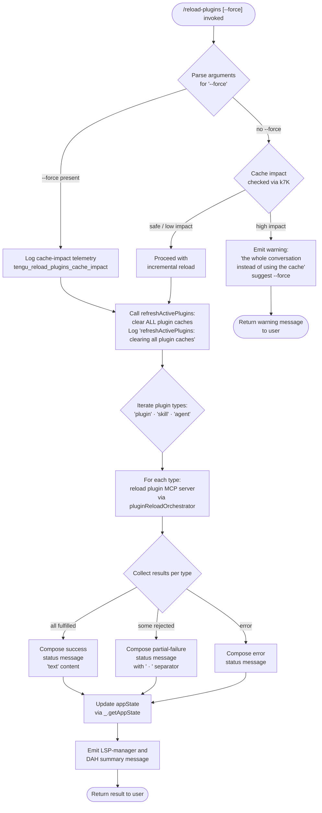

# `/reload-plugins`

> Analysis basis: CC v2.1.169 bundle.js (AST extraction + Claude interpretation)
> Minimum version: v2.1.169

---

## Overview

`/reload-plugins` activates any pending plugin changes (plugins, skills, and agent MCP servers) in the current Claude Code session without requiring a full restart. When invoked with the optional `--force` flag it bypasses cache-impact safety checks and unconditionally clears all plugin caches before re-scanning; without `--force` it performs an incremental reload and may warn the user if a full conversation reload would be safer.

---

## Registration

| Field | Value |
|---|---|
| type | `local` |
| name | `reload-plugins` |
| description | `Activate pending plugin changes in the current session` |
| argumentHint | `[--force]` |
| supportsNonInteractive | `false` |
| thinClientDispatch | `control-request` |
| module_id | `y7K` |
| load_inline | `true` |
| loc_byte | `12732841` |
| loc_byte_end | `12733085` |
| loc_line | `9106` |
| arbor_handler.name | `vFf` |
| arbor_handler.fqn | `claude-2.1.169::vFf` |
| arbor_handler.kind | `AsyncFunction` |
| arbor_handler.resolution_path | `module_id` |
| arbor_handler.n_hits | `0` |

Analysis basis: CC v2.1.169 bundle.js:+12732841

---

## Input Branching

The handler has 4+ distinct execution paths depending on the `--force` flag, on whether any active plugins are loaded in the current session, on cache-impact severity, and on the outcome of the plugin re-scan. A Mermaid flowchart is used.



Analysis basis: CC v2.1.169 bundle.js:+12731539, +12731590, +12731635, +12731925, +12732039

---

## Behavioral Spec

### 1. Argument Parsing and Force-Flag Detection

```
async function reloadPluginsHandler(args, context):
    rawArgs = args.trim()                        // H.trim at +12731925
    forceFlag = rawArgs.includes("--force")      // literal "--force" at +12731961
    // "force" key extracted from parsed args    // literal "force" at +12731976
    return executeReload(forceFlag, context)
```

Analysis basis: CC v2.1.169 bundle.js:+12731925, +12731961, +12731976

---

### 2. Cache-Impact Assessment (no `--force`)

When `--force` is absent, a cache-impact calculation (handler `k7K`) is performed before any destructive operation. If the impact is judged significant, the handler returns an early warning message containing the fragment `"the whole conversation instead of using the cache. Run /reload-plugins --force to apply."` and does **not** proceed with the reload.

```
function assessCacheImpact(context):
    impact = computeImpact(context)        // k7K at +12730831
    if impact.severity == HIGH:
        return warningMessage(
            "the whole conversation instead of using the cache." +
            " Run /reload-plugins --force to apply."
        )
    return null
```

The literal warning fragment is at bundle.js:+12731424.

Analysis basis: CC v2.1.169 bundle.js:+12732145, +12731424

---

### 3. Cache Clearance (`--force` path or low-impact path)

`refreshActivePlugins` (handler `V$H`) is called to purge the plugin layer. When `--force` is set it first logs `"refreshActivePlugins: clearing all plugin caches"` and invokes the cache-clear helper (`O$` → `ZS` → `jR8.clear`). The "Cleared installed plugins cache" diagnostic is emitted by `Fpq` at +10774284.

```
async function refreshActivePlugins(force, context):
    if force:
        log("refreshActivePlugins: clearing all plugin caches")
        clearInstalledPluginsCache()           // O$ path at +10738209
        clearSkillIndexCache()                 // H.clearSkillIndexCache at +13315774
        clearJR8Cache()                        // ZS / jR8.clear at +10708354
    return reloadAllPluginSlots(context)
```

Analysis basis: CC v2.1.169 bundle.js:+12728511, +12728563, +12728569, +10708354, +10774284

---

### 4. Plugin Re-Scan and Type Iteration

The handler iterates over three plugin-type strings in order: `"plugin"` (bundle.js:+12731655), `"skill"` (+12731686), and `"agent"` (+12731714). For each type it calls the plugin-load orchestrator (`ku_` → `g1A` → `F1A`) which:

1. Resolves the plugin root directory (`"pluginRoot"` key at +5038421).
2. Loads marketplace metadata via `F1A` (uses `Promise.allSettled` at +10830029 to tolerate partial failures).
3. Classifies load outcomes into: `"fulfilled"` (+10831446), `"rejected"` (+10831502), or `"generic-error"` (+10831618).
4. Emits telemetry `"plugin_load_all"` (+10849830), `"plugin_load_total_failure"` (+10849848), or `"plugin_load_partial_failures"` (+10849917) as appropriate.
5. Guards against stale early-kick via the diagnostic `"assemblePluginLoadResult: originalCwd changed mid-scan; skipping side-effects (stale early-kick)"` (+10849983).

```
async function loadAllPluginTypes(context):
    results = {}
    for type in ["plugin", "skill", "agent"]:
        outcomes = await Promise.allSettled(
            loadPluginSlotForType(type, context)
        )
        results[type] = classifyOutcomes(outcomes)
    return results
```

Analysis basis: CC v2.1.169 bundle.js:+12731655, +12731686, +12731714, +10829951, +10830029, +10849830

---

### 5. MCP Server Reconnection per Plugin Type

After cache clearance and re-scan, the active MCP manager (`mSH`) reconnects each plugin MCP server. The `"plugin MCP server"` literal at +12731746 is used to label the server type in status messages. Connections are attempted per transport type (`"stdio"` at +6687781, `"sse"` at +6687815, etc.). The result separator `" · "` (+12731773) is inserted between type-specific status fragments when building the returned message.

```
async function reconnectPluginServers(reloadResults):
    messageParts = []
    for [type, result] in reloadResults.entries():
        serverLabel = type + " MCP server"   // e.g. "plugin MCP server"
        part = buildStatusFragment(serverLabel, result)
        messageParts.push(part)
    return messageParts.join(" · ")
```

Analysis basis: CC v2.1.169 bundle.js:+12731746, +12731773, +6687781

---

### 6. LSP-Manager Update

After plugin reconnection, the LSP-manager shard (`ZFf`, `VFf`) filters and maps the new plugin set. The literal `"lsp-manager"` (+12730032) and `"plugin:"` prefix (+12730067) are used as internal scope keys. Hook registration is updated via the `L$H` handler (which calls `eR6` for extension conflict detection, labelled `"lsp-extension-conflict"` at +6737639).

```
function updateLspManager(newPluginSet):
    filtered = newPluginSet.filter(isLspCapable)   // ZFf at +12730007
    for plugin in filtered:
        key = "plugin:" + plugin.name              // +12730067
        registerHooks(key, plugin)                 // L$H at +11868280
```

Analysis basis: CC v2.1.169 bundle.js:+12730032, +12730067, +12729187, +12729220

---

### 7. Final Message Assembly and Return

The handler assembles the final user-facing message using `DAH` (at +12732346) and returns a content block of type `"text"` (+12731903). If any error occurred, `"error"` (+12731828) is used as the content type.

```
function buildReturnMessage(reloadSummary, hasError):
    contentType = "error" if hasError else "text"
    body = formatSummary(reloadSummary)    // DAH at +12732346
    return { type: contentType, content: body }
```

Analysis basis: CC v2.1.169 bundle.js:+12731903, +12731828, +12732346

---

## State & Side Effects

| Item | Detail |
|---|---|
| Telemetry | `tengu_reload_plugins_cache_impact` (bundle.js:+12730833) — fired when `--force` is used or cache impact is assessed; `tengu_plugin_state_file_error` (+10774463) — fired on plugin state file I/O error; `tengu_daemon_config_reload` (+16521994) — may fire if daemon config reloads as a side-effect; `tengu_skill_file_changed` (+14374647) — fired when a skill file change is detected during re-scan |
| Plugin cache | All installed-plugin caches cleared when `--force` is set or impact is low (`jR8.clear` at +10708354, `clearSkillIndexCache` at +13315774) |
| LSP hooks | Hook registrations updated via `L$H` / `eR6`; extension conflicts recorded under `"lsp-extension-conflict"` key |
| MCP server connections | Existing plugin MCP server connections stopped/restarted via `mSH` and `cd8`; orphaned connections disposed with log messages at +16176453 and +16176538 |
| appState changes | `_.getAppState()` called at +12732039 to publish the updated plugin set to the session state |
| Safe-mode guard | If `--safe-mode` CLI flag is set, plugin hook registration is skipped with the message `"Safe mode: skipping plugin hook registration"` (+5038141) |
| Sound | None detected in depth-2 traversal |

---

## Version History

| Version | Change |
|---|---|
| v2.1.169 | Initial analysis |

---

## Common Mistakes

1. **Omitting `--force` when plugins are heavily cached** — Without `--force`, a high cache-impact situation causes the command to return a warning and perform no reload. If the warning appears, re-run with `/reload-plugins --force`.
2. **Using `/reload-plugins` in non-interactive mode** — `supportsNonInteractive: false` means the command is unavailable in headless/script contexts; it will be silently ignored or rejected.
3. **Expecting immediate MCP tool availability** — MCP server reconnection is asynchronous (`Promise.allSettled`); newly registered tools may not appear in the very next prompt if the server takes time to start.
4. **Conflating plugin cache clearance with full session reset** — `/reload-plugins` clears plugin caches and reconnects servers but does **not** reset conversation history or re-execute any system prompts.
5. **Running in safe-mode** — If Claude Code was started with `--safe-mode`, the command skips hook registration entirely; plugin hooks will remain inactive regardless of the reload outcome.

---

## Appendix — Identifier Mapping

> For bundle debugging only. Identifiers change across versions.

| Identifier | Role |
|---|---|
| `vFf` | Main handler for `/reload-plugins` (AsyncFunction, fqn `claude-2.1.169::vFf`) |
| `tj` | Argument-tokeniser / command parser helper |
| `UL` | Utility called by argument parser and directly by handler |
| `$ZH` | Sub-utility of `UL` |
| `Yr` | Plugin-type iteration setup helper |
| `S8` | Low-level string/result helper |
| `I7K` | Cache-impact assessment orchestrator |
| `k7K` | Cache-impact computation (calls `d`) |
| `nu9` | Plugin load core loop |
| `ku_` | Plugin loader dispatcher |
| `g1A` | Plugin load assembly / result aggregation |
| `F1A` | Per-slot plugin loader (marketplace + local) |
| `Tt` | MCP server supervisor / connection manager |
| `V$H` | `refreshActivePlugins` — cache-clear + re-scan entry point |
| `O$` | Installed-plugins cache cleaner |
| `jV` | Skill-index cache cleaner |
| `fp` | `H.clearSkillIndexCache` caller |
| `ZS` | `jR8.clear` caller |
| `Fpq` | Logs "Cleared installed plugins cache" |
| `IXf` | Plugin-root resolver |
| `XR_` | Plugin-root map builder |
| `hH` | Plugin-hook loader utility |
| `mSH` | MCP manager — reconnects plugin MCP servers |
| `cd8` | Applies MCP connection results; disposes orphaned connections |
| `dXA` | Iterates MCP clients for reconnection |
| `ZFf` | LSP-manager plugin filter (pre-existing set) |
| `VFf` | LSP-manager plugin filter (new set) |
| `L$H` | LSP hook registration / update |
| `eR6` | LSP extension-conflict and hook orchestration |
| `NFf` | Fragment splitter for plugin name path (`A.split`) |
| `DAH` | Final message body formatter |
| `N7K` | Plugin-type classifier used by `ZFf` |
| `Gt` | Plugin directory scanner |
| `ME6` | Marketplace plugin file loader |
| `ku9` | Plugin status and type collector |
| `Xu_` | MCPB/DXT manifest reader |
| `USH` | LSP config (`.lsp.json`) reader |
| `_j8` | LSP-extension-conflict detector |
| `vy` | Known-marketplaces reader |
| `o5` | `known_marketplaces.json` file loader |
| `ne` | Plugin marketplace directory reader |
| `k1A` | Plugin config file reader |
| `BE` | Plugin-scope resolver |
| `eR6` | Plugin resolution and hook-registration engine |
| `gD` | Output-token counter helper |
| `N0` | Plugin load status aggregator |
| `wN` | Permission / policy check for plugins |
| `pS_` | TST / auto-context size helper |
| `_t` | Model-string normaliser |
| `NA7` | Context-level lookup |
| `D6` | Tool-search / model-feature resolver |
| `StK` | File-based write log helper |
| `TBH` | Debounced write batcher |
| `_4H` | Log-path builder |
| `n56` | Log error-classifier |
| `MZA` | Log path joiner |
| `Vo8` | Log file rotator |
| `htK` | Log file appender |
| `Z9` | Signal/ZGA event registrar |
| `H` | HTTP fetch / bootstrap utility (context-dependent) |
| `M9` | Model-alias resolver |
| `Cc` | Model-string parser |
| `CC` | Model-string normaliser |
| `c9` | Model-specifier canonical form builder |
| `Mw` | Policy-settings checker |
| `FP` | MCP config file loader (`.mcp.json`) |
| `A1H` | MCP auto-discovery loader |
| `Vw8` | MCP server entry processor |
| `JJ7` | Duplicate-server suppression map |
| `VV` | Server connection validator |
| `w` | Background-session / daemon-worker manager |
| `D` | Forced-shutdown handler |
| `Y` | Session I/O manager |
| `y` | Chokidar file-watcher wrapper |
| `wQ` | Rate-limit event dispatcher |
| `GH` | Boolean feature-gate helper |
| `XH` | Full MCP plugin-set connection manager |
| `xF9` | MCP SDK connect/capabilities handshake |
| `ngK` | VS Code ccd-session matcher |
| `jH` | MCP message handler / elicitation dispatcher |
| `gH` | Refusal-retraction / assistant-history controller |
| `o` | Plugin state update / MCP-update applier |
| `s` | MCP connection result applier |
| `n` | Voice/conversation session controller |
| `t` | Voice recording session manager |
| `KH` | Session-state container |
| `lmK` | Boolean coercer for session flags |
| `B` | Daemon idle-exit / repaint timer |
| `l` | Scheduled-task / session runner |
| `Q06` | xaH-based scoring helper |
| `eO8` | xaH-based max-scoring helper |
| `OH` | Process-exit guard set |
| `PU` | Graceful-shutdown race helper |
| `z` | Stopped/background session state map |
| `rh` | Signal listener registrar |
| `bH` | Background-task "bad" notifier |
| `SH` | Background-task "ok" notifier |
| `t_` | Settings-file writer |
| `WO6` | Atomic file-write helper |
| `Or6` | Git-ignore / settings-tracking helper |
| `yO` | Cache-clear helper (aB6 + Cl8) |
| `DB` | Settings-load orchestrator |
| `sR6` | Plugin path security validator |
| `m4` | OTEL metric emitter |
| `pyH` | OTEL resource-attribute builder |
| `ev` | Extension-type normaliser |
| `t3` | `_6` string builder |
| `DAH` | Final-message body formatter (also listed above) |

---

Note: index built via Arbor fallback; some signals (telemetry, literals) may be missing — see arbor-fallback.js.