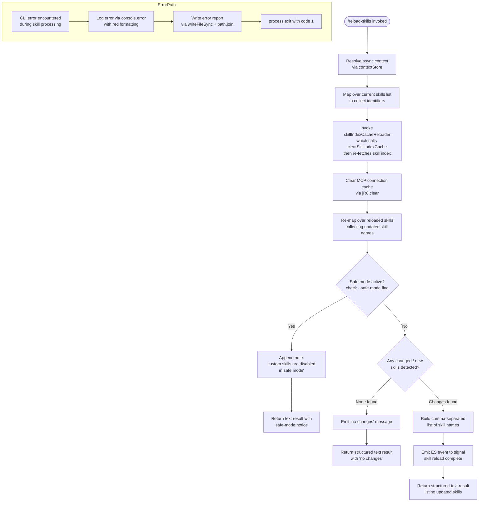

# `/reload-skills`

> Analysis basis: CC v2.1.169 bundle.js (AST extraction + Claude interpretation)
> Minimum version: v2.1.169

---

## Overview

The `/reload-skills` command rescans the filesystem for skill definitions that were added or modified during the current session, then refreshes all relevant in-memory caches so the agent can immediately use the updated skills. It collects the names of newly loaded or changed skills, emits a summary message to the user, and returns a structured text result describing what changed (or reports that there were no changes).

---

## Registration

| Field | Value |
|---|---|
| type | `local` |
| name | `reload-skills` |
| description | `Pick up skills added or changed on disk during this session` |
| loc_byte | `12733677` |
| loc_byte_end | `12733894` |
| loc_line | `9106` |
| supportsNonInteractive | `true` |
| thinClientDispatch | `post-text` |
| module_id | `R7K` |
| load_inline | `true` |
| arbor_handler.name | `kFf` |
| arbor_handler.fqn | `claude-2.1.169::kFf` |
| arbor_handler.kind | `AsyncFunction` |
| arbor_handler.resolution_path | `module_id` |
| arbor_handler.n_hits | `0` |

Analysis basis: CC v2.1.169 bundle.js:+12733677

---

## Input Branching

Four distinct branches exist: safe-mode guard, skill cache clear + reload, change detection (found vs. none), and error/exit path. A Mermaid flowchart is used.



Analysis basis: CC v2.1.169 bundle.js:+12733157 through +12733564

---

## Behavioral Spec

### 1. Handler Entry — `reloadSkillsHandler` (`kFf`)

The Arbor-resolved handler is the async function `kFf`. It is the sole entry point for this command and orchestrates all sub-steps.

```
async function reloadSkillsHandler(commandContext):
    ctx = await resolveAsyncContext()          // C6 → Wi6 → contextStore.getStore
    previousSkillIds = currentSkillList.map(collectIdentifiers)  // Jj + q.map

    // Clear and reload the skill index cache
    await reloadSkillIndex()                   // jV → fp → H.clearSkillIndexCache

    // Clear the MCP connection cache
    clearMcpCache()                            // ZS → jR8.clear

    // Collect updated skill names from reloaded list
    updatedSkillNames = reloadedSkillList.map(extractSkillName)  // L.map

    // Emit a system event signalling reload is complete
    eventEmitter.emit(reloadEvent)             // ES.emit

    // Determine safe-mode state
    safeMode = isSafeModeEnabled()             // CK → _6 / xF6, literal "--safe-mode"

    if safeMode:
        notice = " (custom skills are disabled in safe mode)"
        return buildTextResult(notice)         // literal @ +12733447

    changedSkills = detectChanges(previousSkillIds, updatedSkillNames)  // K.has, f.has

    if changedSkills is empty:
        summaryText = "no changes"             // literal @ +12733427
    else:
        summaryText = changedSkills.join(", ") // O.join, literal ", " @ +12733421

    return buildSkillTextResult(summaryText, type="skill")  // S8, literal "skill" @ +12733564
```

Analysis basis: CC v2.1.169 bundle.js:+12733157

---

### 2. Async Context Resolution — `resolveAsyncContext` (`C6`)

Retrieves the current execution context from an async-local storage store.

```
function resolveAsyncContext():
    store = asyncContextStore.getStore()   // Wi6 → Pi6.getStore @ +1024193
    if store is null:
        return fallbackContext()           // Wi6 → Td @ +1024214
    globalState = getGlobalState()         // G_ → xZ @ +43222
    return mergeContextWithGlobal(store, globalState)
```

Analysis basis: CC v2.1.169 bundle.js:+1024244

---

### 3. Skill Index Cache Reload — `skillIndexCacheReloader` (`jV`)

Clears the existing in-memory skill index cache and triggers a fresh load.

```
async function skillIndexCacheReloader():
    await skillFetchWrapper()              // fp → Promise.resolve, C4A @ +13315722
    skillIndexStore.clearSkillIndexCache() // fp → H.clearSkillIndexCache @ +13315774
    await zipResultLoader()               // ZR8 @ +13315826
    await jsonSkillParser()               // jpq @ +13315832
    await underscoreHelperLoader()        // _uH → BS6 @ +13315838
```

Analysis basis: CC v2.1.169 bundle.js:+13315821

---

### 4. Bootstrap Fetch Sub-routine — `bootstrapFetcher` (`H` / `fp`)

Performs an HTTP fetch to retrieve the skill manifest. Called during cache reload.

```
async function bootstrapFetcher(endpoint):
    log("debug", "[Bootstrap] Fetching", endpoint)   // literals @ +16097956, +208891
    response = await fetch(endpoint, {
        headers: {
            "Content-Type": "application/json",      // literal @ +16098041
            "User-Agent": buildUserAgent()            // literal @ +16098075
        },
        timeout: 5000                                 // literal @ +16098157
    })
    if response.ok:
        log("[Bootstrap] Fetch ok")                  // literal @ +16098330
        data = await response.json()
        emitTelemetry("api_bootstrap_fetch")         // literal @ +16098278
        return data
    else:
        emitTelemetry("api_bootstrap_fetch", status="parse_failed")  // literal @ +16098300
        throw fetchError
```

Analysis basis: CC v2.1.169 bundle.js:+16097954

---

### 5. MCP Cache Clear — `mcpCacheClearer` (`ZS`)

Clears the MCP connection/session cache map so stale MCP-based skills are evicted.

```
function mcpCacheClearer():
    mcpConnectionMap.clear()   // ZS → jR8.clear @ +10708354
```

Analysis basis: CC v2.1.169 bundle.js:+10708354

---

### 6. Change Detection and Name Collection

After reload, the handler compares previously known skill identifiers with the newly loaded set.

```
function detectChangedSkills(previousIds, reloadedSkills):
    changedNames = []
    for skill in reloadedSkills:
        skillId = extractId(skill)
        if not previousIds.has(skillId):          // K.has @ +12733291
            changedNames.push(skillId)
        else if skill content changed:             // f.has @ +12733319
            changedNames.push(skillId)
    return changedNames                           // O.push @ +12733346
```

Analysis basis: CC v2.1.169 bundle.js:+12733291

---

### 7. Error Handler — `cliErrorWriter` (`$1` / `smH`)

Called if a fatal error is encountered during skill processing (e.g., disk read failure).

```
function cliErrorWriter(error):
    formattedMsg = redFormatter(error.message)    // smH → J6.red @ +13208340
    console.error(formattedMsg)                   // smH → console.error @ +13208326
    writeErrorReport(error, type="cli_error")     // ij → nBH.writeFileSync @ +194899
    reportPath = path.join(reportDir, reportFile) // ij → Do8.join @ +194917
    process.exit(1)                               // literal 1 @ +13208407
```

Analysis basis: CC v2.1.169 bundle.js:+13208371

---

### 8. Safe-Mode Detection — `safeModeFlagChecker` (`CK`)

Checks whether the `--safe-mode` CLI flag is active. When true, custom skills cannot be reloaded.

```
function safeModeFlagChecker():
    rawArgs = parseCliArgs()              // CK → _6 @ +64503, _6 → String @ +27126
    hasSafeMode = rawArgs.includes("--safe-mode")  // literal @ +64546
    return hasSafeMode
```

Analysis basis: CC v2.1.169 bundle.js:+64503

---

### 9. Result Construction — `buildSkillTextResult` (`S8`)

Produces the final structured result object returned to the CLI output layer.

```
function buildSkillTextResult(summaryText, type):
    // type is always "skill" (literal @ +12733564)
    // summaryText is either "no changes" or comma-joined skill names
    return {
        type: "text",                       // literal @ +12733507
        content: summaryText,
        skillType: type
    }
```

Analysis basis: CC v2.1.169 bundle.js:+12733552

---

## State & Side Effects

| Item | Detail |
|---|---|
| Telemetry | `tengu_feature_sad` (bundle.js:+1014069) — fired within `o6` sub-path reached via `H` / bootstrapFetcher chain |
| Skill index cache | Cleared and reloaded via `H.clearSkillIndexCache` (bundle.js:+13315774) |
| MCP connection cache | Fully cleared via `jR8.clear` (bundle.js:+10708354) |
| Event emission | `ES.emit` fires a reload-complete event (bundle.js:+12733264) |
| appState changes | Skill list in memory is replaced with the freshly scanned set |
| Error reporting | On fatal error: writes a report file via `nBH.writeFileSync` + `Do8.join`, then calls `process.exit(1)` (bundle.js:+194899) |
| Safe-mode guard | When `--safe-mode` flag is present, reload is skipped and a notice is returned (bundle.js:+12733447) |
| Sound | <!-- TODO: not found in depth-2 traversal; needs --depth 4 --> |

---

## Version History

| Version | Change |
|---|---|
| v2.1.169 | Initial analysis |

---

## Common Mistakes

1. **Running `/reload-skills` in safe mode and expecting changes to apply** — when `--safe-mode` is active, the command will return the notice `" (custom skills are disabled in safe mode)"` and custom skills will not be usable regardless of what is on disk.
2. **Assuming the command reloads MCP server definitions** — while the MCP connection cache (`jR8`) is cleared as a side effect, `/reload-skills` is specifically scoped to filesystem skill files; full MCP server reconnection may require a separate action.
3. **Expecting an error message when no skills changed** — the command returns `"no changes"` as a normal (non-error) result when nothing has been added or modified; this is not a failure state.
4. **Calling the command in non-interactive scripts without checking `supportsNonInteractive`** — the registration sets `supportsNonInteractive: true`, so the command is safe to call from automated pipelines; however, callers should still handle the `thinClientDispatch: "post-text"` routing behaviour.
5. **Ignoring the `process.exit(1)` risk** — if a disk-level error occurs during skill file reading, the error handler will terminate the entire CLI process after writing a report; ensure the skills directory is readable before relying on this command in automation.

---

## Appendix — Identifier Mapping

> For bundle debugging only. Identifiers change across versions.

| Identifier | Role |
|---|---|
| `kFf` | Main handler: `reloadSkillsHandler` (AsyncFunction, Arbor-resolved) |
| `C6` | Async context resolver |
| `Wi6` | Async-local storage accessor |
| `Td` | Fallback context builder |
| `G_` | Global state accessor |
| `xZ` | Global state store |
| `q` | Skill list / data collection iterator |
| `$1` | CLI error writer dispatch |
| `smH` | Red-formatted console error emitter |
| `ij` | Error report file writer |
| `jV` | Skill index cache reloader |
| `fp` | Skill fetch wrapper (calls clearSkillIndexCache) |
| `H` | Bootstrap fetcher / skill index manager |
| `N` | Bootstrap fetch sub-helper (URL/header builder) |
| `P$` | Skill manifest parser helper |
| `w2_` | String split/trim/slice utility for skill parsing |
| `u6H` | Set membership checker (`vO4.has`) |
| `n3` | String replacer helper |
| `M9` | Skill entry normalizer (`Cc`, `c9`, `eD`) |
| `o6` | Telemetry emitter path (`tengu_feature_sad`) |
| `ZR8` | Zip/archive result loader |
| `jpq` | JSON skill parser |
| `_uH` | Underscore-helper loader |
| `BS6` | Background session store accessor (`jh8.get`) |
| `pS6` | Background session helper |
| `ZS` | MCP cache clearer (`jR8.clear`) |
| `L` | Reloaded skill list mapper / connection closer |
| `f` | Individual connection closer (`A.close`, `q.close`) |
| `A` | Connection object with `toLowerCase` normalisation |
| `g8` | Utility helper (delegates to `_`) |
| `_` | Low-level utility function |
| `K` | Skill name padder / changed-skill detector |
| `O` | Changed skill names accumulator (array) |
| `S8` | Structured text result builder |
| `CK` | Safe-mode flag checker |
| `_6` | CLI arg parser / string converter |
| `xF6` | Safe-mode arg value extractor |

---

Note: index built via Arbor fallback; some signals (telemetry, literals) may be missing — see arbor-fallback.js.