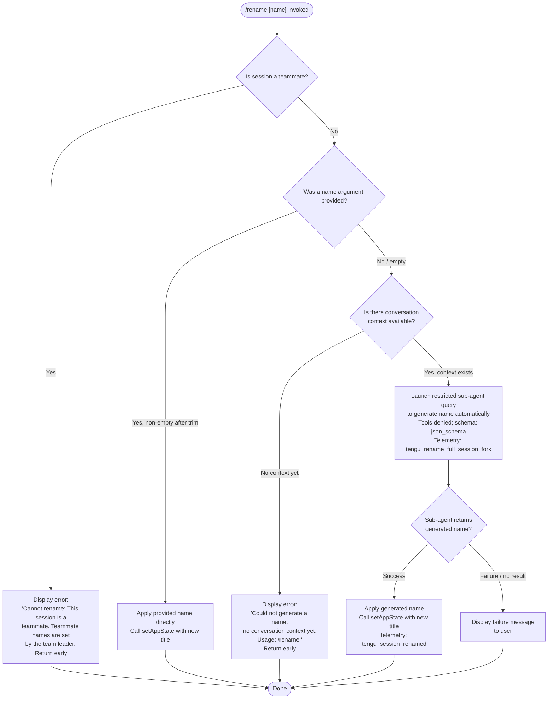

# `/rename`

> Analysis basis: CC v2.1.169 bundle.js (AST extraction + Claude interpretation)
> Minimum version: v2.1.169

---

## Overview

The `/rename` command renames the current conversation session. It accepts an optional name argument; when no name is supplied and sufficient conversation context exists, it automatically generates a name by running a restricted AI sub-agent query. The command is also accessible via the alias `/name`.

---

## Registration

| Field | Value |
|---|---|
| type | `local-jsx` |
| name | `rename` |
| description | `Rename the current conversation` |
| argumentHint | `[name]` |
| immediate | `true` |
| aliases | `["name"]` |
| module_id | `M6K` |
| load_inline | `true` |
| loc_byte | `12156252` |
| loc_byte_end | `12156451` |
| loc_line | `8384` |
| arbor_handler.name | `PRf` |
| arbor_handler.fqn | `claude-2.1.169::PRf` |
| arbor_handler.kind | `AsyncFunction` |
| arbor_handler.resolution_path | `module_id` |
| arbor_handler.n_hits | `0` |

Analysis basis: CC v2.1.169 bundle.js:+12156252

---

## Input Branching

Four distinct execution paths exist based on session type and argument presence, requiring a flowchart.



Analysis basis: CC v2.1.169 bundle.js:+12155264, +12155396, +12155515, +12155627, +12155755

---

## Behavioral Spec

### Top-level handler (PRf)

The Arbor-resolved handler `PRf` is an `AsyncFunction` that serves as the command entry point. It orchestrates the three sub-functions described below.

Analysis basis: CC v2.1.169 bundle.js:+12155948

```
async function handleRenameCommand(context, args):
    inputName = extractArgument(args)     // qu8 / eR8 path
    if isTeammateSession(context):        // Ku8 teammate guard
        displayError("Cannot rename: This session is a teammate...")
        return
    trimmedName = inputName.trim()
    if trimmedName is non-empty:
        applyNameDirectly(context, trimmedName)
    else:
        launchAutoRename(context)         // vK6 path
```

### Argument extraction (qu8 / eR8)

Extracts and sanitises the name argument from raw slash-command input. HTML entities (`&amp;`, `&lt;`, `&gt;`, `&#13;`, `&#10;`) are decoded via `replaceAll` calls before the value is returned.

Analysis basis: CC v2.1.169 bundle.js:+12155264, +10899876

```
function extractAndDecodeArgument(rawInput):
    decoded = rawInput
        .replaceAll("&amp;",  "&")
        .replaceAll("&lt;",   "<")
        .replaceAll("&gt;",   ">")
        .replaceAll("&#13;",  "\r")
        .replaceAll("&#10;",  "\n")
    return decoded
```

### Teammate guard (Ku8)

Runs first inside the async handler. Checks session state to determine if the current session is a teammate (i.e., controlled by a team leader). If so, the hard-coded error string is shown and the function returns immediately without modifying any state.

Error string: `"Cannot rename: This session is a teammate. Teammate names are set by the team leader."` (bundle.js:+12155416)

```
function teammateGuard(appState):
    if appState.isTeammate == true:
        renderErrorMessage(TEAMMATE_ERROR_STRING)
        return ABORT
    return CONTINUE
```

Analysis basis: CC v2.1.169 bundle.js:+12155396, +12155416

### Auto-name generation (vK6 / XRf / rG)

When no name argument is supplied the command forks a restricted sub-agent query to generate a session title from existing conversation context.

Key constraints observed in the call graph:
- Tool use is denied for this query; the literal `"deny"` and the string `"Session name generation cannot use tools"` appear at bundle.js:+12153533 and +12153548.
- The query type is tagged `"rename"` / `"rename_generate_name"` (bundle.js:+12153627, +12153651).
- Output schema type is `"json_schema"` (bundle.js:+12154463).
- An `AbortController` is created and wired to an `"abort"` event listener (bundle.js:+12153337).
- The call issues a timeout-guarded streaming request via `rG` → `Qk8` which calls `H.getAppState` and `H.setAppState`.
- Telemetry event `tengu_rename_full_session_fork` is emitted at the start of this path (bundle.js:+12154091).
- If conversation context is absent the literal error `"Could not generate a name: no conversation context yet. Usage: /rename <name>"` is returned (bundle.js:+12155627).

```
async function autoGenerateName(context):
    if conversationMessages(context).length == 0:
        displayError("Could not generate a name: no conversation context yet. Usage: /rename <name>")
        return

    emit("tengu_rename_full_session_fork")
    abortController = new AbortController()
    abortController.signal.addEventListener("abort", onAbort)

    result = await runRestrictedSubAgentQuery(
        type       = "rename_generate_name",
        toolPolicy = "deny",
        schema     = "json_schema",
        signal     = abortController.signal,
        context    = context
    )

    if result contains generated name text:
        applyName(context, result.name)
        emit("tengu_session_renamed")
    else:
        displayGenerationFailure()
```

Analysis basis: CC v2.1.169 bundle.js:+12154088, +12154148, +12153533, +12153548, +12153627, +12153651, +12154463

### Name application and state update (Ku8 → setAppState / NC8)

After a name is determined (either from user argument or auto-generation) the command writes the new title into application state.

- `_.setAppState` is called with the updated title (bundle.js:+12155755).
- `NC8` performs a key-count sanity check on the resulting state object (bundle.js:+12155774, +11132985).
- `GjH` / `Yj` update the filesystem-level session metadata including basename derivation (bundle.js:+12155797, +12155801).
- Telemetry event `tengu_session_renamed` is emitted after a successful write (bundle.js:+13360886).

```
function applyName(context, newName):
    updatedState = { ...currentState, title: newName }
    context.setAppState(updatedState)
    validateStateKeys(updatedState)          // NC8
    persistSessionMetadata(newName)          // GjH / Yj
    emit("tengu_session_renamed")
```

Analysis basis: CC v2.1.169 bundle.js:+12155755, +12155774, +12155797, +12155801, +13360886

---

## State & Side Effects

| Item | Detail |
|---|---|
| Telemetry: `tengu_rename_full_session_fork` | Emitted when the auto-generation code path is entered (bundle.js:+12154091) |
| Telemetry: `tengu_session_renamed` | Emitted after the session title is successfully persisted (bundle.js:+13360886) |
| Telemetry: `tengu_agent_name_set` | Emitted when an agent name is written to session metadata (bundle.js:+13363914) |
| Telemetry: `tengu_feature_sad` | Emitted via `o6`/`d` on error/unexpected path (bundle.js:+1014069) |
| Telemetry: `tengu_config_parse_error` | Emitted by config subsystem if config file parsing fails during the sub-agent path (bundle.js:+3274889) |
| appState changes | `setAppState` called with updated `title` field (bundle.js:+12155755) |
| Session metadata persistence | `GjH` writes updated session file; `Yj` derives basename; `If`/`HO` performs atomic file write via temp rename (bundle.js:+12155797, +2292837) |
| AbortController | Created and registered for the sub-agent query; abort signal wired to `"abort"` event (bundle.js:+12153337, +12153368) |
| Hook registration | None observed in depth-2 traversal |
| Sound | None observed in depth-2 traversal |
| Log entries (`custom-title` / `ai-title`) | Log-line type tags written to session log on rename (bundle.js:+13360794, +13360958) |

---

## Version History

| Version | Change |
|---|---|
| v2.1.169 | Initial analysis |

---

## Common Mistakes

1. **Providing a name in a teammate session** — The command will always reject the rename with the hard-coded teammate error message; there is no override available from within the session.
2. **Calling `/rename` with no argument before any conversation messages exist** — The auto-generation path requires at least one message in the conversation context; without it, the command returns an error instead of generating a name.
3. **Expecting instant results when relying on auto-generation** — Auto-generation forks a sub-agent API query which is subject to streaming timeouts and abort signals; the name may not appear immediately.
4. **Assuming tool calls are available during auto-generation** — The sub-agent spawned for name generation runs with all tools explicitly denied (`"deny"` policy), so any prompt or context that assumes tool usage will not work.
5. **Confusing `/rename` with `/name`** — Both invoke identical logic; `/name` is a registered alias. There is no behavioral difference between them.

---

## Appendix — Identifier Mapping

> For bundle debugging only. Identifiers change across versions.

| Identifier | Role |
|---|---|
| `PRf` | Main async handler for `/rename` (Arbor-resolved entry point) |
| `qu8` | Argument extraction helper — decodes raw slash-command input |
| `eR8` | HTML-entity decode worker called by `qu8` |
| `Ku8` | Async body of the command: teammate guard, trim, branch dispatch |
| `vK6` | Auto-name generation orchestrator (forks sub-agent query) |
| `XRf` | Sub-agent query launcher with AbortController wiring |
| `rG` | Streaming API query executor for name generation |
| `Qk8` | App-state reader/writer used during query execution |
| `D6` | Session/config state accessor |
| `IAA` | Timestamp helper used at start of auto-rename path |
| `f6K` | Context-availability check (guards against empty conversation) |
| `wC` | Input trimmer used inside context check |
| `_u8` | Message array assembler for sub-agent prompt |
| `tS` | Tool-schema builder (produces `json_schema` output spec) |
| `w4` | Tool-list filter applied before sub-agent query |
| `WuH` | Session-run helper; manages MCP connections and agent state |
| `NC8` | State key-count validator called after `setAppState` |
| `GjH` | Session filesystem metadata updater |
| `Yj` | Basename deriver for session file |
| `jq` | File-cache reader/writer for session data |
| `If` | Atomic file-write wrapper (write → temp → rename) |
| `HO` | Low-level atomic rename implementation |
| `hM` | Store accessor for current session context |
| `SG` | AsyncLocalStorage `getStore` wrapper |
| `N` | Title-sanitisation / normalisation utility |
| `ItK` | String-normalisation sub-utility (case, whitespace) |
| `R4` | Word-capitalisation helper |
| `CH` | `JSON.stringify` wrapper used in logging |
| `rBH` | Locale-sensitive string helper |
| `StK` | File-write utility with byte-length metering |
| `CS` | Random-bytes / hex-string generator |
| `a9H` | Notification dispatcher for rename completion |
| `pp` | Sub-agent lifecycle event emitter |
| `ER6` | Message-type membership checker |
| `Puq` | Tombstone/summary message filter |
| `o5H` | In-progress tool-use ID manager |
| `$Jf` | Forked-agent result renderer |
| `EH` | `String()` coercion utility |
| `hH` | Error logger / display helper |
| `wA` | Error-string formatter |
| `_6` | `String` coercion primitive |
| `kq` | Structured log helper |
| `av4` | Log-ring-buffer manager |
| `c9` | Model-alias normaliser |
| `M9` | Model-selection resolver |
| `Cc` | Model-tier classifier |
| `eD` | Model-name slug builder |
| `o6` | SAD-feature telemetry emitter |
| `K6` | Core telemetry event dispatcher |
| `c76` | Low-level telemetry sink |
| `DR` | Session logger (appends to log file) |
| `Q$H` | File-append + mkdir log writer |
| `sN` | Log-line formatter |
| `Ue` | Unified log-emit helper |
| `C3H` | Agent-name-set persistence and event emit |
| `uc` | Conversation-state persistence helper |
| `nD6` | Async file read/write for conversation data |
| `M` | MCP connection manager top-level |
| `mSH` | MCP server connection loop |
| `cd8` | MCP connection result applier |
| `dXA` | MCP slot diff / reconnect orchestrator |
| `mw8` | MCP auth-state checker |
| `UE` | MCP cleanup helper |
| `EN` | MCP skills loader |
| `UL` | Utility loader / side-effect register |
| `$ZH` | Registered side-effect store |
| `VL8` | Config-cache lookup with dedup guard |
| `$G_` | Config-cache populate + event emit |
| `JG_` | Config watcher registration |
| `y6` | Config file reader with backup |
| `y7H` | Low-level config file I/O (read, mkdir, copy) |
| `jhL` | File-watch registration helper |
| `su` | Config path resolver |
| `tu` | Config directory builder |
| `RE` | Message-array normalisation pipeline |
| `eS8` | Context-window builder / image-hash dedup |
| `oJf` | Content-block mapper |
| `lAA` | Context-array assembler |
| `UmH` | Sub-agent message extractor |
| `kjK` | Main agent query-loop (streaming + retry logic) |
| `tS8` | Tool-schema serialiser |
| `PG` | React render primitive |
| `xZ` | JSX element factory |
| `m2` | System-prompt builder |
| `YA` | Provider-type selector |
| `cO_` | API key / auth-prefix detector |
| `QcH` | Model-capabilities fetcher |
| `T4` | Tool-result formatter |
| `PE` | Prompt-element renderer |
| `I6` | Log-line type helper |
| `Vy` | Log-field value helper |
| `CM` | Compound log entry builder |
| `rR` | Log-entry role labeller |
| `G_` | Log-entry field appender |
| `g8` | Generic value accessor |
| `OZ6` | MCP server-list normaliser |
| `TF9` | MCP stdio transport launcher |
| `jD8` | MCP SSE transport helper |
| `DD8` | MCP HTTP transport helper |
| `O8` | MCP debug log emitter |
| `sw8` | MCP stdio connection handler |
| `tw8` | MCP HTTP/SSE connection handler |
| `yF9` | MCP reconnect scheduler |
| `uu_` | MCP OAuth token handler |
| `vF9` | MCP error normaliser |
| `DeH` | MCP timeout parser |
| `aJ8` | MCP retry-interval parser |
| `Vu_` | MCP capability filter |
| `yn` | MCP tool-entry builder |
| `VV` | MCP tool capability flags |
| `u7` | MCP error logger |
| `zeH` | MCP connection cleanup |
| `Jw` | Post-cleanup finaliser |
| `ZN` | MCP server-set differ |
| `Un` | MCP server union helper |
| `nJ8` | MCP no-op resolver |
| `iF` | MCP idle finaliser |
| `t9H` | Session context binder |
| `c2` | Conversation-state merger |

---

Note: index built via Arbor fallback; some signals (telemetry, literals) may be missing — see arbor-fallback.js.