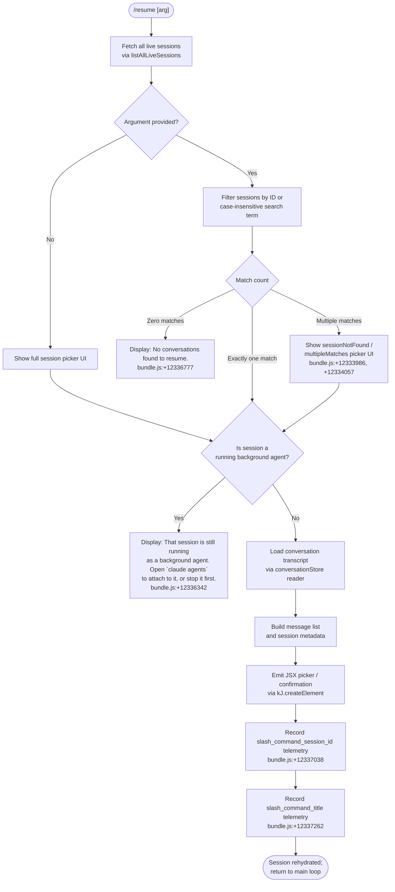

# `/resume`

> Analysis basis: CC v2.1.169 bundle.js (AST extraction + Claude interpretation)
> Minimum version: v2.1.169

---

## Overview

`/resume` (alias: `/continue`) lets a user return to a previous Claude Code conversation by selecting it via a session ID or free-text search term. The command queries the local conversation store, filters live sessions, presents a picker UI, and then rehydrates the chosen session's message history before handing control back to the main interaction loop.

---

## Registration

| Field | Value |
|---|---|
| type | `local-jsx` |
| name | `resume` |
| description | `Resume a previous conversation` |
| aliases | `["continue"]` |
| argumentHint | `[conversation id or search term]` |
| module_id | `dAK` |
| load_inline | `true` |
| loc_byte | `12337740` |
| loc_byte_end | `12337937` |
| loc_line | `8572` |
| arbor_handler.name | `Suf` |
| arbor_handler.fqn | `claude-2.1.169::Suf` |
| arbor_handler.kind | `AsyncFunction` |
| arbor_handler.resolution_path | `module_id` |
| arbor_handler.n_hits | `0` |

Analysis basis: CC v2.1.169 bundle.js:+12337740

---

## Input Branching

The command has five clearly distinct execution paths based on session lookup results and session state, so a Mermaid flowchart is used.



Analysis basis: CC v2.1.169 bundle.js:+12336332 – +12337312

---

## Behavioral Spec

### 1. Handler Entry — `resumeCommandHandler` (`Suf`)

The Arbor-resolved handler is `Suf` (AsyncFunction, resolution via `module_id → dAK`).

```
async function resumeCommandHandler(context):
    sessions = await fetchLiveSessionList(context)   // A3H → listAllLiveSessions
    arg = context.args?.trim()

    if isBackgroundAgentSession(targetSession):
        return errorMessage(BACKGROUND_AGENT_MSG)    // literal @ +12336342

    matchedSession = resolveSessionByArg(sessions, arg)

    if matchedSession is null:
        return errorMessage("No conversations found to resume.")  // +12336777

    transcript = await loadTranscript(matchedSession.id)         // K3H, F9H
    ui = buildResumeUI(transcript, matchedSession)               // kJ.createElement @ +12336628
    recordTelemetry("slash_command_session_id", matchedSession.id)  // +12337038
    recordTelemetry("slash_command_title", matchedSession.title)    // +12337262
    return ui
```

Analysis basis: CC v2.1.169 bundle.js:+12336332

---

### 2. Session List Fetch — `fetchLiveSessionList` (`A3H`)

```
async function fetchLiveSessionList(context):
    // Fast path: check Promise.resolve cache first
    cached = await Promise.resolve(...)            // +9211957
    if cached valid:
        return cached

    // Slow path: call storage layer
    sessions = await storage.listAllLiveSessions() // +9212009
    filter sessions where type == "interactive"    // literal @ +9212100
    return sessions
```

Analysis basis: CC v2.1.169 bundle.js:+9211957

---

### 3. Session Resolution — `resolveSessionByArg`

```
function resolveSessionByArg(sessions, arg):
    if arg is empty:
        return showFullPicker(sessions)

    lower = arg.toLowerCase()
    matches = sessions.filter(s =>
        s.id.startsWith(lower) OR
        s.title?.toLowerCase().includes(lower)
    )

    if matches.length == 0:
        return null                     // triggers "No conversations found" path

    if matches.length == 1:
        return matches[0]

    // Multiple matches — surface picker tagged "multipleMatches"
    // literal @ +12334057
    return showFilteredPicker(matches, "multipleMatches")
```

Analysis basis: CC v2.1.169 bundle.js:+12336228 (filter entry via `QAK → H.filter`)

---

### 4. Background-Agent Guard

```
function isBackgroundAgentSession(session):
    // Checks daemon session state flags
    if session.daemonState in {"background session", "stopped"}:
        // literals @ +16543429, +16543386
        return true
    return false
```

When this guard fires, the command returns a static error string (≤30 char excerpt: `"That session is still running…"`) directing the user to `claude agents`.

Analysis basis: CC v2.1.169 bundle.js:+12336342

---

### 5. Transcript Load — `loadTranscriptStore` (`K3H` / `F9H`)

`K3H` is the conversation store reader. It delegates heavily to `F9H` (transcript file parser).

```
async function loadTranscriptStore(sessionId):
    meta    = await readConversationMeta(sessionId)   // F9H → uK.stat, uK.readFile
    entries = await parseTranscriptFile(sessionId)    // Daf (binary JSONL reader)

    // JSONL record types encountered:
    //   "assistant", "user", "system", "attachment"  (literals @ +13327590–+13327635)
    //   "progress", "uuid"                           (literals @ +13328032–+13328044)
    //   "summary", "last-prompt", "ai-title",
    //   "custom-title", "tag", "agent-name"          (literals @ +13373232–+13373604)
    //   "compact_boundary"                           (literal  @ +10924052)

    return {meta, entries}
```

Maximum single-file read buffer: 1 048 576 bytes (bundle.js:+13369828).

Analysis basis: CC v2.1.169 bundle.js:+13365567 (`K3H → Je`), +13375334 (`F9H → uK.readFile`)

---

### 6. Session Picker UI — `buildSessionPicker` (`ti` / `nA6`)

```
function buildSessionPicker(sessions, filterMode):
    // Sort by timestamp descending (gU8 → Date.parse @ +13353308)
    sorted = sessions.sortBy(s => -Date.parse(s.timestamp))

    // Render each entry with title, date, and preview
    items = sorted.map(s => renderSessionRow(s))   // lA6 → H.map

    // Limit display columns; pad with spaces (literal "  " @ +16531382)
    return kJ.createElement(PickerComponent, {items, filterMode})
```

The picker uses bold formatting via `J6.bold` (`FAK → J6.bold` @ +12334021) for matched session titles.

Analysis basis: CC v2.1.169 bundle.js:+12337163 (`Suf → ti`), +12337083 (`Suf → nA6`)

---

### 7. Conversation Writer / Snapshot — `conversationWriter` (`StK`)

After the session is selected and rehydrated the writer subsystem persists a snapshot so the resumed conversation is recorded in the live session list.

```
async function conversationWriter(sessionData):
    dir     = path.dirname(sessionData.path)      // P6H.dirname @ +208436
    size    = Buffer.byteLength(serialized)        // +208611
    await ensureDir(dir)                           // htK → Mh.mkdir @ +208157
    await Mh.appendFile(path, serialized)          // htK → Mh.appendFile @ +208216
    // rotate file when size limit exceeded
    if size > rotationThreshold:
        await rotateLegacyFile(path)              // Vo8 → Mh.rename @ +207884
    registerCleanupHook(sessionId)                // Z9 → ZGA.register @ +62328
```

Analysis basis: CC v2.1.169 bundle.js:+209076 (`N → StK`)

---

## State & Side Effects

| Item | Detail |
|---|---|
| Telemetry — `slash_command_session_id` | Fired with the chosen session ID after a successful resume (bundle.js:+12337038) |
| Telemetry — `slash_command_title` | Fired with the session's display title after a successful resume (bundle.js:+12337262) |
| Telemetry — `tengu_worktree_detection` | Fired during git worktree resolution called from session load (bundle.js:+9201820) |
| Telemetry — `tengu_bg_attach` | Fired when the session being resumed requires a background-daemon attach (bundle.js:+16498374) |
| Telemetry — `tengu_bg_attach_kick` | Fired if the background attach causes a kick event (bundle.js:+16500512) |
| Telemetry — `tengu_transcript_phantom_parent` | Fired if transcript JSONL contains a message referencing a non-existent parent UUID (bundle.js:+13372014) |
| Telemetry — `tengu_relink_walk_broken` | Fired if message-chain walk hits a broken link (bundle.js:+13353038) |
| Telemetry — `tengu_chain_parent_cycle` | Fired if parent-UUID chain contains a cycle (bundle.js:+13353528) |
| Telemetry — `tengu_chain_timestamp_fallback` | Fired when timestamp ordering falls back to insertion order (bundle.js:+13353677) |
| File I/O | Reads transcript JSONL from `~/.claude/projects/…`; may append a new snapshot entry via `Mh.appendFile` |
| Cleanup hook | Registers a cleanup callback via `ZGA.register` (bundle.js:+62328) to remove temporary state on process exit |
| appState changes | Sets `sessionId` and loads conversation history into the active session store via `F9H` map updates |
| Sound | None observed in depth-2 traversal |

---

## Version History

| Version | Change |
|---|---|
| v2.1.169 | Initial analysis |

---

## Common Mistakes

1. **Providing a partial ID that matches multiple sessions** — The command will surface the `multipleMatches` picker instead of resuming immediately. Provide enough characters of the session UUID to uniquely identify it (bundle.js:+12334057).
2. **Trying to resume an active background-agent session** — The command explicitly blocks this and instructs users to use `claude agents` instead. Stop or detach the agent before attempting `/resume` (bundle.js:+12336342).
3. **Expecting `/continue` to behave differently** — `continue` is a registered alias for `resume`; they are identical in behavior (registration aliases field).
4. **Running `/resume` in a directory with no conversation history** — If no sessions exist (or none match the search term), the command prints `"No conversations found to resume."` and exits without error (bundle.js:+12336777).
5. **Assuming all session metadata is available immediately** — Session titles require the `ai-title` or `custom-title` JSONL record to be present; sessions that ended abnormally may show only the `last-prompt` excerpt (bundle.js:+13373299, +13373473).

---

## Appendix — Identifier Mapping

> For bundle debugging only. Identifiers change across versions.

| Identifier | Role |
|---|---|
| `Suf` | Main async handler for `/resume` (arbor-resolved entry point) |
| `QAK` | Session list pre-filter function; applies `H.filter` on raw session array |
| `A3H` | Live-session fetch helper; calls `listAllLiveSessions` and caches result |
| `H3H` | Git worktree detection helper; runs `git worktree list --porcelain` |
| `K3H` | Conversation store reader; aggregates metadata and transcript entries |
| `F9H` | Low-level transcript file parser; reads/writes all session map stores |
| `Daf` | Binary JSONL file reader (synchronous, uses `yR.openSync` / `yR.readSync`) |
| `nA6` | Session picker data builder; assembles display rows from store maps |
| `ti` | Session picker UI composer; sorts, filters, and renders JSX rows |
| `StK` | Conversation snapshot writer; appends JSONL and rotates files |
| `htK` | Directory-safe append helper; called by `StK` for atomic writes |
| `Vo8` | File rotation helper; renames `.txt` files when size threshold exceeded |
| `Z9` | Cleanup hook registrar; calls `ZGA.register` on session selection |
| `OwK` | File-tree walker for project directory enumeration |
| `KpH` | Transcript buffer allocator used during JSONL load |
| `Zaf` | JSONL record assembler; constructs attribution/compact-boundary objects |
| `Hm6` | Session summary renderer; joins metadata fields for display |
| `FAK` | Bold-format helper for picker title rendering (`J6.bold`) |
| `gU8` | Timestamp parser helper; wraps `Date.parse` for sort comparisons |
| `q3H` | Chain-walker for parent-UUID linked list traversal |
| `_af` | Message deduplication and reordering utility |
| `tof` | Priority-queue helper used during transcript chain reconstruction |
| `KwK` | Keyed-value accumulator used in chain-walk |
| `Haf` | NaN-safe numeric check used in chain timestamp validation |
| `lA6` | Row-map helper; maps session entries to display objects |
| `eOA` | Compact-summary content extractor |
| `dOA` | Multi-format content resolver (handles image, document, text subtypes) |
| `_zA` | Content-type predicate helpers |
| `QU8` | Quota/usage store accessor |
| `dU8` | Array-from-map converter for store enumeration |
| `Jaf` | Custom-command directory resolver |
| `rR` | Path normalisation utility (wraps `xZ`) |
| `wn` | Projects-directory path builder |
| `PY` | Path shortening / display helper |
| `iu8` | Session display formatter orchestrator |
| `RTH` | Tool-result slice and push helper |
| `nu6` | Nested get/set utility for conversation metadata maps |
| `lOA` | Recursive directory reader (uses `uK.readdir`) |
| `Px6` | Prompt-content serialiser |
| `jK` | Content-block text extractor / regex matcher |
| `hH` | Error logging / telemetry dispatch helper |
| `wA` | Error-to-string coercion wrapper |
| `_6` | Safe `String()` coercion utility |
| `EH` | Secondary `String()` coercion used in display formatting |
| `N` | Core message-normalisation function called throughout transcript loading |
| `ItK` | Message type router (delegates to `RI`, `fZA`, `vGA`) |
| `vGA` | Content-block builder (calls `yoK`, `hoK`) |
| `CH` | `JSON.stringify` wrapper used for serialisation |
| `R4` | Text-segment trimmer and slicer for display preview |
| `qZA` | Map-based segment accumulator |
| `StK` | (see above) Conversation snapshot writer |
| `TBH` | Debounced write scheduler (`clearTimeout` / `setTimeout`) |
| `_4H` | Path-join helper for conversation directory construction |
| `n56` | EISDIR-safe stat helper |
| `MZA` | Metadata file path resolver |
| `rBH` | Write-flush helper |
| `lEA` | Low-level `H.write` wrapper |
| `M9` | Model identifier parser |
| `Cc` | Model-string tokeniser |
| `CC` | Model-family classifier (sonnet, haiku, opus, etc.) |
| `c9` | Model alias normaliser |
| `u2` | Model tier lookup helper |
| `TLH` | Model allowlist checker |
| `Mk` | Model metadata resolver |
| `AE` | Model capability struct builder |
| `zM` | Provider-type resolver (firstParty, anthropicAws, gateway, mantle) |
| `eD` | Model+provider composite resolver |
| `hG` | Full model-record assembler |
| `j$H` | JSX prop builder for resume picker component |
| `Jg` | URL/pattern validator (`wv7.test`) |
| `Je` | Session-entry display component |
| `D3K` | Daemon status file reader (`daemon.status.json`) |
| `Oa` | Logging helper |
| `C9` | AsyncLocalStorage store accessor |
| `tx6` | Path joiner for daemon status file |
| `SO` | Path normaliser (NFC unicode form) |
| `G_` | Working-directory resolver |
| `xZ` | Absolute-path helper |
| `I6` | Another absolute-path variant |
| `U_` | Top-level session runner / event loop entry |
| `gVH` | Process spawn/management layer |
| `D` | Forced-shutdown handler |
| `Bj` | Pre-exit cleanup callback |
| `J3` | Session join/wait utility |
| `E8` | Error classifier |
| `w2_` | Query-string parser |
| `u6H` | Feature-flag checker (`vO4.has`) |
| `n3` | String sanitiser |
| `o6` | Bootstrap fetch initiator |
| `K6` | Fetch wrapper |
| `c76` | Low-level HTTP client |
| `mw8` | MCP tool-call dispatcher (referenced in `dXA`) |
| `dXA` | MCP connection result applier |
| `mSH` | MCP server configuration processor |
| `cd8` | MCP update applier |
| `g8` | Generic identity/passthrough helper |

---

Note: index built via Arbor fallback; some signals (telemetry, literals) may be missing — see arbor-fallback.js.