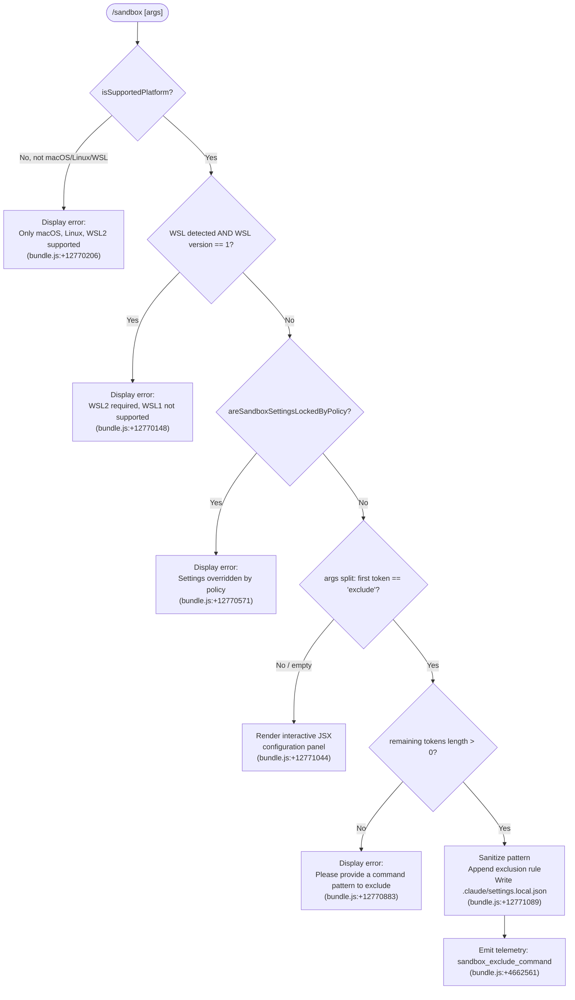

# `/sandbox`

> Analysis basis: CC v2.1.169 bundle.js (AST extraction + Claude interpretation)
> Minimum version: v2.1.169

---

## Overview

The `/sandbox` command configures process-level sandboxing for Claude Code, controlling which shell commands are permitted to run inside an isolated execution environment. It checks platform compatibility, enforces policy locks, and allows users to add command-pattern exclusions that are persisted to the local settings file (`.claude/settings.local.json`). When invoked without a sub-command, it opens an interactive configuration UI; when invoked with `exclude "<pattern>"`, it appends a new exclusion rule.

---

## Registration

| Field | Value |
|---|---|
| type | `local-jsx` |
| name | `sandbox` |
| description | ` ...   ...  (⏎ to configure)` |
| argumentHint | `exclude "command pattern"` |
| immediate | `true` |
| isHidden | `null` |
| module_id | `WfK` |
| load_inline | `true` |
| loc_byte | `12771456` |
| loc_byte_end | `12772105` |
| loc_line | `9124` |
| arbor_handler.name | `eFf` |
| arbor_handler.fqn | `claude-2.1.169::eFf` |
| arbor_handler.kind | `AsyncFunction` |
| arbor_handler.resolution_path | `module_id` |
| arbor_handler.n_hits | `2` |

Analysis basis: CC v2.1.169 bundle.js:+12771456

---

## Input Branching

Four or more distinct paths exist (platform unsupported → WSL1 check → policy lock → `exclude` sub-command → interactive config), so a Mermaid flowchart is used.



---

## Behavioral Spec

### 1 — Platform and Environment Guard

```
async function handleSandboxCommand(context, args):
    platformInfo = getPlatformInfo()            // xA.isSupportedPlatform (bundle.js:+12770106)
    wslVersion   = detectWSLVersion()           // FA (bundle.js:+12770075), r6 (bundle.js:+12770097)

    if not platformInfo.isSupported:
        return renderError(
            "Error: Sandboxing is currently only supported on macOS, Linux, and WSL2."
        )                                        // bundle.js:+12770206

    if platformInfo.isWSL and wslVersion == "wsl":
        return renderError(
            "Error: Sandboxing requires WSL2. WSL1 is not supported."
        )                                        // bundle.js:+12770148, literal "wsl" @ +12770142
```

Analysis basis: CC v2.1.169 bundle.js:+12770075–12770206

---

### 2 — Policy Lock Check

```
    if checkDependencies(context) indicates error:      // xA.checkDependencies @ +12770323
        return renderError(...)

    if xA.areSandboxSettingsLockedByPolicy(context):   // bundle.js:+12770512
        return renderError(
            "Error: Sandbox settings are overridden by a higher-priority configuration
             and cannot be changed locally."
        )                                               // bundle.js:+12770571

    if not xA.isPlatformInEnabledList(context):        // bundle.js:+12770350
        // platform is not in the administrator-approved list; treat as unsupported
        return renderError(...)
```

Analysis basis: CC v2.1.169 bundle.js:+12770323–12770512

---

### 3 — Argument Dispatch: `exclude` Sub-command

```
    tokens = args.split(...)                       // M.split @ +12770798
    subCmd = tokens[0]                             // "exclude" literal @ +12770821

    if subCmd == "exclude":
        pattern = tokens.slice(1)                  // M.slice @ +12770838, constant 8 @ +12770846

        if pattern is empty:
            return renderError(
                "Error: Please provide a command pattern to exclude
                 (e.g., /sandbox exclude \"npm run test:*\")"
            )                                      // bundle.js:+12770883

        sanitizedPattern = sanitizePattern(pattern)
        // z.replace applied to clean input  @ +12771002

        appendExclusionRule(sanitizedPattern)
        // calls settingsWriter (Sy_) @ +12771031
        // resolves relative path via XfK.relative @ +12771068
        // target file: ".claude/settings.local.json" @ +12771089
        // telemetry emitted: "sandbox_exclude_command" @ +4662561

        return renderSuccess()
```

Analysis basis: CC v2.1.169 bundle.js:+12770798–12771089

---

### 4 — Interactive Configuration UI (no sub-command)

```
    else:
        // Render JSX component
        component = buildInteractivePanel(context)  // V$ @ +12771044
        return component
        // The panel reads current sandbox rules from settings layers:
        //   policySettings, flagSettings, localSettings, userSettings, projectSettings
        // It allows toggling sandbox enable/disable and reviewing existing exclusion rules.
```

Analysis basis: CC v2.1.169 bundle.js:+12771044

---

### 5 — Settings Write Path (Exclusion Persistence)

```
function appendExclusionRule(pattern):
    settings = loadSettings()         // Sy_ → y8 → YB chain @ +12771031
    currentRules = filterAddRules(
        settings.localSettings,       // literal "localSettings" @ +4662184
        "addRules"                    // literal "addRules"       @ +4662275
    )
    // neL performs pattern match validation  @ +4662426
    // includes-check guards for duplicates  @ +4662465
    newRules = [...currentRules, pattern]
    writeLocalSettings(newRules)      // Or6 → OYH.writeFile path
    // output file: ".claude/settings.local.json" (literal @ +12771089)
    emit("sandbox_exclude_command")   // SH call @ +4662558, telemetry literal @ +4662561
```

Analysis basis: CC v2.1.169 bundle.js:+4662181–4662561

---

### 6 — Argument Hint

The registration declares `argumentHint: exclude "command pattern"`, which the CLI uses to populate the autocomplete tooltip when the user types `/sandbox `.

Analysis basis: CC v2.1.169 bundle.js:+12771456

---

## State & Side Effects

| Item | Detail |
|---|---|
| Telemetry | `sandbox_exclude_command` (bundle.js:+4662561); plus ambient events: `tengu_feature_ok` (+1013926), `tengu_feature_bad` (+1013988), `tengu_feature_sad` (+1014069) reached via shared feature-result helpers |
| Settings write | Exclusion rules appended to `.claude/settings.local.json` (bundle.js:+12771089) |
| Policy guard | Reads `areSandboxSettingsLockedByPolicy` before allowing any mutation; aborts with error message if locked (bundle.js:+12770512) |
| Platform guard | Validates macOS/Linux/WSL2; rejects WSL1 and unsupported OSes (bundle.js:+12770106, +12770142) |
| Hook registration | <!-- TODO: not found in depth-2 traversal; needs --depth 4 --> |
| appState changes | Interactive panel rendered when no sub-command supplied; no direct appState mutation observed in depth-2 traversal |
| Sound | Not observed in depth-2 traversal |

---

## Version History

| Version | Change |
|---|---|
| v2.1.169 | Initial analysis |

---

## Common Mistakes

1. **Forgetting to quote the pattern.** The argument hint says `exclude "command pattern"` — unquoted patterns with spaces or glob characters will be mis-parsed after the first token split.
2. **Running on WSL1.** The command explicitly rejects WSL version 1 with a clear error. Upgrade to WSL2 before using `/sandbox`.
3. **Expecting policy-locked settings to change.** If an administrator has applied a policy that locks sandbox settings, `/sandbox exclude` will produce an error regardless of local permissions. The lock must be removed at the policy level.
4. **Assuming the interactive panel can write to project settings.** The exclusion write path targets `.claude/settings.local.json` only; it does not modify `settings.json` or any higher-priority layer.
5. **Omitting the pattern argument after `exclude`.** `/sandbox exclude` with no trailing pattern returns a descriptive error rather than opening the interactive panel.

---

## Appendix — Identifier Mapping

> For bundle debugging only. Identifiers change across versions.

| Identifier | Role |
|---|---|
| `eFf` | Main async handler for `/sandbox` command (Arbor-resolved; `claude-2.1.169::eFf`) |
| `hA` | Terminal color/style string formatter (used for error output rendering) |
| `N` | Log/debug line emitter (shared utility, "debug" literal at +208891) |
| `ItK` | Internal logging sub-helper (depth-1 from `N`) |
| `CH` | JSON.stringify wrapper utility |
| `R4` | String redaction/replacement helper ("[REDACTED]" at +200573) |
| `rBH` | Log-entry formatter helper (`lEA` child) |
| `StK` | Buffer/stream writer utility (uses `Buffer.byteLength`) |
| `w2_` | Argument token splitter/trimmer |
| `u6H` | Set-membership check utility |
| `n3` | String replace normalizer |
| `M9` | Model identifier resolver ("sonnet", "haiku", "opus" etc.) |
| `Cc` | Model-string canonicalizer |
| `c9` | Model name normalizer (lowercases, strips markers like `[1m]`) |
| `eD` | Extended model descriptor builder |
| `NJH` | ANSI color-code parser/dispatcher (handles all chalk-style color names + rgb/hex/ansi256) |
| `Jl` | Fallback style resolver |
| `M` | MCP server manager / connection registry |
| `mSH` | Core MCP orchestrator (connects/disconnects servers, manages state) |
| `yn` | MCP server initializer |
| `XE6` | MCP config loader sub-step |
| `Tt` | MCP server collection builder |
| `sF` | SDK-type MCP entry assembler |
| `yw8` | MCP warning color renderer (red/yellow) |
| `JE6` | SSE/HTTP MCP server entry mapper |
| `VV` | MCP config validation helper |
| `kY` | Settings key resolver |
| `vu_` | Config value unwrapper |
| `K` | Process/stream output formatter (padEnd, map) |
| `L` | Async task queue with add/delete/finally lifecycle |
| `f` | Connection handle (close/get/set) |
| `g8` | Generic identity/passthrough helper |
| `OZ6` | MCP server filter predicate |
| `TF9` | MCP connection hasher/differ |
| `jp_` | MCP connection cache reader |
| `PPH` | SHA-256 hash builder for connection configs |
| `JD8` | MCP connection descriptor builder |
| `jD8` | MCP connection diff calculator |
| `BP` | Alternate SHA-256 config hasher |
| `DD8` | Deferred/lazy config accessor |
| `V4` | Shallow config value extractor |
| `O8` | MCP debug log emitter |
| `sw8` | MCP server connection lifecycle manager |
| `Mc` | Auth credential resolver (Nu/QK chain) |
| `iAH` | Claude.ai connector integrator |
| `K1H` | Full MCP OAuth server session handler |
| `gtH` | In-flight connection slot tracker |
| `D` | Process exit / abort controller wrapper |
| `ew8` | MCP connection cache path builder |
| `Cn` | MCP reconnect orchestrator |
| `Nu` | Credential/token store accessor |
| `Y` | MCP supervisor stream writer |
| `u7` | MCP error log emitter |
| `EH` | Error-to-string converter |
| `iJ7` | SSH/remote-session detection helper |
| `tw8` | MCP tool-result / complete-authentication handler |
| `FtH` | Pending-OAuth-session slot reader |
| `QtH` | In-flight connection slot reader |
| `yF9` | MCP capability/schema fetcher |
| `C9` | Async-local-store reader |
| `oJ8` | Needs-auth cache path builder |
| `uu_` | MCP capability descriptor assembler |
| `J` | Process group kill helper |
| `A` | Lowercase filename helper |
| `S` | Background worker process handle |
| `EN` | MCP skills/tools discovery broadcaster |
| `D6` | Skills broadcast dispatcher |
| `Vu_` | Active platform capability checker |
| `X8` | Global config reader (with auth-loss guard) |
| `y` | File-watcher / chokidar event listener |
| `M6` | Process spawn wrapper (`c76`) |
| `R` | Daemon output stream writer |
| `vF9` | Async iterator/mapper utility |
| `NF` | Core async iterator implementation |
| `DeH` | Integer parser (radix 10) |
| `aJ8` | Alternate integer parser |
| `cd8` | MCP connection result applier |
| `uSH` | Connection hash validator |
| `UE` | MCP slot cleanup orchestrator |
| `zeH` | Per-slot connection terminator |
| `$` | Daemon status snapshot builder |
| `D3K` | Daemon status writer |
| `Oa` | Config value serializer |
| `tx6` | Daemon status file path builder |
| `dXA` | MCP server diff/patch applier |
| `mw8` | MCP server suppression checker (EJ7/yu_ sets) |
| `a8` | Timeout-guarded async operation wrapper |
| `O` | Background session identifier |
| `z` | Daemon lifecycle manager (stop/restart) |
| `SH` | Foreground feature telemetry emitter (ok path) |
| `bH` | Background feature telemetry emitter (bad path) |
| `rh` | Settings-layer composer (all layers merged) |
| `su` | Lower settings-layer reader |
| `lC` | Raw settings-file parser |
| `aIH` | First-party MCP plugin loader |
| `ih` | Skills-layer broadcaster sub-step |
| `MG_` | MCP plugin session initializer (randomUUID) |
| `XL8` | External MCP server bootstrap (Promise.all) |
| `iB` | Random-bytes token generator |
| `PU` | Graceful shutdown race coordinator |
| `v7H` | Server shutdown signal sender |
| `R7H` | Shutdown timer clearer |
| `xG_` | Datadog telemetry POST helper |
| `Sy_` | Settings writer / exclusion-rule appender |
| `y8` | Settings loader (Ho6 + YB) |
| `Ho6` | Settings cache hit/miss resolver |
| `o0A` | Settings cache getter |
| `W9_` | Policy settings loader |
| `a0A` | Settings cache setter |
| `YB` | Full settings assembler (all layer keys) |
| `G_` | Global settings reader |
| `uf6` | User settings key reader |
| `sn8` | User settings writer |
| `Rf6` | Project settings reader |
| `HZH` | Project settings writer |
| `_ZH` | Local settings reader |
| `pf6` | Local settings writer |
| `VYH` | Flag settings reader |
| `vYH` | Policy settings reader (high priority) |
| `C9_` | Effective settings merger |
| `igA` | Settings migration helper |
| `co` | Settings validation helper |
| `Oz6` | Remote settings fetch (r6 / Mz6 / v2) |
| `neL` | Pattern match validator (regex exec on H) |
| `t_` | Exclusion rule writer (core write path to local settings) |
| `V$` | Interactive sandbox configuration panel (JSX) |
| `EYH` | Settings path resolver |
| `l6` | File existence check |
| `G2` | Config directory resolver |
| `uo` | Settings file reader |
| `k8` | File error classifier |
| `E8` | ENOENT check |
| `y1_` | Write-timestamp recorder |
| `_vH` | Settings-layer path mapper |
| `er6` | Settings file path builder |
| `WO6` | Atomic file write helper (temp + rename) |
| `yO` | Settings cache clearer |
| `Or6` | Async settings file writer |
| `C6` | Git config directory resolver |
| `z1_` | Git-aware path resolver |
| `$r6` | Git check-ignore runner |
| `qy4` | Path normalization helper (tilde expansion, absolute check) |
| `yBA` | Git ls-files already-tracked checker |
| `hBA` | Gitignore append helper |
| `ku` | `.claude` directory path builder |
| `DB` | Settings disk-load coordinator |
| `bZ` | Settings load cache key builder |
| `t9` | Telemetry memory-usage recorder |
| `G9_` | Full settings-load-from-disk implementation |
| `sB6` | Settings post-load validator |
| `hH` | Shell command executor / error handler |
| `wA` | Error string normalizer |
| `_6` | String coercer |
| `kq` | Essential-traffic command filter |
| `av4` | Command history ring-buffer manager |
| `Td` | Final render / return value builder for `/sandbox` |

---

Note: index built via Arbor fallback; some signals (telemetry, literals) may be missing — see arbor-fallback.js.