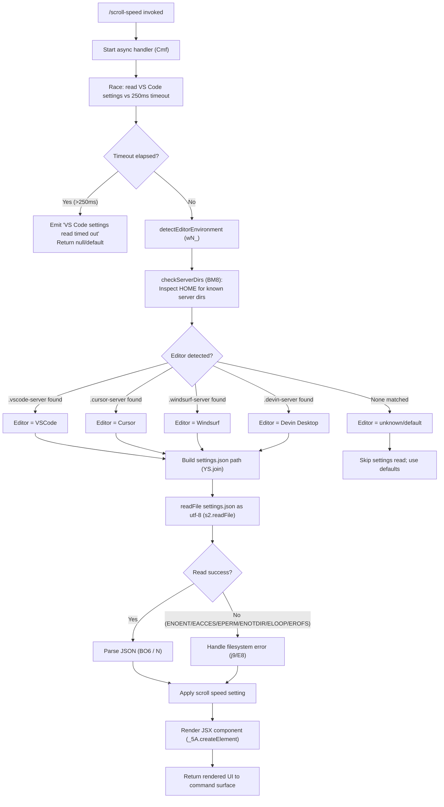

# `/scroll-speed`

> Analysis basis: CC v2.1.169 bundle.js (AST extraction + Claude interpretation)
> Minimum version: v2.1.169

---

## Overview

The `/scroll-speed` command allows the user to adjust the mouse wheel scroll speed within the Claude Code terminal UI. It detects the active editor environment (VS Code, Cursor, Windsurf/Devin Desktop) by inspecting known server directory markers, then reads and applies the relevant editor settings. The command renders a JSX component (`_5A.createElement`) to present a settings interaction surface to the user.

---

## Registration

| Field | Value |
|---|---|
| type | `local-jsx` |
| name | `scroll-speed` |
| description | `Adjust mouse wheel scroll speed` |
| module_id | `d1K` |
| load_inline | `true` |
| loc_byte | `12390469` |
| loc_byte_end | `12390717` |
| loc_line | `8689` |
| arbor_handler.name | `Cmf` |
| arbor_handler.fqn | `claude-2.1.169::Cmf` |
| arbor_handler.kind | `AsyncFunction` |
| arbor_handler.resolution_path | `module_id` |
| arbor_handler.n_hits | `0` |

Analysis basis: CC v2.1.169 bundle.js:+12390469

---

## Input Branching

The command follows a multi-branch flow based on: (1) whether VS Code settings can be read within the timeout, (2) which editor environment is detected (VS Code / Cursor / Windsurf / Devin Desktop / unknown), and (3) whether the settings file read succeeds or fails with a known filesystem error. This constitutes 4+ distinct branches and therefore requires a flowchart.



---

## Behavioral Spec

### Main Handler

The primary entry point is the async function resolved by Arbor as `Cmf` (module `d1K`).

Analysis basis: CC v2.1.169 bundle.js:+12390232

```
async function scrollSpeedHandler(context):
    result = await Promise.race([
        readVSCodeSettings(context),   // detectAndRead
        timeout(250, "VS Code settings read timed out")
    ])

    if result is timeout:
        log warning: "VS Code settings read timed out"
        editorSettings = null
    else:
        editorSettings = result

    uiElement = createJSXElement(editorSettings, context)
    return uiElement
```

### Timeout Guard

A race between the settings-read operation and a 250-millisecond timer guards against slow filesystem access.

Analysis basis: CC v2.1.169 bundle.js:+12390241, +12390245, +2304370, +2304401, +2304448

```
function timeoutRace(promise, ms, message):
    timerId = undefined
    timeoutPromise = new Promise((_, reject) =>
        timerId = setTimeout(() => reject(new Error(message)), ms)
    )
    return Promise.race([promise, timeoutPromise])
        .finally(() => clearTimeout(timerId))
```

- Timeout value: **250 milliseconds** (bundle.js:+12390241)
- Timeout message: `"VS Code settings read timed out"` (bundle.js:+12390245)

### Editor Environment Detection (`wN_`)

Detects which IDE/editor environment is hosting Claude Code by probing known server subdirectories within the user home directory.

Analysis basis: CC v2.1.169 bundle.js:+4050368, +4050381, +4050427, +4050448

```
async function detectEditorEnvironment():
    homeDir = getHomeDirectory()   // xlL

    editorMap = [
        { marker: ".vscode-server",  displayName: "VSCode",        internalKey: "vscode"   },
        { marker: ".cursor-server",  displayName: "Cursor",        internalKey: "cursor"   },
        { marker: ".windsurf-server",displayName: "Windsurf",      internalKey: "windsurf" },
        { marker: ".devin-server",   displayName: "Devin Desktop", internalKey: "windsurf" }
    ]

    for entry in editorMap:
        if directoryExists(join(homeDir, entry.marker)):  // BM8 / H.includes
            settingsPath = join(homeDir, entry.marker, "data", "Machine", "settings.json")
            raw = await readFile(settingsPath, "utf-8")   // s2.readFile
            parsed = parseSettingsJSON(raw)               // BO6
            return { editor: entry.displayName, settings: parsed }

    return { editor: "unknown", settings: null }
```

Known server directory markers (bundle.js:+4046252, +4046282, +4046312, +4046344):
- `.vscode-server` → display name `"VSCode"` (bundle.js:+4050719)
- `.cursor-server` → display name `"Cursor"` (bundle.js:+4050747)
- `.windsurf-server` → display name `"Windsurf"` (bundle.js:+4050777)
- `.devin-server` → display name `"Devin Desktop"` (bundle.js:+4050777)

Settings filename: `"settings.json"` (bundle.js:+4050448), encoding `"utf-8"` (bundle.js:+4050475)

### Settings JSON Parsing (`BO6` / `N`)

After reading the raw file content, the command parses it and normalises the result.

Analysis basis: CC v2.1.169 bundle.js:+1147727, +1147731, +1147460, +1147483, +1147754, +1147811, +1147830

```
function parseSettingsJSON(rawContent):
    // Strip leading BOM or whitespace prefix (Vu)
    cleaned = stripLeadingPrefix(rawContent)

    try:
        parsed = JSON.parse(cleaned)   // N (with normalisation)
        return parsed
    catch error:
        log "error"
        return { error: String(error) }
```

The normalisation step (`N`) performs: debug-level logging, header parsing, content-type / user-agent checks, trimming, upper-casing of certain keys, and value coercion — typical JSON bootstrap behaviour also used by the API bootstrap fetch path (bundle.js:+208915–209076).

### Filesystem Error Handling (`j9` / `E8`)

When `readFile` throws, the error code is checked against a list of known non-fatal filesystem errors.

Analysis basis: CC v2.1.169 bundle.js:+4050602, +178397, +178414

```
function handleReadError(error):
    knownCodes = ["ENOENT", "EACCES", "EPERM", "ENOTDIR", "ELOOP", "EROFS"]
    if error.code in knownCodes:
        return null   // settings file simply absent or inaccessible
    else:
        throw error   // unexpected; propagate
```

Known error codes (bundle.js:+178414, +178428, +178442, +178455, +178470, +178483):
`ENOENT`, `EACCES`, `EPERM`, `ENOTDIR`, `ELOOP`, `EROFS`

### Log Ring Buffer (`hH` pipeline)

A structured log ring buffer is maintained during the read pipeline. New entries are appended with `cgH.push` and the buffer rotates via `Di6.shift` / `Di6.push`. Errors are forwarded to `bo.logError`.

Analysis basis: CC v2.1.169 bundle.js:+1019318, +1019331, +1019577, +1019660, +1019678, +1019718

```
function appendToLogBuffer(entry):
    formatted = formatLogEntry(entry)   // _6 / wA
    if ringBuffer.length >= MAX_BUFFER:
        ringBuffer.shift()              // av4: Di6.shift
    ringBuffer.push(formatted)          // av4: Di6.push / cgH.push
    if entry.level == "error":
        externalLogger.logError(formatted)  // bo.logError
```

### JSX Rendering (`_5A.createElement`)

After settings resolution, the handler creates a JSX element representing the scroll-speed adjustment UI.

Analysis basis: CC v2.1.169 bundle.js:+12390303

```
function renderScrollSpeedUI(settings, context):
    return createElement(ScrollSpeedComponent, {
        currentSettings: settings,
        context: context
    })
```

---

## State & Side Effects

| Item | Detail |
|---|---|
| Telemetry | `tengu_feature_sad` (bundle.js:+1014069) — fired via `o6 → d` on a failure/sad path |
| Hook registration | None observed in depth-2 traversal |
| appState changes | <!-- TODO: not found in depth-2 traversal; needs --depth 4 --> |
| Sound | <!-- TODO: not found in depth-2 traversal; needs --depth 4 --> |
| Filesystem reads | Reads `settings.json` from detected editor server directory; guarded by 250ms timeout |
| Log ring buffer | Appends structured entries; rotates at capacity; errors forwarded to external logger |

---

## Version History

| Version | Change |
|---|---|
| v2.1.169 | Initial analysis |

---

## Common Mistakes

1. **Assuming the command is cross-platform without caveats**: The editor detection relies on UNIX-style home-directory subdirectories (`.vscode-server`, `.cursor-server`, etc.). On Windows or non-standard setups these paths may not exist, causing the command to fall back to the unknown/default branch silently.
2. **Expecting instant settings application**: The 250ms timeout means slow NFS or network home directories will always result in a timed-out read, returning null settings regardless of whether the file exists.
3. **Confusing Windsurf and Devin Desktop detection**: Both map to the internal key `"windsurf"` — the `.devin-server` marker resolves to the Devin Desktop display name but shares the same internal settings key path as Windsurf (bundle.js:+4050760, +4050777).
4. **Treating filesystem errors as fatal**: `ENOENT` and related codes are handled gracefully (null settings returned); only unexpected error codes propagate upward.
5. **Invoking `/scroll-speed` outside a supported editor context**: On a plain terminal without any of the four recognised server directories, the command will render the UI with null/default settings — no error is shown but no editor-specific value is read.

---

## Appendix — Identifier Mapping

> For bundle debugging only. Identifiers change across versions.

| Identifier | Role |
|---|---|
| `Cmf` | Main async handler for `/scroll-speed` (AsyncFunction, module `d1K`) |
| `BL` | Timeout-race utility (`setTimeout` / `Promise.race` / `clearTimeout`) |
| `wN_` | Editor environment detection orchestrator |
| `xlL` | Home directory resolver |
| `BM8` | Server directory existence checker (`H.includes` / `_.includes`) |
| `H` | Platform/environment context object (bootstrap fetch, header map, etc.) |
| `N` | JSON normalisation / parse utility with debug logging |
| `P$` | Header or config accessor used during bootstrap fetch |
| `w2_` | String splitter / trimmer / slicer utility |
| `u6H` | Set membership checker (`vO4.has`) |
| `n3` | String replacement helper (`H.replace`) |
| `M9` | Composite codec / encoder (`Cc`, `c9`, `eD`) |
| `o6` | Telemetry sad-path emitter (`tengu_feature_sad` via `d` / `K6`) |
| `_` | Generic iterable / string argument placeholder |
| `BO6` | Settings JSON parser and normaliser (`Jr6`, `Vu`, `N`, `String`) |
| `Vu` | BOM / prefix stripper (`H.startsWith`, `H.slice`) |
| `DN_` | Array type guard (`Array.isArray`) |
| `j9` | Filesystem error dispatcher (routes to `E8`) |
| `E8` | Known filesystem error code matcher (`ENOENT`, `EACCES`, etc.) |
| `hH` | Log ring buffer pipeline orchestrator |
| `wA` | Log entry formatter (`Error`, `String` coercion) |
| `_6` | String coercer used in log formatting |
| `kq` | Log entry aggregator (calls `duA`) |
| `duA` | Log entry builder (calls `_6`) |
| `av4` | Ring buffer rotation handler (`Di6.shift`, `Di6.push`) |

---

Note: index built via Arbor fallback; some signals (telemetry, literals) may be missing — see arbor-fallback.js.