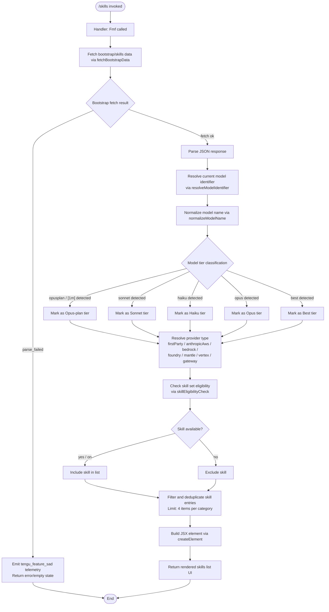

# `/skills`

> Analysis basis: CC v2.1.169 bundle.js (AST extraction + Claude interpretation)
> Minimum version: v2.1.169

---

## Overview

The `/skills` command lists the available skills (capabilities) accessible to the Claude Code agent in the current session. It is a `local-jsx` command that executes immediately without requiring agent turn processing, rendering a JSX-based UI component that enumerates skills along with their associated model information.

---

## Registration

| Field | Value |
|---|---|
| type | `local-jsx` |
| name | `skills` |
| description | `List available skills` |
| loc_byte | `12400420` |
| loc_byte_end | `12400552` |
| loc_line | `8689` |
| immediate | `true` |
| module_id | `K9K` |
| load_inline | `true` |
| arbor_handler.name | `Fmf` |
| arbor_handler.fqn | `claude-2.1.169::Fmf` |
| arbor_handler.kind | `AsyncFunction` |
| arbor_handler.resolution_path | `module_id` |
| arbor_handler.n_hits | `0` |

Analysis basis: CC v2.1.169 bundle.js:+12400420

---

## Input Branching

The `/skills` command has multiple distinct branches covering: model name normalization, provider/tier classification, skill eligibility checks, bootstrap data fetching, and JSX rendering. The flow is represented as a Mermaid diagram.



---

## Behavioral Spec

### Top-Level Handler

The async handler `Fmf` is the entry point for `/skills`. It delegates to two primary sub-routines: `buildSkillsPayload` (identifier `p2`) for data assembly and `K5A.createElement` for JSX rendering.

```
async function skillsCommandHandler():
    skillsPayload = await buildSkillsPayload()
    uiElement = createElement(SkillsView, skillsPayload)
    return uiElement
```

Analysis basis: CC v2.1.169 bundle.js:+12400235, +12400309

---

### Bootstrap Data Fetch

`fetchBootstrapData` (identifier `H`) retrieves skills/capability data from a remote endpoint. It logs `[Bootstrap] Fetching` at start and `[Bootstrap] Fetch ok` on success.

```
async function fetchBootstrapData(endpoint):
    log(DEBUG, "[Bootstrap] Fetching", endpoint)
    response = await fetch(endpoint, {
        headers: {
            "Content-Type": "application/json",
            "User-Agent": userAgentString
        },
        timeout: 5000
    })
    cached = MA.get(cacheKey)
    if cached:
        return cached
    parsed = parseJsonResponse(response)
    if parse error:
        emitTelemetry("api_bootstrap_fetch", { status: "parse_failed" })
        return fallback
    log(DEBUG, "[Bootstrap] Fetch ok")
    return parsed
```

Analysis basis: CC v2.1.169 bundle.js:+16097954, +16097956, +16098041, +16098056, +16098075, +16098157, +16098278, +16098300, +16098330

- HTTP request timeout: **5000 ms** (bundle.js:+16098157)
- Content-Type header value: `application/json` (bundle.js:+16098056)
- User-Agent header key: `User-Agent` (bundle.js:+16098075)

---

### Skill Payload Assembly

`buildSkillsPayload` (identifier `p2`) assembles the data object used to populate the skills UI. It calls `normalizeSkillEntry` (identifier `c9`) for each skill entry and `buildSkillsList` (identifier `i1`) to aggregate entries. It checks a known-skills set (`g5L`) and applies a category limit of **4 items** (bundle.js:+2250275).

```
async function buildSkillsPayload():
    rawSkills = await fetchBootstrapData()
    normalizedList = []
    for each skill in rawSkills:
        entry = normalizeSkillEntry(skill)
        normalizedList.append(entry)
    skillsList = buildSkillsList(normalizedList)
    if g5LSet.has(skillKey):
        // known skill — include
    else:
        // unknown — exclude
    return {
        skills: skillsList,
        maxPerCategory: 4
    }
```

Analysis basis: CC v2.1.169 bundle.js:+2250283, +2250291, +2250347, +2250275

---

### Model Name Normalization

`normalizeSkillEntry` (identifier `c9`) performs string normalization on the model/skill identifier. It trims whitespace, lowercases the string, applies pattern replacements, checks allowed token sets, and maps to a canonical tier label.

```
function normalizeSkillEntry(rawEntry):
    trimmed = rawEntry.trim()
    lowered = trimmed.toLowerCase()
    normalized = applyStringReplacements(lowered)
    if isBlocklisted(normalized):
        return null
    tier = classifyModelTier(normalized)
    return buildEntry(normalized, tier)
```

Tier classification string constants observed (bundle.js:+2252174, +2252200, +2252215, +2252254, +2252293, +2252330):
- `"opusplan"` — Opus plan tier
- `"[1m]"` — extended context marker associated with Opus plan
- `"sonnet"` — Sonnet tier
- `"haiku"` — Haiku tier
- `"opus"` — Opus tier
- `"best"` — Best/auto tier

Analysis basis: CC v2.1.169 bundle.js:+2252078, +2252089, +2252117, +2252153, +2252192

---

### Model Identifier Resolution

`resolveModelIdentifier` (identifier `H`) resolves the runtime model string. It calls `classifyModelProvider` (identifier `N`) to determine provider, then `parseModelVersion` (identifier `w2_`) to extract version segments, and runs eligibility checks.

```
function resolveModelIdentifier(rawModelString):
    provider = classifyModelProvider(rawModelString)
    versionParts = parseModelVersion(rawModelString)
    eligible = checkEligibility(provider, versionParts)
    return { provider, versionParts, eligible }
```

Provider classification constants (bundle.js:+2105849, +2105867, +2105887, +2105194, +2105244, +2105354, +2105402):
- `"firstParty"`
- `"anthropicAws"`
- `"gateway"`
- `"bedrock"`
- `"foundry"`
- `"mantle"`
- `"vertex"`

Analysis basis: CC v2.1.169 bundle.js:+16097992, +16098088, +16098096, +16098127

---

### Model Provider Classification

`classifyModelProvider` (identifier `N`) inspects the raw model string for known substrings and routes to provider-specific handlers.

```
function classifyModelProvider(modelStr):
    if debugFlagSet(modelStr):
        applyDebugBehavior()
    sanitized = sanitizeInput(modelStr)
    checkList = checklistLookup(sanitized)
    if modelStr.includes(knownPattern):
        // handle cross-provider routing
    upperStr = modelStr.toUpperCase()
    result = routeProvider(upperStr)
    trimmed = result.trim()
    finalStr = applyFinalTransform(trimmed)
    return classifyResult(finalStr)
```

Analysis basis: CC v2.1.169 bundle.js:+208891, +208915, +208933, +208955, +208973, +209017, +209037, +209040, +209056, +209062, +209076

---

### Model Version Parsing

`parseModelVersion` (identifier `w2_`) splits a model string on a delimiter, trims segments, and extracts version position using index/slice operations.

```
function parseModelVersion(modelStr):
    parts = modelStr.split(delimiter)
    trimmedParts = parts.map(p => p.trim())
    idx = trimmedParts.indexOf(versionToken)
    if idx >= 1:
        version = trimmedParts.slice(idx, idx + 1)
    else:
        version = trimmedParts.slice(0)
    return version
```

Numeric constants: split index offset `1` (bundle.js:+2984876), start-of-array sentinel `0` (bundle.js:+2984901).

Analysis basis: CC v2.1.169 bundle.js:+2984790, +2984829, +2984853, +2984893

---

### Skill List Assembly

`buildSkillsList` (identifier `i1`) iterates over a normalized entries map (via `buildEntriesMap`, identifier `N68`), applies a model name filter (`filterByModelPrefix`, identifier `TP`), checks for the `application-inference-profile` marker, and applies `normalizeEntryText` (identifier `n3`).

```
function buildSkillsList(normalizedEntries):
    entriesMap = buildEntriesMap(normalizedEntries)
    result = []
    for [key, entry] of Object.entries(entriesMap):
        if filterByModelPrefix(key, entry):
            continue
        if key.includes("application-inference-profile"):
            // handle inference profile variant
        cleaned = normalizeEntryText(entry)
        result.append(cleaned)
    return result
```

Known model prefix strings used in `filterByModelPrefix` (bundle.js:+2249140 through +2250029):
`claude-opus-4-8`, `claude-opus-4-7`, `claude-opus-4-6`, `claude-opus-4-5`, `claude-opus-4-1`, `claude-opus-4-0`, `claude-sonnet-4-6`, `claude-sonnet-4-5`, `claude-sonnet-4-0`, `claude-haiku-4-5`, `claude-3-7-sonnet`, `claude-3-5-sonnet`, `claude-3-5-haiku`, `claude-3-opus`, `claude-3-sonnet`, `claude-3-haiku`.

Analysis basis: CC v2.1.169 bundle.js:+2250122, +2250145, +2250154, +2250165, +2250205, +2250209

---

### Eligibility / Boolean Coercion

`checkEligibility` (identifier `_6`) converts truthy string markers to boolean. Recognized truthy values: `"yes"` (bundle.js:+27175), `"on"` (bundle.js:+27181). Uses `String()` coercion internally (bundle.js:+27126).

```
function checkEligibility(value):
    str = String(value)
    return str === "yes" or str === "on"
```

Analysis basis: CC v2.1.169 bundle.js:+27126, +27175, +27181

---

### Tier Formatting

`classifyModelTier` (identifier `Mk`) applies tier-specific formatting logic using `applyTierFormat` (identifier `zM`) and `buildTierEntry` (identifier `F5`). Sub-helpers `OBH`, `fLL`, `pD1`, `v68`, `YA` handle variant formatting paths within the tier builder.

```
function classifyModelTier(normalizedName):
    base = applyTierFormat(normalizedName)
    entry = buildTierEntry(base)
    return entry
```

Analysis basis: CC v2.1.169 bundle.js:+2248498, +2248510, +2107447, +2107472, +2107478, +2107482, +2107486

---

### Telemetry Event: `tengu_feature_sad`

The `tengu_feature_sad` event is emitted by `featureFailureReport` (identifier `o6`) when a skill-related feature encounters a degraded or failed state. The call originates from within the bootstrap fetch or skills resolution path.

```
function featureFailureReport(context):
    emit("tengu_feature_sad", context)
    logDegradedState(context)
```

Analysis basis: CC v2.1.169 bundle.js:+1014067, +1014069

---

## State & Side Effects

| Item | Detail |
|---|---|
| Telemetry | `tengu_feature_sad` (bundle.js:+1014069) — emitted on skills feature failure/degradation; `api_bootstrap_fetch` with status `parse_failed` (bundle.js:+16098278, +16098300) — emitted on bootstrap JSON parse failure |
| Bootstrap cache | Reads from `MA` cache map (`MA.get`) before issuing network fetch (bundle.js:+16097992) |
| Network I/O | Issues an HTTP fetch with `Content-Type: application/json` header and 5000 ms timeout (bundle.js:+16098157) |
| JSX rendering | Calls `K5A.createElement` to construct the skills list UI element; executed immediately (`immediate: true`) without a full agent turn (bundle.js:+12400235) |
| appState changes | <!-- TODO: not found in depth-2 traversal; needs --depth 4 --> |
| Sound | <!-- TODO: not found in depth-2 traversal; needs --depth 4 --> |
| Hook registration | None observed in depth-2 traversal |

---

## Version History

| Version | Change |
|---|---|
| v2.1.169 | Initial analysis |

---

## Common Mistakes

1. **Expecting a conversational response**: `/skills` is `immediate: true` and `local-jsx` — it renders a UI panel directly without dispatching to the agent model. Do not expect a natural-language reply.
2. **Assuming all model names are listed**: The command applies a strict model prefix filter (`filterByModelPrefix`) against a known list of Claude model identifiers. Unknown or custom model strings may be excluded silently.
3. **Ignoring provider context**: The skill set displayed can differ across providers (`bedrock`, `vertex`, `foundry`, etc.). Running `/skills` in an AWS Bedrock session may show a different list than a first-party session.
4. **Confusing tier labels**: The string `"[1m]"` is an extended-context marker associated with the Opus plan tier, not a separate model family. It modifies the `"opusplan"` classification path.
5. **Expecting real-time data always**: Bootstrap data is cached in the `MA` map. If the cache is warm, the command may show a stale snapshot without issuing a network request.
6. **Misinterpreting the category limit**: Each skill category is capped at **4 entries** per the literal at bundle.js:+2250275. Overflow entries are dropped silently.

---

## Appendix — Identifier Mapping

> For bundle debugging only. Identifiers change across versions.

| Identifier | Role |
|---|---|
| `Fmf` | Top-level async handler for `/skills` command (arbor_handler) |
| `p2` | `buildSkillsPayload` — assembles skill data object for rendering |
| `c9` | `normalizeSkillEntry` — trims, lowercases, classifies a single skill/model string |
| `H` | `fetchBootstrapData` / `resolveModelIdentifier` — fetches and caches bootstrap capability data |
| `N` | `classifyModelProvider` — routes model string to provider classification |
| `P$` | Provider routing helper called from `resolveModelIdentifier` |
| `w2_` | `parseModelVersion` — splits model string and extracts version token |
| `u6H` | `checkKnownSetMembership` — tests membership in known-capabilities set `vO4` |
| `n3` | `normalizeEntryText` — applies regex replacement to entry text |
| `M9` | `buildModelEntry` — constructs a model entry object via `Cc`, `c9`, `eD` |
| `o6` | `featureFailureReport` — emits `tengu_feature_sad` telemetry on failure |
| `u2` | `resolveStringToken` — helper calling `ZLH`/`_6` for string resolution |
| `ZLH` | `stringTokenResolver` — intermediate string token lookup |
| `A` | `modelStringLowercaser` — applies `toLowerCase` to model string |
| `f` | `connectionManager` — manages close operations for connections |
| `TLH` | `blocklistChecker` — checks if normalized name is in blocklist `GLH` |
| `Mk` | `classifyModelTier` — dispatches to tier format and entry builder |
| `zM` | `applyTierFormat` — applies tier-level formatting to normalized name |
| `F5` | `buildTierEntry` — constructs tier entry object via multiple sub-helpers |
| `QcH` | `tierEntryVariantA` — variant entry builder delegating to `F5` |
| `AE` | `tierEntryVariantB` — alternate tier entry path via `zM`, `F5`, `YA` |
| `YA` | `entryFinalizer` — finalizes entry via `_6` |
| `dG1` | `tierEntryVariantC` — delegates to `AE` |
| `__8` | `knownListChecker` — tests inclusion in known list `Q5L` |
| `dcH` | `entryStringBuilder` — builds entry string via `_6` |
| `_6` | `primitiveStringCoerce` — coerces value to string via `String()` |
| `i1` | `buildSkillsList` — iterates entries map and assembles filtered list |
| `N68` | `buildEntriesMap` — constructs entries map via `d_` and `Object.entries` |
| `d_` | `entryMapInitializer` — initializes the entries data structure |
| `TP` | `filterByModelPrefix` — filters entries by known model prefix strings |
| `Bi8` | `inferenceProfileHandler` — handles `application-inference-profile` variant entries |

---

Note: index built via Arbor fallback; some signals (telemetry, literals) may be missing — see arbor-fallback.js.