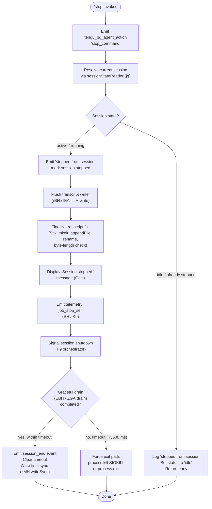

# `/stop`

> Analysis basis: CC v2.1.169 bundle.js (AST extraction + Claude interpretation)
> Minimum version: v2.1.169

---

## Overview

The `/stop` command terminates the current background session, marking it as stopped and emitting a `job_stop_self` action. Crucially, both the session transcript and any associated worktree are **preserved** after the stop — no data is destroyed. The command is designated `immediate`, meaning it executes without awaiting user confirmation or further agent turns.

---

## Registration

| Field | Value |
|---|---|
| type | `local-jsx` |
| name | `stop` |
| description | `Stop this background session; transcript and worktree are kept` |
| immediate | `true` |
| module_id | `HDK` |
| load_inline | `true` |
| loc_byte | `13235764` |
| loc_byte_end | `13235948` |
| loc_line | `9760` |
| arbor_handler.name | `drf` |
| arbor_handler.fqn | `claude-2.1.169::drf` |
| arbor_handler.kind | `AsyncFunction` |
| arbor_handler.resolution_path | `module_id` |
| arbor_handler.n_hits | `0` |

Analysis basis: CC v2.1.169 bundle.js:+13235764

---

## Input Branching

The handler has 3+ distinct execution paths: it checks the session's current state, handles the "already idle" case, performs a stop-and-persist sequence, and finally tears down the session runtime. A Mermaid flowchart is used.



---

## Behavioral Spec

### 1. Handler Entry — `stopCommandHandler` (`drf`)

The top-level async handler is resolved via `module_id → HDK` (Arbor resolution path: `module_id`).

```
async function stopCommandHandler(context):
    emit telemetry("tengu_bg_agent_action", { action: "stop_command" })
    // Analysis basis: CC v2.1.169 bundle.js:+13234899 / +13235497

    sessionContext = resolveSessionContext(context)   // drf → H
    sessionInfo   = readSessionState(sessionContext)  // IU8 → jq

    if sessionInfo.state == "idle":
        log("stopped from session")                   // +13235097
        setStatus("idle")                             // +13235126
        return

    stopAndPersistSession(sessionContext, sessionInfo)
    displaySessionStopped()                           // GqH, "Session stopped." +13235270
    emitStopSelfAction()                              // SH → K6, "job_stop_self" +13235301
    emitPromptInputExit()                             // "prompt_input_exit" +13235323
    await runSessionShutdown(sessionContext)           // P9
```

Analysis basis: CC v2.1.169 bundle.js:+13235483

---

### 2. Session State Reader — `sessionStateReader` (`jq`)

Reads persisted session state from disk, resolving the canonical session directory and consulting two in-memory caches.

```
async function sessionStateReader(sessionDir):
    fullPath = pathJoin(sessionDir, ...)              // Oj.join +4182246
    [statResult] = await Promise.all([HW.stat(fullPath)])  // +4182344

    if statResult is missing (ENOENT):               // "ENOENT" +177973
        logWarning("unknown")                        // "warn" +4182640 / "unknown" +4182740
        return defaultState

    if vfH.has(sessionId) and PjH.has(sessionId):
        return cachedState

    rawContent = await HW.readFile(fullPath, "utf-8")  // +4182894 / "utf-8" +4182908
    parsed = safeJsonParse(rawContent)               // F6 → JSON.parse +188362

    // State ordering: "order" / "stateOrder" literals +4182273 / +4182294
    vfH.set(sessionId, parsed)
    PjH.add(sessionId)

    emit telemetry("tengu_bg_state_read_transient")  // +4182694
    return parsed
```

State values observed in literals: `"done"`, `"success"`, `"failed"`, `"failure"`, `"stopped"`, `"active"` (bundle.js:+4189149–+4189330).

Analysis basis: CC v2.1.169 bundle.js:+13235038

---

### 3. Transcript Flush & Finalization — `transcriptFinalizer` (`StK`)

```
async function transcriptFinalizer(sessionPath):
    dir = pathDirname(sessionPath)                   // P6H.dirname +208436
    await mkdir(dir, { recursive: true })            // Mh.mkdir +208157

    byteLen = Buffer.byteLength(pendingContent)      // +208611

    if byteLen > 0:
        await appendFile(transcriptPath, content)    // Mh.appendFile +208216
        emit debug log                               // "debug" +208891

    rotatedPath = buildRotatedPath(transcriptPath)   // Vo8: .txt suffix +207832
    await rename(transcriptPath, rotatedPath)        // Mh.rename +207884

    // If rename target ends with ".txt" (+207821), slice last 4 chars (+207843 / value 4 +207854)
    await unlink(staleFile)                          // Mh.unlink +207924

    size = Buffer.byteLength(finalContent)           // htK → +208309
    fileIndex = buildFileIndex(sessionPath)          // MZA → P6H.join +208088
    await persistIndex(fileIndex)                    // $ZA +208342 / +208644
    registerCleanupHook()                            // Z9 → ZGA.register +62328
```

Analysis basis: CC v2.1.169 bundle.js:+209076

---

### 4. Session Shutdown Orchestrator — `sessionShutdownOrchestrator` (`P9`)

This is the most complex sub-function. It coordinates UI teardown, stream draining, and forceful exit.

```
async function sessionShutdownOrchestrator(sessionCtx):
    // Unmount UI (pRH): zMH.writeSync, H.unmount, Hb, v58
    unmountTerminalUI()                              // pRH +7316166–+7316326

    // Print final summary if available (eF_)
    printScrollSummary()                             // eF_ → Yv6 / f$ / xo9 +7316454–+7316639
    emit telemetry("tengu_scroll_summary")           // +7318000

    // Drain output queue with timeout
    GRACEFUL_TIMEOUT_MS = 3500                       // +7318591
    drainPromise = drainOutputQueue()                // EBH → ZGA.drain +62371

    raceResult = await Promise.race([
        drainPromise,
        timeout(GRACEFUL_TIMEOUT_MS)
    ])                                               // Promise.race +7318704

    // Post-drain: collect allSettled subagents (co9)
    await Promise.allSettled(Array.from(subagents))  // co9 +13420783

    // Abort signal timeout (AbortSignal.timeout +7318869)
    abortSignal = AbortSignal.timeout(...)

    // Write profiling / startup report if enabled (zM6 → ZZA)
    maybeWriteStartupProfile()                       // zM6 +7318905 / "Startup profiling report:" +218628

    // Flush session metrics (bP8 → Co9: Date.now, Math.max, Math.round)
    flushSessionMetrics()                            // bP8 +7318918 / "session_end" +7318981

    // Final sync write
    zMH.writeSync(...)                               // +7319051

    // Emit tengu_cache_eviction_hint
    emit telemetry("tengu_cache_eviction_hint")      // +7318943

    // Forceful kill path if graceful drain failed (Hg_)
    if notGraceful:
        clearTimeout(drainTimer)
        process.kill(pid, "SIGKILL")                 // "SIGKILL" +7316881
        // or process.exit()                         // +7316831

    INTER_WRITE_DELAY_MS = 2000                      // +7318769
```

Analysis basis: CC v2.1.169 bundle.js:+13235318

---

### 5. Stop Action Emitter — `stopSelfEmitter` (`SH`)

```
function stopSelfEmitter(sessionCtx):
    emit telemetry("tengu_feature_ok")              // +1013926
    // or on failure:
    emit telemetry("tengu_feature_sad")             // +1014069
    action = buildAction("stop", "job_stop_self")   // M6 → c76 +3599 / "stop" +13234934
    dispatchAction(action)                          // K6 → c76 +3628
```

Analysis basis: CC v2.1.169 bundle.js:+13235298

---

### 6. Bootstrap Context Resolver — `bootstrapContextResolver` (`H`)

Called at the top of `drf` to resolve runtime context before reading session state.

```
async function bootstrapContextResolver(ctx):
    log("[Bootstrap] Fetching")                     // +16097956
    headers = {
        "Content-Type": "application/json",         // +16098041 / +16098056
        "User-Agent":   "...",                      // +16098075
    }
    cachedConfig = MA.get(configKey)
    parsedArgs   = parseCommandArgs(ctx)            // w2_: split, trim, indexOf, slice
    hasFlag      = checkFlag(parsedArgs)            // u6H → vO4.has
    sanitized    = sanitizeInput(parsedArgs)        // n3 → H.replace
    modelConfig  = resolveModelConfig(sanitized)    // M9 → Cc / c9 / eD
    sessionView  = buildSessionView(ctx)            // YY5

    FETCH_TIMEOUT_MS = 5000                         // +16098157
    result = await fetchWithTimeout(endpoint, headers, FETCH_TIMEOUT_MS)
    emit telemetry("api_bootstrap_fetch", result)   // "api_bootstrap_fetch" +16098278
    if parseFailed: emit("parse_failed")            // +16098300
    log("[Bootstrap] Fetch ok")                     // +16098330
    return result
```

Analysis basis: CC v2.1.169 bundle.js:+16097954

---

## State & Side Effects

| Item | Detail |
|---|---|
| Telemetry: `tengu_bg_agent_action` | Emitted at handler entry with action `"stop_command"` (bundle.js:+13234899) |
| Telemetry: `tengu_bg_state_read_transient` | Emitted when session state is read from disk (bundle.js:+4182694) |
| Telemetry: `tengu_feature_ok` | Emitted on successful stop action dispatch (bundle.js:+1013926) |
| Telemetry: `tengu_feature_sad` | Emitted if stop action dispatch fails (bundle.js:+1014069) |
| Telemetry: `tengu_scroll_summary` | Emitted during shutdown UI teardown (bundle.js:+7318000) |
| Telemetry: `tengu_daemon_config_reload` | Emitted if daemon config reloads during shutdown (bundle.js:+16521994) |
| Telemetry: `tengu_startup_perf` | Emitted if startup profiling was active (bundle.js:+219930) |
| Telemetry: `tengu_pewter_brook` | Emitted from display-mode detection (bundle.js:+3456862) |
| Telemetry: `tengu_cache_eviction_hint` | Emitted near end of shutdown (bundle.js:+7318943) |
| Hook registration | `ZGA.register` called in `Z9` to register cleanup hook (bundle.js:+62328) |
| Hook drain | `ZGA.drain` called in `EBH` to flush output queue before exit (bundle.js:+62371) |
| Session state written | Session status set to `"stopped"` / `"idle"` in persistent state store |
| Transcript preserved | Transcript appended, rotated to `.txt` suffix, and index updated — **not deleted** |
| Worktree preserved | Worktree files are explicitly **not** cleaned up (per command description) |
| appState changes | Session removed from active map (`f.delete`); supervisor stopped (`T.stop`, `E.stop`); config reloaded (`E.updateConfig`); new instance started if applicable (`E.start`, `V.start`) |
| Process exit path | `process.kill(SIGKILL)` or `process.exit()` if drain timeout (~3500 ms) exceeded |
| Sound | <!-- TODO: not found in depth-2 traversal; needs --depth 4 --> |
| Display string | `"Session stopped."` displayed to user (bundle.js:+13235270) |
| Prompt-input exit event | `"prompt_input_exit"` event emitted (bundle.js:+13235323) |

---

## Version History

| Version | Change |
|---|---|
| v2.1.169 | Initial analysis |

---

## Common Mistakes

1. **Assuming the worktree is deleted**: The description explicitly states "worktree is kept." The stop command only halts the running session process; filesystem artifacts remain intact and must be cleaned up manually if desired.
2. **Invoking `/stop` expecting instant synchronous termination**: The shutdown is asynchronous and races a ~3500 ms graceful drain before escalating to `SIGKILL`. Callers should not assume the process exits immediately.
3. **Using `/stop` on an already-idle session**: The handler detects the `"idle"` state and returns early (logging "stopped from session") without performing any teardown — this is a no-op, not an error.
4. **Confusing `/stop` with a destructive command**: Unlike hypothetical `/delete` or `/abandon` commands, `/stop` deliberately preserves the transcript file (rotated to `.txt`) and the worktree.
5. **Expecting `/stop` to work in foreground (non-background) sessions**: The command is scoped to background sessions (`"bg"`, `"daemon"`, `"daemon-worker"` context literals at bundle.js:+2261602–+2261626); behavior in foreground sessions is not guaranteed.

---

## Appendix — Identifier Mapping

> For bundle debugging only. Identifiers change across versions.

| Identifier | Role |
|---|---|
| `drf` | Main stop command handler (AsyncFunction, Arbor FQN: `claude-2.1.169::drf`) |
| `H` | Bootstrap context resolver / generic session context helper |
| `N` | Session model / command string normalizer |
| `ItK` | Input validation / tokenization helper |
| `vGA` | Validation guard / option checker |
| `CH` | JSON serialization helper (`JSON.stringify` wrapper) |
| `R4` | Command string parser / argument extractor |
| `qZA` | Argument map builder |
| `q` | Generic queue / stream / data accessor |
| `A` | String array / path accumulator |
| `rBH` | Transcript writer dispatcher |
| `lEA` | Low-level file write helper (`H.write`) |
| `StK` | Transcript finalizer (mkdir, appendFile, rename, index) |
| `TBH` | Timer/batch flush scheduler (clearTimeout, setTimeout, setImmediate) |
| `_4H` | Transcript path builder (join, A_, I6) |
| `l6` | Filesystem path utility |
| `n56` | Error code classifier (`EISDIR`) |
| `MZA` | File index path builder |
| `Vo8` | Transcript rotation handler (stat, rename, unlink) |
| `htK` | Transcript append-and-index worker |
| `Z9` | Cleanup hook registrar (`ZGA.register`) |
| `P$` | Positional argument extractor |
| `w2_` | Argument string splitter/trimmer |
| `u6H` | Feature-flag presence checker (`vO4.has`) |
| `n3` | Input sanitizer (`H.replace`) |
| `M9` | Model configuration resolver |
| `Cc` | Model capability selector |
| `CC` | Model string parser (trim, startsWith, includes) |
| `c9` | Model alias normalizer (toLowerCase, replace) |
| `u2` | Locale/encoding helper |
| `TLH` | Model tier inclusion checker |
| `Mk` | Model metadata builder |
| `QcH` | Model quota checker |
| `AE` | Model availability evaluator |
| `dG1` | Model default selector |
| `zM` | Provider resolver (`YA`) |
| `__8` | Model exclusion filter |
| `dcH` | Model deprecation handler |
| `eD` | Extended model descriptor builder |
| `hG` | Model hydration / enrichment function |
| `o6` | Feature telemetry dispatcher |
| `d` | Generic logger / debug emitter |
| `K6` | Action dispatcher |
| `c76` | Core action factory |
| `IU8` | Stop UI / state-machine coordinator |
| `M6` | Action type builder |
| `I6` | Path / context identifier resolver |
| `xZ` | Async context wrapper |
| `Qrf` | Session reference resolver |
| `w9` | Session mode detector (`"bg"`, `"daemon"`, `"daemon-worker"`) |
| `nDH` | Daemon mode check helper |
| `jq` | Session state reader (disk + cache) |
| `k8` | Error-safe stat wrapper |
| `E8` | Error code extractor (`code` field) |
| `Bf` | Bulk file error handler |
| `F6` | Safe JSON parser (`JSON.parse`) |
| `LO` | Session outcome resolver |
| `ov` | Outcome state mapper |
| `MAH` | Outcome metadata helper |
| `If` | Session stop-record writer |
| `HO` | Atomic file writer (randomBytes, writeFile, rename, copyFile, unlink) |
| `zj` | Cache invalidation helper (`vfH.delete`) |
| `Y_8` | Stop confirmation state setter |
| `GqH` | "Session stopped." message display |
| `SH` | Stop-self action emitter |
| `P9` | Session shutdown orchestrator |
| `K` | Parallel task mapper |
| `L` | Promise lifecycle tracker (add, delete, finally) |
| `f` | Stream / UI mount handle |
| `pRH` | Terminal UI unmounter (zMH.writeSync, H.unmount, Hb) |
| `Hb` | UI handle cleanup |
| `v58` | Terminal escape writer (ESC-7/ESC-8 save/restore cursor) |
| `eF_` | Scroll summary printer |
| `tW` | Terminal width resolver |
| `ex` | Exit code handler |
| `Yv6` | Worktree path stat checker |
| `f$` | Final output formatter |
| `xo9` | Summary truncation helper |
| `Hg_` | Forceful-exit escalator (clearTimeout, process.kill SIGKILL / process.exit) |
| `EBH` | Output queue drainer (`ZGA.drain`) |
| `Y` | Supervisor / renderer lifecycle manager |
| `ITH` | Supervisor state inspector |
| `BOK` | Supervisor column formatter |
| `T` | Spinner/progress renderer |
| `E` | Scrolling/rendering engine |
| `edK` | Heartbeat scheduler (`W_H`) |
| `V` | Secondary renderer instance |
| `co9` | Sub-agent allSettled collector |
| `zM6` | Startup profile writer |
| `xo8` | Profile record emitter |
| `ZZA` | Startup profile file builder (dirname, JSON.stringify, mark) |
| `bP8` | Session metrics flusher |
| `bo9` | Metrics batch collector |
| `Co9` | Metrics calculator (Date.now, Math.max, Math.round, Object.assign) |
| `E1` | Local-agent display initializer |
| `Xf6` | Session-end event emitter |
| `BRH` | Post-shutdown resolver |
| `RP8` | Shutdown result packager |

---

Note: index built via Arbor fallback; some signals (telemetry, literals) may be missing — see arbor-fallback.js.