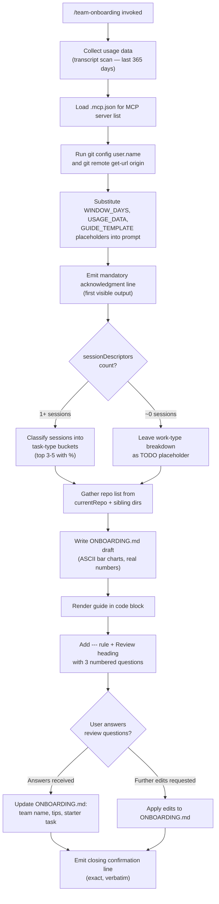

# `/team-onboarding`

> Analysis basis: CC v2.1.169 bundle.js (AST extraction + Claude interpretation)
> Minimum version: v2.1.169

---

## Overview

`/team-onboarding` is a `prompt`-type slash command that scans the invoking user's local Claude Code session transcripts (up to 365 days back), derives a usage-data summary, and co-authors a personalized `ONBOARDING.md` guide for teammates who are new to Claude Code. The command operates as an interactive two-turn collaboration: it produces an immediate concrete draft, then solicits three targeted review questions before writing the final file.

---

## Registration

| Field | Value |
|---|---|
| type | `prompt` |
| name | `team-onboarding` |
| description | Help teammates ramp on Claude Code with a guide from your usage |
| isHidden | `false` |
| loc_byte | `12238889` |
| loc_byte_end | `12239938` |
| loc_line | `8542` |
| handler_method | `getPromptForCommand` |
| handler_method_start | `12239227` |
| handler_method_end | `12239937` |
| prompt_body.length | `4539` characters |
| prompt_body.trace | `identifier→$ (local→1 ext vars)` |
| arbor_handler.name | `getPromptForCommand` |
| arbor_handler.kind | `Method` |
| arbor_handler.fqn | `claude-2.1.169::getPromptForCommand` |
| arbor_handler.resolution_path | `direct` |
| arbor_handler.n_hits | `2` |

Analysis basis: CC v2.1.169 bundle.js:+12238889

---

## Input Branching

The handler exhibits 4+ distinct branches based on session-data availability, user answers in the review turn, and subsequent edit requests. A Mermaid flowchart is used.



Analysis basis: CC v2.1.169 bundle.js:+12239227

---

## Behavioral Spec

### 1. Handler Entry and Telemetry

The `getPromptForCommand` method is the primary handler (Arbor resolution: `direct`, `claude-2.1.169::getPromptForCommand`). On invocation it immediately fires two telemetry events and then begins data collection.

```
function getPromptForCommand(context):
    emit telemetry("tengu_flint_harbor_prompt")    // invocation signal
    emit telemetry("tengu_team_onboarding_invoked") // command-specific signal

    windowDays = min(max(floor(someCalculation), ...), 365)
    // 365 is the upper bound on the look-back window
    // Math.min / Math.max / Math.floor applied at loc_byte 12239430–12239448

    usageData = collectUsageData(windowDays)
    mcpConfig  = loadMcpJson()
    gitMeta    = collectGitMetadata()

    prompt = buildPrompt(windowDays, usageData, mcpConfig, gitMeta)
    emit telemetry("tengu_team_onboarding_generated")
    return prompt
```

Analysis basis: CC v2.1.169 bundle.js:+12239233, +12239430, +12239487, +12239806

---

### 2. Usage Data Collection (`ybf` → `C_K`)

The usage-data collector reads `.jsonl` transcript files from the local projects directory, parses session entries, and extracts structured statistics.

```
function collectTranscriptData(windowDays):
    cutoffTimestamp = Date.now() - windowDays * 24 * 60 * 60 * 1000
    // look-back window is 24 h × 60 min × 60 s expressed in ms
    // constants 24 and 60 found at loc_byte 12227725 and 12227728

    files = fs.readdir(projectsDir).filter(f => extname(f) == ".jsonl")
    // ".jsonl" literal: loc_byte 12227840

    sessions = []
    for file in files:
        stat = fs.stat(join(projectsDir, file))
        if not stat.isFile(): continue
        raw = fs.readFile(join(projectsDir, file))
        lines = raw.split("\n")
        for line in lines:
            if line.includes('"name":"mcp__'):
                // detect MCP tool calls; literal "\"name\":\"mcp__" at loc_byte 12228419
                parseMcpUsage(line)
            matches = line.matchAll(somePattern)
            // extract sessionDescriptors, prNumbers, firstUserMessage
            if Zbf.exec(line): extractPrNumber(line)   // loc_byte 12228560
            if Vbf.exec(line): extractSessionTitle(line) // loc_byte 12228616
            if vbf.exec(line): extractContentBlock(line) // loc_byte 12228791
            if line.startsWith(somePrefix):             // loc_byte 12228876
                sliceDescriptor(line)                    // loc_byte 12228909

    return aggregatedSessionData
```

Analysis basis: CC v2.1.169 bundle.js:+12227712, +12227753, +12227809, +12227840, +12228210

---

### 3. MCP Configuration Loader (`kbf`)

Reads the `.mcp.json` file co-located with the current project to enumerate MCP servers. Used to populate the MCP setup section of the generated guide.

```
function loadMcpJson(projectPath):
    path = join(projectPath, ".mcp.json")
    // literal ".mcp.json" at loc_byte 12229951

    try:
        raw = fs.readFile(path)
        parsed = JSON.parse(raw)          // via parseJson helper
        servers = parsed["mcpServers"]    // literal "mcpServers" at loc_byte 12230007
        return servers
    catch error:
        handleError(error)                // k8 / N error handlers
        return {}
```

Analysis basis: CC v2.1.169 bundle.js:+12229927, +12229940, +12229974

---

### 4. Git Metadata Collection (`ybf` → `U_`)

Runs two git subprocesses to capture the guide-creator's display name and the repo's remote origin URL. Both pieces feed into the guide's header section.

```
function collectGitMetadata():
    userName = runSubprocess("git", ["config", "user.name"])
    // literals "git","config","user.name" at loc_byte 12230574–12230590

    remoteUrl = runSubprocess("git", ["remote", "get-url", "origin"])
    // literals "remote","get-url","origin" at loc_byte 12230646–12230665

    currentRepo = basename(remoteUrl or cwd)
    return { userName, remoteUrl, currentRepo }
```

Analysis basis: CC v2.1.169 bundle.js:+12230571, +12230574, +12230646, +12230762

---

### 5. Prompt Construction and Placeholder Substitution

The handler inserts three runtime values into the static prompt body using `replaceAll`. The prompt body itself is 4,539 characters and references three template placeholders.

```
function buildPrompt(windowDays, usageData, mcpConfig, gitMeta):
    template = getStaticPromptTemplate()  // 4539-char body, loc_byte 12238889

    // Three placeholder replacements (replaceAll at loc_byte 12239674):
    result = template
        .replaceAll("{{WINDOW_DAYS}}", String(windowDays))
        // literal "{{WINDOW_DAYS}}" at loc_byte 12239687
        .replaceAll("{{USAGE_DATA}}", JSON.stringify(usageData))
        // literal "{{USAGE_DATA}}" at loc_byte 12239762
        .replaceAll("{{GUIDE_TEMPLATE}}", getGuideTemplate())
        // literal "{{GUIDE_TEMPLATE}}" at loc_byte 12239727

    return { type: "text", content: result }
    // "text" response type at loc_byte 12239921
```

Analysis basis: CC v2.1.169 bundle.js:+12239674, +12239687, +12239705, +12239727, +12239762

---

### 6. Agent Behavioral Contract (derived from prompt body)

The prompt instructs the agent to follow a strict ordered protocol across two turns:

**Turn 1 — Immediate Draft**

```
function agentTurn1(usageData):
    // Step 1 — Mandatory first output (no thinking, no tool calls before this)
    print acknowledgmentLine(windowDays)
    // acknowledgment references "{{WINDOW_DAYS}}" substituted at runtime

    // Step 2 — Session classification
    if sessionDescriptors.length == 0:
        workTypeBreakdown = TODO_PLACEHOLDER
    else:
        for session in sessionDescriptors:
            taskType = classify(session.title, session.prNumbers, session.firstUserMessage)
            // seven canonical types: build_feature, debug_fix, improve_quality,
            // analyze_data, plan_design, prototype, write_docs
        workTypeBreakdown = topN(taskTypes, n=3..5, format="Title Case with %")

    // Step 3 — Gather supplementary info
    repos    = [currentRepo] + siblingRepoDirs
    mcpSetup = inferMcpAccess(mcpServers)  // name + urlOrigin per server
    // Team Tips and Get Started sections remain as TODO placeholders

    // Step 4 — Write ONBOARDING.md
    guide = renderGuide(workTypeBreakdown, repos, mcpSetup, asciiBarCharts)
    // asciiBarCharts: █ filled, ░ empty, 20 chars wide
    // generatedBy name from usageData; omit if missing

    // Step 5 — Output
    print codeBlock(guide)
    print "---"
    print "**Review**"
    print reviewQuestions(teamName, starterTask, teamTips)
```

**Turn 2 — Revision and Save**

```
function agentTurn2(userAnswers):
    updateFile("ONBOARDING.md",
        teamName    = userAnswers.teamName,
        tips        = userAnswers.teamTips,
        starterTask = userAnswers.starterTask
    )
    // Apply any further edits the user requests
    for edit in userAnswers.subsequentEdits:
        applyEdit("ONBOARDING.md", edit)

    // Closing line — exact wording required, not paraphrased
    print exactClosingLine()
    // closing references saving to ONBOARDING.md and directing user to share
```

Analysis basis: CC v2.1.169 bundle.js:+12239227 (prompt body, length 4539)

---

### 7. Usage-Data Window Clamping

The look-back window passed to the transcript scanner is computed with `Math.min`, `Math.max`, and `Math.floor` before being substituted into the prompt. The maximum value is **365 days**.

```
function clampWindowDays(rawValue):
    floored  = Math.floor(rawValue)           // loc_byte 12239448
    bounded  = Math.max(floored, lowerBound)  // loc_byte 12239439
    clamped  = Math.min(bounded, 365)         // loc_byte 12239430; upper cap = 365
    return clamped
```

Maximum look-back window: **365 days** (bundle.js:+12239476)

Analysis basis: CC v2.1.169 bundle.js:+12239430, +12239439, +12239448, +12239476

---

### 8. Config Save Path (`X8` → `UL8`)

After the guide is finalized, the command uses the standard config-write subsystem to persist `ONBOARDING.md`. The file-write path involves lock acquisition, atomic rename, and backup rotation.

```
function saveGuideFile(path, content):
    ensureDir(dirname(path))         // L.mkdirSync at loc_byte 3272041
    acquireLock(path)                // lock contention → tengu_config_lock_contention
    backupRotate(path, maxBackups=5) // constant 5 at loc_byte 3273244
    // backups kept in "backups/" subdirectory, literal at loc_byte 3273826
    // files matching ".backup." pattern skipped (loc_byte 3273111)
    atomicWrite(tmpPath, content, mode=0o600) // mode 384=0o600 at loc_byte 3273526
    fs.rename(tmpPath, path)
    releaseLock()
```

Analysis basis: CC v2.1.169 bundle.js:+12239536, +3269128, +3272041, +3273244

---

## State & Side Effects

| Item | Detail |
|---|---|
| Telemetry: invocation | `tengu_flint_harbor_prompt` (loc_byte 12239264) |
| Telemetry: command-specific | `tengu_team_onboarding_invoked` (loc_byte 12239487) |
| Telemetry: guide generated | `tengu_team_onboarding_generated` (loc_byte 12239806) |
| Telemetry: config lock | `tengu_config_lock_contention` (loc_byte 3272314) |
| Telemetry: config stale write | `tengu_config_stale_write` (loc_byte 3272450) |
| Telemetry: auth loss prevention | `tengu_config_auth_loss_prevented` (loc_byte 3272793) |
| Telemetry: config parse error | `tengu_config_parse_error` (loc_byte 3274889) |
| Telemetry: harbor share | `tengu_flint_harbor_share` (loc_byte 10019476) |
| File write | `ONBOARDING.md` written to current project directory |
| Subprocess calls | `git config user.name`; `git remote get-url origin` |
| Filesystem reads | Project `.jsonl` transcript files; `.mcp.json` |
| Config lock side effect | Backup rotation (max 5 backups) in `backups/` subdirectory |
| appState changes | None identified at depth-2 traversal |
| Sound | None identified |
| Hook registration | `Z9` → `ZGA.register` (loc_byte 62328); file-watch registration via `jhL` → `xL8.watchFile` (loc_byte 3270509) |

---

## Version History

| Version | Change |
|---|---|
| v2.1.169 | Initial analysis |

---

## Common Mistakes

1. **Running the command outside a Git repository**: The handler invokes `git config user.name` and `git remote get-url origin` as subprocesses. If neither succeeds, the `generatedBy` name and repo URL fields in the guide will be empty or omitted — this is handled gracefully but produces a less personalised guide.

2. **No local transcripts present**: If the user has no `.jsonl` transcript files in the projects directory (e.g. a fresh install), `sessionDescriptors` will be empty and the work-type breakdown section in the guide will be left as a `TODO` placeholder. The guide is still written; the user must fill that section manually.

3. **Missing `.mcp.json`**: If no `.mcp.json` file exists at the project root, the MCP Servers section of the guide will be empty. The command does not error; it silently omits the section.

4. **Interrupting the two-turn flow**: `/team-onboarding` is designed as a two-turn conversation. Closing the session after Turn 1 (before answering the Review questions) leaves `ONBOARDING.md` with `TODO` placeholders for team name, starter task, and team tips.

5. **Expecting a plain text response**: The command produces a Markdown file (`ONBOARDING.md`) as its primary output, not an interactive chat summary. Teams should copy the file path from the closing confirmation line and add it to their documentation repository.

6. **Assuming the window is unlimited**: The look-back window is clamped to a maximum of **365 days** regardless of the user's local transcript history depth (bundle.js:+12239476).

---

## Appendix — Identifier Mapping

> For bundle debugging only. Identifiers change across versions.

| Identifier | Role |
|---|---|
| `__handler_team-onboarding` | Synthetic BFS entry for the command handler; real handler is `getPromptForCommand` |
| `D6` | Prompt dispatch / harbor dispatch coordinator |
| `HP6` | Harbor dispatch helper A |
| `_P6` | Harbor dispatch helper B |
| `tu` | Session-data aggregator |
| `su` | Session read utility |
| `lC` | Config/session loader |
| `VL8` | Session deduplication / caching layer |
| `$G_` | Session creation handler |
| `aIH` | Session state initializer |
| `iB` | Random-ID generator (uses `ye1.randomBytes`, 32 bytes, hex) |
| `CH` | JSON serializer wrapper (`JSON.stringify`) |
| `UyL` | Session persistence helper |
| `JG_` | Session lookup / resolution |
| `vg1` | Hostname resolver |
| `d_` | Database accessor |
| `we1` | Session write helper |
| `u6H` | Active-session set checker |
| `y6` | Transcript file reader / watcher entry point |
| `l6` | Logger |
| `NG_` | Path normalizer |
| `y7H` | Transcript file parser (reads `.jsonl`, parses JSON, handles backups) |
| `q` | Filesystem module reference |
| `F6` | JSON parser wrapper (`JSON.parse`) |
| `Vu` | Content-prefix stripper (`startsWith` / `slice`) |
| `_` | Filesystem operations object |
| `E8` | Error formatter |
| `ke1` | Directory scanner (readdirStringSync-based) |
| `N` | Log message formatter |
| `d` | App-state / config accessor |
| `yG_` | Path join + access helper |
| `w` | Daemon background session manager |
| `jhL` | File watcher (watchFile / unwatchFile) |
| `tB` | Watch callback handler |
| `Z9` | Watch registration (`ZGA.register`) |
| `X8` | Config read/write orchestrator |
| `UL8` | Atomic config save implementation (lock, backup, write, rename) |
| `L` | File lock manager |
| `f` | Lock file handle |
| `hT1` | Config migration helper |
| `Tz_` | Config version transformer |
| `ViH` | Auth-loss guard |
| `A` | Case normalizer (`toLowerCase`) |
| `V` | Config version string checker |
| `P` | Stream / buffer accumulator |
| `X` | Stream timeout helper |
| `J` | Process kill coordinator |
| `Df` | Stream end helper |
| `Lj5` | Daemon protocol message dispatcher |
| `EH` | String coercer |
| `E` | Slice/clamp utility |
| `G` | SDK connection manager |
| `WO6` | Atomic file write with fsync (safe-write implementation) |
| `O` | Symbolic-link / stat checker |
| `k8` | Error-code classifier |
| `H` | Bootstrap fetch handler |
| `P$` | Bootstrap response parser |
| `w2_` | Header string parser |
| `n3` | String replacer |
| `M9` | Model alias resolver |
| `Cc` | Alias table lookup |
| `c9` | Model slug normalizer |
| `eD` | Model string validator |
| `o6` | Feature-flag checker |
| `K6` | Feature-flag state reader |
| `OJH` | Config entry-point override handler |
| `Ie1` | Config entries iterator |
| `MP6` | Timestamp generator (`Date.now`) |
| `pL8` | Config path resolver and safe-write dispatcher |
| `ybf` | Usage-data collector (top-level; orchestrates transcript scan + git) |
| `G_` | Context/environment initializer |
| `xZ` | Environment variable reader |
| `Tu` | Project path resolver |
| `UI` | Projects directory locator |
| `PY` | Relative path formatter |
| `xN4` | Path distance calculator (`Math.abs`) |
| `C_K` | Transcript file reader and JSONL parser |
| `j9` | Error handler for transcript parse failures |
| `K` | Array map/pad utility |
| `$` | Module exports container |
| `D3K` | Module loader helper |
| `z` | Process / daemon controller |
| `SH` | Daemon stop signal sender |
| `bH` | Daemon stop failure handler |
| `rh` | Session list builder |
| `PU` | Process race/exit coordinator |
| `D` | Abort controller |
| `Bj` | Forced-shutdown handler |
| `kbf` | `.mcp.json` reader and parser |
| `Ibf` | Guide-template loader |
| `U_` | Git subprocess executor |
| `gVH` | Child-process spawn manager |
| `oUA` | Process argument builder |
| `mA_` | Process stdio handler A |
| `pA_` | Process stdio handler B |
| `BA_` | Process event binder |
| `qUA` | Timeout validator |
| `TO6` | Process result collector |
| `uA_` | Reflect-apply wrapper |
| `bUA` | Process `exit` event listener |
| `AUA` | Promise-race timeout wrapper |
| `KUA` | Process kill helper |
| `HUA` | stdout/stderr data handler |
| `_UA` | Process kill signal sender |
| `RUA` | Promise.all result aggregator |
| `vO6` | Pipe setup helper |
| `hUA` | Stream pipe connector |
| `SUA` | Stream add helper |
| `$UA` | Native binding wrapper |
| `Ik4` | String coercer for process output |
| `J3` | Output accumulator |
| `hH` | Error logger |
| `wA` | Error string formatter |
| `_6` | String primitive coercer |
| `kq` | Essential-traffic guard |
| `av4` | Log ring-buffer manager |
| `lVH` | Git URL / remote-origin parser |
| `_y4` | URL component extractor |
| `q9` | String index/slice helper |
| `L96` | Harbor share dispatcher (calls `tengu_flint_harbor_share`) |
| `JE` | Harbor share response handler |

---

*Note: index built via Arbor fallback; some signals (telemetry, literals) may be missing — see arbor-fallback.js.*