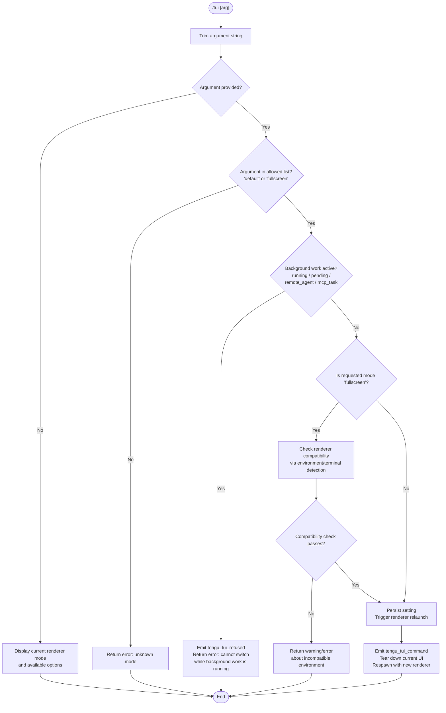

# `/tui`

> Analysis basis: CC v2.1.169 bundle.js (AST extraction + Claude interpretation)
> Minimum version: v2.1.169

---

## Overview

The `/tui` command allows the user to switch the terminal UI renderer between `default` and `fullscreen` modes within an active Claude Code session. It validates the requested mode against the set of known renderer values, checks that no background work is currently running, then triggers a live renderer switch (which involves tearing down the current UI, relaunching the process under the selected renderer, and restoring the display). Background sessions always use the `fullscreen` renderer regardless of this setting.

---

## Registration

| Field | Value |
|---|---|
| type | `local-jsx` |
| name | `tui` |
| description | `Set the terminal UI renderer (default \| fullscreen)` |
| argumentHint | `[default\|fullscreen]` |
| module_id | `eqK` |
| load_inline | `true` |
| loc_byte | `12544449` |
| loc_byte_end | `12544631` |
| loc_line | `8891` |
| arbor_handler.name | `_Uf` |
| arbor_handler.fqn | `claude-2.1.169::_Uf` |
| arbor_handler.kind | `AsyncFunction` |
| arbor_handler.resolution_path | `module_id` |
| arbor_handler.n_hits | `0` |

Analysis basis: CC v2.1.169 bundle.js:+12544449

---

## Input Branching

The command has 4+ distinct branches (no argument, invalid mode, background-work running, valid mode with potential renderer compatibility checks), so a Mermaid flowchart is used.



Analysis basis: CC v2.1.169 bundle.js:+12542346 (handler entry `_Uf`), +12543052 (background state checks), +12543141 (refused telemetry), +12543614 (command telemetry)

---

## Behavioral Spec

### 1. Argument Parsing and Mode Validation

```
async function tuiCommandHandler(context):
    rawArg = context.args.trim()                      // +12542346

    allowedModes = ["default", "fullscreen"]
    modeList = allowedModes.join(", ")                // +12542458

    if rawArg is empty:
        // Show current renderer value and usage
        currentMode = getEffectiveRendererMode(context)
        return renderUsageDisplay(currentMode, allowedModes)

    if rawArg not in allowedModes:                    // +12542504
        return error("Unknown mode: " + rawArg +
                     "\nAllowed: " + modeList)

    requestedMode = rawArg
```

Analysis basis: CC v2.1.169 bundle.js:+12542346, +12542458, +12542504

---

### 2. Background-Session Renderer Notice

```
function backgroundSessionRendererNotice():
    // Background sessions always use fullscreen regardless of /tui setting.
    // The notice text says (paraphrased ≤30 chars fragment):
    //   "…always use the fullscreen renderer…"   (+12542656)
    return informationalMessage(BACKGROUND_SESSION_NOTICE)
```

The literal notice string starts with "Background sessions always use…" (bundle.js:+12542656). This is shown alongside the mode display to set expectations.

Analysis basis: CC v2.1.169 bundle.js:+12542656

---

### 3. Active Background Work Gate

```
function checkNoActiveBackgroundWork(appState):
    // Scan for sessions in states: "running", "pending",
    //                               "remote_agent", "mcp_task"
    activeStates = ["running", "pending", "remote_agent", "mcp_task"]
    hasActive = Object.values(appState.sessions)
                    .some(s => activeStates.includes(s.status))
    if hasActive:
        emit telemetry("tengu_tui_refused")           // +12543141
        return Error(CANNOT_SWITCH_MSG)
        // CANNOT_SWITCH_MSG ≈ "Cannot switch renderers while…"  (+12543182)
    return null
```

Analysis basis: CC v2.1.169 bundle.js:+12543052 (`"running"`), +12543074 (`"pending"`), +12543095 (`"remote_agent"`), +12543120 (`"mcp_task"`), +12543141 (telemetry), +12543182 (error message)

---

### 4. Renderer Compatibility Detection (`Zk`)

Before applying `fullscreen`, the handler calls the terminal-capability detector (identifier `Zk`). This function evaluates the current terminal environment:

```
function detectRendererCompatibility(requestedMode):
    termInfo = queryTerminalEnvironment()        // +12543481

    // Check for known incompatible environments:
    //  - tmux -CC (iTerm2 integration mode)     (+3456437)
    //  - Windows over SSH (ConPTY)              (+3456623)
    //  - JetBrains IDE terminal                 (+3529282)
    //  - Cursor / VS Code embedded terminal     (+3529959, +3530008)
    //  - xterm.js-based terminals               (+3530128)
    //  - Environment flag CLAUDE_CODE_NO_FLICKER (+12540181)
    //  - Environment flag CLAUDE_CODE_DISABLE_ALTERNATE_SCREEN (+12540206)

    if CLAUDE_CODE_FORCE_FULLSCREEN_UPSELL env set:  // +12540245
        forceUpsell = true

    compatibilityResult = evaluateTerminal(termInfo)
    // Returns one of the mode-decision keys:
    //   "bg_forced_on", "env_off", "env_on",
    //   "tmux_cc_auto_off", "win_ssh_auto_off",
    //   "settings_on", "settings_off",
    //   "downsell_on", "gb_on", "gb_off"       (+3457182..+3457559)

    return compatibilityResult
```

If the detected state is `"tmux_cc_auto_off"`, the user sees a warning that fullscreen is disabled due to tmux -CC integration mode, and that they can override with `CLAUDE_CODE_NO_FLICKER=1`.
If the detected state is `"win_ssh_auto_off"`, a similar warning is shown for Windows-over-SSH.

Analysis basis: CC v2.1.169 bundle.js:+12543481, +3456437, +3456623, +3529282, +3529959, +3530008, +3530128, +12540181, +12540206, +12540245, +3457182

---

### 5. Mode Persistence and Renderer Relaunch (`MTH` / `Sx6`)

```
async function applyRendererSwitch(requestedMode, context):
    // Persist the new renderer mode into settings              // +12542632
    saveRendererSetting(requestedMode)

    // Emit success telemetry
    emit telemetry("tengu_tui_command",
                   { mode: requestedMode,
                     uptime: Math.round(process.uptime()) })   // +12543614, +12543705, +12543716

    // Initiate the relaunch sequence (identifier MTH / Sx6)   // +12544064
    // Steps performed during relaunch:
    //   1. Stop the interval / animation timer (clearInterval) // +7317878
    //   2. Unmount the current Ink/React UI (H.unmount)        // +7316244
    //   3. Write terminal reset sequences (\x1b7 / \x1b8)     // +3800525, +3800536
    //   4. Flush analytics with timeout 2000ms                 // +12538231
    //   5. Wait for event-loop drain with timeout 30000ms      // +12538174
    //   6. Remove all process signal listeners                 // +12538676
    //   7. Register SIGINT / SIGHUP handlers for relaunch     // +12538706
    //   8. spawnSync the new process via rqK.spawnSync
    //      with stdio: "inherit" and --resume flag            // +12538733, +12538107
    //   9. process.exit() after child returns                  // +12538982
```

Analysis basis: CC v2.1.169 bundle.js:+12543614, +12544064, +12538174, +12538231, +7317878, +7316244, +3800525, +12538676, +12538733, +12538982

---

### 6. Settings Resolution Chain (`t_`)

The handler reads and writes TUI mode through the layered settings system:

```
function resolveRendererSetting():
    // Priority order (highest to lowest):
    //   policySettings  (+1286576)
    //   flagSettings    (+1286598)
    //   userSettings    (+1268131)
    //   projectSettings (+1268195)
    //   localSettings   (+1268217)
    //
    // Relevant keys inspected:
    //   "fullscreen" in userSettings / localSettings
    //   "default"    as fallback
    //
    // Settings files:
    //   ~/.claude/settings.json            (+1268467)
    //   ~/.claude/settings.local.json      (+1268841)
    //   .claude/settings.json (project)    (+1268467)
    //   managed-settings.json (policy)     (+1265036)

    return mergedSettings.tui ?? "default"
```

Analysis basis: CC v2.1.169 bundle.js:+1286576, +1286598, +1268131, +1268195, +1268217

---

## State & Side Effects

| Item | Detail |
|---|---|
| Telemetry: `tengu_tui_refused` | Fired when the switch is blocked because background work is active (bundle.js:+12543141) |
| Telemetry: `tengu_tui_command` | Fired on successful mode switch; carries mode and uptime fields (bundle.js:+12543614) |
| Telemetry: `tengu_scroll_summary` | Fired during UI teardown / relaunch sequence (bundle.js:+7318000) |
| Telemetry: `tengu_amber_creek` | Renderer-decision path signal (bundle.js:+3456954) |
| Telemetry: `tengu_pewter_brook` | Renderer-decision path signal (bundle.js:+3456862) |
| appState changes | New renderer preference written to user/local settings JSON on disk |
| UI teardown | Current Ink/React tree is unmounted (`H.unmount`); terminal reset escape sequences are emitted (bundle.js:+7316244, +3800525) |
| Process relaunch | `spawnSync` forks a new CC process inheriting stdio with `--resume` and the new renderer mode (bundle.js:+12538733, +12538107) |
| Signal cleanup | `process.removeAllListeners()` clears all handlers before the respawn (bundle.js:+12538676) |
| Analytics flush | Queued analytics are drained before exit; two timeouts apply: 2 000 ms for analytics flush, 30 000 ms overall flush (bundle.js:+12538174, +12538231) |
| Environment overrides | `CLAUDE_CODE_NO_FLICKER`, `CLAUDE_CODE_DISABLE_ALTERNATE_SCREEN`, `CLAUDE_CODE_FORCE_FULLSCREEN_UPSELL` influence the decision path without persisting (bundle.js:+12540181, +12540206, +12540245) |

---

## Version History

| Version | Change |
|---|---|
| v2.1.169 | Initial analysis |

---

## Common Mistakes

1. **Running `/tui fullscreen` while background tasks are active** — The command will be refused with the "Cannot switch renderers while work is running in the background" error. Stop or wait for all `/tasks` to complete first.
2. **Expecting `/tui` to affect background sessions** — Background sessions permanently use `fullscreen` regardless of this setting; the command only affects sessions started directly with `claude`.
3. **Confusion between `default` and `fullscreen` in incompatible terminals** — In tmux -CC (iTerm2 integration) or Windows-over-SSH environments, `fullscreen` is automatically downgraded to `default`. Override with `CLAUDE_CODE_NO_FLICKER=1` only if you accept potential rendering artifacts.
4. **Forgetting that the change causes a process respawn** — `/tui` issues a full process relaunch via `spawnSync`; any in-memory state not already persisted to disk will not survive the switch.
5. **Passing an argument that is neither `default` nor `fullscreen`** — Any other string is rejected immediately with an "unknown mode" error before any side effects occur.

---

## Appendix — Identifier Mapping

> For bundle debugging only. Identifiers change across versions.

| Identifier | Role |
|---|---|
| `_Uf` | Main async handler for `/tui` (Arbor-resolved, `AsyncFunction`) |
| `Sx6` | Relaunch orchestrator — called by `_Uf` to initiate process respawn |
| `MTH` | Core relaunch sequence: teardown → analytics flush → spawnSync → exit |
| `LR` | Resolves installed binary path (version directory lookup) |
| `uI8` | Binary path builder utility (joins version/bin paths) |
| `Z$` | Array normalization helper |
| `Q5H` | Local path join helper (`.local/share/claude/…`) |
| `X1H` | Binary path segment builder |
| `mj8` | Home directory path resolver |
| `Vy` | Settings/config value accessor |
| `I6` | Internal utility (called during relaunch, wraps `xZ`) |
| `xZ` | Low-level config accessor |
| `zv6` | Interval/timer stop helper |
| `$g_` | `clearInterval` wrapper |
| `pRH` | UI teardown: unmounts Ink tree, writes terminal escape sequences |
| `H` | Ink render/unmount interface |
| `N` | Bootstrap fetch / HTTP helper |
| `w2_` | String splitting/trimming utility |
| `u6H` | Set membership checker |
| `n3` | String replace utility |
| `M9` | Compound string/encoding helper |
| `v58` | Terminal output writer (writes reset escape sequences to stdout) |
| `mkH` | Terminal capability version checker (ghostty/iTerm version gating) |
| `X0` | tmux/screen escape-sequence escaping utility |
| `bP8` | Scroll summary emitter / UI state serializer |
| `Co9` | Timing/animation frame calculator |
| `So9` | Animation helper |
| `E1` | Renderer-mode decision engine (fullscreen vs default) |
| `_E_` | Internal decision sub-step |
| `ta` | Platform/capability sub-check |
| `HE_` | SSH/Windows detection sub-check |
| `d_` | Settings write helper |
| `WCL` | Settings merge utility |
| `D6` | Settings store get/set/has operations |
| `BL` | Promise timeout race utility |
| `_Z` | Event-loop drain initiator |
| `o4` | Drain wrapper |
| `Z9` | Event-loop registration (ZGA.register) |
| `EBH` | Analytics drain (ZGA.drain) |
| `BRH` | Analytics flush with timeout |
| `RP8` | Flush sub-step |
| `b5A` | Binary path resolver for respawn target |
| `G_` | Config/path helper |
| `X4` | Path helper (wraps `xZ`) |
| `nqK` | Process re-exec via `execve` / `dlopen` (native FFI relaunch) |
| `f` | FFI/dlopen handle |
| `MU8` | Memory check / low-memory telemetry emitter |
| `JW6` | File-based config reader |
| `hH` | Hook/event registration helper |
| `Q` | Permission-mode retire helper |
| `uPA` | Daemon socket connection manager |
| `gPA` | Daemon session lifecycle manager |
| `D` | Forced-shutdown / process.exit wrapper |
| `E8` | Error-code string normalizer |
| `K6` | Core utility dispatcher (wraps `c76`) |
| `M` | MCP client orchestrator |
| `mSH` | MCP server connection handler |
| `cd8` | MCP connection result applier |
| `dXA` | MCP client map rebuilder |
| `z` | Background session stop sequencer |
| `rh` | First-party check helper |
| `PU` | Graceful shutdown race (Promise.race + process.exit) |
| `EH` | Error-to-string coercer |
| `ij` | Relaunch-spawn-error file writer |
| `Vm8` | CLI argument reconstructor for respawn |
| `tEH` | Argument serialization helper |
| `y6` | Config file watch/load entry point |
| `y7H` | Config file reader with backup/migration logic |
| `F6` | JSON.parse wrapper |
| `Vu` | String prefix stripper |
| `ke1` | Config directory scanner |
| `yG_` | Path join + normalize helper |
| `jhL` | File-watcher registration (watchFile/unwatchFile) |
| `tB` | Watch callback debouncer |
| `u_` | App-state session-info extractor |
| `US8` | Session allowed-tools extractor |
| `L1` | Settings layer resolver |
| `BS8` | Session disallowed-tools extractor |
| `Jb` | Permission-disable helper |
| `M$` | App-state effort/model extractor |
| `w9` | Daemon-worker mode check |
| `nDH` | Worker-mode string constant |
| `GJH` | Renderer mode evaluator (returns fullscreen/default decision) |
| `t_` | Settings load-from-disk orchestrator |
| `V$` | Settings object builder |
| `EYH` | Settings file path resolver |
| `er6` | Path resolution helper (iI.resolve + dirname) |
| `hh4` | Settings layer initializer |
| `ku` | `~/.claude` path joiner |
| `yh4` | Managed-settings path builder |
| `YB` | Multi-layer settings merger |
| `Oz6` | WSL-aware path resolver |
| `W9_` | Full settings load pipeline |
| `RgA` | Settings object key merger |
| `SgA` | Per-layer settings applier |
| `zB` | Settings cache read/write |
| `e0A` | Settings cache getter |
| `fh` | structuredClone wrapper |
| `j9_` | Settings field validator/parser |
| `HGA` | Settings cache setter |
| `ygA` | Inline SDK settings applier |
| `U4H` | Settings field type checker |
| `hQH` | Settings diagnostics/warning emitter |
| `G2` | File-read utility (reads config file from disk) |
| `uo` | UTF-8/UTF-16 file reader with BOM detection |
| `c3` | Realpath resolver |
| `Gi6` | Directory existence checker |
| `k8` | Error code normalizer (wraps `E8`) |
| `y1_` | Settings-access timestamp recorder |
| `_vH` | Settings path + merge helper |
| `WO6` | Atomic file writer (temp + rename) |
| `CH` | JSON.stringify wrapper |
| `yO` | Settings cache clear |
| `Or6` | Settings write-to-disk handler (mkdir + readFile + writeFile/appendFile) |
| `C6` | Store context getter |
| `Wi6` | AsyncLocalStorage store accessor |
| `z1_` | Settings load-cache initializer |
| `$r6` | Git-ignore check (git check-ignore) |
| `U_` | Git subprocess runner |
| `qy4` | Path expansion (tilde → home) |
| `yBA` | Git ls-files tracker check |
| `DB` | Full settings-load-from-disk entry (calls `t_`, `YB`) |
| `bZ` | Settings load lock/guard |
| `t9` | Performance-mark emitter |
| `Ku` | `require` wrapper (perf_hooks) |
| `G9_` | Settings load-end bookkeeping + watcher setup |
| `C8` | Append-to-log helper |
| `$z6` | Watched-path set manager |
| `Zk` | Terminal-environment capability detector |
| `H26` | Terminal identifier string extractor |
| `HD` | Terminal version parser |
| `aE_` | Cursor/VS Code terminal sub-check |
| `xmL` | xterm.js version range checker |
| `Qz` | Terminal version comparator |
| `umL` | Column-width calculator |
| `sE_` | Minimum-column constant |
| `su` | Telemetry/analytics event emitter |
| `lC` | Analytics batch flusher |
| `dkL` | Analytics event serializer |
| `_6` | String coercer |
| `oL` | Analytics transport writer |
| `W$` | Analytics queue manager |
| `zO6` | Analytics rate-limiter |
| `duA` | Analytics item formatter |
| `b9` | Telemetry consent checker |
| `C$9` | Telemetry event builder |
| `yyH` | Telemetry payload builder |
| `Db` | Telemetry send (YA transport) |
| `VW6` | Telemetry config reader |
| `kfH` | Telemetry opt-in/opt-out evaluator |
| `kq` | Telemetry traffic-class checker |
| `G7H` | Telemetry string formatter |