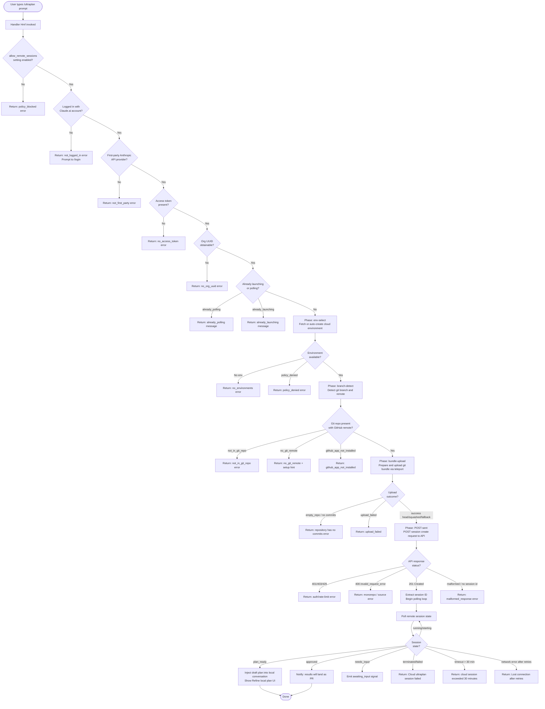

# `/ultraplan`

> Analysis basis: CC v2.1.169 bundle.js (AST extraction + Claude interpretation)
> Minimum version: v2.1.169

---

## Overview

`/ultraplan` drafts an editable plan in Claude Code on the web by launching a cloud (remote) session that runs an orchestrator agent against the user's repository. The command performs a multi-phase eligibility check, uploads a git bundle representing the current working tree, creates a remote cloud session, polls for its outcome, and—when the cloud session produces a plan—injects that draft back into the local conversation for the user to refine. If the remote session fails or the user is ineligible, the command falls back gracefully with descriptive error messages.

---

## Registration

| Field | Value |
|---|---|
| type | `local-jsx` |
| name | `ultraplan` |
| description | `Draft an editable plan in Claude Code on the web ( ... ) · See ...` |
| argumentHint | `<prompt>` |
| load_inline | `true` |
| load_ident | `Hmf` |
| loc_byte | `12370928` |
| loc_byte_end | `12371160` |
| loc_line | `8663` |
| arbor_handler.name | `Hmf` |
| arbor_handler.fqn | `claude-2.1.169::Hmf` |
| arbor_handler.kind | `AsyncFunction` |
| arbor_handler.resolution_path | `load_ident` |
| arbor_handler.n_hits | `1` |

Analysis basis: CC v2.1.169 bundle.js:+12370928

The handler was inlined via `load:()=>Promise.resolve({call: Hmf})`. Arbor resolved the handler through the `load_ident` path with exactly 1 symbol hit. All behavioral analysis below references `Hmf` as the command's main entry point.

---

## Input Branching

The command has well over three distinct code paths based on eligibility conditions, session state, and polling outcomes. A Mermaid flowchart is used.



Analysis basis: CC v2.1.169 bundle.js:+12369068 (Hmf), +12366308 (Ex6), +9316180 (eligibility checks), +12353994 (plan_ready), +12354009 (needs_input), +12353804 (terminated)

---

## Behavioral Spec

### 1. Handler Entry and Precondition Checks (`Hmf`)

```
async function ultraplanHandler(context):
    // Read remote-session policy flag
    if not appState.allow_remote_sessions:
        return error("policy_blocked",
            "Cloud sessions are disabled by your organization's policy.")

    // Invoke eligibility checker
    eligibility = await checkRemoteEligibility(context)
    if eligibility.not_logged_in:
        return error("not_logged_in",
            "Please run /login and sign in with your Claude.ai account (not Console).")
    if eligibility.not_first_party:
        return error("not_first_party",
            "Cloud sessions are only available on the first-party Anthropic API provider.")
    if eligibility.no_access_token:
        return error("no_access_token", "No access token found for cloud session creation")
    if eligibility.no_org_uuid:
        return error("no_org_uuid", "Unable to get organization UUID for cloud session creation")

    // Guard against double-invocation
    if sessionState == "already_polling":
        return warning("already_polling")
    if sessionState == "already_launching":
        return warning("ultraplan: already launching. Please wait for the session to start.")

    // Extract and normalise user prompt
    prompt = extractUserPrompt(context)   // via promptExtractor(DR8/YR8/L1A)
    if prompt is empty and "ultraplan" not in rawInput:
        return hint('Usage: /ultraplan <prompt>, or include "ultraplan" anywhere in your prompt')

    // Determine invocation source tag ("slash")
    sourceTag = "slash"

    // Delegate to launch orchestrator
    return await launchUltraplan(prompt, context, sourceTag)
```

Analysis basis: CC v2.1.169 bundle.js:+12369068 (+Hmf), +12369089 (allow_remote_sessions), +12369161 (system/slash tag), +12366567 (already_polling), +12366585 (already_launching), +12365172 (already launching message)

---

### 2. Prompt Extraction (`DR8` / `YR8` / `L1A`)

```
function extractPrompt(rawInput):
    // Scan input for the "ultraplan" keyword (case-insensitive, global regex with "gi" flag)
    matches = rawInput.matchAll(/ultraplan/gi)
    // Collect surrounding segments
    segments = []
    for match in matches:
        segment = rawInput.slice(match.index + length("ultraplan"))
        normalised = segment.replace(/punctuation/, "$1$2")
        segments.push(normalised.trim())

    if segments is empty:
        // Check whether raw string starts with the command prefix
        if rawInput.startsWith("/ultraplan"):
            return rawInput.slice(len("/ultraplan")).trim()
        return ""

    // Join all extracted fragments, truncate to 5 words for identifier hashing
    identifier = segments[0].split(" ").slice(0, 5).join(" ")
    return { fullPrompt: segments.join(" "), identifier }
```

Key constants:
- Regex flag: `"gi"` (global, case-insensitive) — Analysis basis: CC v2.1.169 bundle.js:+10679269
- The "ultraplan" keyword is matched literally — Analysis basis: CC v2.1.169 bundle.js:+10679621
- Segment trim limit: `5` — Analysis basis: CC v2.1.169 bundle.js:+10679969
- Replacement pattern: `"$1$2"` — Analysis basis: CC v2.1.169 bundle.js:+10679946
- String padding constant: `40` characters — Analysis basis: CC v2.1.169 bundle.js:+16533353

---

### 3. Eligibility Check (`b9` / `o2q`)

```
async function checkRemoteEligibility(context):
    result = {}

    // Check login state via session registry
    if not sessionRegistry.has(context.session):
        result.not_logged_in = true
        return result

    // Check first-party provider
    providerInfo = getProviderInfo()
    if providerInfo.type != "firstParty":
        result.not_first_party = true
        return result

    // Check allow_product_feedback gate (used as proxy for account type)
    if not flags.allow_product_feedback:
        result.not_logged_in = true
        return result

    // Fetch org membership (enterprise / team)
    orgInfo = await fetchOrgInfo()     // reads enterprise/team literals
    if not orgInfo.accessToken:
        result.no_access_token = true
        return result
    if not orgInfo.uuid:
        result.no_org_uuid = true
        return result

    // Run background eligibility check (fires tengu_ccr_bundle_seed_enabled)
    seedEnabled = await checkBundleSeedEnabled(context)
    result.seedEnabled = seedEnabled

    // Check GitHub remote presence
    remoteUrl = await getGitRemoteUrl()    // git config --get remote.origin.url
    if not remoteUrl:
        result.no_git_remote = true
    else if not remoteUrl.includes("github.com"):
        result.no_git_remote = true

    // Check GitHub App installation
    appInstalled = await checkGithubAppInstalled(context)
    result.githubAppInstalled = appInstalled

    return result
```

Key constants:
- `"firstParty"` provider check — Analysis basis: CC v2.1.169 bundle.js:+4211559
- `"enterprise"` / `"team"` org tiers — Analysis basis: CC v2.1.169 bundle.js:+4211832, +4211867
- `"allow_product_feedback"` flag key — Analysis basis: CC v2.1.169 bundle.js:+4212133
- `"allow_remote_sessions"` flag key — Analysis basis: CC v2.1.169 bundle.js:+12369089
- `"github.com"` remote host check — Analysis basis: CC v2.1.169 bundle.js:+9314921
- git command: `git config --get remote.origin.url` — Analysis basis: CC v2.1.169 bundle.js:+1112936
- Telemetry: `tengu_ccr_bundle_seed_enabled` — Analysis basis: CC v2.1.169 bundle.js:+9314725

---

### 4. Launch Orchestrator (`Ex6`)

```
async function launchUltraplan(prompt, context, sourceTag):
    // Mark session as "launching" to block re-entry
    setState("already_launching")

    // Phase: env-select — list available cloud environments
    envList = await fetchEnvironmentList(context)   // fires teleport_environments_list
    if envList.policy_denied:
        emit telemetry("tengu_ultraplan_create_failed", reason="policy_denied")
        return error("policy_denied", "Cloud sessions are disabled by your organization's policy.")
    if envList.not_first_party:
        return error("not_first_party", ...)
    if envList.no_access_token:
        return error("no_access_token", ...)

    // Auto-create default environment if none exists
    selectedEnv = selectEnvironment(envList)
    if selectedEnv is null:
        createdEnv = await createDefaultEnvironment(context)
        // Fires tengu_teleport_default_environment_create
        if createdEnv failed:
            warn("Could not create a cloud environment. Set one up at https://claude.ai/code/onboarding?magic=env-setup")
            return error("no_environments", "No environments available for session creation")
        selectedEnv = createdEnv

    // Phase: branch-detect — resolve git branch and source
    branchInfo = await detectBranch(context)   // uses git symbolic-ref, show-ref
    if branchInfo.not_in_git_repo:
        return error("not_in_git_repo", "Not in a git repository")
    if branchInfo.no_git_remote:
        return error("no_git_remote",
            "Cloud agents require a GitHub remote. Add one with `git remote add origin REPO_URL`.")
    if branchInfo.github_app_not_installed:
        return error("github_app_not_installed")

    // Phase: bundle-upload — pack working tree and upload
    bundleResult = await uploadGitBundle(context, branchInfo, selectedEnv)
    // fires tengu_ccr_bundle_upload, tengu_teleport_bundle_mode, tengu_teleport_source_decision
    if bundleResult.empty_repo:
        return error("empty_repo", "Repository has no commits — run `git add . && git commit -m \"initial\"` then retry")
    if bundleResult.upload_failed:
        return error("upload_failed")

    // Phase: POST-sent — create the remote session
    sessionResult = await createRemoteSession(context, prompt, selectedEnv, bundleResult)
    // fires tengu_ccr_session_link
    if sessionResult.status == 401 or 403 or 429:
        emit telemetry("tengu_ultraplan_create_failed", reason="create_request_failed")
        return error("create_request_failed")
    if sessionResult.status == 400 and error_type == "invalid_request_error":
        return handle monorepo error (monorepo_source_disallowed / monorepo_byoc_source_missing / monorepo_source_env_mismatch)
    if not sessionResult.sessionId:
        return error("malformed_response", "Server returned a malformed session response (no session id)")

    // Emit launch telemetry
    emit telemetry("tengu_ultraplan_launched")

    // Transition to polling
    setState("already_polling")
    return await pollRemoteSession(sessionResult.sessionId, prompt, context)
```

Analysis basis: CC v2.1.169 bundle.js:+12366308 (Ex6), +12366608 (E1K state machine), +12366721 (tu8/su8), +12366835 (euf main flow), +12368026 (tengu_ultraplan_launched)

---

### 5. Environment Selection and Creation (`Si` / `we` / `FA6`)

```
async function fetchEnvironmentList(context):
    // Header: anthropic-beta: ccr-byoc-2025-07-29
    // Header: x-organization-uuid: <orgUUID>
    response = await apiClient.get(environments_endpoint, {
        headers: {
            "anthropic-beta": "ccr-byoc-2025-07-29",
            "x-organization-uuid": orgUUID,
            "anthropic-version": "2023-06-01"
        },
        timeout: 15000   // ms
    })
    return parseEnvironmentList(response)

async function createDefaultEnvironment(context):
    // POST a "Default" environment with preset runtime config
    payload = {
        name: "Default",
        // runtime: python 3.11, node 20, home /home/user
        // provider: anthropic_cloud / anthropic
    }
    response = await apiClient.post(environments_endpoint, payload)
    // fires tengu_teleport_default_environment_create
    return response.environment
```

Key constants:
- API beta header value: `"ccr-byoc-2025-07-29"` — Analysis basis: CC v2.1.169 bundle.js:+9241057
- x-organization-uuid header name: `"x-organization-uuid"` — Analysis basis: CC v2.1.169 bundle.js:+9241079
- Timeout: `15000` ms — Analysis basis: CC v2.1.169 bundle.js:+9187598
- Default env name: `"Default"` / `"Default - trusted network access"` — Analysis basis: CC v2.1.169 bundle.js:+9187858, +9188328
- Default Python version: `"3.11"` — Analysis basis: CC v2.1.169 bundle.js:+9188483
- Default Node version: `"20"` — Analysis basis: CC v2.1.169 bundle.js:+9188512
- Default home dir: `"/home/user"` — Analysis basis: CC v2.1.169 bundle.js:+9188404
- Provider tag: `"anthropic_cloud"` / `"anthropic"` — Analysis basis: CC v2.1.169 bundle.js:+9188298, +9188388

---

### 6. Git Bundle Upload (`Ss_`)

```
async function uploadGitBundle(context, branchInfo, env):
    // Verify we are in a git repo
    if not inGitRepo():
        return { error: "not_in_git_repo", message: "Not in a git repository" }

    // Stash any uncommitted changes with a seed stash ref
    stashResult = await gitStash("create")
    // Writes refs/seed/stash and refs/seed/root
    if stashResult.failed:
        return { error: "stash_failed" }

    // Check that HEAD exists (repo has at least one commit)
    headExists = await git("rev-parse", "--verify", "HEAD")
    if not headExists:
        return { error: "empty_repo", message: "Repository has no commits yet" }

    // Pack the bundle
    bundlePath = buildTempPath("ccr-seed", ".bundle")
    // Creates _source_seed.bundle
    bundleCreated = await createGitBundle(bundlePath)

    // Upload the bundle to the cloud environment's seed endpoint
    uploadResponse = await apiClient.post(seed_upload_url, bundleContent)
    if uploadResponse.status != 200:
        return { error: "upload_failed" }

    // Determine bundle mode for telemetry
    mode = determineBundleMode(branchInfo)
    // mode is one of: head, fallback_head, squashed, fallback_squashed
    emit telemetry("tengu_ccr_bundle_upload", { mode })
    emit telemetry("tengu_teleport_bundle_mode")

    // Clean up seed refs
    await git("update-ref", "-d", "refs/seed/stash")
    await git("update-ref", "-d", "refs/seed/root")
    return { success: true, mode }
```

Key constants:
- Stash ref: `"refs/seed/stash"` — Analysis basis: CC v2.1.169 bundle.js:+9224587
- Root ref: `"refs/seed/root"` — Analysis basis: CC v2.1.169 bundle.js:+9224605
- Bundle filename suffix: `"_source_seed.bundle"` — Analysis basis: CC v2.1.169 bundle.js:+9226089
- Upload success status: `200` — Analysis basis: CC v2.1.169 bundle.js:+9225303
- Bundle modes: `head`, `fallback_head`, `squashed`, `fallback_squashed` — Analysis basis: CC v2.1.169 bundle.js:+9226459, +9226498, +9226533, +9226576

---

### 7. Remote Session Creation (`X2q` / `DC`)

```
async function createRemoteSession(context, prompt, env, bundleResult):
    // Generate a UUID for this session request
    requestId = crypto.randomUUID()

    // Build session payload
    payload = {
        event: "control_request",
        type: "set_permission_mode",
        prompt: prompt,
        source: bundleResult.mode,
        environment_id: env.id,
        // branch info, git remote URL, source type
    }

    // POST to session creation endpoint with org UUID header
    response = await apiClient.post(sessions_endpoint, payload, {
        headers: {
            "anthropic-beta": "ccr-byoc-2025-07-29",
            "x-organization-uuid": orgUUID
        }
    })

    if response.status == 500:
        // retry once after brief delay
        ...
    if response.status in [401, 403, 429]:
        emit telemetry("tengu_ultraplan_create_failed", reason="create_request_failed")
        return { error: "create_request_failed", status: response.status }
    if response.status == 201:
        sessionData = response.data
        if not sessionData.id:
            return { error: "malformed_response",
                message: "Server returned a malformed session response (no session id)" }
        emit telemetry("tengu_ccr_session_link")
        return { sessionId: sessionData.id, ...sessionData }

    return { error: "create_request_failed" }
```

Key constants:
- Expected creation status: `201` — Analysis basis: CC v2.1.169 bundle.js:+9242356
- Error statuses handled: `401`, `403`, `429` — Analysis basis: CC v2.1.169 bundle.js:+9242424, +9242428, +9242432
- Server error: `500` — Analysis basis: CC v2.1.169 bundle.js:+9242320
- Conflict status (duplicate session): `409` — Analysis basis: CC v2.1.169 bundle.js:+9250492
- None-bundle source string: `"a seed bundle (no git source)"` — Analysis basis: CC v2.1.169 bundle.js:+9248386

---

### 8. Polling Loop (`ouf` / `w1K` / `e2q`)

```
async function pollRemoteSession(sessionId, prompt, context):
    timeout_seconds = 5400    // 90 minutes hard cap
    poll_interval_ms = 1000
    max_poll_ms = 1800000     // 30-minute session limit
    retry_budget = ...

    emit telemetry("tengu_ultraplan_timeout_seconds", { seconds: timeout_seconds })

    startTime = Date.now()
    while True:
        elapsed = Date.now() - startTime
        if elapsed > max_poll_ms:
            return error("cloud session exceeded 30 minutes")

        sessionStatus = await fetchSessionStatus(sessionId)

        switch sessionStatus.state:
            case "plan_ready":
                emit telemetry("tengu_ultraplan_plan_ready")
                draftPlan = extractPlanContent(sessionStatus)
                // Inject "Here is a draft plan to refine:" prefix
                injectIntoConversation("Here is a draft plan to refine:\n" + draftPlan)
                showRefinePlanUI("Refine local plan")
                return success

            case "needs_input":
                emit telemetry("tengu_ultraplan_awaiting_input")
                // Continue polling; surface a notification
                continue

            case "approved":
                emit telemetry("tengu_ultraplan_approved")
                return message("Results will land as a pull request when the cloud session finishes. "
                               "There is nothing to do here.")

            case "terminated" or "failed" or "archived":
                emit telemetry("tengu_ultraplan_failed")
                return error("Cloud ultraplan session failed. Wait for the user's next instructions.")

            case "running" or "starting" or "starting":
                wait(poll_interval_ms)
                continue

            case "requires_action":
                // Surface hook/review action to user
                handleHookAction(sessionStatus)
                continue

        // Network error handling
        if networkError and retries_exhausted:
            return error("Lost connection to the cloud session after repeated retries — "
                         "the session may still be running")
```

Key constants:
- Hard timeout: `5400` seconds (90 min) — Analysis basis: CC v2.1.169 bundle.js:+12361978
- Session limit: `1800000` ms (30 min) — Analysis basis: CC v2.1.169 bundle.js:+9322765
- Poll interval base: `1000` ms — Analysis basis: CC v2.1.169 bundle.js:+9322758
- Plan injection prefix: `"Here is a draft plan to refine:"` — Analysis basis: CC v2.1.169 bundle.js:+12362285
- UI label: `"Refine local plan"` — Analysis basis: CC v2.1.169 bundle.js:+12367479
- States: `plan_ready`, `needs_input`, `approved`, `terminated`, `failed`, `archived`, `running`, `starting`, `requires_action`, `completed` — Analysis basis: CC v2.1.169 bundle.js:+12353994, +12354009, +12353617, +12353804, +9323209, +9323284, +9321188, +9324792, +12353942

---

### 9. Plan Refinement UI (`ruf` / `iuf`)

```
function buildPlanRefinementBlock(draftPlan):
    lines = []
    lines.push("Here is a draft plan to refine:")
    lines.push(draftPlan)
    // Additional context sections assembled by iuf/cuf helpers
    refinedBlock = joinLines(lines)
    return refinedBlock
```

The resulting block is then presented in the local conversation with the label `"Refine local plan"` and tagged as plan type. Analysis basis: CC v2.1.169 bundle.js:+12362278 (ruf), +12362338 (iuf), +12367514 (plan tag), +12367479 (Refine local plan label)

---

### 10. Orphaned Session Cleanup

If a previous ultraplan session ID is found in app state and it is in a non-terminal state when a new `/ultraplan` invocation occurs, the command attempts to archive the orphaned session:

```
function archiveOrphanedSession(oldSessionId):
    try:
        await apiClient.post(archive_endpoint(oldSessionId))
    catch error:
        log.warn("ultraplan: failed to archive orphaned session")
```

Analysis basis: CC v2.1.169 bundle.js:+12368753 (orphan cleanup warning), +12368271 (nN task notification subsystem)

---

### 11. App State Reads and Writes (`Hmf` tail)

```
function finalizeHandler(context, result):
    // Read current appState
    currentState = _.getAppState()

    // Apply result: update Ultraplan panel state
    // Label displayed: "Ultraplan"
    _.setAppState({
        ultraplan: {
            status: result.status,
            sessionId: result.sessionId,
            label: "Ultraplan"
        }
    })
```

Analysis basis: CC v2.1.169 bundle.js:+12369403 (getAppState), +12369625 (setAppState), +12368190 (Ultraplan label)

---

## State & Side Effects

| Item | Detail |
|---|---|
| Telemetry: tengu_ultraplan_create_failed | Fired when session creation fails (policy, auth, API error) — bundle.js:+12366345 |
| Telemetry: tengu_ultraplan_prompt_identifier | Fired with a short identifier derived from the first 5 words of the prompt — bundle.js:+12362111 |
| Telemetry: tengu_ultraplan_launched | Fired after successful session creation, before poll begins — bundle.js:+12368026 |
| Telemetry: tengu_ultraplan_timeout_seconds | Fired at poll start with the configured timeout value (5400 s) — bundle.js:+12361944 |
| Telemetry: tengu_ultraplan_awaiting_input | Fired each time the remote session enters `needs_input` state — bundle.js:+12362588 |
| Telemetry: tengu_ultraplan_plan_ready | Fired when the remote session delivers a completed plan — bundle.js:+12362656 |
| Telemetry: tengu_ultraplan_approved | Fired when the plan has been approved and a PR is expected — bundle.js:+12363063 |
| Telemetry: tengu_ultraplan_failed | Fired on terminal session failure — bundle.js:+12363939 |
| Telemetry: tengu_ccr_bundle_seed_enabled | Fired during eligibility check to record whether bundle seeding is on — bundle.js:+9314725 |
| Telemetry: tengu_ccr_bundle_upload | Fired on successful git bundle upload with mode tag — bundle.js:+9224779 |
| Telemetry: tengu_teleport_bundle_mode | Fired to record which bundle strategy was chosen — bundle.js:+9241401 |
| Telemetry: tengu_ccr_session_link | Fired when the server returns a valid session ID — bundle.js:+9234762 |
| Telemetry: tengu_teleport_source_decision | Fired to record the final source strategy decision — bundle.js:+9246852 |
| Telemetry: tengu_teleport_bundle_mode | Records whether source was `bundle`, `explicit_env_bundle`, `git_repository`, etc. — bundle.js:+9241401 |
| appState changes | `_.setAppState` writes `ultraplan.status`, `ultraplan.sessionId`, `ultraplan.label` — bundle.js:+12369625 |
| appState reads | `_.getAppState()` called to retrieve current session and provider state — bundle.js:+12369403 |
| Hook registration | `Z9` → `ZGA.register` — registers task-notification hooks during session lifecycle — bundle.js:+62328 |
| File system | Creates and removes a temporary git bundle file (`_source_seed.bundle`) in the git-bundle upload phase — bundle.js:+9226089, +9226734 |
| Network | Makes HTTP requests to the Anthropic API (environments list, environment create, session create, session poll, bundle upload) with `anthropic-beta: ccr-byoc-2025-07-29` and `anthropic-version: 2023-06-01` headers |
| Sound / notifications | `"task-notification"` tag used during session state transitions — bundle.js:+12367336 |
| Duplicate session guard | Sets internal flags `already_launching` / `already_polling` to prevent concurrent invocations — bundle.js:+12366567, +12366585 |

---

## Version History

| Version | Change |
|---|---|
| v2.1.169 | Initial analysis |

---

## Common Mistakes

1. **Running `/ultraplan` without being logged in to Claude.ai.** API key authentication is insufficient — the command requires OAuth authentication via `/login` with a Claude.ai account (not the Anthropic Console). Error code: `not_logged_in`.

2. **Running `/ultraplan` in a directory without a GitHub remote.** The command requires a `git remote add origin <GITHUB_URL>` pointing to a GitHub.com repository. Non-GitHub remotes and bare directories both fail with `no_git_remote`.

3. **Running `/ultraplan` in an empty repository.** The working tree must have at least one commit before the git bundle can be created. Fix: `git add . && git commit -m "initial"`.

4. **Invoking `/ultraplan` twice rapidly.** The guard flags `already_launching` / `already_polling` prevent concurrent sessions. The second call immediately returns a warning message; users should wait for the first session to complete or time out.

5. **Expecting instant results.** The command polls asynchronously for up to 30 minutes (hard cap 5400 s). The local UI shows "Ultraplan" status; results appear when the cloud session reaches `plan_ready`.

6. **Using `/ultraplan` in an organization that has disabled remote sessions.** The `allow_remote_sessions` policy flag is checked immediately; if disabled the command exits with `policy_blocked` and directs the user to contact their organization admin.

7. **Confusing the plan delivery model.** When the session reaches `approved` (not `plan_ready`), results are delivered as a GitHub pull request — not injected into the local conversation. There is nothing to do locally in that case.

---

## Appendix — Identifier Mapping

> For bundle debugging only. Identifiers change across versions.

| Identifier | Role |
|---|---|
| `Hmf` | Main async handler for `/ultraplan` (Arbor-resolved entry point) |
| `DR8` | Prompt dispatcher — routes raw input to extraction logic |
| `YR8` | Prompt extraction coordinator |
| `L1A` | Low-level prompt parser — regex match, segment assembly |
| `b9` | Remote eligibility checker — login, first-party, token, org UUID |
| `C$9` | Eligibility sub-checker coordinator |
| `yyH` | Organisation info resolver |
| `Db` | First-party account type detector |
| `VW6` | File-based config reader (`readFileSync`, utf-8) |
| `kfH` | Feature flag inclusion checker |
| `kq` | Telemetry mode resolver (essential-traffic / no-telemetry / default) |
| `duA` | Telemetry string normaliser |
| `_6` | String coercion utility |
| `G7H` | Telemetry gate evaluator |
| `Ex6` | Launch orchestrator — coordinates env-select → bundle-upload → POST-sent phases |
| `M3H` | Session state store accessor |
| `E1K` | Session launch state machine (already_launching / already_polling guard) |
| `tu8` | Pre-launch setup helper |
| `su8` | Session context builder |
| `D6` | Background session dispatcher / queue manager |
| `luf` | Session launch utility |
| `euf` | Full teleport-to-remote flow (env-select, branch-detect, bundle-upload, POST-sent, poll) |
| `K0H` | Environment selector / auto-creator router |
| `o2q` | Background eligibility check (fires `bg_remote_eligibility_check`) |
| `Si` | Full `teleportToRemote` implementation |
| `C6` | API client constructor / request wrapper |
| `oL` | OAuth token accessor |
| `t$` | Auth URL resolver |
| `UN8` | Org UUID fetcher |
| `hH` | Error logger / telemetry error emitter |
| `yC` | Anthropic API error classifier |
| `n1` | OAuth endpoint resolver (local / staging / prod) |
| `Kw` | Request header builder (`anthropic-version`, `anthropic-client-platform`) |
| `Ss_` | Git bundle creator and uploader (`teleport_git_bundle_upload`) |
| `I6` | Environment ID resolver |
| `N` | Log-level formatter / debug logger |
| `K6` | Reactive state getter |
| `DC` | Git remote URL fetcher (`git config --get remote.origin.url`) |
| `X2q` | Session creation POST builder (UUID, payload, headers) |
| `Ry6` | Session response validator |
| `CH` | JSON serialiser wrapper |
| `j2q` | Session link telemetry emitter (`tengu_ccr_session_link`) |
| `VN8` | Session creation retry handler |
| `we` | Environment list fetcher (`teleport_environments_list`) |
| `FA6` | Default environment creator (`teleport_default_environment_create`) |
| `EH` | Error message formatter / string coercer |
| `O` | Output record mapper (message objects) |
| `EAf` | Branch / title generator (`teleport_generate_title`) |
| `ah` | Background session dispatcher (queue + claim) |
| `FbH` | GitHub App installation checker |
| `gI` | Default branch detector (`git symbolic-ref`, `show-ref`) |
| `M9` | macOS notification sender |
| `r6H` | Git remote URL parser (https / http / github detection) |
| `o` | MCP update applicator |
| `wA` | Error type detector (AbortError / isAxiosError) |
| `xz` | Cancel detector |
| `Kz` | Request cancellation handler |
| `ED` | Claude.ai base URL resolver (localhost / staging / prod) |
| `x_` | Module init / ESM shim |
| `WC_` | Environment URL router |
| `tbH` | Remote agent session bootstrapper (session type `remote_agent`) |
| `_y` | Random bytes generator (8-byte nonce) |
| `yA6` | Browser/OS `open` helper for session URL |
| `vW` | Session URL timestamper |
| `_1f` | OS name formatter for session metadata |
| `e2q` | Session polling loop (state machine: running → plan_ready / approved / terminated …) |
| `nN` | Task notification bus (task_started / task_updated events) |
| `q3f` | Task-started notification emitter |
| `_3f` | Task-updated notification emitter |
| `c6A` | Notification dispatch helper |
| `K3f` | Scheduled task notification handler |
| `L3f` | Object-key-based notification dispatcher |
| `_qH` | User-typed task event handler |
| `ouf` | Polling coordinator (wraps `w1K`, handles reconnect and result extraction) |
| `w1K` | Network polling executor with retry budget |
| `duf` | Session status fetcher (calls `D6`) |
| `tuf` | Polling state updater |
| `sy6` | Temporary bundle file cleanup helper |
| `K` | Column formatter / pad-end utility |
| `bp` | Post-plan-ready API call helper |
| `Z9` | Hook registry (`ZGA.register`) |
| `auf` | Orphaned session archiver |
| `y6` | Config file watcher / reader coordinator |
| `l6` | Config directory path resolver |
| `NG_` | Config path normaliser |
| `y7H` | Config file reader with backup logic |
| `F6` | JSON.parse wrapper |
| `Vu` | Relative path stripper (startsWith / slice) |
| `E8` | Config schema validator |
| `ke1` | Config backup directory scanner |
| `yG_` | Backup directory path builder |
| `$` | Config value accessor (D3K) |
| `w` | Background daemon session manager (spawn, claim, kill, low-mem checks) |
| `b` | Scheduled background task runner |
| `a8` | Async kill-with-timeout helper |
| `bH` | Feature-bad telemetry emitter |
| `SH` | Feature-ok telemetry emitter |
| `MU8` | Memory pressure checker (`tengu_bg_low_mem_mb`) |
| `JW6` | Config file JSON reader (`HW.readFile`) |
| `Q` | Permission mode classifier (allow / deny / classify / ask) |
| `uPA` | IPC socket connector (`Mc8.connect`, claim flow) |
| `gPA` | Full background session lifecycle manager |
| `D` | Forced-shutdown handler (`process.exit`, abort) |
| `jhL` | File-watch registration for config changes |
| `tB` | Config change debounce handler |
| `dK6` | Session pre-flight aggregator (DC + ah + AL + C6 + FbH) |