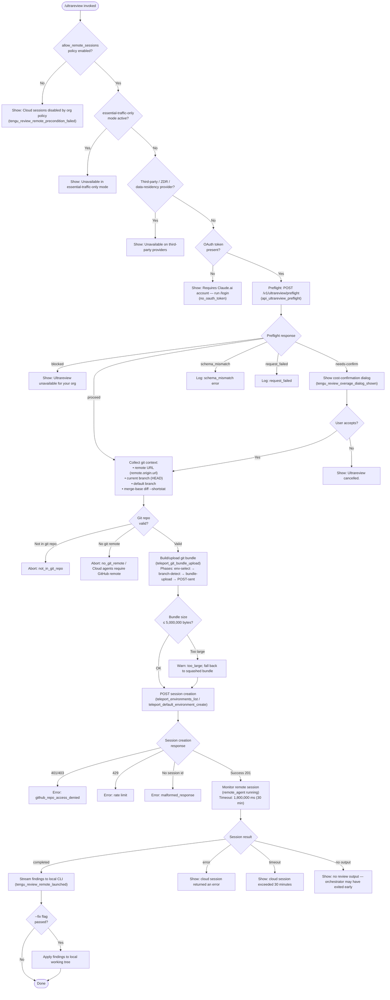

# `/ultrareview`

> Analysis basis: CC v2.1.169 bundle.js (AST extraction + Claude interpretation)
> Minimum version: v2.1.169

---

## Overview

`/ultrareview` launches a cloud-hosted agent on Claude Code for the web that performs deep bug-finding and verification across the current git branch. The command collects local git context (remote URL, current branch, diff statistics, a packed git bundle), uploads that context to Anthropic's cloud infrastructure via a "teleport" pipeline, and then streams the remote agent's findings back to the local CLI. An optional `--fix` flag instructs the agent to apply discovered findings directly to the local working tree when results arrive.

---

## Registration

| Field | Value |
|---|---|
| type | `local-jsx` |
| name | `ultrareview` |
| description | `Start a cloud agent that finds and verifies bugs in your branch ( ... , ... USD) · Runs in Claude Code on the web. See ...` |
| loc_byte | `12382450` |
| loc_byte_end | `12382721` |
| loc_line | `8688` |
| module_id | `k1K` |
| load_inline | `true` |
| arbor_handler.name | `jmf` |
| arbor_handler.fqn | `claude-2.1.169::jmf` |
| arbor_handler.kind | `AsyncFunction` |
| arbor_handler.resolution_path | `module_id` |
| arbor_handler.n_hits | `1` |

Registration block spans bundle.js bytes `12382450`–`12382721`.

Analysis basis: CC v2.1.169 bundle.js:+12382450

---

## Input Branching

The command has more than three distinct precondition paths that must all pass before the cloud session is created, plus divergence during result handling. A flowchart is used below.



Analysis basis: CC v2.1.169 bundle.js:+12380105 (handler entry), +12380108 (`allow_remote_sessions` check), +12380142 (policy-blocked message), +12340850 (preflight endpoint), +12345505 (`proceed` state), +12345885 (`needs-confirm` state), +12381084 (cancellation message)

---

## Behavioral Spec

### 1 — Policy and Provider Guard (`checkRemoteSessionEligibility`)

Before any network call, the handler verifies two flags:

```
async function checkRemoteSessionEligibility(appState):
    if not appState.settings["allow_remote_sessions"]:
        emitError("Cloud sessions are disabled by your organization's policy.")
        # error_code: policy_denied
        return BLOCKED

    providerKind = getProviderKind(appState)
    if providerKind is "zdr" or "data-residency" or thirdParty:
        emitError("Ultrareview runs in Claude Code on the web and is unavailable on third-party providers.")
        return NOT_FIRST_PARTY

    if essentialTrafficOnlyMode(appState):
        emitError("Ultrareview runs in Claude Code on the web and is unavailable when essential-traffic-only mode is active.")
        return ESSENTIAL_TRAFFIC_BLOCKED

    oauthToken = getOAuthToken(appState)
    if oauthToken is absent:
        emitError("Ultrareview requires a Claude.ai account. Run /login to authenticate.")
        return NO_OAUTH_TOKEN

    return OK
```

Analysis basis: CC v2.1.169 bundle.js:+12380108 (`allow_remote_sessions`), +12380142 (policy message), +12341127 (third-party message), +12340980 (essential-traffic message), +12341260 (no-oauth message)

---

### 2 — Preflight Check (`runPreflightRequest`)

```
async function runPreflightRequest(authToken, orgUUID):
    response = await httpPost("/v1/ultrareview/preflight", {
        headers: { "x-organization-uuid": orgUUID }
    })
    # telemetry: api_ultrareview_preflight

    status = response.status
    if status is "blocked":
        emitError("Ultrareview is unavailable for your organization.")
        return BLOCKED
    if status is "needs-confirm":
        # Display cost confirmation dialog showing $10–$20 estimated cost
        # Duration estimate: ~10–20 min
        # telemetry: tengu_review_overage_dialog_shown
        confirmed = await showCostConfirmationDialog()
        if not confirmed:
            return CANCELLED
    if status is "schema_mismatch":
        logError("schema_mismatch")
        return SCHEMA_MISMATCH
    if status is "request_failed":
        logError("request_failed")
        return REQUEST_FAILED
    if status is "proceed":
        return PROCEED
```

Analysis basis: CC v2.1.169 bundle.js:+12340850 (endpoint `/v1/ultrareview/preflight`), +12340626 (`blocked`), +12345885 (`needs-confirm`), +12345505 (`proceed`), +12340139 (`$10-$20` cost estimate), +12340232 (`~10–20 min` duration), +12381062

---

### 3 — Git Context Collection (`collectGitContext`)

```
async function collectGitContext():
    # Verify inside a git repository
    runGit(["rev-parse", "--is-inside-work-tree"])
    # → if fails: error code "not_in_git_repo"

    remoteUrl = runGit(["config", "--get", "remote.origin.url"])
    # Redact credentials from URL (replaces ://***@ pattern)
    # → if absent: error "no_git_remote" / "No git remote URL found"

    currentBranch = runGit(["branch", "--abbrev-ref", "HEAD"])
    defaultBranch = resolveDefaultBranch()
    # tries: symbolic-ref --short refs/remotes/origin/HEAD
    # fallback candidates: "main", "master"

    mergeBase = runGit(["merge-base", defaultBranch, currentBranch])
    diffStats = runGit(["diff", "--shortstat", mergeBase])

    return { remoteUrl, currentBranch, defaultBranch, mergeBase, diffStats }
```

Analysis basis: CC v2.1.169 bundle.js:+9189186 (`rev-parse --is-inside-work-tree`), +1112936 (`remote.origin.url`), +1123922 (`branch --abbrev-ref HEAD`), +1124094 (`symbolic-ref`), +1124232 (`main`/`master`), +12344222 (`merge-base`), +12344729 (`diff --shortstat`)

---

### 4 — Bundle Size Check (`checkBundleMaxBytes`)

```
function checkBundleMaxBytes(objectCount):
    # telemetry: tengu_ccr_bundle_max_bytes
    maxBytes = 5_000_000   # bundle.js:+9221928
    if objectCount > maxBytes:
        # Fall back to squashed bundle strategy
        bundleMode = "squashed"
    else:
        bundleMode = "head"
    return bundleMode
```

Analysis basis: CC v2.1.169 bundle.js:+9221928 (5,000,000 byte limit), +9221487 (`count-objects -v`)

---

### 5 — Git Bundle Upload (`teleportGitBundleUpload`)

The upload pipeline proceeds through four named phases logged to telemetry:

```
async function teleportGitBundleUpload(gitContext, bundleMode):
    # Phase: env-select
    # telemetry: tengu_teleport_bundle_mode
    environments = await listEnvironments()    # teleport_environments_list
    if no environments:
        tryAutoCreateDefaultEnvironment()      # teleport_default_environment_create
        # error if still none: "no_environments" / "no_default_env"

    # Phase: branch-detect
    sourceBranch = detectBranch(gitContext)

    # Phase: bundle-upload
    # telemetry: tengu_ccr_bundle_upload
    seedEnabled = checkSeedBundle()            # tengu_ccr_bundle_seed_enabled
    bundleFile = createGitBundle(bundleMode)
    # bundleFile name: "ccr-seed.bundle" or "_source_seed.bundle"
    uploadResult = await uploadBundleToServer(bundleFile)
    # upload outcomes: success | upload_failed | stash_failed | empty_repo | too_large

    # Phase: POST-sent
    sessionPayload = buildSessionPayload(gitContext, uploadResult)
    response = await httpPost(sessionCreationEndpoint, sessionPayload, {
        headers: {
            "anthropic-beta": "ccr-byoc-2025-07-29",
            "x-organization-uuid": orgUUID
        }
    })
    # telemetry: tengu_ccr_session_link

    if response.status in [401, 403]:
        return error("github_repo_access_denied")
    if response.status is 429:
        return error("rate_limited")
    if response has no session id:
        return error("malformed_response")
    return { sessionId: response.sessionId }
```

Analysis basis: CC v2.1.169 bundle.js:+9224779 (`teleport_git_bundle_upload`), +9225782 (`ccr-seed`), +9226089 (`_source_seed.bundle`), +9241057 (`ccr-byoc-2025-07-29`), +9242356 (201 success), +9242424 (401/403), +9242432 (429), +9242802 (no session id), +9241401 (`tengu_teleport_bundle_mode`), +9314725 (`tengu_ccr_bundle_seed_enabled`)

---

### 6 — Remote Session Monitor (`monitorRemoteAgentSession`)

```
async function monitorRemoteAgentSession(sessionId):
    # telemetry: tengu_review_remote_launched (on successful start)
    TIMEOUT_MS = 1_800_000   # 30 minutes — bundle.js:+9322765
    startTime = Date.now()

    loop:
        if elapsed > TIMEOUT_MS:
            emitError("cloud session exceeded 30 minutes")
            break

        event = await pollSessionEvent(sessionId)

        match event.type:
            "starting"   → logPhase("starting")
            "running"    → logPhase("running")
            "hook_progress" → streamProgressToUser()
            "hook_response" → streamResponseToUser()
            "result"     → extractFindings(); break
            "completed"  → break
            "archived"   → break
            "error"      → emitError("cloud session returned an error"); break
            "idle"       → wait and continue

        if event has no review output:
            emitWarning("no review output — orchestrator may have exited early")

    return findings
```

Analysis basis: CC v2.1.169 bundle.js:+9322765 (1,800,000 ms timeout), +9321188 (`running`), +9323284 (`completed`), +9323209 (`archived`), +9323036 (`assistant`), +9323955 (`hook_progress`), +9323984 (`hook_response`), +9325406 (timeout message), +9325442 (no-output message), +12348890 (`tengu_review_remote_launched`)

---

### 7 — Fix Application (`applyFindingsToWorkingTree`)

When the `--fix` flag is detected in the invocation arguments:

```
function applyFindingsToWorkingTree(findings, args):
    if "--fix" in args:
        # Literal note embedded in prompt context:
        # "The user passed --fix: when the findings arrive, apply them to the local working tree."
        # bundle.js:+12379844
        for finding in findings:
            applyPatch(finding.patch, localWorkingTree)
    else:
        displayFindingsToUser(findings)
```

Analysis basis: CC v2.1.169 bundle.js:+12379844 (`--fix` instruction literal), +12342381 (`fix`), +12342387 (`comment`)

---

### 8 — Cost / Overage Guard (`checkOverageStatus`)

```
async function checkOverageStatus(appState):
    # telemetry: tengu_review_overage_blocked (if blocked)
    # telemetry: tengu_review_overage_dialog_shown (if confirmation shown)
    overageState = getOverageState(appState)
    if overageState is "blocked":
        emitError("Ultrareview is unavailable for your organization.")
        return BLOCKED
    if overageState is "needs-confirm":
        showCostDialog(estimatedCost="$10-$20", duration="~10–20 min")
        return NEEDS_USER_CONFIRMATION
    return OK
```

Analysis basis: CC v2.1.169 bundle.js:+12380439 (`tengu_review_overage_blocked`), +12380776 (`tengu_review_overage_dialog_shown`), +12340139 (`$10-$20`), +12340232 (`~10–20 min`), +12345723 (org-unavailable message)

---

### 9 — GitHub App Preflight (`checkGithubAppInstalled`)

```
async function checkGithubAppInstalled(accessToken, orgUUID):
    if accessToken is absent:
        log("checkGithubAppInstalled: No access token found, assuming app not installed")
        return NOT_INSTALLED

    if orgUUID is absent:
        log("checkGithubAppInstalled: No org UUID found, assuming app not installed")
        return NOT_INSTALLED

    response = await httpGet(githubAppCheckEndpoint)
    if response.status is 400:
        return LIKELY_NOT_INSTALLED
    return IS_INSTALLED
```

Analysis basis: CC v2.1.169 bundle.js:+9189333 (no access token log), +9189446 (no org UUID log), +9190104 (400 status check), +9245422 (`github_preflight_ok`), +9245444 (`github_preflight_failed`)

---

## State & Side Effects

| Item | Detail |
|---|---|
| Telemetry: `tengu_review_remote_precondition_failed` | Fired when a pre-network eligibility check fails (policy, provider, auth) — bundle.js:+12342513 |
| Telemetry: `tengu_review_bughunter_config` | Fired when the bug-hunter configuration object is resolved — bundle.js:+12340022 |
| Telemetry: `tengu_review_overage_blocked` | Fired when the overage check results in a hard block — bundle.js:+12380439 |
| Telemetry: `tengu_review_overage_dialog_shown` | Fired when the cost-confirmation dialog is presented — bundle.js:+12380776 |
| Telemetry: `tengu_review_remote_teleport_failed` | Fired when the teleport (bundle-upload or session-create) phase fails — bundle.js:+12348369 |
| Telemetry: `tengu_review_remote_launched` | Fired when the remote session has been successfully created and starts running — bundle.js:+12348890 |
| Telemetry: `tengu_ccr_bundle_upload` | Fired during the git-bundle upload phase — bundle.js:+9224779 |
| Telemetry: `tengu_ccr_bundle_max_bytes` | Fired when the bundle-size check runs — bundle.js:+9221402 |
| Telemetry: `tengu_ccr_bundle_seed_enabled` | Fired when seed-bundle strategy is selected — bundle.js:+9314725 |
| Telemetry: `tengu_teleport_bundle_mode` | Records which bundle mode (head/squashed/explicit_env_bundle/etc.) was chosen — bundle.js:+9241401 |
| Telemetry: `tengu_ccr_session_link` | Records the session link after successful creation — bundle.js:+9234762 |
| Telemetry: `tengu_teleport_source_decision` | Records the final source-code delivery decision — bundle.js:+9246852 |
| Telemetry: `tengu_feature_ok` / `tengu_feature_sad` | Generic feature success/failure events — bundle.js:+1013926, +1014069 |
| HTTP side effect | `POST /v1/ultrareview/preflight` — preflight check — bundle.js:+12340850 |
| HTTP side effect | `POST` session creation endpoint — creates a remote cloud session |
| HTTP side effect | Git bundle upload to object storage via signed URL |
| Git side effects | Reads `remote.origin.url`, `branch --abbrev-ref HEAD`, `merge-base`, `diff --shortstat`; may create temporary stash refs `refs/seed/stash` and `refs/seed/root` — bundle.js:+9224587, +9224605 |
| Local file side effect | Temporary `.bundle` file written and cleaned up (`rA6.unlink`) — bundle.js:+9226734 |
| appState changes | Session state transitions: `starting` → `running` → `completed`/`archived`/`error` |
| Working tree changes | When `--fix` is passed, patch hunks from the remote agent are applied to local files |
| Session timeout | Hard limit of 1,800,000 ms (30 minutes) — bundle.js:+9322765 |
| Cost estimate | `$10-$20` displayed in confirmation dialog — bundle.js:+12340139 |
| Duration estimate | `~10–20 min` displayed in confirmation dialog — bundle.js:+12340232 |
| Preflight endpoint | `/v1/ultrareview/preflight` — bundle.js:+12340850 |
| Teleport API header | `anthropic-beta: ccr-byoc-2025-07-29` — bundle.js:+9241057 |
| Org UUID header | `x-organization-uuid` — bundle.js:+9241079 |

---

## Version History

| Version | Change |
|---|---|
| v2.1.169 | Initial analysis |

---

## Common Mistakes

1. **Running without a Claude.ai OAuth session.** `allow_remote_sessions` requires a Claude.ai account token, not just an `ANTHROPIC_API_KEY`. If only an API key is set, the command aborts with the no-oauth error. Run `/login` first.
2. **Repository has no GitHub remote.** The cloud agent requires the local repo to have a `remote.origin.url` pointing to a GitHub host. Pure local repos or GitLab/Bitbucket remotes will fail at the `no_git_remote` / `no_github_remote` eligibility check.
3. **Organization policy not configured.** If `allow_remote_sessions` is not explicitly enabled by an org admin, the command is blocked at the first guard — even if authentication is valid. The admin settings page is at `/admin-settings/` (bundle.js:+12380561).
4. **Essential-traffic-only network mode.** In environments that restrict outbound traffic to essential-traffic only, Ultrareview is unavailable because it requires outbound HTTPS to Anthropic cloud infrastructure.
5. **Large repository bundles.** Repositories whose packed objects exceed 5,000,000 bytes (bundle.js:+9221928) trigger the squashed-bundle fallback automatically, but very large repos may still fail with `too_large` if even the squashed form exceeds limits.
6. **Expecting instant results.** The remote agent can take up to 30 minutes. The CLI streams incremental `hook_progress` events; closing the terminal before the session completes does not cancel the remote job but will lose the streaming output.
7. **`--fix` used on a dirty working tree.** The patch-apply step assumes a clean working tree overlay; uncommitted local changes may conflict with applied findings.

---

## Appendix — Identifier Mapping

> For bundle debugging only. Identifiers change across versions.

| Identifier | Role |
|---|---|
| `jmf` | Main async handler for `/ultrareview` (Arbor-resolved, `claude-2.1.169::jmf`) |
| `b9` | Remote-session eligibility checker (checks `allow_remote_sessions`, provider type) |
| `C$9` | Inner eligibility check helper |
| `yyH` | Eligibility sub-validator |
| `Db` | Provider / account-type classifier (firstParty, enterprise, team checks) |
| `VW6` | File-read utility used during eligibility (reads UTF-8 config) |
| `kfH` | Additional eligibility flag checker (includes / some predicates) |
| `kq` | Traffic-mode resolver (essential-traffic / no-telemetry / default) |
| `duA` | Traffic-mode string normaliser |
| `_6` | Generic string coercion utility |
| `G7H` | String-based mode lookup helper |
| `q` | OS/platform data accessor |
| `$1` | CLI error reporter (writes error, exits process) |
| `smH` | Console error formatter (uses chalk red) |
| `ij` | Error file writer (writeFileSync + path join) |
| `H` | Bootstrap / API-fetch orchestrator |
| `N` | HTTP bootstrap fetch (fetches with User-Agent, Content-Type) |
| `ItK` | API request executor |
| `vGA` | Token / credential accessor |
| `CH` | JSON.stringify wrapper |
| `R4` | User-agent string builder |
| `qZA` | Platform map builder |
| `rBH` | Stream writer wrapper |
| `lEA` | Low-level write helper |
| `StK` | Transcript / log file manager |
| `TBH` | Debounce / flush-to-disk scheduler |
| `_4H` | Log path builder |
| `n56` | EISDIR error handler |
| `MZA` | Log directory path resolver |
| `Vo8` | Log file rotate/rename utility |
| `htK` | Log append + rotate handler |
| `Z9` | Signal / shutdown hook registrar |
| `P$` | API base-URL accessor |
| `w2_` | Argument parser (splits/trims/indexes CLI string) |
| `u6H` | Allowed-host set checker |
| `n3` | Text replacement utility |
| `M9` | Model name resolver / normaliser |
| `Cc` | Model alias expansion |
| `CC` | Model-string tokeniser / parser |
| `c9` | Model canonical name converter (lowercase, trim, alias map) |
| `u2` | ZLH-based model lookup |
| `TLH` | Allowed-model list checker |
| `Mk` | Model-tier resolver (zM + F5) |
| `QcH` | Secondary model-tier resolver (F5) |
| `AE` | Model-tier + YA resolver |
| `dG1` | Model-tier delegator (calls AE) |
| `zM` | Model-YA base resolver |
| `__8` | Model-inclusion list checker (Q5L) |
| `dcH` | Model fallback string coercer (_6) |
| `eD` | Model-descriptor builder (c9 + hG) |
| `hG` | Full model descriptor assembler |
| `o6` | App initialiser / command router |
| `d` | Persistent app-state store |
| `K6` | State-read helper |
| `c76` | Raw state accessor |
| `O1K` | `/code-review ultra` alias handler / argument normaliser |
| `ru8` | Input-string trimmer / splitter for fix/comment modes |
| `L` | Async resource tracker (add/delete/finally) |
| `f` | Resource cleanup manager (close/finally) |
| `Ov` | Shell-escape / credential-redact helper |
| `K` | Column-formatter (map + padEnd) |
| `M` | MCP server manager (start/stop/apply updates) |
| `mSH` | MCP server connection orchestrator (stdio/sse/http/ws-ide) |
| `cd8` | MCP connection result applier (applyMcpUpdate) |
| `$` | D3K-based state accessor |
| `dXA` | MCP client enumerator / retry manager |
| `cfA` | Main pre-launch git context collector and validator |
| `gA6` | Git working-tree check runner |
| `C6` | Git command executor (reads store, runs subprocess) |
| `Wi6` | AsyncLocalStorage store getter |
| `G_` | Git binary path resolver (xZ) |
| `U_` | Git subprocess runner (spawn + stdio collect) |
| `gVH` | Low-level git spawn wrapper |
| `D` | Process-exit / abort-signal handler |
| `Ik4` | Git output string coercer |
| `J3` | Git stderr accumulator |
| `E8` | EISDIR / directory error handler |
| `hH` | Git error logger (bo.logError) |
| `DC` | Remote-URL fetcher + cache (`$QH` map) |
| `qc` | Remote-URL cache accessor |
| `_r6` | y4H-store remote-URL getter |
| `OQH` | Credential-redaction regex applier (`://***@`) |
| `r6H` | Remote-URL parser (match, PBA split) |
| `PBA` | URL component splitter (includes/split) |
| `q9` | URL substring extractor (indexOf/slice) |
| `J2q` | Repository object-count checker (`count-objects -v`) |
| `w2q` | Object-count parser (Number conversion) |
| `D2q` | Object-count D6-based runner |
| `D6` | Git command runner with set/cache (`sB`, `tX6`) |
| `b8` | Git ref-verify runner (`--verify --quiet`) |
| `gI` | Default-branch resolver (`symbolic-ref --short refs/remotes/origin/HEAD`) |
| `tA_` | y4H-store default-branch getter |
| `cw` | Current-branch resolver (`branch --abbrev-ref HEAD`) |
| `aA_` | y4H-store current-branch getter |
| `O` | S8-backed output-stream wrapper |
| `S8` | Output stream primitive |
| `yr_` | Diff-stat parser (H.match + parseInt) |
| `K1K` | Cost / token estimator (Math.floor, Number.isFinite) |
| `ImH` | D6-based config/cost data reader |
| `lfA` | Preflight request executor and response dispatcher |
| `f1K` | Preflight HTTP caller (`/v1/ultrareview/preflight`, B9.get) |
| `F6` | JSON.parse wrapper |
| `gfA` | Preflight response schema validator |
| `SH` | Display / JSX render helper (d + K6) |
| `kmH` | Cost-range formatter (ImH-based) |
| `E16` | iZ + rwH render orchestrator |
| `iZ` | React/JSX renderer entry |
| `rwH` | Render pipeline (FL + yA + D9) |
| `FL` | IY render frame builder |
| `IY` | JSX element assembler (i7, _j, oL, FA, LP, AO, AX6, UnH) |
| `y6` | Session-state store (l6, VG, NG_, y7H, Date.now) |
| `yA` | Render dispatcher (IY + kC + D9) |
| `kC` | Array/include type checker |
| `Ch` | Confirmation-dialog renderer (yA + Oq + y6) |
| `Oq` | Confirmation prompt builder (k3_, I3_, IY, D9) |
| `k3_` | Confirm-dialog "yes" path builder |
| `I3_` | Confirm-dialog "no" path builder |
| `JHH` | Branch/commit info formatter (ImH-based) |
| `Jmf` | Top-level `/ultrareview` UI component (nfA + wmf) |
| `nfA` | Main session-run orchestrator (K0H, Si, tbH, L0H, JHH) |
| `K0H` | Remote eligibility pre-check for session creation (o2q) |
| `o2q` | Full session-creation pre-check pipeline (policy, login, git, remote, GitHub app) |
| `E` | Math.max/min bounded value helper |
| `G` | MCP-aware task runner (M76, yS, ZN, Promise.all, Un, iF, hH, wA) |
| `M3H` | Session metadata formatter |
| `q1K` | ImH-based session-count helper |
| `Si` | Cloud session creation and monitoring core (`teleportToRemote`) |
| `oL` | YA-based output-line builder |
| `t$` | Session-type selector (x2_) |
| `UN8` | Session-error code classifier (D9, _6, EB) |
| `yC` | Session-status event handler (y6, D9, HE, CDH) |
| `n1` | OAuth environment selector (local/staging/prod) |
| `Kw` | API client factory (oW) |
| `Ss_` | Git bundle pack-and-upload pipeline (`teleportGitBundleUpload`) |
| `I6` | xZ-based path resolver |
| `M6` | c76-based state helper |
| `X2q` | Session creation request builder (randomUUID, F_, kiH) |
| `Ry6` | Session-request field assembler |
| `j2q` | Session-link logger (d + K6) |
| `VN8` | Session-validation helper |
| `we` | Environment-list fetcher (`teleport_environments_list`) |
| `FA6` | Default environment creator (`teleport_default_environment_create`) |
| `EH` | String coercer (String constructor) |
| `EAf` | Task title generator (`teleport_generate_title`, v.object/v.string schema) |
| `ah` | Remote-session check with HP6/_P6/tu/y6/qJH/VL8/tX6 guards |
| `FbH` | GitHub app installed checker (`checkGithubAppInstalled`) |
| `o` | MCP update applier for remote sessions |
| `wA` | Error-to-string converter (Error + String) |
| `xz` | Axios cancel detector |
| `Kz` | Cancellation state accessor |
| `tbH` | Remote agent session monitor (`monitorRemoteAgentSession`) |
| `_y` | Random-bytes nonce generator (RwK.randomBytes) |
| `yA6` | Browser/web-session opener (kHH.open) |
| `vW` | Timestamp/link formatter (Date.now, L$) |
| `_1f` | Session-start log formatter (os_, N, String) |
| `e2q` | Session event-polling loop (tWH, CH, HWq, Date.now, ns_, Gz, f3H, s2q) |
| `L0H` | Session output renderer (ED) |
| `ED` | Output-content extractor (x_, q, WC_) |
| `wmf` | Findings list mapper (H.map) |
| `dfA` | Cancellation / cleanup handler ("Ultrareview cancelled.") |

---

Note: index built via Arbor fallback; some signals (telemetry, literals) may be missing — see arbor-fallback.js.