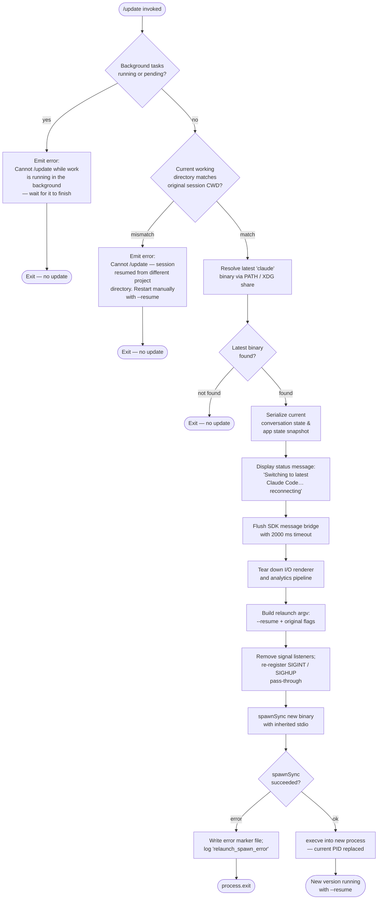

# `/update`

> Analysis basis: CC v2.1.169 bundle.js (AST extraction + Claude interpretation)
> Minimum version: v2.1.169

---

## Overview

`/update` performs an in-process hot-upgrade of Claude Code to the latest installed version without ending the current conversation. It tears down the current session's I/O bridge, spawns the newest binary via `execve`-style replacement, and instructs the new process to resume the session with `--resume`, preserving conversational context across the version boundary.

---

## Registration

| Field | Value |
|---|---|
| type | `local` |
| name | `update` |
| description | `Switch to the latest version (conversation continues)` |
| supportsNonInteractive | `false` |
| isHidden | `true` |
| module_id | `X5K` |
| load_inline | `true` |
| loc_byte | `12816527` |
| loc_byte_end | `12816768` |
| loc_line | `9133` |
| arbor_handler.name | `_Qf` |
| arbor_handler.fqn | `claude-2.1.169::_Qf` |
| arbor_handler.kind | `AsyncFunction` |
| arbor_handler.resolution_path | `module_id` |
| arbor_handler.n_hits | `0` |

Analysis basis: CC v2.1.169 bundle.js:+12816527

> **Note:** `isHidden: true` means `/update` does not appear in the `/help` command listing. It is nonetheless fully functional.

---

## Input Branching

The handler contains five or more distinct branching paths (background-work guard, directory-mismatch guard, pre-flight binary resolution, session-state serialization, and process replacement). A Mermaid flowchart is used.



---

## Behavioral Spec

### 1. Pre-flight: Background-Task Guard

```
async function updateCommandHandler(context):
    bgTasks = Object.values(context.appState.backgroundTasks)
    activeTasks = bgTasks.filter(t => t.status == "running" or t.status == "pending")
    if activeTasks.length > 0:
        emit error message:
            "Cannot /update while work is running in the background — wait for it to finish, then try again."
        fire telemetry: tengu_update_refused
        return
```

Analysis basis: CC v2.1.169 bundle.js:+12814652, +12814690, +12814712, +12814793, +12814429

### 2. Pre-flight: Working-Directory Mismatch Guard

```
    originalCwd = resolveSessionOriginalCwd(context)  // from appState "assistant-" prefixed entry
    if currentProcess.cwd() != originalCwd:
        emit error message:
            "Cannot /update — this session was resumed from a different project directory. Restart manually with --resume to continue on the latest version."
        return
```

Analysis basis: CC v2.1.169 bundle.js:+12815339, +12815037

### 3. Binary Resolution

```
    binaryPath = resolveClaudeBinary()
    // resolveClaudeBinary():
    //   1. iM() — calls Bun.which("claude") to find on PATH
    //   2. LR() — constructs XDG path: homedir + ".local/share/versions/..." + "bin"
    //      using path.join and homedir()
    //   3. Returns first valid path found, or null
    if not binaryPath:
        return  // silently no-op; no binary to switch to
```

Analysis basis: CC v2.1.169 bundle.js:+12814329, +12814382, +6863887, +6863896, +6863967, +858797

### 4. Session-State Serialization

```
    // Capture last conversation turn's tool/session settings
    lastAssistantEntry = findLastAssistantStateEntry(context.appState)
    sessionSnapshot = buildSessionSnapshot(lastAssistantEntry)
    //   snapshot includes: working_directory, allowed_tools, disallowed_tools,
    //   avoid_prompts, permission_mode, bypassPermissions, effort, model,
    //   max_thinking_tokens, flag_settings

    // Persist conversation tail for the new process to resume from
    sessionId = generateNewUUID()  // _p8.randomUUID()
    writeSdkMessagesToStore(sessionId, conversationMessages)
```

Analysis basis: CC v2.1.169 bundle.js:+12815285, +12815364, +12815525, +12815545, +12813402, +10581062–+10581846

### 5. UI Notification and Bridge Flush

```
    displayStatusText("Switching to latest Claude Code… reconnecting")
    // Flush pending SDK/bridge messages with a race against a 2000 ms timeout
    await withTimeout(bridge.flush(), 2000, label="bridge flush")
    bridge.teardown()
```

Analysis basis: CC v2.1.169 bundle.js:+12815549, +12815619, +12815670, +12815629, +12815616, +12815634

### 6. Relaunch Argument Construction

```
    // relaunchArgv():
    //   Start from original process argv (Array.from)
    //   Inject --resume <sessionId>
    //   Forward --add-dir entries from session
    //   Forward --allow-dangerously-skip-permissions if set
    //   Forward --effort <value> if set
    //   Forward --permission-mode <value> if set
    //   Strip any flags not meaningful across versions
    relaunchArgv = buildRelaunchArgv(sessionId, context)
```

Analysis basis: CC v2.1.169 bundle.js:+12815851, +12539456, +12539603, +12539631, +12539800, +12539942, +12539959, +12538107

### 7. Process Replacement (execve)

```
    // performProcessReplacement():
    //   1. stat() the resolved binary to confirm it is accessible
    //   2. Remove all existing process signal listeners
    //   3. Register transparent SIGINT / SIGHUP pass-through handlers
    //   4. rqK.spawnSync(binaryPath, relaunchArgv, { stdio: "inherit" })
    //   5. On error:
    //        ij() — write error marker file via nBH.writeFileSync
    //        log "relaunch_spawn_error"
    //        process.exit(128 + signal_code)
    //   6. On success path (execve-equivalent):
    //        current process is replaced; execution never returns here
    //   7. Timeout guards: 30000 ms flush timeout, analytics flush timeout
    performProcessReplacement(binaryPath, relaunchArgv)
```

Analysis basis: CC v2.1.169 bundle.js:+12815792, +12538055, +12538107, +12538676, +12538706, +12538733, +12538955, +12538958, +12538982, +12539095, +12538174, +12538180, +12538225, +12538236, +12538281, +12538292, +30000

### 8. Post-replacement: New-Process Resume Setup

```
    // In the newly launched process (triggered by --resume):
    //   Vm8() reconstructs session context from stored messages
    //   u_()  restores last working-directory and tool-allow settings
    //   M$()  restores app state
    //   Conversation continues as if no interruption occurred
```

Analysis basis: CC v2.1.169 bundle.js:+12815855, +12815861, +12815851

---

## State & Side Effects

| Item | Detail |
|---|---|
| Telemetry: `tengu_update_refused` | Fired when the update is blocked because background tasks are active (bundle.js:+12814429) |
| Telemetry: `tengu_feature_sad` | Fired on feature-level sad-path inside stream handler (bundle.js:+1014069) |
| Telemetry: `tengu_feature_bad` | Fired on feature-level bad-path inside stream handler (bundle.js:+1013988) |
| Telemetry: `tengu_feature_ok` | Fired on feature-level ok-path (bundle.js:+1013926) |
| Telemetry: `tengu_scroll_summary` | Fired during scroll/render summary phase (bundle.js:+7318000) |
| Telemetry: `tengu_config_parse_error` | Fired if config cannot be parsed during relaunch setup (bundle.js:+3274889) |
| Telemetry: `tengu_disable_bypass_permissions_mode` | Fired if bypass-permissions mode is disabled during arg forwarding (bundle.js:+4227303) |
| Telemetry: `tengu_daemon_control` | Fired during daemon stop sequence (bundle.js:+16543552) |
| Telemetry: `tengu_bg_dispatch_sigkill_escalate` | Fired if a background process requires SIGKILL escalation (bundle.js:+16506490) |
| Bridge flush | `O.writeSdkMessages`, `O.flush`, `O.teardown` called in sequence |
| Session persistence | Conversation messages written to store under a new UUID before replacement |
| App state mutation | `_.setAppState` called to snapshot current state before teardown |
| Error marker file | Written by `ij()` via `nBH.writeFileSync` on spawn failure |
| Signal handlers | All existing `process` listeners removed; SIGINT and SIGHUP re-registered before spawn |
| Process replacement | `rqK.spawnSync` + `M.execve` replace the current PID; if successful, no return |
| `isHidden` | Command does not appear in `/help` listings |
| `supportsNonInteractive` | `false` — command refuses to run in non-interactive (pipe/headless) mode |

---

## Version History

| Version | Change |
|---|---|
| v2.1.169 | Initial analysis |

---

## Common Mistakes

1. **Running `/update` while background tasks are active.** The command will refuse with an explicit message and fire `tengu_update_refused`. Wait for all background tasks to reach a terminal state before invoking `/update`.

2. **Invoking `/update` in a session resumed from a different project directory.** If `process.cwd()` does not match the directory recorded in the session's original app state, the update is blocked. Use `--resume` manually from the correct directory instead.

3. **Expecting `/update` to appear in `/help`.** The command is registered with `isHidden: true` and will not be listed. Type `/update` explicitly.

4. **Expecting `/update` to work in non-interactive mode.** `supportsNonInteractive: false` means the command is unavailable in piped or headless invocations.

5. **Assuming the update is instantaneous.** The command performs a sequential pipeline: bridge flush (up to 2000 ms), analytics drain (up to 30 000 ms timeout), renderer teardown, then spawn. On slow systems or high-traffic sessions the reconnect may take several seconds.

6. **Calling `/update` when no newer binary is installed.** If binary resolution (`Bun.which("claude")` and the XDG share path) finds no valid target, the command silently exits without updating. Ensure the latest version is installed via `npm`/`brew`/the auto-updater before invoking the command.

---

## Appendix — Identifier Mapping

> For bundle debugging only. Identifiers change across versions.

| Identifier | Role |
|---|---|
| `_Qf` | Main async handler for `/update` (Arbor-resolved entry point) |
| `Ap8` | Binary-resolution orchestrator (calls `iM` for PATH lookup and `LR` for XDG path) |
| `iM` | PATH-based binary locator; wraps `Bun.which("claude")` |
| `PSA` | Helper that invokes `Bun.which` |
| `LR` | XDG-share binary path builder; constructs `~/.local/share/versions/.../bin` |
| `uI8` | Version directory resolver; joins path components for `versions` subdirectory |
| `Z$` | Array normalization helper (used by path builders) |
| `Q5H` | Home directory resolver; calls `vd9.homedir()` |
| `mj8` | Wraps `os.homedir()` |
| `X1H` | Constructs `bin` subdirectory path segment |
| `w9` | Process-type checker; distinguishes `bg`, `daemon`, `daemon-worker` modes |
| `nDH` | Background/daemon mode string constants |
| `d` | Generic async dispatcher / deferred executor |
| `Yj` | Binary basename extractor; calls `Oj.basename` |
| `I6` | Async file-existence / stat helper |
| `xZ` | Low-level file stat wrapper |
| `Vy` | Current process argv accessor |
| `b5A` | Process-replacement helper; resolves `sqK.dirname`, calls `x$` and `X4` |
| `G_` | File-system existence check (used in relaunch) |
| `X4` | Secondary existence check helper |
| `lqH` | Session working-directory comparator |
| `THH` | Attachment/hook-state checker; uses `BU8` and `Xaf.has` |
| `BU8` | Attachment state reader |
| `sMA` | Session-state append helper; writes `last-prompt` entry |
| `o4` | Progress-tracking utility |
| `Z9` | Registers entries with `ZGA` |
| `hH` | SDK message-stream handler; dispatches to `wA`, `_6`, `kq`, `av4` |
| `wA` | Error string formatter |
| `_6` | String normalization helper |
| `kq` | Telemetry-mode selector (`essential-traffic`, `no-telemetry`, `default`) |
| `duA` | Telemetry mode resolver |
| `av4` | Message queue manager; uses `Di6.shift` / `Di6.push` |
| `o0` | App-state field extractor for `assistant-` prefixed entries |
| `O` | SDK message bridge object (provides `writeSdkMessages`, `flush`, `teardown`) |
| `S8` | SDK bridge backing store |
| `J5K` | UUID generator; wraps `_p8.randomUUID()` |
| `BL` | Promise-race timeout utility; uses `setTimeout` / `clearTimeout` |
| `WjH` | Status-message string builder |
| `MTH` | Process-replacement orchestrator; coordinates flush, teardown, spawn, execve |
| `zv6` | Interval-clear helper; wraps `clearInterval` via `$g_` |
| `$g_` | `clearInterval` wrapper |
| `pRH` | Terminal renderer teardown; unmounts UI, writes final bytes |
| `H` | Render/unmount controller |
| `N` | Terminal output normalizer |
| `w2_` | String splitter/trimmer for terminal sequences |
| `u6H` | Feature-flag set checker |
| `n3` | String replace helper |
| `M9` | Composed renderer helper |
| `o6` | Render dispatch helper |
| `Hb` | Post-teardown cleanup helper |
| `v58` | Terminal write helper; emits ANSI escape sequences |
| `mkH` | Terminal capability detector (Ghostty, iTerm2 version checks) |
| `ykH` | Alternate screen helper |
| `X0` | tmux / screen multiplexer detection helper |
| `J3` | Renderer finalization helper |
| `bP8` | Spinner / scroll-summary render controller |
| `tW` | Spinner state machine |
| `bo9` | Scroll-summary renderer |
| `Co9` | Frame-rate / timing calculator; uses `Date.now`, `Math.max`, `Math.round` |
| `So9` | Scroll-summary state updater |
| `E1` | Full-screen / local-agent renderer |
| `_E_` | String coercion helper |
| `ta` | Terminal control sequence emitter |
| `HE_` | Flicker-guard checker (tmux-CC / Windows SSH detection) |
| `d_` | Database accessor wrapper |
| `WCL` | Window layout calculator |
| `D6` | Render-node dispatcher |
| `_Z` | Analytics drain helper; calls `o4` |
| `EBH` | ZGA drain wrapper |
| `BRH` | Relaunch-ready resolver; awaits `RP8` then calls `H` |
| `RP8` | Relaunch promise resolver |
| `nqK` | Core process-replacement function; handles `require`, `dlopen`, `execve`, env forwarding |
| `f` | FFI module handle |
| `A` | Process/socket registry map |
| `q` | Active-socket / pending-task set |
| `L` | Socket lifecycle manager |
| `$` | Native module registry |
| `D3K` | Native module cache entry builder |
| `w` | Background-session worker manager |
| `b` | Background process entry object |
| `a8` | Timeout-with-abort helper |
| `bH` | Bad-path telemetry dispatcher |
| `SH` | Ok-path telemetry dispatcher |
| `MU8` | Low-memory threshold checker |
| `JW6` | Config file reader |
| `Q` | Permission-rule set manager |
| `uPA` | Daemon socket claim handler |
| `gPA` | Background session lifecycle manager |
| `D` | Forced-shutdown handler; calls `process.exit` |
| `E8` | Error classifier |
| `K6` | Core event-loop ticker |
| `F` | Disposable resource wrapper |
| `M` | MCP connection manager |
| `mSH` | MCP server spawn and connection orchestrator |
| `cd8` | MCP connection result applier |
| `dXA` | MCP client diff/update orchestrator |
| `z` | Daemon stop controller |
| `rh` | Roster-entry push helper |
| `PU` | Daemon shutdown race (Promise.race + process.exit) |
| `EH` | Error string coercer |
| `ij` | Error-marker file writer; calls `nBH.writeFileSync` |
| `Vm8` | Relaunch argv builder; reconstructs flags for new process |
| `tEH` | Argv token processor |
| `y6` | Config version-file watcher and backup manager |
| `l6` | Config base-path resolver |
| `NG_` | Config directory path helper |
| `y7H` | Config read / migrate / backup logic |
| `F6` | JSON parse wrapper |
| `Vu` | Version-string prefix stripper |
| `ke1` | Config backup directory scanner |
| `yG_` | Backup path joiner |
| `jhL` | Config file-watch registration helper |
| `tB` | File-watch debounce helper |
| `u_` | Session-resume state restorer; reads `working_directory`, `allowed_tools`, etc. |
| `US8` | Allowed-tools state restorer |
| `L1` | Tool-list applier |
| `BS8` | Disallowed-tools state restorer |
| `Jb` | Permission-mode/bypass restorer |
| `M$` | App-state snapshot restorer |

---

Note: index built via Arbor fallback; some signals (telemetry, literals) may be missing — see arbor-fallback.js.