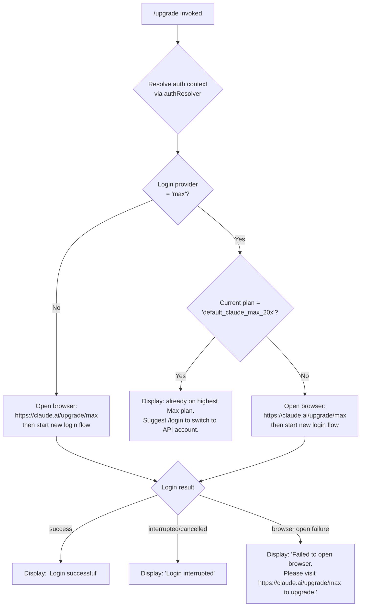

# `/upgrade`

> Analysis basis: CC v2.1.169 bundle.js (AST extraction + Claude interpretation)
> Minimum version: v2.1.169

---

## Overview

The `/upgrade` command guides the user through upgrading their Claude subscription to the **Max** plan, which provides higher rate limits and increased access to Opus models. It inspects the current authentication context to determine whether the user is already on Max (or the highest Max tier), and either short-circuits with an informational message or opens `https://claude.ai/upgrade/max` in the system browser and initiates a new login flow. The command is implemented as an async JSX-rendering function (`ix6`) registered under the `local-jsx` type.

---

## Registration

| Field | Value |
|---|---|
| type | `local-jsx` |
| name | `upgrade` |
| description | `Upgrade to Max for higher rate limits and more Opus` |
| loc_byte | `12860130` |
| loc_byte_end | `12860377` |
| loc_line | `9139` |
| module_id | `J3A` |
| load_inline | `true` |
| arbor_handler.name | `ix6` |
| arbor_handler.fqn | `claude-2.1.169::ix6` |
| arbor_handler.kind | `AsyncFunction` |
| arbor_handler.resolution_path | `module_id` |
| arbor_handler.n_hits | `0` |

Analysis basis: CC v2.1.169 bundle.js:+12860130

---

## Input Branching

Four distinct execution paths exist, requiring a Mermaid flowchart.



Analysis basis: CC v2.1.169 bundle.js:+12859175, +12859261, +12859286, +12859506, +12859659

---

## Behavioral Spec

### 1. Entry Point — Async Handler (`ix6`)

```
async function upgradeCommandHandler(appState, apiKeyChangeCallback):
    authContext = resolveAuthContext(appState)        // calls yA → IY
    loginProvider = authContext.loginProvider         // e.g. "max", "user_oauth" …

    if loginProvider == "max":
        currentPlan = authContext.currentPlan

        if currentPlan == "default_claude_max_20x":
            // User is already on the highest Max tier
            displayMessage(
                "You are already on the highest Max subscription plan. " +
                "For additional usage, run /login to switch to an API usage-billed account."
            )
            return

        // On a lower Max tier — proceed to upgrade
    
    // For all non-top-Max users: open upgrade URL
    upgradeURL = "https://claude.ai/upgrade/max"
    browserOpened = openURLInSystemBrowser(upgradeURL)   // calls aK → browserOpen

    if not browserOpened:
        displayMessage(
            "Failed to open browser. Please visit https://claude.ai/upgrade/max to upgrade."
        )
        return

    displayMessage(
        "Starting new login following /upgrade. Exit with Ctrl-C to use existing account."
    )
    
    // Initiate a fresh OAuth login flow (reuses /login machinery)
    loginResult = await performLogin(appState, {
        provider: "claude_max",
        triggerSource: "upgrade"
    })                                                   // calls CDH → oAuth flow

    if loginResult.success:
        // Invoke API key change callback registered on appState
        apiKeyChangeCallback()
        displayMessage("Login successful")
    else:
        displayMessage("Login interrupted")
```

Analysis basis: CC v2.1.169 bundle.js:+12859175, +12859347, +12859491, +12859656, +12859692, +12859731, +12859827, +12859850, +12859869, +12859902, +12859923

---

### 2. Auth Context Resolution (`authResolver` / `yA` → `IY`)

```
function resolveAuthContext(appState):
    /*
     * Determines the active authentication profile by inspecting:
     *   - Environment variables: ANTHROPIC_API_KEY, ANTHROPIC_AUTH_TOKEN,
     *     CLAUDE_CODE_OAUTH_TOKEN, and WIF env vars
     *       (ANTHROPIC_FEDERATION_RULE_ID + ANTHROPIC_ORGANIZATION_ID)
     *   - apiKeyHelper configuration
     *   - OAuth token from file descriptor (CLAUDE_CODE_OAUTH_TOKEN_FILE_DESCRIPTOR)
     *   - API key from file descriptor (CLAUDE_CODE_API_KEY_FILE_DESCRIPTOR)
     * Checks provider type against known values:
     *   "bedrock", "foundry", "anthropicAws", "mantle", "vertex",
     *   "firstParty", "user_oauth", "max", "claude-desktop-3p"
     * Returns an object with at minimum:
     *   { loginProvider, currentPlan, … }
     */
    profile = buildAuthProfile(appState)     // IY → _j, AO, AX6, UnH, oL
    return profile
```

Analysis basis: CC v2.1.169 bundle.js:+3028211, +3007854, +3007952, +3007973, +3008059, +3009873, +3010342, +2105194, +3006845, +3006918

---

### 3. Plan Tier Check

```
function isHighestMaxPlan(currentPlan):
    /*
     * Returns true only when currentPlan equals the literal
     * "default_claude_max_20x", which identifies the 20× usage
     * multiplier Max tier — currently the ceiling plan.
     */
    return currentPlan == "default_claude_max_20x"
```

The string `"max"` identifies the login provider class, while `"default_claude_max_20x"` identifies the specific plan tier within that provider class.

Analysis basis: CC v2.1.169 bundle.js:+12859261, +12859286

---

### 4. System Browser Open (`browserOpen` / `aK`)

```
function openURLInSystemBrowser(url):
    /*
     * Validates that url starts with "http:" or "https:" to guard
     * against arbitrary scheme execution.
     * Dispatches per platform:
     *   - "darwin"  → execs "open <url>"
     *   - "win32"   → execs "rundll32 url,OpenURL <url>"
     *   - other     → execs "xdg-open <url>"
     * Returns true on success, false/throws on failure.
     */
    validateScheme(url)          // L$7 — throws Error on bad scheme
    platform = detectPlatform()  // HD
    execOpen(platform, url)      // b8 → U_ → gVH
```

Analysis basis: CC v2.1.169 bundle.js:+6211089, +6211102, +6211161, +6211177, +6211261, +6211273, +6211335, +6211342, +6210852, +6210874

---

### 5. OAuth Login Flow (`oAuthLogin` / `CDH`)

```
async function performOAuthLogin(appState):
    /*
     * Fetches the user's OAuth profile from the Anthropic identity service.
     * Request headers include Content-Type: application/json.
     * Timeout: 10 000 ms (bundle.js:+2112144).
     * Emits telemetry event "oauth_profile_fetch" on attempt.
     * On HTTP 401/403/429 or profile parse failure, emits
     * "oauth_profile_token_failed" and propagates error.
     * On success, stores credentials via historyStore (hH) and
     * invokes structured logging (N → StK → Z9).
     */
    response = await fetchOAuthProfile(headers, timeout=10000)
    if response.ok:
        storeCredentials(response.data)
        emitTelemetry("oauth_profile_fetch")
        return { success: true }
    else:
        emitTelemetry("oauth_profile_token_failed")
        return { success: false }
```

Analysis basis: CC v2.1.169 bundle.js:+2112000, +2112054, +2112101, +2112116, +2112144, +2112157, +2112202, +2112227, +2112257, +2112263, +2112327, +2112342

---

### 6. Credential & History Store (`credentialStore` / `hH`)

```
function storeCredentials(tokenData):
    /*
     * Writes OAuth token into an in-memory rotating queue (av4):
     *   - Di6.shift() removes oldest entry when queue is full
     *   - Di6.push() appends the new token
     * Also appends the entry to cgH (persistent credential list).
     * Errors during store are forwarded to bo.logError().
     * Underlying serialisation uses duA → _6 (stringify helper).
     */
    rotateTokenQueue(tokenData)
    appendToPersistentList(tokenData)
```

Analysis basis: CC v2.1.169 bundle.js:+1019318, +1019331, +1019577, +1019660, +1019678, +1019718

---

### 7. Structured Logging / Transcript Flush (`transcriptLogger` / `N` → `StK`)

```
function flushTranscriptLog(entry):
    /*
     * Formats the log entry (uppercases level, redacts sensitive fields
     * with "[REDACTED]", joins with path separator using P6H.join).
     * Writes via lEA → H.write to the transcript file.
     * File rotation logic (Vo8): renames existing file with ".txt"
     * suffix if it exceeds the rotation threshold (4 bytes checked at
     * bundle.js:+207854); then unlinks old file.
     * Appends new content via htK → Mh.appendFile; creates directory
     * with Mh.mkdir if needed.
     * Debounce/batch write with setTimeout / setImmediate / clearTimeout
     * via TBH; queue sizes bounded at 1 000 / 100 (bundle.js:+61630,
     * +61651).
     * Registers process exit hook via ZGA.register (Z9).
     */
    formatAndRedact(entry)
    scheduleWrite(entry)
```

Analysis basis: CC v2.1.169 bundle.js:+208403, +208428, +208436, +208466, +208481, +208556, +208573, +208605, +208611, +208644, +208661, +208670, +208766, +62328

---

### 8. JSX Render Layer

The handler renders its UI using `w3A.createElement` (React-compatible JSX factory) at bundle.js:+12859692. Status messages ("Login successful", "Login interrupted", "Failed to open browser…", "You are already on the highest Max subscription plan…") are rendered as JSX nodes rather than raw stdout writes.

Analysis basis: CC v2.1.169 bundle.js:+12859692

---

## State & Side Effects

| Item | Detail |
|---|---|
| Telemetry | `tengu_feature_ok` (bundle.js:+1013926) — emitted on successful feature gate check; `tengu_feature_sad` (bundle.js:+1014069) — emitted on feature gate failure |
| OAuth telemetry (inline) | `oauth_profile_fetch` (bundle.js:+2112160) on profile fetch attempt; `oauth_profile_token_failed` (bundle.js:+2112227) on token failure |
| Bootstrap telemetry (inline) | `api_bootstrap_fetch` (bundle.js:+16098278) on API bootstrap; `parse_failed` (bundle.js:+16098300) on parse error |
| Hook registration | Process-exit hook registered via `ZGA.register` (bundle.js:+62328) to flush pending transcript writes |
| appState changes | `_.onChangeAPIKey` callback invoked after successful login (bundle.js:+12859827); credential queue updated in-memory and appended to persistent list |
| Browser open | Spawns platform-native open command (`open` / `rundll32` / `xdg-open`) targeting `https://claude.ai/upgrade/max` |
| File I/O | Transcript log appended via `Mh.appendFile`; log rotation via `Mh.rename` + `Mh.unlink`; directory creation via `Mh.mkdir` |
| Timer / scheduling | `setTimeout` (bundle.js:+12859491) used in handler; debounce timers in transcript logger via `setTimeout`, `setImmediate`, `clearTimeout` |
| Sound | <!-- TODO: not found in depth-2 traversal; needs --depth 4 --> |

---

## Version History

| Version | Change |
|---|---|
| v2.1.169 | Initial analysis |

---

## Common Mistakes

1. **Invoking `/upgrade` on an API-key account**: The command is only meaningful for OAuth/Max-authenticated sessions. Users authenticated via `ANTHROPIC_API_KEY` directly will be redirected through the browser OAuth flow regardless, potentially creating a duplicate or conflicting credential.
2. **Expecting a no-op on the highest Max tier**: Users already on `default_claude_max_20x` will see an informational message and the command exits immediately — no browser is opened. If they expect a browser prompt, they should use `/login` instead.
3. **Browser unavailable in headless environments**: In CI or SSH sessions without a display or browser, `openURLInSystemBrowser` will fail and the fallback message instructs the user to visit `https://claude.ai/upgrade/max` manually. The login flow will not complete automatically.
4. **Interrupting the login with Ctrl-C**: If the user presses Ctrl-C after the browser has opened, the login is marked as interrupted and no credential change is recorded. The existing account remains active.
5. **Confusing `/upgrade` with `/login`**: `/upgrade` hard-codes the upgrade URL (`https://claude.ai/upgrade/max`) and targets the `claude_max` provider; `/login` is the general-purpose re-authentication command and does not presuppose a plan change.

---

## Appendix — Identifier Mapping

> For bundle debugging only. Identifiers change across versions.

| Identifier | Role |
|---|---|
| `ix6` | Main async handler for `/upgrade` command (arbor_handler) |
| `yA` | Auth context entry-point wrapper (calls `IY`) |
| `IY` | Auth profile builder / dispatcher |
| `i7` | Argument / flag parser utility |
| `_6` | String serialisation / stringify helper |
| `xF6` | Flag parsing auxiliary (bare-flag handling) |
| `_j` | Auth profile sub-builder (provider classification) |
| `C68` | OAuth token presence check helper |
| `UnH` | Provider type normaliser |
| `EB` | OAuth token file-descriptor reader |
| `Cv` | Flag-settings extractor |
| `kC` | Array-membership / provider inclusion check |
| `oL` | Provider exclusion / blocklist check |
| `YA` | Cloud-provider type guard |
| `LP` | Login-profile accessor |
| `AO` | Auth object constructor (assembles full auth context) |
| `HX6` | API-key-helper resolver |
| `wBH` | VS Code integration / client-type check |
| `$D6` | API key file-descriptor reader |
| `y6` | Telemetry event emitter |
| `hC` | History slice / recent-item accessor |
| `AX6` | Auth profile cache lookup |
| `CDH` | OAuth login flow orchestrator |
| `n1` | OAuth endpoint URL builder |
| `JSA` | Environment / build-type resolver |
| `hY4` | OAuth client-ID provider |
| `SH` | HTTP success-response handler |
| `d` | Generic async task runner |
| `K6` | Promise executor helper |
| `c76` | Core async scheduler |
| `o6` | HTTP error-response handler |
| `Kz` | OAuth state-parameter generator |
| `N` | Structured log formatter / transcript writer |
| `ItK` | Log-level filter |
| `vGA` | Log transport selector |
| `H` | Bootstrap / API preflight fetcher |
| `P$` | User-agent string builder |
| `w2_` | Header / line parser |
| `u6H` | No-telemetry flag checker |
| `n3` | Text sanitiser (replace helper) |
| `M9` | Bootstrap response parser |
| `CH` | JSON serialiser wrapper |
| `R4` | Path / filename formatter |
| `qZA` | Path segment mapper |
| `q` | String slice / index utility |
| `A` | Lowercase filename resolver |
| `rBH` | File write dispatcher |
| `lEA` | Low-level file writer |
| `StK` | Transcript logger (batched append with rotation) |
| `TBH` | Debounce / batch-write scheduler |
| `_4H` | Log path builder |
| `l6` | Logger instance accessor |
| `n56` | File-system error classifier |
| `MZA` | Log file path resolver |
| `Vo8` | Log file rotation handler |
| `htK` | Append-and-rotate file writer |
| `Z9` | Process-exit hook registrar |
| `hH` | Credential / history store |
| `wA` | Error normaliser |
| `kq` | Token queue flusher |
| `duA` | Token serialiser |
| `av4` | Rotating in-memory token queue manager |
| `aK` | System browser open utility |
| `L$7` | URL scheme validator |
| `HD` | Platform / OS detector |
| `b8` | Browser-open command builder |
| `U_` | Child-process executor for browser open |
| `gVH` | Cross-platform exec helper (open / rundll32 / xdg-open) |
| `D` | Forced-shutdown / process-exit handler |
| `Ik4` | Exit-code stringifier |
| `J3` | Abort-controller accessor |
| `E8` | Generic error reporter |
| `C6` | Async-local-storage context accessor |
| `Wi6` | Store-get helper (AsyncLocalStorage) |
| `G_` | Context initialiser / fallback |

---

Note: index built via Arbor fallback; some signals (telemetry, literals) may be missing — see arbor-fallback.js.