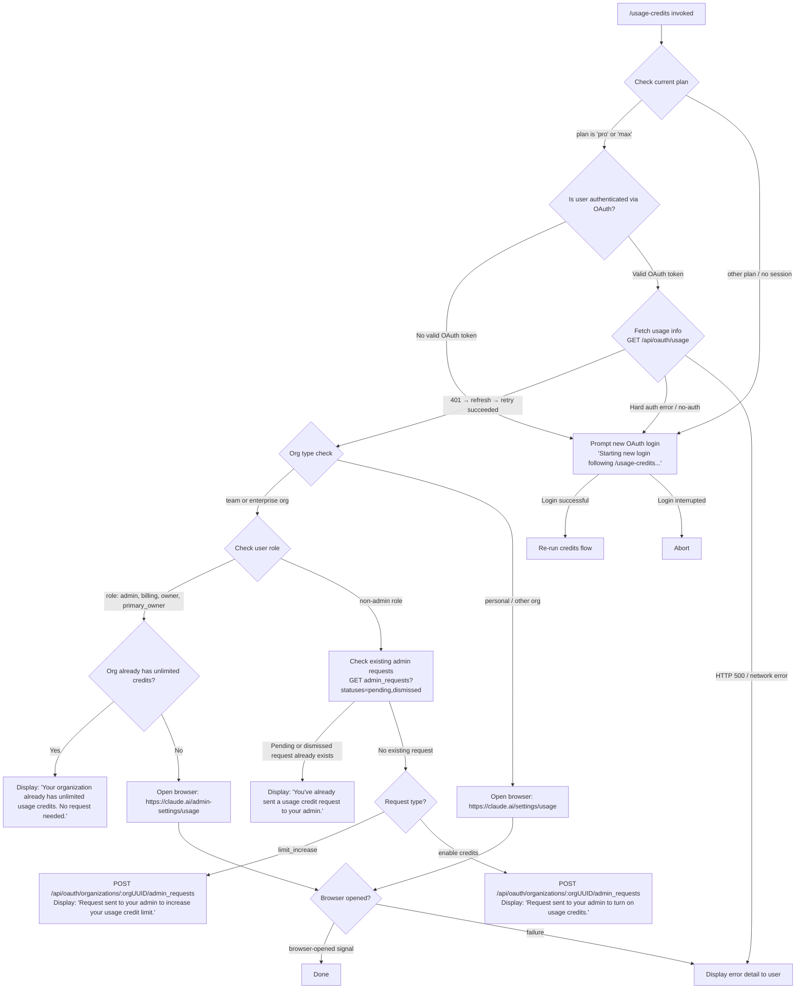

# `/usage-credits`

> Analysis basis: CC v2.1.169 bundle.js (AST extraction + Claude interpretation)
> Minimum version: v2.1.169

---

## Overview

`/usage-credits` is a local-JSX command that helps users configure usage credits when they have reached a usage limit on their Anthropic account. It inspects the current authentication state and subscription plan, then guides the user through one of several flows: requesting a credit increase via an organization admin, opening the relevant billing settings page in a browser, or initiating a fresh OAuth login when no valid session exists. The command targets only `pro` and `max` plan users authenticated via OAuth.

---

## Registration

| Field | Value |
|---|---|
| type | `local-jsx` |
| name | `usage-credits` |
| description | `Configure usage credits to keep working when you hit a limit` |
| loc_byte | `9563920` |
| loc_byte_end | `9564130` |
| loc_line | `4123` |
| module_id | `Ke_` |
| load_inline | `true` |
| arbor_handler.name | `Nh6` |
| arbor_handler.fqn | `claude-2.1.169::Nh6` |
| arbor_handler.kind | `AsyncFunction` |
| arbor_handler.resolution_path | `module_id` |
| arbor_handler.n_hits | `0` |

Analysis basis: CC v2.1.169 bundle.js:+9563920

---

## Input Branching

The command has more than three distinct execution paths depending on subscription plan, org membership, existing admin requests, and auth state. A Mermaid flowchart is used.



Analysis basis: CC v2.1.169 bundle.js:+9562142, +9562153, +9562164, +9516349, +9516361, +9515561, +9516597, +9516692, +9516756, +9516991, +9517230, +9517296, +9517597, +9517638, +9517705, +9562621, +9562746, +9562765

---

## Behavioral Spec

### Top-level Handler — `usageCreditsHandler` (`Nh6`)

```
async function usageCreditsHandler(context):
    plan = getPlanFromSession()          // checks "pro" | "max" literals
    if plan not in ["pro", "max"]:
        startOAuthLogin(
            message = "Starting new login following /usage-credits. Exit with Ctrl-C to use existing account."
        )
        outcome = await awaitLoginCompletion()
        if outcome == "Login successful":
            onChangeAPIKey()             // re-trigger credentials pipeline
        else:
            display("Login interrupted")
            return

    usageData = await fetchOAuthUsage()  // calls usageFetcher (X0H)
    await renderUsageCreditsUI(usageData, context)
```

Analysis basis: CC v2.1.169 bundle.js:+9562142, +9562172, +9562186, +9562226, +9562234, +9562304, +9562339, +9562621, +9562723, +9562746, +9562765

---

### OAuth Usage Fetch — `usageFetcher` (`X0H`)

```
async function usageFetcher(authState):
    credentialBundle = buildRequestCredentials(authState)   // Bq
    if credentialBundle is null:
        throw Error("no-auth")

    response = await apiGet("/api/oauth/usage", credentialBundle)  // B9.get
    // On 401: attempt token refresh then retry once
    if response.status == 401:
        refreshed = await tokenRefreshAndRetry()
        if refreshed:
            append suffix " (401→refresh→retry succeeded)" to log
        else:
            throw axiosError
    if response.status >= 500:
        throw Error with response.detail
    return response.data
```

Analysis basis: CC v2.1.169 bundle.js:+9515394, +9515429, +9515436, +9515466, +9515483, +9515554, +9515671, +9515703, +9515804, +9516007, +9516213

---

### Admin Eligibility Check — `adminEligibilityFetch` (`dGq`)

```
async function adminEligibilityFetch(orgUUID, credentialBundle):
    // GET api_admin_request_eligibility
    response = await apiGet("api_admin_request_eligibility", credentialBundle, {
        teleportOrg: orgUUID
    })
    if response.status == 500:
        throw Error with response.detail
    return response.data
```

Analysis basis: CC v2.1.169 bundle.js:+9515061, +9515064, +9515118, +9515212, +9515244

---

### List Admin Requests — `adminRequestList` (`QGq`)

```
async function adminRequestList(orgUUID, credentialBundle):
    // GET api_admin_request_list?statuses=pending,dismissed
    response = await apiGet("api_admin_request_list", credentialBundle, {
        statuses: ["pending", "dismissed"]
    })
    if request already exists (pending or dismissed):
        return { alreadyRequested: true }
    return response.data
```

Analysis basis: CC v2.1.169 bundle.js:+9514710, +9514807, +9514842, +9514946, +9516922, +9516932

---

### Create Admin Request — `adminRequestCreate` (`gGq`)

```
async function adminRequestCreate(orgUUID, requestType, credentialBundle):
    // POST /api/oauth/organizations/:orgUUID/admin_requests
    response = await apiPost(
        "/api/oauth/organizations/:orgUUID/admin_requests",
        { type: requestType },
        credentialBundle
    )
    if response fails:
        throw Error with response.detail
    return response.data
```

Analysis basis: CC v2.1.169 bundle.js:+9514445, +9514448, +9514497, +9514505, +9514596

---

### Axios Error Classification — `axiosErrorClassifier` (`lGq`)

```
function axiosErrorClassifier(error):
    if MA.isAxiosError(error):
        if error.status == 500:
            return { kind: "server_error", detail: error.response.detail }
        if error.status == 429:
            return { kind: "rate_limited" }
        if error.status in [401, 403]:
            if error.message includes "OAuth token has been revoked":
                return { kind: "token_revoked" }
            return { kind: "auth_error" }
    return { kind: "unknown" }
```

Analysis basis: CC v2.1.169 bundle.js:+9515924, +3046282, +3046310, +3046376, +178557, +178669

---

### Browser Open — `openBrowserURL` (`aK`)

```
async function openBrowserURL(url):
    validate url scheme in ["http:", "https:"]
    if scheme invalid:
        throw Error("L$7")

    platform = process.platform
    if platform == "darwin":
        spawn("open", [url])
    else if platform == "win32":
        spawn("rundll32", ["url,OpenURL", url])
    else:
        spawn("xdg-open", [url])

    emit signal "browser-opened"
```

Analysis basis: CC v2.1.169 bundle.js:+6211089, +6211102, +6211161, +6211177, +6211210, +6211261, +6211273, +6211335, +6211342, +9517597, +9517638, +9517705, +6210852, +6210874

---

### Auth-State Resolution — `resolveAuthState` (`AO`)

```
function resolveAuthState(config):
    // Examines environment variables and config for credential source
    if env ANTHROPIC_API_KEY is set:
        return { kind: "api_key" }
    if config.apiKeyHelper and apiKeyHelper != "none":
        return { kind: "api_key_helper" }
    if env CLAUDE_CODE_OAUTH_TOKEN_FILE_DESCRIPTOR is set:
        return { kind: "oauth_fd" }
    if env CLAUDE_CODE_API_KEY_FILE_DESCRIPTOR is set:
        return { kind: "api_key_fd" }
    // Check WIF federation vars
    if ANTHROPIC_FEDERATION_RULE_ID and ANTHROPIC_ORGANIZATION_ID are set:
        return { kind: "wif" }
    // None found
    throw Error(
        "ANTHROPIC_API_KEY, ANTHROPIC_AUTH_TOKEN, CLAUDE_CODE_OAUTH_TOKEN, " +
        "or WIF env vars (ANTHROPIC_FEDERATION_RULE_ID + ANTHROPIC_ORGANIZATION_ID) required"
    )
```

Analysis basis: CC v2.1.169 bundle.js:+3009786, +3009873, +3009897, +3009954, +3009967, +3010006, +3010020, +3010065, +3010118, +3010132, +3010319, +3010325, +3010336, +3010342

---

### Org-Type Gate — `orgTypeGate` (`yA` / `FL`)

```
function isEnterpriseOrTeamOrg(orgData):
    return orgData.type in ["team", "enterprise"]

function isAdminRole(role):
    return role in ["admin", "billing", "owner", "primary_owner"]

function getSubscriptionKind(orgData):
    // checks subscription flags
    return one of:
        "stripe_subscription"
        "stripe_subscription_contracted"
        "apple_subscription"
        "google_play_subscription"
```

Analysis basis: CC v2.1.169 bundle.js:+9516349, +9516361, +3028737, +3028211, +3028762, +3028789, +3028827, +3028853, +2110634, +2110746, +2110754, +2110764, +2110772

---

### Telemetry Latch — `telemetryLatch` (`D6`)

```
async function telemetryLatch(context):
    // Emits "tengu_ember_latch" upon command entry
    // Checks whether experiment flags have already been registered (qJH.has)
    // Fetches experiment config via VL8 if not yet seeded
    // Registers GrowthbookExperimentEvent in production environment
    // Uses randomUUID for experiment tracking, randomBytes(32) for session tokens
    emit event "tengu_ember_latch"
```

Analysis basis: CC v2.1.169 bundle.js:+9562189, +3250805, +3250842, +3250877, +3250894, +3250905, +3250917, +3250931, +3250948, +3250968, +3244122, +3243976, +3244573

---

### Error Display — `errorDisplayHelper` (`hH`)

```
function errorDisplayHelper(error, context):
    message = wA(error)     // stringify error
    _6(message)             // render to terminal
    kq(context)             // reset/cleanup
    av4(context)            // rotate error queue (max 20 items, H.slice)
    cgH.push(error)
    bo.logError(error)
```

Analysis basis: CC v2.1.169 bundle.js:+9517464, +1019318, +1019331, +1019577, +1019660, +1019678, +1019718, +2129372, +2129381

---

## State & Side Effects

| Item | Detail |
|---|---|
| Telemetry | `tengu_ember_latch` (bundle.js:+9562189) — fired on command entry; `tengu_feature_ok` (bundle.js:+1013926) — fired on feature flag success path; `tengu_feature_bad` (bundle.js:+1013988) — fired on feature flag failure path |
| OAuth token refresh | Automatic single-retry on HTTP 401 from `/api/oauth/usage`; success appended to log as `" (401→refresh→retry succeeded)"` |
| Browser launch | `openBrowserURL` spawns a platform-native subprocess (`open` / `rundll32` / `xdg-open`) and emits `"browser-opened"` signal (bundle.js:+9517705) |
| `onChangeAPIKey` callback | Called after successful login (`_.onChangeAPIKey`, bundle.js:+9562723) to re-initialize credentials pipeline |
| Experiment/feature flags | `D6` seeds Growthbook experiment data via `VL8`/`$G_`; registers `GrowthbookExperimentEvent`; uses `Ba.emit` to broadcast result (bundle.js:+3244527) |
| Error queue rotation | Error history capped and rotated via `av4` (Di6.shift / Di6.push, bundle.js:+1018998, +1019010) |
| API calls | GET `/api/oauth/usage`; GET `api_admin_request_eligibility`; GET `api_admin_request_list?statuses=pending,dismissed`; POST `/api/oauth/organizations/:orgUUID/admin_requests` |
| Message strings displayed | `"Your organization already has unlimited usage credits. No request needed."` · `"Contact your admin to manage usage credit settings."` · `"You've already sent a usage credit request to your admin."` · `"Request sent to your admin to increase your usage credit limit."` · `"Request sent to your admin to turn on usage credits."` |

---

## Version History

| Version | Change |
|---|---|
| v2.1.169 | Initial analysis |

---

## Common Mistakes

1. **Running on non-OAuth plans**: The command only performs the credits flow for `pro` or `max` plan sessions. On any other plan type, it will immediately begin a new OAuth login flow, which may be surprising to users who expect an informational message instead.

2. **Assuming admin actions are always available**: Non-admin members of team/enterprise orgs will see an admin-request flow rather than direct settings access. Users with roles `admin`, `billing`, `owner`, or `primary_owner` get direct browser links instead.

3. **Multiple credit requests**: Submitting `/usage-credits` again after a pending or dismissed request already exists will not create a duplicate — the command detects existing requests (`statuses=pending,dismissed`) and displays `"You've already sent a usage credit request to your admin."` rather than posting again.

4. **Browser launch failures on headless/Linux environments**: The `xdg-open` fallback is used on non-macOS, non-Windows platforms. In headless CI or server environments, the subprocess spawn may fail silently; the user should handle the URL manually.

5. **Token revocation vs. expiry**: A 401 triggers one automatic token refresh and retry. If the OAuth token has been explicitly revoked (detected via the `"OAuth token has been revoked"` error message), no retry is attempted and the user will be directed through a new login flow.

---

## Appendix — Identifier Mapping

> For bundle debugging only. Identifiers change across versions.

| Identifier | Role |
|---|---|
| `Nh6` | Top-level `usageCreditsHandler` — async entry point for `/usage-credits` |
| `Oq` | Auth/session context builder |
| `k3_` | Session key accessor (called from auth context builder) |
| `I3_` | Session identity resolver |
| `IY` | Credential resolution orchestrator |
| `i7` | Flag/settings reader |
| `_6` | Terminal output renderer |
| `xF6` | Bare-mode flag reader (`--bare`) |
| `_j` | Auth profile composer (`profile-implicit`, `user_oauth`) |
| `C68` | OAuth token builder |
| `UnH` | String normalizer / sanitizer |
| `EB` | OAuth token file-descriptor handler (`CLAUDE_CODE_OAUTH_TOKEN_FILE_DESCRIPTOR`) |
| `Cv` | Flag-settings merger (`flagSettings`) |
| `kC` | Array-based inclusion checker (`Array.isArray`, `H.includes`) |
| `oL` | Cloud provider gate (bedrock / foundry / anthropicAws / mantle / vertex / firstParty) |
| `YA` | Provider-string normalizer |
| `LP` | Auth credential loader |
| `AO` | Auth-state resolver (env var inspection) |
| `HX6` | WIF federation credential handler |
| `wBH` | VSCode integration guard (`claude-vscode`) |
| `$D6` | API-key file-descriptor handler (`CLAUDE_CODE_API_KEY_FILE_DESCRIPTOR`) |
| `y6` | Telemetry/event emitter |
| `hC` | Error history slicer (max 20 items) |
| `AX6` | Alternate string sanitizer (delegates to `UnH`) |
| `iZ` | Pre-flight session validator |
| `D6` | Growthbook / experiment-flag telemetry latch |
| `HP6` | Experiment registry initializer |
| `_P6` | Experiment config fetcher |
| `tu` | Experiment scheduler |
| `su` | Experiment context builder |
| `lC` | Feature-flag lookup core |
| `VL8` | Experiment seed / cache gate (`zG_`, `qJH`) |
| `$G_` | Growthbook experiment runner (emits `GrowthbookExperimentEvent`) |
| `aIH` | Experiment assignment helper |
| `iB` | Session token generator (`randomBytes(32)`, hex) |
| `CH` | JSON serializer wrapper |
| `UyL` | Experiment result formatter |
| `JG_` | Experiment config pipeline |
| `vg1` | Experiment name resolver |
| `d_` | Database/store accessor |
| `we1` | Experiment weight evaluator |
| `u6H` | Feature-flag set membership checker (`vO4.has`) |
| `rwH` | Subscription-type detector (stripe / apple / google-play) |
| `FL` | Subscription-kind fetcher |
| `yA` | Org-type and role gate (team / enterprise, admin roles) |
| `kq` | Context reset/cleanup after error |
| `duA` | String coercer helper |
| `BI8` | Usage-credits UI orchestrator (top-level JSX component) |
| `Ch` | Org admin check (role validation + org data fetch) |
| `X0H` | OAuth usage fetcher (calls `/api/oauth/usage`) |
| `Bq` | Request credential bundle builder |
| `_` | Base credential object |
| `SH` | Credential success path (`tengu_feature_ok`) |
| `bH` | Credential failure path (`tengu_feature_bad`) |
| `HE` | Role-array inclusion checker |
| `H` | HTTP bootstrap fetcher (`[Bootstrap] Fetching`, `Content-Type`, `User-Agent`) |
| `jE` | Axios error handler (401/403/token-revoked) |
| `IB` | Request deduplication cache (`R2_`) |
| `N` | HTTP request dispatcher (headers, timeout 5000ms, `[REDACTED]` key masking) |
| `ItK` | Request interceptor chain |
| `R4` | URL path formatter (`[REDACTED]`, `lastIndexOf`, `slice`) |
| `rBH` | Request logging helper |
| `StK` | File-based request handler (Buffer.byteLength, 1000-byte chunks, 100-item limit) |
| `dGq` | Admin eligibility fetcher (`api_admin_request_eligibility`) |
| `QGq` | Admin request list fetcher (`api_admin_request_list?statuses=pending,dismissed`) |
| `A` | HTTP form/multipart appender |
| `f` | HTTP connection closer |
| `gGq` | Admin request creator (`api_admin_request_create`, POST) |
| `lGq` | Axios error classifier (500, 429, 401/403, token-revoked) |
| `Kz` | Unlimited-credits short-circuit check |
| `EH` | String coercer for error messages |
| `hH` | Error display helper (renders error, rotates queue, logs) |
| `wA` | Error-to-string converter |
| `av4` | Error queue rotator (`Di6.shift` / `Di6.push`) |
| `aK` | Platform browser launcher (darwin/win32/linux) |
| `L$7` | URL scheme validator (http/https guard) |
| `HD` | Browser launch argument builder |
| `b8` | Process spawn wrapper (timeout 10s, limit 1 000 000 bytes) |
| `U_` | Spawn orchestrator (calls `hH` on failure) |
| `C6` | Process output collector (`Wi6`, `G_`) |