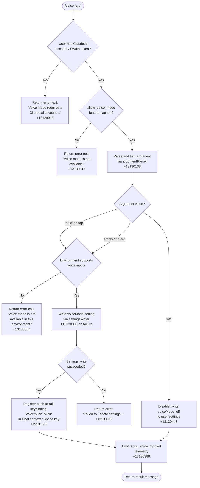

# `/voice`

> Analysis basis: CC v2.1.169 bundle.js (AST extraction + Claude interpretation)
> Minimum version: v2.1.169

---

## Overview

The `/voice` command toggles voice mode in Claude Code's interactive terminal UI. It accepts an optional sub-command argument (`hold`, `tap`, or `off`) and enforces two gate conditions before making any change: the user must be authenticated with a Claude.ai account, and the runtime environment must support the `allow_voice_mode` feature flag. When both gates pass, the command writes the chosen mode to the user settings file and optionally registers a push-to-talk keybinding.

---

## Registration

| Field | Value |
|---|---|
| type | `local` |
| name | `voice` |
| description | Toggle voice mode |
| argumentHint | `[hold\|tap\|off]` |
| supportsNonInteractive | `false` |
| isHidden | `null` |
| module_id | `WzK` |
| load_inline | `true` |
| loc_byte | `13132392` |
| loc_byte_end | `13132634` |
| loc_line | `9674` |
| arbor_handler.name | `$if` |
| arbor_handler.fqn | `claude-2.1.169::$if` |
| arbor_handler.kind | `AsyncFunction` |
| arbor_handler.resolution_path | `module_id` |
| arbor_handler.n_hits | `1` |

Analysis basis: CC v2.1.169 bundle.js:+13132392

---

## Input Branching

The handler has more than three distinct code paths depending on authentication state, feature-flag availability, argument value, and environment capabilities. A flowchart is mandatory.



---

## Behavioral Spec

### Handler Entry Point — `$if` (AsyncFunction)

The Arbor-resolved handler is `$if` (`claude-2.1.169::$if`, resolution path: `module_id`).

```
async function voiceCommandHandler(userInput, appContext):

    # Step 1 — Authentication gate
    authState = resolveAuthState(appContext)          # calls IY → AO path
    if authState does not include a Claude.ai account or OAuth token:
        return plainTextMessage(
            "Voice mode requires a Claude.ai account. "
            "Please run /login to sign in."
        )

    # Step 2 — Feature-flag gate
    flags = loadSettings(appContext)                  # calls d_ → DB → G9_ path
    if flags["allow_voice_mode"] is not set/true:     # literal +13119986
        return plainTextMessage("Voice mode is not available.")

    # Step 3 — Argument parsing
    rawArg  = userInput.trim()                        # literal "text" +13129905
    subCmd  = parseSubCommand(rawArg)                 # via argumentParser Mif
    # valid tokens: "hold" +13129794, "tap" +13129806, "off" +13129817
    # anything else → treated as "invalid" +13129838, falls through to env check

    # Step 4 — Disable branch
    if subCmd == "off":
        writeVoiceModeSetting(appContext, "off")      # via settingsWriter t_
        emitTelemetry("tengu_voice_toggled", {mode:"off"})
        return plainTextMessage("Voice mode disabled.")  # literal +13130443

    # Step 5 — Environment check (hold / tap / empty)
    envSupported = checkVoiceEnvironment(appContext)  # calls Vu6 / L / K path
    if not envSupported:
        return plainTextMessage(
            "Voice mode is not available in this environment."  # +13130687
        )

    # Step 6 — Write setting
    writeResult = writeVoiceModeSetting(appContext, subCmd or defaultMode)
    if writeResult.error:
        return plainTextMessage(
            "Failed to update settings. "
            "Check your settings file for syntax errors."  # +13130305
        )

    # Step 7 — Keybinding registration
    registerKeybinding(
        action  = "voice:pushToTalk",   # literal +13131656
        context = "Chat",               # literal +13131675
        key     = "Space"               # literal +13131682
    )                                   # via SP → HM8 → KyH path

    # Step 8 — Telemetry
    emitTelemetry("tengu_voice_toggled", {mode: subCmd})  # +13130388

    return successResult()
```

Analysis basis: CC v2.1.169 bundle.js:+13129877

---

### Authentication Resolution — `resolveAuthState`

Internally maps to the `IY` → `AO` call chain.

```
function resolveAuthState(appContext):
    profile = getAuthProfile(appContext)           # IY → _j, checks "profile-implicit" +3006845
    if profile type is "firstParty":              # literal +2105482
        check OAuth token presence                # oL → YA path
    if no valid token found:
        check env vars:
            ANTHROPIC_API_KEY                     # +3009873
            ANTHROPIC_AUTH_TOKEN
            CLAUDE_CODE_OAUTH_TOKEN
            WIF env vars                          # +3010342
    return resolved auth descriptor
```

Analysis basis: CC v2.1.169 bundle.js:+13129888

---

### Feature-Flag Load — `loadSettingsFromDisk`

Maps to the `d_` → `DB` → `G9_` call chain.

```
function loadSettingsFromDisk(appContext):
    mark("loadSettingsFromDisk_start")            # literal +1284673

    # Load layered settings in order:
    flagSettings     = readFlagSettings()         # $z6 path, key "flagSettings"    +1264936
    policySettings   = readPolicySettings()       # key "policySettings"            +1264958
    userSettings     = readUserSettings()         # EYH → "userSettings"            +1268515
    projectSettings  = readProjectSettings()      # "projectSettings"               +1268566
    localSettings    = readLocalSettings()        # "localSettings"                 +1268588
    sdkInlineSettings = readSdkInlineSettings()   # "SDK inline settings"           +1267164

    merged = merge(flagSettings, policySettings,
                   userSettings, projectSettings,
                   localSettings, sdkInlineSettings)

    mark("loadSettingsFromDisk_end")              # literal +1284729
    return merged
```

Analysis basis: CC v2.1.169 bundle.js:+13130055

---

### Argument Parsing — `parseSubCommand`

Maps to `Mif` which calls `H.trim` (+13129747).

```
function parseSubCommand(rawInput):
    trimmed = rawInput.trim()
    lower   = trimmed.toLowerCase()
    if lower in {"hold", "tap", "off"}:
        return lower
    if lower == "":
        return null        # treated as "enable default mode"
    return "invalid"       # literal +13129838
```

Analysis basis: CC v2.1.169 bundle.js:+13130071

---

### Settings Write — `writeVoiceModeSetting`

Maps to call chain `t_` (+13130207).

```
async function writeVoiceModeSetting(appContext, modeValue):
    configPath = resolveConfigPath()              # t_ → G2 → uo → c3 path
    existing   = readCurrentSettings(configPath)  # t_ → Or6 → OYH.readFile +1128674
    existing["voiceMode"] = modeValue

    # Atomic write with temp-file swap
    tmpPath = generateTempPath()                  # WO6 → randomBytes +1061120
    writeFileSync(tmpPath, serialize(existing))   # WO6 → P3.writeFileSync +1061556
    applyOriginalPermissions(tmpPath)             # WO6 → P3.fchmodSync +1061614
    fsync(tmpPath)                                # WO6 → P3.fsyncSync +1061680
    rename(tmpPath, configPath)                   # WO6 → q.renameSync +1061808

    emitEvent("bQH.emit")                         # +1287794
    return {success: true}
```

Analysis basis: CC v2.1.169 bundle.js:+13130207

---

### Keybinding Registration — `registerPushToTalkKeybinding`

Maps to the `SP` → `HM8` → `KyH` call chain.

```
function registerPushToTalkKeybinding(appContext):
    keybindingsFile = locateKeybindingsJson()     # KyH → $fH → "keybindings.json" +3887304
    existing = readKeybindingsFile(keybindingsFile)

    if existing is valid JSON with a "bindings" array:  # "bindings" +3889374
        # Look for an existing "Chat" context block
        chatBlock = findOrCreateBlock(existing, context="Chat")
        chatBlock.bindings["Space"] = "voice:pushToTalk"   # +13131656, +13131675, +13131682

        writeKeybindingsFile(keybindingsFile, existing)
        emitTelemetry("tengu_custom_keybindings_loaded")   # +3887210
    else:
        emitTelemetry("tengu_keybinding_fallback_used")    # +3896308

    # Register action in runtime keybinding system
    registerAction("voice:pushToTalk", context="Chat", key="Space")
```

Analysis basis: CC v2.1.169 bundle.js:+13131653

---

### Microphone Permission Note

When the environment check (Step 5 above) detects that voice input is unavailable on macOS, the handler references the system path `"System Settings → Privacy & Security → Microphone"` (literal +13131194) as a hint to the user, indicating that an OS-level microphone permission denial is one possible reason for unavailability.

Analysis basis: CC v2.1.169 bundle.js:+13131194

---

## State & Side Effects

| Item | Detail |
|---|---|
| Telemetry | `tengu_voice_toggled` (+13130388) — fired on every successful mode change including disable; `tengu_custom_keybindings_loaded` (+3887210) — fired when keybindings file is updated; `tengu_keybinding_fallback_used` (+3896308) — fired when keybindings file is absent or malformed |
| Settings write | Writes `voiceMode` key to the user settings JSON file (`~/.claude/settings.json`); uses atomic temp-file rename pattern via `settingsWriter` (`t_`) |
| Keybinding registration | Registers `voice:pushToTalk` action bound to `Space` key in `Chat` context; stored in `keybindings.json`; reads/writes via `KyH` |
| appState changes | Emits `bQH` event (+1287794) after settings write to notify the rest of the application that settings have changed |
| Feature flag dependency | `allow_voice_mode` flag must be present in merged settings; sourced from flagSettings layer |
| Authentication dependency | Requires a Claude.ai / OAuth-authenticated session; plain API-key-only sessions are rejected with a specific message |
| Sound | None detected in depth-2 traversal |

---

## Version History

| Version | Change |
|---|---|
| v2.1.169 | Initial analysis |

---

## Common Mistakes

1. **Running `/voice` with only an API key**: The command requires a Claude.ai account (OAuth/`CLAUDE_CODE_OAUTH_TOKEN`). Users authenticated solely via `ANTHROPIC_API_KEY` will receive the login prompt and the command will take no action.
2. **Passing an unrecognised sub-command**: Only `hold`, `tap`, and `off` are valid tokens. Any other string is treated as `"invalid"` internally, which falls through to the environment availability check rather than producing a usage error — the resulting behaviour may be surprising.
3. **Syntax errors in `settings.json`**: Because the write path reads the existing settings file before modifying it, a pre-existing JSON syntax error in `~/.claude/settings.json` will cause the write to fail with "Failed to update settings. Check your settings file for syntax errors."
4. **Environment without microphone access**: On macOS, a missing microphone permission silently blocks the enable paths (`hold`/`tap`). Users should check `System Settings → Privacy & Security → Microphone` if the command reports unavailability despite a valid account.
5. **`supportsNonInteractive: false`**: This command cannot be used in non-interactive (piped/headless) mode and will be unavailable or silently skipped in such contexts.

---

## Appendix — Identifier Mapping

> For bundle debugging only. Identifiers change across versions.

| Identifier | Role |
|---|---|
| `$if` | Main voice command handler (AsyncFunction, Arbor-resolved) |
| `k46` | Voice command dispatch shim |
| `tp8` | Sub-command routing helper |
| `IY` | Authentication state resolver (top-level) |
| `_j` | Auth profile builder / profile-type classifier |
| `oL` | First-party auth token fetcher |
| `AO` | Auth environment variable checker |
| `AX6` | Auth helper — unknown-network resolver |
| `UnH` | Auth utility — credential normaliser |
| `JE` | Sub-command argument router |
| `Wu6` | Voice availability environment probe |
| `ep8` | Feature-flag existence checker |
| `b9` | Feature-flag reader / `allow_voice_mode` gate |
| `C$9` | Settings cache accessor |
| `Db` | Settings entry fetcher |
| `kq` | Traffic-class / essential-traffic helper |
| `G7H` | String utility used in flag lookup |
| `yyH` | Merged settings resolver |
| `d_` | Settings load initiator |
| `DB` | Top-level `loadSettingsFromDisk` orchestrator |
| `G9_` | Settings load core (reads all layers, emits events) |
| `C8` | File-append logger used during settings load |
| `$z6` | Flag-settings layer reader |
| `RgA` | Settings merge helper |
| `EYH` | User/project/local settings path resolver |
| `zB` | WSL settings path helper |
| `ygA` | SDK inline settings reader |
| `YB` | Settings object builder |
| `Oz6` | Settings value normaliser |
| `Mif` | Argument string trimmer / sub-command extractor |
| `H` | HTTP bootstrap / fetch utility (also used as generic module ref) |
| `N` | Log / debug message formatter |
| `t_` | Settings write orchestrator (`writeVoiceModeSetting`) |
| `V$` | Settings path + write bootstrapper |
| `W9_` | Incremental settings writer |
| `G2` | Config directory resolver |
| `uo` | File reader with encoding detection |
| `c3` | Real-path resolver |
| `Gi6` | File read helper |
| `k8` | Error-code classifier |
| `E8` | ENOENT/filesystem error handler |
| `y1_` | Settings write timestamp recorder |
| `_vH` | Settings write finaliser |
| `er6` | Settings path resolver |
| `WO6` | Atomic file write (temp → rename) |
| `yO` | Cache-clear utility |
| `Or6` | Settings file read/write with git-ignore awareness |
| `C6` | Async-local-storage context reader |
| `Wi6` | Context store accessor |
| `z1_` | Git alias resolver |
| `$r6` | Git-check-ignore runner |
| `U_` | Git subprocess executor |
| `qy4` | Path expander (tilde, absolute) |
| `yBA` | Git ls-files tracker |
| `ku` | Settings path joiner |
| `SH` | Tool-call result formatter |
| `bH` | Tool-call error formatter |
| `hH` | Tool execution dispatcher |
| `wA` | Error string builder |
| `_6` | String coercion utility |
| `av4` | Execution queue manager |
| `SP` | Keybinding registration entry point |
| `HM8` | Keybinding file orchestrator |
| `KyH` | Keybinding file reader / writer / validator |
| `Pv_` | Keybinding entry normaliser |
| `jF` | Keybinding context dispatcher |
| `q4` | Context-keybinding applicator |
| `$fH` | Keybindings file path builder |
| `F6` | JSON.parse wrapper |
| `s58` | Keybinding array validator |
| `r58` | Keybinding entry iterator |
| `QL9` | Keybinding write helper |
| `jv_` | Duplicate-key detector in keybindings JSON |
| `Xv_` | Keybinding filter / dedup |
| `_M8` | Keybinding context block builder |
| `Zv_` | Keybinding block renderer |
| `Ev_` | Keybinding action formatter |
| `xL9` | Keybinding serialiser |
| `SFL` | Keybinding line builder |
| `LBH` | Locale/language code checker |
| `y6` | Global config reader (claudeai config + file watcher) |
| `y7H` | Config file reader with backup support |
| `Vu` | String prefix stripper |
| `ke1` | Config directory scanner |
| `yG_` | Config backup path builder |
| `jhL` | File-watcher registration helper |
| `tB` | File-change debounce timer |
| `Z9` | Signal/event registration utility |
| `M` | MCP server state manager |
| `mSH` | MCP server connection orchestrator |
| `D3K` | Daemon status writer |
| `dXA` | MCP update applicator |
| `mw8` | MCP server capability checker |
| `sw8` | MCP transport connector |
| `K1H` | MCP OAuth flow runner |
| `Cn` | MCP reconnect logic |
| `tw8` | MCP tool call dispatcher |
| `uu_` | MCP result processor |
| `EN` | MCP skills emitter |
| `D6` | MCP skills tracker |
| `Vu_` | MCP client config resolver |
| `X8` | Global config writer |
| `w` | Background session / daemon worker |
| `uPA` | Daemon socket connector |
| `gPA` | Daemon session lifecycle manager |