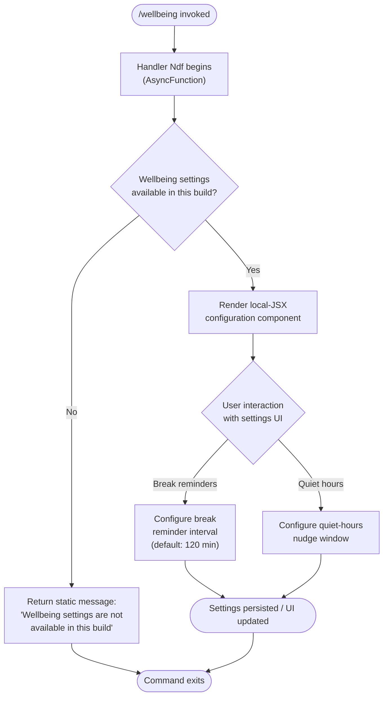

# `/wellbeing`

> Analysis basis: CC v2.1.169 bundle.js (AST extraction + Claude interpretation)
> Minimum version: v2.1.169

---

## Overview

`/wellbeing` is a local-JSX slash command that exposes configuration controls for optional break reminders and quiet-hours nudges within Claude Code. When invoked, the command's async handler (`Ndf`) immediately checks whether wellbeing settings are supported in the current build; if they are not, the command surfaces a static unavailability message rather than rendering any configuration UI. The command is registered with `immediate: true`, meaning it activates without requiring a separate confirmation step.

---

## Registration

| Field | Value |
|---|---|
| type | `local-jsx` |
| name | `wellbeing` |
| description | Configure optional break reminders and quiet-hours nudges |
| aliases | `breaks`, `break-reminder`, `downtime` |
| loc_byte | 12886956 |
| loc_byte_end | 12887209 |
| loc_line | 9150 |
| immediate | `true` |
| module_id | `pMK` |
| load_inline | `true` |
| arbor_handler.name | `Ndf` |
| arbor_handler.fqn | `claude-2.1.169::Ndf` |
| arbor_handler.kind | `AsyncFunction` |
| arbor_handler.resolution_path | `module_id` |
| arbor_handler.n_hits | 0 |

Analysis basis: CC v2.1.169 bundle.js:+12886956 – +12887209

---

## Input Branching

The handler has two top-level branches: the build either supports wellbeing settings or it does not. A third path covers the nominal configuration-UI flow. Three distinct branches → Mermaid flowchart required.



---

## Behavioral Spec

### Handler Entry — Availability Gate (`Ndf`)

```
async function wellbeingHandler(context):
    available = checkBuildSupportsWellbeing()   // see note below
    if not available:
        return staticUnavailableMessage(
            "Wellbeing settings are not available in this build"
        )
    return renderWellbeingConfigUI(context)
```

The literal string `"Wellbeing settings are not available in this build"` is emitted directly when the feature flag is absent.

Analysis basis: CC v2.1.169 bundle.js:+12886307

---

### Interval / Time Arithmetic (`Vdf`)

A helper function performs absolute-value arithmetic on interval values (likely minutes). The constant `120` appears in proximity, suggesting a default break-reminder interval of **120 minutes**.

```
function normalizeInterval(rawValue):
    result = Math.abs(rawValue)   // enforce non-negative
    if result == 0:
        result = DEFAULT_INTERVAL   // fallback: 120
    return result
```

- Default break-reminder interval: **120 minutes** (Analysis basis: CC v2.1.169 bundle.js:+12885990)
- Boundary sentinel `0` for "disabled / unset": CC v2.1.169 bundle.js:+12886154
- Boundary sentinel `1` for "minimum active value": CC v2.1.169 bundle.js:+12886166

---

### Bootstrap / Network Fetch Path (`H`)

The handler calls a bootstrap utility `H` which performs an authenticated HTTP fetch. Key observable behaviours:

- Logs `"[Bootstrap] Fetching"` before the request (CC v2.1.169 bundle.js:+16097956).
- Sets `Content-Type: application/json` and `User-Agent` headers (CC v2.1.169 bundle.js:+16098041, +16098075).
- Applies a **5 000 ms timeout** (CC v2.1.169 bundle.js:+16098157).
- On success, logs `"[Bootstrap] Fetch ok"` (CC v2.1.169 bundle.js:+16098330).
- On parse failure, records telemetry sub-event `"parse_failed"` under the `"api_bootstrap_fetch"` event key (CC v2.1.169 bundle.js:+16098278, +16098300).

```
async function bootstrapFetch(url, token):
    log("[Bootstrap] Fetching", url)
    response = await fetch(url, {
        headers: {
            "Content-Type": "application/json",
            "User-Agent": buildUserAgent()
        },
        timeout: 5000
    })
    if response.ok:
        data = await response.json()
        log("[Bootstrap] Fetch ok")
        return data
    else:
        emitTelemetry("api_bootstrap_fetch", { reason: "parse_failed" })
        throw FetchError(response.status)
```

Analysis basis: CC v2.1.169 bundle.js:+16097954

---

### Markdown / Prompt Parsing Subsystem (`M9`, `Cc`, `c9`)

Reached transitively through the configuration renderer, this subsystem normalises model-name strings and parses markdown-style content. Relevant constants surfaced:

- Model family tokens: `"opus"`, `"sonnet"`, `"haiku"`, `"opusplan"` (CC v2.1.169 bundle.js:+2252293, +2252215, +2252254, +2252174)
- Speed/quality hint: `"best"` (CC v2.1.169 bundle.js:+2252330)
- Minute-marker token: `"[1m]"` (CC v2.1.169 bundle.js:+2252200)
- Provider discriminators: `"firstParty"`, `"anthropicAws"`, `"gateway"`, `"mantle"` (CC v2.1.169 bundle.js:+2248333, +2105867, +2105887, +2249023)
- Vendor prefix guard: `"anthropic."` (CC v2.1.169 bundle.js:+2246054)

```
function normaliseModelName(raw):
    trimmed = raw.trim().toLowerCase()
    if trimmed.startsWith("anthropic."):
        trimmed = stripVendorPrefix(trimmed)
    family = detectFamily(trimmed)   // opus | sonnet | haiku | opusplan | best
    provider = detectProvider(trimmed)  // firstParty | anthropicAws | gateway | mantle
    return { family, provider, canonical: trimmed }
```

Analysis basis: CC v2.1.169 bundle.js:+2248110

---

### File-Write / Persistence Layer (`StK`, `htK`, `Vo8`)

Settings are persisted to disk via an append-file pipeline:

```
async function persistSettings(settingsObject, targetDir):
    ensureDirExists(targetDir)          // Mh.mkdir
    serialised = serialise(settingsObject)
    byteLen = Buffer.byteLength(serialised)
    if byteLen exceeds rotation threshold:
        rotateLogs(targetDir)           // Vo8: stat → rename / unlink
    appendToFile(targetDir, serialised) // Mh.appendFile
    registerCleanup()                   // Z9 → ZGA.register
```

- File rotation checks `.txt` suffix and slices the last 4 bytes for suffix detection (CC v2.1.169 bundle.js:+207832, +207854).
- `EISDIR` error code is caught and handled during stat operations (CC v2.1.169 bundle.js:+178013).
- Timer infrastructure uses `clearTimeout` / `setTimeout` / `setImmediate` with a **1 000 ms** base delay and **100 ms** jitter window (CC v2.1.169 bundle.js:+61630, +61651).

Analysis basis: CC v2.1.169 bundle.js:+208403

---

### Telemetry — Feature-SAD Event (`o6`, `d`)

One telemetry event is emitted from a path reachable under this command:

- **`tengu_feature_sad`** — fires when the feature is unavailable or encounters a degraded state (CC v2.1.169 bundle.js:+1014069).

```
function reportFeatureUnavailable(featureName):
    emitTelemetry("tengu_feature_sad", { feature: featureName })
```

Analysis basis: CC v2.1.169 bundle.js:+1014067

---

## State & Side Effects

| Item | Detail |
|---|---|
| Telemetry | `tengu_feature_sad` (CC v2.1.169 bundle.js:+1014069) |
| Bootstrap telemetry sub-key | `"api_bootstrap_fetch"` / `"parse_failed"` (bundle.js:+16098278) |
| Hook registration | `ZGA.register` called via `Z9` on settings write (bundle.js:+62328) |
| File I/O | `Mh.mkdir`, `Mh.appendFile`, `Mh.rename`, `Mh.unlink`, `Mh.stat` via persistence layer |
| Timer side effects | `setTimeout` (1 000 ms base), `setImmediate`, `clearTimeout` registered during write pipeline (bundle.js:+61906, +61999, +61742) |
| appState changes | Settings object written to disk; break-reminder interval and quiet-hours window updated in persisted config |
| Sound | <!-- TODO: not found in depth-2 traversal; needs --depth 4 --> |
| Build-gate | Static unavailability string returned when wellbeing feature absent from build (bundle.js:+12886307) |

---

## Version History

| Version | Change |
|---|---|
| v2.1.169 | Initial analysis |

---

## Common Mistakes

1. **Invoking `/wellbeing` in a stripped or enterprise build** — if the build does not include the wellbeing feature module (`pMK`), the command silently returns the unavailability message rather than an error, which may be mistaken for a bug.
2. **Expecting instant persistence** — the file-write pipeline is asynchronous and uses a timer-based queue; settings may not be flushed to disk synchronously after the UI interaction completes.
3. **Using numeric `0` as a valid interval** — the handler treats `0` as "disabled / unset" and substitutes the default 120-minute value. Pass `1` or higher to activate the minimum active reminder interval.
4. **Confusing aliases** — `/breaks`, `/break-reminder`, and `/downtime` all resolve to this command; pick one and use it consistently to avoid confusion in shared workspaces or documentation.
5. **Expecting the command to accept free-text arguments** — `/wellbeing` is a `local-jsx` command that renders a UI; it does not parse inline argument text the way prompt-type commands do.

---

## Appendix — Identifier Mapping

> For bundle debugging only. Identifiers change across versions.

| Identifier | Role |
|---|---|
| `Ndf` | Main async handler for `/wellbeing` (arbor_handler, AsyncFunction, resolved via module_id `pMK`) |
| `Vdf` | Interval normalisation helper (uses `Math.abs`; applies default 120-min fallback) |
| `vdf` | Lowercase variant / helper associated with interval logic |
| `H` | Bootstrap fetch utility (HTTP fetch with 5 000 ms timeout, Content-Type/User-Agent headers) |
| `N` | Top-level command dispatch / argument router |
| `ItK` | Argument parsing sub-routine called from `N` |
| `vGA` | Validation helper within argument parser |
| `CH` | JSON serialisation helper (`JSON.stringify`) |
| `R4` | String segmentation / path-component extractor |
| `qZA` | Array-map helper for path segments |
| `rBH` | File write wrapper calling `lEA` |
| `lEA` | Low-level write executor (`H.write`) |
| `StK` | Settings persistence orchestrator (mkdir → append → rotate → register cleanup) |
| `TBH` | Timer management (clearTimeout / setTimeout / setImmediate queue) |
| `_4H` | Path assembly helper (join, `A_`, `I6`) |
| `n56` | EISDIR-aware stat error handler |
| `MZA` | Path join utility for persistence target |
| `Vo8` | Log-rotation helper (stat → rename / unlink `.txt` files) |
| `htK` | Async append-file executor (mkdir + appendFile + rotate + byteLength check) |
| `Z9` | Cleanup hook registrar (`ZGA.register`) |
| `w2_` | Input string splitter / trimmer |
| `u6H` | Set membership check (`vO4.has`) |
| `n3` | String replacement normaliser |
| `M9` | Markdown/prompt parsing entry point |
| `Cc` | Compound parser calling `tY`, `pU`, `FA`, `CC` |
| `CC` | Line-level parser (trim, startsWith, includes, model token dispatch) |
| `c9` | Model-name canonicalisation (toLowerCase, replace, family/provider detection) |
| `u2` | Locale/normalisation utility (`ZLH`) |
| `TLH` | Provider list inclusion check (`GLH.includes`) |
| `Mk` | Model-family classifier (`zM`, `F5`) |
| `QcH` | Quality-hint resolver (`F5`) |
| `AE` | Provider resolver (`zM`, `F5`, `YA`) |
| `dG1` | Default provider fallback (delegates to `AE`) |
| `zM` | Provider enum resolver (`YA`; emits `"anthropicAws"`, `"gateway"`) |
| `__8` | Exclusion-list guard (`Q5L.includes`) |
| `dcH` | Fallback token handler (`_6`) |
| `eD` | Extended parser dispatcher (calls `c9`, `hG`) |
| `hG` | Full model descriptor builder (`yA`, `h8H`, `cDH`, `ccH`, `AE`, `x2`, `zM`, `YA`, `F5`, `Mk`) |
| `o6` | Telemetry dispatch for feature-sad events |
| `d` | Core telemetry emitter (`tengu_feature_sad`) |
| `K6` | Secondary telemetry helper (`c76`) |
| `c76` | Telemetry sink / transport |
| `P$` | Post-fetch response processor |
| `l6` | Settings directory resolver |
| `$ZA` | Buffer/byte-length threshold evaluator |

---

*Note: index built via Arbor fallback; some signals (telemetry, literals) may be missing — see arbor-fallback.js.*