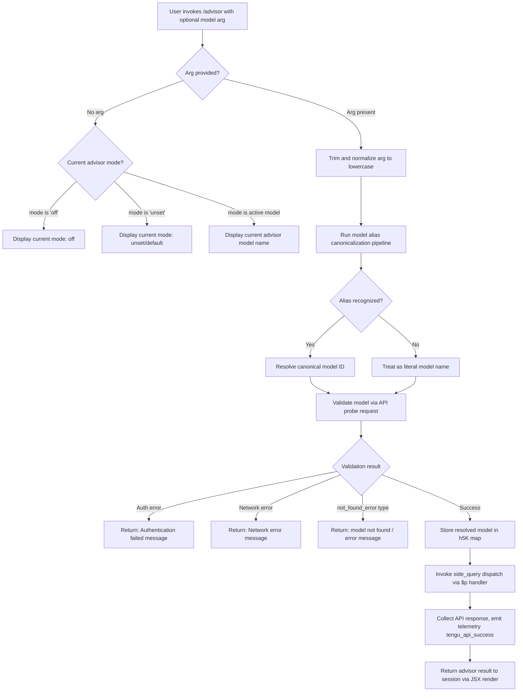

# `/advisor`

> Analysis basis: CC v2.1.170 bundle.js (AST extraction + Claude interpretation)
> Minimum version: v2.1.170

---

## Overview

The `/advisor` command allows Claude Code to delegate a sub-query to a stronger or specialized model at key decision moments, without interrupting the main session flow. The command accepts an optional model name argument, resolves a target advisor model through an alias/canonicalization pipeline, validates it against the API, and then dispatches a "side query" request to that model, returning the result to the active session. This enables the current working model to "consult" a more capable model (e.g., an Opus-class or Fable-class model) for particularly complex reasoning steps.

---

## Registration

| Field | Value |
|---|---|
| type | `local-jsx` |
| name | `advisor` |
| description | `Let Claude consult a stronger model at key moments` |
| loc_byte | `12814214` |
| loc_byte_end | `12814455` |
| loc_line | `9127` |
| argumentHint | `null` |
| isHidden | `null` |
| module_id | `u5K` |
| load_inline | `true` |
| arbor_handler.name | `kQf` |
| arbor_handler.fqn | `claude-2.1.170::kQf` |
| arbor_handler.kind | `AsyncFunction` |
| arbor_handler.resolution_path | `module_id` |
| arbor_handler.n_hits | `1` |

Analysis basis: CC v2.1.170 bundle.js:+12814214

---

## Input Branching

The command has multiple distinct branches based on the supplied model argument and the current advisor mode state. A Mermaid flowchart is used.



Analysis basis: CC v2.1.170 bundle.js:+12813670, +12813706, +12813746, +12813757, +12813838, +12813864, +12813912

---

## Behavioral Spec

### 1. Handler Entry — Main Advisor Async Function

```
async function advisorCommandHandler(input, context):
    trimmedArg = input.trim()                          // via A.trim, loc +12813670
    element = createElement(...)                       // JSX render scaffolding, loc +12813706

    if trimmedArg is empty:
        currentMode = readCurrentAdvisorMode()
        // mode is stored as "off" | "unset" | <model-id>
        // literals "off" at +12813746, "unset" at +12813757
        return renderCurrentModeDisplay(currentMode)

    normalizedArg = trimmedArg.toLowerCase()
    resolvedModel = resolveModelAlias(normalizedArg)   // via B9, loc +12813824
    validationResult = validateAdvisorModel(resolvedModel)  // via Pu6, loc +12813838

    if validationResult.error:
        return renderErrorMessage(validationResult.error)

    storeResolvedModel(resolvedModel)                  // h5K.set, loc +12805719
    return dispatchSideQuery(resolvedModel, context)   // via $p, loc +12813838
```

Analysis basis: CC v2.1.170 bundle.js:+12813670, +12813706, +12813746, +12813757, +12813824, +12813838

---

### 2. Model Alias Resolution — canonicalization pipeline

```
function resolveModelAlias(normalizedName):
    // B9 at loc +12813824; internal sub-calls Uc, Lw6, Sv, flH, AE, yT1, Yf, C_8, MlH

    // Step 1: Check if input contains a known provider prefix
    if not isRecognizedProvider(normalizedName):    // Uc → MNH.includes, loc +2246125
        // pass through to next check

    // Step 2: Apply model family keyword mapping
    // Keywords recognized (with bracket-notation aliases):
    //   "fable"     → fable model family   (loc +2255343)
    //   "[1m]"      → 1-minute cache alias  (loc +2255367)
    //   "opusplan"  → opus planning alias   (loc +2255382)
    //   "sonnet"    → sonnet family         (loc +2255423)
    //   "haiku"     → haiku family          (loc +2255462)
    //   "opus"      → opus family           (loc +2255501)
    //   "best"      → highest-capability    (loc +2255538)
    familyModel = lookupModelFamily(normalizedName)    // Lw6 → Y7 pipeline

    // Step 3: Apply string normalization (replace separators)
    //   e.g. "fable-5"  → "fable_5"   (loc +12806560/+12806583)
    //        "opus-4-8" → "opus_4_8"  (loc +12806660/+12806684)
    //   Further dash/underscore canonicalization via _.replace, loc +2255628
    canonicalized = normalizeModelNameSeparators(normalizedName)

    // Step 4: Resolve full canonical model ID
    //   Checks known alias sets: fable-5/fable_5, opus-4-8/opus_4_8,
    //   opus-4-7/opus_4_7, opus-4-6/opus_4_6, opus-4-5/opus_4_5,
    //   sonnet-4-6/sonnet_4_6, sonnet-4-5/sonnet_4_5
    //   (locs +12806560 through +12807037)
    //   Also recognizes "mythos-5" alias (loc +7312048) → "claude-mythos-5"
    //   and "claude-fable-5" (loc +2249707)
    return buildCanonicalModelId(canonicalized)
```

Analysis basis: CC v2.1.170 bundle.js:+2255343, +2255367, +2255382, +2255423, +2255462, +2255501, +2255538, +12806560, +12806583, +12806660, +12806684, +7312048, +2249707

---

### 3. Model Validation — API probe

```
async function validateAdvisorModel(resolvedModelId):
    // Pu6 at loc +12805205–12805760

    if resolvedModelId.trim() is empty:
        return error("Model name cannot be empty")    // literal loc +12805242

    // Normalize and check against known-invalid model set
    lowerModel = resolvedModelId.toLowerCase()        // loc +12805390
    if isInKnownInvalidSet(lowerModel):               // MNH.includes, loc +12805409
        return error(buildInvalidModelMessage())

    // Check if model already validated in session cache
    if h5K.has(resolvedModelId):                      // loc +12805511
        return success(h5K.get(resolvedModelId))

    // Run sub-agent validation request with ephemeral cache label
    // Uses "model_validation" tag (loc +12805606)
    // Sends a minimal "Hi" message (literal loc +12805675)
    // with cache_type "ephemeral" (loc +12805700)
    validationResponse = await dispatchValidationSubQuery(resolvedModelId)

    if validationResponse.authError:
        return error("Authentication failed. Please check your API credentials.")
        // literal loc +12805978

    if validationResponse.networkError:
        return error("Network error. Please check your internet connection.")
        // literal loc +12806080

    if validationResponse.errorType == "not_found_error":
        // literal loc +12806199
        // Returns message containing "model:" prefix (loc +12806281)
        return error(buildModelNotFoundMessage(resolvedModelId))

    h5K.set(resolvedModelId, validationResponse)      // loc +12805719
    return success(validationResponse)
```

Analysis basis: CC v2.1.170 bundle.js:+12805205, +12805242, +12805390, +12805409, +12805511, +12805606, +12805675, +12805700, +12805719, +12805978, +12806080, +12806199, +12806281

---

### 4. Model Alias Table Resolution — WQf sub-pipeline

```
function resolveAliasTable(normalizedName):
    // WQf at loc +12806512; called from PQf at loc +12805815

    lowered = normalizedName.toLowerCase()            // loc +12806530

    // Check if name includes known alias token
    for alias in ALIAS_TOKENS:                        // _.includes, loc +12806549
        if lowered.includes(alias):
            return mapAliasToModel(alias)             // Y7 pipeline, loc +12806634

    // Aliases recognized:
    //   "fable-5" / "fable_5"   → canonical fable-5 model
    //   "opus-4-8" / "opus_4_8" → canonical opus-4-8 model
    //   "opus-4-7" / "opus_4_7" → canonical opus-4-7 model
    //   "opus-4-6" / "opus_4_6" → canonical opus-4-6 model
    //   "opus-4-5" / "opus_4_5" → canonical opus-4-5 model
    //   "sonnet-4-6" / "sonnet_4_6"
    //   "sonnet-4-5" / "sonnet_4_5"

    return String(normalizedName)                     // fallthrough, loc +12806480
```

Analysis basis: CC v2.1.170 bundle.js:+12806512, +12806530, +12806549, +12806560, +12806583, +12806634, +12806480

---

### 5. Side Query Dispatch — core API invocation

```
async function dispatchSideQuery(modelId, context):
    // $p at loc +13660324
    // Annotated as query type "side_query" (literal loc +13660356)

    // Build HTTP request via HF (full API client, loc +13660324)
    // Sets x-app header (loc +3214222)
    // Sets User-Agent (loc +3214250)
    // Sets X-Claude-Code-Session-Id header (loc +3214268)
    // Auth flow: checks OAuth token via HF → He6 pipeline
    // Timeout: 600000 ms (10 minutes) (loc +3215129) with retry count 10 (loc +3215137)

    // Constructs request body including:
    //   - model: resolvedModelId
    //   - messages array built via $2H, u2 pipelines
    //   - context flags: "sideQuery" (loc +13661727)
    //   - prompt caching: "1h" TTL (loc +13661208) if tengu_prompt_cache_1h_config applies
    //   - cache_control annotation (loc +13662432)

    response = await fetch(apiEndpoint, requestBody)  // LnH → fetch, loc +2541620

    if response.success:
        emitTelemetry("tengu_api_success")            // loc +13661937
        result = processStreamResponse(response)
        return renderAdvisorResult(result)

    if response.loneeSurrogate:
        emitTelemetry("tengu_lone_surrogate_sanitized")  // loc +13661686
        sanitize(response)

    return renderError(response.error)
```

Analysis basis: CC v2.1.170 bundle.js:+13660324, +13660356, +13661727, +13661208, +13662432, +13661937, +13661686, +2541620

---

### 6. Model Name-to-Canonical-ID Resolution via Y7 pipeline

```
function resolveCanonicalModelId(familyKeyword, providerContext):
    // Y7 at loc +2108258; called from Lw6 at loc +2251114

    // Checks provider class:
    //   "bedrock"      (loc +2108199)
    //   "foundry"      (loc +2106055)
    //   "anthropicAws" (loc +2106111)
    //   "mantle"       (loc +2106165)
    //   "vertex"       (loc +2106213)
    //   "firstParty"   (loc +2106222)
    //   "gateway"      (loc +2106698)

    // Resolves model strings including:
    //   "claude-opus-4-0"    (loc +3231068)
    //   "claude-sonnet-4-0"  (loc +3231091)
    //   "claude-opus-4-1"    (loc +3231261)
    //   "claude-opus-4-5"    (loc +3231284)
    //   "claude-opus-4-6"    (loc +3231307)
    //   "claude-sonnet-4-5"  (loc +3231355)
    //   "claude-sonnet-4-6"  (loc +3231380)
    //   "claude-haiku-4-5"   (loc +3231405)
    //   "claude-fable-5"     (loc +2249707)
    //   "claude-mythos-5"    (loc +2249759)
    //   Models must start with "claude-" (loc +2246623)
    //   or have prefix "anthropic." (loc +2247002)
    //   or prefix "application-inference-profile" (loc +2253250)
    //   (for Bedrock-style ARN profiles)

    return buildFullModelIdentifier(familyKeyword, providerContext)
```

Analysis basis: CC v2.1.170 bundle.js:+2108258, +2106055, +2106111, +2106165, +2106213, +2106222, +2106698, +3231068, +3231091, +2249707, +2249759, +2246623, +2247002, +2253250

---

## State & Side Effects

| Item | Detail |
|---|---|
| Telemetry: `tengu_api_success` | Emitted when the advisor side-query API call completes successfully (loc +13661937) |
| Telemetry: `tengu_lone_surrogate_sanitized` | Emitted when a lone Unicode surrogate is found and sanitized in response text (loc +13661686) |
| Telemetry: `tengu_prompt_cache_1h_config` | Emitted when the 1-hour prompt cache configuration is applied to the side query (loc +13611882) |
| Telemetry: `tengu_daemon_yield` | Emitted when the background daemon yields to a foreground process (loc +16549428) |
| Telemetry: `tengu_bg_retire_pinned_low_mem` | Emitted during low-memory background worker retirement (loc +16534338) |
| Telemetry: `tengu_bg_prewarm_per_sweep` | Emitted during background worker prewarm sweep (loc +16534459) |
| Session cache (`h5K`) | Validated advisor model IDs are stored in a session-scoped Map (`h5K`). Subsequent invocations for the same model ID skip re-validation (loc +12805511, +12805719) |
| API headers set | `x-app`, `User-Agent`, `X-Claude-Code-Session-Id`, `x-claude-remote-container-id`, `x-claude-remote-session-id`, `x-client-app`, `x-claude-code-agent-id`, `x-claude-code-parent-agent-id`, `x-anthropic-additional-protection` (locs +3214222–3214489) |
| Auth side-effect | OAuth token check logged: `[API:auth] OAuth token check starting` / `…complete` (locs +3214805, +3214859) |
| Cloud gateway session check | If gateway session expired, returns user-visible error: `"Cloud gateway session expired — run /login to reconnect."` (loc +3215336) |
| proxyAuthHelper guard | If a proxy auth helper is configured but workspace trust not yet accepted, the helper is skipped with a warning (loc +1837197) |
| proxyAuthHelper timeout | Auth helper sub-process is given 30,000 ms before timing out (loc +1837496) |
| Surrogate sanitization | Lone Unicode surrogates in API responses are sanitized before display |
| appState changes | Advisor model preference is persisted in session config map after successful validation |

---

## Version History

| Version | Change |
|---|---|
| v2.1.170 | Initial analysis |

---

## Common Mistakes

1. **Passing an unrecognized model name without a `claude-` prefix**: The alias pipeline requires model names to begin with `claude-` or use a known alias keyword (e.g., `opus`, `sonnet`, `fable`, `best`). Bare short names that match no alias will be passed as literals and may fail validation.

2. **Expecting instant response for uncached models**: The first invocation for a new model ID triggers a live API validation probe (a minimal "Hi" message). Subsequent calls within the same session use the cached result from `h5K` and are faster.

3. **Using `/advisor` while workspace trust is not accepted with a proxy auth helper configured**: The proxy auth helper will be silently skipped, which can result in authentication failures if the direct API key is also absent.

4. **Assuming the command is synchronous**: The handler (`kQf`) is an `AsyncFunction`. Callers that depend on the advisor result must await it properly; the side-query dispatch involves a live API fetch with up to a 600-second (10-minute) timeout.

5. **Confusing `off` vs `unset` advisor mode**: The mode value `"off"` explicitly disables advisor consultation, while `"unset"` means no preference has been specified and the default behavior applies. Invoking `/advisor` with no argument displays the current mode but does not change it.

6. **Providing a model string in `opus_4_5` underscore format directly**: The canonicalization pipeline normalizes both dash (`opus-4-5`) and underscore (`opus_4_5`) forms, so either is acceptable. However, typos outside these known patterns are not corrected.

---

## Appendix — Identifier Mapping

> For bundle debugging only. Identifiers change across versions.

| Identifier | Role |
|---|---|
| `kQf` | Main async handler for `/advisor` command (arbor_handler) |
| `Pu6` | Model validation sub-function; trims input, checks cache, fires API probe |
| `B9` | Model alias resolution entry point; routes keywords to canonical IDs |
| `$p` | Side-query API dispatch function; builds and sends the advisor HTTP request |
| `HF` | Full Anthropic SDK/API client; handles auth, headers, streaming, retries |
| `Lw6` | Model family keyword-to-model-ID mapper |
| `Y7` | Provider-aware canonical model ID resolver |
| `_7L` | Provider type classifier sub-function |
| `Ew1` | Model entry lookup via `Object.entries` scan |
| `H88` | Model record finder (`K$_.find` based) |
| `Uc` | Known-provider-set membership check (`MNH.includes`) |
| `Sv` | Model family selector combining `Yf` and `Y7` |
| `flH` | Alternative model family resolver path through `Y7` |
| `AE` | Composite model resolution using `r_`, `Y7`, `Yf` |
| `yT1` | Extended model resolution including `NLH`, `Lw6`, `Uh`, `AE` |
| `NLH` | Model list / known-model registry lookup |
| `ONH` | Inclusion check for known model list (`H.includes`) |
| `Uh` | Model string normalizer and prefix/membership validator |
| `KlH` | CML (canonical model list) inclusion check |
| `kT1` | Model index finder using `KlH` and `A.indexOf` |
| `bML` | Bedrock/provider model membership check |
| `xML` | Extended model string validator with prefix and ID checks |
| `C_8` | Model inclusion checker against `mML` set |
| `MlH` | Model string builder using `_6` (string coercion) |
| `PQf` | Alias table entry point; wraps `WQf` and `String` coercion |
| `WQf` | Alias-token lookup and Y7 dispatch for known model aliases |
| `Nv6` | Secondary model name check using lowercase and `NLH`/`Nz_` |
| `Nz_` | Model name normalizer checking `r_`, `FL`, `tDH`, `S_8` |
| `S_8` | Model-in-list inclusion check (`H.includes`) |
| `r_` | Core model string/ID transformer (called widely) |
| `_6` | String coercion utility (`String(...)`) |
| `FL` | Model flag/feature lookup |
| `tDH` | Array-type-aware model descriptor handler |
| `Yf` | Model ID builder via `r_` |
| `NBH` | Provider enum / constant block |
| `Ff6` | Provider feature flag accessor |
| `Zw1` | Provider capability resolver |
| `Q_` | Model config object builder |
| `T8H` | Model metadata accessor |
| `hI` | Model info helper |
| `CcH` | Model compatibility checker |
| `h5K` | Session-scoped Map caching validated advisor model results |
| `LnH` | WIF/credential-exchange HTTP fetch sub-function (provider auth) |
| `TwH` | WIF token exchange handler |
| `He6` | Proxy auth helper runner with timeout/trust guard |
| `whL` | HTTP request stream processor (SSE / event-stream) |
| `ZY` | Model context window / output limit resolver |
| `EY` | API key and credential builder sub-function |
| `DhL` | Request deduplication / store interaction |
| `fhL` | Streaming response chunk handler |
| `LwH` | Rate-limit / retry timing sub-function |
| `Bi8` | Timestamp utility (`Date.now` based) |
| `MP6` | Header key normalizer (lowercase) |
| `OJH` | SDK error/warn logger (`console.error`) |
| `iL8` | Streaming response message builder |
| `NA` | Agent context / IY + RC + j9 composite resolver |
| `RRH` | Main-thread request orchestrator with caching and mode flags |
| `Pr8` | Prompt cache configuration builder |
| `Y6` | Worker/agent lifecycle manager (has/get/add for `AF` and `XJH`) |
| `Wr8` | Response suffix/path checker |
| `uv` | User-ID / context builder |
| `uG_` | Context resolution via `r_` |
| `wkH` | Context serializer (`_6`, `jz_`) |
| `E3` | Text sanitizer (replace lone surrogates) |
| `H78` | Temperature and capability flag setter |
| `u2` | Message array mapper |
| `$2H` | Request body assembler (messages, model, flags) |
| `CH` | JSON serializer (`JSON.stringify`) |
| `uB` | Random ID generator (`f69.randomBytes`) |
| `gL` | Agent ID injector |
| `CZA` | Tool-use block post-processor (pop/push Object.keys) |
| `wQ6` | Tool-use block regex tester |
| `fh` | Deep clone utility (`structuredClone`) |
| `jQ6` | Tool result block assembler |
| `RZA` | Tool result text replacer |
| `LzH` | Latency/timing annotation builder |
| `J1` | Telemetry flush wrapper (`ff6`) |
| `f06` | Prompt cache control block builder (`Tz9`, `KaH`, `L06`) |
| `Tz9` | Cache TTL resolver |
| `KaH` | Cache block type builder |
| `L06` | Cache block list builder |
| `Hn` | Agent name resolver (builtin/custom prefix stripper) |
| `DoL` | Agent descriptor prefix parser |
| `lu` | Thread-type classifier (`repl_main_thread` check) |
| `hH` | Error reporter with `go.logError` and `fQH.push` |
| `vRH` | Teammate mailbox message-read marker |
| `xef` | Conversation turn finder (user/text) |
| `RYA` | SHA-256 hash builder for request dedup |
| `u_8` | Sub-agent context builder |
| `CK` | String normalizer / trim |
| `b_8` | Async store accessor (`bT1.getStore`) |
| `Rz_` | Sub-agent flag injector |
| `R78` | Request ID builder |
| `ZXK` | Cache-control injection helper |
| `jD` | Async local storage accessor (`ST1.getStore`) |
| `vG_` | URL path parser (split/trim/indexOf/slice) |
| `X9` | Background mode flag reader (`_wH`) |
| `Za` | Version/error-page builder |
| `v6` | Config value reader (`xZ`) |
| `bz_` | URL encoder (`encodeURIComponent` + replace) |
| `N` | Model-string display formatter (toUpperCase, trim, etc.) |
| `_O` | Cache-eviction helper (`cG_`) |
| `xT1` | Boolean coercion helper |
| `IY` | Auth credential composer (OAuth/API-key) |
| `E$` | Request context flag reader |
| `LhL` | Prompt parameter builder (`$P`, `yiH`) |
| `F_` | Feature-flag accessor |
| `O0` | Queue manager (`qO`) |
| `Aj` | Auth profile selector (implicit/OAuth/etc.) |
| `NZH` | Model prefix validator (`EaK.find`, `H.startsWith`, `zg6`) |
| `A` | Stream/connection closer (also `.toLowerCase`) |
| `f` | Paired stream-closer (`.close` on two objects) |
| `q` | Event-stream data source |
| `Y1` | Exit handler calling `JpH`, `aj`, `process.exit` |
| `L` | Request registry manager (`q.add`, `q.delete`, `f.finally`) |
| `xf6` | Post-response cleanup / finalizer |
| `W1` | Bedrock inference-profile type checker |
| `Ch` | Model context builder via `r_` |
| `W` | Worker pool state holder (`vRH`) |
| `E` | Token count clamper (`Math.max`, `Math.min`) |
| `Gs1` | Response parser / event stream handler |
| `DkH` | Parallel sub-task dispatcher |
| `lL8` | Sub-result collector |
| `nL8` | Sub-result error handler |
| `Rc` | Response validator |
| `uF1` | Azure Cognitive Services token fetcher |
| `fs1` | Azure credential builder |
| `h` | Background worker sweep scheduler |
| `k` | Sweep target selector |

Note: index built via Arbor fallback; some signals (telemetry, literals) may be missing — see arbor-fallback.js.