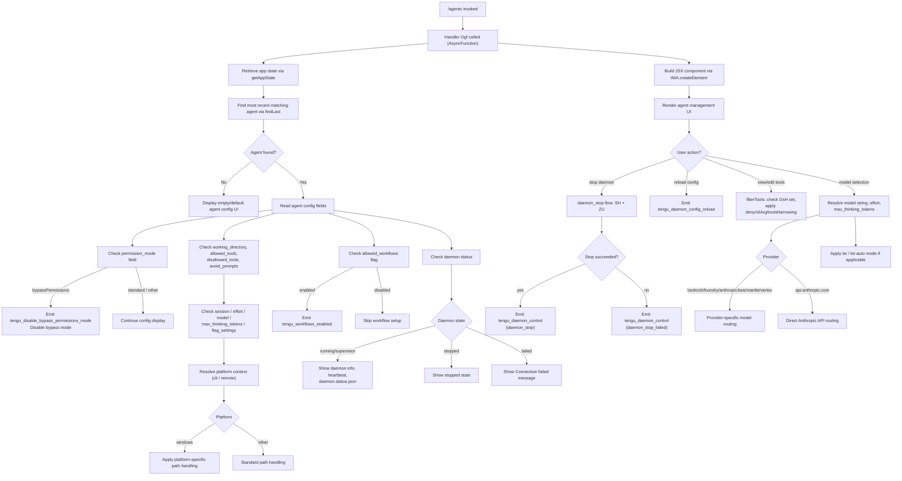

# `/agents`

> Analysis basis: CC v2.1.170 bundle.js (AST extraction + Claude interpretation)
> Minimum version: v2.1.170

---

## Overview

The `/agents` command provides a management interface for agent configurations within Claude Code. It allows users to inspect, configure, and control background agent processes — including their working directories, tool permissions, model settings, and daemon lifecycle. The command renders a JSX-based UI component and delegates to an async handler (`Ogf`) that orchestrates agent state retrieval, configuration display, and daemon control operations.

---

## Registration

| Field | Value |
|---|---|
| type | `local-jsx` |
| name | `agents` |
| description | `Manage agent configurations` |
| loc_byte | `12746748` |
| loc_byte_end | `12746873` |
| loc_line | `9104` |
| module_id | `ffK` |
| load_inline | `true` |
| arbor_handler.name | `Ogf` |
| arbor_handler.fqn | `claude-2.1.170::Ogf` |
| arbor_handler.kind | `AsyncFunction` |
| arbor_handler.resolution_path | `module_id` |
| arbor_handler.n_hits | `0` |

Analysis basis: CC v2.1.170 bundle.js:+12746748

The registration spans bytes `(12746748, 12746873)`. The handler was resolved by following the `module_id` field (`ffK`) to its module exports, then performing a name lookup — Arbor's `module_id` resolution path. The handler `Ogf` is an `AsyncFunction`.

---

## Input Branching

The `/agents` command involves more than three distinct execution branches based on agent state, daemon status, permission mode, and configuration fields. A Mermaid flowchart is used to represent the branching structure.



Analysis basis: CC v2.1.170 bundle.js:+12746599 (handler entry), +10615111 (app state), +10615191 (findLast), +4247354 (disable bypass), +16566763 (daemon control), +16544205 (daemon stop)

---

## Behavioral Spec

### 1. Handler Entry and App State Retrieval

The top-level async handler (`Ogf`) is the entry point for the `/agents` command. It calls the app-state accessor (`x_`) to obtain a snapshot of current application state.

```
async function agentsCommandHandler(context):
    appState = getAppState()                     // via x_ → H.getAppState
    recentAgent = appState.findLast(             // via x_ → A.findLast
        agent => matches criteria
    )
    return renderAgentsUI(appState, recentAgent)
```

Analysis basis: CC v2.1.170 bundle.js:+12746599, +10615111, +10615191

The `x_` helper also internally uses `Math.random` and `setTimeout` (via `H`), suggesting it may include polling or jitter logic for state refresh.

Analysis basis: CC v2.1.170 bundle.js:+13939352, +13939389

---

### 2. Agent Configuration Field Inspection

Once an agent is found, its configuration is read across several well-known string keys:

```
function readAgentConfig(agent):
    config = {}
    config.workingDirectory  = agent["working_directory"]    // +10615216
    config.allowedTools      = agent["allowed_tools"]        // +10615271
    config.disallowedTools   = agent["disallowed_tools"]     // +10615326
    config.avoidPrompts      = agent["avoid_prompts"]        // +10615387
    config.permissionMode    = agent["permission_mode"]      // +10615489
    config.bypassPermissions = agent["bypassPermissions"]    // +10615520
    config.session           = agent["session"]              // +10615819
    config.effort            = agent["effort"]               // +10615844
    config.model             = agent["model"]                // +10615857
    config.maxThinkingTokens = agent["max_thinking_tokens"]  // +10615869
    config.flagSettings      = agent["flag_settings"]        // +10615895
    return config
```

Analysis basis: CC v2.1.170 bundle.js:+10615216 through +10615895

---

### 3. Permission Mode Handling

When the agent's `permission_mode` is `"bypassPermissions"`, the command triggers a disable sequence and emits a telemetry event:

```
function handlePermissionMode(config):
    if config.permissionMode == "bypassPermissions":
        disableBypassPermissionsMode()          // via Xb → Y6
        emit("tengu_disable_bypass_permissions_mode")
        markDisabled("disable")                 // literal "disable" at +4247458
    else:
        // standard or other mode: continue without modification
```

Analysis basis: CC v2.1.170 bundle.js:+4247354, +4247357, +4247458

The disable path flows through `Xb → Y6`, which calls several sub-functions including permission-set management (`uP6`, `mP6`), a deduplication check (`XJH.has`), and state writer (`D78`).

Analysis basis: CC v2.1.170 bundle.js:+4247354, +3284428, +3284465, +3284517, +3284528

---

### 4. Daemon Status Display and Lifecycle

The daemon lifecycle is managed through a supervisor/heartbeat pattern. The `"supervisor"` role is a string literal used when writing daemon configuration.

```
function displayDaemonStatus(daemonState):
    match daemonState:
        case "stopped":
            showStoppedBadge()                  // literal at +16566597
        case "connected":
            showConnectedBadge()                // literal at +16374398
            showHeartbeatInfo()                 // literal "heartbeat" at +16543633
            showStatusFile("daemon.status.json") // literal at +12925689
        case "failed":
            showErrorMessage("Connection failed") // literal at +16374597
            markFailed()                         // literal "failed" at +16374579
```

The daemon stop sequence (triggered from the UI) uses a race/all Promise strategy:

```
async function stopDaemon():
    result = await Promise.race([
        Promise.all([shutdownDaemon(), clearTimeouts()]),   // via ZU → cLH, lLH
        timeoutAfter(500)                                   // literal 500 at +16561806
    ])
    if result == "aborted":                                 // literal at +2463746
        emitTelemetry("tengu_daemon_control", "daemon_stop_failed") // +16566725
        process.exit()                                      // +16561845
    else:
        emitTelemetry("tengu_daemon_control", "daemon_stop")        // +16566688
```

Analysis basis: CC v2.1.170 bundle.js:+16561762, +16561776, +16561806, +16561845, +16566688, +16566725, +16566763

---

### 5. Agent Process Management (Start/Stop/Reload)

The background session management uses a map-based registry of running agent processes. Each entry tracks its process handle and can be stopped, updated, and restarted:

```
function manageAgentProcess(agentId, newConfig):
    existing = processRegistry.get(agentId)           // via Y → f.get
    if existing:
        existing.stop()                               // via Y → T.stop, E.stop
        processRegistry.delete(agentId)              // via Y → f.delete

    newProcess = createProcess(newConfig)
    newProcess.updateConfig(newConfig)               // via Y → E.updateConfig
    newProcess.start()                               // via Y → E.start, V.start
    processRegistry.set(agentId, newProcess)         // via Y → f.set

    emitTelemetry("tengu_daemon_config_reload")      // +16545205
```

The process type is identified by the `"supervisor"` role string (literal at `+16544412`), and the system supports connection types `"stdio"`, `"sdk"`, `"http"`, `"sse"`, and `"dynamic"`.

Analysis basis: CC v2.1.170 bundle.js:+16544660, +16544680, +16544689, +16544809, +16544827, +16544974, +16544985, +16545203, +16545205

---

### 6. Tool Permission Filtering

Tool lists (allowed/disallowed) are filtered through a multi-layered narrowing process:

```
function filterAgentTools(toolList, context):
    result = []
    for tool in toolList:
        if toolIsBlocked(tool):                    // literal "blocked" at +10101109
            continue
        if context.source == "cliArg":             // literal at +11022224
            applyCliArgFilter(tool)                // via sS6 → XQ
        if context.source == "toolsNarrowing":     // literal at +11022245
            applyNarrowingFilter(tool)             // via sS6 → $qA
        if tool.action == "deny":                  // literal at +11021484
            excludeTool(tool)
        result.push(tool)
    return result
```

Analysis basis: CC v2.1.170 bundle.js:+10101048, +10101063, +10101109, +11022224, +11022245, +11021484

---

### 7. Model and Provider Resolution

Model selection resolves through a provider-aware branching structure:

```
function resolveModel(config):
    modelString = config.model
    effort = config.effort
    maxThinkingTokens = config.maxThinkingTokens

    provider = detectProvider(modelString)         // via jN → CR_, N, r_

    match provider:
        case "standard":                           // literal at +4996995
            return standardModelConfig(modelString)
        case "tst":                                // literal at +4997074
            if tstScore > 100:                     // literal at +4997087
                return tstModelConfig()
        case "tst-auto":                           // literal at +4997124
            return tstAutoConfig()
        case "bedrock":                            // literal at +2106005
            return bedrockConfig(modelString)
        case "foundry":                            // literal at +2106055
            return foundryConfig(modelString)
        case "anthropicAws":                       // literal at +2106111
            return awsConfig(modelString)
        case "mantle":                             // literal at +2106165
            return mantleConfig(modelString)
        case "vertex":                             // literal at +2106213
            // Note: tool-search beta header not accepted on Vertex AI
            // literal at +4998008
            return vertexConfig(modelString)

    if provider uses "api.anthropic.com":          // literal at +2107005
        return directAnthropicConfig(modelString)

    if effort == "debug":                          // literal at +208941
        applyDebugEffort()
```

Analysis basis: CC v2.1.170 bundle.js:+4997472, +4997512, +4997664, +4997686, +2106005, +2106055, +2106111, +2106165, +2106213, +2107005

---

### 8. Workflow and Feature Flag Checks

```
function checkWorkflowsAndFlags(config):
    if featureFlag("allow_workflows").isEnabled():    // literal at +2513091
        enableWorkflows()
        emitTelemetry("tengu_workflows_enabled")      // +2513292
        if plan == "pro":                             // literal at +2513537
            applyProPlanWorkflowSettings()

    if featureFlag("allow_product_feedback").isEnabled(): // literal at +2511754
        enableFeedback()
```

Analysis basis: CC v2.1.170 bundle.js:+2513091, +2513289, +2513292, +2513537, +2511754

---

### 9. Feature Status Telemetry (OK / Bad)

The command emits feature health telemetry for internal monitoring:

```
function reportFeatureStatus(status):
    if status == "ok":
        emitTelemetry("tengu_feature_ok")            // +1014205
    else:
        emitTelemetry("tengu_feature_bad")            // +1014267
```

Analysis basis: CC v2.1.170 bundle.js:+1014203, +1014205, +1014265, +1014267

---

### 10. Local Agent Type Resolution

When creating or identifying a local agent:

```
function resolveAgentType(config):
    if config.type == "local-agent":               // literal at +6884198
        agentPath = resolvePath(config)            // via lP → _6, Ni8
        return LocalAgent(agentPath)

    if config.hasTeamFlag("--agent-teams"):        // literal at +6912603
        emitTelemetry("tengu_amber_flint")         // +6912715
        return TeamAgent(config)
```

Analysis basis: CC v2.1.170 bundle.js:+6884198, +6912603, +6912715

---

### 11. JSX Rendering

The handler creates a JSX element at the top level for the UI:

```
function renderAgentsUI(state, agentConfig):
    return tMA.createElement(
        AgentManagementComponent,
        { state, agentConfig }
    )
```

Analysis basis: CC v2.1.170 bundle.js:+12746620

---

## State & Side Effects

| Item | Detail |
|---|---|
| Telemetry: `tengu_disable_bypass_permissions_mode` | Fired when bypass-permissions mode is disabled for an agent (bundle.js:+4247357) |
| Telemetry: `tengu_slate_harbor` | Fired during platform/context detection path (bundle.js:+4880478) |
| Telemetry: `tengu_daemon_config_reload` | Fired after a daemon configuration reload is applied (bundle.js:+16545205) |
| Telemetry: `tengu_workflows_enabled` | Fired when the `allow_workflows` feature flag is active (bundle.js:+2513292) |
| Telemetry: `tengu_cobalt_ridge` | Fired during Windows-platform agent path handling (bundle.js:+4876620) |
| Telemetry: `tengu_feature_ok` | Fired when a sub-feature health check passes (bundle.js:+1014205) |
| Telemetry: `tengu_feature_bad` | Fired when a sub-feature health check fails (bundle.js:+1014267) |
| Telemetry: `tengu_daemon_control` | Fired on daemon start/stop actions with sub-event labels `daemon_stop` or `daemon_stop_failed` (bundle.js:+16566763) |
| Telemetry: `tengu_amber_flint` | Fired when agent-teams flag is resolved (bundle.js:+6912715) |
| Process registry mutation | Running agent processes are added, updated, or removed from an in-memory map (bundle.js:+16544660–+16544985) |
| Daemon lifecycle | `process.exit()` may be called if daemon stop times out past 500 ms (bundle.js:+16561845) |
| UUID generation | `Xw_.randomUUID()` is called during agent session initialization (bundle.js:+2501139) |
| Event emission | `H.emit` is called during agent event dispatch (bundle.js:+2501251) |
| AppState read | `H.getAppState` is called for current session state snapshot (bundle.js:+10615111) |
| Heartbeat tracking | Heartbeat string is used for active daemon status display (bundle.js:+16543633) |
| Status file read | `daemon.status.json` is read for daemon health data (bundle.js:+12925689) |
| Date.now calls | Timestamps are recorded at multiple points (bundle.js:+3304804, +12925801) |

---

## Version History

| Version | Change |
|---|---|
| v2.1.170 | Initial analysis |

---

## Common Mistakes

1. **Assuming `/agents` only lists agents** — the command is a full management UI with daemon lifecycle controls (stop, reload, status), not merely a read-only listing.
2. **Ignoring `bypassPermissions` side effects** — invoking the command when an agent has `permission_mode: bypassPermissions` will trigger immediate disabling of that mode and emit a telemetry event, which may be surprising.
3. **Expecting synchronous behavior** — the handler `Ogf` is an `AsyncFunction`; callers or tests must await it or the JSX component may render with incomplete state.
4. **Treating `local-agent` and team agents as identical** — agents with `--agent-teams` flag follow a distinct resolution path (`tengu_amber_flint`) and may have different capabilities.
5. **Overlooking the 500 ms daemon-stop timeout** — if a daemon does not stop within 500 ms, `process.exit()` is called, terminating the entire Claude Code process. This is not a graceful degradation.
6. **Assuming all providers support tool-search beta** — Vertex AI explicitly does not accept the tool-search beta header; this is enforced at runtime unless `ENABLE_TOOL_SEARCH=true` is set (bundle.js:+4998008).
7. **Confusing `allowed_tools` and `disallowed_tools` with final effective tool sets** — these fields are inputs to a multi-stage narrowing pipeline (`cliArg`, `toolsNarrowing`, `deny`-action filtering) and the final set may differ significantly.

---

## Appendix — Identifier Mapping

> For bundle debugging only. Identifiers change across versions.

| Identifier | Role |
|---|---|
| `Ogf` | Top-level async handler for `/agents` command (AsyncFunction, arbor-resolved) |
| `x_` | App state accessor — retrieves current application state and recent agent via `findLast` |
| `H` | App state container / event emitter; also hosts `Math.random`/`setTimeout` for polling |
| `A` | Agent array with `findLast` for locating most recent matching agent |
| `f` | Process/connection handle with `close`, `finally`, `get`, `set`, `delete`, `padEnd` ops |
| `q` | Secondary connection/stream handle; `Y1` sub-call, `add`/`close`/`write`/`includes` |
| `L` | Connection lifecycle manager: `add`, `finally`, `delete` |
| `NR8` | Config field reader for `working_directory` |
| `IR8` | Config field reader for `allowed_tools` / `disallowed_tools` |
| `$1` | Shared config value extractor used by `NR8` and `IR8` |
| `Xb` | Permission mode disabler; delegates to `Y6` and `FA` |
| `Y6` | Core permission-set mutator; orchestrates `uP6`, `mP6`, `Lm`, `D78`, `h6` |
| `uP6` | Permission set sub-operation A |
| `mP6` | Permission set sub-operation B |
| `Lm` | Permission set helper; calls `nu` |
| `D78` | Permission deduplication + state writer; uses `JT_`, `XJH`, `Gw_`, `WT_` |
| `h6` | Permission event recorder; uses `Date.now`, `BSL`, `n6`, `ZG`, `hT_`, `B7H` |
| `iN` | JSX UI component builder; orchestrates all sub-features of the agents UI |
| `dG` | Platform context resolver (`cli`/`remote`); uses `ed`, `CK`, `_6`, `Y6` |
| `ed` | Platform detection sub-helper |
| `CK` | String coercion / boolean normalizer (`yes`/`on`/`no`/`off`) |
| `_6` | String conversion utility |
| `Y` | Agent process registry manager (start/stop/reload cycle) |
| `pTH` | Agent configuration loader; checks `ENOENT`, uses `m9`, `V8`, `$OA`, `EH`, `MOA` |
| `m9` | Store accessor via `JCL.getStore` |
| `V8` | <!-- TODO: not found in depth-2 traversal; needs --depth 4 --> |
| `$OA` | Config helper; delegates to `MOA` |
| `EH` | String builder for agent configuration |
| `K` | Tool list formatter; `map` + `padEnd` for display alignment |
| `bzK` | Column-width calculator for tool display; uses `Object.keys`, `Math.max`, `rD` |
| `T` | Process stop controller (type A); uses `BZ6`, `V76` |
| `BZ6` | Process stop sub-routine A |
| `V76` | Process stop shared sub-routine |
| `E` | Process stop controller (type B); `G`, `Math.max`, `Math.min` |
| `G` | Full process teardown; `V76`, `CS`, `vN`, `Promise.all`, `nn`, `tF`, `hH`, `jA` |
| `ccK` | Heartbeat/config reload helper; uses `V_H` |
| `V_H` | Heartbeat sub-handler |
| `V` | New process starter |
| `d` | Config reload finalizer / completion callback |
| `Z8A` | Session initializer; uses `Whq`, `b_` |
| `b_` | Module binding setup; `tEH`, `dl8`, `gB6`, `QB6`, `xlK`, `HWA` |
| `QB6` | Bound callback factory |
| `NP` | Feature flag evaluator; `M98`, `db1`, `Nw_`, `vwL` |
| `M98` | Feature flag reader; `_6`, `bZ` |
| `bZ` | Feature flag state store accessor |
| `db1` | Feature eligibility checker; delegates to `u9` |
| `u9` | Feature condition evaluator; checks `gb1`, `ZwL`, `FC`, `VwL`, `hq`, `ULH`, `FNH` |
| `Nw_` | Workflow feature enabler; delegates to `NwL` |
| `NwL` | Workflow setup logic; `_6`, `Y6`, `CK`, `wq` |
| `vwL` | Feature flag variant resolver; uses `bZ` |
| `qqH` | Tool filter entry point; `H.filter` + `sS6` |
| `sS6` | Tool permission narrowing router; `XQ`, `$qA`, `Ggq` |
| `XQ` | CLI-arg tool filter; `oC8.flatMap`, `G3` |
| `$qA` | Tools-narrowing filter; `Tz6`, `Ez6`, `kYH`, `Q9_`, `dZ` |
| `Ggq` | Deny-action filter |
| `V8A` | Agent config viewer component; `hb`, `E16`, `b_` |
| `hb` | Config display helper; `a6`, `_6`, `CK`, `S4H`, `Y6` (`windows` platform check) |
| `a4` | Config writer/updater; `a6`, `S4H` |
| `z` | Daemon stop sequence orchestrator; `SH`, `xH`, `ih`, `ZU` |
| `SH` | Daemon stop step 1 (success path); `d`, `K6` |
| `K6` | Key/code resolver; `ff6` |
| `xH` | Daemon stop step 2 (failed path); `d`, `K6` |
| `ih` | Agent session teardown; `nu`, `sc.push`, `UNH`, `Ww_` |
| `nu` | Sub-session cleanup; `mC` |
| `UNH` | Session notification helper; `nh` |
| `Ww_` | Session UUID + event emitter; `_98`, `Xw_.randomUUID`, `glH`, `uB`, `H.emit` |
| `ZU` | Async daemon shutdown with timeout race; `Promise.race`, `Promise.all`, `cLH`, `lLH`, `o8` |
| `cLH` | Daemon shutdown initiator; `dLH.shutdown` |
| `lLH` | Timeout cleaner; `clearTimeout`, `UT_` |
| `o8` | Abort/timeout controller; `K`, `Error`, `q`, `setTimeout`, `O`, `clearTimeout`, `L.unref` |
| `LQ` | Full agent lifecycle manager (main UI sub-component) |
| `lP` | Local agent path resolver; `_6`, `Ni8` |
| `Ni8` | Path normalization utility |
| `GJ` | Agent argument parser; `CK` |
| `W96` | Agent watch/monitor helper |
| `Mq` | Agent-teams flag handler; `_6`, `yT7`, `Y6`; emits `tengu_amber_flint` |
| `yT7` | Team config sub-resolver |
| `d3f` | Agent start sub-step; `tyq`, `b_` |
| `c3f` | Agent start sub-step (alternate); `Khq`, `b_` |
| `jN` | Model/provider resolver entry; `CR_`, `N`, `r_`, `FL` |
| `CR_` | Model string parser; `wkH`, `RR_`, `u17`, `_6`, `CK` |
| `N` | Provider type classifier; `wFH`, `PeK`, `H.includes`, `CH`, `u4`, `$h`, `zFH`, `EeK` |
| `r_` | Cloud provider sub-resolver; `_6` (`bedrock`/`foundry`/`anthropicAws`/`mantle`/`vertex`) |
| `FL` | Model fallback resolver |
| `h4` | Feature isEnabled check helper |
| `O` | Feature flag / abort controller with `isEnabled` and `S8` |
| `S8` | Feature flag state reader |
| `$` | Status file reader (`daemon.status.json`) with `f$K` |
| `f$K` | Daemon status JSON loader; `Xa`, `Date.now`, `m9`, `hu6`, `CH` |
| `Xa` | File reader utility; `hLH` |
| `hu6` | Path joiner for status file; `L$K.join`, `H_` |
| `CH` | JSON serializer wrapper; `JSON.stringify` |

---

Note: index built via Arbor fallback; some signals (telemetry, literals) may be missing — see arbor-fallback.js.