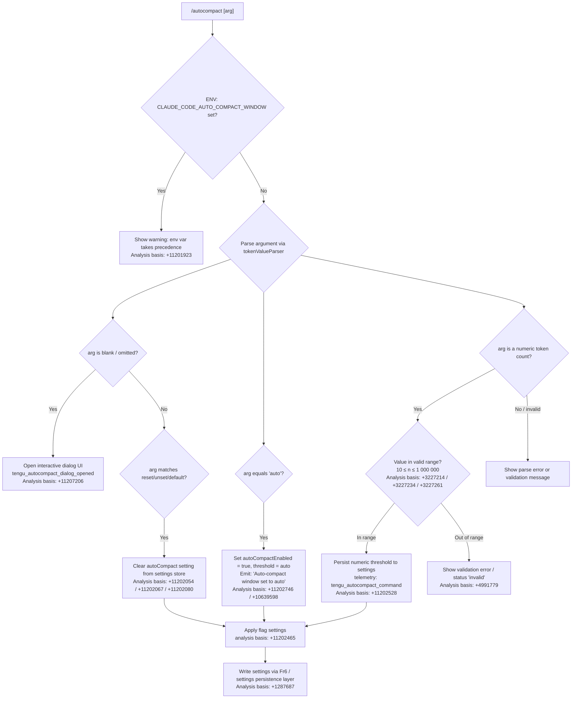

# `/autocompact`

> Analysis basis: CC v2.1.170 bundle.js (AST extraction + Claude interpretation)
> Minimum version: v2.1.170

---

## Overview

`/autocompact` configures the threshold at which Claude Code automatically summarizes (compacts) the conversation context window. Users can supply a specific token count, the keyword `auto` to restore adaptive behavior, or one of several reset/clear keywords to remove the override entirely. The setting is persisted to user or project settings and is overridable by the environment variable `CLAUDE_CODE_AUTO_COMPACT_WINDOW`.

---

## Registration

| Field | Value |
|---|---|
| type | `local-jsx` |
| name | `autocompact` |
| description | `Set how full the context gets before auto-summarizing` |
| argumentHint | `[auto\|<tokens>]` |
| isHidden | `false` |
| module_id | `Tcq` |
| load_inline | `true` |
| loc_byte | `11207489` |
| loc_byte_end | `11207753` |
| loc_line | `7472` |
| arbor_handler.name | `yTf` |
| arbor_handler.fqn | `claude-2.1.170::yTf` |
| arbor_handler.kind | `AsyncFunction` |
| arbor_handler.resolution_path | `module_id` |
| arbor_handler.n_hits | `1` |

Analysis basis: CC v2.1.170 bundle.js:+11207489

---

## Input Branching

There are more than 3 distinct input branches, so a Mermaid flowchart is used.



---

## Behavioral Spec

### 1. Entry Point — Handler (`yTf`)

```
async function autocompactCommandHandler(args, context):
    // Emit dialog-opened telemetry if no args (opens JSX dialog)
    if args is empty:
        emit telemetry "tengu_autocompact_dialog_opened"   // +11207206
        render JSX dialog component via Q$.createElement   // +11207263
        return

    // Otherwise delegate to argument processing
    result = await processAutocompactArgument(args, context)
    return result
```

Analysis basis: CC v2.1.170 bundle.js:+11207171, +11207187, +11207204, +11207248, +11207263

---

### 2. Argument Processing (`Ob6`)

```
async function processAutocompactArgument(rawArg, context):
    // Guard: env var override takes precedence
    if env.CLAUDE_CODE_AUTO_COMPACT_WINDOW is set:
        return statusMessage(
            "CLAUDE_CODE_AUTO_COMPACT_WINDOW is set and takes precedence. " +
            "Unset it to change this setting."
        )                                                   // +11201923

    trimmedArg = rawArg.trim()                             // +11202025

    // Normalize and parse the token value
    parsed = tokenValueParser(trimmedArg)                  // +11202097

    if trimmedArg matches ["reset", "unset", "default"]:  // +11202054, +11202067, +11202080
        clearSetting("autoCompactEnabled")
        emitTelemetry("tengu_autocompact_command", {action: "unset"})
        return successMessage("Auto-compact window unset")

    if parsed.value == "auto":                             // +10639598
        setSetting("autoCompactEnabled", true)
        setSetting("autoCompactThreshold", "auto")
        return successMessage("Auto-compact window set to auto")  // +11202746

    if parsed is a valid integer:
        validateTokenRange(parsed.value)                   // see §3
        persistThreshold(parsed.value)                     // see §4
        emitTelemetry("tengu_autocompact_command", {action: "set", value: parsed.value})  // +11202528
        return successMessage(formatNumber(parsed.value))

    return errorMessage("Invalid argument: " + trimmedArg)
```

Analysis basis: CC v2.1.170 bundle.js:+11201889, +11202025, +11202097, +11202361, +11202526, +11202564, +11202730

---

### 3. Token Value Parser (`k1A`)

```
function tokenValueParser(input):
    s = input.trim()                                       // +10639568
    if s.endsWith("k") or s.endsWith("K"):                // +10639627
        numeric = parseFloat(s)                            // +10639645
        value = Math.round(numeric * 1000)                 // +10639812
    else:
        value = parseInt(s, 10)                            // +10639719

    if not Number.isFinite(value):                         // +10639765
        return {valid: false}

    if s == "auto":                                        // +10639598
        return {valid: true, mode: "auto"}

    return {valid: true, mode: "tokens", value: value}
```

Analysis basis: CC v2.1.170 bundle.js:+10639568–+10639812

---

### 4. Token Range Validation (`JE` / validation layer)

```
function validateTokenRange(value):
    // Minimum token floor: 10
    // Maximum token ceiling: 1 000 000
    if value < 10 or value > 1000000:                      // +3227214, +3227234, +3227261
        return {status: "invalid"}                         // +4991779
    if value is valid:
        return {status: "valid"}                           // +4991704
    // Capped status also possible for boundary conditions
    // status: "capped"                                    // +4991909
```

Analysis basis: CC v2.1.170 bundle.js:+3227162, +3227214, +3227234, +3227261

---

### 5. Setting Persistence (`Hr` + settings stack)

```
async function persistAutocompactThreshold(value, mode):
    // Check environment override first
    envValue = process.env["CLAUDE_CODE_AUTO_COMPACT_WINDOW"]  // +10640172
    if envValue is set:
        // Precedence: env > settings
        return {source: "env"}                             // +10640364

    // Determine source priority:
    //   experiment < settings < env                       // +10640521, +10640434, +10640364
    // Write to userSettings or projectSettings via settings persistence layer
    applyFlagSettings()                                    // +11202465
    writeSetting("autoCompactEnabled", value)             // +10642443

    // Math.max / Math.min clamping applied before write
    clampedValue = Math.max(min, Math.min(max, value))    // +10640290, +10640330

    // Persist via settings writer (Fr6)
    await settingsWriter(targetFile, key, clampedValue)   // +1287687
```

Analysis basis: CC v2.1.170 bundle.js:+10640095, +10640103, +10640168, +10640172, +10640290, +10640330, +10640434, +10640452, +10640545, +10640632

---

### 6. Environment Variable Override (`cAH`)

```
function checkEnvOverride():
    raw = process.env["CLAUDE_CODE_AUTO_COMPACT_WINDOW"]   // +10640172
    if raw is undefined or null:
        return {active: false}

    parsed = parseInt(raw, 10)                             // +4991719
    if isNaN(parsed):                                      // +4991737
        return {active: true, status: "invalid"}
    return {active: true, value: parsed, status: "valid"} // +4991704
```

Analysis basis: CC v2.1.170 bundle.js:+10640168, +4991719, +4991737, +4991850

---

### 7. Settings Layer Read (`e_` / settings loader)

The settings resolution priority stack, from highest to lowest precedence:

1. `policySettings` — managed policy override (`+1286855`)
2. `flagSettings` — CLI flag overrides (`+1286877`)
3. `userSettings` — `~/.claude/settings.json` (`+1268794`, `+1269048`, `+1269058`)
4. `projectSettings` — project-level settings (`+1268845`)
5. `localSettings` — `settings.local.json` (`+1268867`, `+1269120`)
6. SDK inline settings (`+1267443`)

Analysis basis: CC v2.1.170 bundle.js:+1286855, +1286877, +1268794, +1268845, +1268867

---

### 8. Number Formatting for Display (`_K` / `oK`)

```
function formatCompactNumber(n):
    // Uses Intl.NumberFormat with locale "en-US" and notation "compact"
    formatted = new Intl.NumberFormat("en-US", {notation: "compact"}).format(n)  // +216809, +216827
    // Strips trailing ".0" if present                                           // +214797
    return formatted.replace(".0", "")
```

Analysis basis: CC v2.1.170 bundle.js:+214783, +214797, +216809, +216827

---

## State & Side Effects

| Item | Detail |
|---|---|
| Telemetry: `tengu_autocompact_command` | Fired on every successful write (set or unset) of the threshold. Analysis basis: +11202528 |
| Telemetry: `tengu_autocompact_dialog_opened` | Fired when command is invoked with no arguments, triggering the interactive dialog. Analysis basis: +11207206 |
| Telemetry: `tengu_amber_redwood2` | Fired inside the settings-source resolver (`$pq`). Analysis basis: +10639983 |
| Telemetry: `tengu_feature_ok` | Feature health signal — success path. Analysis basis: +1014205 |
| Telemetry: `tengu_feature_sad` | Feature health signal — degraded path. Analysis basis: +1014348 |
| Telemetry: `tengu_feature_bad` | Feature health signal — failure path. Analysis basis: +1014267 |
| Settings write | `autoCompactEnabled` key written to user or project settings JSON via async file writer (`Fr6`). Analysis basis: +10642443, +1287687 |
| Cache invalidation | Settings caches (`kF6`, `Jn8`) cleared after write via `hO`. Analysis basis: +26839, +26851 |
| JSX dialog | When no arg is supplied, a React dialog element is rendered (`Q$.createElement`, type `"dialog"`). Analysis basis: +11207251, +11207263 |
| `apply_flag_settings` event | Emitted after a successful write. Analysis basis: +11202465 |
| ENV override guard | `CLAUDE_CODE_AUTO_COMPACT_WINDOW` env var blocks any settings write and shows a precedence warning. Analysis basis: +11201923, +10640172 |
| appState changes | `autoCompactEnabled` field updated in application state after successful command execution. Analysis basis: +10642443 |

---

## Version History

| Version | Change |
|---|---|
| v2.1.170 | Initial analysis |

---

## Common Mistakes

1. **Setting a value while `CLAUDE_CODE_AUTO_COMPACT_WINDOW` is set in the environment.** The command will display a warning and refuse to write to settings. You must `unset CLAUDE_CODE_AUTO_COMPACT_WINDOW` in your shell first.
2. **Supplying a token count outside the range 10–1 000 000.** Values outside this range are rejected as `"invalid"`. The numeric limits are enforced by the validation layer before any write occurs (Analysis basis: +3227214, +3227261).
3. **Expecting `/autocompact 0` to disable auto-compaction.** The floor is `10`, not `0`. Use `/autocompact reset` (or `unset`/`default`) to remove the threshold override entirely.
4. **Forgetting the `k` suffix for large values.** The parser supports shorthand such as `200k` (interpreted as 200 000 tokens) via `parseFloat` + `× 1000` rounding. Omitting the suffix requires typing the full integer.
5. **Confusing `auto` with omitting the argument.** `auto` sets the threshold to the model-default adaptive mode, while omitting the argument opens the interactive JSX dialog for guided configuration.

---

## Appendix — Identifier Mapping

> For bundle debugging only. Identifiers change across versions.

| Identifier | Role |
|---|---|
| `yTf` | Main async handler for `/autocompact` command (Arbor-resolved entry point) |
| `Ob6` | Argument processor — parses input, guards env override, routes to set/unset/auto/numeric paths |
| `Hr` | Settings persistence orchestrator — reads env override, clamps value, writes to settings store |
| `W1` | Model-name normalization / lookup utility (used during settings resolution) |
| `_88` | Object-entries iteration helper (model family matching) |
| `eJ` | Model-name string classifier — `toLowerCase`, `includes`, `replace` |
| `H` | Random/timeout utility (used in model resolution, `Math.random` + `setTimeout`) |
| `Er8` | Model resolution sub-helper |
| `E3` | String replace helper for model names |
| `JE` | Token-range validator — `parseInt`, `isNaN`, dispatches to `_w`, `CB`, `Bh`, `aL8` |
| `_w` | Validation branch — "invalid" token value path |
| `CB` | Validation branch — in-range token value write path |
| `Bh` | Validation branch — first-party / AWS / mantle provider write path |
| `aL8` | Validation branch — numeric parse + `Number.isFinite` check |
| `J2` | Settings utility called from orchestrator |
| `cAH` | Environment variable override checker (`CLAUDE_CODE_AUTO_COMPACT_WINDOW`) |
| `N` | Log/notification formatter (debug, uppercase, trim) |
| `$pq` | Settings source resolver — fires `tengu_amber_redwood2`; routes `env`/`settings`/`experiment` |
| `tE` | Settings value accessor (reads `autoCompactEnabled`) |
| `F_` | Settings source helper |
| `Y6` | Settings registry accessor (`uP6`, `mP6`, `Lm`, `XJH`, `AF`) |
| `k1A` | Token value parser — handles `auto`, `k`-suffix shorthand, `parseFloat`/`parseInt`, `Math.round` |
| `e_` | Settings loader / file resolver (reads all settings layers, resolves paths) |
| `I$` | Settings object builder |
| `SYH` | Settings file path joiner |
| `XB` | Settings merge helper (merges multiple settings layers) |
| `n6` | File existence / path utility |
| `Hq_` | Settings-from-disk loader (calls `JQA`, `jB`, `YQA`) |
| `JQA` | Settings JSON parser (`wQA`, `Object.keys`, `Qo`) |
| `jB` | Settings field mapper |
| `YQA` | SDK inline settings reader |
| `E2` | Settings post-processor |
| `co` | File reader utility (`readFileSync`, slice, replaceAll) |
| `k8` | ENOENT error handler |
| `V8` | Generic file-error classifier |
| `z9_` | Settings timestamp writer (`Date.now`) |
| `wvH` | Settings path resolver wrapping `So6` + `XB` |
| `So6` | Path resolver using `rI.resolve` / `rI.dirname` |
| `xO6` | Atomic file writer (temp file, `fchmodSync`, `fsyncSync`, `renameSync`) |
| `q` | `fs`-like module proxy |
| `O` | Stat/symlink result object |
| `f` | File handle / close/write abstraction |
| `CH` | JSON serializer (`JSON.stringify`) |
| `hO` | Settings cache invalidator (`kF6.clear`, `Jn8.clear`) |
| `Fr6` | Async settings file writer (mkdir, readFile, appendFile, writeFile) |
| `C6` | Settings file path builder |
| `n1_` | Settings key normalizer |
| `A` | String utility (toLowerCase) |
| `Br6` | Git check-ignore runner |
| `ty4` | Path expander (tilde expansion, `homedir`, `isAbsolute`) |
| `YFA` | Git ls-files tracker check |
| `DFA` | Settings diff / change detector |
| `Ru` | Settings path joiner (`.claude/settings.json`) |
| `W_` | Boolean truthy coercer (`yes`/`on` literals) |
| `xZ` | Boolean normalization helper |
| `SH` | Feature telemetry dispatcher (ok/bad/sad paths) |
| `d` | Core feature telemetry emitter |
| `K6` | Telemetry event queue (`ff6`) |
| `s6` | Feature "sad" telemetry path |
| `xH` | Feature "bad" telemetry path |
| `PB` | Settings-load lifecycle wrapper (start/end markers) |
| `bZ` | Settings load start marker |
| `_q` | Memory usage sampler + dedup set (`HVA`, `Pa8`, `process.memoryUsage`) |
| `_q_` | Full settings load pipeline (date, logging, `JQA`, `jB`, `YQA`) |
| `yF6` | Settings load end marker |
| `hH` | Error handler / logger (`go.logError`, `fQH`, `lN4`) |
| `jA` | Error string formatter |
| `_6` | String coercion utility |
| `hq` | Error classifier (`ImA`) |
| `lN4` | Rolling error log (`di6.shift`, `di6.push`) |
| `Q_` | Settings query helper (calls `PB`) |
| `f6` | Telemetry / event dispatcher (calls `ff6`) |
| `ff6` | Raw event emitter (queue base) |
| `_K` | Number display formatter (calls `oK`) |
| `oK` | `Intl.NumberFormat` compact formatter |
| `veK` | Locale/notation config object for `Intl.NumberFormat` |

---

Note: index built via Arbor fallback; some signals (telemetry, literals) may be missing — see arbor-fallback.js.