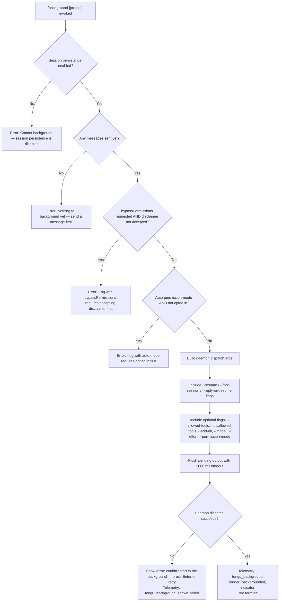

# `/background`

> Analysis basis: CC v2.1.170 bundle.js (AST extraction + Claude interpretation)
> Minimum version: v2.1.170

---

## Overview

The `/background` command (alias `/bg`) detaches the current interactive Claude Code session from the terminal, forks it into a background daemon job, and returns control of the terminal to the user. It constructs a daemon dispatch with the session's current state — including the optional prompt argument, flags such as `--resume`, `--fork-session`, and `--reply-on-resume` — then hands off execution to the background worker (`yof`) via the daemon control socket.

---

## Registration

| Field | Value |
|---|---|
| type | `local-jsx` |
| name | `background` |
| description | `Send this session to the background and free the terminal` |
| aliases | `["bg"]` |
| argumentHint | `[prompt]` |
| immediate | `null` |
| module_id | `lDK` |
| load_inline | `true` |
| loc_byte | `13257324` |
| loc_byte_end | `13257564` |
| loc_line | `9760` |
| arbor_handler.name | `yof` |
| arbor_handler.fqn | `claude-2.1.170::yof` |
| arbor_handler.kind | `AsyncFunction` |
| arbor_handler.resolution_path | `module_id` |
| arbor_handler.n_hits | `0` |

Analysis basis: CC v2.1.170 bundle.js:+13257324

---

## Input Branching

The command has 4+ distinct guard branches before dispatching to the daemon, making a Mermaid flowchart appropriate.



Analysis basis: CC v2.1.170 bundle.js:+13250263, +13250425, +13256678, +13256854, +13252065, +13252070, +13253128, +13253573, +13252765

---

## Behavioral Spec

### Guard: Session Persistence Check

Before any fork attempt, the handler verifies that session persistence is active. If the session was started without persistence, the fork would have nothing to resume on the daemon side.

```
function checkSessionPersistence(session):
    if session.persistenceEnabled == false:
        raise UserError("Cannot background — session persistence is disabled, " +
                        "so the forked job would have nothing to resume.")
```

Analysis basis: CC v2.1.170 bundle.js:+13256678

---

### Guard: First Message Check

```
function checkMessagesExist(session):
    if session.messageCount == 0:
        raise UserError("Nothing to background yet — send a message first.")
```

Analysis basis: CC v2.1.170 bundle.js:+13256854

---

### Guard: Permission Mode Gate

Two safety gates fire before building the dispatch:

```
function checkPermissionGates(flags, userSettings):
    if flags.bypassPermissions == true AND userSettings.bypassDisclaimerAccepted == false:
        raise UserError("--bg with bypassPermissions requires accepting the disclaimer first. " +
                        "Run `claude --dangerously-skip-permissions` once interactively.")

    if flags.permissionMode == "auto" AND userSettings.autoModeOptedIn == false:
        raise UserError("--bg with auto mode requires opting in first. " +
                        "Run `claude --permission-mode auto` once interactively.")
```

Analysis basis: CC v2.1.170 bundle.js:+13250263, +13250425

---

### Dispatch Argument Construction (`buildDispatchArgs`, implements `fB8`)

The handler assembles the CLI argument list that the daemon worker will receive. The call graph shows that `fB8` calls `Array.from`, `K.values`, `D.flatMap`, `X.flatMap`, `P.flatMap` to collect arguments, then passes them to the daemon via `kr` → `Pof` → `eOA`.

```
function buildDispatchArgs(session, commandArg, currentFlags):
    args = []

    // Session resumption
    args.push("--resume", session.id)
    args.push("--fork-session")
    if commandArg is not empty:
        args.push("--reply-on-resume", commandArg)

    // Forward applicable CLI flags from current session
    if currentFlags.allowedTools:
        args.push("--allowed-tools", currentFlags.allowedTools)
    if currentFlags.disallowedTools:
        args.push("--disallowed-tools", currentFlags.disallowedTools)
    if currentFlags.addDir:
        args.push("--add-dir", currentFlags.addDir)
    if currentFlags.model:
        args.push("--model", currentFlags.model)
    if currentFlags.effort:
        args.push("--effort", currentFlags.effort)
    if currentFlags.permissionMode:
        args.push("--permission-mode", currentFlags.permissionMode)

    return args
```

Analysis basis: CC v2.1.170 bundle.js:+13252121, +13252134, +13252176, +13252228, +13252263, +13252304, +13252335, +13252364, +13252381

---

### Output Flush with Timeout (`flushBeforeBackground`, implements `QL`)

Before detaching, the handler drains any pending output to avoid losing in-flight render data. A 2000 ms timeout prevents indefinite blocking.

```
async function flushBeforeBackground():
    flushTimer = setTimeout(resolve, 2000)     // "flush timeout"
    result = await Promise.race([
        pendingOutputDrain(),
        timerPromise(flushTimer)
    ])
    clearTimeout(flushTimer)
    return result
```

Analysis basis: CC v2.1.170 bundle.js:+13252057, +13252065, +13252070

---

### Daemon Dispatch (`dispatchToBackground`, implements `kr` → `Pof` → `eOA`)

The actual fork is performed by writing a dispatch file to a temporary directory and connecting to the daemon control socket. The dispatch ID is a UUID truncated to 8 hex characters.

```
async function dispatchToBackground(args):
    dispatchId = randomUUID().slice(0, 8)      // 8 chars per literal
    tmpDir = path.join(tmpBase, dispatchId)
    await mkdir(tmpDir)

    // Write dispatch file and connect socket
    await writeDispatchFile(tmpDir, args)
    result = await connectDaemonSocket(dispatchId, args)

    if result.status == "short_alive" or result.status == "stale_short":
        raise UserError("Previous session is still shutting down — try again in a moment")
    if result.status == "daemon_unavailable":
        raise DaemonError(result.reason)

    return result
```

Analysis basis: CC v2.1.170 bundle.js:+13232855, +13232877, +13232887, +13232915, +13237175, +13237237, +13237315, +13237401, +13237452

---

### Handler: Already-Backgrounded Guard (`yof`)

The Arbor-resolved handler `yof` is the top-level async function for the command. It fires first and short-circuits if the session is already running as a background job.

```
async function yof(context):
    if context.session.isAlreadyBackground:
        telemetry("tengu_background_already_bg")
        return renderAlreadyBackground()

    checkSessionPersistence(context.session)
    checkMessagesExist(context.session)
    checkPermissionGates(context.flags, context.userSettings)

    args = buildDispatchArgs(context.session, context.commandArg, context.flags)
    await flushBeforeBackground()

    try:
        result = await dispatchToBackground(args)
        telemetry("tengu_background", {status: result.status})
        renderComponent("(backgrounded)", result)
    catch dispatchError:
        telemetry("tengu_background_spawn_failed")
        renderComponent("couldn't start in the background — press Enter to retry")

    // Additional UI: render detach-request state via H$H → rdq → detach-request
    sendDetachRequest(context.session)
```

Analysis basis: CC v2.1.170 bundle.js:+13256597, +13256609, +13256645, +13256649, +13256663, +13256815, +13256924, +13253573, +13252765, +13253425

---

### JSX Render Component (`MB8`)

The command renders its result using a local-jsx component. Key display states surfaced by string literals:

- `"(backgrounded)"` — success indicator appended to session title (bundle.js:+13254308)
- `"couldn't start in the background — press Enter to retry"` — failure prompt (bundle.js:+13253128)
- Telemetry label `"repl_background_fork"` logged for the fork event (bundle.js:+13253425)
- Status values `"queued_for_later"` and `"spawn_failed"` carried in the result (bundle.js:+13253448, +13253499)

```
function renderBackgroundResult(status, error):
    match status:
        "queued_for_later" → show queued indicator
        "spawn_failed"     → show retry prompt, bind Enter key to retry
        default            → show "(backgrounded)" label
```

Analysis basis: CC v2.1.170 bundle.js:+13254028, +13254041, +13254115, +13254308

---

### Daemon Worker Detach (`H$H` → `rdq` → `detach-request`)

Once the outer CLI process confirms the fork, it sends a `"detach-request"` message over the daemon control socket. The inner worker (`S8`) picks this up and transitions the job to background mode.

```
function sendDetachRequest(session):
    controlSocket.send({type: "detach-request", sessionId: session.id})
    // Worker transitions to "task" mode, no longer writing to any PTY
```

Analysis basis: CC v2.1.170 bundle.js:+11185355, +11185321, +11185340, +11179699

---

## State & Side Effects

| Item | Detail |
|---|---|
| Telemetry: `tengu_background` | Fired on successful background dispatch (bundle.js:+13253573) |
| Telemetry: `tengu_background_spawn_failed` | Fired when the daemon dispatch fails (bundle.js:+13252765) |
| Telemetry: `tengu_background_already_bg` | Fired when the session is already running as background (bundle.js:+13256611) |
| Telemetry: `tengu_bg_dispatch` | Fired inside the generic dispatch path shared with daemon (bundle.js:+13229893) |
| Telemetry: `tengu_bg_dispatch_fallback` | Fired when daemon falls back to transient spawn (bundle.js:+13230423) |
| Telemetry: `tengu_bg_daemon_cold_start_ask` | Fired when user is asked whether to install daemon service (bundle.js:+13190381) |
| Telemetry: `tengu_bg_daemon_spawn_failed` | Fired if daemon cannot be spawned (bundle.js:+13190900) |
| Flush timeout | 2000 ms hard limit on output drain before detach (bundle.js:+13252065) |
| Dispatch temp dir | UUID-prefixed (8-char hex) subdirectory under system tmp (bundle.js:+13232855, +13232887) |
| Control socket message | `"detach-request"` sent to daemon worker to release PTY (bundle.js:+11185355) |
| Session flag `--fork-session` | Added to dispatch args to signal fork semantics (bundle.js:+13252134) |
| Session flag `--resume` | Added with current session ID (bundle.js:+13252121) |
| Session flag `--reply-on-resume` | Added with the command's optional prompt argument (bundle.js:+13252176) |
| appState changes | Session transitions to background/detached state; `"(backgrounded)"` label rendered in UI (bundle.js:+13254308) |
| Sound | <!-- TODO: not found in depth-2 traversal; needs --depth 4 --> |
| Hook registration | <!-- TODO: not found in depth-2 traversal; needs --depth 4 --> |

---

## Version History

| Version | Change |
|---|---|
| v2.1.170 | Initial analysis |

---

## Common Mistakes

1. **Running `/background` before sending any messages** — the command will immediately error with "Nothing to background yet — send a message first." Start a conversation before attempting to background it.
2. **Using `/background` with `--dangerously-skip-permissions` without prior interactive acceptance** — the disclaimer must be accepted once in an interactive session before `/bg` can forward `bypassPermissions` to the daemon.
3. **Using `/background` with `--permission-mode auto` without prior opt-in** — same pattern as above; run `claude --permission-mode auto` once interactively first.
4. **Expecting immediate resumption** — if the daemon is not installed as a service, the fork dispatches to a transient spawn; the `"queued_for_later"` state means the job is pending and will not be immediately reachable.
5. **Using `/background` in a session started without persistence** — sessions launched with persistence disabled cannot be forked; the command will refuse with an explicit error.
6. **Invoking `/bg` when already a background session** — the handler detects this state and short-circuits with `tengu_background_already_bg` telemetry and no dispatch attempt.

---

## Appendix — Identifier Mapping

> For bundle debugging only. Identifiers change across versions.

| Identifier | Role |
|---|---|
| `yof` | Top-level async handler for `/background` (Arbor-resolved) |
| `fB8` | Dispatch argument builder; enumerates sessions and constructs arg array |
| `kr` | Background session fork orchestrator; creates tmp dir and calls socket dispatch |
| `Pof` | Inner dispatch function; handles `--resume`, `--fork-session`, socket writes |
| `eOA` | Daemon connection and dispatch executor; connects to control socket |
| `MB8` | JSX render component for background result states |
| `H$H` | Detach-request sender; wraps `rdq` and `ei` to write detach message |
| `rdq` | Low-level detach message writer |
| `ei` | Control socket write primitive |
| `QL` | Flush-before-background with 2000 ms timeout |
| `HZ` | Additional flush/state helper called alongside `QL` |
| `tY` | Session enumeration helper |
| `Y1` | Process-exit helper; called in error path with `cli_error` code `1` |
| `Iof` | Pre-fork argument parser; validates flags like `bypassPermissions`, `--cloud`, `--remote` |
| `kl` | Allowed-command-set checker used during arg validation |
| `mOA` | Cloud/remote flag validator |
| `EC` | Settings loader called during permission gate checks |
| `y8` | Settings reader (user/local/flag/policy layers) |
| `hjH` | Allowed-tools argument parser |
| `qB8` | Session-id argument parser |
| `gK6` | Session rename / fork-state helper called post-dispatch |
| `VCf` | Agent context builder used during session fork |
| `iG` | Core agent query executor reached from fork path |
| `dQ` | Daemon ensure-running logic; handles install prompts |
| `SDK` | Daemon unreachable error classifier |
| `sOA` | Daemon error message formatter |
| `Yx8` | Daemon control socket connector |
| `CD` | Low-level socket write/read for dispatch protocol |
| `GmH` | Socket path resolver |
| `X9` | Daemon worker process spawner |
| `_wH` | Worker process identifier (`"daemon-worker"`) |
| `i$H` | Environment / production mode selector |
| `_6` | String coercion utility |
| `QwK` | Environment label reader |
| `qu` | Miscellaneous context helper at handler boundary |
| `EH` | Error-to-string normalizer |
| `hH` | MCP / structured error logger |
| `K6` | `ff6` wrapper; low-level feature-flag telemetry helper |
| `SH` | `tengu_feature_ok` emitter |
| `xH` | `tengu_feature_bad` emitter |
| `s6` | `tengu_feature_sad` emitter |
| `e4` | Telemetry event emitter core |
| `N9` | Telemetry registration helper (`LTA.register`) |
| `V8` | Generic value/config accessor |
| `CH` | `JSON.stringify` wrapper |
| `Q6` | `JSON.parse` wrapper |
| `EeK` | System-prompt / context builder |
| `u4` | Sensitive-value redactor (replaces with `"[REDACTED]"`) |
| `BZ6` | Tool-schema builder helper |
| `Cg9` | MCP connection state machine |
| `bJ8` | MCP OAuth authenticate-tool handler |
| `xJ8` | MCP OAuth callback-completion handler |
| `Rm_` | MCP reconnection scheduler |
| `VN` | MCP skills telemetry reporter (`tengu_mcp_skills`) |
| `IPA` | MCP server state reconciler |
| `aSH` | MCP slot connection driver |
| `Ic8` | MCP apply-connection-result handler |
| `pE` | MCP server cleanup helper |
| `tj5` | Daemon protocol message dispatcher (handles ping/dispatch/reply/kill/attach/etc.) |
| `vcK` | Daemon message deduplication and timeout tracker |
| `sj5` | Daemon attach-phase state machine |
| `aj5` | Daemon attach-stall telemetry helper |
| `w` | Background session worker lifecycle manager |
| `h` | Background supervisor sweep timer |
| `l` | Scheduled-task runner |
| `R` | Supervisor yield writer |
| `c` | Worker retire-if-settled helper |
| `n` | Voice / interactive session handler |
| `t` | Voice recording session manager |
| `a` | Session timeout manager |
| `o` | MCP update applicator |
| `s` | Session state writer |
| `G` | Session connection handler |
| `B` | Daemon idle-exit timer |
| `D` | Forced-shutdown handler |
| `z` | Daemon stop orchestrator |
| `ZU` | Graceful shutdown with `Promise.race` |
| `o8` | Abort-state tracker |
| `Y6` | Amber-anchor telemetry emitter (`tengu_amber_anchor`) |
| `cU8` | Background upgrade check |
| `gC8` | Compact-boundary detector |
| `cO` | Compact-boundary slice helper |
| `Jz` | File-cache validator |
| `CjH` | Config-directory state helper |
| `Wq` | Job-state file reader/writer |
| `sK` | Job-state directory builder |
| `VE` | Jobs subdirectory path builder |
| `n6H` | Session link scanner |
| `B7H` | Config file reader with backup/migration |
| `L69` | Config directory resolver |
| `CT_` | Config path join helper |
| `BSL` | Config file watcher |
| `ku` | Config value prefix stripper |
| `h6` | Config load/watch orchestrator |
| `Y98` | Config watchdog initializer |
| `p7H` | Amber-anchor timestamp helper |
| `v_H` | Daemon-stop timestamp wrapper |
| `AR` | Main agent runner (session fork target) |
| `EXK` | Core agent event-loop (very large; handles all stream events) |
| `SE` | Message normalization and content-block processor |
| `FR8` | Tool-call context builder |
| `XXf` | Tool-result formatter |
| `B1A` | Fallback-request builder |
| `_pH` | Agent bootstrap; calls `B1A` and `EXK` |
| `E4` | Agent configuration builder |
| `gK6` | Session fork dispatcher; emits `tengu_rename_full_session_fork` |
| `VCf` | Agent context creator for forked session |
| `iG` | Forked agent query runner |
| `ky8` | App-state getter/setter for forked agent |
| `Qp` | Subagent exit handler |
| `eR6` | Tombstone / stream-event classifier |
| `xmq` | Tombstone checker |
| `qMH` | Notification filter |
| `hjf` | Fork-agent telemetry emitter (`tengu_fork_agent_query`) |
| `Bu8` | Message array builder for forked agent |
| `_8K` | Context-hint builder |
| `PC` | Prompt trimmer |
| `x8` | Tool-use block constructor |
| `p2` | API provider resolver |
| `r_` | Base URL builder |
| `Sz_` | API key prefix validator |
| `z9` | Credential resolver |
| `flH` | Credential type helper |
| `XG` | xZ-based context helper |
| `xZ` | Low-level context store accessor |
| `WE` | Agent wrap-up helper |
| `J4` | Tool-call filter |
| `iF` | Array-check utility |
| `mC8` | Tool-result validator |
| `FS` | Tool-schema validator |
| `li` | Array-schema checker |
| `YqH` | Tool-name prefix checker |
| `O$` | Feature-flag + telemetry wrapper |
| `v6` | xZ-based feature-flag accessor |
| `GQ` | Feature-flag + event wrapper |
| `pTH` | Heartbeat renderer |
| `bzK` | Heartbeat column formatter |
| `ccK` | Heartbeat config updater |

---

Note: index built via Arbor fallback; some signals (telemetry, literals) may be missing — see arbor-fallback.js.