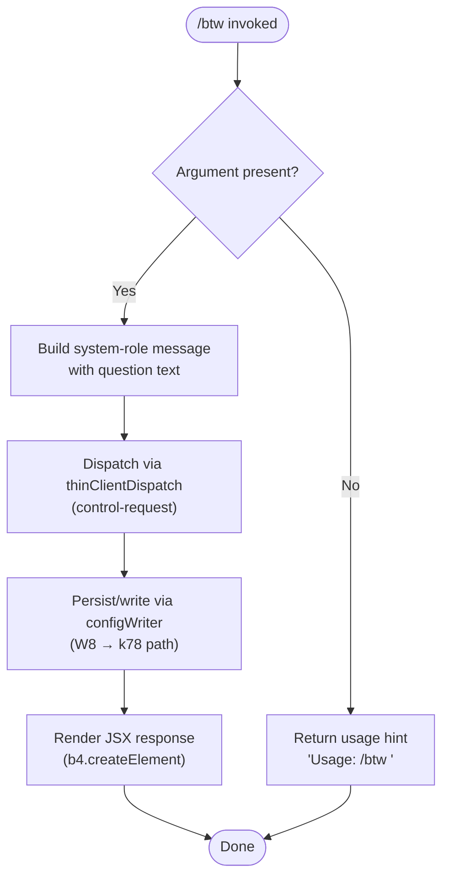

# `/btw`

> Analysis basis: CC v2.1.170 bundle.js (AST extraction + Claude interpretation)
> Minimum version: v2.1.170

---

## Overview

The `/btw` ("by the way") command allows the user to pose a quick, side question to the agent without disrupting the primary conversation flow. It injects the question as a `system`-role message and dispatches immediately via the `control-request` thin-client channel, so the agent can answer the aside without replacing or rolling back the current context.

---

## Registration

| Field | Value |
|---|---|
| type | `local-jsx` |
| name | `btw` |
| description | Ask a quick side question without interrupting the main conversation |
| argumentHint | `<question>` |
| immediate | `true` |
| thinClientDispatch | `control-request` |
| module_id | `kQq` |
| load_inline | `true` |
| loc_byte | `11118645` |
| loc_byte_end | `11118884` |
| loc_line | `7319` |
| arbor_handler.name | `HGf` |
| arbor_handler.fqn | `claude-2.1.170::HGf` |
| arbor_handler.kind | `AsyncFunction` |
| arbor_handler.resolution_path | `module_id` |
| arbor_handler.n_hits | `0` |

Analysis basis: CC v2.1.170 bundle.js:+11118645

---

## Input Branching

The handler has three distinct paths: missing argument (no question supplied), valid question text, and the JSX render path for the response. A Mermaid flowchart is used.



Analysis basis: CC v2.1.170 bundle.js:+11118236, +11118238, +11118277, +11118346

---

## Behavioral Spec

### 1. Argument Validation

When the user invokes `/btw` without providing a question, the handler short-circuits and surfaces the usage hint string `"Usage: /btw <your question>"` (bundle.js:+11118238) without dispatching any message to the agent.

```
async function btwHandler(userInput):
    if userInput is empty or missing:
        return usageHint("Usage: /btw <your question>")
    else:
        proceed to messageBuilder(userInput)
```

Analysis basis: CC v2.1.170 bundle.js:+11118236, +11118238

### 2. Message Construction

When a question is provided, the handler wraps it in a message object with role `"system"` (bundle.js:+11118277). This keeps the aside out of the visible user-turn history while still reaching the agent's context window.

```
function buildSideMessage(questionText):
    return {
        role: "system",
        content: questionText
    }
```

Analysis basis: CC v2.1.170 bundle.js:+11118277

### 3. Immediate Dispatch via Control-Request

Because `immediate: true` and `thinClientDispatch: "control-request"` are set on the registration, the runtime does not wait for any pending agent turn to complete. The handler calls the async function `btwHandlerCore` (bundle identifier: `HGf`) which in turn invokes `configWriterFlow` (bundle identifier: `W8`) to persist any associated state before dispatching.

```
async function btwHandlerCore(context, question):
    sideMessage = buildSideMessage(question)
    await configWriterFlow(context, sideMessage)   // W8
    renderResponse = b4.createElement(...)         // JSX render
    return renderResponse
```

Analysis basis: CC v2.1.170 bundle.js:+11118300, +11118346

### 4. Config Writer Flow (`W8` → `k78`)

`configWriterFlow` (bundle identifier: `W8`) orchestrates the config state needed to support the dispatch. It invokes the file-system config accessor `configFileAccessor` (bundle identifier: `k78`) which performs:

1. Acquires a directory lock via `mkdirSync` (with lock-contention telemetry).
2. Reads and parses the current config JSON with `readFileSync` + JSON parser.
3. Applies timestamp via `Date.now`.
4. Writes the updated config atomically (via `copyFileSync` / `unlinkSync` / `renameSync` pattern using the `configAtomicWriter` helper, bundle identifier: `xO6`).
5. Releases the lock via `statSync` / `unlinkSync`.

```
async function configWriterFlow(context, payload):
    sessionState   = getSessionState()          // ZG
    historyRecord  = buildHistoryRecord()       // K69, QP6
    baseConfig     = configFileAccessor(...)    // k78
    updated        = mergePayload(baseConfig, payload)
    atomicWrite(updated)                        // xO6
    return updated
```

Analysis basis: CC v2.1.170 bundle.js:+3302778, +3302782, +3302853, +3302878, +3305517

Lock-contention warning string: `"Lock acquisition took longer than expected - another Claude instance may be running"` (bundle.js:+3305933).

Auth-loss guard: if the re-read config is missing auth that the cache has, the write is refused with a log message referencing GH #3117 (bundle.js:+3306349, +3302985).

### 5. Random Jitter in Helper `H`

The utility helper (bundle identifier: `H`) called from `btwHandlerCore` uses `Math.random` with a multiplier of `2` (bundle.js:+13939350) and a base of `1` (bundle.js:+13939366) together with `setTimeout` (bundle.js:+13939389). This suggests a short randomised delay (jitter) is applied before or during dispatch, likely to avoid thundering-herd collisions when multiple side-questions arrive simultaneously.

```
function delayWithJitter(callback):
    jitter = Math.floor(Math.random() * 2) + 1   // 1 or 2 ms
    setTimeout(callback, jitter)
```

Analysis basis: CC v2.1.170 bundle.js:+13939350, +13939352, +13939366, +13939389

### 6. JSX Render

After dispatch, `btwHandlerCore` calls `b4.createElement` (bundle.js:+11118346) to produce the JSX node that Claude Code's UI renders as the command's visible output.

```
function renderBtwResponse(agentReply):
    return createElement(BtwResponseComponent, { reply: agentReply })
```

Analysis basis: CC v2.1.170 bundle.js:+11118346

---

## State & Side Effects

| Item | Detail |
|---|---|
| Telemetry — `tengu_config_lock_contention` | Fired when the config directory lock takes longer than expected (bundle.js:+3306022) |
| Telemetry — `tengu_config_stale_write` | Fired when a stale config write is detected (bundle.js:+3306158) |
| Telemetry — `tengu_config_parse_error` | Fired when config JSON cannot be parsed (bundle.js:+3308597) |
| Telemetry — `tengu_config_auth_loss_prevented` | Fired when a write that would wipe auth is blocked (bundle.js:+3306501) |
| Telemetry — `tengu_bg_dispatch_sigkill_escalate` | Fired when background dispatch escalates to SIGKILL (bundle.js:+16529701) |
| Telemetry — `tengu_bg_dispatch_low_mem` | Fired when background dispatch detects low memory (bundle.js:+16530302) |
| Telemetry — `tengu_bg_spare_enable` | Fired when a spare background session is enabled (bundle.js:+16531006) |
| Telemetry — `tengu_bg_spare_claim` | Fired when a spare session is claimed (bundle.js:+16531134) |
| Telemetry — `tengu_bg_spare_claim_fail` | Fired when spare session claim fails (bundle.js:+16531400) |
| Telemetry — `tengu_bg_proto_mismatch` | Fired on background protocol mismatch (bundle.js:+16516539) |
| Telemetry — `tengu_bg_dispatch_stale_drop` | Fired when a stale dispatch is dropped (bundle.js:+16517906) |
| Telemetry — `tengu_bg_attach_legacy_autorespawn` | Fired on legacy auto-respawn during attach (bundle.js:+16520427) |
| Telemetry — `tengu_bg_attach` | Fired on background attach (bundle.js:+16521585) |
| Telemetry — `tengu_bg_attach_stall_gave_up` | Fired when attach stall causes give-up (bundle.js:+16522503) |
| Telemetry — `tengu_bg_attach_stall_respawn` | Fired when attach stall triggers respawn (bundle.js:+16522773) |
| Telemetry — `tengu_bg_attach_kick` | Fired when a background attach is kicked (bundle.js:+16523723) |
| Config file write | Atomically updates the Claude config file (via lock + copy + rename pattern) |
| Dispatch channel | `control-request` thin-client channel; bypasses normal turn queue |
| Message role | Injects a `"system"`-role message into the agent context |
| JSX output | Renders a response component via `b4.createElement` |
| Jitter delay | Applies 1–2 ms randomised delay via `setTimeout` before/during dispatch |

---

## Version History

| Version | Change |
|---|---|
| v2.1.170 | Initial analysis |

---

## Common Mistakes

1. **Omitting the question argument** — `/btw` with no text returns only the usage hint and sends nothing to the agent. Always include a question: `/btw <your question>`.
2. **Expecting turn sequencing** — because `immediate: true` is set, `/btw` does not wait for the current agent turn to finish. A side question may receive an answer that interleaves with an in-progress response.
3. **Treating the reply as user-turn output** — the injected message uses role `"system"`, not `"user"`. Tools that inspect conversation history for user messages will not see it.
4. **Concurrent Claude instances** — if another Claude Code process holds the config lock, `/btw` may log a lock-contention warning and experience a short delay before dispatching.
5. **Auth-sensitive environments** — if the local config cache holds auth that the on-disk config does not, the command will refuse to write and log a GH #3117 warning rather than silently wiping credentials.

---

## Appendix — Identifier Mapping

> For bundle debugging only. Identifiers change across versions.

| Identifier | Role |
|---|---|
| `HGf` | Main async handler for `/btw` (arbor_handler, AsyncFunction) |
| `H` | Jitter-delay utility (uses Math.random + setTimeout) |
| `W8` | Config writer flow orchestrator |
| `k78` | Config file accessor (lock, read, write, atomic swap) |
| `_` | Internal filesystem helper (used by config accessor) |
| `n6` | Path/string normalisation utility |
| `L` | Filesystem module reference (mkdirSync, statSync, etc.) |
| `q` | Secondary filesystem/queue module reference |
| `f` | File handle / stream reference |
| `JE1` | Config field builder (uses Object.assign) |
| `fY_` | Config field sub-builder |
| `N` | Message/content builder (builds agent-facing payload) |
| `PeK` | Content encoding helper |
| `CH` | JSON serialisation wrapper (uses JSON.stringify) |
| `u4` | String/buffer manipulation utility |
| `zFH` | Path resolution helper |
| `EeK` | Buffer/file write helper (uses Buffer.byteLength) |
| `d` | Logging / debug utility |
| `V8` | Error construction / propagation helper |
| `B7H` | Config read+parse worker (readFileSync, JSON.parse) |
| `Q6` | JSON parse wrapper |
| `ku` | String prefix-strip utility (startsWith + slice) |
| `L69` | Directory entry reader helper |
| `CT_` | Path join + backup utility |
| `w` | Background session process manager |
| `liH` | Lock integrity checker |
| `A` | Lowercase normaliser / secondary module |
| `V` | Version/path prefix checker |
| `P` | IPC/pipe frame reader |
| `X` | Socket/stream timeout wrapper |
| `J` | Process kill coordinator |
| `jf` | Stream end/flush helper |
| `tj5` | Daemon message dispatcher (handles all daemon message types) |
| `EH` | String coercion utility |
| `E` | Array slice / bounds helper |
| `G` | SDK connection manager |
| `xO6` | Atomic config file writer (randomBytes + rename + fchmod) |
| `O` | Symbolic-link / stream object |
| `k8` | Error code mapper |
| `ZJH` | Session state initialiser |
| `K69` | Config entries iterator (Object.entries) |
| `QP6` | Timestamp recorder (Date.now) |
| `I78` | Config write-path finaliser |

---

Note: index built via Arbor fallback; some signals (telemetry, literals) may be missing — see arbor-fallback.js.