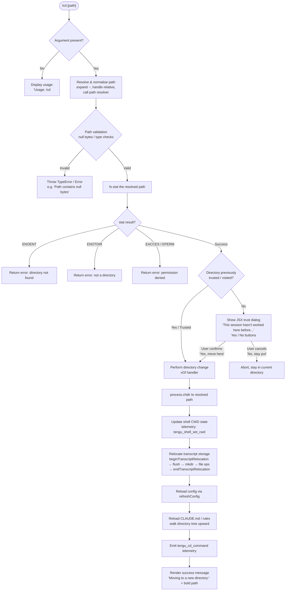

# `/cd`

> Analysis basis: CC v2.1.170 bundle.js (AST extraction + Claude interpretation)
> Minimum version: v2.1.170

---

## Overview

The `/cd` command moves the current Claude Code session to a new working directory specified by `<path>`. It validates and resolves the target path, optionally presents a security trust prompt for directories not previously visited, and then performs the directory change — updating the process working directory, reloading configuration, and relocating the session transcript storage accordingly.

---

## Registration

| Field | Value |
|---|---|
| type | `local-jsx` |
| name | `cd` |
| description | Move this session to a new working directory |
| argumentHint | `<path>` |
| module_id | `Adq` |
| load_inline | `true` |
| loc_byte | `11150923` |
| loc_byte_end | `11151083` |
| loc_line | `7340` |
| arbor_handler.name | `IGf` |
| arbor_handler.fqn | `claude-2.1.170::IGf` |
| arbor_handler.kind | `AsyncFunction` |
| arbor_handler.resolution_path | `module_id` |
| arbor_handler.n_hits | `0` |

Analysis basis: CC v2.1.170 bundle.js:+11150923

---

## Input Branching

The command has 5+ distinct branches (no argument / bad path / stat error codes / trust check / success), so a Mermaid flowchart is used.



Analysis basis: CC v2.1.170 bundle.js:+11149371 (usage string), +11149462 (stat call), +11149674–11149717 (error codes), +11147965 (process.chdir), +11148283 (telemetry emit)

---

## Behavioral Spec

### 1. Argument Parsing and Path Resolution

The handler (`IGf`) begins by checking whether the user supplied an argument after `/cd`.

```
async function cdCommandHandler(rawArg, appContext):
    if rawArg is empty or missing:
        display "Usage: /cd <path>"
        return

    resolvedPath = normalisePath(rawArg)
    # normalisePath (y1):
    #   - Rejects strings containing null bytes → "Path contains null bytes"
    #   - Expands leading "~/" using os.homedir()
    #   - Normalises to NFC Unicode form
    #   - On Windows: also expands "~\\"
    #   - Resolves relative paths against process.cwd()
    #   - Calls path.resolve() for absolute finalisation
```

Analysis basis: CC v2.1.170 bundle.js:+1057012 (null bytes error), +1057109 (homedir), +180108 (NFC), +1057140 ("~/"), +1057269 (isAbsolute)

---

### 2. Filesystem Validation

```
async function validateTargetDirectory(resolvedPath):
    try:
        stat = await fs.stat(resolvedPath)
    catch err:
        switch err.code:
            case "ENOENT"  → return error "directory not found"
            case "ENOTDIR" → return error "path is not a directory"
            case "EACCES"  → return error "permission denied"
            case "EPERM"   → return error "operation not permitted"
        return error (generic)
    return stat  # success
```

Analysis basis: CC v2.1.170 bundle.js:+11149462 (stat call), +11149674 (ENOENT), +11149688 (ENOTDIR), +11149703 (EACCES), +11149717 (EPERM)

---

### 3. Trust / Security Dialog

When the resolved directory has not been visited in this session before, a JSX dialog is rendered asking the user to confirm trust.

```
function renderTrustDialog(targetPath, onConfirm, onCancel):
    display warning panel:
        title: "Claude Code"
        body:  "This session hasn't worked here before. Is this a directory you created or one you trust?"
               "...will be able to read, edit, and execute files here."
        link:  "Security guide" → "https://code.claude.com/docs/en/security"
        button primary:   "Yes, move here"  → onConfirm()
        button secondary: "No, stay put"    → onCancel()
        keyboard:
            "enter" / "confirm" → onConfirm()
            "escape" / "cancel" → onCancel()
```

Analysis basis: CC v2.1.170 bundle.js:+11146492 (dialog text), +11146625 (title), +11146861 (URL), +11147015 ("Yes, move here"), +11147044 ("No, stay put"), +11147284 (enter key), +11147346 (escape key)

---

### 4. Directory Change Execution (`vGf`)

Once trust is established (or directory was already trusted), the actual directory change is performed.

```
async function executeDirectoryChange(resolvedPath, appContext):
    # 1. Call process.chdir(resolvedPath)
    process.chdir(resolvedPath)

    # 2. Update internal shell CWD state (rz → RA_ → uZ → Nf6)
    #    Normalises path and emits an internal CWD-changed event
    #    Telemetry: tengu_shell_set_cwd

    # 3. Relocate transcript storage (fKA)
    transcriptWriter.beginTranscriptRelocation()
    newTranscriptDir = path.join(newBase, "cd")   # literal "cd" key
    await fs.mkdir(newTranscriptDir, { mode: 0o700 })   # 448 decimal
    await moveTranscriptFiles(oldDir, newTranscriptDir)  # rename/copy with EEXIST/EBUSY/EXDEV handling
    transcriptWriter.flush()
    transcriptWriter.endTranscriptRelocation()

    # 4. Reload configuration
    configManager.refreshConfig()

    # 5. Update allowed-directory set (VGf)
    allowedDirs.add(resolvedPath)
    walk directory tree upward from resolvedPath:
        parse each path component
        collect CLAUDE.md / CLAUDE.local.md / .claude/rules files (lG6 → vXH → gG6)

    # 6. Refresh MCP connections (M → IPA → aSH / Ic8)
    #    Re-evaluates server configs against new working directory

    # 7. Emit telemetry
    emit tengu_cd_command

    # 8. Render success
    display bold("Moving to a new directory:") + formatted path
```

Analysis basis: CC v2.1.170 bundle.js:+11147965 (process.chdir), +6903842 (tengu_shell_set_cwd), +13369293 (beginTranscriptRelocation), +13369395 (moveTranscriptFiles), +13369218 (literal "cd"), +13369379 (mode 448 = 0o700), +11148262 (refreshConfig), +11147758 (VGf/allowedDirs), +11148283 (tengu_cd_command), +11147497 ("Moving to a new directory:")

---

### 5. Transcript File Relocation (`SwK` / `rwK`)

The transcript move handles several OS-level error cases:

```
async function moveTranscriptFiles(sourceDir, destDir):
    try:
        await fs.rename(sourceDir, destDir)
    catch err:
        switch err.code:
            case "EEXIST", "EBUSY", "ENOTEMPTY":
                # dest exists or busy → fall through to copy
            case "EXDEV":
                # cross-device move → must copy
            case "EISDIR", "ENOTSUP":
                # unsupported → copy fallback
        # fallback: recursive copy then remove
        await recursiveCopy(sourceDir, destDir)
        await fs.rm(sourceDir, { recursive: true })
```

Analysis basis: CC v2.1.170 bundle.js:+13369674 (rename), +13369724 (EEXIST), +13369751 (EBUSY), +13369764 (ENOTEMPTY), +13369865 (EXDEV), +13369929 (EISDIR), +13369943 (ENOTSUP), +13369783 (rm), +13369884 (copyFile)

---

### 6. CLAUDE.md / Rules Discovery (`lG6` → `vXH` → `gG6`)

After changing directory, the rules loader re-walks the directory hierarchy:

```
function discoverProjectRules(newWorkingDir):
    for each ancestor directory up to filesystem root:
        probe path.join(dir, "CLAUDE.md")          # "Project" instructions
        probe path.join(dir, ".claude/CLAUDE.md")
        probe path.join(dir, "CLAUDE.local.md")    # "Local" instructions
        probe path.join(dir, ".claude/rules")
    return collected rule file paths
```

Analysis basis: CC v2.1.170 bundle.js:+4982397 ("CLAUDE.md"), +4982464 (".claude"), +4982565 ("CLAUDE.local.md"), +4982646 ("rules"), +4982431 ("Project"), +4982605 ("Local")

---

### 7. Stale-Context System Message

After the directory change, a system-level message is injected into the conversation indicating that prior file references may be stale:

```
inject system message containing:
    "...previous directory — that information is stale. All tool calls and ..."
    (followed by guidance about the new working directory context)
```

Analysis basis: CC v2.1.170 bundle.js:+11148477 (stale-context fragment), +11150261 ("system" message type)

---

## State & Side Effects

| Item | Detail |
|---|---|
| Telemetry: tengu_cd_command | Fired on successful directory change (bundle.js:+11148283) |
| Telemetry: tengu_shell_set_cwd | Fired when internal shell CWD state is updated (bundle.js:+6903842) |
| Telemetry: tengu_disable_bypass_permissions_mode | Fired if bypass-permissions mode is disabled due to new directory (bundle.js:+4247357) |
| Telemetry: tengu_claude_rules_md_permission_error | Fired if CLAUDE.md file cannot be read due to permissions (bundle.js:+4981575) |
| Telemetry: tengu_config_lock_contention | Fired if config lock is slow to acquire (bundle.js:+3306022) |
| Telemetry: tengu_config_stale_write | Fired if config write would overwrite with stale data (bundle.js:+3306158) |
| Telemetry: tengu_config_parse_error | Fired on config JSON parse failure (bundle.js:+3308597) |
| Telemetry: tengu_config_auth_loss_prevented | Fired if auth loss in config write is prevented (bundle.js:+3306501) |
| Telemetry: tengu_paper_halyard | Fired during CLAUDE.md tree scan (bundle.js:+4984313) |
| process.chdir | Called with resolved absolute path; changes the Node.js process CWD (bundle.js:+11147965) |
| Transcript relocation | Session transcript files are physically moved/copied to a subdirectory keyed `"cd"` under the new base path (bundle.js:+13369218) |
| Config reload | `refreshConfig()` is called after the move; re-reads `~/.claude.json` and project-level config (bundle.js:+11148262) |
| Allowed-directory set | The new directory is added to the session's allowed-directory set; tree walk extends the set upward (bundle.js:+11147763) |
| MCP server reconnection | MCP connections are re-evaluated against the new working directory (bundle.js:+16200261) |
| System message injection | A `"system"` role message is injected into conversation history marking prior directory context as stale (bundle.js:+11150261) |
| JSX trust dialog | Rendered inline for first-visit directories; blocks execution until user responds (bundle.js:+11146492) |
| bypass-permissions mode | May be automatically disabled when moving to a new directory not previously trusted (bundle.js:+4247357) |

---

## Version History

| Version | Change |
|---|---|
| v2.1.170 | Initial analysis |

---

## Common Mistakes

1. **Omitting the path argument** — `/cd` with no argument displays `Usage: /cd <path>` and does nothing. Always supply a path: `/cd ~/projects/foo`.
2. **Using a file path instead of a directory** — The command calls `fs.stat()` and will return an `ENOTDIR` error if the argument resolves to a file rather than a directory.
3. **Expecting instant MCP reconnection** — After `/cd`, MCP servers are re-evaluated and may undergo reconnect delays; tool availability may briefly change.
4. **Assuming transcript continuity** — The transcript storage is relocated; if the new directory is on a different filesystem volume, a recursive copy is performed, which may take time for large histories.
5. **Not expecting a trust prompt** — The first time `/cd` targets a directory that has not been visited in this session, a confirmation dialog appears. Scripted or rapid invocations should account for this interactive pause.
6. **Believing prior file paths remain valid** — A `"system"` message is injected reminding the model that all prior tool-call results referencing the old directory are now stale.

---

## Appendix — Identifier Mapping

> For bundle debugging only. Identifiers change across versions.

| Identifier | Role |
|---|---|
| `IGf` | Main `/cd` command handler (AsyncFunction, Arbor-resolved) |
| `H` | Generic async delay / jitter utility (uses Math.random + setTimeout) |
| `y1` | Path normalisation and validation function |
| `C6` | AsyncLocalStorage context reader |
| `oi6` | Store retrieval helper (calls ri6.getStore) |
| `Id` | Store value accessor |
| `W_` | Process CWD getter (calls xZ) |
| `xZ` | Raw process.cwd() wrapper |
| `n6` | Logging / debug emitter |
| `A` | String lowercasing wrapper (f.toLowerCase) |
| `f` | Stream/handle with close methods |
| `q` | EventEmitter or stream (Y1 constructor) |
| `L` | Promise tracking set manager (q.add/delete/finally) |
| `RO` | Path normalise-to-NFC helper |
| `V8` | Error construction / throw helper |
| `eQq` | Permission/allow-list check orchestrator |
| `$1` | Base path constant or config accessor |
| `$v` | Allowed-path set builder with symlink resolution |
| `_` | Path string under manipulation |
| `q5` | Synchronous try-catch wrapper |
| `KD` | Error-category classifier |
| `M` | MCP manager / connection map |
| `aSH` | MCP server connection initialiser |
| `Ic8` | MCP connection result applicator |
| `N` | Shell/platform name resolver |
| `$` | MCP client capability reader (f$K) |
| `IPA` | MCP configuration iterator and reconnector |
| `K4H` | Symlink-chain resolver (iterative readlink) |
| `D` | Process exit / abort handler |
| `r3` | Realpath sync wrapper |
| `Lb8` | Path prefix checker / stripper |
| `EGf` | Directory completion / allow-pattern matcher |
| `KKA` | Glob-to-regex pattern compiler |
| `K` | Column formatter (padEnd) |
| `Csf` | Working-directory + config-state combiner |
| `dC6` | Relative-path resolver helper |
| `ZGf` | Allow-list result finaliser |
| `XQ` | Permission deny-rule scanner |
| `G3` | Rule string formatter |
| `$S4` | Rule source accessor |
| `rT` | Object.hasOwn wrapper |
| `OS4` | Rule description extractor |
| `MS4` | Regex escape / replacement helper |
| `a3H` | Allowed-pattern list builder |
| `Pgq` | Pattern list initialiser |
| `rbH` | Shell command cache reader/writer |
| `ny6` | Shell command classifier (iy6) |
| `ry6` | Shell command token scanner |
| `Ss_` | Shell command validity checker (rT) |
| `x_` | App-state settings reader (working_directory, allowed_tools, etc.) |
| `NR8` | allowed_tools state extractor |
| `IR8` | disallowed_tools state extractor |
| `Xb` | Permission-mode evaluator |
| `Y6` | Bypass-permissions mode gate |
| `uP6` | Permission mode accessor |
| `mP6` | Permission mode validator |
| `Lm` | Permission mode state machine (nu) |
| `D78` | Bypass-permissions toggle with dedup set |
| `h6` | React state hook for dialog visibility |
| `NGf` | Success / confirmation message renderer |
| `Q5` | Path display formatter (fS4) |
| `fS4` | Path string escape helper (replaceAll) |
| `vGH` | Auto-mode UI renderer (IFA) |
| `IFA` | Plan/auto mode display component |
| `vGf` | Core directory-change executor |
| `rz` | Shell CWD setter (IX8 path ops + RA_ store update) |
| `k8` | Error-safe stat/access wrapper |
| `RA_` | AsyncLocalStorage store CWD updater |
| `z6H` | CWD store write helper (Nf6) |
| `d` | Generic error logger / telemetry dispatcher |
| `uZ` | Path normalise + event emitter (Nf6 + Tn8.emit) |
| `Nf6` | Canonical path normaliser (H.normalize) |
| `fKA` | Transcript relocation coordinator |
| `v6` | Transcript writer accessor (xZ) |
| `e4` | File-system registration entry (N9 → LTA.register) |
| `N9` | LTA register wrapper |
| `i$H` | Environment mode reader (_6 → QwK/qu) |
| `_6` | String coercion helper |
| `QwK` | Environment key mapper |
| `qu` | Environment value reader |
| `gJ` | Event emitter facade (oGA/rGA) |
| `oGA` | Pre-emit hook |
| `rGA` | Actual event emit (SF6.emit) |
| `SwK` | Transcript file move with error-code fallback |
| `rwK` | Recursive directory copy helper |
| `hH` | Config writer with lock and retry |
| `jA` | Error/string coercer for config writes |
| `hq` | Essential-traffic queue processor (ImA) |
| `lN4` | Write-queue shift/push manager |
| `r0` | Post-cd state reset helper |
| `VGf` | Allowed-directory updater and CLAUDE.md re-scanner |
| `v2` | Path normalise-and-replace utility |
| `lG6` | CLAUDE.md / rules discovery orchestrator |
| `xO` | File existence probe (Ev) |
| `bm` | CLAUDE.md file content loader with realpath |
| `vXH` | Recursive directory scanner for rule files |
| `gG6` | Git-root and rule-path relative resolver |
| `cG6` | Memory / AutoMem instruction collector |
| `FC8` | HTML-entity escaper (replaceAll for &amp; &lt; &gt; etc.) |
| `t0` | Final render dispatch |
| `VJH` | Directory trust record updater (h6 + $w.resolve) |
| `fc` | Path.normalize wrapper (FI.normalize) |
| `gP6` | Global config saver (W8) |
| `W8` | Config file write-with-lock orchestrator |
| `k78` | Config write core (statSync, lock, backup, copy) |
| `JE1` | Config merge helper (fY_ + Object.assign) |
| `B7H` | Config read-from-disk helper (readFileSync) |
| `liH` | Config backup manager |
| `CH` | JSON.stringify wrapper |
| `CT_` | Config backup path builder ($w.join + H_) |
| `V` | Buffer/string split helper |
| `P` | Stream reader with timeout and buffer concat |
| `E` | Slice with Math.max/min bounds |
| `xO6` | Atomic file write helper (open/write/fsync/rename with random temp name) |
| `ZJH` | Config schema validator |
| `K69` | Config section iterator (Object.entries) |
| `QP6` | Config timestamp recorder (Date.now) |
| `I78` | Config incremental writer (xO6) |
| `_dq` | React memo-cache sentinel initialiser |