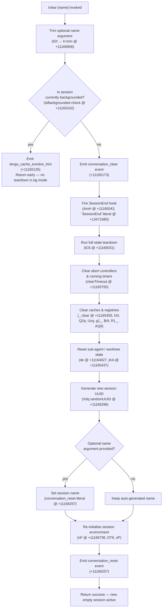

# `/clear`

> Analysis basis: CC v2.1.170 bundle.js (AST extraction + Claude interpretation)
> Minimum version: v2.1.170

---

## Overview

`/clear` starts a fresh Claude Code session with an empty conversation context while preserving the previous session on disk so it can be resumed later with `/resume`. It is also reachable via the aliases `/reset` and `/new`. The command tears down all in-flight state (abort controllers, timers, cache, sub-agent registries) and re-initialises the session environment with a new unique session ID.

---

## Registration

| Field | Value |
|---|---|
| type | `local` |
| name | `clear` |
| description | Start a new session with empty context; previous session stays on disk (resumable with /resume) |
| argumentHint | `[name]` |
| supportsNonInteractive | `true` |
| thinClientDispatch | `post-text` |
| aliases | `reset`, `new` |
| module_id | `Gdq` |
| load_inline | `true` |
| loc_byte | `11167130` |
| loc_byte_end | `11167421` |
| loc_line | `7342` |
| arbor_handler.name | `lGf` |
| arbor_handler.fqn | `claude-2.1.170::lGf` |
| arbor_handler.kind | `AsyncFunction` |
| arbor_handler.resolution_path | `module_id` |
| arbor_handler.n_hits | `0` |

Analysis basis: CC v2.1.170 bundle.js:+11167130

---

## Input Branching

Five or more distinct execution paths exist depending on session name, backgrounded state, and optional flags. A Mermaid flowchart is required.



---

## Behavioral Spec

### Handler Entry Point — `clearCommandHandler` (`lGf`)

Analysis basis: CC v2.1.170 bundle.js:+11166956

```
async function clearCommandHandler(userInput, appContext):
    rawName = userInput.trim()          // H.trim @ +11166956
    name    = rawName if rawName else undefined

    if appContext.isBackgrounded:       // literal "isBackgrounded" @ +11165242
        emit telemetry("tengu_cache_eviction_hint")  // +11165135
        return                          // no-op in headless/background mode

    await performSessionClear(name, appContext)  // tC6 @ +11165031
```

### Session Teardown — `performSessionClear` (`tC6`)

Analysis basis: CC v2.1.170 bundle.js:+11165031

```
async function performSessionClear(name, ctx):
    // 1. Notify hooks of session ending
    await dispatchSessionEndHook(ctx)          // AmH @ +11165043 — "SessionEnd" @ +13471080

    // 2. Abort in-flight requests
    signal = AbortSignal.timeout(...)          // AbortSignal.timeout @ +11165091
    cancelBackground(ctx, signal)              // Cf6 @ +11165122

    // 3. Drain pending tasks / timers
    for task in Object.values(activeTasks):    // +11165305
        task.finish()                          // L @ +11165319
    kill background processes                  // w @ +11165334

    // 4. Emit terminal state markers
    emitSessionMarker("running")               // literal "running" @ +11165663
    emitAbortControllerRef("abortController")  // literal "abortController" @ +11165791

    // 5. Flush pending log sinks
    flushLogSinks(ctx)                         // Tz @ +11165856

    // 6. Reset all in-memory caches
    clearConversationHistory()                 // _.clear @ +11165455
    clearSessionRegistries()                   // hO @ kF6.clear/Jn8.clear
    clearSkillIndexCache()                     // xW9 @ +11164008 → lF.clear @ +5047930
    clearPluginCaches()                        // Q2q, Uzq, g1_, $r9, R1_, AQ9
    clearAgentState()                          // de @ +11164027

    // 7. Perform full cache sweep
    sweepCacheRegistries()                     // jKA @ +11165437

    // 8. Set working directory for new session
    resolveNewCwd(ctx)                         // rz @ +11165446

    // 9. Rebuild session environment
    newSessionId = crypto.randomUUID()         // Xdq.randomUUID @ +11166296
    initNewSession(newSessionId, name, ctx)    // nF @ +11166736

    // 10. Announce new session
    emitEvent("conversation_reset", ctx)       // literal @ +11166257
    broadcastSessionStart()                    // Wn8 @ +11166314
```

### Hook Dispatch — `dispatchSessionEndHook` (`AmH`)

Analysis basis: CC v2.1.170 bundle.js:+13471053

```
async function dispatchSessionEndHook(ctx):
    payload = buildHookPayload("SessionEnd", ctx)   // A7 @ +13471053
    result  = await runHookPipeline(payload, ctx)   // MG @ +13471111
    applyHookResult(result, ctx)
    announceHookCompletion(ctx)                     // ebH @ +13471313
```

The hook event name `"SessionEnd"` is a string literal at bundle.js:+13471080.

### Cache Registry Sweep — `sweepAllCaches` (`jKA`)

Analysis basis: CC v2.1.170 bundle.js:+11163991

```
function sweepAllCaches():
    clearSettingsCache()          // zKA @ +11163991
    clearSkillIndex()             // XV  @ +11164000  → Yp.clearSkillIndexCache
    clearPluginWorkspace()        // xW9 @ +11164008
    clearSubagentTable()          // O56 @ +11164017
    clearCompletionCache()        // de  @ +11164027
    clearInputHistory()           // IS  @ +11164040
    clearKnowledgeGraph()         // QG6 @ +11164045
    clearHookRegistrations()      // Q2q @ +11164290
    clearProcessRegistries()      // Uzq @ +11164299
    clearUIComponentCache()       // g1_ @ +11164308
    clearQueryCache()             // qgq @ +11164314
    clearEventBusCache()          // $r9 @ +11164323
    clearFileWatchRegistry()      // Dr8 @ +11164329
    clearHistoryTokenCache()      // R1_ @ +11164336
    clearModelContextCache()      // MCq @ +11164342
    clearPromptCache()            // AQ9 @ +11164348
    emitSessionReset()            // Ns_ @ +11164384
```

### Terminal Width Calculation (used during re-render after clear) — `computeTerminalWidth` (`Hb6`)

Analysis basis: CC v2.1.170 bundle.js:+13480561

```
function computeTerminalWidth():
    raw    = parseInt(process.env.COLUMNS, 10)   // Hb6 @ +13480561, radix 10 @ +13480572
    if not Number.isFinite(raw):                 // +13480583
        raw = defaultWidth()                     // DJ @ +13480626
    bounded = Math.max(Math.min(raw, 1000), 0)   // literals @ +13480748, +11166971
    return bounded
```

Maximum accepted column value: 1000 characters (bundle.js:+13480748).
Minimum accepted column value: 0 (bundle.js:+11166971).

---

## State & Side Effects

| Item | Detail |
|---|---|
| Telemetry | `tengu_cache_eviction_hint` (emitted when session is backgrounded, +11165135); `tengu_run_hook` (+13520497); `tengu_repl_hook_finished` (+13504265); `tengu_session_renamed` (+13383633); `tengu_hook_plugin_metrics` (+13498792); `tengu_feature_ok` / `tengu_feature_bad` (+1014205, +1014267) |
| Hook registration | Fires `SessionEnd` lifecycle hook before teardown (AmH @ +13471080); calls hook pipeline `MG` which may invoke spawn, HTTP, MCP, and callback hook types |
| appState changes | Clears conversation history (`_.clear` @ +11165455); resets all in-memory caches via `jKA`; assigns a new session UUID via `Xdq.randomUUID` @ +11166296; emits `conversation_reset` event @ +11166257 |
| Background session guard | When `isBackgrounded === true` (literal @ +11165242), the command emits only the eviction hint telemetry and returns immediately — no teardown occurs |
| Previous session persistence | The previous session transcript is written to disk before teardown (handled by hook pipeline flush and `hH` log writer); `/resume` can restore it |
| Working directory | `rz` (@ +11165446) resolves and sets the CWD for the new session using `IX8.isAbsolute` / `IX8.resolve` |
| Sound | <!-- TODO: not found in depth-2 traversal; needs --depth 4 --> |

---

## Version History

| Version | Change |
|---|---|
| v2.1.170 | Initial analysis |

---

## Common Mistakes

1. **Expecting `/clear` to delete history**: The command only resets the in-memory context. The previous session remains on disk and is fully resumable via `/resume`.
2. **Using `/clear` in non-interactive (backgrounded) mode**: When the session is backgrounded (`isBackgrounded === true`), the command is a no-op except for telemetry — no state is torn down.
3. **Assuming the name argument is required**: The `[name]` argument is optional. Omitting it leaves the new session with an auto-generated identifier.
4. **Confusing `/clear` with `/reset` or `/new`**: All three names invoke the identical handler (`lGf`); they are registered aliases, not separate commands.
5. **Triggering `/clear` mid-tool-use**: The teardown aborts all in-flight tool calls via `AbortSignal.timeout` and sends SIGKILL to managed child processes. Any work in progress is lost.

---

## Appendix — Identifier Mapping

> For bundle debugging only. Identifiers change across versions.

| Identifier | Role |
|---|---|
| `lGf` | Main handler for `/clear` (clearCommandHandler) — AsyncFunction resolved via module_id `Gdq` |
| `tC6` | Session teardown orchestrator (performSessionClear) |
| `Hb6` | Terminal width calculator |
| `DJ` | Default terminal width provider |
| `xK` | Terminal capability reader |
| `S_H` | Policy settings accessor |
| `cU` | State accessor (xZ-backed) |
| `KF` | Hook-registration reset coordinator |
| `aT_` | Hook registry cache (u69 Map read/write) |
| `hO` | Dual-cache clearer (kF6, Jn8) |
| `sT_` | State transition helper |
| `AmH` | Session-end hook dispatcher |
| `A7` | Hook payload builder |
| `v6` | Base state accessor |
| `kI` | Secondary state accessor |
| `IP` | Model capability checker (claude-* model list) |
| `xv` | Effort-level resolver ("high" default) |
| `eN` | Message path builder |
| `C6` | Command context builder |
| `MG` | Hook pipeline runner |
| `eC` | Policy state reader (y8-backed) |
| `N` | Log-level classifier ("debug"/"verbose"/etc.) |
| `s$H` | Hook execution wrapper (WJH) |
| `YYA` | Hook descriptor resolver (PreToolUse/PostToolUse/etc.) |
| `O` | Generic collection operator (S8-backed) |
| `WjK` | Hook watch-path handler |
| `zYA` | Third-party hook filter |
| `EjK` | Hook execution entry |
| `d` | Core state store |
| `CH` | JSON serialiser wrapper |
| `hH` | Log writer (jA/_6/hq/lN4) |
| `xH` | Feature flag OK reporter (d/K6) |
| `mVH` | Feature flag BAD reporter (ui6) |
| `hN` | Abort controller manager |
| `j` | Callback dispatcher |
| `I1H` | Hook injection tracker |
| `yN` | Hook output normaliser |
| `sB8` | Hook result aggregator |
| `fYA` | Function hook runner |
| `HF8` | Hook output JSON parser |
| `jqH` | Hook entry transformer (Object.entries/fromEntries) |
| `LYA` | HTTP hook executor (W2.post) |
| `PjK` | HTTP hook response parser |
| `h$H` | Hook metadata collector |
| `_F8` | Spawn-hook executor (tB8.spawn) |
| `qRH` | Hook result reducer |
| `SH` | State OK reporter (d/K6) |
| `RF` | Telemetry rate-limited emitter (PoL.emit) |
| `ebH` | Session-end completion announcer |
| `Cf6` | Background cancellation trigger |
| `f6` | Async task wrapper (ff6) |
| `ff6` | Task primitive |
| `L` | Active task set manager (q.add/q.delete/q.finally) |
| `q` | Task queue (Y1-backed) |
| `Y1` | CLI error handler (JpH/aj/process.exit) |
| `f` | Session object (A.close/q.close) |
| `A` | Connection map |
| `w` | Background process kill manager |
| `b` | Worker/subprocess orchestrator |
| `IhH` | Session transcript reader (_.readFile) |
| `Y` | Supervisor write channel |
| `Xa` | Session serialiser (hLH) |
| `HsH` | Session file writer (bz8.writeFile) |
| `mX9` | Outdated-entry filter |
| `P` | Stream buffer (Buffer.concat) |
| `z` | Daemon control router (SH/xH/ih/ZU) |
| `S` | Supervisor read loop |
| `X` | Socket timeout manager |
| `c` | Worker pool (kb6/piq) |
| `FpK` | Column formatter |
| `FAH` | Session file aggregator (IhH/HsH) |
| `o8` | Sub-process spawner with timeout |
| `K` | Column padder (L.map/f.padEnd) |
| `dU8` | Memory usage sampler |
| `Y6` | Cache pin manager |
| `oW6` | Session-pins file reader |
| `Kk_` | Pins path builder (Dj.join) |
| `Q6` | Safe JSON parser (JSON.parse) |
| `k8` | ENOENT guard (V8) |
| `crL` | Directory-based session reader |
| `Q` | Retirement-policy store (lH6/LQ) |
| `lH6` | Iron-gate concurrency guard |
| `LQ` | Permission rule evaluator (allow/deny/ask/classify) |
| `W2A` | Background session claimer (nQ.claim) |
| `cYA` | Session state writer (iQ.writeFile) |
| `dj5` | Claim timeout handler |
| `Qj5` | Claim frame builder (nQ.buildClaimFrame) |
| `Qf` | V8 version guard |
| `EH` | String coercer |
| `dV` | Binary frame serialiser (Buffer.allocUnsafe) |
| `v2A` | Session lifecycle manager (spawn/retire/roster) |
| `sK` | Session path builder (Dj.join/VE) |
| `Wq` | Session state file reader/writer (xfH Map) |
| `MO` | Active-state marker setter |
| `hjH` | Tool name classifier |
| `Sf` | Session roster entry formatter |
| `$K6` | Claim promise handler |
| `xb6` | Session base path joiner (j$.join/Cb6) |
| `z$H` | Session metadata path builder |
| `qZ` | Session path splitter |
| `VQ` | Session variant path builder (B4A/fK6) |
| `bb6` | Session directory creator (j$.join/Cb6) |
| `D` | Forced-shutdown handler (process.exit/z.abort) |
| `Qj` | Shutdown sequencer |
| `V8` | ENOENT string constant holder |
| `K6` | Task primitive (ff6) |
| `tP` | Task pinning helper |
| `NJ` | Session notification dispatcher |
| `jKA` | Full cache sweep coordinator |
| `zKA` | Settings cache clearer |
| `XV` | Skill index + worktree initialiser |
| `Yp` | Skill index cache clearer (H.clearSkillIndexCache) |
| `OC8` | Worktree option reader |
| `CUq` | Worktree state checker |
| `WuH` | Model-context cache warmer (PR6) |
| `xW9` | Plugin workspace cache clearer (lF.clear) |
| `lhH` | Plugin workspace writer (DY8.writeFile) |
| `O56` | Sub-agent table clearer |
| `de` | Agent-state reset orchestrator |
| `uNH` | Main-agent context clearer (lu) |
| `hS8` | Sub-agent state clearer (sp Map) |
| `QG6` | Knowledge-graph session starter (nG) |
| `$56` | Compact-state clearer |
| `z56` | Completion-cache clearer (xZ/$6H) |
| `VS8` | Vx query cache clearer (Vxq.clear) |
| `oU9` | Module-level cache clearer (MZ6/_p_) |
| `ozq` | Autonomous-loop state resetter |
| `CWH` | Context-window helper resetter |
| `QD` | Token-output accounting clearer (TBH) |
| `XAA` | Extension-state resetter |
| `IS` | AC8 cache clearer |
| `Q2q` | Hook registration cache clearer (KxH/$t_) |
| `Uzq` | Process registry clearer (s_6/nk6) |
| `g1_` | UI component cache clearer (vQH) |
| `qgq` | Query cache clearer |
| `$r9` | Event-bus cache clearer (PP8) |
| `Dr8` | File-watch registry checker (H.has) |
| `R1_` | History-token cache clearer (VQH) |
| `MCq` | Model-context cache coordinator (PR6) |
| `PR6` | Model context store accessor (AS8.get/jR6) |
| `AQ9` | Prompt-cache clearer (xt/cPH) |
| `rz` | CWD resolver (IX8.isAbsolute/IX8.resolve) |
| `n6` | File-system stat helper |
| `RA_` | AsyncLocalStorage CWD reader (ri6.getStore) |
| `RO` | Path normaliser (H.normalize NFC) |
| `z6H` | Path validator (Nf6) |
| `W_` | State writer (xZ) |
| `phH` | Pending-hook flusher |
| `tG` | Task-group waiter |
| `Tz` | Log-sink flusher (pB8 Map) |
| `BB8` | Async-log set manager (EJK.add/delete) |
| `zH6` | Zone/scope clearer (pl9) |
| `Wdq` | Watch-path dispatcher (OzH) |
| `O$` | Tool-output state clearer (v6/e4) |
| `e4` | Event emitter helper |
| `N9` | Async-local-storage registration (LTA.register) |
| `Vy` | Message-history accessor |
| `bM` | System-prompt builder (tR/p$/W_) |
| `tR` | System-prompt store accessor (xZ) |
| `eC6` | Error-context event emitter (e4) |
| `Wn8` | Session-start broadcaster (pKH.randomUUID/oGA/rGA) |
| `oGA` | Session-start notifier |
| `rGA` | Session-start event emitter (SF6.emit) |
| `Mr` | Tool-result emitter (e4) |
| `XR` | Session-rename handler (eN/a$H/v6/e4/hm6.emit) |
| `a$H` | Append-file log writer (A.appendFileSync) |
| `fuH` | Worktree symlink manager (CHH.symlink/CHH.unlink) |
| `ezA` | Worktree directory creator (CHH.mkdir) |
| `_H6` | Worktree path helper (szA.join/YL6) |
| `$$` | Worktree path formatter (szA.join/_H6) |
| `rA6` | Worktree open handler (CHH.open) |
| `PV` | Sub-agent session path builder (BXH.join/PC_.get) |
| `q3` | Queue drainer |
| `b_` | Module bootstrap (tEH/dl8/gB6/QB6) |
| `QB6` | Bootstrap binder |
| `G` | SDK transport manager (V76/CS/vN/nn/tF) |
| `V76` | SSE transport handler |
| `jA` | Error string normaliser |
| `T` | Transport status handler (BZ6/V76) |
| `BZ6` | Transport close handler |
| `uM` | Session-mode setter |
| `lp` | Log-path emitter (e4/DR8.emit/a$H) |
| `EqH` | Isolation-latch emitter (e4/HJK) |
| `HJK` | Append-log writer (pK.appendFile/pK.mkdir) |
| `nF` | Full session reinitialiser (K4/DJ/xK/aa/N/ZQH/J5H/DT6/kI/M/XV/IS) |
| `K4` | Settings loader (xK/a7) |
| `a7` | Settings parser (_6/Yg6) |
| `aa` | Policy-entry accumulator (y8/Object.entries) |
| `y8` | Policy state reader (Ro6/XB) |
| `ZQH` | Log-rotation helper (Date.now/C8) |
| `C8` | File-append log writer (L.appendFileSync) |
| `J5H` | Plugin hook registration gate (xK/N/oW9) |
| `DT6` | Agent orchestrator re-entry (A7/O$/ED/sP) |
| `ED` | Error-domain setter |
| `sP` | Main agent-loop / session runner |
| `M` | MCP client manager (aSH/Ic8/L.get) |
| `aSH` | MCP server connector |
| `Ic8` | MCP update applier (H.applyMcpUpdate/pE/Xw) |
| `$` | MCP stream connector (f$K) |
| `IPA` | MCP client set updater (Object.entries/aSH/Ic8) |
| `i1` | Session UUID generator (K9A.randomUUID) |