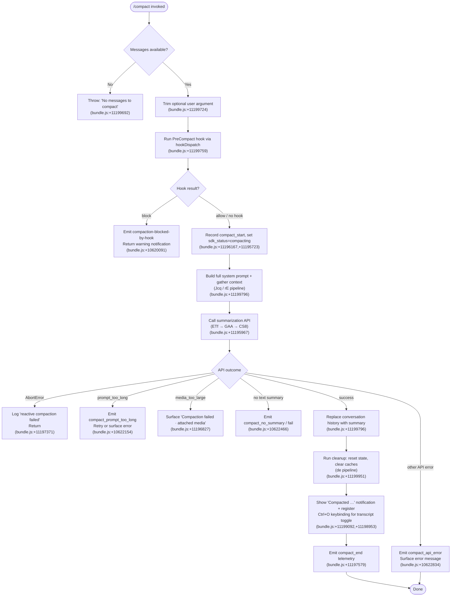

# `/compact`

> Analysis basis: CC v2.1.170 bundle.js (AST extraction + Claude interpretation)
> Minimum version: v2.1.170

---

## Overview

`/compact` frees context-window capacity by replacing the current conversation history with a concise AI-generated summary. The user may optionally supply custom summarization instructions as an argument; the command then invokes the compaction pipeline (hook dispatch, API summarization, state replacement) and signals progress and outcome via telemetry and UI notifications.

---

## Registration

| Field | Value |
|---|---|
| type | `local` |
| name | `compact` |
| description | `Free up context by summarizing the conversation so far` |
| argumentHint | `<optional custom summarization instructions>` |
| supportsNonInteractive | `true` |
| thinClientDispatch | `post-text` |
| module_id | `jcq` |
| load_inline | `true` |
| loc_byte | 11200630 |
| loc_byte_end | 11200930 |
| loc_line | 7471 |
| arbor_handler.name | `TTf` |
| arbor_handler.fqn | `claude-2.1.170::TTf` |
| arbor_handler.kind | `AsyncFunction` |
| arbor_handler.resolution_path | `module_id` |
| arbor_handler.n_hits | 0 |

Analysis basis: CC v2.1.170 bundle.js:+11200630

---

## Input Branching

The handler has more than three distinct execution paths based on message availability, abort state, hook decisions, API outcomes, and error conditions.



---

## Behavioral Spec

### 1. Entry guard — message availability

```
async function compactHandler(userArg, context):
    messages = getConversationMessages(context)   // via cO (bundle.js:+11199661)
    if messages is empty:
        throw Error("No messages to compact")     // bundle.js:+11199692
    customInstructions = userArg.trim()           // bundle.js:+11199724
```

Analysis basis: CC v2.1.170 bundle.js:+11199661, +11199686, +11199692, +11199724

---

### 2. PreCompact hook dispatch

```
function dispatchPreCompactHook(context):
    // hookDispatch (ETf → hookRunner pipeline) bundle.js:+11199759
    result = runHooks("PreCompact", hookInput)    // literal "PreCompact" at bundle.js:+13466239
    if result.decision == "block":
        emitTelemetry("compaction-blocked-by-hook")   // bundle.js:+10620091
        return { type: "warning", text: "compaction blocked by PreCompact hook" }
    // otherwise continue
```

The hook type `"PreCompact"` is dispatched through the hook-runner subsystem (`hookDispatcher` → `hookRunnerCore`). A `block` decision emits a `warning`-severity immediate notification and halts all further compaction steps.

Analysis basis: CC v2.1.170 bundle.js:+11199759, +10620091, +10620125, +13466239

---

### 3. Progress signalling

Before calling the API the handler updates internal state to reflect ongoing compaction:

```
function signalCompactionStart(context):
    setStatus("sdk_status", "compacting")           // bundle.js:+11195723
    emitProgress("compact_progress", "hooks_start") // bundle.js:+11195607,+11195638
    emitProgress("pre_compact")                     // bundle.js:+11195661
    recordTimestamp("compact_start")                // bundle.js:+11196167
```

Two modes are tracked: `"manual"` (user-triggered `/compact`) and `"reactive_compact"` (automatic threshold-based compaction). The `manual` literal is recorded at bundle.js:+11195820.

Analysis basis: CC v2.1.170 bundle.js:+11195607, +11195638, +11195661, +11195703, +11195723, +11195820

---

### 4. Context and system-prompt assembly

```
function assembleCompactionContext(context):
    // Jcq (bundle.js:+11199796) orchestrates:
    appState   = getAppState(context)              // bundle.js:+11199148
    messages   = collectMessages(context)          // Array.from + x_ pipeline
    systemPrompt = buildSystemPrompt(rE pipeline)  // bundle.js:+11199172
    [compactedHistory, summary] = await Promise.all([
        buildMessageList(dp),                      // bundle.js:+11199272
        buildSystemPromptComponents(rE),           // bundle.js:+11199172
    ])
    return { messages, systemPrompt, ... }
```

The `rE` system-prompt builder gathers environment info, memory, CLAUDE.md instructions, flag settings, and context-management directives. Notable literals injected include context-management mode `"compact"` (bundle.js:+13593417) and autonomous-loop reset instruction (bundle.js:+13562439).

Analysis basis: CC v2.1.170 bundle.js:+11199148, +11199215, +11199226, +11199272, +11199458, +11199471, +11199476

---

### 5. Summarization API call

```
async function callSummarizationAPI(messages, systemPrompt, customInstructions):
    // ETf (bundle.js:+11195967) → GAA → CS8 pipeline
    t0 = performance.now()                          // bundle.js:+11195744
    [sdkClientResult, contextResult] = await Promise.all([
        buildSdkClient(MW),                         // bundle.js:+11195766
        gatherHookContext(si),                      // bundle.js:+11195808
    ])
    // ZTf executes the actual API streaming call
    response = await streamingAPICall(ZTf, {
        messages,
        systemPrompt,
        customInstructions,
        mode: "manual",                             // bundle.js:+11195820
    })
    // Compaction agent is allowed text output only; tool use is denied
    // literal: "Tool use is not allowed during compaction" bundle.js:+10631714
    // literal: "compaction agent should only produce text summary" bundle.js:+10631794
    return response
```

The summarization sub-agent is configured with the literal system prompt fragment `"You are a helpful AI assistant tasked with summarizing conversations."` (bundle.js:+10634084). Tool use during this sub-call is denied with `"deny"` (bundle.js:+10631699).

Analysis basis: CC v2.1.170 bundle.js:+11195744, +11195766, +11195795, +11195808, +11195883, +11196167, +10631699, +10631714, +10631794, +10634084

---

### 6. Error classification and retry logic

```
function handleSummarizationError(error):
    if error is AbortError:
        log("reactive compaction failed")           // bundle.js:+11197371
        return
    if error.type == "prompt_too_long":
        emitTelemetry("tengu_compact_ptl_retry")    // bundle.js:+10622194
        // retry with stripped content
    if error.type == "media_too_large":
        surface("Compaction failed · attached media exceeds size limits")
        // bundle.js:+11196827
    if summary is empty / missing:
        emitTelemetry("tengu_compact")              // represents compact_no_summary path
        surface("Failed to generate conversation summary …")
        // bundle.js:+10622567
    if other API error:
        emitTelemetry("tengu_compact_failed")       // bundle.js:+10635438
        surface("compact_api_error")                // bundle.js:+10622834
```

Analysis basis: CC v2.1.170 bundle.js:+11196635, +11196705, +11196827, +11196951, +11197371, +10622154, +10622466, +10622567, +10622834

---

### 7. Successful compaction — state replacement and cleanup

```
async function finalizeCompaction(summary, context):
    // Replace conversation history
    replaceHistory(summary)                        // N16 pipeline, bundle.js:+11199782
    // State reset via de cleanup pipeline bundle.js:+11199951
    clearConversationCaches()                      // VS8, oU9 (bundle.js:+10457289,+10457295)
    resetAutonomousLoopDelivered()                 // bundle.js:+10457327
    clearStateFlags()                              // QD (bundle.js:+10457377)
    // PostCompact hook
    runHooks("PostCompact")                        // literal "PostCompact" bundle.js:+13500018
    // UI notification
    showNotification("Compacted " + turnCount)     // bundle.js:+11199092
    registerKeybinding("app:toggleTranscript", "ctrl+o", "Global")
    // bundle.js:+11198953,+11198985
    setStatus("sdk_status", "reset")               // bundle.js:+11196101
```

The `compact_boundary` marker (literal at bundle.js:+10958101) is embedded in the replacement message set so that later reactive-compaction passes can locate the boundary UUID.

Analysis basis: CC v2.1.170 bundle.js:+11199782, +11199796, +11199820, +11199926, +11199951, +10457184, +10457327, +10957657, +10958101

---

### 8. Cancellation path

If the user cancels during compaction:

```
function handleCancellation():
    showMessage("Compaction canceled.")            // bundle.js:+11200232
    return
```

Analysis basis: CC v2.1.170 bundle.js:+11200232

---

### 9. Compaction result notification and telemetry close

```
function emitCompactEnd(outcome, durationMs):
    // wcq pipeline (bundle.js:+11197315)
    displayDimText("Compacted " + turns)          // bundle.js:+11199092 (w6.dim)
    joinRemainingTurns()                           // K.join bundle.js:+11199105
    emitTelemetry("tengu_compact", { outcome, duration: durationMs })
    recordSpan("compact_end")                     // bundle.js:+11197579
```

Analysis basis: CC v2.1.170 bundle.js:+11197315, +11197579, +11199085, +11199092, +11199105

---

## State & Side Effects

| Item | Detail |
|---|---|
| Telemetry — compaction core | `tengu_compact` (bundle.js:+10624133), `tengu_compact_failed` (+10635438), `tengu_compact_ptl_retry` (+10622194), `tengu_compact_cache_prefix` (+10621718), `tengu_compact_cache_sharing_success` (+10632591), `tengu_compact_cache_sharing_fallback` (+10633221) |
| Telemetry — reactive compaction | `tengu_reactive_compact_attempt` (+5083305), `tengu_reactive_compact_succeeded` (+10463624), `tengu_reactive_compact_failed` (+10461163) |
| Telemetry — post-compact file restore | `tengu_post_compact_file_restore_success` (+10635924), `tengu_post_compact_file_restore_error` (+10635966) |
| Telemetry — precomputed compact | `tengu_precomputed_compact_consumed` (+10455958), `tengu_precomputed_compact_discarded` (+10456581) |
| Telemetry — feature flags | `tengu_slate_harrier` (+13593524), `tengu_sparrow_ledger` (+13583376), `tengu_amber_redwood3` (+10639868) |
| Hook registration | `PreCompact` hook dispatched before summarization; `PostCompact` hook dispatched after successful history replacement |
| appState changes | `sdk_status` set to `"compacting"` then `"reset"`; conversation messages replaced with summary + `compact_boundary` sentinel; `compactMetadata` written to state |
| Keybinding registered | `app:toggleTranscript` → `ctrl+o` (scope: `"Global"`) |
| Cache/state cleared | Conversation caches (`VS8`), autonomous-loop-delivered flag, internal state flags reset via `QD` |
| Sound | <!-- TODO: not found in depth-2 traversal; needs --depth 4 --> |

---

## Version History

| Version | Change |
|---|---|
| v2.1.170 | Initial analysis |

---

## Common Mistakes

1. **Running `/compact` on an empty session**: The guard at bundle.js:+11199692 immediately throws `"No messages to compact"`. Ensure at least one exchange exists before invoking.
2. **PreCompact hook returning `block`**: If a configured hook blocks compaction, the command exits silently with a warning notification — the conversation is not modified. Inspect hook output before assuming the command ran.
3. **Expecting tools to work during compaction**: The summarization sub-call runs with tool use denied (`"deny"` at bundle.js:+10631699). Any command that depends on tool execution will fail if it is somehow invoked during the compaction turn.
4. **Providing custom instructions that conflict with the built-in summarization system prompt**: The built-in instruction `"You are a helpful AI assistant tasked with summarizing conversations."` is always prepended; custom argument text extends, not replaces, it.
5. **Assuming a single retry is sufficient for oversized context**: The `prompt_too_long` path (bundle.js:+10622154) may retry with stripped media, but if stripping is not possible (`media_unstrippable` at bundle.js:+5084147), compaction will fail and the conversation is not modified.

---

## Appendix — Identifier Mapping

> For bundle debugging only. Identifiers change across versions.

| Identifier | Role |
|---|---|
| `TTf` | Main compact command handler (AsyncFunction) |
| `cO` | Message slice / conversation message collector |
| `gC8` | Message boundary helper |
| `Nj` | Low-level message normalizer |
| `ai` | Agent/session initializer |
| `F_` | Feature-flag reader |
| `Y6` | Context-window / token-budget manager |
| `uP6` | Token budget sub-routine A |
| `mP6` | Token budget sub-routine B |
| `Lm` | System-prompt limiter |
| `nu` | Config accessor |
| `D78` | Deduplication / ID registry |
| `Gw_` | Event emitter wrapper |
| `WT_` | Post-compact hook dispatcher |
| `h6` | File-watch / CLAUDE.md loader |
| `n6` | Path resolver helper |
| `hT_` | Hook watcher |
| `B7H` | Config file reader/writer |
| `BSL` | File-watcher subscription helper |
| `ETf` | Top-level compaction orchestrator |
| `MW` | SDK client builder |
| `EXf` | Message API serializer |
| `JXH` | Token counter |
| `d1A` | Message-list normalizer for API |
| `si` | Hook context gatherer |
| `A7` | Hook event dispatcher core |
| `v6` | Model-capability checker |
| `kI` | Alternative model-capability checker |
| `IP` | Extended-thinking capability gate |
| `xv` | Effort-level resolver |
| `eN` | Prompt-component joiner |
| `C6` | System-prompt section builder |
| `MG` | Hook runner (executes single hook) |
| `eC` | Policy-settings reader |
| `N` | Logger / diagnostics emitter |
| `s$H` | Hook job-id generator |
| `YYA` | Hook type classifier |
| `O` | Background-session descriptor |
| `WjK` | Hook watch-path scanner |
| `zYA` | Third-party hook filter |
| `EjK` | Hook execution context builder |
| `d` | App-state reader (getAppState getter) |
| `CH` | JSON serializer wrapper |
| `hH` | Hook result logger |
| `xH` | State-delta applier |
| `mVH` | UI state writer |
| `hN` | AbortController / timeout manager for hooks |
| `j` | Background job descriptor |
| `I1H` | Hook input schema validator |
| `yN` | Hook async flag helper |
| `sB8` | Stop-hook guard |
| `fYA` | MCP-tool hook handler |
| `HF8` | Hook output JSON parser |
| `jqH` | Hook plugin metrics recorder |
| `LYA` | HTTP hook executor |
| `PjK` | HTTP hook response parser |
| `h$H` | Hook environment variable injector |
| `_F8` | Subprocess hook spawner |
| `qRH` | Hook result aggregator |
| `SH` | State delta writer |
| `RF` | Telemetry event emitter |
| `K` | Parallel hook waiter |
| `L` | Hook promise tracker |
| `f` | Worker/stream channel |
| `M` | MCP server manager |
| `aSH` | MCP connection attempt handler |
| `Ic8` | MCP connection result applier |
| `$` | MCP server slot descriptor |
| `IPA` | MCP per-server connection orchestrator |
| `Jcq` | Compaction context assembler |
| `rE` | System-prompt builder / context collector |
| `NYA` | Context-window budget calculator |
| `p8H` | Conversation-state accessor |
| `pjK` | Brief-mode context builder |
| `LC8` | Tool-list serializer for system prompt |
| `Q_` | Conversation-history formatter |
| `oE` | Output-style resolver |
| `UjK` | Brief-mode flag checker |
| `Etf` | Code-style reminder injector |
| `Ztf` | Confirmation-reminder injector |
| `wY_` | Task-continuity context builder |
| `Vtf` | Task-continuity + confirmation combiner |
| `hYA` | Conversation-mode selector (off/additive/compact) |
| `etf` | Compact-mode applier |
| `gg` | History formatter alias |
| `utf` | Routine/schedule prompt builder |
| `M26` | Memory loader (CLAUDE.md + team memory) |
| `ctf` | Environment-info builder (static) |
| `dtf` | Environment-info builder (dynamic) |
| `ktf` | Language-instruction injector |
| `ytf` | Output-style injector |
| `ntf` | Background-session context builder |
| `itf` | Scratchpad context builder |
| `otf` | Context-management instruction injector |
| `ttf` | Flag-settings injector |
| `Utf` | Y6 / context-budget injector |
| `Ntf` | CLAUDE.md file loader for system prompt |
| `Itf` | Conversation-reset instruction injector |
| `Akq` | Agent memory loader |
| `ptf` | Autonomy-append injector |
| `htf` | Heron-brook injector |
| `Stf` | Context-management reminder injector |
| `Rtf` | Verified-vs-assumed injector |
| `Ctf` | Compact-mode system-prompt combiner |
| `btf` | Tool-usage instruction injector |
| `mtf` | Growthbook-experiment injector |
| `w89` | Team-memory loader |
| `YJH` | AWS Bedrock credential helper |
| `x_` | App-state snapshot reader |
| `A` | Message-array helper |
| `NR8` | Working-directory extractor |
| `IR8` | Allowed-tools extractor |
| `Xb` | Permission-mode resolver |
| `dp` | System-prompt assembly coordinator |
| `E4` | Model selector |
| `fW` | Flag-settings applier |
| `b_` | Module initializer shim |
| `AY` | Session-type resolver |
| `K6` | State key-value setter |
| `f6` | State key-value reader |
| `hR8` | Logger helper |
| `Z1A` | Progress notification emitter |
| `ZTf` | Streaming API call executor |
| `wAA` | AbortController / pending-request registry |
| `NS8` | Pending-state sentinel |
| `_` | Generic utility / transform |
| `a96` | Precomputed compact consumer |
| `IS8` | Session-mode detector |
| `s3` | Span/trace recorder |
| `J1` | Telemetry event batcher |
| `JAA` | Compact-boundary UUID finder |
| `yS8` | Compact progress event builder |
| `CS8` | Full reactive-compaction executor |
| `uNH` | Thread-type classifier |
| `lu` | Thread prefix checker |
| `Gj` | Token counter with cache |
| `lAH` | Token-budget cache checker |
| `E29` | Token-count estimator |
| `Lt` | Token-limit resolver |
| `FG6` | Header-map from-entries builder |
| `phH` | API headers builder |
| `En` | NW9 / network wrapper |
| `NW9` | Network request helper |
| `qT6` | API client getter/initializer |
| `wY8` | Endpoint prefix checker |
| `lhH` | API key file writer |
| `ZBH` | Beta-header builder |
| `t96` | Cache-token-count helper |
| `e4` | Message-count pruner |
| `kR6` | Request-UUID generator |
| `KqH` | Tool-list builder for API |
| `DXf` | Tool-input validator |
| `YXf` | Tool-schema validator |
| `bwf` | Full compaction state-setup coordinator |
| `xS8` | MCP tool list loader |
| `US8` | App-state tool collector |
| `uS8` | Deferred-tool list loader |
| `pS8` | Plan-file context loader |
| `mS8` | Tool-source aggregator |
| `S3H` | Background-task status injector |
| `huH` | Tool deduplication / ordering |
| `SuH` | Tool-slot builder |
| `i1` | Tool-call UUID generator |
| `nF` | Plugin hook loader |
| `e0H` | System-prompt fragment assembler |
| `TAA` | Message transformation pipeline |
| `QuH` | Hook-result message classifier |
| `j3H` | API request metadata builder |
| `KY8` | Token-usage round helper |
| `qY8` | Token-count map updater |
| `SE` | Stream-event processor |
| `PM` | Token counter core |
| `Q17` | Token-cache map updater |
| `fE` | Extended-thinking flag setter |
| `z$` | App-state snapshot getter |
| `GAA` | Reactive-compact orchestrator |
| `IY8` | Reactive-compact message grouper |
| `JT6` | Compact boundary locator |
| `q` | Generic queue / channel |
| `L09` | Group-size calculator |
| `D` | Shutdown / exit descriptor |
| `J` | Worker kill helper |
| `Rq7` | Reactive-compact summarization caller |
| `w` | Background worker process descriptor |
| `Cq7` | Compact group-size updater |
| `MT6` | Abort-signal timeout wrapper |
| `fT6` | Abort-signal creator |
| `um` | Path/URL sanitizer for log output |
| `f97` | MCP server name redactor |
| `e17` | Phone-number redactor |
| `_97` | Generic PII redactor |
| `o17` | IP-address redactor |
| `l17` | Email redactor |
| `d17` | Home-directory path normalizer |
| `q97` | Absolute-path normalizer |
| `A97` | API-error body redactor |
| `L97` | Long-path truncator |
| `FW9` | Compact-aborted event emitter |
| `s6` | State entry writer |
| `EH` | Error serializer |
| `de` | Post-compact cleanup runner |
| `hS8` | Pending-state cleaner |
| `QG6` | Cache-store purger |
| `nG` | Generic cache object |
| `$56` | Conversation-reset flag setter |
| `z56` | xZ / module-export accessor |
| `xZ` | Bundle export helper |
| `$6H` | Conversation-reset sub-routine |
| `VS8` | Vxq cache clearer |
| `oU9` | MZ6/_p_ cache clearer |
| `ozq` | State-H resetter |
| `CWH` | State-_ resetter |
| `QD` | Output-token counter reset |
| `XAA` | Post-cleanup state reconciler |
| `ghH` | UI-state setter (_T6.setState) |
| `wcq` | Compaction completion notifier |
| `BRH` | Model-switch-keybinding registrar |
| `rI7` | Keybinding descriptor builder |
| `uP` | Keybinding action dispatcher |
| `dM8` | Keybinding action runner (VyH) |
| `cM8` | Keybinding fall-through handler |
| `FjH` | Telemetry span finalizer |
| `F4` | OTEL metric event emitter |
| `syH` | OTEL attribute builder |
| `Y56` | Prompt-id builder |
| `Oi8` | Metric event publisher |
| `zi8` | Sequence counter |
| `N16` | Reactive-compact execution kernel |
| `DZ6` | Tracing span creator |
| `Q5H` | Span-attribute setter |
| `ZN` | Span lifecycle manager |
| `SS` | Active-span accessor |
| `hsH` | Summary-string extractor |
| `NY8` | Summary text trimmer |
| `x8` | PTY / streaming socket manager |
| `P` | Buffer accumulator / socket read-loop |
| `X` | Socket/stream descriptor |
| `jf` | Socket write helper |
| `tj5` | Protocol message dispatcher (daemon socket) |
| `emq` | Compaction turn executor / streaming manager |
| `VSq` | Token-rate metric recorder |
| `Sh8` | I8A metric getter |
| `ZSq` | Metric-rate updater |
| `_6` | String coercer |
| `iG` | Turn runner / streaming response processor |
| `ky8` | App-state update coordinator |
| `yy8` | Post-turn state reconciler |
| `mS` | Session-ID anonymizer |
| `HqH` | Turn-start message classifier |
| `Qp` | Turn-cleanup coordinator |
| `bT` | Background-task state tracker |
| `eR6` | Tombstone checker |
| `DqH` | Stream-event debug logger |
| `kR8` | API-metrics recorder |
| `xmq` | Tombstone setter |
| `qMH` | In-progress tool-use ID tracker |
| `hjf` | State-commit finalizer |
| `ZC_` | Response-text extractor |
| `X5H` | Max-output-token resolver |
| `zJH` | Model output-token lookup |
| `cAH` | CLAUDE_CODE_MAX_OUTPUT_TOKENS env parser |
| `GV` | Last-assistant-message finder |
| `vY8` | Summary tag extractor |
| `VY8` | `<summary>` tag finder |
| `F8` | Generic flag reader |
| `k` | Timer / interval descriptor |
| `pjf` | State-writer for compaction result |
| `Do` | Debug-output helper |
| `AC6` | Tool-search mode decision maker |
| `AzH` | Tool-search threshold checker |
| `$t` | Model-name normalizer (lowercase) |
| `$uH` | Tool-list "has non-standard" checker |
| `CR_` | Tool-search config reader |
| `wXf` | Tool-search request executor |
| `EC_` | Message-content normalizer |
| `xjf` | Content-block array checker |
| `ujf` | Content-block filter |
| `mjf` | Content-block mapper / surrogate-pair handler |
| `_C6` | Content-type mapper |
| `E1A` | Recursive content normalizer |
| `rmq` | Surrogate-pair encoder |
| `w96` | Fallback-credit handler |
| `B1A` | Fallback-credit request builder |
| `EXK` | Main API streaming pipeline |
| `XP8` | Tool-permission context builder |
| `W1` | Model-feature set builder |
| `XG` | xZ accessor |
| `W` | Streaming-response iterator |
| `vRH` | Teammate-mailbox message reader |
| `Y` | UI renderer / terminal output manager |
| `pTH` | Terminal write helper |
| `bzK` | Terminal layout calculator |
| `T` | Spinner / progress-bar controller |
| `E` | Animation controller |
| `ccK` | V_H heartbeat helper |
| `V` | Sub-renderer |
| `iF` | Array.isArray wrapper |
| `amq` | Message slice rebuilder |
| `SsH` | Message push helper |
| `RsH` | j5H role-structure checker |
| `j5H` | Role-field array validator |
| `zv6` | Version string parser |
| `Fk` | Tool-name prefix checker |
| `x` | Rate-limiter enqueue helper |
| `IqK` | Rate-limit event recorder |
| `R` | Daemon write helper |
| `bM` | Context-window path builder |
| `tR` | xZ export reader |
| `W_` | xZ export reader (alt) |
| `dG` | Context-type descriptor |
| `ed` | Context-display formatter |
| `CK` | String coercer (String()) |
| `VG6` | REPL-context list getter |
| `jT6` | Tool-call formatter for transcript |
| `Sq7` | Tool-result trimmer |
| `ft` | Token-budget cache filler |
| `tmq` | Compaction error display helper |
| `hX` | Tool-use output queue manager |
| `UT` | Output queue flusher |
| `oq7` | Output-batch cache manager |
| `YZ6` | Notification icon selector |
| `QSH` | Status-bar updater |
| `h1A` | _6 state-key writer |

---

Note: index built via Arbor fallback; some signals (telemetry, literals) may be missing — see arbor-fallback.js.