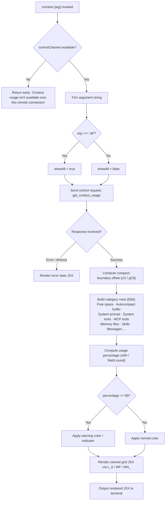

# `/context`

> Analysis basis: CC v2.1.170 bundle.js (AST extraction + Claude interpretation)
> Minimum version: v2.1.170

---

## Overview

`/context` visualizes the current context window usage as a colored grid broken down by category (system prompt, tools, memory files, messages, etc.). It sends a `get_context_usage` control request over the session's control channel and renders the response as a JSX component in the terminal. When invoked with the optional `all` argument it reveals additional detail rows that are hidden by default.

---

## Registration

| Field | Value |
|---|---|
| type | `local-jsx` |
| name | `context` |
| description | `Visualize current context usage as a colored grid` |
| argumentHint | `[all]` |
| thinClientDispatch | `control-request` |
| module_id | `nnq` |
| load_inline | `true` |
| loc_byte | `11600947` |
| loc_byte_end | `11601173` |
| loc_line | `7527` |
| arbor_handler.name | `jvf` |
| arbor_handler.fqn | `claude-2.1.170::jvf` |
| arbor_handler.kind | `AsyncFunction` |
| arbor_handler.resolution_path | `module_id` |
| arbor_handler.n_hits | `0` |

Analysis basis: CC v2.1.170 bundle.js:+11600947

---

## Input Branching

Four distinct paths exist based on connection availability and argument value, so a Mermaid flowchart is used.



Analysis basis: CC v2.1.170 bundle.js:+11599541 (handler entry `jvf`), +11599625 (remote-unavailable literal), +11599572 (`all` literal), +11599707 (`sendControlRequest`), +11600083 (80 threshold)

---

## Behavioral Spec

### Handler entry point (`jvf`)

```
async function contextCommandHandler(args, session):
    rawArg = args.trim()                          // +11599547

    controlChannel = getControlChannel(session)   // +11599598
    if not controlChannel:
        return staticMessage(
            "Context usage isn't available over this remote connection"
        )                                         // +11599625

    showAll = (rawArg === "all")                  // +11599572

    response = await session.sendControlRequest(
        { type: "get_context_usage" }             // +11599737
    )                                             // +11599707

    compactBoundary = computeCompactBoundary(response)  // cO / gC8, +11599503

    rows = buildCategoryRows(response, showAll)   // Eb6, +11599877
    usagePercent = computeUsagePercent(response)  // v6H, +11599379

    jsx = renderContextGrid(rows, usagePercent, showAll)  // L_6 / WF, +11599767
    return jsx
```

Analysis basis: CC v2.1.170 bundle.js:+11599541

---

### Category-row builder (`buildCategoryRows` / `Eb6`)

Produces the ordered list of labeled usage segments rendered in the grid. Each row carries a label string (from literals), a token count, and a color class.

```
function buildCategoryRows(usageData, showAll):
    rows = []

    // Always-visible rows (in order)
    rows.push({ label: "Free space",         tokens: usageData.freeSpace })
    rows.push({ label: "Autocompact buffer", tokens: usageData.autocompactBuffer })

    // System-level rows
    systemRows = usageData.entries.filter(isSystemEntry)
    rows.push({ label: "System prompt",  tokens: sumSystemPrompt(systemRows) })
    rows.push({ label: "System tools",   tokens: sumSystemTools(systemRows) })
    rows.push({ label: "MCP tools",      tokens: sumMcpTools(systemRows) })
    rows.push({ label: "Memory files",   tokens: sumMemoryFiles(systemRows) })
    rows.push({ label: "Skills",         tokens: sumSkills(systemRows) })

    // Message rows
    messageRows = usageData.entries.filter(isMessageEntry)
    rows.push({ label: "Messages", tokens: sumMessages(messageRows) })

    // Extended rows only when showAll = true
    if showAll:
        for entry in usageData.entries:
            rows.push(buildDetailRow(entry))

    return rows
```

Literal labels verified at:
- `"Free space"` — bundle.js:+11597679
- `"Autocompact buffer"` — bundle.js:+11597702
- `"System prompt"` — bundle.js:+10654625
- `"System tools"` — bundle.js:+10654703
- `"MCP tools"` — bundle.js:+10654766
- `"Memory files"` — bundle.js:+10655080
- `"Skills"` — bundle.js:+10655141
- `"Messages"` — bundle.js:+10655662

Category source labels (settings-layer identifiers used when filtering):
- `"projectSettings"` / `"Project"` — bundle.js:+11598628 / +11598648
- `"userSettings"` / `"User"` — bundle.js:+11598668 / +11598685
- `"localSettings"` / `"Local"` — bundle.js:+11598702 / +11598720
- `"plugin"` / `"Plugin"` — bundle.js:+11598810 / +11598821
- `"built-in"` / `"Built-in"` — bundle.js:+11598840 / +11598853

Analysis basis: CC v2.1.170 bundle.js:+11597603 (`_K`), +11597644 (`A.filter`), +11597962 (`A.find`)

---

### Usage-percentage formatter (`computeUsagePercent` / `v6H`)

```
function computeUsagePercent(usageData):
    ratio = usageData.usedTokens / usageData.totalTokens
    rounded = Math.round(ratio * 100)             // +214856
    if rounded < 20:
        return "< 20"                             // +214836 literal
    formatted = toLocaleString(rounded,
        locale="en-US", style="compact")          // +216809, +216827
    return formatted + ".0"                       // ".0" literal +214797
```

Threshold constants:
- Display as `"< 20"` when percentage is below 20 (bundle.js:+214836)
- Granularity step visible at value 10 (bundle.js:+214869)
- Warning / high-usage threshold: **80%** (bundle.js:+11600083)

Analysis basis: CC v2.1.170 bundle.js:+214853

---

### Compact-boundary resolver (`cO` / `gC8`)

```
function resolveCompactBoundary(response):
    marker = findMarker(response, key="compact_boundary")  // literal +10958101
    if marker:
        return response.slice(0, marker.offset)            // H.slice +10958254
    return null
```

Analysis basis: CC v2.1.170 bundle.js:+11599503 (`cO`), +10958184 (`Nj`)

---

### Grid renderer (`L_6` / `WF` / `MN_`)

```
function renderContextGrid(rows, usagePercent, showAll):
    // Subscribe to control-channel events
    channel.on("data", onDataEvent)               // K.on +8297476
    rawText = channel.toString()                  // f.toString +8297513

    // Create React elements for each row
    elements = rows.map(row =>
        createElement(rowComponent, {
            label: row.label,
            tokens: row.tokens,
            color: chooseColor(row)
        })
    )

    // Wrap in top-level grid element
    return createElement(gridContainer, {
        usagePercent: usagePercent,
        showAll: showAll
    }, ...elements)
```

Color key visible in literals:
- `"inactive"` color for zero-token rows — bundle.js:+10654733
- `"cyan_FOR_SUBAGENTS_ONLY"` for MCP tool rows in sub-agent context — bundle.js:+10654793
- `"purple_FOR_SUBAGENTS_ONLY"` for message rows in sub-agent context — bundle.js:+10655688
- `"promptBorder"` style for system prompt rows — bundle.js:+10654656
- `"permission"` style for custom-agent rows — bundle.js:+10655045

Analysis basis: CC v2.1.170 bundle.js:+11599767 (`L_6`), +3892038 (`WF` → `rv_`/`MN_`)

---

### Session-info enrichment path (`CR8` orchestrator)

`CR8` is a large orchestrator reached from `jvf` (via `f` → `CR8` at bundle.js:+11600100). It collects the raw context data by assembling contributions from several sub-collectors before the display layer formats them:

| Sub-collector | Role | Entry loc_byte |
|---|---|---|
| `rE` | Full system-prompt assembly (tools, memory, env) | +10653775 |
| `sZ` / `Bc` | Model-name and provider resolution | +10653669 |
| `Hr` | Context-window size / auto-compact settings | +10640095 |
| `SE` | Message-history analysis and token accounting | +10653479 |
| `sjf` | Per-entry system-prompt token counting | +10654353 |
| `ejf` | Background-session and sub-agent row assembly | +10654408 |
| `MXf` | Attachment/tool-result token accounting | +10654456 |
| `wqH` | Min-token cap enforcement | +10654580 |

Analysis basis: CC v2.1.170 bundle.js:+11600100 (`CR8`)

---

### Fullscreen / terminal-compatibility guard (`Z1`)

Before the grid is rendered the runtime checks whether fullscreen output is permitted in the current terminal environment.

```
function checkFullscreenSupport():
    if isTmuxCCMode():                    // gbL / FbL checking "iTerm.app" +3489137
        warn("fullscreen disabled: tmux -CC (iTerm2 integration mode) detected …")
        // literal +3490145
        return false
    if isWindowsSSH():                    // KZ_ / "windows" literal +3489699
        warn("fullscreen disabled: Windows over SSH (ConPTY re-rendering) detected …")
        // literal +3490331
        return false
    if envNoFlicker():                    // environment override checked
        return false
    return true
```

tmux detection uses `spawnSync` with args `["display-message", "-p", "#{client_control_mode}"]` (literals at bundle.js:+3489415, +3489433, +3489438).

Analysis basis: CC v2.1.170 bundle.js:+3490143 (`N` → fullscreen-disabled message), +3489192 (`FbL` → `H.startsWith`)

---

## State & Side Effects

| Item | Detail |
|---|---|
| Telemetry | None attributed directly to the `/context` command path within depth-2 traversal. Surrounding infrastructure fires `tengu_amber_creek` (+3490662), `tengu_pewter_brook` (+3490570), `tengu_marlin_porch` (+3862142), `tengu_native_cursor` (+3862403) for fullscreen / cursor-mode decisions reached during render. `tengu_amber_redwood2` (+10639983) and `tengu_amber_redwood3` (+10639868) fire inside auto-compact window resolution (`$pq`). |
| Control request | Sends `get_context_usage` over the session's `controlChannel` (thinClientDispatch = `control-request`). |
| Read-only | Command does not mutate project state, memory files, or settings. |
| JSX rendering | Returns a `local-jsx` component; output is rendered inline in the terminal by the CC UI layer via `E9H.createElement` / `Zb6.createElement` (+11599771). |
| Sound | None. |
| Hook registration | `N9` → `LTA.register` (+62328) is reachable in the infrastructure layer but is not specific to this command. |
| appState changes | None detected within the command's own call graph. |

---

## Version History

| Version | Change |
|---|---|
| v2.1.170 | Initial analysis |

---

## Common Mistakes

1. **Running over a remote thin-client connection.** When `controlChannel` is absent (e.g. SSH thin-client mode without the control socket), the command returns the static message "Context usage isn't available over this remote connection" instead of a grid. Use a local session or ensure the control channel is forwarded.

2. **Expecting percentages below 20% to appear as a number.** Values under 20% are always shown as the literal string `"< 20"` (bundle.js:+214836), not as a numeric percentage.

3. **Omitting `all` when expecting per-entry detail rows.** Without the `all` argument, only the aggregated category rows are displayed. Pass `/context all` to see the full per-entry breakdown.

4. **Misreading the 80% threshold as an error.** A usage percentage at or above 80% triggers a warning color but is not an error state; the command still completes normally.

5. **Using `/context` in iTerm2 tmux-CC mode or Windows-over-SSH.** Fullscreen rendering is automatically disabled in these environments with an explanatory message, and the grid may appear degraded or absent.

---

## Appendix — Identifier Mapping

> For bundle debugging only. Identifiers change across versions.

| Identifier | Role |
|---|---|
| `jvf` | Main async handler for `/context` command (Arbor-resolved) |
| `Z1` | Fullscreen / terminal-environment compatibility checker |
| `B6H` | Environment-flag presence check (uses `jz4.has`) |
| `LZ_` | Fullscreen mode string resolver |
| `_6` | String coercion utility |
| `Ms` | Terminal background-color detector |
| `gbL` | iTerm2 / tmux-CC detection (calls `XA9.spawnSync`) |
| `FbL` | Terminal name prefix checker (`H.startsWith`) |
| `N` | Fullscreen warning message emitter |
| `PeK` | Control-channel availability checker |
| `MTA` | Control-channel type resolver |
| `CH` | JSON stringifier wrapper |
| `u4` | Argument parser / redaction utility |
| `FZA` | Argument token mapper |
| `zFH` | Write-to-channel helper |
| `yZA` | Raw channel write wrapper |
| `EeK` | Transcript / log-append orchestrator |
| `mBH` | Buffered write scheduler (uses `setTimeout` / `setImmediate`) |
| `L4H` | Log-path constructor |
| `cZA` | Path joiner for log files |
| `La8` | Log-file rotation handler |
| `TeK` | Async log-append worker (`Mh.appendFile`) |
| `N9` | Hook registration wrapper (`LTA.register`) |
| `KZ_` | Windows-SSH detection (`"windows"` literal) |
| `Q_` | Settings accessor |
| `PB` | Settings-load dispatcher |
| `_q` | Memory-usage sampler (`process.memoryUsage`) |
| `_q_` | Settings-load worker (fires `settings_load_started` / `settings_load_completed`) |
| `XB` | Settings-layer aggregator |
| `QbL` | Fullscreen mode selector |
| `Y6` | App-state accessor |
| `Lm` | State normalization helper |
| `D78` | State-transition tracker |
| `h6` | Session-state updater |
| `BL` | Control-channel constructor |
| `EZH` | Channel event emitter |
| `gI` | Channel capability resolver |
| `L_6` | Grid event listener / renderer bootstrap |
| `WF` | React element factory wrapper |
| `MN_` | JSX element creator (`t79.createElement`) |
| `ks` | Grid container component |
| `jyH` | Terminal-state-aware row component |
| `Eb6` | Category-row builder (filters/finds entries) |
| `_K` | Token-count formatter |
| `oK` | Locale-number formatter helper |
| `veK` | Inner numeric formatter |
| `CQH` | Color selector for rows |
| `v6H` | Usage-percentage calculator (`Math.round`) |
| `EH` | String-conversion utility |
| `Jvf` | Compact-boundary + display coordinator |
| `cO` | Compact-boundary locator |
| `gC8` | Marker-key finder (`"compact_boundary"`) |
| `Nj` | Marker index resolver |
| `CR8` | Context-data assembly orchestrator |
| `sZ` | Model-info resolver |
| `Bc` | Model metadata lookup |
| `tY` | Model-tier classifier |
| `QU` | Provider string resolver |
| `Uh` | API provider / model-name parser |
| `AE` | Model-family classifier |
| `r_` | Base model-string normalizer |
| `Y7` | Extended model-family resolver |
| `Yf` | Model-name prefix matcher |
| `Sv` | Model display-name builder |
| `tE` | Auto-compact configuration reader |
| `r4` | Legacy global-config reader |
| `Ev` | Config deduplicator |
| `y8` | Settings-layer config reader |
| `Hr` | Context-window size / window resolver |
| `W1` | Header / system-string parser |
| `_88` | Object-entry enumerator |
| `eJ` | Header-field normalizer |
| `Er8` | Header replacement helper |
| `E3` | String replacement utility |
| `JE` | Integer context-window parser |
| `_w` | Token-limit lower-bound resolver |
| `CB` | Window-size calculation combiner |
| `Bh` | Window-size branch for standard models |
| `aL8` | Window-size branch for large-context models |
| `J2` | Fallback window-size resolver |
| `cAH` | `CLAUDE_CODE_MAX_OUTPUT_TOKENS` env-var parser |
| `$pq` | Auto-compact window resolver (env / settings / experiment) |
| `F_` | Feature-flag reader |
| `k1A` | Compact-window string parser (`parseFloat` / `parseInt`) |
| `rE` | Full system-prompt assembler |
| `NYA` | System-prompt header builder |
| `C6` | AsyncLocalStorage store accessor |
| `oi6` | Store-context getter |
| `W_` | Compressed-string decoder |
| `p8H` | System-prompt section builder |
| `u3L` | Inline-content checker |
| `pjK` | Plan-mode flag accessor |
| `LC8` | MCP-tool system-prompt assembler |
| `oE` | Output-style resolver |
| `UjK` | Brief-mode system-prompt selector |
| `YP6` | Feature-flag lookup (`"pewter_owl_tool"`) |
| `Etf` | Code-style system-prompt injector |
| `Ztf` | Confirmation-required system-prompt injector |
| `Vtf` | Task-continuity system-prompt injector |
| `wY_` | Task-continuity flag accessor |
| `hYA` | Environment-info section builder |
| `CK` | String coercion for environment values |
| `etf` | Environment-info wrapper |
| `gg` | SDK-mode flag accessor |
| `utf` | Tone-and-style system-prompt builder |
| `Sd` | Session-data accessor |
| `lP` | Feature-flag helper |
| `xtf` | Extended tone-prompt variant |
| `hqA` | Output-style additional prompt builder |
| `Rb` | Disabled-feature check |
| `H7` | Hook-data accessor |
| `xQ` | Session-schedule / routine accessor |
| `OQ` | System-prompt content flattener |
| `M26` | Memory / CLAUDE.md prompt assembler |
| `AL` | CLAUDE.md file reader and parser |
| `a7H` | Memory-directory creator |
| `ta` | Memory file stat / type checker |
| `f6` | `ff6` caller (file utility) |
| `SH` | File-system helper dispatcher |
| `d69` | Parallel memory-file loader |
| `Y` | Supervisor / daemon process manager |
| `f26` | Memory-file path splitter |
| `YJ` | Team-memory path resolver |
| `K89` | Memory-prompt section builder |
| `q89` | Memory key-lookup helper |
| `A89` | Memory index builder |
| `JE_` | Memory-index cache writer |
| `d` | File-system read/write dispatcher |
| `ctf` | Compact system-prompt builder |
| `Hw` | Model display-name lookup |
| `IYA` | Inline system-prompt content builder |
| `dtf` | Full environment-info assembler |
| `yYA` | OS-version / release collector |
| `uM` | User locale resolver |
| `kYA` | Shell identifier |
| `ktf` | Language-setting prompt injector |
| `ytf` | Output-style prompt injector |
| `ntf` | Background-session / worktree prompt injector |
| `Go_` | Worktree-detection helper |
| `itf` | Scratchpad system-prompt injector |
| `LKH` | Scratchpad state accessor |
| `lTH` | Scratchpad path joiner |
| `otf` | Brief-mode flag prompt injector |
| `ttf` | Focus-mode / reproduce-verify prompt injector |
| `oiH` | Focus-mode state accessor |
| `Utf` | Growthbook experiment prompt injector |
| `Ntf` | Heron-brook prompt injector |
| `Itf` | Autonomy-append prompt injector |
| `Akq` | Skill-file prompt assembler |
| `M56` | Skill-store accessor |
| `jr8` | Skill-compute helper |
| `ptf` | Base-identity prompt selector |
| `htf` | Act-dont-rederive prompt injector |
| `Stf` | Context-compression notice injector |
| `vtf` | Compression-notice text builder |
| `Rtf` | Doing-tasks section builder |
| `Ctf` | Environment-info section combiner |
| `btf` | Tool-usage section builder |
| `dG` | CLI/remote context discriminator |
| `mtf` | Final content flattener |
| `w89` | Memory-prompt with team-memory awareness |
| `D89` | Team-memory prompt builder |
| `YJH` | Model-display name wrapper |
| `uv` | Display-name cache accessor |
| `FL` | Fallback name formatter |
| `dp` | Agent / sub-session context assembler |
| `E4` | Agent-type resolver |
| `fW` | Sub-agent feature helper |
| `uT` | Agent unique-token helper |
| `Yq` | Agent-queue accessor |
| `b_` | Module-export setup helper |
| `QB6` | Module bind helper |
| `M` | Daemon / MCP server manager |
| `aSH` | MCP server connection launcher |
| `Ic8` | MCP connection result applier |
| `$` | MCP slot helper |
| `IPA` | MCP server inventory builder |
| `AY` | Agent memory accessor |
| `K6` | `ff6` dispatch helper |
| `ff6` | Core file-system module |
| `sjf` | Per-entry system-prompt token counter |
| `ajf` | System-prompt entry parser |
| `xR8` | Per-entry context-data fetcher |
| `ltf` | Environment-info per-entry builder |
| `J89` | Memory-prompt per-entry builder |
| `xjK` | Entry-prefix extractor |
| `Pq6` | System-prompt token counting and rendering |
| `OSH` | Built-in tool token counter |
| `hH` | Cached-fetch helper |
| `zpq` | MCP-tool token counter |
| `tjf` | Custom-agent row assembler |
| `h_H` | Custom-agent existence checker |
| `K4` | Custom-agent data accessor |
| `pT` | Custom-agent prompt builder |
| `dG6` | AutoMem filter helper |
| `ejf` | Background-session / message row assembler |
| `fGH` | Message-batch token counter |
| `uR8` | Tool-result and attachment token counter |
| `z` | Active background-session registry |
| `xH` | Session d/K6 dispatcher |
| `ih` | Sub-agent state accessor |
| `ZU` | Process-exit race helper |
| `W` | Pending-tool-use tracker |
| `vRH` | Teammate mailbox reader |
| `X` | Background-session set |
| `w` | Background-session lifecycle manager |
| `b` | Individual background-session object |
| `o8` | Timeout / abort utility |
| `dU8` | Low-memory threshold checker |
| `oW6` | Claude-md file reader |
| `Q` | Permission policy holder |
| `W2A` | Daemon socket connector |
| `v2A` | Background-session launcher |
| `D` | Forced-shutdown handler |
| `V8` | Generic value accessor |
| `F` | Timer / handle tracker |
| `AXf` | Message-history token counter |
| `PM` | `Math.round` token rounding |
| `O` | Message accumulation array |
| `S8` | Message-object constructor |
| `j` | Sub-agent session set |
| `qXf` | Tool-result entry token counter |
| `HXf` | Prompt-based entry assembler |
| `JS_` | Prompt / BAH / Sd accessor |
| `BAH` | Server-filter helper |
| `Opq` | Prompt entry builder |
| `aK` | Recursive cache lookup |
| `MXf` | Attachment / tool-result accounting orchestrator |
| `KXf` | Attachment token-counter branch A |
| `LXf` | Attachment token-counter branch B |
| `fXf` | Attachment token-counter branch C |
| `SE` | Full message-history analyzer and token aggregator |
| `l2f` | Message-block list builder |
| `U9A` | Message-block normalizer |
| `s2f` | Message-section accumulator |
| `a2f` | Content-block type dispatcher |
| `t2f` | Tool-use message checker |
| `y` | Feature-flag set |
| `mC8` | Some-content checker |
| `DWf` | UUID generator wrapper |
| `x8` | Token-count UUID + value builder |
| `t0` | Token-count accumulator |
| `tHA` | Token-count header appender |
| `pC8` | Token-count state updater |
| `jN` | Tool-search / standard mode selector |
| `c9A` | Tool-reference presence checker |
| `n2f` | Tool-reference rewriter |
| `V` | Tool-list snapshot |
| `k` | Feature-flag list |
| `i2f` | Content-type presence checker |
| `YWf` | MCP tool-name lowercaser / filter |
| `h4` | Map-entry helper |
| `UFq` | Token-usage section finder |
| `HWf` | Orphaned-thinking filter |
| `TFq` | Trailing-thinking filter / reorder |
| `d1A` | Full message-history token accountant |
| `wWf` | Whitespace-join helper |
| `E` | Math clamp helper |
| `e2f` | Token-count state emitter |
| `Wh6` | Orphaned-thinking detector |
| `ZWf` | Trailing-thinking remover |
| `Ph6` | Filtered-whitespace-only-assistant fixer |
| `VWf` | Empty-assistant-content fixer |
| `_Wf` | Message-slice / push helper |
| `GFq` | System-reminder injector |
| `EFq` | Token-count push helper |
| `o2f` | Tool-result order normalizer |
| `_Xf` | Built-in / bundled tool-prompt row assembler |
| `jS_` | Prompt type resolver (BAH / Pj / Sd) |
| `U2` | Builtin-tool row builder |
| `B9` | Model-aware tool-prompt selector |
| `wR6` | Tool-row rounding helper |
| `D_A` | Tool display-name resolver |
| `jA` | Error / String coercer |
| `wqH` | Min-context-window token cap enforcer |
| `X5H` | Max-output-token env-var reader |
| `zJH` | Context-window size finalizer |
| `a` | Timer-ref accumulator |
| `T` | React ref holder (BZ6 / V76) |
| `BZ6` | React ref constructor |
| `V76` | React ref value accessor |
| `n` | Main agent-loop runner |
| `G` | Agent-turn executor |
| `l` | Scheduled-task runner |
| `XH` | MCP elicitation handler |
| `EBH` | Language/locale detector |
| `IjA` | Tool-search file indexer |
| `mU8` | Voice-stream WebSocket manager |
| `vH` | Voice-stream handle |
| `VH` | Voice handler multiplexer |
| `gH` | Transcript chunk collector |
| `B` | Idle-exit timer manager |
| `XsH` | Usage-cap enforcement |
| `lAH` | Usage-cap set checker |
| `ai` | Compact-window flag + state reader |
| `pH` | nH + d1 composite row |
| `nH` | Full message-history row builder |
| `Bi` | Sorted tool-list builder |
| `HpH` | Coordinator-mode tool sorter |
| `kI` | xZ utility |
| `gt` | Team context / memory grouper |
| `aH` | Array-filter helper |
| `eF6` | Find-entry helper |
| `MsH` | `$P9` cache set/get helper |
| `d1` | Sub-row item |
| `OH` | Array find/filter over message list |
| `jH` | `clearTimeout` call site (transcript timer) |
| `BH` | Map-backed history-entry cache |
| `GH` | History-entry factory |
| `GQ` | v6 / e4 accessor |
| `v6` | `xZ` call site |
| `i1` | Entry-UUID generator (`K9A.randomUUID`) |

---

Note: index built via Arbor fallback; some signals (telemetry, literals) may be missing — see arbor-fallback.js.