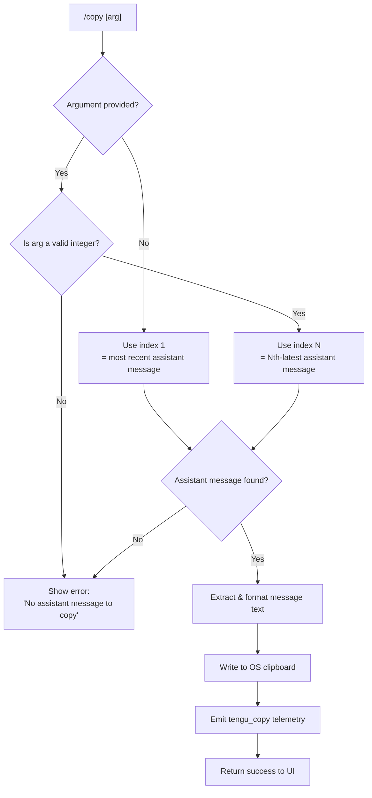

# `/copy`

> Analysis basis: CC v2.1.170 bundle.js (AST extraction + Claude interpretation)
> Minimum version: v2.1.170

---

## Overview

The `/copy` command copies Claude's most recent assistant response to the system clipboard. An optional numeric argument `N` allows the user to select the Nth-latest assistant message instead of the most recent one. The command handles OS-specific clipboard mechanisms (macOS, Linux Wayland/X11, Windows/WSL, tmux, kitty) and renders table-formatted responses as plaintext before writing them to the clipboard.

---

## Registration

| Field | Value |
|---|---|
| type | `local-jsx` |
| name | `copy` |
| description | `Copy Claude's last response to clipboard (or /copy N for the Nth-latest)` |
| loc_byte | `11178315` |
| loc_byte_end | `11178501` |
| module_id | `Fdq` |
| load_inline | `true` |
| arbor_handler.name | `MTf` |
| arbor_handler.fqn | `claude-2.1.170::MTf` |
| arbor_handler.kind | `AsyncFunction` |
| arbor_handler.resolution_path | `module_id` |
| arbor_handler.n_hits | `0` |

Analysis basis: CC v2.1.170 bundle.js:+11178315

---

## Input Branching

Four distinct branches exist based on argument parsing and message availability.



Analysis basis: CC v2.1.170 bundle.js:+11177500 (handler entry `MTf`), +11177541 (error literal `"No assistant message to copy"`), +11177610 (Number coercion), +11177624 (Number.isInteger check)

---

## Behavioral Spec

### 1. Argument Parsing

The handler `MTf` (AsyncFunction, resolved via `module_id` path) begins by reading the raw argument string from the command invocation.

```
function parseArgument(rawArg):
    if rawArg is absent or blank:
        return 1                          // default: most recent
    n = Number(rawArg)
    if not Number.isInteger(n) or n < 1:
        return ERROR("No assistant message to copy")
    return n
```

Analysis basis: CC v2.1.170 bundle.js:+11177610, +11177624

### 2. Message Extraction

The conversation history is walked by `extractNthAssistantMessage` (mapped to `mdq`), which scans the message list in reverse order for assistant-role entries.

```
function extractNthAssistantMessage(messages, n):
    assistantMessages = messages
        .filter(msg => msg.role == "assistant")
        .reverse()                        // newest first
    if assistantMessages.length < n:
        return null
    return assistantMessages[n - 1]
```

Analysis basis: CC v2.1.170 bundle.js:+11173266 (`mdq` called from `MTf`), +11173448 (literal `"assistant"`), +11177854 (`MTf` → `mdq`)

The helper `filterAssistantTextBlocks` (mapped to `pdq`) further narrows the selected message to text-type content blocks, discarding tool-use blocks and other non-text content:

```
function filterAssistantTextBlocks(message):
    if not Array.isArray(message.content):
        return []
    return message.content.filter(block => block.type == "text")
```

Analysis basis: CC v2.1.170 bundle.js:+11173518 (Array.isArray check), +11173550 (`J4` filter helper), +10929710 (literal `"text"`), +11177500 (`MTf` → `pdq`)

### 3. Text Rendering

Before writing to the clipboard, the extracted text is converted to a plain-text representation. Two rendering paths exist:

```
function renderForClipboard(textBlocks):
    joined = textBlocks.map(b => b.text).join("")
    if containsMarkdownTable(joined):
        return renderTableAsPlaintext(joined)   // formatTable path
    return joined                               // plaintext path
```

- **Table path** — the `formatTable` function (mapped to `udq`) lexes the content, detects pipe-delimited rows (literal `"\\|"` at +11172629), computes column widths using `Bun.stringWidth` (via `q8` at +11172704), aligns columns (`"center"` / `"right"` / `"left"` at +11172823, +11172865, +11172905), and joins with `" | "` (literal at +11172788).
- **Plaintext path** — the raw joined text is used directly.

Analysis basis: CC v2.1.170 bundle.js:+11173099 (lexer call), +11173212 (literal `"table"`), +11173653 (literal `"plaintext"`), +11172629, +11172788

### 4. Clipboard Write

The platform-specific clipboard writer (mapped to `UG`, called via `WKA`) selects the correct OS backend:

```
async function writeToClipboard(text, encoding):
    platform = detectPlatform()

    if platform == "macos":
        if insideScreen():
            useScreenPasteBuffer(text)       // "screen" terminal multiplexer
        elif insideKitty():
            useKittyOSC52(text)              // kitty terminal OSC 52
        elif insideTmux():
            useTmuxLoadBuffer(text)          // "load-buffer" / "-w" flag
        else:
            spawn("pbcopy", stdin=text)      // native macOS

    elif platform == "linux":
        if WAYLAND_DISPLAY set:
            spawn("wl-copy", text)           // Wayland
        elif DISPLAY set:
            try spawn("xclip", "-selection", "clipboard", text)
            fallback spawn("xsel", "--clipboard", "--input", text)
        // primary selection variants also handled

    elif platform == "wsl" or "windows":
        spawn("powershell.exe",
              ["-NoProfile", "-NonInteractive", "-Command", ...],
              text)                          // or "wsl" + "powershell"

    encode as utf-8 (base64 for OSC52 paths)
    timeout after 2000 ms
```

Key literals:
- `"pbcopy"` — macOS clipboard binary (bundle.js:+3482061)
- `"wl-copy"` — Wayland clipboard binary (bundle.js:+3481392)
- `"xclip"` — X11 clipboard binary (bundle.js:+3481461)
- `"xsel"` — X11 clipboard fallback binary (bundle.js:+3481502)
- `"powershell.exe"` — Windows clipboard command (bundle.js:+3482427)
- `"tmux"` + `"load-buffer"` + `"-w"` — tmux clipboard (bundle.js:+3481695, +3481633, +3481667)
- `"kitty"` — kitty terminal detection key (bundle.js:+3480863)
- `"screen"` — screen terminal detection (bundle.js:+3480394)
- `"utf8"` / `"base64"` — encoding modes (bundle.js:+3481796, +3481813)
- 2000 ms write timeout (bundle.js:+3482027)

Analysis basis: CC v2.1.170 bundle.js:+11178008 (`MTf` → `WKA`), +11173864 (`WKA` → `UG`)

### 5. Temporary File Handling

For some clipboard backends (notably kitty OSC 52 and screen paste-buffer), the implementation writes content through a temporary directory. The temp-directory utility (mapped to `Oj`) is invoked under `Bdq`:

```
function ensureTempDir(path):
    if path starts with "/tmp" and is not owned/controlled:
        abort with guidance to set CLAUDE_CODE_TMPDIR
    mkdirSync(path, mode 0o700)
    chmod to 0o511 after creation
```

Analysis basis: CC v2.1.170 bundle.js:+11173722 (`Bdq` → `Oj`), +4066162 (literal `"/tmp"`), +4066237 (CLAUDE_CODE_TMPDIR guidance), +4066843 (mode literal `448` = `0o700`), +4066653 (mode literal `511` = `0o777`)

### 6. Error and Guard Conditions

```
function guardAndReport(messages, n):
    if messages is null or empty:
        display "No assistant message to copy"
        return early

    target = extractNthAssistantMessage(messages, n)
    if target is null:
        display "No assistant message to copy"
        return early

    textBlocks = filterAssistantTextBlocks(target)
    if textBlocks is empty:
        display "No assistant message to copy"
        return early
```

Analysis basis: CC v2.1.170 bundle.js:+11177541 (error literal), +11177539 (guard check against `H`), +11177795 (`"message"`), +11177805 (`"messages"`)

---

## State & Side Effects

| Item | Detail |
|---|---|
| Telemetry | `tengu_copy` fired once on successful clipboard write (bundle.js:+11177919) |
| Clipboard | OS clipboard is mutated with the extracted assistant text |
| Temp files | Short-lived temp file may be created under `CLAUDE_CODE_TMPDIR` or system temp dir for OSC52/screen backends; cleaned up after write |
| appState changes | None observed in depth-2 traversal |
| Hook registration | None observed in depth-2 traversal |
| Sound | None observed in depth-2 traversal |
| Process spawn | Up to one child process spawned for the clipboard binary (`pbcopy`, `wl-copy`, `xclip`, `xsel`, `powershell.exe`); timeout of 2000 ms applied |

---

## Version History

| Version | Change |
|---|---|
| v2.1.170 | Initial analysis |

---

## Common Mistakes

1. **Using `/copy 0`** — The index is 1-based; passing `0` or a non-integer will produce the "No assistant message to copy" error rather than selecting the last message.
2. **Expecting raw Markdown in clipboard** — Table-formatted responses are re-rendered as aligned plaintext before being placed on the clipboard; the Markdown pipe syntax is replaced with padded columns.
3. **Missing clipboard binary on Linux** — The command requires `wl-copy` (Wayland), `xclip`, or `xsel` to be installed. If none is found, the write will silently fail or produce an error; there is no built-in fallback install prompt.
4. **WSL without `powershell.exe` in PATH** — On WSL environments, clipboard write depends on `powershell.exe` or the `wsl` shim being accessible; custom PATH configurations may break this.
5. **Tmux version mismatch** — The `tmux load-buffer -w` flag requires a sufficiently recent tmux; older versions will reject the `-w` flag and the write will fail.

---

## Appendix — Identifier Mapping

> For bundle debugging only. Identifiers change across versions.

| Identifier | Role |
|---|---|
| `MTf` | Main async handler for `/copy` command (arbor_handler) |
| `mdq` | Extract Nth assistant message from conversation history |
| `pdq` | Filter assistant message content to text-type blocks only |
| `udq` | Format markdown table content as aligned plaintext |
| `ATf` | Table row mapper helper (called by `udq`) |
| `_Tf` | Lexer/token accumulator for table rendering |
| `k2H` | String replacement utility used in table token processing |
| `J4` | Content block filter (text-type selector) |
| `WKA` | Clipboard write dispatcher (selects OS backend) |
| `UG` | Core clipboard writer implementation |
| `yf8` | Clipboard write sub-helper (encoding/spawn) |
| `HD` | Low-level process-spawn helper used by clipboard writer |
| `AA9` | Platform-specific clipboard command builder |
| `b8` | Spawn executor with timeout |
| `eE_` | Linux clipboard path resolver (wl-copy / xclip / xsel) |
| `RbL` | Tmux clipboard helper |
| `tE_` | Screen terminal clipboard helper |
| `X0` | Kitty OSC 52 clipboard helper |
| `jX` | Kitty escape sequence assembler |
| `_A9` | Base64 encoder for OSC 52 payload |
| `wL` | Terminal type detection utility |
| `Bdq` | Temp directory and file write orchestrator |
| `Oj` | Temp directory creation and permission enforcement |
| `j39` | Directory stat and chmod helper |
| `Tm` | Path join helper used in temp-dir setup |
| `C3` | Markdown lexer (used by table formatter) |
| `q8` | Unicode string width measurer (wraps `Bun.stringWidth`) |
| `f$K` | Daemon status file reader |
| `hu6` | Path joiner for daemon status file |
| `Xa` | Message text extraction helper |
| `hLH` | Text trimming and normalization for extracted content |
| `Udq` | Plaintext post-processor (regex replacement) |
| `CH` | JSON serializer utility |
| `S8` | Background session state classifier |
| `h6` | Config file watcher / CLAUDE.md loader |
| `B7H` | Global config reader (file I/O) |
| `d` | General low-level utility (used across multiple call sites) |