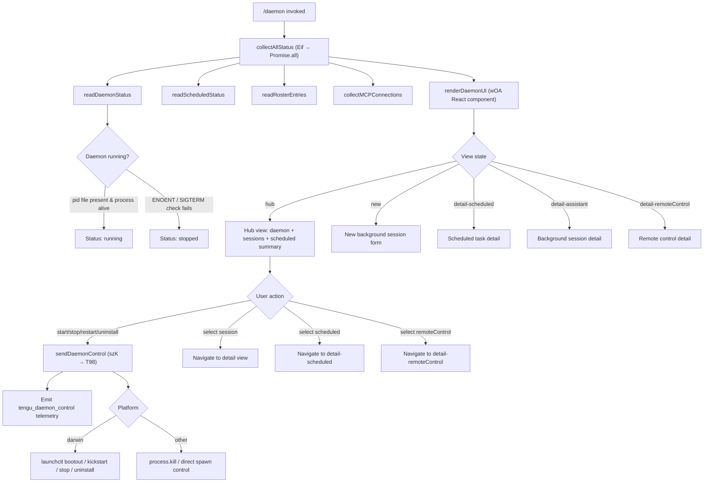

# `/daemon`

> Analysis basis: CC v2.1.170 bundle.js (AST extraction + Claude interpretation)
> Minimum version: v2.1.170

---

## Overview

The `/daemon` command provides an interactive management interface for the Claude Code background daemon and its associated subsystems. It collects status from the daemon process, scheduled tasks, background sessions, and MCP server connections, then renders a live terminal UI that allows the user to inspect and control all of these services. The command is classified as `immediate`, meaning it takes over the terminal display directly upon invocation rather than going through the normal agent turn cycle.

---

## Registration

| Field | Value |
|---|---|
| type | `local-jsx` |
| name | `daemon` |
| description | `Manage background services and routines` |
| immediate | `true` |
| module_id | `JOA` |
| load_inline | `true` |
| loc_byte | `13142419` |
| loc_byte_end | `13142587` |
| loc_line | `9663` |
| arbor_handler.name | `Eif` |
| arbor_handler.fqn | `claude-2.1.170::Eif` |
| arbor_handler.kind | `AsyncFunction` |
| arbor_handler.resolution_path | `module_id` |
| arbor_handler.n_hits | `0` |

Analysis basis: CC v2.1.170 bundle.js:+13142419

---

## Input Branching

The command has five or more distinct display branches (new/detail-scheduled/detail-assistant/detail-remoteControl views, plus the main hub view) and several daemon control sub-actions (start/stop/restart/uninstall/kickstart). A Mermaid flowchart is used.



---

## Behavioral Spec

### Top-Level Handler: `Eif` (AsyncFunction)

Analysis basis: CC v2.1.170 bundle.js:+13131169

The Arbor-resolved handler `Eif` is an async function that serves as the entry point for `/daemon`. It calls `Promise.all` over three parallel branches: `collectAllDaemonStatus` (`DOA`), `buildSessionDisplay` (`OOA`), and `sendDaemonControl` (`szK`). The results are passed to the React-based terminal renderer.

```
async function daemonCommandHandler(ctx):
    [statusData, sessionDisplay, controlResult] = await Promise.all([
        collectAllDaemonStatus(ctx),         // DOA
        buildSessionDisplay(ctx),            // OOA
        sendDaemonControlIfRequested(ctx),   // szK
    ])
    renderDaemonUI(statusData, sessionDisplay, controlResult)
```

---

### Status Collection: `collectAllDaemonStatus` (`DOA`)

Analysis basis: CC v2.1.170 bundle.js:+13130690

This function fans out to six sub-collectors using `Promise.all` and assembles a unified status object.

```
async function collectAllDaemonStatus(ctx):
    [
        scheduledStatus,
        daemonConnectionStatus,
        daemonPidStatus,
        scheduledPidStatus,
        rosterData,
        serviceState,
    ] = await Promise.all([
        readScheduledTaskList(ctx),          // lzK
        readMCPConnectionStatus(ctx),        // UzK
        readDaemonPidStatus(ctx),            // $$K
        readScheduledPidStatus(ctx),         // uOK
        readRosterFile(ctx),                 // vQ
        readLaunchctlServiceState(ctx),      // Yr
    ])
    return assembled status object
```

---

### Scheduled Task List: `readScheduledTaskList` (`lzK`)

Analysis basis: CC v2.1.170 bundle.js:+13125392

Reads the scheduled task configuration using `Promise.all` over two sub-readers: `readScheduledConfig` (`U46`) which reads a file tagged `"scheduled"` (bundle.js:+13019162) and parses JSON, and `readHubLog` (`hH`) which appends hub log entries. Errors are logged via `go.logError`.

```
async function readScheduledTaskList(ctx):
    [configEntries, hubLog] = await Promise.all([
        readScheduledConfig(ctx),    // U46 → P$A: readFile utf8, JSON.parse
        readHubLog(ctx),             // hH → jA, _6, hq, lN4
    ])
    return merged task list
```

The file encoding used is `"utf8"` (bundle.js:+12926485). `Array.isArray` validation is performed after parse (bundle.js:+12926668).

---

### Scheduled Config Reader: `readScheduledConfig` (`U46`)

Analysis basis: CC v2.1.170 bundle.js:+13019150

```
async function readScheduledConfig(ctx):
    raw = await readFile(path, "utf8")     // P$A → qU8.readFile
    trimmed = raw.trim()
    parsed = JSON.parse(trimmed)
    if not Array.isArray(parsed):
        throw new Error(...)
    for entry in parsed:
        if entry.type === "scheduled":     // literal "scheduled" at +13019162
            results.push(entry)
    return results
```

---

### Daemon PID Status: `readDaemonPidStatus` (`$$K`)

Analysis basis: CC v2.1.170 bundle.js:+12925975

Reads the file `daemon.status.json` (bundle.js:+12925689). If the file exists, validates the process with `process.kill(pid, 0)` (bundle.js:+12926172). On failure (process dead), transitions to stopped state and calls `B2` (the cleanup helper).

```
async function readDaemonPidStatus(ctx):
    pidFile = pathJoin(stateDir, "daemon.status.json")  // hu6 → L$K.join
    try:
        data = await readFile(pidFile)    // Aq
        pid = parseData(data)
        process.kill(pid, 0)             // probe: throws if process gone
        return { status: "running", pid }
    catch err:
        cleanup(err)                     // B2 → Fh
        return { status: "stopped" }
```

---

### Scheduled PID Status: `readScheduledPidStatus` (`uOK`)

Analysis basis: CC v2.1.170 bundle.js:+13017864

Reads `daemon.scheduled.status.json` (bundle.js:+13017657). Same probe pattern as daemon PID status: `process.kill(pid, 0)` (bundle.js:+13018063) to verify liveness.

```
async function readScheduledPidStatus(ctx):
    pidFile = pathJoin(stateDir, "daemon.scheduled.status.json")  // xOK → COK.join
    try:
        data = await readFile(pidFile)   // ROK.readFile
        process.kill(pid, 0)
        return { status: "running", pid }
    catch:
        cleanup()                        // B2
        return { status: "stopped" }
```

---

### Roster File Reader: `readRosterFile` (`vQ`)

Analysis basis: CC v2.1.170 bundle.js:+11650115

Reads `roster.json` (bundle.js:+11646290) from the daemon state directory. Validates modification time using `Date.now` (bundle.js:+11650059). Parses JSON with `Q6` (bundle.js:+11650115→188412). Emits telemetry `tengu_bg_roster_parse_failed` (bundle.js:+11650205) on parse errors. Performs schema validation via `ENf` which checks `Array.isArray` (bundle.js:+11650927) and `Object.keys` (bundle.js:+11650944).

```
async function readRosterFile(ctx):
    rosterPath = buildRosterPath(ctx)    // O$H → j$.join + $$H → H_
    try:
        raw = await readFile(rosterPath) // MK6.readFile
        mtimeValid = checkMtime()        // Q4A → Date.now
        data = parseHubData(raw)         // hH
        validated = validateSchema(data) // ENf
        return validated
    catch err:
        emit("tengu_bg_roster_parse_failed")
        logError(err)
        return fallback
    finally:
        rotateIfNeeded()                 // eiq → MK6.rename + Date.now
```

---

### MCP Connection Status: `readMCPConnectionStatus` (`UzK`)

Analysis basis: CC v2.1.170 bundle.js:+13118906

Calls `pTH` to enumerate MCP server slots by reading from the global store (`JCL.getStore` at bundle.js:+3418383). For each slot, checks for error code `"ENOENT"` (bundle.js:+13113468). Key display data is padded to column width using `padEnd` (bundle.js:+16554572) with two-space separator `"  "` (bundle.js:+16554593). Transport type `"same-dir"` (bundle.js:+13119073) indicates IDE-adjacent MCP servers. Also invokes `e0` to probe liveness and maps basenames via `g$H.basename` (bundle.js:+13119030).

```
async function readMCPConnectionStatus(ctx):
    store = getStore()                   // m9 → JCL.getStore
    slots = enumerateMCPSlots(store)     // pTH → Object.keys, K.has
    for slot in slots:
        try:
            pidPath = buildDaemonJsonPath(slot)   // Gx → b4A.join + H_
                                                   // "daemon.json" at +11639851
            status = probeDaemonProcess(pidPath)  // e0
            entries.push(formatEntry(slot, status))
        catch (ENOENT):
            entries.push(formatEntry(slot, "stopped"))
    return entries
```

---

### Daemon Process Probe: `e0`

Analysis basis: CC v2.1.170 bundle.js:+11639358

Reads a PID file using `kb6` (bundle.js:+11638435 → `LU.readFile`), then calls `process.kill(pid, 0)` (bundle.js:+11639386). If the process is dead, reads the CPU/memory stats via `C4A` (reads file, splits on `_.split` at bundle.js:+11639247, slices with `A.slice` at bundle.js:+11639294). Fallback calls `B2` for cleanup.

The literal `"claude daemon"` (bundle.js:+11639277) is used as a process title, and the process group priority value is `4` (bundle.js:+11639304).

---

### Service State (macOS launchctl): `readLaunchctlServiceState` (`Yr`)

Analysis basis: CC v2.1.170 bundle.js:+11643378

Invokes `b8` → `p_` which calls `launchctl` (literal `"launchctl"` at bundle.js:+11643381) with the subcommand `"print"` (bundle.js:+11643394), with a 5000 ms timeout (bundle.js:+11643428). The user ID is obtained via `giq` → `process.getuid` (bundle.js:+11640235). On macOS (`"darwin"` at bundle.js:+11642950), the plist path is constructed as `~/Library/LaunchAgents/` (literals at bundle.js:+11640166, +11640176).

```
async function readLaunchctlServiceState(ctx):
    if platform !== "darwin":
        return { available: false }
    uid = process.getuid()               // giq
    plistPath = join(homedir(), "Library", "LaunchAgents", ...)  // m4A
    result = await runWithTimeout(       // p_ → Lx8
        "launchctl", ["print", serviceLabel],
        timeout=5000
    )
    return parseServiceState(result)
```

---

### Session Display Builder: `buildSessionDisplay` (`OOA`)

Analysis basis: CC v2.1.170 bundle.js:+13115013

Reads `~/.claude` state directory via `xzK.homedir` (bundle.js:+13115052), checks existence with `nu6.stat` (bundle.js:+13115096). Applies error formatting via `EH` → `String` (bundle.js:+13115183). The literal `"assistant"` (bundle.js:+13115073) identifies assistant-type sessions.

---

### Daemon Control Dispatcher: `sendDaemonControlIfRequested` (`szK`)

Analysis basis: CC v2.1.170 bundle.js:+13131052

Routes user control actions through `T98` → `WJ6`. Supported control actions (from literals):

| Action | Literal | Location |
|---|---|---|
| `start` | `"start"` | bundle.js:+11642291 |
| `stop` | `"stop"` | bundle.js:+11642327 |
| `restart` | `"restart"` | bundle.js:+11642367 |
| `uninstall` | `"uninstall"` | bundle.js:+13131811 |
| `kickstart` | `"kickstart"` | bundle.js:+11642302 |
| `bootout` | `"bootout"` | bundle.js:+11641939 |

The restart sequence waits up to 50 polls (bundle.js:+11642595) for the daemon to stop after SIGTERM before aborting with the message: "daemon did not exit within 10s of SIGTERM; restart aborted before kickstart" (bundle.js:+11642624).

The `"service uninstall not available on darwin"` message (bundle.js:+11642071) is shown when uninstall is attempted on macOS (the macOS path uses `bootout` instead).

Emits `tengu_daemon_control` (bundle.js:+16566763) for every control action.

---

### Daemon Stop Helper (`daemon_stop` flow)

Analysis basis: CC v2.1.170 bundle.js:+16566688

The background session stop path uses the literal `"daemon_stop"` (bundle.js:+16566688) and `"daemon_stop_failed"` (bundle.js:+16566725). The stop sequence calls `z.abort()` (bundle.js:+16563125) for graceful shutdown, then `process.exit` (bundle.js:+16563104) after a 500 ms grace window (bundle.js:+16561806).

---

### React UI Component: `wOA`

Analysis basis: CC v2.1.170 bundle.js:+13131380

The terminal UI is a React functional component rendered via `M.render` (bundle.js:+13141792). It uses `lq.useState` for view state and `lq.useRef` for refs. The main view state string is initialized to `"hub"` (bundle.js:+13131507). View strings found in literals:

| View Key | Literal | Location |
|---|---|---|
| `hub` | `"hub"` | +13131507 |
| `new` | `"new"` | +13132098 |
| `detail-scheduled` | `"detail-scheduled"` | +13132000 |
| `detail-assistant` | `"detail-assistant"` | +13132158 |
| `detail-remoteControl` | `"detail-remoteControl"` | +13132279 |

The component also handles session state types: `"system"` (+13132531), `"remoteControl"` (+13132576). Display labels include `"Scheduled"` (+13132927), `"Remote Control"` (+13133248), `"Claude daemon"` (+13133533). Permission-gating is referenced via `"permission"` (+13133631).

The supervisor concept uses literal `"supervisor"` (bundle.js:+16544412). Config reload emits `tengu_daemon_config_reload` (bundle.js:+16545205).

---

### Background Session Lifecycle

Analysis basis: CC v2.1.170 bundle.js:+16529563

Background session states observed in literals:

| State | Location |
|---|---|
| `"closed"` | +16529563 |
| `"claimed"` | +16531272 |
| `"spawned"` | +16531640 |
| `"active"` | +4221042 |
| `"working"` | +16536192 |
| `"blocked"` | +16536085 |
| `"bg"` | +16536356 |
| `"idle"` | +16536796 |
| `"crashed"` | +16536031 |
| `"done"` | +16535847 |
| `"killed"` | +16535865 |
| `"resuming"` | +16537681 |

The background session dispatcher uses `SIGTERM` (bundle.js:+16531656) for graceful shutdown and escalates to `SIGKILL` (bundle.js:+16529749) if the process does not exit within 30 seconds (literal `30` at bundle.js:+16529656), with a 15-second intermediate poll (literal `15` at bundle.js:+16529667). Emits `tengu_bg_dispatch_sigkill_escalate` (bundle.js:+16529701) on escalation.

Low-memory conditions check free memory via `N2A.freemem` (bundle.js:+16530132) and emit `tengu_bg_dispatch_low_mem` (bundle.js:+16530302). macOS-specific low-memory checks are routed through `dU8` with platform literal `"macos"` (bundle.js:+13199916) and emit `tengu_bg_low_mem_mb` (bundle.js:+13199943).

Spare session lifecycle emits `tengu_bg_spare_enable` (bundle.js:+16531006) when a spare slot is activated and `tengu_bg_spare_claim` / `tengu_bg_spare_claim_fail` (bundle.js:+16531134, +16531400) on claim attempts.

---

### MCP Server Connection Management (within daemon UI)

Analysis basis: CC v2.1.170 bundle.js:+6708287

The daemon UI embeds a full MCP connection lifecycle manager (`aSH` → `M.render`). Connection types displayed: `"stdio"` (+6708487), `"sse-ide"` (+6708586), `"ws-ide"` (+6708622), `"claudeai-proxy"` (+6708894), `"disabled"` (+6708385).

Reconnect events emit `tengu_mcp_reconnect` (+6707085), `tengu_mcp_reconnect_not_connected` (+6707101), `tengu_mcp_reconnect_needs_auth_discovery` (+6707413), `tengu_mcp_reconnect_failed` (+6707798).

OAuth flow within daemon MCP management emits `tengu_mcp_oauth_flow_start` (+6481584), `tengu_mcp_oauth_flow_success` (+6486365), `tengu_mcp_oauth_flow_error` (+6487750). The OAuth callback server binds to `127.0.0.1` (bundle.js:+6485842) with a 300,000 ms (5-minute) authentication timeout (bundle.js:+6485939).

---

## State & Side Effects

| Item | Detail |
|---|---|
| Telemetry: `tengu_daemon_control` | Fired on every start/stop/restart/kickstart/bootout/uninstall action (bundle.js:+16566763) |
| Telemetry: `tengu_bg_roster_parse_failed` | Fired when `roster.json` cannot be parsed (bundle.js:+11650205) |
| Telemetry: `tengu_daemon_config_reload` | Fired when the daemon config is reloaded during UI display (bundle.js:+16545205) |
| Telemetry: `tengu_bg_dispatch_sigkill_escalate` | Fired when SIGTERM grace period expires and SIGKILL is sent (bundle.js:+16529701) |
| Telemetry: `tengu_bg_dispatch_low_mem` | Fired when dispatcher detects low memory (bundle.js:+16530302) |
| Telemetry: `tengu_bg_low_mem_mb` | macOS-specific low memory reading (bundle.js:+13199943) |
| Telemetry: `tengu_bg_spare_enable` | Fired when spare session slot is enabled (bundle.js:+16531006) |
| Telemetry: `tengu_bg_spare_claim` | Fired when a spare session is successfully claimed (bundle.js:+16531134) |
| Telemetry: `tengu_bg_spare_claim_fail` | Fired on spare claim failure (bundle.js:+16531400) |
| Telemetry: `tengu_bg_sendclaim_failed` | Fired when sending a session claim message fails (bundle.js:+16508741) |
| Telemetry: `tengu_bg_state_read_transient` | Fired on transient state-file read errors (bundle.js:+4214406) |
| Telemetry: `tengu_bg_dispatch_sigkill_escalate` | See above |
| Telemetry: `tengu_scheduled_task_missed` | Fired when a scheduled task is detected as missed (bundle.js:+16034551) |
| Telemetry: `tengu_mcp_oauth_flow_start` | MCP OAuth flow initiated (bundle.js:+6481584) |
| Telemetry: `tengu_mcp_oauth_flow_success` | MCP OAuth flow succeeded (bundle.js:+6486365) |
| Telemetry: `tengu_mcp_oauth_flow_error` | MCP OAuth flow failed (bundle.js:+6487750) |
| Telemetry: `tengu_mcp_reconnect` | MCP server reconnect attempted (bundle.js:+6707085) |
| Telemetry: `tengu_mcp_reconnect_not_connected` | Reconnect found server not connected (bundle.js:+6707101) |
| Telemetry: `tengu_mcp_reconnect_needs_auth_discovery` | Reconnect hit auth gate (bundle.js:+6707413) |
| Telemetry: `tengu_mcp_reconnect_failed` | Reconnect failed (bundle.js:+6707798) |
| Telemetry: `tengu_mcp_skills` | MCP skills enumerated (bundle.js:+6587132) |
| Telemetry: `tengu_feature_ok` / `tengu_feature_bad` | Feature flag evaluation (bundle.js:+1014205, +1014267) |
| Telemetry: `tengu_config_auth_loss_prevented` | Auth loss prevention guard triggered (bundle.js:+3303113) |
| Telemetry: `tengu_iron_gate_closed` | Permission gate closed a request (bundle.js:+7257797) |
| Telemetry: `tengu_bg_session_create` | Background session creation recorded via literal `"daemon_bg_session_create"` (bundle.js:+16530017) |
| File reads | `daemon.status.json`, `daemon.scheduled.status.json`, `roster.json`, `daemon.json` per MCP slot, `mcp-needs-auth-cache.json` |
| Process signals | `process.kill(pid, 0)` (probe), `SIGTERM` (stop), `SIGKILL` (escalation) |
| macOS launchctl | `launchctl print`, `launchctl bootout`, `launchctl kickstart` on darwin |
| Hook registration | `N9` → `LTA.register` (bundle.js:+62328) registers a cleanup hook |
| Unmount | `M.unmount` (bundle.js:+13142006) called on command exit |
| React render | `M.render` (bundle.js:+13141792) — full-screen Ink/React terminal UI |
| appState changes | `E.stop` / `E.start` / `E.updateConfig` (bundle.js:+16544800–16544827) on daemon lifecycle transitions |
| Sound | None detected in depth-2 traversal |

---

## Version History

| Version | Change |
|---|---|
| v2.1.170 | Initial analysis |

---

## Common Mistakes

1. **Expecting a prompt response**: `/daemon` is registered as `immediate` and renders a full-screen terminal UI rather than producing conversational output. Calling it inside an agent loop or scripted session will intercept standard I/O unexpectedly.
2. **Running stop/restart on non-macOS expecting launchctl**: The restart and stop paths use `launchctl` only on `"darwin"`. On Linux the daemon is controlled via direct `process.kill` / spawn, so service-level persistence (auto-restart on reboot) is not available.
3. **Assuming uninstall is available on macOS**: The code explicitly guards uninstall with the message "service uninstall not available on darwin" (bundle.js:+11642071); use `bootout` on macOS instead.
4. **Ignoring the 10-second SIGTERM grace window on restart**: If the daemon process does not exit within 10 seconds of SIGTERM (50 polls, bundle.js:+11642595), the restart is aborted before `kickstart` runs. The user must manually clean up the PID file.
5. **Reading stale roster data**: `roster.json` modification time is validated at read time. Stale data causes `tengu_bg_roster_parse_failed` to be emitted and a fallback value to be returned silently; the UI will appear to show no background sessions even if some exist on disk.
6. **OAuth timeout**: The MCP OAuth callback server times out after 300,000 ms (5 minutes, bundle.js:+6485939). If the user does not complete browser authentication within this window, the flow emits `tengu_mcp_oauth_flow_error` and no credentials are stored.

---

## Appendix — Identifier Mapping

> For bundle debugging only. Identifiers change across versions.

| Identifier | Role |
|---|---|
| `Eif` | Top-level daemon command async handler (arbor_handler) |
| `hif` | Inner UI render orchestrator called by `Eif` |
| `DOA` | `collectAllDaemonStatus` — fans out to all status sub-collectors |
| `QGH` | Sub-helper called by `DOA` at start |
| `lzK` | `readScheduledTaskList` — reads scheduled task config and hub log |
| `U46` | `readScheduledConfig` — file reader for scheduled tasks |
| `P$A` | File-read-and-parse helper (utf8 readFile + JSON.parse + Array validation) |
| `c$A` | Array validation helper used by scheduled config reader |
| `hH` | Hub log reader / appender |
| `jA` | Error-to-string normalizer |
| `_6` | String coercion utility |
| `hq` | Essential-traffic queue helper |
| `lN4` | Rolling log buffer (shift/push on `di6`) |
| `e0` | Daemon process liveness probe (readFile PID + `process.kill(pid,0)`) |
| `kb6` | PID file reader used by process probe |
| `C4A` | CPU/memory stats reader (readFile + split + slice) |
| `B2` | Cleanup helper called on dead process detection |
| `UzK` | `readMCPConnectionStatus` — enumerates MCP slot statuses |
| `pTH` | MCP slot enumerator (reads global store, iterates `Object.keys`) |
| `m9` | Global store accessor (`JCL.getStore`) |
| `V8` | Error code checker / validator |
| `$OA` | MCP slot helper called by `pTH` → `MOA` |
| `EH` | String formatter / error message builder |
| `K` | Column-padding display helper (`L.map` + `f.padEnd`) |
| `Gx` | Path builder for `daemon.json` (`b4A.join` + `H_`) |
| `$$K` | `readDaemonPidStatus` — reads `daemon.status.json` and probes PID |
| `hu6` | State-directory path builder (`L$K.join` + `H_`) |
| `uOK` | `readScheduledPidStatus` — reads `daemon.scheduled.status.json` |
| `xOK` | Scheduled status path builder (`COK.join` + `H_`) |
| `vQ` | `readRosterFile` — reads and validates `roster.json` |
| `Q6` | JSON.parse wrapper |
| `O$H` | Roster path builder (`j$.join` + `$$H`) |
| `$$H` | Inner path component builder (`j$.join` + `H_`) |
| `k8` | Error-code extractor / checker |
| `Q4A` | Modification time checker (`Date.now`) |
| `d` | Generic utility / data helper |
| `Qf` | Validation helper (`V8`) |
| `eiq` | Roster file rotator (`MK6.rename` + `Date.now` + `hH`) |
| `ENf` | Roster schema validator (`Array.isArray` + `Object.keys`) |
| `J1` | String formatter helper (`ff6`) |
| `Yr` | `readLaunchctlServiceState` — macOS service state reader |
| `b8` | launchctl command runner wrapper |
| `p_` | Process spawner with timeout (calls `launchctl print`) |
| `C6` | Process output parser |
| `Lx8` | launchctl UID-based invocation helper |
| `giq` | UID getter (`process.getuid`) |
| `OOA` | `buildSessionDisplay` — enumerates display sessions from home dir |
| `W_` | Path utility (`xZ`) |
| `wr6` | Path join wrapper (`n6` + `k8`) |
| `N` | Notification / output emitter (writes to stream, formats messages) |
| `PeK` | Message formatter |
| `MTA` | Inline message builder (`GaK` + `TaK`) |
| `H` | Random/timeout utility or state object (context-dependent) |
| `CH` | JSON.stringify wrapper |
| `u4` | String redaction / truncation helper (`[REDACTED]` literal) |
| `FZA` | Map-based formatter (`weK.map`) |
| `A` | Array/string utility (toLowercase etc.) |
| `zFH` | Stream writer (`yZA` → `H.write`) |
| `EeK` | Log-file write helper (mkdir, appendFile, stat, rename, unlink) |
| `mBH` | Buffered writer with flush timer (`clearTimeout`, `setTimeout`, `setImmediate`) |
| `L4H` | Log path builder (`PM6`, `E6H.join`, `H_`, `v6`) |
| `$M6` | V8 error checker |
| `cZA` | Conditional log path builder |
| `La8` | Log-file rotation handler (stat, endsWith `.txt`, rename, unlink) |
| `TeK` | Log-file append worker (mkdir, appendFile, rotation) |
| `N9` | Cleanup hook registrar (`LTA.register`) |
| `M` | React/Ink render manager (`aSH`, `Ic8`, `IPA` etc.) |
| `aSH` | MCP server connection manager (main React tree entry) |
| `pn` | MCP slot processor |
| `nE6` | MCP slot name formatter |
| `kt` | MCP config-level connection handler (enterprise/user/project/local) |
| `Ag` | SDK-type server aggregator |
| `zJ8` | Status colour mapper (`w6.red`, `w6.yellow`) |
| `cE6` | SSE/HTTP server connector |
| `vV` | Connection cache accessor (`kY`) |
| `kY` | Cached connection resolver (`vJH`, `h6`, `Aq`) |
| `Tm_` | Cache removal helper |
| `F8` | Display flag helper |
| `BZ6` | Filter predicate helper |
| `Cg9` | Connection state hash builder (`zU_`, `yPH`, `aD8`) |
| `zU_` | State store reader for MCP (`m9`, `Rj8`, `Q6`) |
| `yPH` | Hash computation (`CH`, `Array.isArray`, `Object.keys`, `fp9.createHash sha256`) |
| `aD8` | Tool-list hasher (`eAH`, `Object.keys`) |
| `sD8` | Combined hash builder |
| `QP` | Content hash builder (`CH`, `Ch9.createHash`) |
| `rD8` | Cache key builder (`y4`) |
| `y4` | EE1-based key derivation |
| `M8` | MCP debug logger (`fQH.push`, `go.logMCPDebug`) |
| `bJ8` | Single MCP server connection orchestrator |
| `fX7` | MCP connection factory |
| `Dc` | Connection wrapper (`hu`, `cK`) |
| `sAH` | Claude.ai proxy connector |
| `tAH` | Connection timeout manager |
| `$1H` | MCP OAuth-capable connection handler (full OAuth server logic) |
| `feH` | Connection promise registry (`NJ8`) |
| `D` | Forced-shutdown helper (`Qj`, `process.exit`, `z.abort`) |
| `uJ8` | Auth cache reader (`m9`, `Rj8`) |
| `Fn` | MCP reconnect handler |
| `hu` | Connection state accessor (`cK`) |
| `Y` | Supervisor manager (`pTH`, `q.write`, `f.get/set/delete`, `E.stop/start/updateConfig`) |
| `U7` | MCP error logger (`fQH.push`, `go.logMCPError`) |
| `MX7` | Connection timeout helper |
| `LX7` | SSH connection path handler (`M6.isSSH`, `_6`, `Yq`) |
| `xJ8` | `complete_authentication` tool handler |
| `LeH` | In-flight connection lookup (`vJ8.get`) |
| `MeH` | Pending connection lookup (`NJ8.get`) |
| `L` | Promise registry wrapper (`q.add`, `f.finally`, `q.delete`) |
| `Fg9` | Connection state broadcaster (`kj8.then`, `zU_`, `m9`, `Rj8`, `CH`) |
| `Rj8` | Needs-auth cache path builder (`Sj8.join`, `H_`) |
| `Rm_` | Connection result applier (`QP`, `y4`, `M8`, `EH`) |
| `J` | Session kill helper (`A.values`, `S.kill`) |
| `S` | Background session spawner/controller (`icK`, `j3`, `N`, `hH`) |
| `VN` | Skills reporter (`Y6`) |
| `Y6` | Skills telemetry emitter (`uP6`, `mP6`, `Lm`, `XJH`) |
| `Gm_` | Connection guard checker (`W8`, `A.includes`) |
| `W8` | Global config reader with auth-loss guard |
| `y` | Warning message emitter |
| `mg9` | Async iterator / mapper (`SF`) |
| `SF` | Generic async mapper (TypeError, Number.isSafeInteger, AggregateError) |
| `CeH` | Integer parser helper (`parseInt`) |
| `Cj8` | Port-number parser (`parseInt`) |
| `Ic8` | MCP update applier (`H.applyMcpUpdate`, `oSH`, `M8`, cleanup) |
| `oSH` | Tool hash computer (`yPH`) |
| `pE` | MCP server cleanup and reconnect helper (`SeH`, `K.cleanup`, `VN`) |
| `SeH` | Server status checker (`yPH`) |
| `$` | Daemon heartbeat helper (`f$K`) |
| `f$K` | Heartbeat writer (`Xa`, `Date.now`, `m9`, `hu6`, `CH`) |
| `Xa` | Lock-file helper (`hLH`) |
| `IPA` | MCP client list renderer (`Object.entries`, `A.filter`, `_.getClients`, `WJ8`, `o8`) |
| `WJ8` | Auth-gate checker (`bj7.has`, `vm_.has`) |
| `o8` | Async operation serializer with timeout |
| `O` | S8-based status object |
| `szK` | `sendDaemonControlIfRequested` dispatcher |
| `T98` | Daemon control router (`WJ6`) |
| `WJ6` | Control action executor (has/add/filter with Set) |
| `lwL` | Command parser and model-selector helper |
| `wOA` | Main daemon UI React component (useState, useRef, DOA call) |
| `I1` | Clock context consumer (`S79.useContext`) |
| `f` | Session/connection closer (`A.close`, `q.close`, `L`) |
| `L4` | Ref+context+memo hook bundle (`Ss.useRef`, `Ss.useContext`, `Ss.useMemo`) |
| `z` | Render lifecycle manager (`SH`, `xH`, `ih`, `ZU`) |
| `SH` | Success renderer (`d`, `K6`) |
| `K6` | ff6-based key |
| `xH` | Error renderer (`d`, `K6`) |
| `ih` | Ink render host (`nu`, `sc.push`, `UNH`, `Ww_`) |
| `nu` | Ink instance factory (`mC`) |
| `UNH` | Unmount helper (`nh`) |
| `Ww_` | Render-to-string helper (`_98`, `Xw_.randomUUID`, `glH`, `uB`, `H.emit`) |
| `ZU` | Shutdown orchestrator (`Promise.race`, `Promise.all`, `cLH`, `lLH`, `o8`, `process.exit`) |
| `cLH` | Graceful shutdown caller (`dLH.shutdown`) |
| `lLH` | Shutdown timeout clearer (`clearTimeout`, `UT_`) |
| `W` | Teammate mailbox manager (`vRH`) |
| `vRH` | Mailbox read/write orchestrator (`ZRH`, `N`, `Yz`, `fMH`, `F8`) |
| `ZRH` | Mailbox path resolver (`L5`, `uH6`, `yP8.join`, `wzH`, `N`) |
| `L5` | Home-dir path helper (`hG`) |
| `uH6` | Path replacer (`H.replace`) |
| `wzH` | Teams path builder (`Nr8.join`, `H_`) |
| `Yz` | Object merge helper (`fY_`, `Object.assign`) |
| `fMH` | Mailbox file reader (`ZRH`, `m9`, `Q6`, `V8`, `hH`) |
| `j` | Session list manager |
| `w` | Background session dispatcher (main worker loop) |
| `b` | Background session state machine |
| `IhH` | Session file reader (readFile utf-8, K5H, P9, hH, Aq, Array.isArray, N, CH, pk) |
| `HsH` | Session directory writer (mkdir, writeFile, map over `.claude`) |
| `mX9` | Stale session filter (`H.filter`, `eaH`) |
| `P` | Stream buffer/parser (Buffer.concat, indexOf, EH) |
| `X` | Socket timeout manager (`M`, `q.setTimeout`) |
| `c` | Session process map (`kb6`, `piq`) |
| `FpK` | Summary formatter (`H.map`, `DN`, `Math.max`, `q.join`) |
| `FAH` | Session aggregator (`j6H`, `IhH`, `q.filter`, `A.has`, `HsH`) |
| `dU8` | macOS memory monitor (`a6`, `Y6`) |
| `oW6` | Pins file reader (`_W.readFile`, `Kk_`, `Q6`, `Array.isArray`) |
| `Kk_` | Pins path builder (`Dj.join`, `VE`) |
| `crL` | Directory-based pins reader (`_W.readdir`, `Promise.all`, `Dj.join`, `mO9`) |
| `Q` | Session lifecycle manager (`lH6`, `LQ`) |
| `lH6` | Inbound request handler (`Dg_`, `Ov6`, `eh`, `N`) |
| `LQ` | Outbound request dispatcher (`a4`, `lP`, `GJ`, `_6`) |
| `W2A` | Session claim sender (`nQ.claim`, `cYA`, `dj5`, `Qj5`, `K.socketAuth`) |
| `cYA` | Claim directory/file writer (`a6`, `iQ.mkdir`, `iQ.writeFile`, `JSON.stringify`) |
| `dj5` | Claim timeout handler (`Date.now`, `Error`, `V8`, `o8`) |
| `Qj5` | Claim frame builder (`nQ.buildClaimFrame`) |
| `dV` | Binary frame encoder (`Buffer.from`, `CH`, `Buffer.allocUnsafe`, `writeUInt32BE`, `writeUInt8`) |
| `v2A` | Session work runner (core bg-session tick loop) |
| `sK` | Session path builder (`Dj.join`, `VE`) |
| `Wq` | Session state watcher (`_W.stat`, `xfH`, `SjH`, `drL`, `Q6`) |
| `MO` | Session active-state handler (`tv`) |
| `hjH` | Tool filter/mapper (`K.startsWith`, `bfH.has`, `X$8.has`, `_k_.has`) |
| `Sf` | Session context builder (`AO`, `Dj.join`, `CH`, `wj`) |
| `$K6` | Log tail watcher (`Hrq.then`, `vQ`, `Date.now`, `ZNf`) |
| `xb6` | Log path builder (`j$.join`, `Cb6`) |
| `z$H` | Session state-dir path builder (`j$.join`, `TmH`) |
| `qZ` | Session split helper (`a6`, `j$.join`, `TmH`, `H.split`) |
| `VQ` | Session entry builder (`a6`, `B4A`, `j$.join`, `fK6`) |
| `bb6` | Session base path builder (`j$.join`, `Cb6`) |
| `AK6` | Daemon uninstall helper for darwin (`m4A`, `b8`, `Lx8`, `SqH.unlink`, `EH`) |
| `m4A` | LaunchAgent plist path builder (`hb6.join`, `x4A.homedir`) |
| `Rb6` | Daemon restart helper (`p4A`) |
| `p4A` | Daemon start/restart sequence (`Lx8`, `b8`, `Fiq.setTimeout`) |
| `E` | Session rate limiter (`G`, `Math.max`, `Math.min`) |
| `G` | Core agent runner (`V76`, `CS`, `vN`, `Promise.all`, `nn`, `tF`, `hH`, `jA`) |
| `V76` | Agent config accessor |
| `T` | Task state tracker (`BZ6`, `V76`) |
| `V` | Server/listener handle |

---

Note: index built via Arbor fallback; some signals (telemetry, literals) may be missing — see arbor-fallback.js.