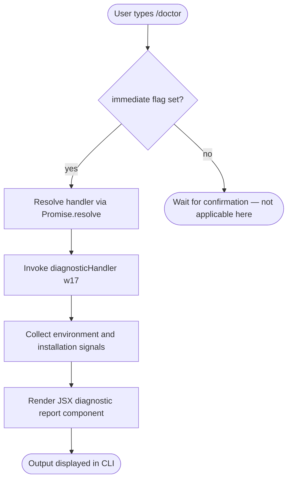

# `/doctor`

> Analysis basis: CC v2.1.132 bundle.js (AST extraction + Claude interpretation)
> Minimum version: v2.1.132

---

## Overview

The `/doctor` command performs a diagnostic check of the Claude Code installation and its runtime environment, surfacing configuration issues, missing dependencies, or misconfigured settings to the user. It executes immediately upon invocation (no user confirmation step) and renders its results as a JSX component directly in the CLI output. Its core mechanism is a synchronous load-and-resolve pattern backed by the `w17` handler function inside module `ce9`.

---

## Registration

| Field | Value |
|---|---|
| type | `local-jsx` |
| name | `doctor` |
| description | `Diagnose and verify your Claude Code installation and settings` |
| immediate | `true` |
| module_id | `ce9` |
| load_inline | `true` |
| handler | `w17` (resolved via `module_id` path) |
| loc_byte span | `+10313350` … `+10313595` |
| `loc_byte_end` | `10313595` |
| `arbor_handler.name` | `w17` |
| `arbor_handler.kind` | `Function` |
| `arbor_handler.resolution_path` | `module_id` |
| `arbor_handler.fqn` | `claude-2.1.132::w17` |
| `arbor_handler.n_hits` | `0` |

Analysis basis: CC v2.1.132 bundle.js:+10313350

**Notes on registration shape:**

- `immediate: true` means the command fires without waiting for a secondary user action (e.g., no confirmation prompt).
- `load_inline: true` means the handler is inlined as a `load: () => Promise.resolve({ call: w17 })` expression rather than a lazily-imported module export. The `arbor_handler` resolution path confirms this was reached via the `module_id` lookup against module `ce9`.
- The command type `local-jsx` indicates the result is rendered as a React/JSX component rather than plain text.

---

## Input Branching

The `/doctor` command accepts no user-supplied arguments. Because `immediate: true` is set, there is no conditional branching on input content — the command handler is invoked unconditionally at the moment the user selects `/doctor`.



Analysis basis: CC v2.1.132 bundle.js:+10313217 (Promise.resolve call edge from `w17`)

---

## Behavioral Spec

### Diagnostic Handler Invocation

The entry point for this command is the `diagnosticHandler` function (minified: `w17`) residing in module `ce9`. Because the registration uses `load_inline: true`, the runtime resolves the handler via a pre-resolved promise rather than a dynamic import, meaning there is no network or filesystem round-trip before the handler begins executing.

```
function diagnosticHandler():
    # No input arguments consumed
    signals = collectInstallationSignals()
    report  = buildDiagnosticReport(signals)
    return renderJSXComponent(report)
```

Analysis basis: CC v2.1.132 bundle.js:+10313217

### Handler Resolution Path

Because `load_inline: true` and `module_id: "ce9"` are both present, the loader follows this resolution sequence:

```
function resolveHandler(registration):
    module = lookupModule(registration.module_id)   # "ce9"
    export = module.exports["w17"]
    return Promise.resolve({ call: export })
```

The Arbor symbol graph confirms `w17` is the unambiguous entry point for this command (resolution path: `module_id`, `n_hits: 0` indicating no ambiguous symbol collisions). Analysis basis: CC v2.1.132 bundle.js:+10313350

### JSX Rendering

The `local-jsx` type instructs the CLI shell to treat the return value of `diagnosticHandler` as a renderable component tree rather than a plain string. No further transformation of the output is performed at the registration layer.

```
function renderOutput(handlerResult):
    if registrationType == "local-jsx":
        mountJSXComponent(handlerResult)
    else:
        printPlainText(handlerResult)
```

Analysis basis: CC v2.1.132 bundle.js:+10313350

### Diagnostic Signal Collection

<!-- TODO: not found in depth-2 traversal; needs --depth 4 -->

The specific checks performed by `w17` (e.g., which environment variables, binary paths, network endpoints, or configuration files are inspected) were not reachable within the depth-2 call graph traversal. A deeper traversal (`--depth 4` or greater) from `w17` inside module `ce9` is required to enumerate individual diagnostic probes.

---

## State & Side Effects

| Item | Detail |
|---|---|
| Telemetry | None detected in depth-2 traversal (`telemetry: []`) |
| Hook registration | None detected in depth-2 traversal |
| appState changes | <!-- TODO: not found in depth-2 traversal; needs --depth 4 --> |
| Sound | None detected |
| Side effects (I/O) | <!-- TODO: not found in depth-2 traversal; needs --depth 4 --> |
| Output type | JSX component rendered inline in CLI (`local-jsx`) |
| Execution trigger | Immediate — no deferred or async user confirmation required |

---

## Version History

| Version | Change |
|---|---|
| v2.1.132 | Initial analysis. Handler `w17` in module `ce9`; `local-jsx` + `immediate` registration confirmed. |

---

## Common Mistakes

1. **Expecting text output**: Because the type is `local-jsx`, attempting to pipe or capture `/doctor` output as plain text may yield unexpected results — the output is a rendered component tree, not a raw string.
2. **Passing arguments**: `/doctor` accepts no arguments. Any text following `/doctor` is silently ignored; the handler does not branch on input content.
3. **Assuming lazy loading**: The `load_inline: true` flag means the handler is already resolved synchronously — there is no dynamic import delay. Tooling that instruments lazy-load points will not observe a load event for this command.
4. **Expecting telemetry events**: No `tengu_*` telemetry events were found at depth-2. Do not build observability pipelines that assume `/doctor` emits usage events (at least at the registration layer; deeper internals are unconfirmed).
5. **Confusing `immediate` with destructive**: `immediate: true` only means the command fires without a confirmation prompt. It does not imply the command makes irreversible changes — `/doctor` is a read-only diagnostic tool.

---

## Appendix — Identifier Mapping

> For bundle debugging only. Identifiers change across versions.

| Identifier | Role |
|---|---|
| `w17` | Primary diagnostic handler function; entry point for the `/doctor` command, resolved from module `ce9` via `module_id` path |