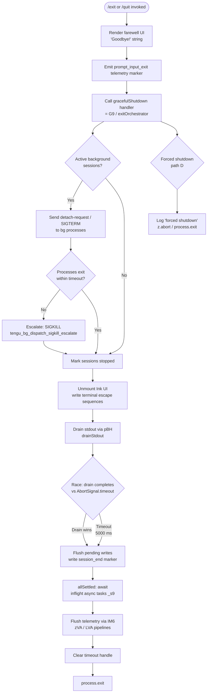

# `/exit`

> Analysis basis: CC v2.1.170 bundle.js (AST extraction + Claude interpretation)
> Minimum version: v2.1.170

---

## Overview

`/exit` (aliased as `/quit`) is a local, immediately-executed command that terminates the current Claude Code CLI session. On invocation it renders a brief farewell message ("Goodbye!"), fires teardown hooks across the application, and ultimately calls `process.exit` to terminate the process, with optional graceful drain and background-process cleanup along the way.

---

## Registration

| Field | Value |
|---|---|
| type | `local-jsx` |
| name | `exit` |
| aliases | `["quit"]` |
| description | `null` |
| immediate | `true` |
| module_id | `e5K` |
| load_inline | `true` |
| loc_byte | `12828334` |
| loc_byte_end | `12828530` |
| loc_line | `9130` |
| arbor_handler.name | `nQf` |
| arbor_handler.fqn | `claude-2.1.170::nQf` |
| arbor_handler.kind | `AsyncFunction` |
| arbor_handler.resolution_path | `module_id` |
| arbor_handler.n_hits | `1` |

Analysis basis: CC v2.1.170 bundle.js:+12828334

---

## Input Branching

The exit flow contains more than three distinct execution paths: the happy path where UI unmounts cleanly, an I/O-drain path with a timeout race, a background-process teardown path, and a forced-shutdown escalation path. A Mermaid flowchart is therefore used.



Analysis basis: CC v2.1.170 bundle.js:+12827583 through +12827766

---

## Behavioral Spec

### 1. Command Entry — farewell render and telemetry marker

When the user types `/exit` or `/quit`, the `immediate: true` flag causes the runtime to invoke `nQf` (exitCommandHandler) synchronously without waiting for a normal prompt cycle.

```
async function exitCommandHandler(context):
    render JSX element containing farewell text ("Goodbye!")  // +12827547, +12827660
    call detachOrQueue(context)                               // X9 → _wH  (+12827583)
    call randomDelayFn()                                      // H (+12827595)
    call sendDetachRequest()                                  // H$H (+12827599)
    call updateAppState(uM)                                   // +12827616
    call scheduledTaskCleanup(Xb8)                           // +12827630
    emit telemetry marker: "prompt_input_exit"               // +12827771
    call exitOrchestrator(G9)                                // +12827766
```

Analysis basis: CC v2.1.170 bundle.js:+12827583

---

### 2. Detach / Background Session Bookkeeping

Before tearing down the UI, the handler signals any background ("bg") sessions that the foreground is leaving.

```
function sendDetachRequest(msgBus, queue):
    // H$H (+11185321)
    enqueue message of type "detach-request"    // literal +11185355
    call queueFlush(rdq)                        // +11185340
        rdq → fR8 (flush write)                // +11179642
        rdq → S8  (state update, value 0)      // +11179655, +11179694 ("task")
    call writeToSocket(ei)                      // +11185346
        ei → ne.write                          // +10524179
        ei → CH → JSON.stringify               // +10524188
    call VqH (confirm dispatch)                // +11185401
```

Analysis basis: CC v2.1.170 bundle.js:+11185321

---

### 3. Scheduled Task Cleanup

Any in-flight scheduled tasks registered under the "scheduled task" label are retired before shutdown.

```
function scheduledTaskCleanup(taskRegistry):
    // Xb8 (+11178549)
    call initTimer(mT → xZ)                    // +11178549
    push sentinel to task list (H.push)        // +11178554
    call parseAndRetireTask(OTf)               // +11178595
        OTf → parseDescription(DN)            // +11178681
        OTf → parseTimeSpec(pk)               // +11178698
        OTf → parseScheduleOffset(saH)        // +11178714
        OTf → Math.max / Date.now             // +11178773, +11178796
        OTf → computeNextRun(k9)              // +11178830
    call truncateDisplay(kq)                   // +11178610
        kq → measureStringWidth(q8 → Bun.stringWidth)  // +211754
```

Analysis basis: CC v2.1.170 bundle.js:+11178549

---

### 4. Exit Orchestrator — graceful shutdown sequence

`G9` (exitOrchestrator) is the core teardown sequencer. It races a drain timeout against stdout flush, cleans up UI components, and ultimately calls `process.exit`.

```
async function exitOrchestrator(appState, config):
    // G9 (+7340747)

    // Phase 1 — UI teardown
    call unmountInkUI(sRH)                          // +7340815
        sRH → PMH.writeSync (terminal restore)      // +7338426
        sRH → H.unmount                             // +7338504
        sRH → Kb  (cursor restore)                  // +7338538
        sRH → wM8 (terminal escape sequences)       // +7338586
            wM8 → write ESC-7 / ESC-8 sequences    // literals +3832152, +3832163
            wM8 → detect tmux/screen env            // X0 +3832222
            wM8 → sanitize output (N)               // +3832249

    // Phase 2 — Print exit path diagnostics
    call printExitPath(rg_)                          // +7340821
        rg_ → PMH.writeSync                         // +7338883
        rg_ → styleDim (w6.dim)                     // +7338899
        rg_ → resolveProjectRoot (gv6)              // +7338745
        rg_ → sanitizePath (rg_ → _.replaceAll)     // +7338784

    // Phase 3 — Determine exit timing
    maxWait = Math.max(5000, 3500)                   // literals +7340844, +7340851
    setTimeout handle stored as C2H.unref()         // +7340860

    // Phase 4 — Drain stdout
    await drainStdout(pBH → LTA.drain)              // +7340940
    race([drain, AbortSignal.timeout(2000)])         // +7340964, literal +7341029

    // Phase 5 — Stop supervisor / MCP connections
    call stopSupervisor(Y)                           // +7341018
        Y → pTH (write final session stats)         // +16544387
        Y → bzK (format stats table)                // +16544606
        Y → T.stop / f.delete                       // +16544680, +16544689
        Y → E.stop / E.updateConfig / E.start       // +16544800, +16544809, +16544827
        Y → ccK → V_H (heartbeat stop)              // +16544929
        Y → V.start (restart policy)                // +16544985

    // Phase 6 — Await inflight promises
    await allSettledInflight(_s9)                    // +7341089
        _s9 → Promise.allSettled + Array.from       // +13443530

    // Phase 7 — Flush telemetry / perf data
    await flushTelemetry(IM6)                        // +7341165
        IM6 → Xa8 → zVA (metric aggregation)        // +218294
        IM6 → LVA (write perf log)                  // +218309
            LVA → VzH (fsync write)                 // +218427
            LVA → emit tengu_startup_perf            // (telemetry)
        IM6 → JSON.stringify                         // +218513

    clearTimeout(savedHandle)                        // +7341041

    // Phase 8 — Emit session_end and exit
    call flushFinalMarker(j28)                       // +7341178
        j28 → da9 (compute session duration)        // +7340287
            da9 → Date.now / Math.max / Math.round  // +7336869
            da9 → Object.assign / ga9              // +7337149
        j28 → Z1  (render final summary)            // +7340304
        emit "session_end"                          // literal +7341241
    write literal "session_end" via PMH.writeSync   // +7341311

    call cacheEvictionHint(Cf6)                     // +7341190
        → emit tengu_cache_eviction_hint

    call finalCleanup(f6 → ff6)                     // +7341238

    call forceExitIfNeeded(eRH)                     // +7341285
        eRH → Promise.resolve then w28              // +7340407

    // Forced-shutdown sub-path (D +4832973)
    if forced:
        log "forced shutdown"                        // literal +16563085
        z.abort()                                   // +16563125
        process.exit()                              // +16563104
```

Analysis basis: CC v2.1.170 bundle.js:+7340747

---

### 5. Farewell UI Component

The `lQf` component (farewellComponent) wraps the string `"Goodbye!"` inside a JSX element rendered by the `y3A.createElement` call, delegating styling to `EW`.

```
function farewellComponent():
    // lQf (+12827753) → EW (+12827538)
    return createElement(EW, { text: "Goodbye!" })  // literal +12827547
```

Analysis basis: CC v2.1.170 bundle.js:+12827547

---

### 6. Forced Background-Process Escalation

If background worker processes do not exit cleanly, `w` (bgSessionManager) escalates:

```
function bgSessionManager(session):
    // w (+16529583)
    if session.state == "closed":                        // literal +16529563
        wait 30s then 15s grace                          // literals +16529656, +16529667
        b.kill("SIGKILL")                                // literal +16529749, +16529742
        emit tengu_bg_dispatch_sigkill_escalate          // +16529701
    if freemem below threshold:
        emit tengu_bg_dispatch_low_mem                   // +16530302
    if spare pool enabled:
        emit tengu_bg_spare_enable                       // +16531006
        on claim: emit tengu_bg_spare_claim              // +16531134
        on fail:  emit tengu_bg_spare_claim_fail         // +16531400
    spawn new session via nQ.spawn                       // +16531463
    on ENOENT/ECONNREFUSED: classify error               // literals +16531309, +16531331
```

Analysis basis: CC v2.1.170 bundle.js:+16529583

---

## State & Side Effects

| Item | Detail |
|---|---|
| Telemetry — `tengu_bg_dispatch_sigkill_escalate` | Fired when a background session is sent SIGKILL (bundle.js:+16529701) |
| Telemetry — `tengu_bg_dispatch_low_mem` | Fired when low memory triggers background session management (bundle.js:+16530302) |
| Telemetry — `tengu_bg_spare_enable` | Fired when the spare background session pool is enabled (bundle.js:+16531006) |
| Telemetry — `tengu_bg_spare_claim` | Fired when a spare session is successfully claimed (bundle.js:+16531134) |
| Telemetry — `tengu_bg_spare_claim_fail` | Fired when spare session claim fails (bundle.js:+16531400) |
| Telemetry — `tengu_daemon_config_reload` | Fired on daemon config reload during teardown (bundle.js:+16545205) |
| Telemetry — `tengu_startup_perf` | Startup performance data flushed on exit (bundle.js:+219980) |
| Telemetry — `tengu_scroll_summary` | Scroll summary emitted during session wind-down (bundle.js:+7340260) |
| Telemetry — `tengu_amber_creek` | Internal session-path telemetry (bundle.js:+3490662) |
| Telemetry — `tengu_pewter_brook` | Internal session-path telemetry (bundle.js:+3490570) |
| Telemetry — `tengu_cache_eviction_hint` | Cache eviction hint sent to daemon before exit (bundle.js:+7341203) |
| Terminal state | Ink UI unmounted; terminal cursor/scroll position restored via ESC-7/ESC-8 sequences (bundle.js:+3832152, +3832163) |
| Stdout drain | `LTA.drain` is awaited, raced against a 2 000 ms `AbortSignal.timeout` (bundle.js:+7340964, +7341029) |
| Inflight promises | `Promise.allSettled` collects remaining async work before exit (bundle.js:+13443530) |
| Telemetry flush | Performance/metric log fsynced to disk via `VzH` before process exit (bundle.js:+188246) |
| `process.exit` | Called in both normal path and forced-shutdown path (bundle.js:+7339091, +16563104) |
| `prompt_input_exit` literal | Written as a final marker via `PMH.writeSync` (bundle.js:+12827771) |
| `session_end` literal | Written as final audit marker (bundle.js:+7341241, +7341311) |
| Supervisor / MCP connections | Stopped via `E.stop` / `T.stop` and heartbeat halted (bundle.js:+16544680, +16544800) |
| Background session signal | `"detach-request"` message sent to bg sessions before teardown (bundle.js:+11185355) |
| Scheduled tasks | Pending scheduled tasks retired during cleanup (bundle.js:+11178595) |
| Goodbye message | String literal `"Goodbye!"` rendered in terminal (bundle.js:+12827547) |

---

## Version History

| Version | Change |
|---|---|
| v2.1.170 | Initial analysis |

---

## Common Mistakes

1. **Using `/exit` mid-task expecting instant termination**: because `immediate: true` bypasses the prompt queue but the shutdown *sequence* is asynchronous (drain, allSettled, telemetry flush), the process may linger up to ~5 s before the OS process actually exits. This is by design.
2. **Expecting background sessions to be killed immediately**: background sessions receive a `"detach-request"` / SIGTERM first; SIGKILL escalation only follows after a 30 s + 15 s grace window (bundle.js:+16529656, +16529667).
3. **Assuming `/quit` behaves differently from `/exit`**: the `aliases` field lists `"quit"` as a direct alias; both names resolve to the same handler `nQf`.
4. **Relying on a `description` in help output**: the `description` field is `null`, so `/exit` may not appear in help listings that filter out null-description commands.
5. **Calling `/exit` while stdout is piped and expecting no flush delay**: the 2 000 ms drain race (bundle.js:+7341029) still runs; piped environments with slow consumers may hit the timeout branch rather than the clean-drain branch.

---

## Appendix — Identifier Mapping

> For bundle debugging only. Identifiers change across versions.

| Identifier | Role |
|---|---|
| `nQf` | exitCommandHandler — async main handler for `/exit` |
| `X9` | detachOrQueue — routes exit notification to background context |
| `_wH` | bgContextWriter — writes to background worker context |
| `H` | randomDelayFn — introduces jittered delay (uses Math.random + setTimeout) |
| `H$H` | sendDetachRequest — enqueues detach-request message |
| `Q_8` | queueHead — head-of-queue accessor |
| `rdq` | flushQueue — drains the outbound message queue |
| `fR8` | socketFlushWrite — low-level write flush |
| `S8` | queueStateUpdate — updates queue state to idle (0 / "task") |
| `ei` | writeToSocket — serializes and writes message to socket |
| `CH` | jsonSerializer — wraps JSON.stringify |
| `VqH` | dispatchConfirm — confirms message was dispatched |
| `uM` | appStateUpdater — updates central app state on exit |
| `Xb8` | scheduledTaskCleanup — retires pending scheduled tasks |
| `mT` | timerInit — initializes timer subsystem (→ xZ) |
| `xZ` | timerCore — core timer primitive |
| `OTf` | taskParser — parses scheduled task descriptors |
| `DN` | descriptionParser — parses cron-style description strings |
| `K` | cronPatternBuilder — builds cron pattern strings (map + padEnd) |
| `w` | bgSessionManager — manages background session lifecycle |
| `L` | asyncTaskTracker — tracks inflight async tasks (add/delete/finally) |
| `J` | sessionKiller — iterates sessions and sends kill signals |
| `D` | forcedShutdown — calls process.exit with forced-shutdown label |
| `$` | specialCaseHandler — handles edge-case exit paths |
| `j` | weekdayResolver — resolves UTC day-of-week for scheduling |
| `pk` | timeSpecParser — parses human-readable time specifications |
| `o87` | timeTokenizer — splits and tokenizes time strings |
| `A` | labelLowercaser — normalises label casing (toLowerCase) |
| `saH` | scheduleOffsetCalc — computes schedule offset from base time |
| `_` | dateTimeHelper — general date/time utility object |
| `O` | mutableDate — mutable Date wrapper for schedule computation |
| `f` | connectionRegistry — registry of active MCP connections (close/delete) |
| `q` | dataEventEmitter — event emitter for "data" events |
| `k9` | durationFormatter — formats durations (floor + round) |
| `kq` | displayTruncator — truncates strings to display width |
| `q8` | stringWidthMeasure — measures string width via Bun.stringWidth |
| `u1` | unicodeLayoutCalc — Unicode-aware layout calculator |
| `LD` | layoutDelegate — layout helper called by unicodeLayoutCalc |
| `lQf` | farewellComponent — JSX component rendering "Goodbye!" |
| `G9` | exitOrchestrator — main async shutdown sequencer |
| `sRH` | inkUnmounter — unmounts Ink UI and restores terminal |
| `Kb` | cursorRestorer — restores terminal cursor state |
| `wM8` | terminalEscapeWriter — writes terminal save/restore escape sequences |
| `_yH` | terminalCapabilityCheck — checks terminal capabilities (ghostty/iTerm2) |
| `ikH` | escapeSequenceHelper — builds terminal escape strings |
| `X0` | tmuxEscapeHandler — handles tmux double-escape sequences |
| `j3` | terminalOutputSanitizer — sanitizes terminal output strings |
| `N` | debugLogFormatter — formats debug log entries |
| `rg_` | exitPathPrinter — prints exit path diagnostics to terminal |
| `uT` | pathResolver — resolves filesystem paths |
| `qu` | quietOutputGuard — suppresses output when quiet mode active |
| `v6` | fileExistenceCheck — checks whether a path exists |
| `gv6` | projectRootResolver — resolves current project root path |
| `tR` | rootPathHelper — helper for root path computation |
| `W_` | workdirHelper — working directory helper |
| `n6` | pathNormalizer — normalises path separators |
| `O$` | gitRootResolver — resolves git root directory |
| `e4` | repoMetaFetcher — fetches repository metadata |
| `la9` | legacyExitPrinter — prints legacy exit format |
| `og_` | hardExitFn — performs hard process.exit / process.kill |
| `pBH` | stdoutDrainer — drains stdout buffer (→ LTA.drain) |
| `Y` | supervisorStopper — stops supervisor and MCP connections |
| `pTH` | sessionStatWriter — writes final session statistics |
| `m9` | asyncStoreGetter — retrieves value from AsyncLocalStorage |
| `V8` | versionMetadata — version metadata object |
| `$OA` | metricsObject — session metrics aggregation object |
| `EH` | stringCoercer — coerces values to String |
| `bzK` | statsTableFormatter — formats statistics into aligned table |
| `T` | mcpConnectionManager — manages MCP connection objects |
| `BZ6` | mcpConnectionStateA — MCP connection state variant A |
| `V76` | mcpConnectionStateB — MCP connection state variant B |
| `E` | mcpClientManager — manages MCP client lifecycle |
| `G` | mcpClientCore — core MCP client operations |
| `ccK` | heartbeatStopper — stops the supervisor heartbeat timer |
| `V_H` | heartbeatCore — heartbeat timer implementation |
| `V` | restartPolicyManager — manages session restart policy on exit |
| `d` | configDelegate — general configuration delegate |
| `_s9` | inflightAwaiter — awaits all inflight async operations |
| `IM6` | telemetryFlusher — flushes buffered telemetry to disk |
| `Xa8` | metricAggregator — aggregates raw metric samples |
| `zVA` | metricNormalizer — normalises and deduplicates metrics |
| `LVA` | perfLogWriter — writes startup perf log to disk |
| `$VA` | perfLogPathResolver — resolves the perf log file path |
| `VzH` | syncFileWriter — writes file with fsync guarantee |
| `_VA` | profilingReportBuilder — builds startup profiling report string |
| `$u` | nodeRequireWrapper — wraps Node.js require for perf_hooks |
| `OVA` | altPerfLogPathResolver — alternate perf log path resolver |
| `j28` | sessionEndEmitter — emits session_end event and final markers |
| `ca9` | sessionContextGetter — retrieves current session context |
| `da9` | sessionDurationCalc — calculates session duration metrics |
| `ga9` | durationAggregator — aggregates duration sub-fields |
| `Z1` | finalSummaryRenderer — renders final session summary |
| `B6H` | platformChecker — checks platform/OS identifiers |
| `LZ_` | renderModeSelector — selects terminal render mode |
| `Ms` | fullscreenModeCheck — checks whether fullscreen mode is active |
| `KZ_` | windowsSSHChecker — detects Windows-over-SSH (ConPTY) environment |
| `Q_` | renderOutputWriter — writes rendered output to terminal |
| `QbL` | summaryLineBuilder — builds summary line for session end |
| `Y6` | sessionEventEmitter — emits session lifecycle events |
| `Cf6` | cacheEvictionHintSender — sends cache eviction hint to daemon |
| `f6` | finalCleanupFn — performs final cleanup tasks |
| `ff6` | cleanupCore — core cleanup implementation |
| `eRH` | exitPromiseWrapper — wraps exit in a resolved promise for async compatibility |
| `w28` | exitResolutionHandler — handles resolved exit promise |

---

Note: index built via Arbor fallback; some signals (telemetry, literals) may be missing — see arbor-fallback.js.