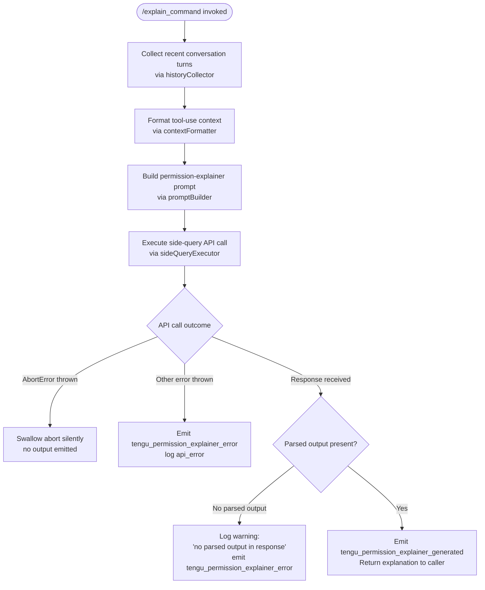

# `/explain_command`

> Analysis basis: CC v2.1.170 bundle.js (AST extraction + Claude interpretation)
> Minimum version: v2.1.170

---

## Overview

`/explain_command` is an internal tool-type command that generates a human-readable explanation of why a given tool call requires the permissions it does. It invokes a dedicated "permission explainer" side-query against the language model, parses the structured output, and surfaces the result to the user — or records a telemetry error if the model response cannot be parsed.

---

## Registration

| Field | Value |
|---|---|
| type | `tool` |
| name | `explain_command` |
| description | `null` |
| loc_byte | `14459131` |
| loc_byte_end | `14459167` |
| loc_line | `11365` |
| arbor_handler.name | `FIK` |
| arbor_handler.fqn | `claude-2.1.170::FIK` |
| arbor_handler.kind | `AsyncFunction` |
| arbor_handler.resolution_path | `direct` |
| arbor_handler.n_hits | `1` |

Analysis basis: CC v2.1.170 bundle.js:+14459131

---

## Input Branching

The handler contains 4+ distinct outcome paths (success with parsed output, abort error, generic API error, no-parsed-output warning), so a Mermaid flowchart is used.



Analysis basis: CC v2.1.170 bundle.js:+14459664 (abort branch), +14459826 (error telemetry), +14459961 (no-output warning), +14459614 (success telemetry)

---

## Behavioral Spec

### 1. Conversation History Collection

```
function collectRecentHistory(conversationMessages, maxTurns=3, maxCharsPerTurn=1000):
    # Walks the message list in reverse; picks assistant turns
    # Truncates each turn's text content to avoid oversized context
    # Returns a compact list of recent assistant messages
    assistantTurns = filter(conversationMessages, role == "assistant")
    recent = reverse(assistantTurns)[:maxTurns]
    truncated = [truncateText(turn, maxCharsPerTurn) for turn in recent]
    return truncated
```

Analysis basis: CC v2.1.170 bundle.js:+14458407 (`W75` filter+reverse), +14458430 (literal `"assistant"`), +14458450 (literal `3`), +14458533 (literal `"text"`)

The implementation selects up to **3** most-recent assistant turns (bundle.js:+14458450) and limits text content while appending `"..."` as an ellipsis sentinel (bundle.js:+14458626) when truncated.

---

### 2. Context Formatting

```
function formatToolUseContext(toolUseBlock):
    # Serializes the tool-use block to a stable JSON string
    # Converts to string for embedding in the prompt
    serialized = JSON.stringify(toolUseBlock)
    return String(serialized)
```

Analysis basis: CC v2.1.170 bundle.js:+14458341 (`P75` → `CH` → `JSON.stringify`), +14458367 (`String` cast)

---

### 3. Tool Classification

```
function classifyTool(toolName):
    if toolName starts with "mcp__":
        return "mcp_tool"
    else:
        return internal tool classification via permissionResolver
```

Analysis basis: CC v2.1.170 bundle.js:+14459664 (`r9`), +2480188 (`H.startsWith`), +2480201 (literal `"mcp__"`), +2480220 (literal `"mcp_tool"`)

MCP-namespaced tools (`mcp__` prefix) are explicitly identified as `"mcp_tool"` before the explainer prompt is built.

---

### 4. Permission Explainer Side-Query

```
async function runPermissionExplainer(toolUseContext, recentHistory, toolClass):
    # Assembles a structured prompt for the model requesting a permission explanation
    # Uses the "permission_explainer" system prompt category
    # Fires a side_query (non-interactive API call)
    prompt = buildExplainerPrompt(toolUseContext, recentHistory, toolClass)
    startTime = Date.now()
    emit telemetry: "permission_explainer_generate" [start marker]
    try:
        response = await sideQueryExecutor(prompt, label="permission_explainer")
        parsedOutput = extractStructuredOutput(response)
        if parsedOutput is None:
            log warning: "Permission explainer: no parsed output in response"
            emit telemetry: tengu_permission_explainer_error
            return null
        emit telemetry: tengu_permission_explainer_generated
        return parsedOutput
    catch AbortError:
        return null          # silent; user cancelled
    catch anyError:
        emit telemetry: tengu_permission_explainer_error, detail="api_error"
        return null
```

Analysis basis: CC v2.1.170 bundle.js:+14459036 (`z9` side-query invocation), +14459049 (`$p` API executor), +14459716 (literal `"permission_explainer_generate"`), +14459961 (literal `"Permission explainer: no parsed output in response"`), +14459614 (`tengu_permission_explainer_generated`), +14459826 (`tengu_permission_explainer_error`), +14460284 (literal `"AbortError"`), +14460355 (literal `"api_error"`)

---

### 5. Side-Query Executor (sideQueryExecutor / `$p`)

The side-query path is a full API call stack used for lightweight, non-streaming model queries. Key observed behaviors at depth-2:

```
async function sideQueryExecutor(prompt, options):
    # Builds request with label "side_query"
    # Sets a request timeout cap of 600000 ms (10 minutes)
    # Applies conversation history compression
    # Handles authentication (OAuth / API key) via authResolver
    # Sends via the standard HTTP fetch path
    # Returns raw API response for caller to parse
```

Analysis basis: CC v2.1.170 bundle.js:+13660356 (literal `"side_query"`), +3215129 (literal `600000`, timeout), +13661909 (`Date.now` timing), +13661233 (surrogate sanitisation path)

---

### 6. Configuration & Auth Subsystem (observed in call graph)

During the side-query the handler transitively calls:
- **Config loader** (`B7H` / configLoader): reads config JSON with `utf-8` encoding (bundle.js:+3308049); raises `"Config accessed before allowed."` if called too early (bundle.js:+3307966); handles `ENOENT` (bundle.js:+3308196)
- **OAuth token refresh** (`cG_` / oauthRefresher): performs locking, retries, and emits a rich set of OAuth telemetry events (see State & Side Effects)
- **Auth resolver** (`qO` / authResolver): reads `ANTHROPIC_API_KEY` env var (bundle.js:+3243600); falls back to `apiKeyHelper` (bundle.js:+3243694); raises a multi-source error if none available (bundle.js:+3244069)

---

## State & Side Effects

| Item | Detail |
|---|---|
| Telemetry — primary | `tengu_permission_explainer_generated` (success path, bundle.js:+14459614) |
| Telemetry — error | `tengu_permission_explainer_error` (no-output or API error, bundle.js:+14459826) |
| Telemetry — config | `tengu_config_parse_error` (config read failure, bundle.js:+3308597) |
| Telemetry — OAuth | `tengu_oauth_token_refresh_race_resolved`, `tengu_oauth_token_refresh_lock_acquiring`, `tengu_oauth_token_refresh_lock_acquired`, `tengu_oauth_token_refresh_lock_retry`, `tengu_oauth_token_refresh_lock_retry_limit_reached`, `tengu_oauth_token_refresh_lock_error`, `tengu_oauth_token_refresh_starting`, `tengu_oauth_token_refresh_race_recovered`, `tengu_oauth_refresh_token_marked_dead_invalid_grant`, `tengu_oauth_refresh_token_cleared_on_disk`, `tengu_oauth_token_refresh_lock_releasing`, `tengu_oauth_token_refresh_lock_released`, `tengu_oauth_token_refresh_lock_release_error` |
| Telemetry — stream | `tengu_stream_watchdog_default_on`, `tengu_byte_stream_idle_timeout_ms`, `tengu_byte_watchdog_fired_late` |
| Telemetry — API | `tengu_api_success` (bundle.js:+13661937) |
| Telemetry — misc | `tengu_lone_surrogate_sanitized`, `tengu_config_auth_loss_prevented`, `tengu_feature_ok`, `tengu_feature_bad`, `tengu_feature_sad` |
| appState changes | None directly; side-query result is returned to caller without mutating shared state |
| Hook registration | File-watcher registered via `BSL`/fileWatcher (bundle.js:+3304217 `V78.watchFile`); unwatched on cleanup (bundle.js:+3304550 `V78.unwatchFile`) for config hot-reload |
| Network I/O | One outbound HTTPS API call per invocation (side-query executor) |
| File I/O | Config read (`q.readFileSync`), config backup write (`q.copyFileSync`), directory creation (`q.mkdirSync`) during config-layer initialisation |
| Abort handling | `AbortError` is caught and swallowed — the command exits silently with no output when the user cancels |
| Timeout | Side-query hard timeout: **600,000 ms** (10 minutes) (bundle.js:+3215129) |

---

## Version History

| Version | Change |
|---|---|
| v2.1.170 | Initial analysis |

---

## Common Mistakes

1. **Expecting visible output on abort**: If the session is cancelled mid-explanation, `/explain_command` swallows the `AbortError` and produces no output. This is intentional, not a bug.
2. **Assuming synchronous completion**: The handler is an `AsyncFunction`; callers must `await` it or handle the returned Promise to receive the explanation.
3. **Missing auth configuration**: If neither `ANTHROPIC_API_KEY`, `ANTHROPIC_AUTH_TOKEN`, `CLAUDE_CODE_OAUTH_TOKEN`, nor WIF env vars are set, the underlying auth resolver throws before the side-query is sent (bundle.js:+3244069).
4. **Interpreting `null` return as empty explanation**: A `null` return can mean abort, API error, or unparseable model output. Callers must distinguish these cases via the telemetry events rather than the return value alone.
5. **Re-using across model families without updating tool classification**: The MCP-prefix check (`mcp__`) is hardcoded; custom tool names that collide with the prefix string may be misclassified as MCP tools.

---

## Appendix — Identifier Mapping

> For bundle debugging only. Identifiers change across versions.

| Identifier | Role |
|---|---|
| `FIK` | Main async handler for `explain_command` (arbor_handler) |
| `DjA` | Entry-point wrapper called by `FIK`; dispatches to config and session setup |
| `h6` | Session/config initialisation orchestrator |
| `n6` | Utility: node/path helper (used in config and backup paths) |
| `hT_` | Internal helper called during session setup |
| `B7H` | Config file loader (reads JSON, handles ENOENT/EEXIST, creates backups) |
| `Q6` | JSON parse wrapper |
| `ku` | String prefix-stripping utility |
| `V8` | Config value validator/defaulter |
| `L69` | Backup directory scanner |
| `N` | Platform/OS info formatter (debug strings, `toUpperCase`) |
| `d` | Logger / event emitter (used broadly) |
| `CT_` | Backup path builder (`$w.join` + `H_`) |
| `w` | Background daemon process manager |
| `BSL` | Config file-watcher registrar |
| `qF` | Helper called from config watcher |
| `N9` | Hook registrar (`LTA.register`) |
| `P75` | Tool-use context formatter (JSON.stringify + String cast) |
| `CH` | JSON serialiser wrapper |
| `W75` | History collector (filter assistant turns, reverse, truncate) |
| `H` | Random/timeout utility |
| `A` | Case-normalisation helper (`toLowerCase`) |
| `f` | File handle / stream wrapper |
| `L` | Pending-request tracker (add/delete set) |
| `Jo` | Unicode-safe string slicer (surrogate-aware) |
| `z9` | Side-query invoker (calls `Bc`, `B9`, `JD`) |
| `Bc` | Side-query argument assembler |
| `tY` | Sub-utility used in side-query assembly |
| `QU` | Sub-utility used in side-query assembly |
| `Uh` | Model-name resolver / anthropic-prefix handler |
| `M` | MCP server registry |
| `K` | Padding/formatting helper |
| `_88` | Object-entries enumerator |
| `KlH` | Model-family inclusion checker |
| `kT1` | Model-index finder |
| `bML` | Model-flag tester |
| `Uc` | Disallowed-model-name checker (`MNH.includes`) |
| `B9` | Model-string normaliser (trim, toLowerCase, replacements) |
| `xML` | Model-string prefixer |
| `JD` | Side-query request builder |
| `yG` | Request-options composer |
| `NA` | Auth resolver orchestrator |
| `C8H` | Account-type resolver: "max" tier |
| `eDH` | Account-type resolver: "team" / `default_claude_max_5x` |
| `$lH` | Account-type resolver: "enterprise" / `enterprise_usage_based` |
| `AE` | Auth-mode selector (mantle / firstParty) |
| `m2` | Request decorator (NA + wq helpers) |
| `Yf` | Auth-flow helper |
| `r_` | Message-role validator |
| `Y7` | API-message builder |
| `Sv` | Streaming/non-streaming request switcher |
| `$p` | Side-query API executor (main HTTP call path) |
| `HF` | Full API call orchestrator (auth, headers, streaming) |
| `jD` | AsyncLocalStorage store reader |
| `vG_` | URL/path segment splitter |
| `X9` | App-type discriminator (`_wH`) |
| `Za` | Bedrock store reader |
| `b_8` | Bedrock token store reader |
| `v6` | Provider URL builder |
| `xZ` | URL normaliser |
| `bz_` | URL encoder (replace + encodeURIComponent) |
| `_6` | String coercion helper |
| `_O` | OAuth token checker/refresher entry point |
| `cG_` | OAuth token refresh lock orchestrator |
| `xT1` | Boolean coercion wrapper |
| `IY` | Profile/credential resolver |
| `a7` | Profile lookup helper |
| `Aj` | OAuth profile handler |
| `sL` | Message-role sanitiser |
| `$P` | Credential store accessor |
| `qO` | Auth credential resolver (API key / OAuth / WIF) |
| `TP6` | Profile initialisation helper |
| `biH` | Byte-range helper |
| `E$` | Error formatter |
| `LhL` | Request-header builder |
| `yiH` | Timestamp/date header helper |
| `F_` | Feature-flag reader |
| `He6` | Proxy-auth helper runner |
| `UvH` | Proxy config reader |
| `$K1` | Proxy URL builder |
| `$a4` | Integer timeout parser |
| `Rh` | HTTP request retrier |
| `N2` | Error-code extractor |
| `whL` | HTTP request sender / stream handler |
| `ee1` | Request-log formatter |
| `fzH` | Request-ID generator |
| `kx1` | Session-context injector (calls `h6`) |
| `kG_` | Agent-context injector (calls `h6`) |
| `JhL` | Response-header scrubber (redacts authorization) |
| `HH9` | String builder helper |
| `te1` | Timing recorder |
| `zhL` | Byte-count / token-count calculator |
| `YhL` | Streaming byte-watchdog |
| `ZY` | Provider-type resolver |
| `PD6` | Provider-type mapper |
| `eLL` | Provider-prefix checker |
| `XD6` | Provider enum normaliser |
| `EY` | Proxy settings resolver |
| `CK` | String constructor wrapper |
| `yc` | Proxy URL parser |
| `eQH` | ZLib/GB compression helper |
| `OK1` | Proxy credential checker |
| `If_` | IP / hostname validator |
| `hf_` | Proxy scheme validator |
| `DhL` | Request-log emitter |
| `ae1` | Log-entry formatter |
| `fhL` | API call pre-processor (NZH + E$) |
| `iL8` | API call inner loop (z9, W1, hI) |
| `hI` | Response decoder |
| `BBH` | Request-body builder |
| `NZH` | Beta-header resolver |
| `o1` | OAuth endpoint validator |
| `LwH` | Gateway JWT refresh handler |
| `Fi8` | Timestamp helper |
| `R3L` | Gateway refresh HTTP caller |
| `rF6` | Refresh-token store writer |
| `Bi8` | Date.now wrapper |
| `MP6` | Header normaliser (toLowerCase) |
| `OJH` | SDK error logger |
| `R` | stdout/terminal writer |
| `Y` | Ink/TUI renderer |
| `h` | Background-worker scheduler / sweep loop |
| `y` | Worker-pool map |
| `l` | Grace-clock scheduler |
| `$m6` | Free-memory checker |
| `KDK` | Memory-threshold calculator |
| `oW6` | Claude settings file reader |
| `hH` | Telemetry event emitter |
| `F` | Active-worker set |
| `F8` | Worker-state resolver |
| `c` | Spare-worker pool |
| `cU8` | Memory threshold formatter |
| `Y6` | Worker launch/adopt helper |
| `n` | Voice recording finisher |
| `k` | Request pipeline |
| `E` | Token-budget calculator |
| `G` | MCP connection manager |
| `O0` | Auth-context selector |
| `TwH` | WIF token exchanger |
| `LnH` | WIF credential resolver |
| `SH` | Status-display helper |
| `xH` | Status-display helper (variant) |
| `twL` | Include-filter for WIF |
| `T` | Token-cache manager |
| `BZ6` | Token-cache getter |
| `V76` | Token-cache setter |
| `X` | HTTP client with timeout |
| `JkH` | Request context builder |
| `W1` | Tool-use block formatter |
| `eJ` | Tool-name normaliser |
| `Er8` | Tool-schema helper |
| `E3` | Tool-input replacer |
| `Ch` | Conversation-role checker |
| `W` | Message-array manager |
| `vRH` | Teammate-mailbox reader |
| `ZRH` | Mailbox-path builder |
| `Yz` | Mailbox message merger |
| `fMH` | Mailbox-file reader |
| `$` | File-system abstraction |
| `pH6` | Mailbox-entry filter |
| `m9` | JCL store reader |
| `xef` | Conversation finder |
| `RYA` | SHA-256 hash builder |
| `u_8` | User-agent string builder |
| `Rz_` | Sub-agent flag injector |
| `R78` | Request-role validator |
| `RRH` | Repl-thread context resolver |
| `Pr8` | Thread-name matcher |
| `Wr8` | Thread-filter helper |
| `uv` | HIPAA-mode checker |
| `uG_` | HIPAA resolver |
| `wkH` | Jailbreak-filter flag resolver |
| `jz_` | Jailbreak-list checker |
| `ZXK` | Tool-array deduplicator |
| `H78` | Prompt-temperature resolver |
| `u2` | Message-content mapper |
| `$2H` | Tool-call request assembler |
| `uB` | Random-bytes ID generator |
| `W8` | Global config writer |
| `gL` | Conversation-context injector |
| `CZA` | System-prompt cache-control inserter |
| `wQ6` | Cache-control block builder |
| `fh` | Deep-clone (structuredClone wrapper) |
| `jQ6` | User-message cache-control inserter |
| `RZA` | Cache-control string replacer |
| `LzH` | Side-query label helper |
| `J1` | ff6 bootstrapper |
| `ff6` | Module initialiser |
| `f06` | Agent-name resolver |
| `Tz9` | Built-in agent checker |
| `woL` | Agent-set membership tester |
| `KaH` | Custom-agent resolver |
| `RZ` | ff6 module reference |
| `L06` | Agent-lookup orchestrator |
| `S$8` | SHA-256 hash helper for agent IDs |
| `Hn` | Agent-path resolver |
| `DoL` | Agent-type prefix stripper |
| `R$8` | Agent-path segment resolver |
| `lD_` | Path index/slice helper |
| `lu` | Thread-name prefix checker |
| `xf6` | Side-query response post-processor |
| `r9` | Tool-type classifier (mcp__ prefix check) |
| `f6` | ff6 reference (inner) |
| `s6` | Status display writer |
| `K6` | ff6 reference (display) |
| `EH` | String-coercion error formatter |

---

Note: index built via Arbor fallback; some signals (telemetry, literals) may be missing — see arbor-fallback.js.