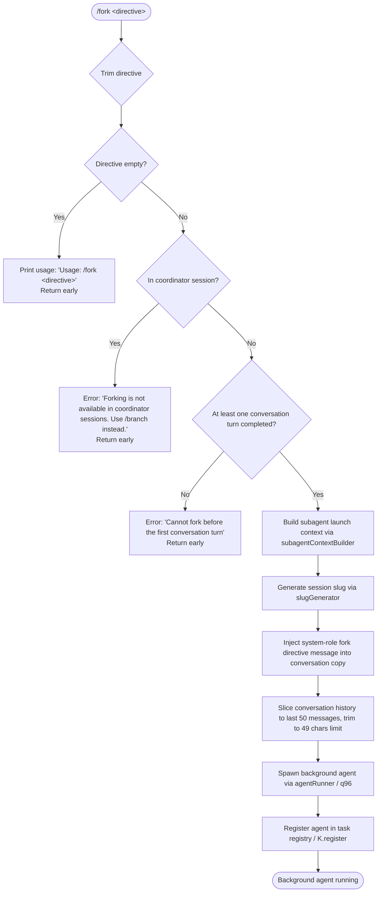

# `/fork`

> Analysis basis: CC v2.1.170 bundle.js (AST extraction + Claude interpretation)
> Minimum version: v2.1.170

---

## Overview

`/fork` spawns a background agent that inherits the full current conversation context. The user supplies a `<directive>` string that the forked agent uses as its initial task. The command is unavailable in coordinator sessions and requires that at least one conversation turn has occurred before invocation.

---

## Registration

| Field | Value |
|---|---|
| type | `local-jsx` |
| name | `fork` |
| description | `Spawn a background agent that inherits the full conversation` |
| argumentHint | `<directive>` |
| module_id | `hLK` |
| load_inline | `true` |
| loc_byte | `12659908` |
| loc_byte_end | `12660111` |
| loc_line | `8991` |
| arbor_handler.name | `KFf` |
| arbor_handler.fqn | `claude-2.1.170::KFf` |
| arbor_handler.kind | `AsyncFunction` |
| arbor_handler.resolution_path | `module_id` |
| arbor_handler.n_hits | `0` |

Analysis basis: CC v2.1.170 bundle.js:+12659908

---

## Input Branching

There are 4 distinct input-handling branches, so a Mermaid flowchart is used.



Analysis basis: CC v2.1.170 bundle.js:+12659467 (trim), +12659491 (usage string), +12659605 (coordinator error), +12659678 (pre-turn error), +11106316 (subagent_launch), +11106547 (getReplContexts), +11106695 (H.slice / 50-message window), +11106705 (49-char trim), +10310343 (K.register)

---

## Behavioral Spec

### 1. Handler Entry and Directive Validation

```
async function forkCommandHandler(input):
    directive = input.trim()                         // KFf → A.trim @ +12659467
    if directive is empty:
        display("Usage: /fork <directive>")          // literal @ +12659491
        return

    if currentSession.isCoordinatorMode():
        display("Forking is not available in coordinator sessions. Use /branch instead.")
        return                                        // literal @ +12659605

    if conversationTurnCount < 1:
        display("Cannot fork before the first conversation turn")
        return                                        // literal @ +12659678

    // Inject directive as a system-role message into the context copy
    systemMsg = { role: "system", content: directive }   // literal "system" @ +12659531
```

Analysis basis: CC v2.1.170 bundle.js:+12659467, +12659491, +12659531, +12659605, +12659678

### 2. Subagent Context Construction (`xqA` / subagentContextBuilder)

```
function buildSubagentContext(directive, conversationHistory):
    contexts = getReplContexts()                     // xqA → _.getReplContexts @ +11106547

    // Trim message history to a sliding window
    recentMessages = conversationHistory.slice(-50)  // xqA → H.slice @ +11106695 / literal 50 @ +11106692
    trimmedMessages = recentMessages.slice(0, 49)    // literal 49 @ +11106705

    // Generate a unique session slug for the fork
    slug = slugGenerator(directive)                  // xqA → mS @ +11106722
    // mS internally: replace unsafe chars, append randomBytes(8).toString("hex")
    // literals: 63 @ +7165336, 8 @ +7165362, "hex" @ +7165374

    timestamp = Date.now()                           // xqA → Date.now @ +11106749

    // Build agent launch params
    launchParams = {
        type: "fork",                                // literal @ +11106507
        directive: directive,
        slug: slug,
        timestamp: timestamp,
        contexts: contexts,
        messages: trimmedMessages,
    }

    // Check missing directive (safety net after prior trim check)
    if directive missing:
        emit("subagent_fork_prompt_missing")        // literal @ +11106458

    // Emit telemetry for launch
    emit("subagent_launch")                         // literal @ +11106316
    emit("subagent_fork_coordinator_mode", ...)     // literal @ +11106334

    return launchParams
```

Analysis basis: CC v2.1.170 bundle.js:+11106301 (`fW`), +11106313 (`xH`), +11106420 (`d0f`), +11106547, +11106692, +11106695, +11106705, +11106722, +11106749, +11106316, +11106334, +11106458

### 3. Conversation Context Snapshot (`d0f` / contextSnapshotBuilder)

```
function buildContextSnapshot(launchParams):
    appState = H.getAppState()                       // d0f → H.getAppState @ +11107991

    // Locate last relevant message
    lastMsg = conversationHistory.findLast(predicate) // d0f → x_ → A.findLast @ +10615191

    // Extract session-level parameters from the last message
    // These fields are forwarded to the forked agent:
    //   working_directory   @ +10615216
    //   allowed_tools       @ +10615271
    //   disallowed_tools    @ +10615326
    //   avoid_prompts       @ +10615387
    //   permission_mode     @ +10615489
    //   bypassPermissions   @ +10615520
    //   session             @ +10615819
    //   effort              @ +10615844
    //   model               @ +10615857
    //   max_thinking_tokens @ +10615869
    //   flag_settings       @ +10615895

    fullPrompt = systemPromptBuilder(appState, ...)  // d0f → rE @ +11108153

    agentMemory = agentMemoryLoader(appState)        // d0f → dp @ +11108206

    return { snapshot: fullPrompt, memory: agentMemory, params: extractedParams }
```

Analysis basis: CC v2.1.170 bundle.js:+11107991, +11108091, +11108102, +11108153, +11108206, +10615191, +10615216–10615895

### 4. System Prompt Assembly (`rE` / systemPromptAssembler)

The system prompt builder is a large compositor that calls many subordinate helpers. Key aspects:

```
function assembleSystemPrompt(appState, launchParams):
    // Selects role description based on feature flags:
    //   "You work alongside the user on software engineering tasks..."  @ +13582173
    //   or "You are an interactive agent that helps users..."          @ +13582274

    // Appends contextual sections via flag-gated helpers:
    //   output_style        (literal @ +13584206)
    //   language            (literal @ +13584171)
    //   bg-session          (literal @ +13584236) — background-session marker
    //   scratchpad          (literal @ +13584263)
    //   context_management  (literal @ +13584290)
    //   brief               (literal @ +13584329)
    //   reproduce_verify_workflow (literal @ +13584383)
    //   act_dont_rederive   (literal @ +13584434)
    //   heron_brook         (literal @ +13584477)
    //   autonomy_append     (literal @ +13584516)
    //   env_info_static / env_info_simple blocks

    // Note: absolute paths are enforced for bg-agents:
    //   "Agent threads always have their cwd reset between bash calls..." @ +13589780

    // Tool and permission sections appended via helpers:
    //   utf (toolSectionBuilder)                    @ +13583987
    //   M26 (memoryPromptBuilder)                   @ +13584054
    //   ctf/dtf (envInfoBuilders)                   @ +13584118, +13584155

    // Injects fork-specific context reference:
    //   "fork-context-ref" literal                  @ +13367988

    return composedSystemPrompt
```

Analysis basis: CC v2.1.170 bundle.js:+13583508 (`NYA`), +13583559 (`C6`), +13583573–13584703 (section helpers chain), +13582173, +13582274, +13584236, +13589780, +13367988

### 5. Background Agent Spawn (`q96` / agentSpawner)

```
async function spawnBackgroundAgent(launchParams, systemPrompt):
    // Create agent working directory and symlink structure
    workdir = agentWorkdirSetup(launchParams.slug)   // q96 → fuH @ +13442005
    // fuH: mkdir (CHH.mkdir @ +13439577), symlink (CHH.symlink @ +13442058),
    //      register in active set (EJK.add/delete)

    // Resolve binary path and build environment
    binaryPath = resolveAgentBinary(...)             // q96 → PV @ +10309991
    // PV: reads PC_.get (subagents path) + BXH.join

    // Construct AbortController and timeout wiring
    controller = new AbortController()               // q96 → MK @ +10310016

    // Construct agent process config
    agentConfig = {
        type: "local_agent",                         // literal @ +10310032
        status: "running",                           // literal @ +10310077
        purpose: "general-purpose",                  // literal @ +10310151
    }

    // Record launch timestamp
    startTime = Date.now()                           // q96 → NW → Date.now @ +13443126

    // Register with task scheduler / K.register
    K.register(agentConfig)                          // q96 → K.register @ +10310343

    // Spawn process
    process = nQ.spawn(agentBinary, args, env)      // w → nQ.spawn @ +16531463

    return agentHandle
```

Analysis basis: CC v2.1.170 bundle.js:+10309985 (`fuH`), +10309991 (`PV`), +10310010 (`mb`), +10310016 (`MK`), +10310027 (`NW`), +10310032, +10310077, +10310151, +10310343

### 6. Random-Delay Jitter Helper (`H` / jitterHelper)

The handler calls a small jitter utility before spawning to stagger concurrent forks:

```
function applySpawnJitter():
    delay = Math.random() * 2                        // H → Math.random @ +13939352, literal 2 @ +13939350
    await setTimeout(delay)                          // H → setTimeout @ +13939389
```

Analysis basis: CC v2.1.170 bundle.js:+12659489 (`H`), +13939350, +13939352, +13939389

### 7. Guard: Coordinator-Mode Check

When the session is running as a coordinator (multi-agent orchestrator), `/fork` is blocked entirely. The user is referred to `/branch` instead.

```
if session.isCoordinatorMode():
    return error("Forking is not available in coordinator sessions. Use /branch instead.")
```

Literal: `"Forking is not available in coordinator sessions. Use /branch instead."` — Analysis basis: CC v2.1.170 bundle.js:+12659605

---

## State & Side Effects

| Item | Detail |
|---|---|
| Telemetry: subagent_launch | Emitted when fork context is built — bundle.js:+11106316 |
| Telemetry: subagent_fork_coordinator_mode | Emitted with coordinator-mode flag — bundle.js:+11106334 |
| Telemetry: subagent_fork_prompt_missing | Emitted if directive is absent after entry — bundle.js:+11106458 |
| Telemetry: tengu_forked_agent_default_turns_exceeded | Emitted if forked agent exceeds default turn limit — bundle.js:+10613985 |
| Telemetry: tengu_agent_tool_completed | Emitted on forked-agent tool completion — bundle.js:+7279354 |
| Telemetry: tengu_async_agent_stall_timeout | Emitted when forked agent stalls past watchdog threshold — bundle.js:+7283269 |
| Telemetry: tengu_agent_tool_terminated | Emitted when forked-agent tool is force-terminated — bundle.js:+7285514 |
| Telemetry: tengu_slim_subagent_claudemd | Emitted during context slimming for forked agent CLAUDE.md — bundle.js:+9770741 |
| Task registry | Forked agent entry created via `K.register` — bundle.js:+10310343 |
| Active-agent set | `EJK.add` / `EJK.delete` tracks running subagent — bundle.js:+13439684, +13439709 |
| Working directory | Agent workdir created on disk; symlink wired by `fuH` — bundle.js:+13442005 |
| Background process | New Claude Code process spawned (`nQ.spawn`) inheriting cwd, env — bundle.js:+16531463 |
| appState changes | Fork adds an entry to the agent/task map via `H.getAppState` reads and `K.register` updates |
| Sound | None observed in depth-2 traversal |
| Hook registration | Session hooks from the parent session are copied into the subagent context via `R3H` / `sP` — bundle.js:+13472986 |

---

## Version History

| Version | Change |
|---|---|
| v2.1.170 | Initial analysis |

---

## Common Mistakes

1. **Running `/fork` without a directive** — The command prints `Usage: /fork <directive>` and exits silently. The directive is mandatory; there is no interactive prompt to supply it later.
2. **Running `/fork` in a coordinator session** — Coordinator-mode sessions block `/fork` entirely. Use `/branch` in that context.
3. **Running `/fork` on the very first message** — The guard `"Cannot fork before the first conversation turn"` fires if no assistant reply has been produced yet; at least one full exchange must exist.
4. **Expecting the forked agent to share the live conversation** — The fork takes a *snapshot* (up to 50 recent messages) at invocation time; subsequent parent-session messages are not visible to the forked agent.
5. **Assuming the forked agent inherits permission overrides interactively** — `bypassPermissions` and `permission_mode` are copied from the session snapshot at fork time and are not dynamically updated.

---

## Appendix — Identifier Mapping

> For bundle debugging only. Identifiers change across versions.

| Identifier | Role |
|---|---|
| `KFf` | Main fork command handler (AsyncFunction) |
| `xqA` | Subagent context builder — assembles launch params, history slice, slug |
| `d0f` | Context snapshot builder — extracts app state, session params, system prompt |
| `rE` | System prompt assembler — large compositor calling section helpers |
| `q96` | Background agent spawner — creates workdir, spawns process, registers task |
| `fuH` | Agent working-directory setup (mkdir, symlink, EJK set management) |
| `PV` | Agent binary path resolver (reads subagents path store) |
| `NW` | Agent start-time recorder (Date.now + workdir path builder) |
| `MK` | AbortController / max-listeners configurator for spawned process |
| `UW9` | Signal binding helper for process abort |
| `mb` | Process launch configurator wrapping MK + UW9 |
| `mS` | Session slug generator (regex replace + randomBytes hex suffix) |
| `fW` | Module ID resolver / loader (called by xqA and KFf directly) |
| `xH` | Module context resolver (d → K6 chain) |
| `H` | Jitter helper (Math.random delay before spawn) |
| `x_` | Last-message finder (findLast + session param extraction) |
| `Xb` | Permission-mode resolver (Y6 / FA chain) |
| `sS` | Full REPL session runner — top-level query loop invoked for the forked agent |
| `wjf` | Core query function — API streaming loop inside forked agent's REPL |
| `eH6` | Agent event handler / stream event processor |
| `Dv6` | Subagent result processor (summary, tool completion, metrics) |
| `iG` | Stream event accumulator for forked agent turns |
| `gt` | Agent context loader (reads CLAUDE.md, hooks, tool configs) |
| `VS6` | Sub-session factory (A7 / sP chain for creating agent session objects) |
| `sP` | Per-agent session orchestrator (hooks, tool execution, state management) |
| `R3H` | Agent session context builder (lN, GV, J4, PV, sP chain) |
| `_jK` | Agent type serializer (local_bash, mcp_task, local_workflow, etc.) |
| `AjK` | Agent map builder (mT, QZH chain) |
| `A7` | Notification/event dispatcher for sub-session events |
| `dn` | Notification constructor (A7, MG chain) |
| `BB8` | Active-task set manager (EJK.add/delete + H.finally) |
| `ezA` | Workdir creator (CHH.mkdir + _H6) |
| `$$` | Path joiner for workdir (szA.join + _H6) |
| `rA6` | Workdir open helper (BB8, ezA, $$, CHH.open) |
| `hH` | Error/log emitter for agent events (jA, _6, hq, lN4, fQH.push, go.logError) |
| `Y1` | Process-exit coordinator (JpH, aj, process.exit) |
| `L` | Task-set lifecycle manager (q.add, f.finally, q.delete) |
| `f` | Session close handler (A.close, q.close, L chain) |
| `q` | Data-stream reader (Y1 chain) |
| `N` | Log-level normalizer / color formatter |
| `Y6` | Telemetry event emitter (uP6, mP6, Lm, AF chains) |
| `SH` | State helper (d → K6 chain) |
| `K6` | App-state key resolver (ff6) |
| `ff6` | App-state store accessor |
| `Tz` | Flush-and-delete helper for pB8 cache |
| `I_A` | Timestamp tracker (ZuH, Date.now) |
| `FP8` | Subagent completion handler (GV, Lt, PI7, F4, FfH, WI7 chain) |
| `GV` | Last-assistant-message finder (H.findLast) |
| `F4` | Telemetry event emitter for subagent-end events |
| `dP8` | Subagent output processor (er9, Ov6, GV, lU, J1, N chain) |
| `Ov6` | Tool-result classifier / renderer |
| `Qp` | Agent session state manager (wjf / hS8 chain) |
| `wjf` | Core agent query function |
| `hS8` | Subagent exit handler (NS8, sp, zAA, IR6 cleanup) |
| `ky8` | REPL hydration / agent state initializer |
| `_96` | Transcript/metadata file writer (.meta.json, .jsonl) |
| `Q5H` | Span/tracing context accessor |
| `BPH` | OTel span context setter |
| `yB9` | Subagent span lifecycle manager (performance.now, BPH) |
| `p8H` | Model-ID helper (W1, u3L; models claude-fable-5, claude-mythos-5) |
| `UjK` | Brief-mode system prompt selector |
| `Etf` | Code-style system prompt injector |
| `Ztf` | Confirmation-policy prompt injector |
| `Vtf` | Extended confirmation prompt injector |
| `hYA` | Model/off/additive/compact prompt variant selector |
| `ntf` | Worktree/tmp working-directory annotation injector |
| `itf` | Path instruction injector (LKH, lTH) |
| `otf` | Brief-mode gate |
| `ttf` | Flag-settings prompt builder (F_, y8, oiH, a3) |
| `utf` | Tool-section builder (Sd, lP, F_, xtf, hqA, Rb, H7, Y6, xQ, OQ) |
| `M26` | Memory prompt builder (memdir, team-mem, combined-memory) |
| `ctf` | Static env-info block builder |
| `dtf` | Dynamic env-info block builder |
| `Utf` | Base identity prompt selector (_6, Y6, N) |
| `Ntf` | Tone/style prompt builder |
| `Itf` | Doing-tasks prompt builder |
| `Akq` | M56 / tool-compute chain for tool listing |
| `Stf` | Context-compression notice injector |
| `Rtf` | Help/feedback notice injector |
| `Ctf` | hYA-variant selector for prompt |
| `btf` | Tool-use section builder |
| `mtf` | Misc prompt tail builder |
| `w89` | Memory-dir path builder (D89, JE_) |
| `YJH` | Credential/provider resolver (uv, FL, r_) |
| `$h8` | Message-history formatter (J5f, j5f, w5f, X5f) |
| `J5f` | Tool-use message formatter |
| `j5f` | Tool-result message formatter |
| `w5f` | Code-content message formatter |
| `X5f` | Error-message formatter |
| `PQq` | Message trim helper |
| `eH6` | Stream event dispatcher (main agent loop body) |
| `sH6` | State-update trigger (A.update, Date.now, I_A, Tz, xH) |
| `y1H` | Speculation abort handler |
| `bRH` | Text-filter helper (J4) |
| `uRH` | Tool-cache resolver (aK) |
| `aK` | Recursive tool-cache lookup (E69, Z69, KRL, L.get) |
| `N2H` | Tool-eligibility checker (EuH) |
| `EuH` | Tool deferred-pool gate |
| `Jv6` | State-update for tool results |
| `YMH` | State-update variant (wv6) |
| `QP8` | Tool-progress publisher (YMH, nH6) |
| `nH6` | Task-progress event emitter (hX, Date.now) |
| `cP8` | Cursor-update helper (_.update, I_A, Tz, SH) |
| `I2H` | Second cursor-update helper |
| `lP8` | History trim helper (findLastIndex, filter) |
| `BV6` | PP8 cleanup helper |
| `zzH` | (role unclear at depth-2) |
| `DMH` | Y6 telemetry wrapper |
| `eW9` | PC_ path setter |
| `H09` | PC_ path deleter |
| `z5H` | State load/dump helper (ub, _.load, H.dump) |
| `XH` | MCP message router ($H, M8, CH, jZ6, DdK, XZ6, dn, hX, K6) |
| `jZ6` | MCP elicitation request builder |
| `XZ6` | MCP elicitation response handler |
| `DdK` | MCP title/name/description extractor |
| `hX` | Pending-request queue manager |
| `gt` | Agent context file loader (Gg_, G3, w, dG, dZ, Tz6, T, lP, h4) |
| `Gg_` | CLAUDE.md filter (EXH, nS_, IG6, jP9 exclusion sets) |
| `G3` | File-content parser ($S4, rT, OS4, MS4 chain) |
| `dG` | Context-entry formatter (ed, CK, _6, Y6) |
| `Tz6` | Context-path normalizer (Dc) |
| `dZ` | Path splitter/joiner |
| `lP` | Path formatter (_6, Ni8) |
| `Eo9` | Error-output renderer (Y6) |
| `GH` | Filtered-message set builder (GQ, v6, Boolean, n.has) |
| `GQ` | Message-group resolver |
| `Hff` | System-prompt loader for forked agent (H.getSystemPrompt, ZS6) |
| `ZS6` | System-prompt section resolver (Qtf) |
| `kH` | Task-state reporter (qH.reportState, qH.reportMetadata) |
| `qH` | State/metadata broadcast (YFq, Qu, F.push, R.enqueue, v6) |
| `i1` | UUID generator (K9A.randomUUID, _.uuid, _.now) |
| `Ow` | Permission-check helper (y8, Array.isArray, _.includes) |
| `d7H` | SRL permission-set checker |
| `Yr9` | Object-key iterator for tool/env maps |
| `_ff` | Slash-command expander (t16, f9, _.find) |
| `lxH` | Command lookup with error handling (xj, ReferenceError, _.map, H7) |
| `xj` | Command finder (_.find, kwK) |
| `O6` | Writable output stream |
| `S6` | Timer registry |
| `c8` | Built-in slash-command dispatcher (EK6, e, AH, j$H, D$, MH, wH, tH, V) |
| `j$H` | Slash-command implementation router |
| `D$` | Command-data resolver (iPf, XV, c3H, XS_, IS) |
| `MH` | Command timeout manager |
| `wH` | Input event handler |
| `tH` | Command execution wrapper (performance.now, egK, dH, Promise.race) |
| `t7f` | Plugin/MCP context builder |
| `qg` | Plugin entry resolver (dP, Ow, CSH) |
| `HaH` | Managed-settings hook resolver (mjH, DwH) |
| `Ag` | Plugin list aggregator (Object.entries, f1H, A.push) |
| `S3H` | Tool-search enablement gate (jN, $t, $uH, p1A) |
| `p1A` | Deferred-tools pool manager |
| `XP8` | Tool-status checker (h6, W1, Object.entries, A.includes) |
| `h6` | Timestamp/cache entry builder (n6, ZG, hT_, B7H, BSL) |
| `ky8` | Agent state hydrator |
| `hy8` | MCP tool-list builder (_C, YC6, Ri, BAH, Sd, jUq, JE, J2, wS_, mbH, U2) |
| `YC6` | MCP tool-set filter (_C, VN, H.filter, WB8) |
| `Ri` | Tool-permission resolver (WB8, _.add/has, H.filter, N) |
| `BAH` | Tool-allowlist checker (H.filter, _.some, kwK) |
| `jUq` | Tool-cache set manager (AC8, luH, q.add, _.filter, q.has) |
| `JE` | Column-width calculator (parseInt, isNaN, _w, CB, Bh, aL8) |
| `wS_` | Tool-name formatter (wG6, q5H, L.add, F87, DS_, kq chain) |
| `mbH` | Backoff calculator (h6, Date.now, Math.pow, Math.max) |
| `U2` | Model+system-prompt combiner (B9, W1, uML.has) |
| `vw` | Tool-result cache (d2f, A.get, K.push, pC6, c2f) |
| `e16` | Progress event emitter (vw, Fe, v6, _6, AR6 cache) |
| `Rvq` | Tool-result value reader (_.get, tP, ZuH) |
| `R3H` | Agent session context builder |
| `lN` | Agent capability descriptor (KF, DJ, cU, Ku) |
| `_jK` | Agent type serializer |
| `AjK` | Agent metadata map builder |
| `FH` | Session-end handler (Y6) |
| `En` | NW9 initializer |
| `bW9` | Transcript cleanup on exit (lF.delete, lhH) |
| `lhH` | Transcript file writer (IW9, kW9, CH, TW9, DY8.mkdir/writeFile) |
| `_6A` | AC8 cache cleanup on exit |
| `FSH` | sJ8/fp_ cache cleanup |
| `hB9` | OTel span ender (UPH.get, H.setAttribute, QSH, H.end, FPH) |
| `QSH` | Span status setter |
| `FPH` | OTel context restorer |
| `zr9` | Remaining-tool-result notifier (Object.entries, tG, KMH, BsH) |
| `KMH` | Per-tool update debouncer (_.update, tG, N, hH, clearTimeout, wO, Tz) |
| `kG6` | (role unclear at depth-2; called from xqA) |
| `X2H` | (role unclear at depth-2; called from xqA) |
| `PI7` | (role unclear at depth-2; called from FP8) |
| `IqK` | (role unclear at depth-2; called from x stream) |
| `_N` | Tool-name case-normalizer (NYH.has, H.toLowerCase) |
| `xRH` | (role unclear at depth-2; called from eH6) |
| `qff` | (role unclear at depth-2; called from Dv6) |
| `zzH` | (role unclear at depth-2; called from eH6) |
| `A6A` | (role unclear at depth-2; called from sS) |
| `e7f` | (role unclear at depth-2; called from sS) |
| `fr9` | (role unclear at depth-2; called from sS) |
| `gP8` | (role unclear at depth-2; called from eH6) |
| `ktf` | System-prompt section (role unclear at depth-2) |
| `ytf` | System-prompt section (role unclear at depth-2) |
| `htf` | System-prompt section (role unclear at depth-2) |
| `Ftf` | System-prompt section (role unclear at depth-2) |
| `pF_` | (role unclear at depth-2; called from Ut) |
| `oE` | (role unclear at depth-2; called from rE) |
| `ptf` | vYA-based prompt section builder |
| `Pj` | (role unclear at depth-2; shared call in rE and sS) |
| `Q_` | PB chain helper |
| `wY_` | Confirmation-policy gate |
| `gg` | Q_ wrapper (called from rE) |
| `pjK` | (role unclear at depth-2) |
| `NYA` | (role unclear at depth-2; called first in rE) |
| `DXH` | (role unclear at depth-2; called from rE) |
| `a3` | (role unclear at depth-2; shared across prompt builders) |
| `Akq` | Tool-list / M56 compute chain |
| `xRH` | (role unclear at depth-2) |
| `nk` | (role unclear at depth-2; called from t7f) |
| `qzH` | (role unclear at depth-2; called from t7f) |
| `tG` | Per-tool state key (called from zr9, KMH) |
| `BsH` | (role unclear at depth-2; called from zr9) |
| `wO` | (role unclear at depth-2; called from KMH) |
| `HIq` | Content-item type checker |
| `Sp9` | (role unclear at depth-2; called from ky8) |
| `yXH` | (role unclear at depth-2; called from ky8) |
| `vR8` | (role unclear at depth-2; called from ky8) |
| `_C` | Tool-set base set (called from hy8, YC6) |
| `Sd` | (role unclear at depth-2; called from utf, hy8) |
| `J2` | (role unclear at depth-2; called from hy8) |
| `xQ` | (role unclear at depth-2; called from utf) |
| `OQ` | (role unclear at depth-2; shared output helper) |
| `h4` | Content hash / dedup helper |
| `d1` | (role unclear at depth-2; called from pH) |
| `Nj` | (role unclear at depth-2; called from qMH) |
| `tP` | (role unclear at depth-2; called from Rvq) |
| `ZuH` | Timestamp state tracker |
| `pC6` | Tool-cache base accessor |
| `d2f` | Tool-cache miss handler |
| `c2f` | Tool-result serializer (pC6, uC6, x8) |
| `Fe` | String trimmer |
| `Sy8` | Tool-type selector (K, q) |
| `VH` | (role unclear at depth-2; called from MH, n voice) |
| `XG` | xZ loader |
| `bT` | (role unclear at depth-2) |
| `$6H` | (role unclear at depth-2) |
| `q6A` | e4 chain entry |
| `HqH` | QuH chain entry |
| `QuH` | Token-budget filter (H.filter, EB8, bB8, Jsf) |
| `FwK` | PV wrapper for transcript paths |
| `lv6` | (role unclear at depth-2; called from N6) |
| `aPA` | Headless plugin installer |
| `dH` | Plugin diff reporter (pn, f4H, Object.keys, xU6, AzH, PH, N) |
| `hL` | Rounding helper (Math.round) |
| `ZN` | (role unclear at depth-2; called from yB9) |
| `Jv6` | Tool-result state updater |
| `LQ` | Agent event queue processor |
| `lH6` | Stream-event decoder (Dg_, Ov6, eh, N) |