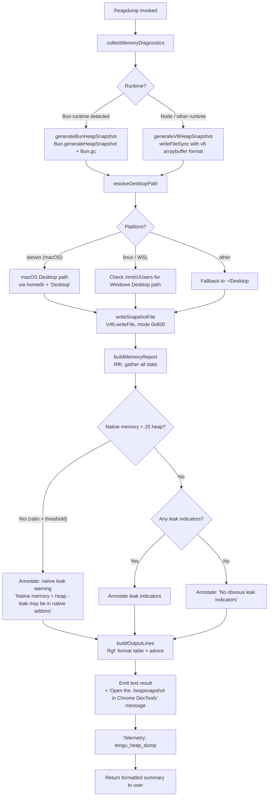

# `/heapdump`

> Analysis basis: CC v2.1.170 bundle.js (AST extraction + Claude interpretation)
> Minimum version: v2.1.170

---

## Overview

`/heapdump` is a hidden diagnostic command that captures a full JavaScript heap snapshot of the running Claude Code process and writes it to the user's Desktop directory. It also gathers a rich set of memory diagnostics (V8 heap statistics, process resource usage, open file descriptors, Linux smaps data) and presents a human-readable memory summary alongside the path to the generated `.heapsnapshot` file. The command is intended for internal debugging of memory leaks or excessive native memory consumption.

---

## Registration

| Field | Value |
|---|---|
| type | `local` |
| name | `heapdump` |
| description | `Dump the JS heap to ~/Desktop` |
| loc_byte | `12761378` |
| loc_byte_end | `12761806` |
| loc_line | `9113` |
| supportsNonInteractive | `true` |
| isHidden | `true` |
| module_id | `bfK` |
| load_inline | `true` |
| arbor_handler.name | `Sgf` |
| arbor_handler.fqn | `claude-2.1.170::Sgf` |
| arbor_handler.kind | `AsyncFunction` |
| arbor_handler.resolution_path | `module_id` |
| arbor_handler.n_hits | `0` |

Analysis basis: CC v2.1.170 bundle.js:+12761378

---

## Input Branching

The command has 3+ distinct execution branches depending on runtime environment and memory profile. A Mermaid flowchart is used.



---

## Behavioral Spec

### Top-level Handler (`Sgf`)

The Arbor-resolved handler is the `AsyncFunction` `Sgf` (FQN: `claude-2.1.170::Sgf`), reached via `module_id` resolution path.

```
async function heapdumpHandler(context):
    // Step 1: collect memory diagnostics and write snapshot
    diagnostics = await collectDiagnosticsAndWriteSnapshot(context)

    // Step 2: build formatted output lines
    outputLines = []
    outputLines.push("Open the .heapsnapshot in Chrome DevTools → Memory → Load to inspect retainers.")
    outputLines.push(...buildFormattedReport(diagnostics))
    outputLines.push(...buildMemoryBreakdownTable(diagnostics))

    // Step 3: emit result as plain text
    return { type: "text", content: outputLines.join("\n") }
```

Analysis basis: CC v2.1.170 bundle.js:+12760247, +12760393, +12760515, +12760279

---

### Memory Diagnostics Collection (`RfK`)

Collects all available memory statistics from the Node.js/Bun process APIs and, on Linux, from `/proc/self/smaps_rollup` and `/proc/self/fd`.

```
async function collectDiagnosticsAndWriteSnapshot():
    stats = {}

    // Node.js / Bun built-in memory APIs
    stats.memoryUsage      = process.memoryUsage()
    stats.heapStatistics   = v8Module.getHeapStatistics()        // kp8
    stats.resourceUsage    = process.resourceUsage()
    stats.uptime           = process.uptime()
    stats.heapSpaceStats   = v8Module.getHeapSpaceStatistics()   // kp8
    stats.activeHandles    = process._getActiveHandles().length
    stats.activeRequests   = process._getActiveRequests().length

    // Linux-specific: open file descriptor count
    try:
        fds = await fsAsync.readdir("/proc/self/fd")             // V46.readdir
        stats.openFdCount = fds.length
    except:
        stats.openFdCount = null

    // Linux-specific: smaps_rollup for native RSS breakdown
    try:
        smaps = await fsAsync.readFile("/proc/self/smaps_rollup", "utf8")  // V46.readFile
        stats.smaps = smaps
    except:
        stats.smaps = null

    // Load bun:jsc module if available (Bun runtime)
    try:
        jscModule = require("bun:jsc")                           // W -> vRH
        stats.jsc = jscModule
    except:
        stats.jsc = null

    // Format numeric values to fixed decimal places
    // e.g. X.toFixed(2) for MB conversion, dividing by 1048576
    // Threshold ratio: 100 (bundle.js:+12757094)
    // Native leak warning threshold uses 3600 s and 1048576 bytes as scale factors
    //   (bundle.js:+12756942, +12756947)

    return stats
```

Analysis basis: CC v2.1.170 bundle.js:+12756410, +12756434, +12756460, +12756486, +12756511, +12756553, +12756590, +12756641, +12756703, +12756801, +12756942, +12756947, +12757094

---

### Desktop Path Resolution (`vpA`)

Determines the correct Desktop output directory, handling macOS, Linux, and WSL environments.

```
function resolveDesktopPath():
    home = os.homedir()                      // FA_.homedir

    // Direct path: ~/Desktop
    directPath = path.join(home, "Desktop")  // F5.join, literal "Desktop"

    // WSL detection: check for /mnt/c/Users/<user>/Desktop
    // Filters out system accounts: "Public", "Default", "Default User", "All Users"
    // (bundle.js:+1065239, +1065283, +1065302, +1065322, +1065347)
    if platform is WSL:
        candidates = listUsersUnder("/mnt/c/Users")
        filtered = candidates.filter(u => not in ["Public","Default","Default User","All Users"])
        if filtered.length > 0:
            return windowsDesktopPath(filtered[0])

    return directPath
```

Analysis basis: CC v2.1.170 bundle.js:+1064964, +1064971, +1065007, +1065017, +1065239, +1065283, +1065302, +1065322, +1065347

---

### Heap Snapshot Generation (`hgf`)

Writes the actual heap snapshot file, branching on whether the Bun runtime is available.

```
async function generateHeapSnapshot(outputPath):
    if Bun is available:
        // Bun-native snapshot: generate and force GC
        snapshot = Bun.generateHeapSnapshot("v8", "arraybuffer")
        // format args: "v8" (bundle.js:+12759972), "arraybuffer" (bundle.js:+12759977)
        Bun.gc(/* synchronous */ true)
        SfK.writeFileSync(outputPath, Buffer.from(snapshot))
    else:
        // Node.js v8 heapdump via writeFileSync
        SfK.writeFileSync(outputPath, generateV8Snapshot())
```

Analysis basis: CC v2.1.170 bundle.js:+12759927, +12759947, +12759972, +12759977, +12760004

---

### Snapshot File Write (`q3A`)

Orchestrates path assembly, file write, and report construction.

```
async function writeSnapshotAndReport():
    desktopPath = resolveDesktopPath()                     // vpA
    n6(desktopPath)                                        // ensure directory exists

    // Assemble output filename using A3A.join (path module)
    snapshotFilePath = path.join(desktopPath, ...)         // A3A.join

    // Write snapshot (file mode 0o600 = 384 decimal)
    await fsAsync.writeFile(snapshotFilePath, data, { mode: 384 })  // V46.writeFile
    // (bundle.js:+12759357, +12759392)

    // Serialize diagnostics to JSON for embedding in output
    serialized = jsonStringify(diagnostics)                // CH -> JSON.stringify

    // Trigger heap dump file generation
    await generateHeapSnapshot(snapshotFilePath)           // hgf

    // Emit telemetry
    emit("tengu_heap_dump")                                // d -> bundle.js:+12759499

    // Build and return formatted report lines
    return buildReport(diagnostics, snapshotFilePath)
```

Analysis basis: CC v2.1.170 bundle.js:+12759205, +12759217, +12759314, +12759357, +12759373, +12759392, +12759448, +12759497, +12759499, +12759668, +12759677, +12759755

---

### Memory Report Formatter (`Rgf`)

Formats the collected statistics into a human-readable summary table and appends diagnostic annotations.

```
function buildFormattedReport(diagnostics, snapshotPath):
    lines = []

    // Memory breakdown table: each space/category padded with spaces (2-space indent)
    // Heap space entries formatted with padEnd (bundle.js:+16554572, +16554593)
    // Values converted from bytes to MB using Math.max and toFixed
    heapMB    = diagnostics.heapStatistics.used_heap_size / 1048576
    nativeMB  = (diagnostics.resourceUsage.maxRSS - heapMB)

    // Annotate based on native vs. JS heap ratio
    if nativeMB > heapMB:
        lines.push("— most memory is native (NOT in the .heapsnapshot)")  // +12760750
        lines.push("Native memory > heap - leak may be in native addons (node-pty, sharp, etc.)")  // +12757180
    else:
        lines.push("— most memory is JS heap (inspect the .heapsnapshot)")  // +12760690

    // No-leak fallback
    if no_indicators_found:
        lines.push("  (no obvious leak indicators)")                       // +12760887

    // Heap space breakdown: up to 8 spaces listed (literal 8, bundle.js:+12761022)
    // Active handles / requests counts appended
    // Uptime and resource usage appended

    // WSL memory note if applicable (macOS literal, bundle.js:+12758034)
    // macOS: divide maxRSS by 1024 (bundle.js:+12758044, platform "darwin" +12758453)

    lines.push("No obvious leak indicators. Check heap snapshot for retained objects.")
    // (bundle.js:+12758299, only when truly no indicators)

    return lines
```

Analysis basis: CC v2.1.170 bundle.js:+12760622, +12760690, +12760750, +12760887, +12760934, +12761022, +12757094, +12757180, +12757303, +12758034, +12758044, +12758299, +12758453

---

### Logger / Result Emitter (`N`)

Formats the final command result as a `"text"` type response (literal `"text"` at bundle.js:+12760279) and dispatches it through the standard output pipeline. Also handles the `"debug"` log level path (bundle.js:+208941) and the `"manual"` trigger constant (bundle.js:+12758885, value `0` at +12758896) for non-interactive invocation context. The output includes 3 heap space detail levels (literal `3` at bundle.js:+12758965).

Analysis basis: CC v2.1.170 bundle.js:+12758885, +12758896, +12758965, +12758968, +12760279

---

## State & Side Effects

| Item | Detail |
|---|---|
| Telemetry | `tengu_heap_dump` (bundle.js:+12759499); also reachable via call graph: `tengu_bg_proto_mismatch` (+16516539), `tengu_bg_dispatch_stale_drop` (+16517906), `tengu_bg_attach_legacy_autorespawn` (+16520427), `tengu_bg_attach` (+16521585), `tengu_bg_attach_stall_gave_up` (+16522503), `tengu_bg_attach_stall_respawn` (+16522773), `tengu_bg_attach_kick` (+16523723) — these are background daemon events reachable via deep call graph, not directly triggered by `/heapdump` |
| File written | `.heapsnapshot` file on user's Desktop; file mode `0o600` (decimal `384`, bundle.js:+12759392) |
| GC side effect | When running under Bun: `Bun.gc(true)` is called synchronously during snapshot generation (bundle.js:+12760004) |
| Linux proc reads | Reads `/proc/self/fd` (bundle.js:+12756653) and `/proc/self/smaps_rollup` (bundle.js:+12756716) when available |
| appState changes | None detected in depth-2 traversal |
| Sound | None detected |
| Hook registration | `LTA.register` reachable via `N9` (bundle.js:+62328); likely a process exit/cleanup hook |
| Auto-heap threshold | `auto-1.5GB` literal present (bundle.js:+12759565) — may represent a GC trigger threshold |

---

## Version History

| Version | Change |
|---|---|
| v2.1.170 | Initial analysis |

---

## Common Mistakes

1. **Command not visible in `/help`**: `/heapdump` has `isHidden: true` — it will not appear in the normal slash-command listing. Type it directly.
2. **Desktop directory missing**: On Linux or WSL systems where `~/Desktop` does not exist, the command attempts to create it via `n6(path)`. If `/mnt/c/Users` is not accessible in WSL, it falls back to `~/Desktop`. Ensure write permissions exist.
3. **Bun vs. Node snapshot format**: The snapshot format differs slightly between Bun (`Bun.generateHeapSnapshot("v8","arraybuffer")`) and Node.js. Both produce Chrome DevTools-compatible `.heapsnapshot` files, but the Bun path also forces a synchronous GC pass which may alter timing of other operations.
4. **macOS RSS unit difference**: On `darwin`, `maxRSS` from `process.resourceUsage()` is in bytes, but macOS traditionally reports it in kilobytes at the kernel level. The implementation divides by `1024` (bundle.js:+12758044) specifically for the `darwin` platform — comparing raw numbers across platforms will be misleading.
5. **File permission is restrictive**: The snapshot file is written with mode `0o600` (owner read/write only). Attempting to open it as another user will fail.
6. **Non-interactive support**: `supportsNonInteractive: true` means the command can be invoked headlessly (e.g., in CI pipelines), but the Desktop path resolution still requires a valid `$HOME`.

---

## Appendix — Identifier Mapping

> For bundle debugging only. Identifiers change across versions.

| Identifier | Role |
|---|---|
| `Sgf` | Top-level async handler for `/heapdump` (Arbor-resolved entry point) |
| `q3A` | Core orchestrator: resolves desktop path, writes snapshot file, builds report |
| `RfK` | Memory diagnostics collector (process/V8/proc filesystem stats) |
| `v6` | Filesystem utility (likely `fs.promises` wrapper or path helper) |
| `xZ` | Low-level async helper called by `v6` |
| `W` | `bun:jsc` module loader / JSC introspection helper |
| `vRH` | TeammateMailbox / message-marking helper (reachable via `W`) |
| `vpA` | Desktop path resolver (handles macOS, Linux, WSL) |
| `hgf` | Heap snapshot generator (branches on Bun vs. Node runtime) |
| `Rgf` | Memory report formatter (builds human-readable table and annotations) |
| `v46` | Utility called by `Rgf` (likely formatting or unit-conversion helper) |
| `N` | Output emitter / logger — formats result as `"text"` response |
| `PeK` | Sub-helper of `N` (output pipeline stage) |
| `MTA` | Sub-helper of `PeK` |
| `CH` | JSON serializer wrapper (`JSON.stringify`) |
| `u4` | String/path manipulation helper (used in output formatting) |
| `FZA` | String mapping helper called by `u4` |
| `zFH` | Write-to-stream helper |
| `yZA` | Inner stream writer called by `zFH` |
| `EeK` | File append / log-file writer (reachable from `N`) |
| `mBH` | Buffered output / debounce helper used by `EeK` |
| `L4H` | Log-file path assembler called by `EeK` |
| `n6` | Directory-creation / `mkdirp` helper |
| `$M6` | Error-code classifier (handles `EISDIR` etc.) |
| `cZA` | Path joining helper |
| `La8` | File rotation helper (stat, rename, unlink) |
| `TeK` | File-append worker (mkdir + appendFile + rotation) |
| `N9` | Process exit/cleanup hook registrar (`LTA.register`) |
| `K` | Output table row formatter (padEnd for aligned columns) |
| `L` | Promise/resource lifecycle manager |
| `f` | Resource cleanup handler (close operations) |
| `d` | Telemetry emitter (fires `tengu_heap_dump`) |
| `jA` | Error constructor wrapper |
| `j3` | Secondary error/result handler in `q3A` |
| `hH` | High-level error logger (`go.logError` pathway) |
| `_6` | String coercion utility |
| `hq` | Error formatting helper |
| `ImA` | Inner string formatter called by `hq` |
| `lN4` | Ring-buffer / sliding-window log helper |
| `P` | IPC / subprocess communication manager (deep call graph) |
| `X` | Subprocess stream / buffer helper |
| `J` | Subprocess kill/cleanup manager |
| `jf` | IPC stream end helper |
| `tj5` | Daemon protocol message dispatcher (background sessions) |
| `EH` | String coercion utility in IPC layer |
| `_` | Output array / accumulator in handler |
| `q` | Path or string context object |
| `A` | Array or collection helper |

---

Note: index built via Arbor fallback; some signals (telemetry, literals) may be missing — see arbor-fallback.js.