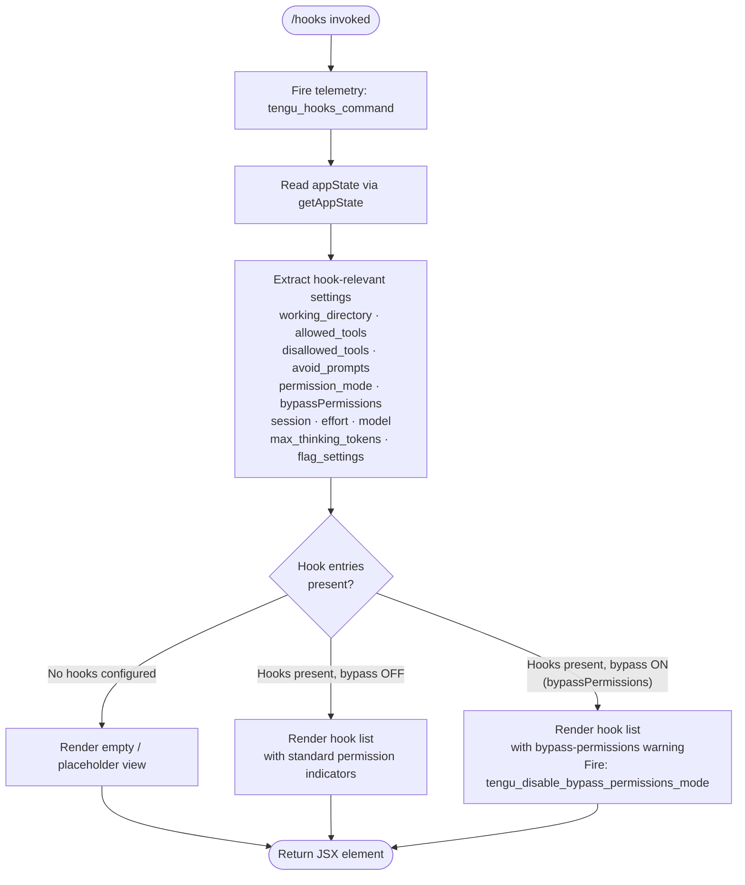

# `/hooks`

> Analysis basis: CC v2.1.170 bundle.js (AST extraction + Claude interpretation)
> Minimum version: v2.1.170

---

## Overview

The `/hooks` command displays the current hook configurations that intercept tool events within a Claude Code session. It is a read-oriented, immediate-mode command that renders a JSX view of hook registrations, reflecting settings such as allowed tools, disallowed tools, permission mode, and bypass state. The command fires a single telemetry event on invocation and delegates rendering to a React-style element tree built by the handler `oBf`.

---

## Registration

| Field | Value |
|---|---|
| type | `local-jsx` |
| name | `hooks` |
| description | `View hook configurations for tool events` |
| immediate | `true` |
| module_id | `jLK` |
| load_inline | `true` |
| loc_byte | `12649506` |
| loc_byte_end | `12649656` |
| loc_line | `8991` |
| arbor_handler.name | `oBf` |
| arbor_handler.fqn | `claude-2.1.170::oBf` |
| arbor_handler.kind | `AsyncFunction` |
| arbor_handler.resolution_path | `module_id` |
| arbor_handler.n_hits | `0` |

Analysis basis: CC v2.1.170 bundle.js:+12649506

---

## Input Branching

The command's handler (`oBf`) does not parse user-supplied arguments; instead it branches on the **current application state** retrieved from `appState`. Three major paths exist based on the effective configuration gathered by the app-state reader (`x_`):



Analysis basis: CC v2.1.170 bundle.js:+12649304 (handler entry), +10615111 (appState read), +10615520 (bypassPermissions key), +4247354 (bypass-off path), +4247357 (bypass telemetry)

---

## Behavioral Spec

### 1. Handler Entry and Telemetry Emission

```
async function hooksCommandHandler(context):
    emit telemetry("tengu_hooks_command")          // always on invocation
    currentAppState  = readAppState()              // calls getAppState
    lastConversation = findLastConversation(currentAppState)
    hookSettings     = extractHookSettings(lastConversation)
    uiElement        = buildHooksView(hookSettings, context)
    return createElement(uiElement)
```

Analysis basis: CC v2.1.170 bundle.js:+12649304 (`d` call — telemetry dispatch), +12649338 (`x_` — appState reader), +12649346 (`iN` — view builder), +12649376 (createElement)

---

### 2. App-State Reading and Settings Extraction (`x_`)

The app-state reader retrieves the current session's configuration by calling `H.getAppState`, then locates the most recent conversation record via `A.findLast`. From that record it extracts the following named keys:

| Config Key | Literal | loc_byte |
|---|---|---|
| Working directory | `working_directory` | 10615216 |
| Allowed tools | `allowed_tools` | 10615271 |
| Disallowed tools | `disallowed_tools` | 10615326 |
| Avoid prompts | `avoid_prompts` | 10615387 |
| Permission mode | `permission_mode` | 10615489 |
| Bypass permissions flag | `bypassPermissions` | 10615520 |
| Session identifier | `session` | 10615819 |
| Effort setting | `effort` | 10615844 |
| Model name | `model` | 10615857 |
| Max thinking tokens | `max_thinking_tokens` | 10615869 |
| Feature flag settings | `flag_settings` | 10615895 |

```
function readAndExtractSettings(appState):
    state        = appState.getAppState()
    conversation = state.findLast(entry => entry matches active session)
    return {
        workingDirectory   : conversation["working_directory"],
        allowedTools       : conversation["allowed_tools"],
        disallowedTools    : conversation["disallowed_tools"],
        avoidPrompts       : conversation["avoid_prompts"],
        permissionMode     : conversation["permission_mode"],
        bypassPermissions  : conversation["bypassPermissions"],
        session            : conversation["session"],
        effort             : conversation["effort"],
        model              : conversation["model"],
        maxThinkingTokens  : conversation["max_thinking_tokens"],
        flagSettings       : conversation["flag_settings"],
    }
```

Analysis basis: CC v2.1.170 bundle.js:+10615111, +10615191, +10615216–10615895

The reader also invokes sub-routines for narrowing allowed tools (`NR8`, `IR8`) and for resolving permission/bypass state (`Xb` → `Y6`).

Analysis basis: CC v2.1.170 bundle.js:+10615289 (`NR8`), +10615347 (`IR8`), +10615542 (`Xb`)

---

### 3. Bypass-Permissions Path (`Xb` → `Y6`)

When `bypassPermissions` is truthy, a dedicated code path disables the bypass mode and emits a secondary telemetry event.

```
function resolvePermissionMode(settings):
    if settings.bypassPermissions == true:
        emit telemetry("tengu_disable_bypass_permissions_mode")
        applyDisableFlag("disable")             // literal "disable" at +4247458
        updatePermissionState(settings)
    return resolvedPermissionConfig
```

Analysis basis: CC v2.1.170 bundle.js:+4247354 (`Y6` call), +4247357 (telemetry), +4247458 (`"disable"` literal)

---

### 4. View Construction (`iN` and Sub-routines)

The view builder (`iN`) assembles a structured list of hook configuration entries for display. It orchestrates several sub-steps:

```
function buildHooksView(settings, context):
    // Step 1 — Resolve tool configuration display
    toolConfig   = resolveToolConfig(settings)      // dG: platform "cli"/"remote"
    displayRows  = []

    // Step 2 — Build supervisor process entries (pTH / bzK)
    supervisorEntries = buildSupervisorRows(toolConfig)  // uses "supervisor" label
    displayRows.push(supervisorEntries)

    // Step 3 — Build allowed/disallowed tool rows
    for each toolEntry in settings.allowedTools:
        displayRows.push(formatToolRow(toolEntry))
    for each toolEntry in settings.disallowedTools:
        displayRows.push(formatToolRow(toolEntry))

    // Step 4 — Build hook event rows (qqH → sS6)
    hookEventRows = buildHookEventRows(settings)    // filters for deny/allow
    displayRows.push(hookEventRows)

    // Step 5 — Build permission / feature-flag rows (V8A, a4)
    flagRows = buildFlagRows(settings.flagSettings)
    displayRows.push(flagRows)

    // Step 6 — Build main session rows (LQ)
    sessionRows = buildSessionRows(settings)
    displayRows.push(sessionRows)

    // Step 7 — Feature-enablement checks
    if featureIsEnabled(settings):                  // OK.isEnabled / O.isEnabled
        enabledRows = buildEnabledFeatureRows(settings)
        displayRows.push(enabledRows)

    return displayRows
```

Analysis basis: CC v2.1.170 bundle.js:+10101746 (`dG`), +10101818 (`Y.push` — supervisor block), +10101869 (`qqH` — hook event rows), +10101884 (`V8A` — flag rows), +10102054 (`LQ` — session rows), +10102123 (`OK.isEnabled`), +10102253 (`O.isEnabled`)

---

### 5. Tool Configuration Resolution (`dG`)

Determines whether the session context is `"cli"` or `"remote"` and whether it is `"code"` typed. Platform context influences which hooks are displayed.

```
function resolveToolConfig(rawSettings):
    platform = determinePlatform()    // yields "cli" (+4880448) or "remote" (+4880459)
    type     = determineType()        // yields "code" (+177536)
    emit telemetry("tengu_slate_harbor")   // +4880478
    return buildConfigRecord(platform, type, rawSettings)
```

Analysis basis: CC v2.1.170 bundle.js:+4880296 (`ed`), +4880313 (`CK`), +4880358 (`_6`), +4880448, +4880459, +4880478

---

### 6. Hook Event Row Construction (`qqH` → `sS6`)

Filters the tool event list and maps each event to a displayable row. Each row may carry a `"deny"` or `"allow"` marker, and entries sourced from CLI arguments are tagged `"cliArg"` while narrowing entries are tagged `"toolsNarrowing"`.

```
function buildHookEventRows(settings):
    filtered = settings.hooks.filter(hook => hook.status != "blocked")   // +10101109
    return filtered.map(hook => {
        source = hook.source  // "cliArg" (+11022224) or "toolsNarrowing" (+11022245)
        action = hook.action  // "deny" (+11021484)
        return formatHookRow(source, action, hook)
    })
```

Analysis basis: CC v2.1.170 bundle.js:+10101048 (`H.filter`), +10101063 (`sS6`), +10101109 (`"blocked"`), +11022224, +11022245, +11021484

---

### 7. Session Rows and Daemon Interaction (`LQ`)

The session rows builder (`LQ`) reads session-level settings, resolves the model configuration via `jN` (which handles model tiers including `"standard"`, `"tst"`, `"tst-auto"`), checks for `"local-agent"` connections, and can signal daemon lifecycle events (`daemon_stop`, `daemon_stop_failed`).

```
function buildSessionRows(settings):
    agentConfig  = resolveAgentConfig(settings)   // lP: "local-agent" (+6884198)
    modelConfig  = resolveModelConfig(settings)   // jN: "standard"/"tst"/"tst-auto"
    sessionRows  = []

    sessionRows.push(buildAgentRow(agentConfig))
    sessionRows.push(buildModelRow(modelConfig))

    if daemonStopNeeded:
        emit("daemon_stop")        // literal +16566688
    if daemonStopFailed:
        emit("daemon_stop_failed") // literal +16566725

    return sessionRows
```

Analysis basis: CC v2.1.170 bundle.js:+10100383 (`a4`), +10100399 (`lP`), +10100508 (`GJ`), +10100979 (`JSq`), +10101004 (`jN`), +6884198, +4996995, +4997074, +4997124, +16566688, +16566725

---

### 8. Daemon Status and Background Session Awareness

The command-level infrastructure (`iN` → `z`) registers daemon lifecycle hooks. Daemon stop operations involve `"daemon_stop"` and `"daemon_stop_failed"` signals. A background session status (`"background session"`, +16566640) may be surfaced alongside `"stopped"` (+16566597) state transitions.

Analysis basis: CC v2.1.170 bundle.js:+10101956 (`z.push`), +16566685 (`SH`), +16566708 (`xH`), +16566760 (`ih`), +16566814 (`ZU`)

The shutdown sequencer (`ZU`) uses `Promise.race` and `Promise.all` over parallel shutdown tasks, with a 500 ms grace timeout before calling `process.exit`.

Maximum shutdown grace period: **500 ms** (bundle.js:+16561806)

Analysis basis: CC v2.1.170 bundle.js:+16561762, +16561776, +16561806, +16561845

---

## State & Side Effects

| Item | Detail |
|---|---|
| Telemetry: `tengu_hooks_command` | Fired unconditionally on every `/hooks` invocation (bundle.js:+12649306) |
| Telemetry: `tengu_disable_bypass_permissions_mode` | Fired when `bypassPermissions` is active and is being cleared (bundle.js:+4247357) |
| Telemetry: `tengu_slate_harbor` | Fired during tool-config platform resolution (bundle.js:+4880478) |
| Telemetry: `tengu_daemon_config_reload` | Fired when daemon configuration is reloaded as a side-effect of displaying hooks (bundle.js:+16545205) |
| Telemetry: `tengu_workflows_enabled` | Fired when workflow feature is detected as enabled (bundle.js:+2513292) |
| Telemetry: `tengu_cobalt_ridge` | Fired during flag/feature row construction (bundle.js:+4876620) |
| Telemetry: `tengu_feature_ok` | Fired when a feature enablement check passes (bundle.js:+1014205) |
| Telemetry: `tengu_feature_bad` | Fired when a feature enablement check fails (bundle.js:+1014267) |
| Telemetry: `tengu_daemon_control` | Fired during daemon lifecycle control operations (bundle.js:+16566763) |
| Telemetry: `tengu_amber_flint` | Fired during agent-team / multi-agent configuration resolution (bundle.js:+6912715) |
| appState changes | `bypassPermissions` may be set to `"disable"` if it was active when `/hooks` was invoked |
| Daemon interaction | Supervisor heartbeat and daemon config reload may occur as side effects (literals: `"heartbeat"` +16543633, `"supervisor"` +16544412) |
| Shutdown sequencer | `ZU` registers a 500 ms race-based shutdown path; `process.exit` is reachable indirectly |
| JSX rendering | Returns a `createElement`-based element tree (immediate render, no message added to conversation) |

---

## Version History

| Version | Change |
|---|---|
| v2.1.170 | Initial analysis |

---

## Common Mistakes

1. **Expecting argument parsing**: `/hooks` accepts no user arguments. All displayed data comes from the current `appState`; passing extra text after `/hooks` has no effect.
2. **Confusing `/hooks` with a mutation command**: The command is read-oriented and only displays existing hook configuration. The only state mutation that can occur is the incidental clearing of `bypassPermissions` if it was active.
3. **Assuming the view is static**: The rendered hook list reflects live `appState` at invocation time, including daemon status and permission-mode overrides. Re-running `/hooks` after changing settings will show updated values.
4. **Overlooking daemon side effects**: Because the handler touches daemon config reload paths (`tengu_daemon_config_reload`), invoking `/hooks` in environments without a running daemon may produce secondary error signals.
5. **Misreading `"blocked"` entries**: Hook entries with status `"blocked"` are filtered out before display; their absence from the view does not mean no blocking rules exist.

---

## Appendix — Identifier Mapping

> For bundle debugging only. Identifiers change across versions.

| Identifier | Role |
|---|---|
| `oBf` | Main async handler for `/hooks` command (arbor_handler) |
| `d` | Telemetry dispatch function |
| `x_` | App-state reader; calls `getAppState` and extracts hook settings |
| `H` | App-state store / event emitter object |
| `A` | Conversation list; provides `findLast` for most-recent session lookup |
| `f` | Stream / connection handle used in supervisor process management |
| `q` | Active connection set (add/delete/close operations) |
| `L` | Supervisor task lifecycle manager (add, finally, delete) |
| `NR8` | Allowed-tools narrowing resolver |
| `IR8` | Disallowed-tools narrowing resolver |
| `$1` | Shared tool-narrowing utility |
| `Xb` | Permission/bypass-mode resolver |
| `Y6` | Core permission-state updater; fires `tengu_disable_bypass_permissions_mode` |
| `uP6` | Permission sub-utility (called from `Y6`) |
| `mP6` | Permission sub-utility (called from `Y6`) |
| `Lm` | Dependency of `Y6`; delegates to `nu` |
| `D78` | Permission set manager (JT_ set operations, XJH map lookups) |
| `h6` | Timestamp / BSL utility used in permission path |
| `iN` | View builder; assembles all display rows for hook config |
| `dG` | Tool-config resolver; determines platform (`cli`/`remote`) and type (`code`) |
| `ed` | Platform detection sub-utility |
| `CK` | String coercion / key formatter |
| `_6` | String conversion utility |
| `Y` | Supervisor process entry builder / writer |
| `pTH` | Supervisor row formatter |
| `m9` | AsyncLocalStorage store reader (`JCL.getStore`) |
| `V8` | Supervisor display utility |
| `$OA` | Supervisor metadata helper |
| `EH` | String formatting helper used in supervisor rows |
| `K` | Column-width formatter (map + padEnd) |
| `bzK` | Supervisor column-width calculator (`Object.keys`, `Math.max`) |
| `T` | Spinner / progress indicator (stop method) |
| `BZ6` | Spinner sub-component |
| `V76` | Spinner sub-component (shared with `G`) |
| `E` | Terminal size / layout calculator (`Math.max`, `Math.min`) |
| `G` | MCP connection manager (connected/failed states, `Promise.all`) |
| `ccK` | Heartbeat manager; uses `"heartbeat"` literal |
| `V_H` | Heartbeat sub-utility |
| `V` | Secondary progress indicator (start method) |
| `Z8A` | Spawn / subprocess registration utility |
| `b_` | Module initializer (sets `__esModule`, binds callbacks) |
| `QB6` | Callback binder used in module init |
| `NP` | Settings feature-flag resolver |
| `M98` | Feature-flag reader |
| `bZ` | Feature-flag value formatter |
| `db1` | Feature permission checker |
| `u9` | Feature eligibility validator (`allow_product_feedback`, `allow_workflows`) |
| `Nw_` | Workflow-enablement resolver |
| `NwL` | Workflow config builder; fires `tengu_workflows_enabled` |
| `vwL` | Workflow value formatter |
| `qqH` | Hook event row builder; filters and maps hook entries |
| `sS6` | Hook entry formatter (XQ + $qA) |
| `XQ` | Hook source expander (`oC8.flatMap`) |
| `$qA` | Hook action formatter (deny/allow, kYH, Q9_, dZ) |
| `Ggq` | Hook row grouper |
| `V8A` | Feature-flag display row builder |
| `hb` | Flag row formatter; fires `tengu_cobalt_ridge`; platform: `"windows"` check |
| `a4` | Session config row builder |
| `z` | Daemon lifecycle hook array |
| `SH` | Daemon-stop success handler; fires `tengu_feature_ok` |
| `K6` | Feature check utility (calls `ff6`) |
| `xH` | Daemon-stop failure handler; fires `tengu_feature_bad` |
| `ih` | First-party hook registration; emits events via `H.emit` |
| `nu` | Hook registry core |
| `UNH` | Hook notifier (`nh` delegation) |
| `Ww_` | Hook UUID generator (`Xw_.randomUUID`) and emitter |
| `ZU` | Shutdown sequencer (`Promise.race` + `Promise.all`, 500 ms, `process.exit`) |
| `cLH` | Shutdown initiator (`dLH.shutdown`) |
| `lLH` | Timeout clearer (`clearTimeout`, `UT_`) |
| `o8` | Abort/timeout controller (`"aborted"`, `"abort"`, `setTimeout`, `clearTimeout`) |
| `LQ` | Session row builder (agent, model, daemon signals) |
| `lP` | Local-agent config reader (`"local-agent"`) |
| `Ni8` | Agent config sub-utility |
| `GJ` | Session key formatter (`CK`) |
| `W96` | Session display width utility |
| `Mq` | Agent-team config resolver; fires `tengu_amber_flint` |
| `yT7` | Agent-team sub-utility |
| `d3f` | Daemon-stop row builder (`tyq` + `b_`) |
| `c3f` | Daemon-stop-failed row builder (`Khq` + `b_`) |
| `jN` | Model config resolver (standard/tst/tst-auto tiers) |
| `CR_` | Model tier selector |
| `N` | Model name parser (uppercase, trim, debug mode) |
| `r_` | Provider resolver (bedrock/foundry/vertex/mantle/anthropicAws) |
| `FL` | Model display formatter |
| `h4` | Feature-enabled predicate |
| `O` | Feature toggle (isEnabled check, delegates to `S8`) |
| `S8` | Feature toggle sub-state |
| `$` | Session / timestamp provider (`f$K`) |
| `f$K` | Daemon status reader (`daemon.status.json`) |
| `Xa` | Daemon status file path resolver |
| `hu6` | Status file path joiner (`L$K.join`, `H_`) |
| `CH` | JSON serializer (`JSON.stringify`) |

---

Note: index built via Arbor fallback; some signals (telemetry, literals) may be missing — see arbor-fallback.js.