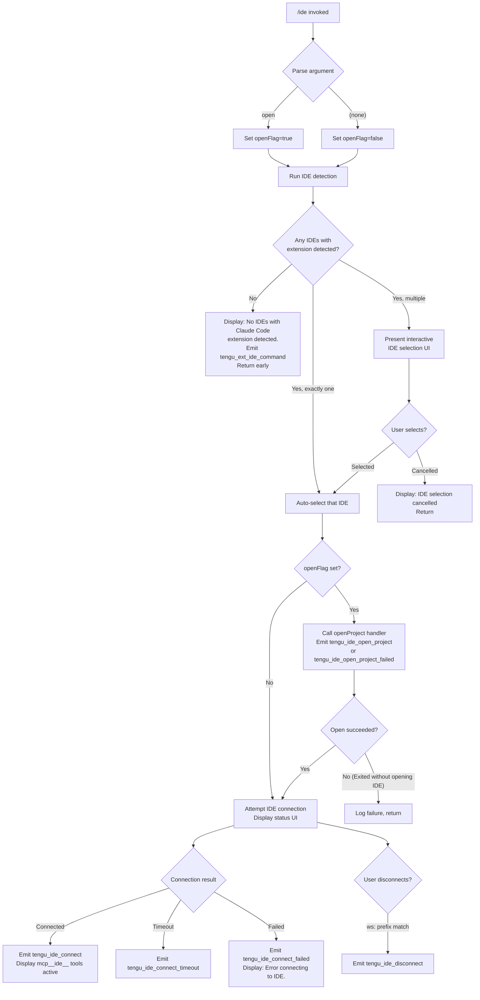

# `/ide`

> Analysis basis: CC v2.1.170 bundle.js (AST extraction + Claude interpretation)
> Minimum version: v2.1.170

---

## Overview

The `/ide` command manages IDE integrations for Claude Code — it detects running IDE instances that have the Claude Code extension installed, allows the user to select or switch the active IDE, and optionally opens the current project in the chosen IDE. When invoked with the `open` argument, it also attempts to open the working directory in the detected IDE. The command drives a React-based interactive UI component for IDE selection and connection status display.

---

## Registration

| Field | Value |
|---|---|
| type | `local-jsx` |
| name | `ide` |
| description | `Manage IDE integrations and show status` |
| argumentHint | `[open]` |
| module_id | `xoq` |
| load_inline | `true` |
| loc_byte | `11726928` |
| loc_byte_end | `11727084` |
| loc_line | `7585` |
| arbor_handler.name | `rIf` |
| arbor_handler.fqn | `claude-2.1.170::rIf` |
| arbor_handler.kind | `AsyncFunction` |
| arbor_handler.resolution_path | `module_id` |
| arbor_handler.n_hits | `0` |

Analysis basis: CC v2.1.170 bundle.js:+11726928

---

## Input Branching

The command has four or more distinct branches based on detected IDE presence, user selection, and the `open` sub-argument:



Analysis basis: CC v2.1.170 bundle.js:+11723044 (handler entry `rIf`)

---

## Behavioral Spec

### Top-Level Handler (`rIf`)

```
async function ideCommandHandler(args, appState):
    emit telemetry: tengu_ext_ide_command

    if args[0] == "open":
        openFlag = true
    else:
        openFlag = false

    ideList = await detectInstalledIDEs()   // calls iJ8 → nJ8/zP7

    if ideList is empty:
        display "No IDEs with Claude Code extension detected."
        return

    if ideList.length == 1:
        selectedIDE = ideList[0]
    else:
        selectedIDE = await promptUserToSelectIDE(ideList)   // interactive JSX via boq
        if selectedIDE is null:
            display "No IDE selected."
            return

    if openFlag:
        result = await openProjectInIDE(selectedIDE, workdir)   // calls SH / xH path
        emit tengu_ide_open_project (or tengu_ide_open_project_failed on error)
        if result == "Exited without opening IDE":
            return

    connectionResult = await connectToIDE(selectedIDE)   // calls b8 → C6
    renderConnectionStatusUI(connectionResult)           // JSX component boq
```

Analysis basis: CC v2.1.170 bundle.js:+11723044

---

### IDE Detection (`iJ8` / `nJ8` / `zP7`)

```
async function detectInstalledIDEs():
    // Collect candidate IDE process records
    processes = await listRunningIDEProcesses()   // platform-specific; uses zP7

    candidates = []
    for proc in processes:
        normalizedName = proc.name.toLowerCase()
        if normalizedName matches any of:
            ["windsurf", "devin", "cursor", "insiders", "vscode",
             "vs code", "visual studio code", "vscodium",
             "code - oss", "codium"]
        then:
            candidates.push(proc)

    // On Linux, also runs:
    //   ps aux | grep -E "code|cursor|windsurf|devin-desktop|idea|pycharm|..."
    //   (the full grep pattern is recorded in literals at +6550266)

    // Filter to only those with the Claude Code extension socket file present
    verified = await Promise.all(candidates.map(verifyExtensionSocket))
    return verified.filter(Boolean)
```

Analysis basis: CC v2.1.170 bundle.js:+6545541 (`iJ8`), +6542095 (`nJ8`), +6543334 (`zP7`)

---

### IDE Name Normalisation (`xU9`, `rJ8`)

```
function normalizeIDEName(rawName):
    lower = rawName.toLowerCase()
    // Check against known IDE name substrings:
    //   "windsurf", "devin", "cursor", "insiders",
    //   "vscode", "vs code", "visual studio code",
    //   "vscodium", "code - oss", "codium"
    // "Devin Desktop" maps to display label "Devin"
    // Falls back to path basename
    return matchedLabel or basename(rawName)
```

Analysis basis: CC v2.1.170 bundle.js:+6548336 (`xU9`), +6548779 (`rJ8`)

---

### IDE Process Scanning — Path Resolution (`zP7`)

```
async function resolveIDECandidatePaths(platform):
    paths = []
    if platform == "wsl":
        // Search under /mnt/c/Users, skipping "Public", "Default",
        //   "Default User", "All Users"
        // Resolves symlinks via kU9.realpath
        // Skips paths containing ".lock"
    if platform == "ide":
        paths.push(homedir())
    // Enumerate candidate socket/executable paths
    // Uses EN.join, EN.resolve, n6 (fs.stat), f.isDirectory, f.isSymbolicLink
    return paths
```

Analysis basis: CC v2.1.170 bundle.js:+6543334

---

### IDE Open Project (`om_` / `WP7`)

```
async function openProjectInIDE(ide, workdir):
    // Constructs a launch command appropriate for the detected IDE type
    // Uses object entries to build per-IDE argument list
    // For JetBrains IDEs: searches process list via grep pattern at +6550266
    // Emits ide_open_project telemetry on success
    // Emits ide_open_project_failed on failure
    // Literal "Exited without opening IDE" used as failure sentinel (+11723994)
    // Context type recorded as "worktree" or "project" (+11723631/+11723642)
```

Analysis basis: CC v2.1.170 bundle.js:+6550792 (`om_`), +11723597

---

### IDE Connection (`b8` / `C6`)

```
async function connectToIDE(selectedIDE):
    // Sets appState connection status to "pending"
    // Attempts MCP socket connection via C6
    // Timeout handling: emits tengu_ide_connect_timeout if no response
    // On success: emits tengu_ide_connect
    //   Confirms mcp__ide__ prefixed tools become active (+11725737)
    // On failure: emits tengu_ide_connect_failed
    //   Displays "Error connecting to IDE." (+11725459)
    // Disconnect detection: monitors ws: prefix (+11725957)
    //   Emits tengu_ide_disconnect on disconnect (+11725840)
```

Analysis basis: CC v2.1.170 bundle.js:+1098789 (`b8`), +11723190 (`C6` call site)

---

### Interactive IDE Selection UI (`boq`)

```
JSXComponent IDESelectionUI(props):
    [status, setStatus] = useState()   // "pending" | "connected" | ...
    appState = useAppState()
    ref = useRef()
    useEffect(...)    // watches connection state changes

    // Renders list of detected IDEs with connection status
    // Handles user selection via callback
    // On selection cancelled: returns "IDE selection cancelled" sentinel (+11726310)
    // On connecting: shows "Connecting to <IDE name>" prefix (+11726177)
    // Monitors for mcp__ide__ tool prefix to confirm active connection
    // On J.startsWith("ws:") → fires tengu_ide_disconnect
```

Analysis basis: CC v2.1.170 bundle.js:+11724930 (`boq`)

---

### IDE List Formatting (`JLA`)

```
function formatIDEListDisplay(ideList):
    // Slices list to at most 3 items for display (+11726429, value 3 at +11726459)
    // Uses Math.floor at +11726490
    // Normalizes display names via A.normalize("NFC") (+11726515/+11726527)
    // Maps remaining IDEs via q.map (+11726536)
    // Applies D.normalize for secondary list (+11726554)
    // Checks w.startsWith for ws: protocol prefix (+11726576)
    // Truncates with ", " separator and ", …" ellipsis
    //   (", " at +11726684, ", …" at +11726698)
```

Analysis basis: CC v2.1.170 bundle.js:+11726422

---

### Daemon Background Session Coordination (`w` / `v2A`)

The `/ide` command touches the background-session daemon layer when spawning or claiming an IDE-linked session:

```
function claimOrSpawnIDEDaemonSession(ideSocket):
    // Attempts nQ.claim against the daemon socket
    // On ECONNREFUSED: emits tengu_bg_sendclaim_failed
    // On claimed: emits tengu_bg_spare_claim or tengu_bg_spare_claim_fail
    // On SIGTERM needed: recorded via literal "SIGTERM" at +16531656
    // Background session timeout: 300000 ms (5 minutes) at +16537467
```

Analysis basis: CC v2.1.170 bundle.js:+16529583 (`w`), +16535711 (`v2A`)

---

## State & Side Effects

| Item | Detail |
|---|---|
| Telemetry: `tengu_ext_ide_command` | Fired at handler entry (+11723046) |
| Telemetry: `tengu_ide_detect` | Fired during IDE detection (+6546896) |
| Telemetry: `tengu_ide_detect_failed` | Fired on detection failure (+6546960) |
| Telemetry: `tengu_ide_open_project` | Fired when IDE project open succeeds (+11723597) |
| Telemetry: `tengu_ide_open_project_failed` | Fired when IDE project open fails (+11723704) |
| Telemetry: `tengu_ide_connect` | Fired on successful IDE connection (+11725147) |
| Telemetry: `tengu_ide_connect_failed` | Fired on connection failure (+11725234) |
| Telemetry: `tengu_ide_connect_timeout` | Fired when connection times out (+11725341) |
| Telemetry: `tengu_ide_disconnect` | Fired when IDE disconnects (+11725840) |
| Telemetry: `tengu_feature_ok` | General feature success signal (+1014205) |
| Telemetry: `tengu_feature_bad` | General feature failure signal (+1014267) |
| Telemetry: `tengu_feature_sad` | General feature degraded signal (+1014348) |
| Telemetry: `tengu_daemon_control` | Daemon control path reached (+16566763) |
| Telemetry: `tengu_bg_sendclaim_failed` | Daemon claim failure (+16508741) |
| Telemetry: `tengu_bg_spare_claim` | Spare session claimed (+16531134) |
| Telemetry: `tengu_bg_spare_claim_fail` | Spare session claim failed (+16531400) |
| Telemetry: `tengu_bg_spare_enable` | Spare-session pool enabled (+16531006) |
| appState changes | Connection status transitions: `pending` → `connected` / `failed` / `timeout` |
| MCP tool activation | `mcp__ide__*` tools become available upon successful connection (+11725737) |
| File system | Reads IDE socket files; may create `.claude` directory (+4835591); writes roster/state files |
| Process interaction | May send SIGTERM (+16531656) or SIGKILL (+16522708) to stale IDE daemon workers |
| Hook registration | `_.onInstallIDEExtension` callback registered (+11724171) |

---

## Version History

| Version | Change |
|---|---|
| v2.1.170 | Initial analysis |

---

## Common Mistakes

1. **Invoking `/ide open` when no IDE has the extension installed** — the command will display "No IDEs with Claude Code extension detected." and exit immediately without attempting to open any IDE. Install the Claude Code extension in the target IDE first.
2. **Cancelling the IDE selection prompt** — if multiple IDEs are detected and the user dismisses the selection UI, the command exits with "No IDE selected." and no connection is established. Re-invoke `/ide` and complete the selection.
3. **Expecting `/ide` to install the extension** — the command only detects and connects to IDEs that already have the extension running. For installation guidance, follow the prompted "restart your IDE" message (+11724262) after installing the extension.
4. **Using `/ide open` on a JetBrains IDE without the correct process visible** — the Linux detection path relies on a specific `ps aux | grep` pattern (+6550266). If the IDE process name does not match the pattern, it will not be detected.
5. **Stale daemon connection** — if the IDE MCP daemon socket is stale or the IDE was restarted, the `ECONNREFUSED` path fires `tengu_bg_sendclaim_failed`. Running `/ide` again after the IDE fully starts will re-establish the connection.

---

## Appendix — Identifier Mapping

> For bundle debugging only. Identifiers change across versions.

| Identifier | Role |
|---|---|
| `rIf` | Main async handler for `/ide` command (arbor_handler) |
| `JLA` | IDE list formatting / display truncation function |
| `boq` | Interactive IDE selection JSX UI component |
| `iJ8` | IDE detection coordinator (top-level async detection function) |
| `nJ8` | Inner IDE candidate resolver (parallel stat/map) |
| `zP7` | Platform-specific IDE path resolver (WSL / standard) |
| `xU9` | IDE name normalizer (toLowerCase + inclusion check) |
| `rJ8` | IDE name classifier by known product name substrings |
| `om_` | Open-project-in-IDE orchestrator |
| `WP7` | Build IDE launch arguments / command list |
| `b8` | IDE connection initiator |
| `C6` | MCP/daemon connection function |
| `oi6` | Async-local-storage context reader |
| `W_` | Terminal/output writer |
| `xZ` | Low-level terminal write primitive |
| `w` | Background daemon session manager |
| `v2A` | Daemon session lifecycle handler (claim/spawn/teardown) |
| `W2A` | Daemon claim-and-connect function |
| `dj5` | Send-claim with timeout helper |
| `cj5` | Low-level socket connect helper |
| `Qj5` | Build claim frame for daemon |
| `Wq` | Job state file reader/tracker |
| `sK` | Job directory path resolver |
| `MO` | Active-state transition helper |
| `hjH` | Roster entry parser |
| `FrL` | Roster entry field extractor |
| `Sf` | Atomic file write helper |
| `AO` | Safe filesystem write-with-rename |
| `$K6` | Roster write coordinator |
| `vQ` | Roster file reader |
| `ZNf` | Roster file directory creator + writer |
| `Q` | Permission/approval gate manager |
| `lH6` | Permission classifier entry point |
| `Ov6` | Permission classification logic |
| `LQ` | Permission decision evaluator |
| `M` | MCP server state manager |
| `aSH` | MCP connection orchestrator |
| `IPA` | MCP connection result applier |
| `Ic8` | MCP server update/cleanup handler |
| `pE` | MCP server cleanup function |
| `bJ8` | OAuth / MCP auth-flow handler |
| `xJ8` | OAuth callback completion handler |
| `Fg9` | MCP reconnect scheduler |
| `Rm_` | MCP error logger |
| `VN` | MCP skills telemetry emitter |
| `G` | MCP transport connector |
| `jA` | Error-to-string converter |
| `SU9` | Process kill helper |
| `iJ8` | IDE detection (see above) |
| `$P7` | Per-IDE socket/path prober |
| `xz_` | Shell command executor (sh -c) |
| `p_` | Generic process runner |
| `aM9` | Process output match helper |
| `y0` | IDE display-name deriver from path |
| `f9` | String index/slice utility |
| `s6` | Feature flag gate |
| `N2` | IDE connection network helper |
| `eVH` | HTTP/network request helper |
| `ht` | IDE restart hint renderer |
| `QIf` | Post-connection cleanup helper |
| `J6` | App-state hook |
| `wN_` | App-state context reader |
| `XA` | App-state selector hook |
| `Q7` | External-store subscription hook |
| `uM` | Argument parser / sub-command dispatcher |
| `lJ8` | IDE connection status renderer |
| `rk` | Result renderer |
| `SH` | Daemon feature-ok telemetry emitter |
| `xH` | Daemon feature-bad telemetry emitter |
| `d` | Logger / debug output |
| `K6` | Telemetry event sender |
| `hH` | Log-error utility |
| `EH` | String coercion utility |
| `CH` | JSON-stringify wrapper |
| `N` | Platform/OS string classifier |
| `V8` | Error code checker (ENOENT/EACCES etc.) |
| `k8` | Filesystem error classifier |
| `Q6` | JSON.parse wrapper |
| `P4` | Config directory path builder |
| `Qf` | Error code extractor |
| `dV` | Binary frame encoder (Buffer operations) |
| `f$K` | Heartbeat / keepalive sender |
| `ccK` | Heartbeat scheduler |
| `pTH` | Supervisor write handler |
| `bzK` | Column width calculator |
| `BZ6` | Animation/spinner stop |
| `V76` | Animation/spinner start |
| `ZU` | Graceful shutdown coordinator |
| `cLH` | MCP server shutdown caller |
| `lLH` | Timeout clear helper |
| `o8` | Timeout-with-abort helper |
| `ih` | Daemon control event emitter |
| `Ww_` | Daemon event UUID emitter |
| `UNH` | Daemon notification handler |
| `nu` | Daemon message constructor |
| `Y1` | Process exit handler |
| `JpH` | Pre-exit flush |
| `aj` | Signal handler |
| `IhH` | MCP config file reader |
| `K5H` | MCP config path builder |
| `P9` | File content validator |
| `pk` | Config field trimmer |
| `HsH` | MCP config file writer |
| `mX9` | Scheduled task filter |
| `eaH` | Task expiry checker |
| `FAH` | MCP config reload orchestrator |
| `j6H` | Config key presence checker |
| `FpK` | Scheduled tasks display formatter |
| `DN` | Cron expression parser |
| `icK` | File realpath/stat checker |
| `jX5` | File mtime watcher |
| `kb6` | Roster file reader |
| `piq` | Roster file unlink |
| `dU8` | Memory pressure checker |
| `Y6` | Low-memory event emitter |
| `D78` | Memory threshold checker |
| `h6` | Memory sample collector |
| `oW6` | Job pins.json reader |
| `Kk_` | Pins file path builder |
| `VE` | Base directory resolver |
| `crL` | Job directory enumerator |
| `mO9` | Job directory creator |
| `Jz` | Job state decoder |
| `bb6` | Auth token path builder |
| `Cb6` | Auth token file path helper |
| `cYA` | Auth token writer |
| `xb6` | Auth token path (extended) |
| `z$H` | PTY pids path builder |
| `TmH` | PTY pids file path helper |
| `qZ` | PTY pids reader |
| `VQ` | PTY socket path builder |
| `fK6` | PTY socket file path helper |
| `B4A` | PTY socket directory builder |
| `tj5` | Daemon protocol message dispatcher |
| `P` | Daemon client connection object |
| `jf` | Protocol frame writer |
| `S` | Daemon config reload watcher |
| `Y` | Supervisor output writer |
| `E` | Spinner/progress display |