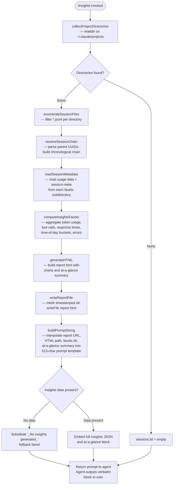

# `/insights`

> Analysis basis: CC v2.1.170 bundle.js (AST extraction + Claude interpretation)
> Minimum version: v2.1.170

---

## Overview

`/insights` generates a rich HTML usage report that aggregates and analyzes Claude Code session data stored in the local `.claude` directory. On invocation the handler synchronously collects session facets, computes statistics, writes an `report.html` file to a timestamped output directory, and then delivers a pre-composed confirmation message to the user that includes a shareable link to the report.

---

## Registration

| Field | Value |
|---|---|
| type | `prompt` |
| name | `insights` |
| description | `Generate a report analyzing your Claude Code sessions` |
| loc_byte | `13333370` |
| loc_byte_end | `13334674` |
| loc_line | `10658` |
| handler_method | `getPromptForCommand` |
| handler_method_start | `13333544` |
| handler_method_end | `13334673` |
| prompt_body.length | `513` |
| prompt_body.trace | `call→MwK(...) (1 literals)` |
| arbor_handler.name | `getPromptForCommand` |
| arbor_handler.kind | `Method` |
| arbor_handler.resolution_path | `direct` |
| arbor_handler.fqn | `claude-2.1.170::getPromptForCommand` |
| arbor_handler.n_hits | `1` |

Analysis basis: CC v2.1.170 bundle.js:+13333370

---

## Input Branching

The handler follows more than three distinct data-collection paths (directory scan, facet file enumeration, session-chain resolution, HTML generation, file write) before composing the prompt. A Mermaid flowchart is used.



Analysis basis: CC v2.1.170 bundle.js:+13333550 (handler entry), +13319915 (directory walk), +13409155 (file enumeration), +13320238 (sort), +13265323 (metadata read), +13321581 (HTML generation), +13322564 (report.html literal), +13334441 (`_No insights generated_` fallback)

---

## Behavioral Spec

### 1. Handler Entry — `getPromptForCommand`

The `getPromptForCommand` method (Arbor-resolved, `direct` path) is the sole entry point registered on the command object. It is called synchronously by the slash-command dispatcher when the user types `/insights`.

```
async function getPromptForCommand(commandArgs):
    rawData = await collectAndProcessInsightsData()
    promptString = buildPromptString(rawData)
    return { type: "prompt", content: promptString }
```

Analysis basis: CC v2.1.170 bundle.js:+13333550

---

### 2. Session Discovery — `collectProjectDirectories` (fwK → Xaf)

The handler calls `fwK`, which in turn calls `Xaf` to enumerate project directories.

```
async function collectProjectDirectories(basePath):
    # basePath resolves to ~/.claude/projects  (literal "projects", loc +5064074)
    dirEntries = await fs.readdir(basePath)
    directories = dirEntries.filter(entry => entry.isDirectory())
    # Pagination: processes up to 50 directories in the first pass,
    # expands to 200 if needed  (literals 50 @ +13320326, 200 @ +13320331)
    # setImmediate used to yield between batches  (+13320214)
    directories.sort(...)   # chronological order  (+13320238)
    return directories
```

Analysis basis: CC v2.1.170 bundle.js:+13319915, +13319934, +13320002, +13320214, +13320238

---

### 3. Session File Enumeration — `enumerateSessionFiles` (LL6)

For each project directory, `LL6` scans for `.jsonl` session transcript files.

```
async function enumerateSessionFiles(projectDir):
    entries = await fs.readdir(projectDir)
    files = entries.filter(e => e.isFile() && matchesJSONLPattern(e))
    # matchesJSONLPattern checks extension ".jsonl"  (literal @ +13409261)
    for each file:
        stat = await fs.stat(file)
        enrichedFile = { ...baseName, size: stat.size, ... }
        results.push(enrichedFile)
    return await Promise.all(results)
```

Analysis basis: CC v2.1.170 bundle.js:+13409155, +13409232, +13409261, +13409289, +13409464

---

### 4. Session-Chain Resolution — `resolveSessionChain` (c9H / z3H / RwK)

Session transcripts reference parent UUIDs; the chain resolver rebuilds the chronological conversation tree.

```
function resolveSessionChain(sessionFiles):
    # Build UUID → entry map
    for each sessionFile:
        entries = parseJSONLEntries(sessionFile)  # Osf / zsf binary JSONL parser
        for each entry:
            register(entry.uuid, entry.parentUuid)

    # Walk chain; detect and recover from cycles (telemetry: tengu_transcript_parent_cycle @ +13398553)
    orderedChain = topologicalSort(uuidMap)

    # Handle parallel transcript recovery
    # (telemetry: tengu_chain_parallel_tr_recovered @ +13378290)
    # Timestamp fallback when ordering is ambiguous
    # (telemetry: tengu_chain_timestamp_fallback @ +13376424)

    return orderedChain
```

Analysis basis: CC v2.1.170 bundle.js:+13395701, +13374379, +13376273, +13376424, +13398553

---

### 5. Facet Metadata Read — `readSessionMetadata` (Kaf / zzA / Gm6)

For each resolved session, two metadata files are read from the `facets` subdirectory.

```
async function readSessionMetadata(sessionDir):
    usageDataPath = path.join(sessionDir, "usage-data")   # literal @ +13259259
    sessionMetaPath = path.join(sessionDir, "session-meta") # literal @ +13259355
    facetsDir = path.join(sessionDir, "facets")            # literal @ +13259309

    rawUsage = await fs.readFile(usageDataPath, "utf-8")   # encoding literal @ +13265390
    metaObj = safeJSONParse(rawUsage)   # Q6 → JSON.parse  (+188412)
    return { usageData: metaObj, facetsDir }
```

Analysis basis: CC v2.1.170 bundle.js:+13265323, +13259259, +13259355, +13259309, +13265366, +13265390

---

### 6. Facet Computation — `computeInsightsFacets` (LwK / KwK / $af)

Raw session data is aggregated into the structured facet object that powers the report.

```
function computeInsightsFacets(sessions):
    facets = {
        tokenUsage: {},
        toolCalls: {},      # categorized: WebSearch, WebFetch, Edit, Write, mcp__* etc.
        responseTimes: {    # buckets: "2-10s","10-30s","30s-1m","1-2m","2-5m","5-15m",">15m"
            ...             # literals @ +13276477–+13276537
        },
        timeOfDay: {        # "Morning (6-12)","Afternoon (12-18)",
                            #  "Evening (18-24)","Night (0-6)"
                            # literals @ +13277325–+13277478
        },
        toolErrors: {},
        sessionDuration: {  # timeout constant 1800000ms (30 min) @ +13267732
        },
    }

    for each session in sessions:
        # Token accounting per model; tool-use event classification
        # Response time bucket via timestamps (60s cap @ +13262142)
        # Time-of-day bucketing using getHours()  (+13260622/+13260642)
        # Error classification: "Command Failed","User Rejected","Edit Failed",
        #   "File Changed","File Too Large","File Not Found"  (+13260970 etc.)
        aggregateIntoFacets(session, facets)

    # Produce at_a_glance summary object  (literal "at_a_glance" @ +13273504)
    facets.at_a_glance = buildAtAGlanceSummary(facets)
    return facets
```

Maximum session transcript size passed to facet extractor: 4096 characters (literal `+13267208`); HTML report body capped at 8192 bytes (`+13275646`).

Analysis basis: CC v2.1.170 bundle.js:+13269095, +13267540, +13271362, +13272490, +13267208, +13275646, +13267732, +13276477, +13277325, +13273504

---

### 7. HTML Report Generation — `generateReportHTML` (Jaf / r$H / Yaf / Daf)

The facet object is serialized into a self-contained HTML report with inline charts.

```
function generateReportHTML(facets):
    html = buildHTMLSkeleton()

    # Chart colors (inline hex literals):
    #   primary #2563eb (+13314142), secondary #0891b2 (+13314280)
    #   success #10b981 (+13314452), accent #8b5cf6 (+13314595)
    #   error   #dc2626 (+13317858), ok #16a34a (+13318107)
    #   warning #eab308 (+13318600)

    sections = [
        buildResponseTimeSection(facets.responseTimes),
        buildTimeOfDaySection(facets.timeOfDay),
        buildToolErrorSection(facets.toolErrors),
        buildTokenSection(facets.tokenUsage),
    ]

    # Empty-state guards (rendered when data is absent):
    #   '<p class="empty">No data</p>'            (+13275968)
    #   '<p class="empty">No response time data</p>' (+13276425)
    #   '<p class="empty">No time data</p>'        (+13277275)
    #   '<p class="empty">No tool errors</p>'      (+13317869)

    # HTML escaping applied via htmlEscape helper (_f):
    #   &amp; &lt; &gt; &quot; &apos;  (literals @ +5099583–+5099706)

    # "Add to CLAUDE.md" suggestion link injected  (+13281821)

    return html
```

Analysis basis: CC v2.1.170 bundle.js:+13278111, +13314142, +13275968, +13276425, +13277275, +13317858, +13281821, +5099583

---

### 8. Report File Write — `writeReportFile` (Laf / qaf / fwK)

```
async function writeReportFile(html, facets, basePath):
    # Timestamp-based directory name constructed from:
    #   getFullYear, getMonth, getDate, getHours, getMinutes, getSeconds
    #   (+13322396–+13322494)
    outputDir = path.join(basePath, timestampString)
    await fs.mkdir(outputDir, { recursive: true })   # (+13322305, +13265907)

    reportPath = path.join(outputDir, "report.html") # literal @ +13322564
    await fs.writeFile(reportPath, html)             # +13322592

    # Also write facets JSON sidecar  (qaf: +13265194, +13265238)
    facetsPath = path.join(outputDir, "facets.json")
    await fs.writeFile(facetsPath, JSON.stringify(facets))

    return { reportPath, outputDir }
```

Analysis basis: CC v2.1.170 bundle.js:+13322305, +13322396, +13322564, +13322592, +13265907, +13265238

---

### 9. Prompt Assembly and Agent Delivery — `buildPromptString` (MwK / CH)

```
function buildPromptString(rawData, reportPaths):
    # Template length: 513 characters  (prompt_body.length)
    # Interpolates: full insights JSON, reportURL, htmlFilePath,
    #               facetsDirectory, at_a_glance summary block

    if rawData is empty / unavailable:
        insightsBlock = "_No insights generated_"  # literal @ +13334441

    prompt = TEMPLATE
        .replace("{insights_data}", insightsBlock)
        .replace("{report_url}",   reportURL)
        .replace("{html_file}",    reportPaths.reportPath)
        .replace("{facets_dir}",   reportPaths.outputDir)
        .replace("{at_a_glance}",  atAGlanceSummary)

    # Agent instruction (paraphrased, not quoted verbatim):
    #   The agent is told the user has not yet seen any output and must
    #   output exactly the text enclosed in <message> tags — no omissions.
    #   The <message> block contains the report-ready confirmation and
    #   an invitation to explore sections or follow suggestions.

    return prompt
```

Key behavioral constraint: the prompt instructs the agent to output the `<message>` block **verbatim** as its entire response; no free-form commentary is permitted by the instruction. The at-a-glance summary is injected into the prompt for the agent's context only and is not directly shown to the user unless the agent decides to expand on it after the mandatory block.

Analysis basis: CC v2.1.170 bundle.js:+13334576, +13334594, +13334640, +13334441

---

## State & Side Effects

| Item | Detail |
|---|---|
| Filesystem — reads | `~/.claude/projects/*/` directories; `*.jsonl` session transcripts; `usage-data` and `session-meta` facet files (via `fs.readFile` / `fs.readdir` / `fs.stat`) |
| Filesystem — writes | Creates timestamped output directory under the Claude data root; writes `report.html` (HTML report) and a facets JSON sidecar. The output path is interpolated into the prompt. |
| Facets directory | Literal `"facets"` subdirectory read per session (bundle.js:+13259309) |
| Session-chain telemetry | `tengu_transcript_parent_cycle` (+13398553), `tengu_transcript_phantom_parent` (+13394761) — emitted when session transcript parent links are cyclic or missing |
| Chain-repair telemetry | `tengu_chain_parent_cycle` (+13376275), `tengu_chain_timestamp_fallback` (+13376424), `tengu_chain_parallel_tr_recovered` (+13378290) |
| No direct appState mutation | The command operates as a read-aggregate-write pipeline; no in-process app state fields are written |
| Sound | None detected in depth-2 traversal |
| MCP telemetry (transitive) | `tengu_mcp_skills` (+6587132) — emitted by MCP-layer helpers reachable via `fwK → M → IPA → aSH → VN`; not directly triggered by `/insights` |
| Daemon telemetry (transitive) | Various `tengu_daemon_*`, `tengu_bg_*` events present in transitive closure but belong to the daemon layer, not to `/insights` directly |

---

## Version History

| Version | Change |
|---|---|
| v2.1.170 | Initial analysis |

---

## Common Mistakes

1. **Expecting interactive input** — `/insights` takes no user arguments; it runs entirely from local session data already on disk.
2. **Assuming immediate console output** — the command's visible output is the agent's verbatim delivery of the `<message>` block; the HTML report is written silently before the agent speaks.
3. **Missing the facets directory** — the report depends on `~/.claude/projects/<project>/facets/` being populated by prior sessions. Running `/insights` on a fresh installation with no prior usage will produce the `_No insights generated_` fallback.
4. **Confusing the report URL with a remote service** — the "Report URL" interpolated into the prompt is a local `file://` path to the generated `report.html`; no data is sent to a remote server by this command.
5. **Editing `report.html` and re-running** — each invocation creates a new timestamped directory and overwrites nothing; prior reports are preserved.
6. **Session-chain cycle errors** — if transcript files contain circular `parentUuid` references, the chain resolver emits `tengu_transcript_parent_cycle` telemetry and continues with a best-effort ordering rather than aborting.

---

## Appendix — Identifier Mapping

> For bundle debugging only. Identifiers change across versions.

| Identifier | Role |
|---|---|
| `__handler_insights` | Synthetic BFS entry node for the `/insights` command handler |
| `fwK` | Main insights data-collection orchestrator (calls Xaf, Kaf, YB8, Jaf, LwK, $af, etc.) |
| `Xaf` | Project directory enumerator (`fs.readdir` + `isDirectory` filter + sort) |
| `Zn` | Path helper: joins base directory with `"projects"` literal |
| `LL6` | Per-directory `.jsonl` file enumerator with `fs.stat` enrichment |
| `Tg` | JSONL filename pattern matcher (regex `.test`) |
| `Kaf` | Session metadata reader (reads `usage-data` / `session-meta` files) |
| `zzA` | Constructs path to session metadata directory |
| `Gm6` | Constructs base facets path component |
| `qwK` | Metadata parse helper (wraps `Q6` / `JSON.parse`) |
| `Q6` | Safe JSON parse wrapper |
| `YB8` | Session-state aggregator; calls `c9H`, `twK`, `z3H`, `Y16`, `mzA`, `UzA`, `vB8`, `NB8` |
| `c9H` | Core session-chain builder / JSONL record processor |
| `maf` | JSONL record field extractor |
| `Bp` | Session entry classifier |
| `jQ6` | Recursive JSON structure walker |
| `Nj` | Session node normalizer |
| `RwK` | Session relink walker (repairs broken parent references; emits `tengu_relink_walk_broken`) |
| `z3H` | Chain builder: topological sort with cycle detection |
| `saf` | Chain validator (checks `Number.isNaN` on timestamps) |
| `taf` | Chain ordering / deduplication helper |
| `oaf` | Chain merge/shift helper |
| `twK` | Chain traversal accumulator |
| `Y16` | Session message mapper |
| `mzA` | Compact-summary text normalizer |
| `ix6` | Message content extractor (handles array / string duality) |
| `UzA` | Attachment / image filter |
| `eaf` | Content-type trimmer |
| `Hsf` | Multi-type content presence checker |
| `vB8` | Session statistics bucket updater |
| `NB8` | Session entry array builder (`Array.from` + `H.values`) |
| `LwK` | High-level facet computation driver (calls `KwK`, `KL6`, statistical helpers) |
| `KwK` | Per-session metric accumulator (finite-number guard, sort, Set operations) |
| `KL6` | Facet key enumerator (`Object.entries`) |
| `$af` | Report data finalizer; calls `HwK`, applies `Math.round`, builds `Promise.all` batch |
| `HwK` | Per-session HTML fragment generator; calls `O96`, `E4`, `lof`, `J4` |
| `O96` | Individual section HTML builder |
| `E4` | HTML template expander |
| `FR8` | SHA-1 hash helper for report asset deduplification |
| `x8` | UUID generator helper (`Iy.randomUUID`) |
| `_pH` | Assistant-message extractor |
| `bT` | Report bundle helper |
| `XG` | Report path resolver (`xZ`) |
| `WE` | Report write finalizer |
| `lof` | Report section formatter; calls `AE` |
| `AE` | Output renderer (`r_`, `Y7`, `Yf` — mantle/firstParty renderer) |
| `J4` | HTML filter helper (`H.filter`) |
| `Jaf` | Full HTML document assembler (calls `OB8`, `r$H`, `Yaf`, `Daf`, `waf`) |
| `wf` | HTML text serializer |
| `_f` | HTML escape function (`&amp;`, `&lt;`, `&gt;`, `&quot;`, `&apos;`) |
| `OB8` | HTML section serializer (calls `wf`) |
| `r$H` | Response-time chart section builder |
| `Yaf` | Time-of-day chart section builder |
| `Daf` | Tool-usage chart section builder |
| `waf` | Utility: wraps content with `CH` (JSON.stringify) |
| `Laf` | Writes facets directory metadata (`fs.mkdir` + `fs.writeFile`) |
| `qaf` | Writes facets JSON sidecar file |
| `Aaf` | Reads and optionally removes stale facet data |
| `zB8` | Constructs facets output sub-path |
| `$wK` | Stale-file cleanup helper |
| `faf` | High-level report generation coordinator (calls `_af`, `O96`, `E4`, `_wK`, `J4`) |
| `_af` | Report page builder; calls `tof`, `DzA`, `Promise.all` batch map |
| `tof` | Per-session report section renderer |
| `DzA` | Data-point formatter (calls `AwK`, `Math.round`) |
| `AwK` | Session event classifier (tool names, exit codes, edit outcomes) |
| `oof` | File-extension extractor (`path.extname`) |
| `CXH` | Diff generator (`YW9.diff`) |
| `wL` | String index helper |
| `U3` | Duration formatter |
| `YzA` | Session key helper |
| `aof` | NaN-safe number coercer |
| `Paf` | Report metadata key enumerator (`Object.keys`) |
| `CH` | JSON serializer (`JSON.stringify`) |
| `MwK` | Prompt template interpolation function (produces the 513-char prompt string) |
| `Wm6` | Tool-name classifier helper |
| `hH` | Error logger (writes to `fQH` / `go.logError`) |
| `jA` | Error constructor wrapper (`Error` + `String`) |
| `EH` | Error stringifier (`String`) |
| `Osf` | Binary JSONL file reader (synchronous, uses `Buffer` + `CR.openSync`) |
| `zsf` | Lightweight synchronous file reader |
| `$sf` | JSONL stream parser (buffer-level) |
| `MvH` | Metadata version handler |
| `_6` | String coercion utility |
| `P9` | Permission checker (`V8`) |