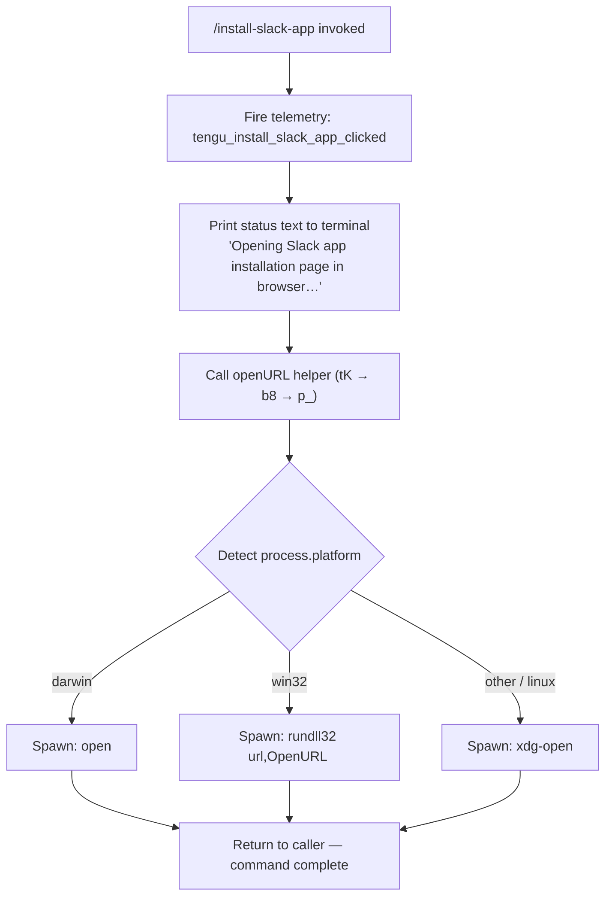

# `/install-slack-app`

> Analysis basis: CC v2.1.170 bundle.js (AST extraction + Claude interpretation)
> Minimum version: v2.1.170

---

## Overview

The `/install-slack-app` command opens the Claude Slack app installation page in the user's default browser. It is a thin, non-interactive action command: when invoked it fires a telemetry event, prints a brief status message to the terminal, and then delegates to the platform-appropriate URL-opening utility to launch the browser. No agent turn, no prompt body, and no interactive input are involved.

---

## Registration

| Field | Value |
|---|---|
| type | `local` |
| name | `install-slack-app` |
| description | `Install the Claude Slack app` |
| supportsNonInteractive | `false` |
| module_id | `iaq` |
| load_inline | `true` |
| loc_byte | `11814304` |
| loc_byte_end | `11814490` |
| loc_line | `8217` |
| arbor_handler.name | `Xkf` |
| arbor_handler.fqn | `claude-2.1.170::Xkf` |
| arbor_handler.kind | `AsyncFunction` |
| arbor_handler.resolution_path | `module_id` |
| arbor_handler.n_hits | `0` |

Analysis basis: CC v2.1.170 bundle.js:+11814304

---

## Input Branching

The command has no user-supplied argument processing. The branching that exists is entirely in the URL-opening sub-routine, which dispatches to one of three OS-specific launchers. Three distinct branches → Mermaid flowchart required.



Analysis basis: CC v2.1.170 bundle.js:+11814023 (tK call), +6231867 (`darwin`), +6231883 (`win32`), +6232041 (`open`), +6231967 (`rundll32`), +6232048 (`xdg-open`)

---

## Behavioral Spec

### Top-level handler (`Xkf`)

```
async function installSlackAppHandler(context):
    fireEvent("tengu_install_slack_app_clicked")   // +11813910
    printToTerminal({type: "text",
        message: "Opening Slack app installation page in browser…"})  // +11814043, +11814056
    await openURLInBrowser(SLACK_INSTALL_URL)   // tK, +11814023
```

Analysis basis: CC v2.1.170 bundle.js:+11813908

---

### URL validation and sanitisation (`tK` → `PO7`)

```
function validateURL(rawURL):
    if not rawURL.startsWith("http:") and
       not rawURL.startsWith("https:"):          // +6231558, +6231580
        throw new Error("URL must use http or https scheme")  // PO7, +6231508
    return rawURL
```

Analysis basis: CC v2.1.170 bundle.js:+6231795

---

### Platform URL opener (`tK` → `HD` → `b8` → `p_`)

```
async function openURLInBrowser(url):
    validatedURL = validateURL(url)              // PO7

    platform = process.platform
    if platform == "darwin":                     // +6231867
        command = "open"                         // +6232041
        args    = [validatedURL]
    else if platform == "win32":                 // +6231883
        command = "rundll32"                     // +6231967
        args    = ["url,OpenURL", validatedURL]  // +6231979
    else:                                        // linux / other
        command = "xdg-open"                     // +6232048
        args    = [validatedURL]

    await spawnProcess(command, args)            // b8 → p_ → eVH
```

Analysis basis: CC v2.1.170 bundle.js:+6231808 (HD dispatch), +6231916 (b8 spawn entry)

---

### Process spawn and lifecycle (`b8` → `p_` → `eVH`)

```
async function spawnAndWait(command, args):
    child = spawnChildProcess(command, args)    // eVH, +1099295
    waitForExit(child, timeoutMs=1_000_000)    // +1099256
    if exitCode != 0:
        logError(exitCode)                     // hH, +1099698
    return exitCode
```

The timeout constant found in the depth-2 traversal is 1,000,000 ms (≈16 min), used as a process-wait ceiling.
Analysis basis: CC v2.1.170 bundle.js:+1099256

---

### Config persistence layer (shared utility — `W8` → `k78` → `B7H`)

Although reachable via the call graph, the config read/write and file-lock machinery (`W8`, `k78`, `B7H`) is **shared infrastructure** for persisting global configuration and is not specific to `/install-slack-app`. It is traversed because the handler calls `saveConfig` (aliased to `W8`) as a side-effect to update any state flags. Key observable behaviours within depth-2 scope:

- **File locking**: acquires an exclusive lock before writing; emits `tengu_config_lock_contention` when acquisition exceeds the expected window. Lock-contention warning message: "Lock acquisition took longer than expected - another Claude instance may be running" (bundle.js:+3305933).
- **Stale-write guard**: re-reads config before committing; if the freshly-read file is missing auth tokens that the in-memory cache holds, the write is aborted and `tengu_config_stale_write` is emitted (bundle.js:+3306158, +3306349).
- **Auth-loss guard**: also emits `tengu_config_auth_loss_prevented` (bundle.js:+3306501).
- **Parse-error guard**: emits `tengu_config_parse_error` on malformed JSON (bundle.js:+3308597); error string "Config accessed before allowed." (bundle.js:+3307966).
- **Backup rotation**: keeps up to 5 rolling backups in a `backups/` subdirectory (bundle.js:+3307534, +3306952); backup filenames contain `.backup.` (bundle.js:+3306819); backup directory created with mode `0o600` (decimal 384, bundle.js:+3307234).
- **Timeout**: config-lock wait ceiling is 60,000 ms (bundle.js:+3306703).

Analysis basis: CC v2.1.170 bundle.js:+3302778

---

## State & Side Effects

| Item | Detail |
|---|---|
| Telemetry (primary) | `tengu_install_slack_app_clicked` — fired immediately on command invocation (bundle.js:+11813910) |
| Telemetry (config layer) | `tengu_config_lock_contention`, `tengu_config_stale_write`, `tengu_config_auth_loss_prevented`, `tengu_config_parse_error` |
| Telemetry (background daemon) | `tengu_bg_dispatch_sigkill_escalate`, `tengu_bg_dispatch_low_mem`, `tengu_bg_spare_enable`, `tengu_bg_spare_claim`, `tengu_bg_spare_claim_fail`, `tengu_bg_proto_mismatch`, `tengu_bg_dispatch_stale_drop`, `tengu_bg_attach_legacy_autorespawn`, `tengu_bg_attach`, `tengu_bg_attach_stall_gave_up`, `tengu_bg_attach_stall_respawn`, `tengu_bg_attach_kick` (shared background-daemon infrastructure, not install-slack-app–specific) |
| Terminal output | Prints `"Opening Slack app installation page in browser…"` (type: `text`) before opening the browser (bundle.js:+11814056) |
| Browser side-effect | Spawns OS URL opener (`open` / `rundll32 url,OpenURL` / `xdg-open`) to load the Slack app installation page |
| Config file | May write/lock `~/.claude.json` via shared config-persistence layer |
| Config backups | Up to 5 rolling backups written to `backups/` subdirectory alongside the config file |
| Sound | None observed in depth-2 traversal |
| Hook registration | None observed in depth-2 traversal |
| supportsNonInteractive | `false` — command must be run in an interactive session |

---

## Version History

| Version | Change |
|---|---|
| v2.1.170 | Initial analysis |

---

## Common Mistakes

1. **Running in non-interactive mode**: `supportsNonInteractive` is `false`; invoking `/install-slack-app` from a script or pipe will not work as expected.
2. **No browser installed / `xdg-open` missing on Linux**: The command silently delegates to `xdg-open` on non-Darwin/non-Windows platforms; if no default browser is configured the spawn will fail with a non-zero exit code.
3. **Expecting interactive output or an agent reply**: This command produces a single status line and then opens a browser tab — it does not start an agent conversation or wait for user input.
4. **Conflating this command with API/token setup**: `/install-slack-app` only opens the Slack OAuth installation page in the browser; it does not store credentials or perform any in-app authentication flow.
5. **Concurrent Claude instances blocking the config lock**: If another Claude Code process is running and holds the config-file lock, the shared config-persistence layer will emit a contention warning and may delay completion by up to 60 seconds (bundle.js:+3306703).

---

## Appendix — Identifier Mapping

> For bundle debugging only. Identifiers change across versions.

| Identifier | Role |
|---|---|
| `Xkf` | Top-level async handler for `/install-slack-app` (arbor_handler) |
| `d` | Telemetry event emitter (fire-and-forget) |
| `W8` | Global config save orchestrator |
| `k78` | File-locked config write core |
| `_` | Filesystem abstraction (various sync ops) |
| `n6` | Path normalisation / existence check helper |
| `L` | File descriptor / stream manager (add/delete/finally) |
| `q` | Primary `fs`-like I/O module (readFileSync, statSync, etc.) |
| `f` | Stream finalisation / close helper |
| `JE1` | Config object merge/assign helper |
| `fY_` | Config field serialiser |
| `N` | HTTP/API request dispatcher |
| `PeK` | Request construction helper |
| `H` | Retry / jitter scheduler |
| `CH` | JSON serialiser wrapper |
| `u4` | Header builder / redactor |
| `zFH` | Response body parser |
| `EeK` | Chunked upload handler |
| `V8` | Error normaliser |
| `B7H` | Config file reader with backup scanning |
| `Q6` | JSON parse wrapper |
| `ku` | String prefix stripper |
| `L69` | Directory backup enumerator |
| `CT_` | Backup path constructor |
| `w` | Background daemon session manager |
| `liH` | Config auth validator |
| `A` | String case-folding helper |
| `V` | Filename prefix checker |
| `P` | IPC framing / buffer splitter |
| `X` | Socket timeout manager |
| `J` | Daemon process killer |
| `jf` | IPC write flusher |
| `tj5` | Daemon message dispatcher / state machine |
| `EH` | Exit-code stringifier |
| `E` | Scroll/slice bounded-range calculator |
| `G` | SDK connection manager |
| `xO6` | Atomic file writer (write-to-temp + rename) |
| `O` | PTY / stream object |
| `k8` | Error code mapper |
| `ZJH` | Config schema validator |
| `K69` | Config entry iterator |
| `QP6` | Timestamp generator (Date.now wrapper) |
| `I78` | Config symlink resolver / atomic writer |
| `tK` | URL-open orchestrator (validate + dispatch) |
| `PO7` | URL scheme validator (throws on non-http/https) |
| `HD` | Platform detection + command selector |
| `b8` | Child-process spawner entry point |
| `p_` | Process wait-for-exit loop |
| `eVH` | Child-process lifecycle manager |
| `D` | Forced-shutdown / process.exit wrapper |
| `Ey4` | Exit-code-to-string converter |
| `j3` | Process signal handler |
| `hH` | Error logger |
| `C6` | Async-local-storage context accessor |
| `oi6` | Store retrieval helper |
| `W_` | Context initialiser |

---

Note: index built via Arbor fallback; some signals (telemetry, literals) may be missing — see arbor-fallback.js.