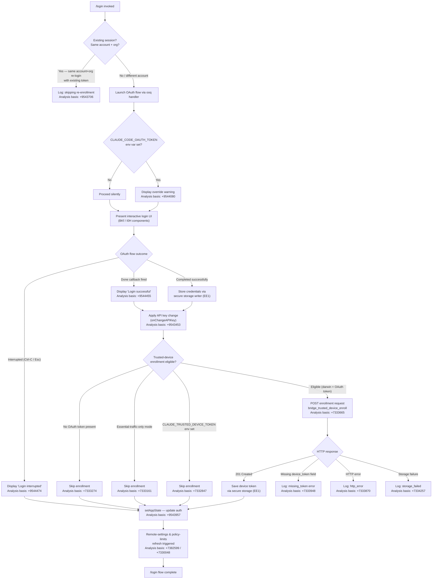

# `/login`

> Analysis basis: CC v2.1.170 bundle.js (AST extraction + Claude interpretation)
> Minimum version: v2.1.170

---

## Overview

The `/login` command initiates an OAuth-based authentication flow that allows the user to sign in with an Anthropic account or switch between accounts. It renders an interactive JSX component that manages the full login lifecycle — from OAuth token acquisition through credential storage, trusted-device enrollment, and post-login state reconciliation — and writes the resulting credentials to secure storage before updating global application state.

---

## Registration

| Field | Value |
|---|---|
| type | `local-jsx` |
| name | `login` |
| description | `Switch Anthropic accounts \| Sign in with your Anthropic account` |
| module_id | `qEq` |
| load_inline | `true` |
| loc_byte | `11762303` |
| loc_byte_end | `11762523` |
| loc_line | `8069` |
| arbor_handler.name | `ooq` |
| arbor_handler.fqn | `claude-2.1.170::ooq` |
| arbor_handler.kind | `Function` |
| arbor_handler.resolution_path | `direct` |
| arbor_handler.n_hits | `2` |

Analysis basis: CC v2.1.170 bundle.js:+11762303

The registration block spans bytes `(11762303, 11762523)`. The handler is resolved via Arbor as `ooq` (direct resolution — the symbol falls inside the registration byte range). The top-level React component that orchestrates the UI is `BKf` (identified via `handler_name`), which internally delegates stateful login logic to `Vk8`.

---

## Input Branching

The command exhibits six or more distinct behavioral paths depending on: existing session state, the presence of `CLAUDE_CODE_OAUTH_TOKEN` in the environment, trusted-device enrollment eligibility, and whether the OAuth flow completes, is interrupted, or encounters an error. A Mermaid flowchart is used.



---

## Behavioral Spec

### Top-level render component (BKf)

Analysis basis: CC v2.1.170 bundle.js:+9544358

```
function loginCommandRoot(props):
    appState = getAppStateFromContext()
    accountSwitchHelper = initializeAccountSwitchHelper(appState)   // gL
    element = createElement(loginStateMachine, props)               // Vk8 via ye.createElement
    return render(element, accountSwitchHelper)
```

### Login state machine (Vk8)

Analysis basis: CC v2.1.170 bundle.js:+9543453

```
function loginStateMachine(context):
    currentAppState = context.getAppState()

    if isSameAccountOrgReloginWithExistingToken(currentAppState):
        log("[trusted-device] Same account+org re-login with existing token, skipping re-enrollment")
        return earlyExit()

    authResult = initiateOAuthFlow(context)           // ah6 / dv6

    if envVar("CLAUDE_CODE_OAUTH_TOKEN") is set:
        displayWarning(OAUTH_TOKEN_OVERRIDE_WARNING)  // literal at +9544080

    // Wire up done / interrupted callbacks
    onDone(authResult):
        applyAPIKeyChange(authResult)                 // onChangeAPIKey at +9543453
        applyMessageOp("update")                      // applyMessageOp at +9543472
        timestampOperation()                          // vBH / Date.now

    onInterrupted():
        display("Login interrupted")                  // literal at +9544474

    trustedDeviceEnroll(authResult)                   // f66

    context.setAppState(updatedAuth)                  // H.setAppState at +9543957
    triggerRemoteSettingsRefresh()                    // ss9 / IQ_ path
    triggerPolicyLimitsRefresh()                      // kv6 path
```

### OAuth flow orchestration (ah6 / dv6)

Analysis basis: CC v2.1.170 bundle.js:+9542271 and +9542291

```
function orchestrateOAuthFlow(appState):
    sessionStore = initSessionStore(appState)     // Zk8 / GT_
    permissionContext = buildPermissionContext()  // dv6 / DO
    if permissionMode is "bypassPermissions" and disableBypassPermissionsMode:
        log("Ignoring permission update: setMode 'bypassPermissions' rejected")
        return
    return resolveOAuthCredentials(sessionStore, permissionContext)
```

### Trusted-device enrollment (f66)

Analysis basis: CC v2.1.170 bundle.js:+7332584

```
function trustedDeviceEnroll(oauthToken):
    if env("CLAUDE_TRUSTED_DEVICE_TOKEN") is set:
        log("[trusted-device] CLAUDE_TRUSTED_DEVICE_TOKEN env var is set, skipping enrollment")
        return

    if isEssentialTrafficOnly():
        log("[trusted-device] Essential traffic only, skipping enrollment")
        return

    if oauthToken is absent:
        log("[trusted-device] No OAuth token, skipping enrollment")
        return

    if platform is not "darwin":
        // enrollment only attempted on macOS (literal at +7333470)
        return

    policyCheck = isPolicyAllowed() and not isPolicyEnforced()   // K.isPolicyAllowed / K.isPolicyEnforced

    response = httpPost(
        url      = resolveEnrollmentEndpoint(),      // o1 / Ca9.hostname at +7333447
        headers  = { "Content-Type": "application/json" },
        body     = { oauthToken: oauthToken },
        timeout  = 10000,                            // literal at +7333563
        retryMax = 500                               // literal at +7333589
    )

    if response.status == 201:
        deviceToken = response.body.device_token
        if deviceToken is absent:
            telemetry("bridge_trusted_device_enroll", { result: "missing_token" })
            return
        storeDeviceToken(deviceToken)                // EE1 / secure_storage_credentials_write
    else:
        category = classifyError(response)           // "http_error", "storage_failed", "unknown"
        telemetry("bridge_trusted_device_enroll", { result: category })
```

### Secure credential storage (EE1)

Analysis basis: CC v2.1.170 bundle.js:+2292275

```
function writeCredentialsSecurely(key, value):
    // Attempt primary secure store (OS keychain or equivalent)
    try:
        result = primaryStore.write(key, value)     // H.read / H.readAsync
        telemetry("secure_storage_credentials_write")
        if result is transient skip:
            telemetry("primary_transient_skip_fallback")
            writePlaintextFallback(key, value)
            telemetry("plaintext_fallback_used")
    catch:
        telemetry("primary_and_fallback_failed")
```

### Remote settings and policy-limits refresh after auth change (W66 / kv6)

Analysis basis: CC v2.1.170 bundle.js:+7382480 and +7329974

```
function postLoginRefresh(newAuthState):
    // Remote managed settings path
    remoteSettingsRefresh(newAuthState)       // W66 → IQ_, yQ_, ss9
    log("Remote settings: Refreshed after auth change")   // literal at +7382599

    // Policy limits path
    policyLimitsRefresh(newAuthState)         // kv6 → K28, Sa9
    log("Policy limits: Refreshed after auth change")     // literal at +7330048
```

### Interactive UI component (I0H)

Analysis basis: CC v2.1.170 bundle.js:+9544520

```
function loginInteractiveUI(props):
    [state, setState] = useState(initial)
    symbolKey = Symbol.for("react.memo_cache_sentinel")  // literal at +9544579

    registerGlobalHandler("Global", handler)   // I_ / L.registerHandler at +4141238
    actionRouter = initActionRouter()          // _3 / MO9 / rI_

    // Keyboard bindings:
    //   "confirm:no"  → cancel action  (literal at +9544857)
    //   Ctrl-C        → interrupt
    //   Ctrl-D        → exit
    //   Esc           → cancel / exit depending on context

    if loginDone:
        display("Login successful")            // literal at +9544455
    else if loginInterrupted:
        display("Login interrupted")           // literal at +9544474

    // Render Settings panel label (literal at +9544823)
    // Render permission panel label (literal at +9545587)
    return renderLoginForm(state)
```

---

## State & Side Effects

| Item | Detail |
|---|---|
| Telemetry — remote settings | `tengu_remote_settings_401_force_refresh_retry` (bundle.js:+7380056) |
| Telemetry — feature flags | `tengu_feature_bad` (+1014267), `tengu_feature_ok` (+1014205), `tengu_feature_sad` (+1014348) |
| Telemetry — managed settings dialogs | `tengu_managed_settings_security_dialog_shown` (+7375668), `tengu_managed_settings_security_dialog_accepted` (+7375320), `tengu_managed_settings_security_dialog_rejected` (+7375370) |
| Telemetry — policy limits | `tengu_policy_limits_fetch` (+7328586) |
| Telemetry — permissions | `tengu_disable_bypass_permissions_mode` (+11050192) |
| Telemetry — auto mode | `tengu_auto_mode_config` (+11048081) |
| Telemetry — daemon | `tengu_daemon_config_reload` (+16545205) |
| Telemetry — keybinding | `tengu_keybinding_fallback_used` (+4184188) |
| Telemetry — trusted device enrollment | `bridge_trusted_device_enroll` (via literal at +7333665; outcome tags: `missing_token`, `http_error`, `storage_failed`, `unknown`) |
| Secure storage write events | `secure_storage_credentials_write`, `primary_transient_skip_fallback`, `plaintext_fallback_used`, `primary_and_fallback_failed` |
| appState changes | `H.setAppState` called after successful credential acquisition (+9543957); `H.getAppState` read at start (+9543861) |
| API key change | `H.onChangeAPIKey` invoked post-login (+9543453) |
| Message operation | `H.applyMessageOp` with `"update"` (+9543472 / literal "update" at +9543495) |
| Remote settings poll | Background poll restarted via `W66` / `IQ_` / `yQ_` chain; log message "Remote settings: Refreshed after auth change" (+7382599) |
| Policy limits poll | Background poll restarted via `kv6` / `K28` chain; log message "Policy limits: Refreshed after auth change" (+7330048) |
| Hook registration | `L.registerHandler` for global "Global" scope (+4141238); `LTA.register` via `N9` (+62328) |
| Interval management | `A28` uses `setInterval` / `clearInterval` for background polling (+7325058, +7325126) |
| Timeout usage | `setTimeout` used in OAuth flow delay (+13939389) and policy-limits loading (+7325875); random jitter via `Math.random` (+13939352) |
| Sound | <!-- TODO: not found in depth-2 traversal; needs --depth 4 --> |
| Environment variable warnings | `CLAUDE_CODE_OAUTH_TOKEN` override warning displayed if set (+9544080) |

---

## Version History

| Version | Change |
|---|---|
| v2.1.170 | Initial analysis |

---

## Common Mistakes

1. **Expecting an immediate API key swap**: The command does not hot-swap credentials; it calls `onChangeAPIKey` only after the full OAuth callback fires. If `CLAUDE_CODE_OAUTH_TOKEN` is set in the environment, the new login token will be overridden at runtime until that variable is unset (warning at bundle.js:+9544080).
2. **Running `/login` when already logged in with the same account and org**: The command detects a same-account/same-org re-login with an existing token and silently skips trusted-device re-enrollment (bundle.js:+9543706). No new token is issued.
3. **Assuming trusted-device enrollment works on all platforms**: Enrollment is gated to `darwin` (macOS) only (bundle.js:+7333470). On Linux or Windows the enrollment block is skipped without error.
4. **Cancelling with Ctrl-C and expecting credentials to be saved**: An interrupted flow (`Ctrl-C` / `Esc`) displays "Login interrupted" and exits without calling `onChangeAPIKey` or writing to secure storage.
5. **Assuming `CLAUDE_TRUSTED_DEVICE_TOKEN` and OAuth are independent**: If `CLAUDE_TRUSTED_DEVICE_TOKEN` is set in the environment, the enrollment POST is never made regardless of the OAuth token (bundle.js:+7332847). Credentials written via `/login` are stored, but the device-token layer is bypassed.
6. **Ignoring the remote-settings and policy-limits side effects**: A successful login triggers both a remote-managed-settings refresh and a policy-limits refresh. During that window the CLI may briefly show stale settings or apply a brief polling delay.

---

## Appendix — Identifier Mapping

> For bundle debugging only. Identifiers change across versions.

| Identifier | Role |
|---|---|
| `ooq` | Arbor-resolved top-level handler function for `/login` (direct resolution) |
| `BKf` | Top-level React render component (handler_name); wraps `Vk8` |
| `I0H` | Interactive login UI React component |
| `Vk8` | Login state machine; orchestrates the full login lifecycle |
| `H` | Application context / props object passed throughout the state machine |
| `vBH` | Timestamp helper (calls `Date.now`) |
| `W66` | Remote-settings refresh coordinator |
| `es9` | Remote-settings module initialization |
| `NQ_` | Remote-settings sub-initializer (calls `sFA`) |
| `sFA` | Settings fetch helper |
| `Li` | Remote-settings loader / fetcher |
| `u4H` | Auth-state utility |
| `H8H` | Remote-settings auth header builder |
| `r_` | Generic async runner / promise wrapper |
| `_6` | String-conversion utility |
| `XZH` | Remote-settings gateway host resolver |
| `E$` | Error serializer |
| `FL` | Remote-settings flag loader |
| `jE` | Settings flag evaluator (calls `j9`) |
| `kP6` | Settings key-policy evaluator (calls `j9`) |
| `qO` | Auth-state reader / resolver |
| `a7` | Config file path helper (uses `--bare` flag; literal at +64472) |
| `mv` | Auth-token validator |
| `WP6` | API-key helper resolver |
| `$P` | Auth profile builder |
| `hBH` | Auth source classifier (calls `F_`) |
| `ND6` | File-descriptor credential reader (`CLAUDE_CODE_API_KEY_FILE_DESCRIPTOR`) |
| `Aj` | Auth token assembler (handles `profile-implicit`, `user_oauth`) |
| `sL` | Async wrapper (calls `r_`) |
| `h6` | Log/metrics emitter (calls `Date.now`) |
| `bC` | API key truncator (slices first 20 chars; literal at +2130191) |
| `C28` | Settings change notifier (`zN.notifyChange`) |
| `tFA` | Settings transformation helper |
| `hH` | Notification queue manager (`fQH.push`, `go.logError`) |
| `jA` | Error stringifier |
| `hq` | Essential-traffic queue handler |
| `lN4` | Notification queue rotator (`di6.shift` / `di6.push`) |
| `IQ_` | Remote-settings async loader with consent-dialog timeout |
| `Qs9` | Settings consent state |
| `N` | Request builder / HTTP client core |
| `PeK` | HTTP request dispatcher |
| `CH` | JSON serializer (`JSON.stringify`) |
| `u4` | URL builder (replaces, slices, uses `lastIndexOf`) |
| `zFH` | Request header builder (calls `yZA`) |
| `EeK` | File-based settings loader (uses `Buffer.byteLength`, `E6H.dirname`) |
| `yQ_` | Remote-settings fetch-and-apply coordinator |
| `m4H` | Settings cache invalidator (calls `hO`) |
| `Ph4` | Settings structure validator (`Array.isArray`) |
| `hO` | Cache clearer (`kF6.clear`, `Jn8.clear`) |
| `Ms9` | Settings hash computer (`fs9.createHash`, `"sha256"`, `"hex"`) |
| `MQ_` | Recursive settings object mapper |
| `lk7` | Remote-settings fetch executor (retry logic via `iAH`) |
| `dk7` | Fetch pre-flight handler |
| `os9` | HTTP fetch engine (handles 200/204/304/404/401 status codes) |
| `iAH` | Exponential-backoff delay calculator (`Math.min`, `Math.pow`, `Math.random`; base 32000 at +5022951, exponent 0.25 at +5023014) |
| `o8` | Abortable timeout wrapper (`clearTimeout`, `"aborted"`, `"abort"`) |
| `xH` | Feature-flag OK reporter (fires `tengu_feature_ok`) |
| `d` | Feature-flag state store |
| `K6` | Feature-flag value getter |
| `xQH` | Cache-clear on settings update (calls `hO`) |
| `SH` | Feature-flag error reporter (fires `tengu_feature_sad`) |
| `is9` | Settings security-check dispatcher |
| `hYH` | Security-check dialog presenter (fires `tengu_managed_settings_security_dialog_shown`) |
| `ds9` | Settings apply coordinator |
| `G28` | Settings key enumerator |
| `D66` | Settings entry normalizer (handles case normalization, `Y66.has`) |
| `Xs9` | Settings diff calculator |
| `uT` | Settings update merger |
| `gs9` | Settings write helper |
| `pk7` | Security-dialog requester queue manager |
| `WF` | Settings write-permission checker |
| `cs9` | Settings context resolver |
| `X4` | Settings scope picker (`"other"` literal at +7339197) |
| `rs9` | Settings file writer (`P66.open`, `A.writeFile`, `A.datasync`, `A.close`; block size 384 at +7380430, encoding `"utf-8"`) |
| `tr6` | Config-path joiner (`aFA.join`) |
| `ss9` | Remote-settings auth-change trigger (calls `Ig`) |
| `ts9` | Settings background poller (uses `A28` interval) |
| `A28` | Interval manager (`setInterval` / `clearInterval`) |
| `ik7` | Background-poll tick handler (calls `yQ_`, `C28`) |
| `N9` | Process signal registrar (`LTA.register`) |
| `kv6` | Policy-limits refresh coordinator |
| `mg_` | Policy-limits pre-flight cleaner (calls `Bg_`, `nLH`, `clearTimeout`) |
| `Bg_` | Policy-limits state resetter |
| `nLH` | Policy-limits auth guard (`A.some`, `_.includes`) |
| `K28` | Policy-limits async loader (`setTimeout`, `"Policy limits: Loading promise timed out..."`) |
| `FC` | Policy-limits fetch core (calls `qO`, `Aj`, `j9`) |
| `jwH` | Policy-limits file-path resolver (`Fb1.join`) |
| `f28` | Policy-limits fetch-and-persist entry (calls `Sa9`, `Ra9`) |
| `Sa9` | Policy-limits fetch executor (calls `FC`, `DJ6`, `ha9`, `$k7`, `Ok7`, `zk7`) |
| `DJ6` | Policy-limits file reader (`Bb1.readFileSync`) |
| `ha9` | File-stat freshness checker (`ka9.statSync`, `Date.now`) |
| `$k7` | Policy-limits hash builder (`Ia9.createHash`) |
| `Ok7` | Policy-limits response processor (calls `qO`, `Aj`) |
| `zk7` | Policy-limits retry scheduler (calls `iAH`, `o8`) |
| `s6` | Feature-flag error path handler |
| `Dk7` | Policy-limits file writer (`cRH.writeFile`) |
| `Ra9` | Policy-limits background poller (calls `A28`, `wk7`) |
| `wk7` | Policy-limits poll tick (calls `Sa9`) |
| `OwH` | Cleanup / teardown helper |
| `E_H` | Session-cleanup orchestrator (calls `Lm`, `BiH`, `piH.emit`) |
| `Lm` | Session lifecycle manager (calls `nu`) |
| `nu` | Session initializer (calls `mC`) |
| `mC` | Model-context builder |
| `BiH` | Internal cleanup handler (clears `XJH`, `z78`, `bP6`, `JT_`, `AF`; removes process listeners) |
| `TT_` | Interval+process-listener teardown (`clearInterval`, `process.removeListener`) |
| `gL` | Account-switch helper entry (calls `IY`, `h6`) |
| `IY` | Auth reconciler (calls `a7`, `Aj`, `sL`, `FA`, `qO`) |
| `TP6` | Profile-implicit handler (calls `biH`) |
| `biH` | Profile builder (`_6`, `_YH`) |
| `dg_` | Trusted-device enrollment setup (calls `WA`, `b_`, `sL`, `XMH`, `y4`) |
| `b_` | React-component initializer scaffold |
| `QB6` | Component binding helper |
| `XMH` | React context provider wrapper (calls `Y6`) |
| `Y6` | Context value builder (calls `uP6`, `mP6`, `Lm`, `D78`) |
| `uP6` | App-state selector (upper path) |
| `mP6` | App-state selector (lower path) |
| `D78` | Context subscription manager (`JT_.has`, `XJH.get`, `JT_.add`) |
| `y4` | File-system watcher setup (calls `EE1`) |
| `EE1` | Secure-storage credential writer (`secure_storage_credentials_write`) |
| `XNH` | Credential stream processor (`Z3L`, `H.readAsync`) |
| `f66` | Trusted-device enrollment main function |
| `HS` | Enrollment context reader (calls `uP6`, `mP6`, `Lm`, `nH9`) |
| `nH9` | Feature-flag enrollment gate (`L.getFeatureValue`) |
| `Jk7` | Enrollment UI step (calls `gS`, `b_`) |
| `Fg_` | Enrollment finalize step (calls `g7`, `b_`) |
| `o1` | OAuth endpoint resolver (validates `CLAUDE_CODE_CUSTOM_OAUTH_URL`; literals: `"prod"`, `"local"`, `"staging"`) |
| `sSA` | OAuth base URL builder |
| `TD4` | OAuth redirect-URI builder |
| `EH` | String coercer (calls `String`) |
| `tTq` | Abort-controller holder |
| `ah6` | OAuth-flow launcher (calls `Zk8`, `dv6`) |
| `Zk8` | Session-state initializer |
| `GT_` | Session-state context builder |
| `dv6` | Permission-context orchestrator (calls `DO`) |
| `DO` | Permission-update handler (guards `bypassPermissions`; handles `addRules`, `replaceRules`, `removeRules`, `addDirectories`, `removeDirectories`, `setMode`) |
| `Q5` | Permission store snapshot |
| `x_` | Session-initial-state reader (`working_directory`, `allowed_tools`, `disallowed_tools`, `avoid_prompts`, `permission_mode`, `effort`, `model`, `max_thinking_tokens`, `flag_settings`) |
| `NR8` | Initial-state field extractor (upper) |
| `$1` | Initial-state field lookup |
| `IR8` | Initial-state field extractor (lower) |
| `Xb` | Session context initializer (calls `Y6`, `FA`) |
| `ne_` | No-op / placeholder ref |
| `sh6` | Post-login app-state reconciler (calls `th6`) |
| `th6` | Full session-state rebuild (calls `Z_H`, `TqA`, `GqA`, `z9`, `GwH`, `mq6`, `Y`, `BfH`, `DO`, `t3H`) |
| `Z_H` | Auto-mode config reader (calls `w78`) |
| `w78` | Feature-gate checker (calls `nH9`) |
| `TqA` | Auto-mode token-budget configurator |
| `GqA` | Auto-mode global enablement flag |
| `z9` | Model selector (calls `Bc`, `B9`, `JD`; model literals: `"fable"`, `"opusplan"`, `"sonnet"`, `"haiku"`, `"opus"`, `"best"`) |
| `Bc` | Model resolution helper |
| `B9` | Model string normalizer (`H.trim`, `_.toLowerCase`, `A.replace`) |
| `JD` | Model alias resolver |
| `GwH` | Model family classifier (`"claude-3-"`, `"claude-opus-4-*"`, `"claude-sonnet-4-*"`, `"claude-haiku-4-*"`) |
| `W1` | Model-version comparator |
| `wP6` | Model string encoder (`_6`) |
| `mq6` | Auto-mode sub-config builder (calls `Cu`) |
| `Cu` | Circuit-breaker config reader |
| `Y` | Supervisor / heartbeat manager (calls `pTH`, `bzK`, `ccK`, `f`, `T`, `E`, `V`) |
| `pTH` | Supervisor config loader (`ENOENT` guard; calls `m9`, `V8`, `$OA`) |
| `bzK` | Supervisor state serializer |
| `ccK` | Heartbeat interval initializer (calls `V_H`) |
| `f` | Output stream manager |
| `T` | Process timer (calls `BZ6`, `V76`) |
| `E` | Metrics sampler (`Math.max`, `Math.min`) |
| `V` | Render loop controller |
| `_HH` | Session-state diff helper |
| `AC` | Session-state applicator |
| `BfH` | Permission-event emitter setup (calls `F4`) |
| `F4` | Permission-mode change event emitter (`permission_mode_changed`; literals: `"event.name"`, `"event.timestamp"`, `"event.sequence"`, `"prompt.id"`, `"workspace.host_paths"`) |
| `t3H` | Tool-state mapper (calls `DO`) |
| `VJ` | App-state store connector (calls `J6`, `S5q`, `B9`, `yG`) |
| `J6` | Store context reader (`OjH.useSyncExternalStore`) |
| `wN_` | Context guard (throws `ReferenceError` if outside `<AppStateProvider />`) |
| `S5q` | External-store subscriber (`HbH.useReducer`, `HbH.useEffect`, `Xl`) |
| `Xl` | Subscription manager (`piH.subscribe`, `queueMicrotask`) |
| `FH9` | Microtask-deferred state applier |
| `yG` | App-state projection (calls `NA`, `C8H`, `eDH`, `$lH`, `AE`, `m2`, `Yf`, `r_`, `Y7`, `Sv`) |
| `NA` | Auth-state projector (calls `IY`, `RC`) |
| `RC` | Array/includes membership checker |
| `C8H` | Plan-state projector (calls `wq`) |
| `wq` | Plan resolver (`"max"`, `"default_claude_max_5x"`, `"enterprise_usage_based"`, `"pro"`) |
| `eDH` | Entitlement projector |
| `ic` | Entitlement detail resolver |
| `$lH` | Login-state projector (calls `RH9`) |
| `RH9` | Login redirect handler (calls `gL`) |
| `AE` | Account-state projector (calls `r_`, `Y7`, `Yf`) |
| `Y7` | Account detail resolver |
| `Yf` | Auth-token projector |
| `m2` | Session-permission projector |
| `kLH` | Permission string encoder |
| `yLH` | Permission state resolver (calls `wq`) |
| `Sv` | Combined-state projector |
| `Jw` | Ink context consumer (`myH.useContext`) |
| `I_` | Global keyboard handler registrar (`L.registerHandler`, `vjH.useRef`, `vjH.useEffect`) |
| `ww` | App context consumer (`VjH.useContext`) |
| `_3` | Action-routing initializer (calls `MO9`) |
| `MO9` | Action router factory (calls `rI_`) |
| `rI_` | Action router React hook (`yjH.useState`, `yjH.useMemo`, `yjH.useCallback`; action-not-found guard) |
| `vF` | Action resolver helper |
| `S4` | Keyboard ref manager (`j$8.useRef`, `j$8.useEffect`) |
| `Yb` | Debounced key handler (`ZjH.useRef`, `ZjH.useCallback`, `ZjH.useEffect`, `Date.now`) |
| `rI_` | Action router React hook |
| `D` | Forced-shutdown handler (`process.exit`, `z.abort`, `"forced shutdown"`) |

---

Note: index built via Arbor fallback; some signals (telemetry, literals) may be missing — see arbor-fallback.js.