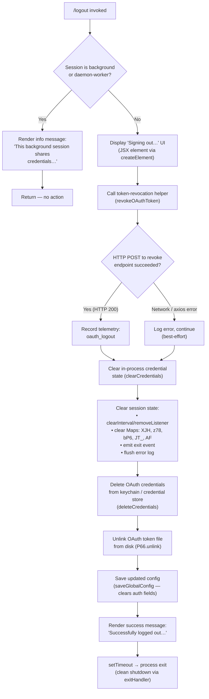

# `/logout`

> Analysis basis: CC v2.1.170 bundle.js (AST extraction + Claude interpretation)
> Minimum version: v2.1.170

---

## Overview

The `/logout` command signs the user out of their Anthropic account by revoking the active OAuth token, clearing all in-memory and on-disk credential state, and then performing a clean process exit. In background or daemon sessions, the command detects the shared-credential context and declines to act, instructing the user to run `/logout` from their main terminal instead.

---

## Registration

| Field | Value |
|---|---|
| type | `local-jsx` |
| name | `logout` |
| description | Sign out from your Anthropic account |
| loc_byte | `11762584` |
| loc_byte_end | `11762868` |
| loc_line | `8069` |
| module_id | `Si_` |
| load_inline | `true` |
| arbor_handler.name | `Ar7` |
| arbor_handler.fqn | `claude-2.1.170::Ar7` |
| arbor_handler.kind | `AsyncFunction` |
| arbor_handler.resolution_path | `module_id` |
| arbor_handler.n_hits | `0` |

Analysis basis: CC v2.1.170 bundle.js:+11762584

---

## Input Branching

The command has four distinct execution paths depending on session context, token-revocation outcome, and process-type guards.



Analysis basis: CC v2.1.170 bundle.js:+8282126 (handler entry `Ar7`), +8282236 (background-session guard), +8282435 (success literal), +8282589 (UI literal), +8281907 (telemetry key)

---

## Behavioral Spec

### Background / daemon-session guard

When the process context is identified as `"bg"`, `"daemon"`, or `"daemon-worker"`, the handler immediately renders an informational JSX element and returns without performing any logout action.

Analysis basis: CC v2.1.170 bundle.js:+8282199 (`q_6` call), +2264743 (`"bg"` literal), +2264753 (`"daemon"` literal), +2264767 (`"daemon-worker"` literal), +8282236 (message literal)

```
async function logoutHandler(appState, sessionContext):
    if processType(sessionContext) in {"bg", "daemon", "daemon-worker"}:
        renderJSX(INFO_MESSAGE_SHARED_CREDENTIALS)
        # "This background session shares credentials…"
        return

    executeLogout(appState)
```

---

### OAuth token revocation (`revokeOAuthToken` — `D$_`)

Sends an HTTP POST to the OAuth revocation endpoint with the current refresh token. The endpoint URL is resolved at runtime from the active environment profile (`"prod"`, `"staging"`, `"local"`).

- Payload: `{ refresh_token: <current_token> }` with `Content-Type: application/json`
- Timeout: 5000 ms (bundle.js:+2117845)
- On HTTP success: records the `"oauth_token_revoke"` event (bundle.js:+2117855)
- On Axios error: logs the error and continues the logout flow regardless

```
async function revokeOAuthToken(token):
    url = resolveOAuthEndpoint(currentEnv)
    try:
        response = await httpPost(url, { refresh_token: token },
                                  { timeout: 5000,
                                    headers: { "Content-Type": "application/json" } })
        recordEvent("oauth_token_revoke")
    except AxiosError as e:
        logError("network", e)
        # logout continues regardless
```

Analysis basis: CC v2.1.170 bundle.js:+2117687 (`$A.post`), +2117745 (`"refresh_token"` literal), +2117802, +2117817, +2117845, +2117855, +2117892 (`$A.isAxiosError`)

---

### Credential and session teardown (`clearAllSessionState` — `rI6`)

After token revocation, the handler orchestrates a multi-step teardown:

1. **Clear in-memory credential caches** (`Cv6`, `olH`) — removes auth objects from active stores.
2. **Clear the credential Map** (`A78` → `PH9.clear`) — wipes the runtime credential Map entirely (bundle.js:+3236168).
3. **Unregister process listeners** (`OwH`) — removes any process-level event handlers.
4. **Full session shutdown** (`E_H`) — calls the consolidated session-cleanup routine:
   - Stops log-rotation interval via `clearInterval` / `process.removeListener` (bundle.js:+3286099, +3286134)
   - Removes `"exit"` and `"beforeExit"` listeners (bundle.js:+3285397, +3286157)
   - Clears five internal tracking Maps: `XJH`, `z78`, `bP6`, `JT_`, `AF` (bundle.js:+3285465–+3285513)
   - Emits the internal `"exit"` event on the session event bus (`piH.emit`, bundle.js:+3285211)
   - Flushes the error-log queue (`hH` → `fQH.push`, `go.logError`)
5. **Delete OAuth credentials** from keychain / secure storage (`as9` → `P66.unlink`, bundle.js:+7380754).
6. **Unlink lock / temp files** (`Ug_` → `cRH.unlink`, bundle.js:+7330131).

```
function clearAllSessionState(appState):
    clearInMemoryCredentials()       # Cv6, olH
    credentialMap.clear()            # PH9.clear

    unregisterProcessHandlers()      # OwH

    stopLogRotation()                # clearInterval, process.removeListener
    removeExitListeners()            # process.off "exit" / "beforeExit"
    for map in [XJH, z78, bP6, JT_, AF]:
        map.clear()
    sessionEventBus.emit("exit")
    flushErrorLog()

    deleteOAuthCredentials()         # as9 / P66.unlink
    unlinkLockFile()                 # Ug_ / cRH.unlink
```

Analysis basis: CC v2.1.170 bundle.js:+8280979 (`rI6`), +3236168, +3285465, +7380754, +7330131

---

### Config persistence (`saveGlobalConfig` — `W8`)

After credential teardown, the handler mutates the persistent `~/.claude.json` config to remove the `auth` fields. The write is guarded by a file lock with a 60 000 ms acquisition timeout (bundle.js:+3306703). A safety check prevents a write that would silently wipe authentication data if the re-read on-disk copy is missing auth that the in-memory cache still holds (bundle.js:+3302985, +3306349).

Analysis basis: CC v2.1.170 bundle.js:+8281451 (`W8` call), +3302778, +3306703, +3302985

---

### Success rendering and exit (`Ar7` — main handler tail)

After the teardown completes, the handler:

1. Records the `"oauth_logout"` telemetry event (bundle.js:+8281907).
2. Renders a JSX element displaying `"Successfully logged out from your Anthropic account."` (bundle.js:+8282435).
3. Schedules a `setTimeout` that triggers a clean exit via `exitHandler` (`X4` → `G9` → `og_` → `process.exit`) (bundle.js:+8282498, +7339091).

```
async function logoutHandler(appState, sessionContext):
    # ... (guard + teardown as above) ...

    recordTelemetry("oauth_logout")
    renderJSX(SUCCESS_MESSAGE)
    # "Successfully logged out from your Anthropic account."

    setTimeout(() => {
        exitHandler(HTTP_STATUS_OK)   # 200
    }, SHUTDOWN_DELAY)
```

Analysis basis: CC v2.1.170 bundle.js:+8281907, +8282435, +8282498, +8282514 (`X4`), +8282530 (`200` literal)

---

### Clean-exit flow (`exitHandler` — `X4` → `G9`)

The clean-exit routine performs a final flush of pending I/O (via `Promise.race` with a 3 500 ms deadline — bundle.js:+7340851), drains the telemetry write queue (`pBH` → `LTA.drain`), writes a final `"session_end"` event (bundle.js:+7341241), and then calls `process.exit`. If the exit stalls beyond 2 000 ms (bundle.js:+7341029), a `SIGKILL` is sent as a fallback (bundle.js:+7339141).

Analysis basis: CC v2.1.170 bundle.js:+7339231, +7340851, +7341029, +7339091, +7339141

---

## State & Side Effects

| Item | Detail |
|---|---|
| Telemetry — `oauth_logout` | Fired after successful logout flow (bundle.js:+8281907) |
| Telemetry — `oauth_token_revoke` | Fired on HTTP revocation POST success (bundle.js:+2117855) |
| Telemetry — `tengu_feature_ok` | Fired inside secure-storage credential write path (bundle.js:+1014205) |
| Telemetry — `tengu_feature_sad` | Fired on transient secure-storage failure (bundle.js:+1014348) |
| Telemetry — `tengu_feature_bad` | Fired on hard secure-storage failure (bundle.js:+1014267) |
| Telemetry — `tengu_config_lock_contention` | Fired if config-file lock takes too long (bundle.js:+3306022) |
| Telemetry — `tengu_config_stale_write` | Fired if config written with stale data (bundle.js:+3306158) |
| Telemetry — `tengu_config_auth_loss_prevented` | Fired when safety check blocks auth-wiping write (bundle.js:+3306501) |
| Telemetry — `tengu_cache_eviction_hint` | Fired during exit cache flush (bundle.js:+7341203) |
| Telemetry — `tengu_scroll_summary` | Fired during session-end scroll state capture (bundle.js:+7340260) |
| Telemetry — `tengu_session_end` (literal `"session_end"`) | Written to final exit event log (bundle.js:+7341241) |
| Credential Map | `PH9` Map cleared in-process (bundle.js:+3236168) |
| Session Maps | `XJH`, `z78`, `bP6`, `JT_`, `AF` all cleared (bundle.js:+3285465–+3285513) |
| OAuth token file | Unlinked from disk via `P66.unlink` (bundle.js:+7380754) |
| Lock file | Unlinked via `cRH.unlink` (bundle.js:+7330131) |
| `~/.claude.json` | Auth fields removed; written under file lock (bundle.js:+3302778) |
| Process listeners | All `"exit"` / `"beforeExit"` listeners removed (bundle.js:+3285397, +3286157) |
| Process exit | `process.exit` called after `setTimeout` delay; SIGKILL fallback after 2 000 ms (bundle.js:+7339091, +7339141) |
| Sound | None observed in traversal |

---

## Version History

| Version | Change |
|---|---|
| v2.1.170 | Initial analysis |

---

## Common Mistakes

1. **Running `/logout` from a background terminal** — In background (`"bg"`), daemon, or daemon-worker sessions the command silently no-ops and displays an informational message. Always run `/logout` from the main (foreground) terminal session.
2. **Expecting an instant exit** — The handler schedules a `setTimeout` before calling `process.exit`, and the exit routine itself has a 3 500 ms I/O flush window. The terminal may remain active for several seconds after the success message appears.
3. **Network errors do not abort logout** — If the OAuth token revocation POST fails (e.g. offline), the command still clears all local credentials and exits. The remote token may remain valid at the server until it expires naturally.
4. **Re-authenticating immediately after logout** — Because `process.exit` is called unconditionally at the end of the flow, the entire CLI process terminates. A new `claude` invocation is required to re-authenticate.
5. **Config write guard** — If the on-disk `~/.claude.json` is missing auth fields that the in-memory cache still holds, the safety guard (bundle.js:+3306349, +3302985) will refuse to write, preventing silent auth loss. This can leave a partially-cleaned config; inspect the file manually if subsequent logins fail.

---

## Appendix — Identifier Mapping

> For bundle debugging only. Identifiers change across versions.

| Identifier | Role |
|---|---|
| `Ar7` | Main async logout handler (entry point resolved by Arbor via `module_id`) |
| `q_6` | Core logout execution function (token revocation + teardown orchestrator) |
| `qr7` | Logout UI renderer / JSX wrapper |
| `rI6` | Session-state teardown coordinator |
| `D$_` | OAuth token HTTP revocation helper |
| `X9` | Process-context / session-type resolver |
| `_wH` | Background-session type check utility |
| `E_H` | Full session-cleanup routine |
| `BiH` | Listener + Map teardown sub-routine |
| `TT_` | Log-rotation interval clear helper |
| `A78` | Credential Map clear helper |
| `Cv6` | In-memory credential cache clear (type A) |
| `olH` | In-memory credential cache clear (type B) |
| `OwH` | Process handler unregistration helper |
| `as9` | OAuth credential deletion from keychain/disk |
| `es9` | Secure-storage credential reader |
| `NQ_` | Credential read sub-step |
| `sFA` | Keychain access helper |
| `u4H` | Credential path builder |
| `tr6` | OAuth credential file-path resolver |
| `Ug_` | Lock/temp file unlink helper |
| `mg_` | Lock file manager |
| `Bg_` | Lock acquisition utility |
| `nLH` | Lock state resolver |
| `jwH` | Lock file path builder |
| `W8` | Global config save (writes `~/.claude.json`) |
| `k78` | Config file writer with lock |
| `B7H` | Config file read-then-write helper |
| `I78` | Config atomic-write helper |
| `CT_` | Config backup path builder |
| `xO6` | Atomic file write utility (temp + rename) |
| `K69` | Config entries iterator |
| `QP6` | Timestamp helper for config writes |
| `liH` | Config lock-contention logger |
| `ZJH` | Config schema validator |
| `JE1` | Config object initialiser |
| `LT_` | User / environment context resolver |
| `hH9` | Environment profile resolver |
| `Qw1` | OAuth user identity builder |
| `qk` | User ID hash helper (SHA-256) |
| `hv` | OS user-info lookup |
| `N2` | User environment variable reader |
| `MA8` | App entrypoint metadata builder |
| `r_` | String formatting utility |
| `_6` | Generic string coercion utility |
| `y4` | Secure storage read helper |
| `EE1` | Credential storage read/write engine |
| `XNH` | Storage async-read path |
| `Z3L` | Storage context runner |
| `SH` | Telemetry event emitter (feature ok/bad) |
| `s6` | Telemetry event emitter (feature sad) |
| `xH` | Telemetry event emitter (feature bad variant) |
| `K6` | Telemetry event dispatcher |
| `d` | Base telemetry record builder |
| `hH` | Error log flusher |
| `jA` | Error object builder |
| `lN4` | Error queue shift/push helper |
| `hq` | Essential-traffic queue helper |
| `PZH` | App-state mutation helper |
| `X4` | Exit handler entry point |
| `G9` | Clean-exit orchestrator |
| `sRH` | Terminal unmount + final write helper |
| `rg_` | Final output renderer |
| `og_` | Process kill / exit helper |
| `pBH` | Telemetry drain before exit |
| `j28` | Scroll-state capture helper |
| `da9` | Scroll metrics calculator |
| `ca9` | Scroll context reader |
| `Z1` | Terminal environment detector (fullscreen / tmux) |
| `_s9` | Parallel async cleanup settler |
| `IM6` | Startup profiling finaliser |
| `Xa8` | Profiling mark writer |
| `LVA` | Profiling report builder |
| `Cf6` | Cache eviction hint logger |
| `eRH` | Post-exit render resolver |
| `tyH` | JSX UI message builder |
| `dJ` | JSX element type resolver |
| `F4` | OTEL metric emitter |
| `syH` | OTEL resource attribute builder |
| `uB` | OTEL session context builder |
| `p$8` | OTEL attribute freeze helper |
| `$06` | OTEL string sanitiser |
| `B6H` | OTEL attribute allow-list checker |
| `gL` | OTEL gauge recorder |
| `kz9` | OTEL counter helper |
| `M` | MCP server state manager |
| `aSH` | MCP server connection runner |
| `Ic8` | MCP connection result applier |
| `IPA` | MCP retry / recovery orchestrator |
| `fo` | Feature-flag / config reader |
| `N` | HTTP request builder |
| `PeK` | HTTP auth header injector |
| `MTA` | HTTP credential formatter |
| `CH` | JSON body serialiser |
| `u4` | URL path builder |
| `FZA` | URL component mapper |
| `zFH` | Config write helper |
| `yZA` | Config file stream writer |
| `EeK` | Log file write manager |
| `mBH` | Log batch flusher |
| `L4H` | Log file path builder |
| `$M6` | Log EISDIR guard |
| `cZA` | Log current-file path resolver |
| `La8` | Log file rotation helper |
| `TeK` | Log append-file helper |
| `N9` | Log sink registrar |
| `n6` | File-exists check utility |
| `V8` | Error code classifier |
| `wM8` | Terminal write helper (ANSI save/restore) |
| `Kb` | Terminal state snapshot helper |
| `gv6` | Working-directory stat helper |
| `O$` | Output formatter |
| `la9` | Path display sanitiser |
| `ccK` | Supervisor heartbeat handler |
| `pTH` | Stdio output serialiser |
| `bzK` | Output column-width calculator |
| `T` | Render-loop stop/start controller |
| `Y` | Stdio transport manager |
| `f6` | File descriptor helper |
| `ff6` | Low-level fd utility |
| `w28` | Deferred render resolver |
| `Oi8` | OTEL event sequence tracker |
| `zi8` | OTEL event finaliser |
| `Y56` | OTEL event name builder |
| `EH` | Generic string wrapper |
| `Lm` | Session log initialiser |
| `nu` | Log context builder |
| `mC` | Log storage adapter |