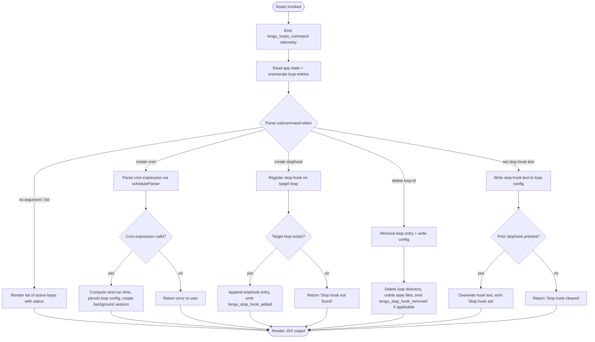

# `/loops`

> Analysis basis: CC v2.1.170 bundle.js (AST extraction + Claude interpretation)
> Minimum version: v2.1.170

---

## Overview

The `/loops` command provides a unified management interface for background loop sessions ("loops") in Claude Code — enabling users to list active loops, create new loops with scheduled (cron-based) or event-driven ("stophook") triggers, and delete existing loops. It operates as a `local-jsx` command that renders interactive UI, reads and writes loop configuration files inside the `.claude` directory, and coordinates with the background daemon to apply loop lifecycle changes.

---

## Registration

| Field | Value |
|---|---|
| type | `local-jsx` |
| name | `loops` |
| description | `List, create, and delete loops` |
| loc_byte | `12659017` |
| loc_byte_end | `12659174` |
| loc_line | `8991` |
| immediate | `true` |
| module_id | `VLK` |
| load_inline | `true` |
| arbor_handler.name | `_Ff` |
| arbor_handler.fqn | `claude-2.1.170::_Ff` |
| arbor_handler.kind | `AsyncFunction` |
| arbor_handler.resolution_path | `module_id` |
| arbor_handler.n_hits | `0` |

Analysis basis: CC v2.1.170 bundle.js:+12659017

---

## Input Branching

The command handles five distinct top-level paths based on the user's subcommand token and current loop state, warranting a Mermaid flowchart.



---

## Behavioral Spec

### Main Handler — loopsCommandHandler (bundle identifier: `_Ff`)

The handler is an `AsyncFunction` resolved via `module_id` path through module `VLK`.

```
async function loopsCommandHandler(context):
    emit telemetry("tengu_loops_command")          // bundle.js:+12657974
    loopList = await readLoopStateFiles(context)   // gAH → IhH
    displayConfig = buildDisplayConfig(loopList)   // Aq6 → $0H, V2q
    appState = context.getAppState()               // bundle.js:+12658024

    subcommand = parseSubcommand(context.input)    // v6, A.map
    // "cron" token detected at bundle.js:+12658070

    if subcommand is "list" or empty:
        return renderLoopList(loopList, displayConfig)

    elif subcommand starts with "cron":
        schedule = parseCronExpression(subcommand.remainder)  // HFf
        if schedule invalid:
            return renderError("invalid cron expression")
        newLoop = createLoopEntry(schedule, appState)          // _sH
        await persistLoopConfig(newLoop)                       // HsH
        await spawnBackgroundSession(newLoop)                  // FAH
        return renderSuccess(newLoop)

    elif subcommand starts with "stophook":
        // "stophook" literal at bundle.js:+12658156
        targetId = parseLoopId(subcommand)
        hook = resolveStopHook(appState, targetId)             // Kq6
        if hook not found:
            return renderMessage("Stop hook not found")        // bundle.js:+12658416
        emit telemetry("tengu_stop_hook_added")                // bundle.js:+10486378
        return renderMessage("Stop hook set")                  // bundle.js:+12658734

    elif subcommand is "delete":
        await deleteLoopEntry(targetId, appState)              // v2A
        if loop had stophook:
            emit telemetry("tengu_stop_hook_removed")          // bundle.js:+10486750
        return renderSuccess()

    render via pMA.createElement(...)                          // bundle.js:+12658777
```

Analysis basis: CC v2.1.170 bundle.js:+12657972

---

### Loop State Reader — readLoopStateFiles (bundle identifiers: `gAH` → `IhH`)

```
async function readLoopStateFiles(context):
    // Reads files encoded as "utf-8" (bundle.js:+4834450)
    rawBytes = await fs.readFile(loopStateFilePath, encoding="utf-8")
    parsed = parseLoopState(rawBytes)           // K5H → P4 → xZ
    validated = validateLoopEntries(parsed)     // P9 → V8
    enriched = enrichWithErrors(validated)      // hH → jA, _6, hq, lN4
    filtered = filterValidEntries(enriched)     // Array.isArray check bundle.js:+4834566
    normalized = normalizeMessages(filtered)    // N → PeK, CH, u4
    chunked = chunkMessages(normalized)         // pk → o87, A.push
    all.push(chunked)                           // bundle.js:+4834909
    return all
```

File errors handled:
- `ENOENT`, `EACCES`, `EPERM`, `ENOTDIR`, `ELOOP`, `EROFS` (bundle.js:+178464–178533)

Analysis basis: CC v2.1.170 bundle.js:+4836411

---

### Display Config Builder — buildDisplayConfig (bundle identifiers: `Aq6` → `$0H`, `V2q`)

```
function buildDisplayConfig(loopList):
    widthMap = new Map()
    for each loop in loopList:
        widthMap.set(loop.id, computeColumnWidth(loop))   // $0H → K.set
    columnWidths = mapToWidths(widthMap)                  // V2q → H.map
    entries.push(columnWidths)                            // Aq6 → A.push bundle.js:+10485815
    // Pad columns with "  " (two spaces) bundle.js:+16554593
    return { widthMap, columnWidths }
```

Analysis basis: CC v2.1.170 bundle.js:+12658020

---

### Cron Expression Parser — parseCronExpression (bundle identifier: `HFf`)

Parses cron-format strings into structured schedule objects. Supports a human-readable schedule tier:
- `"Every minute"` (bundle.js:+4832314)
- `"Every hour"` (bundle.js:+4832531)
- Range notation `"1-5"` (bundle.js:+4833238)

```
function parseCronExpression(input):
    trimmed = input.trim()                           // DN → H.trim bundle.js:+4832194
    fields = splitCronFields(trimmed)                // K.match bundle.js:+4832335
    minute = parseInt(fields.minute)                 // bundle.js:+4832370
    // Clamp minute: max 59 (bundle.js:+12657739), max hour: 23 (bundle.js:+12657810)
    // Clamp day-of-month: max 31 (bundle.js:+12657863)
    // Clamp fields to 60-unit boundary (bundle.js:+12657705)
    dayOffset = computeDayOffset(minute)             // j.getUTCDay, j.setUTCDate
    nextRunTime = alignToSchedule(dayOffset)         // j.setUTCHours, j.getDay
    // Math.max, Math.ceil, Math.round used for boundary alignment
    // bundle.js:+12657682, +12657693, +12657766
    lineRanges = resolveLineRanges(input)            // pk → o87 bundle.js:+12657930
    return { minute, nextRunTime, lineRanges }
```

Numeric bounds found in scope:
- Max cron minute: **59** (bundle.js:+12657739)
- Max cron hour: **23** (bundle.js:+12657810)
- Max cron day-of-month: **31** (bundle.js:+12657863)
- Internal field cap: **60** (bundle.js:+12657705)

Analysis basis: CC v2.1.170 bundle.js:+12658524

---

### Stop Hook Manager — stopHookManager (bundle identifier: `Kq6`)

```
async function stopHookManager(context, loopId, hookText):
    config = context.getAppState()                      // H.getAppState bundle.js:+10486495
    if hookText is null or empty:
        // Clear path
        if hook exists:
            emit "Stop hook cleared"                    // bundle.js:+12658438
        else:
            emit "Stop hook not found"                  // bundle.js:+12658416
        return

    // Set path
    opId = generateUUID()                               // Huq → sxq.randomUUID bundle.js:+10486844
    context.setAppState(updatedConfig)                  // H.setAppState bundle.js:+10486624
    context.applyMessageOp({                            // H.applyMessageOp bundle.js:+10486693
        type: "append",                                 // bundle.js:+10486716
        kind: "attachment",                             // bundle.js:+10486826
        goalKind: "goal",                               // bundle.js:+10486784
        goalStatus: "goal_status"                       // bundle.js:+10486913
    })
    emit tengu_stop_hook_added                          // bundle.js:+10486378
    render confirmation via f6 → ff6                   // bundle.js:+10486781
```

Analysis basis: CC v2.1.170 bundle.js:+12658398

---

### Loop Entry Creator — createLoopEntry (bundle identifier: `_sH`)

```
async function createLoopEntry(schedule, appState):
    id = CX9.randomUUID()                              // bundle.js:+4835750
    createdAt = Date.now()                             // bundle.js:+4835812
    dirPath = path.join(claudeDir, id)                 // ".claude" bundle.js:+4835591
    enrichedEntry = enrichEntryMetadata(id, schedule)  // GZH
    rawState = await readLoopStateFiles(appState)      // IhH bundle.js:+4835902
    entries.push(enrichedEntry)                        // M.push bundle.js:+4835915
    // Random UUID seed: 8 (bundle.js:+4835775)
    await persistLoopDir(dirPath, entries)             // v6, Xa, HsH bundle.js:+4835947–4836009
    return enrichedEntry
```

Analysis basis: CC v2.1.170 bundle.js:+12658622

---

### Loop Config Persistence — persistLoopConfig (bundle identifier: `HsH`)

```
async function persistLoopConfig(entry, basePath):
    configPath = path.join(basePath, ".claude", entry.id)   // bundle.js:+4835580/4835591
    await fs.mkdir(configPath, { recursive: true })          // bz8.mkdir bundle.js:+4835570
    fileData = entry.fields.map(serializeField)              // H.map bundle.js:+4835631
    await fs.writeFile(configPath, fileData)                 // bz8.writeFile bundle.js:+4835667
    stateHash = computeStateHash(entry)                      // K5H bundle.js:+4835681
    serialized = serializeToJSON(stateHash)                  // CH bundle.js:+4835688
```

Analysis basis: CC v2.1.170 bundle.js:+4835559

---

### Loop Deletion — deleteLoopEntry (bundle identifier: `v2A`)

```
async function deleteLoopEntry(loopId, appState):
    rosterEntry = appState.rosterEntry(loopId)         // bundle.js:+16537209
    // Determine loop state prior to removal
    state = await readLoopState(loopId)                // Wq
    // Possible states: "done", "killed", "failed", "crashed",
    //   "blocked", "working", "bg", "daemon", "idle",
    //   "active", "resuming", "stopped", "unknown"
    //   (bundle.js:+16535847–16537681)

    if state is deletable:
        await $Y.rm(loopDir)                           // bundle.js:+16535937
        await $Y.unlink(stateFile)                     // bundle.js:+16536988
        clearFromRoster(appState)
        // Timeout for cleanup: 300000 ms (5 min) bundle.js:+16537467
        if loopId in pendingCleanup:
            Y.delete(loopId)                           // bundle.js:+16537454
        H.delete(loopId)                               // bundle.js:+16537509
    else:
        scheduleKill(loopId)                           // w → b.kill SIGKILL bundle.js:+16529742/+16529749
```

Loop state lifecycle values found (bundle.js:+16535847–16537681):
`"done"`, `"killed"`, `"failed"`, `"crashed"`, `"blocked"`, `"working"`, `"bg"`, `"daemon"`, `"idle"`, `"active"`, `"resuming"`, `"stopped"`, `"unknown"`

Analysis basis: CC v2.1.170 bundle.js:+16535711

---

### Loop Listing Renderer — renderLoopList (bundle identifiers: `FpK`, `DN`)

```
function renderLoopList(loopList, displayConfig):
    rows = loopList.map(loop => formatRow(loop, displayConfig))  // H.map bundle.js:+16037966
    for each row:
        statusText = formatLoopStatus(row)           // DN bundle.js:+16037988
        width = Math.max(widths)                     // bundle.js:+16038097
    // Pluralization literals:
    //   "s were" / " was" (bundle.js:+16037653/+16037662)
    //   "They have" / "It has" (bundle.js:+16037711/+16037723)
    //   "these prompts" / "this prompt" (bundle.js:+16037809/+16037825)
    //   "each one" / "it" (bundle.js:+16037906/+16037917)
    output = rows.join("\n")                         // q.join bundle.js:+16038203
    return output
```

Analysis basis: CC v2.1.170 bundle.js:+16034656

---

### Background Session Launch — spawnBackgroundSession (bundle identifier: `FAH`)

```
async function spawnBackgroundSession(loopEntry):
    loopId = loopEntry.id
    stateSnapshot = readLoopStateFiles()                // IhH bundle.js:+4836130
    valid = stateSnapshot.filter(isEligible)            // q.filter bundle.js:+4836139
    if loopId already tracked:                          // A.has bundle.js:+4836154
        return existing session
    config = buildSessionConfig(loopId)
    await persistConfig(config)                         // HsH bundle.js:+4836203
    session = await daemon.spawn(config)                // nQ.spawn bundle.js:+16531463
    return session
```

Analysis basis: CC v2.1.170 bundle.js:+12658259

---

### Schedule Display Formatter — formatScheduleForDisplay (bundle identifier: `qq6`)

Formats the loop's schedule object into a user-readable cron string for display in the listing.

```
function formatScheduleForDisplay(loop, appState):
    rendered = renderScheduleTokens(loop.schedule)     // yAA → eC, S_H, F_, If bundle.js:+10485992
    config = appState.getAppState()                    // _.getAppState bundle.js:+10486077
    ts = Date.now()                                    // bundle.js:+10486241
    tokenCounts = computeOutputTokens(config)          // QD → TBH, Object.values bundle.js:+10486266
    appState.setAppState(updatedView)                  // _.setAppState bundle.js:+10486279
    appState.applyMessageOp(op)                        // _.applyMessageOp bundle.js:+10486321
    hookId = generateUUID()                            // Huq bundle.js:+10486363
    return { rendered, ts, hookId }
```

Literal tokens in rendering pipeline:
- `"prompt"` (bundle.js:+10485806)
- `"Stop"` (bundle.js:+10485699)
- `"hooks_gate"` (bundle.js:+10485888)
- `"trust_gate"` (bundle.js:+10485942)
- `"goal_set"` (bundle.js:+10486020)
- `"outputTokens"` (bundle.js:+44904)
- `"skip"` (bundle.js:+12658883)

Analysis basis: CC v2.1.170 bundle.js:+12658710

---

## State & Side Effects

| Item | Detail |
|---|---|
| Telemetry | `tengu_loops_command` (bundle.js:+12657974) — fired on every invocation |
| Telemetry | `tengu_stop_hook_added` (bundle.js:+10486378) — fired when a stop hook is registered |
| Telemetry | `tengu_stop_hook_removed` (bundle.js:+10486750) — fired when a stop hook is deleted |
| Telemetry | `tengu_bg_dispatch_sigkill_escalate` (bundle.js:+16529701) — fired on forceful loop kill |
| Telemetry | `tengu_daemon_config_reload` (bundle.js:+16545205) — fired on daemon config reload |
| Telemetry | `tengu_daemon_control` (bundle.js:+16566763) — fired on daemon control operations |
| Telemetry | `tengu_scheduled_task_missed` (bundle.js:+16034551) — fired when a scheduled task was missed |
| Telemetry | `tengu_feature_bad` / `tengu_feature_ok` / `tengu_feature_sad` (bundle.js:+1014267/+1014205/+1014348) — feature gate signals |
| Telemetry | `tengu_bg_low_mem_mb` (bundle.js:+13199943), `tengu_bg_dispatch_low_mem` (bundle.js:+16530302) — memory-pressure signals |
| Telemetry | `tengu_iron_gate_closed` (bundle.js:+7257797) — gating event |
| Telemetry | `tengu_bg_spare_enable`, `tengu_bg_spare_claim`, `tengu_bg_spare_claim_fail` (bundle.js:+16531006/16531134/16531400) — spare-session pool events |
| Telemetry | `tengu_bg_sendclaim_failed` (bundle.js:+16508741) — claim failure event |
| Telemetry | `tengu_bg_state_read_transient` (bundle.js:+4214406) — transient state read |
| Telemetry | `tengu_mcp_skills` (bundle.js:+6587132) — MCP skill telemetry |
| File I/O | Creates/reads/deletes files under `.claude/<loop-id>/` directory (bundle.js:+4835591) |
| File I/O | Writes `daemon.status.json` (bundle.js:+12925689) and `pins.json` (bundle.js:+4215503) |
| appState changes | `setAppState`, `applyMessageOp` (bundle.js:+10486279/+10486321) |
| appState changes | `getAppState` read on entry (bundle.js:+12658024) |
| Daemon interaction | `nQ.spawn` / `nQ.claim` / `nQ.buildClaimFrame` for background session management |
| Signal handling | SIGKILL (bundle.js:+16529749) and SIGTERM (bundle.js:+16508979) for loop termination |
| Cleanup timeout | 300,000 ms (5 minutes) grace period before forced removal (bundle.js:+16537467) |
| Hook registration | Stop hooks written as `"stophook"` type entries (bundle.js:+12658156) |
| MCP side effects | MCP connection/skill management triggered through `aSH` / `IPA` / `M` subsystem |
| Sound | <!-- TODO: not found in depth-2 traversal; needs --depth 4 --> |

---

## Version History

| Version | Change |
|---|---|
| v2.1.170 | Initial analysis |

---

## Common Mistakes

1. **Providing an invalid cron expression**: The parser enforces strict numeric bounds (minute ≤ 59, hour ≤ 23, day-of-month ≤ 31). Expressions that exceed these bounds or use unsupported syntax will cause an error rather than silently wrapping.
2. **Deleting a loop that is still "working" or "blocked"**: The deletion path checks loop state before removing files. Loops in active states receive a SIGKILL escalation before file removal; forcibly deleting while a background session is writing can leave orphaned state files.
3. **Setting a stop hook on a non-existent loop ID**: The command returns `"Stop hook not found"` (bundle.js:+12658416) with no partial side effect — always verify the loop ID from `/loops` list output first.
4. **Expecting instant cleanup after delete**: The cleanup timeout is 300,000 ms (5 minutes, bundle.js:+16537467). The roster entry and state files may persist in a transitional state within this window.
5. **Confusing `"cron"` and `"stophook"` subcommand syntax**: These are distinct tokens parsed separately. A stop hook must reference an existing loop; it cannot be set during loop creation in the same invocation.

---

## Appendix — Identifier Mapping

> For bundle debugging only. Identifiers change across versions.

| Identifier | Role |
|---|---|
| `_Ff` | Main loops command handler (AsyncFunction, module VLK) |
| `d` | Utility / dependency helper called at entry |
| `gAH` | Loop state reader orchestrator |
| `IhH` | Core loop state file reader (reads UTF-8, validates entries) |
| `n6` | File path resolver helper |
| `K5H` | State hash / path join helper |
| `P4` | Path construction utility |
| `P9` | Loop entry validator |
| `V8` | Validation error formatter |
| `hH` | Loop entry enricher / error handler |
| `jA` | Error message builder |
| `_6` | String coercion utility |
| `hq` | Essential-traffic filter |
| `lN4` | Queue shift/push manager |
| `N` | Message normalizer / header builder |
| `PeK` | Normalization sub-step (CI, dZA, MTA) |
| `H` | Random-delay utility (Math.random + setTimeout) |
| `CH` | JSON serializer (JSON.stringify wrapper) |
| `u4` | Path/string transformer (replace, slice, lastIndexOf) |
| `zFH` | Message formatter (yZA) |
| `EeK` | Context enrichment (dirname, buffer length, binding) |
| `pk` | Chunk splitter (trim + parse) |
| `o87` | Line-range parser (split, match, parseInt, Set operations) |
| `A` | toLowerCase normalizer |
| `L` | Stream/queue finalizer (add, finally, delete) |
| `q` | Data event emitter (Y1-based) |
| `f` | Stream close handler |
| `mT` | Secondary path resolver (xZ) |
| `xZ` | Path resolution primitive |
| `Aq6` | Display config entry builder ($0H, A.push) |
| `$0H` | Width-map setter (K.set, V2q) |
| `K` | Column map (L.map, padEnd) |
| `V2q` | Width array mapper (H.map) |
| `v6` | App-state read helper (xZ) |
| `DN` | Loop status formatter / cron display (trim, match, parseInt, date ops) |
| `w` | Background session manager (kill, spawn, socket, memory checks) |
| `b` | Loop session lifecycle controller (IhH, Y, N, Xa, HsH, mX9, P, z, S, X, c) |
| `Y` | Session writer (pTH, q.write, bzK, f.get, T.stop, E lifecycle) |
| `Xa` | hLH-based helper |
| `HsH` | Loop config persistence (mkdir, writeFile, path.join) |
| `mX9` | Filter + date helper (eaH) |
| `P` | Buffer/stream reader (concat, indexOf, subarray, timeout) |
| `z` | Daemon stop dispatcher (SH, xH, ih, ZU) |
| `S` | Session stream handler (icK, j3, N, hH, jX5, Y.write) |
| `X` | Timeout setter (M, q.setTimeout) |
| `c` | Sub-process pair (kb6, piq) |
| `FpK` | Loop list row formatter (H.map, DN, Math.max, q.join) |
| `FAH` | Background session spawner (j6H, IhH, q.filter, A.has, HsH) |
| `o8` | Process/socket timeout handler (setTimeout, clearTimeout, L.unref) |
| `O` | S8-based status helper |
| `xH` | Feature-ok telemetry path (d, K6) |
| `K6` | ff6-based primitive |
| `SH` | Feature-ok telemetry signal (d, K6) |
| `dU8` | macOS memory check (a6, Y6) |
| `Y6` | Memory/pin lookup (uP6, mP6, Lm, XJH, D78, bP6, AF, h6) |
| `oW6` | Pins.json reader (_W.readFile, Kk_, Q6, Array.isArray, filter, crL) |
| `Kk_` | Pins path builder (Dj.join, VE) |
| `Q6` | JSON.parse wrapper |
| `k8` | V8-based validator |
| `crL` | Directory loop state reader (_W.readdir, VE, Promise.all, H.filter, readFile, push, mO9, k8, Jz) |
| `Q` | Permission policy manager (lH6, LQ) |
| `lH6` | Allow/deny/warn/classify resolver (Dg_, Ov6, eh, N) |
| `LQ` | Permission request handler (a4, lP, GJ, _6, W96, Z8A, Mq, d3f, c3f, V8A, JSq, jN) |
| `W2A` | Daemon claim/socket connector (nQ.claim, cYA, dj5, Qj5, K.socketAuth, d, Qf, EH, N, dc8.connect) |
| `cYA` | Session metadata writer (a6, bb6, iQ.mkdir, Cb6, iQ.writeFile, JSON.stringify) |
| `dj5` | Claim-send with timeout (Date.now, Error, cj5, V8, o8) |
| `Qj5` | Claim frame builder (nQ.buildClaimFrame) |
| `Qf` | V8-based status checker |
| `EH` | String-based error formatter |
| `dV` | Binary frame builder (Buffer.from, allocUnsafe, writeUInt32BE, writeUInt8, copy) |
| `v2A` | Loop deletion / lifecycle manager ($Y.rm, $Y.unlink, hH, Wq, MO, hjH, Sf, $K6, xb6, z$H, qZ, VQ, bb6) |
| `sK` | Loop path builder (Dj.join, VE) |
| `Wq` | Loop state reader with stat (Promise.all, _W.stat, k8, xfH, SjH, N, Dj.basename, Q6, Number ops) |
| `MO` | Active-state marker (tv → "active") |
| `hjH` | Roster entry filter (startsWith, indexOf, slice, bfH, X$8, _k_, N, FrL) |
| `Sf` | Path + serialization helper (AO, Dj.join, CH, wj) |
| `$K6` | Async task tracker (Hrq.then, vQ, H, Date.now, ZNf, _.catch) |
| `xb6` | State file path builder (j$.join, Cb6) |
| `z$H` | State file path builder variant (j$.join, TmH) |
| `qZ` | Split-based state parser (a6, j$.join, TmH, H.split) |
| `VQ` | Versioned path builder (a6, B4A, j$.join, fK6) |
| `bb6` | Basic path builder (j$.join, Cb6) |
| `D` | Forced-shutdown handler (Qj, process.exit, z.abort) |
| `Qj` | Shutdown initiator |
| `F` | Disposable resource holder (F.dispose) |
| `J` | Session killer (A.values, S.kill) |
| `$` | f$K-based process invoker |
| `f$K` | Invocation with timestamp (Xa, Date.now, m9, hu6, CH) |
| `m9` | Store accessor (JCL.getStore) |
| `hu6` | Status path builder (L$K.join, H_) |
| `j` | Date object for UTC cron alignment (w reference) |
| `Kq6` | Stop hook set/clear manager (v6, Aq6, H.getAppState, H.setAppState, H.applyMessageOp, Huq, d, f6) |
| `Huq` | UUID generator (sxq.randomUUID) |
| `f6` | ff6-based primitive |
| `ff6` | Low-level primitive |
| `HFf` | Cron expression parser (H.match, parseInt, Math.max/ceil/round, pk) |
| `_sH` | Loop entry creator (CX9.randomUUID, Date.now, GZH, IhH, M.push, v6, Xa, HsH) |
| `GZH` | Loop entry metadata enricher |
| `M` | MCP server manager (aSH, Ic8, L.get, N, L.values, $, IPA) |
| `aSH` | MCP connection applier (Object.entries, pn, vV, H, K.push, F8, BZ6, Cg9, sD8, rD8, M8, bJ8, xJ8, Fg9, Rm_, VN, Gm_, y, U7, mg9, CeH, Cj8) |
| `pn` | MCP server config normalizer (nE6, kt, NPH, Ag, zJ8, HX, q.has, cE6, Object.assign) |
| `vV` | MCP transport resolver (kY, Tm_) |
| `F8` | _ (underscore utility) |
| `BZ6` | MCP filter helper |
| `Cg9` | MCP connection attempt (zU_, yPH, aD8, Date.now) |
| `sD8` | MCP state setter (aD8, QP) |
| `rD8` | MCP state reader (y4) |
| `M8` | MCP debug logger (fQH.push, go.logMCPDebug) |
| `bJ8` | OAuth tool registrar (fX7, Dc, qX7, sAH, tAH, $1H, feH, uJ8, Fn, hu, Y, uE, M8, U7, EH, Promise.race, MX7, LX7) |
| `xJ8` | OAuth callback handler (Dc, KX7, LeH, MeH, L, EH) |
| `Fg9` | MCP post-connection handler (kj8.then, zU_, m9, Rj8, CH) |
| `Rm_` | MCP result handler (QP, y4, M8, EH) |
| `VN` | MCP skills emitter (Y6 → tengu_mcp_skills) |
| `Gm_` | MCP guard (W8, A.includes) |
| `y` | Warning / fable-usage-credits message emitter |
| `U7` | MCP error logger (fQH.push, go.logMCPError) |
| `mg9` | SF-based helper |
| `CeH` | parseInt-based config reader |
| `Cj8` | parseInt-based config reader (variant) |
| `Ic8` | MCP connection result applier (H.applyMcpUpdate, oSH, M8, A.cleanup, pE, Xw) |
| `oSH` | yPH-based state helper |
| `pE` | MCP cleanup (SeH, K.cleanup, VN) |
| `IPA` | MCP server roster updater (Object.entries, A.filter, _.getClients, WJ8, q, o8, N, SeH, aSH, Ic8, Object.fromEntries, K.map) |
| `WJ8` | MCP server membership checker (bj7.has, vm_.has) |
| `SeH` | yPH-based state accessor |
| `qq6` | Schedule display formatter / loop view renderer (yAA, s6, v6, Aq6, _.getAppState, Date.now, QD, _.setAppState, _.applyMessageOp, Huq, d, f6, SH) |
| `yAA` | Schedule token renderer (eC, S_H, F_, If) |
| `eC` | y8-based renderer |
| `y8` | JSX render primitive (Ro6, XB) |
| `S_H` | String formatter (y8, FA) |
| `F_` | Schedule format helper |
| `If` | xSL-based resolver |
| `xSL` | Policy/path resolver (_6, CBH, X9, h6, vJH, fc, C6, $w.resolve) |
| `s6` | Primitive render helper (d, K6) |
| `QD` | Output token counter (TBH, Object.values) |

---

*Note: index built via Arbor fallback; some signals (telemetry, literals) may be missing — see arbor-fallback.js.*