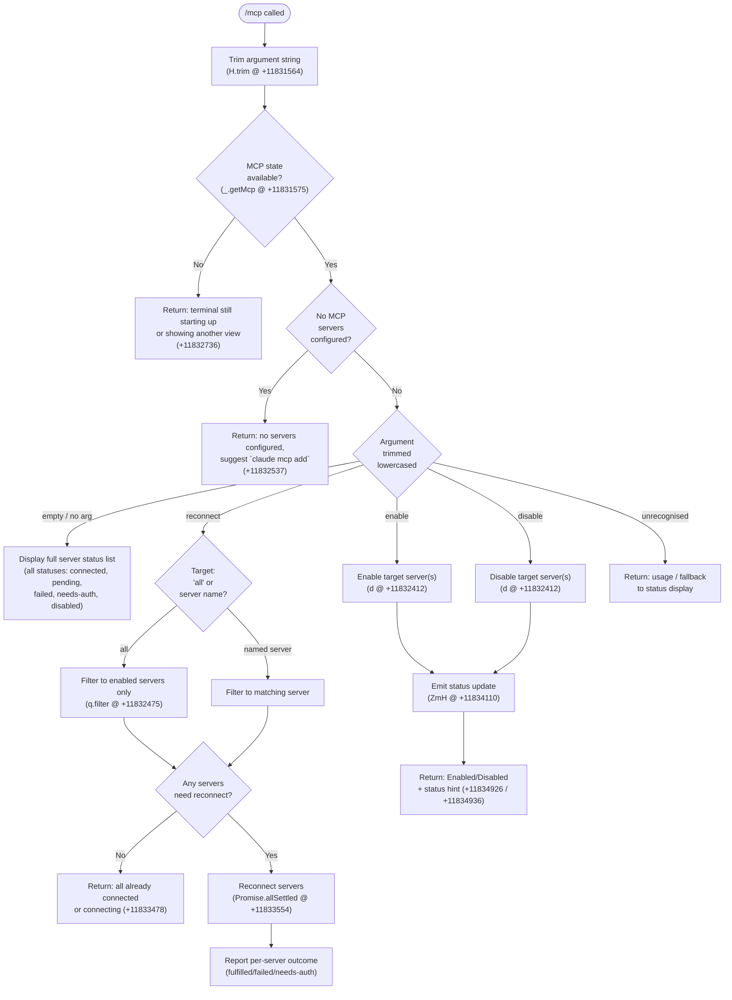

# `/mcp`

> Analysis basis: CC v2.1.170 bundle.js (AST extraction + Claude interpretation)
> Minimum version: v2.1.170

---

## Overview

The `/mcp` command provides in-session management of Model Context Protocol (MCP) servers. It supports listing server status, reconnecting, enabling, and disabling individual servers or all servers at once. The command is handled by an async function (`Ekf`) resolved via the `zsq` module and operates against the application's live MCP state.

---

## Registration

| Field | Value |
|---|---|
| type | `local` |
| name | `mcp` |
| description | `Manage MCP servers` |
| argumentHint | `[reconnect\|enable\|disable [<server>\|all]]` |
| supportsNonInteractive | `true` |
| module_id | `zsq` |
| load_inline | `true` |
| loc_byte | `12084852` |
| loc_byte_end | `12085044` |
| loc_line | `8291` |
| arbor_handler.name | `Ekf` |
| arbor_handler.kind | `AsyncFunction` |
| arbor_handler.fqn | `claude-2.1.170::Ekf` |
| arbor_handler.resolution_path | `module_id` |
| arbor_handler.n_hits | `0` |

Analysis basis: CC v2.1.170 bundle.js:+12084852

---

## Input Branching

The handler parses the trimmed argument string and dispatches to one of five distinct branches (no-argument status display, `reconnect`, `enable`, `disable`, and various error/guard paths), so a Mermaid flowchart is used.



---

## Behavioral Spec

### 1. Argument Parsing

```
async function mcpCommandHandler(rawArg, appState):
    arg = rawArg.trim()                          // H.trim, +11831564
    mcpState = appState.getMcp()                 // _.getMcp, +11831575
    subcommand = arg.toLowerCase()               // A.toLowerCase, +11831624

    if mcpState is unavailable:
        return errorMessage("MCP controls aren't available right now …")
                                                 // +11832736
```

Analysis basis: CC v2.1.170 bundle.js:+11831564

### 2. Guard: No Servers Configured

```
    servers = mcpState.allServers()

    if servers is empty:
        return errorMessage(
            "No MCP servers are configured. Add one with `claude mcp add`."
        )                                        // +11832537
```

Analysis basis: CC v2.1.170 bundle.js:+11832537

### 3. Status Display (no argument)

When `subcommand` is empty, the handler renders a status table covering every known server. Each server entry is annotated with one of the following status strings:

| Status String | Meaning |
|---|---|
| `connected` | Server reachable and active (+11831789) |
| `pending` | Connection in progress (+11831823) |
| `failed` | Connection attempt failed (+11831855) |
| `needs-auth` | Authentication required (+11831874) |
| `disabled` | Explicitly disabled (+11831909) |
| `needs-approval` | Awaiting user approval (+11830973) |

Servers whose connection failed display the inline hint `" Reply /mcp reconnect all here to retry."` (fragment; +11832065). The output type is `text` (+11835835).

Analysis basis: CC v2.1.170 bundle.js:+11831789

### 4. Reconnect Sub-command

```
    if subcommand starts with "reconnect":            // +11832284
        target = remainder of subcommand arg

        if target == "all":                           // +11832271
            candidateServers = servers.filter(enabled)
        else:
            candidateServers = servers.filter(name matches target)

        if candidateServers is empty or all already connected/connecting:
            return message(
                "All enabled MCP servers are already connected or connecting."
            )                                         // +11833478

        results = await Promise.allSettled(           // +11833554
            candidateServers.map(reconnectServer)     // E.map, +11833573
        )

        for each result in results:
            if result.status == "fulfilled":          // +11833619
                // report success
            else if result.status needs-auth:
                hint = "Authenticate with `/mcp` in the terminal."  // +11833764
            else:
                hint = "Check its config with `/mcp` in the terminal." // +11833808

        if any server still failing ($.some @ +11834098):
            emit statusUpdate(ZmH @ +11834110)

        return formatted reconnect summary
```

Analysis basis: CC v2.1.170 bundle.js:+11832284, +11833554

### 5. Enable / Disable Sub-commands

```
    if subcommand starts with "enable":               // +11832301
        action = ENABLE
    else if subcommand starts with "disable":         // +11832315
        action = DISABLE

    target = remainder of subcommand
    applyEnableDisable(target, action, mcpState)      // d, +11832412

    emit telemetry("tengu_mcp_command_inline")        // +11832414

    label = (action == ENABLE) ? "Enabled" : "Disabled"
                                                      // +11834926 / +11834936
    return label + ". Run `/mcp` in the terminal to see status."
                                                      // +11835761
```

The enable/disable path emits the `tengu_mcp_command_inline` telemetry event immediately after the state mutation.

Analysis basis: CC v2.1.170 bundle.js:+11832301, +11832412

### 6. Valid Sub-command Set

The handler validates `subcommand` against the set `{ "reconnect", "enable", "disable", "all" }` using an includes check against an internal constant list (`_QH.includes` at +11831647 and `l6H.includes` at +11832170). Unrecognised sub-commands fall through to status display or a usage message.

Analysis basis: CC v2.1.170 bundle.js:+11831647, +11832170

### 7. MCP Server Connection Lifecycle (called during reconnect)

```
function reconnectServer(server):
    // serverConnectionManager (G) orchestrates:
    // 1. Retrieve transport type (sdk / http / sse / dynamic)
    // 2. Call connection initialiser (V76, CS, vN)
    // 3. Await Promise.all for capability negotiation (nn, tF)
    // 4. On error: log "Connection failed" and push to error queue (hH)
    // 5. Return connected client or error
```

Transport type literals observed: `"sdk"` (+16374262), `"http"` (+16371606), `"sse"` (+16371623), `"dynamic"` (+16371668).

Analysis basis: CC v2.1.170 bundle.js:+16374343

### 8. Daemon / Process Control (background path)

A background session abort path (`z`, +11834806) handles forced shutdown of MCP daemon processes when required:

```
function abortBackgroundSession(session):
    // forced shutdown label used in logging (+16563085)
    // calls Qj (forced quit helper), z.abort, then process.exit if needed
    // daemon_stop event emitted on success   (+16566688)
    // daemon_stop_failed event on failure    (+16566725)
    // ZU orchestrates Promise.race between graceful shutdown
    //   (cLH → dLH.shutdown) and a 500 ms timeout (o8, +16561806)
    //   before calling process.exit (+16561845)
```

Analysis basis: CC v2.1.170 bundle.js:+16566688, +16561806

### 9. Daemon Status File

The reconnect flow reads a daemon status file named `"daemon.status.json"` (+12925689) via the path-builder (`hu6` → `L$K.join`), timestamped via `Date.now` (+12925801) and stored through the async context store (`m9` → `JCL.getStore`, +3418383).

Analysis basis: CC v2.1.170 bundle.js:+12925689

---

## State & Side Effects

| Item | Detail |
|---|---|
| Telemetry: `tengu_mcp_command_inline` | Fired on every `enable` or `disable` sub-command execution (+11832414) |
| Telemetry: `tengu_feature_ok` | Fired when a feature gate check passes (+1014205) |
| Telemetry: `tengu_feature_bad` | Fired when a feature gate check fails (+1014267) |
| Telemetry: `tengu_daemon_control` | Fired during daemon lifecycle operations (+16566763) |
| MCP state mutation | `enable`/`disable` mutate the persisted server enable-state via `d` (+11832412) |
| Status emission | `ZmH` is called to push a status update after reconnect or enable/disable (+11834110, +11832901) |
| Background session | `z.abort` can trigger process exit; guarded by `Promise.race` with 500 ms timeout (+16561806) |
| Daemon status file | Reads/writes `daemon.status.json` in the daemon data directory (+12925689) |
| Event emission | `H.emit` is used inside the UUID-tagged session watcher path (`Ww_` → `H.emit`, +2501251) |
| Log error | `go.logError` records connection failures with severity `"error"` (+1019997, +1019972) |
| Output type | Always returns `text`-type content (+11835835) |

---

## Version History

| Version | Change |
|---|---|
| v2.1.170 | Initial analysis |

---

## Common Mistakes

1. **Omitting the server name with `enable`/`disable`**: The argument hint `[reconnect|enable|disable [<server>|all]]` makes the server target look optional, but providing no target after `enable`/`disable` will match no servers and produce no useful action.
2. **Using `/mcp reconnect` when servers are disabled**: Reconnect only operates on *enabled* servers. A server in `disabled` state must be re-enabled with `/mcp enable <server>` before reconnect will attempt it.
3. **Expecting immediate UI refresh**: After `enable`/`disable`, the status update is emitted asynchronously via `ZmH`; the terminal view may lag by one render cycle before reflecting the new state.
4. **Running `/mcp` during startup**: If the terminal UI is still initialising, the command returns an early error (`"MCP controls aren't available right now…"`, +11832736) rather than server status.
5. **Assuming `reconnect all` covers disabled servers**: The filter at `q.filter` (+11832475) explicitly restricts the reconnect candidate list to *enabled* servers only.

---

## Appendix — Identifier Mapping

> For bundle debugging only. Identifiers change across versions.

| Identifier | Role |
|---|---|
| `Ekf` | Main async handler for `/mcp` command (arbor_handler) |
| `H` | Jitter/delay utility; also event emitter used in session watcher |
| `_` | App-state accessor (provides `getMcp`, `trim`) |
| `A` | Sub-command string normaliser (toLowerCase) |
| `f` | MCP client / connection object (has `close`, `toLowerCase`) |
| `q` | Active connection set (add / delete / filter / close operations) |
| `Y1` | Process exit coordinator (calls shutdown helpers and `process.exit`) |
| `L` | Connection-tracking wrapper (add, delete, finally lifecycle) |
| `MZ` | Server status renderer / formatter |
| `F8` | Feature-gate checker |
| `d` | Enable/disable state mutator for individual MCP servers |
| `K6` | Telemetry event dispatcher |
| `ff6` | Telemetry transport / sink |
| `Cx8` | UI availability guard (checks terminal view state) |
| `Msq` | Error/status message builder for status display |
| `vLA` | Status update emitter (calls `ZmH`) |
| `ZmH` | Status broadcast / push helper |
| `$` | Server list filtered for reconnect / some checks |
| `f$K` | Daemon status file reader |
| `Xa` | File path resolver |
| `hLH` | Path component joiner with trim |
| `m9` | Async context store accessor |
| `hu6` | Daemon directory path builder |
| `CH` | JSON serialiser helper |
| `E` | Reconnect concurrency limiter (Math.max / Math.min) |
| `G` | MCP server connection manager (transport dispatch, Promise.all) |
| `V76` | SDK transport initialiser |
| `hH` | Connection error handler and log dispatcher |
| `jA` | Error/string coercion utility |
| `_6` | String coercion helper |
| `hq` | Essential-traffic traffic class selector |
| `lN4` | Rotating error queue manager (shift / push) |
| `O` | Output builder / result formatter |
| `S8` | Background-session output serialiser |
| `D` | Background session abort handler (forced shutdown) |
| `Qj` | Forced-quit helper |
| `z` | Background session controller (abort, daemon stop) |
| `SH` | Feature-ok path in daemon controller |
| `xH` | Feature-bad path in daemon controller |
| `ih` | Session watcher / observer registrar |
| `nu` | Message-channel constructor |
| `UNH` | Named-hub registry |
| `Ww_` | UUID-tagged event emitter wrapper |
| `ZU` | Graceful shutdown orchestrator (Promise.race with timeout) |
| `cLH` | Daemon shutdown caller (`dLH.shutdown`) |
| `lLH` | Timeout clear helper for shutdown race |
| `o8` | Timeout-based abort promise factory |

---

Note: index built via Arbor fallback; some signals (telemetry, literals) may be missing — see arbor-fallback.js.