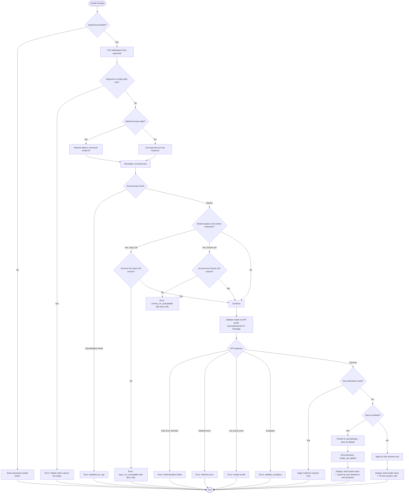

# `/model`

> Analysis basis: CC v2.1.170 bundle.js (AST extraction + Claude interpretation)
> Minimum version: v2.1.170

---

## Overview

The `/model` command allows users to switch the active AI model used by Claude Code within an interactive session. When invoked with a model name argument, it validates the requested model against both a built-in alias table and the account's available models, then applies the change either persistently (as the default for new sessions) or transiently (for the current session only). When invoked without arguments, it presents an interactive picker listing all available models.

---

## Registration

| Field | Value |
|---|---|
| type | `local` |
| name | `model` |
| description | Set the AI model for Claude Code |
| argumentHint | `<model>` |
| supportsNonInteractive | `true` |
| module_id | `EMK` |
| load_inline | `true` |
| loc_byte | `12875914` |
| loc_byte_end | `12876088` |
| loc_line | `9139` |
| arbor_handler.name | `Odf` |
| arbor_handler.fqn | `claude-2.1.170::Odf` |
| arbor_handler.kind | `AsyncFunction` |
| arbor_handler.resolution_path | `module_id` |
| arbor_handler.n_hits | `0` |

Analysis basis: CC v2.1.170 bundle.js:+12875914

---

## Input Branching

The command has four distinct primary branches depending on argument presence and model validity, plus sub-branches for account capability checks and persistence mode. A Mermaid flowchart is used.



---

## Behavioral Spec

### 1. Entry Point — Handler `Odf` (AsyncFunction)

Analysis basis: CC v2.1.170 bundle.js:+12844949

```
async function handleModelCommand(args, appState):
    rawInput = args.trim()                          // +12844949

    if appState.outputFormat == "text":             // +12845016
        // interactive or text-mode path
        pass

    modelList = getAvailableModels(appState)        // +12844988

    if rawInput is empty:
        return showInteractivePicker(modelList)

    // Inline invocation telemetry
    emit("tengu_model_command_inline")              // +12845107

    resolvedModel = resolveModelAlias(rawInput)     // via alias table (Cp8)
    return runModelSwitch(resolvedModel, appState)
```

### 2. Alias Resolution — `resolveModelAlias` (mapped from `Cp8` → `IR` → `fw6`/`B9`)

Analysis basis: CC v2.1.170 bundle.js:+12810051, +2253839

The alias table maps short friendly names to canonical API model IDs. Known aliases found in literals:

| Alias | Canonical Model ID |
|---|---|
| `sonnet` | `claude-sonnet-4-*` (latest) |
| `haiku` | `claude-haiku-4-5` or `claude-3-5-haiku` |
| `opus` | `claude-opus-4-*` (latest) |
| `best` | highest-capability model available |
| `fable` | `claude-fable-5` |
| `opusplan` | Opus in plan mode, else Sonnet (bundle.js:+2253799) |
| `sonnet[1m]` | `claude-sonnet-4-6` with 1M context extension |
| `sonnet-4-6[1m]` | `claude-sonnet-4-6` with 1M context extension |

Model names starting with `claude-` are treated as direct API identifiers (bundle.js:+2246623). Names starting with `anthropic.` are treated as Bedrock/gateway ARN prefixes (bundle.js:+2247002).

```
function resolveModelAlias(input):
    normalized = input.trim().toLowerCase()
    if knownAliases.includes(normalized):
        return aliasMap[normalized]
    if normalized.startsWith("claude-"):
        return normalized            // pass-through direct ID
    if normalized.startsWith("anthropic."):
        return normalized            // Bedrock ARN pass-through
    return normalized                // unrecognized, pass through for API validation
```

### 3. Account Capability Checks — `checkModelAvailability` (mapped from `Rp8`)

Analysis basis: CC v2.1.170 bundle.js:+12807210

```
function checkModelAvailability(modelId, accountInfo):
    // Org-level disable check
    if accountInfo.orgDisabledModels.includes(modelId):
        return { allowed: false, reason: "disabled_by_org" }   // +12807873

    // 1M context checks
    if modelId includes "[1m]" or is Opus-1M variant:
        if not accountInfo.hasOpus1MAccess:
            return {
                allowed: false,
                reason: "opus_1m_unavailable",               // +12807226
                message: "Opus with 1M context is not available for your account. Learn more: https://code.claude.com/docs/en/model-config#extended-context-with-1m"
                                                             // +12807426
            }

    if modelId is Sonnet-4-6-1M variant:
        if not accountInfo.hasSonnet1MAccess:
            return {
                allowed: false,
                reason: "sonnet_1m_unavailable",             // +12807605
                message: "Sonnet 4.6 with 1M context is not available for your account. Learn more: https://code.claude.com/docs/en/model-config#extended-context-with-1m"
                                                             // +12807645
            }

    return { allowed: true }
```

Subscription-tier constants observed in literals:
- `"max"` (bundle.js:+3262866)
- `"team"` (bundle.js:+3262937)
- `"default_claude_max_5x"` (bundle.js:+3262952)
- `"enterprise"` (bundle.js:+3263047)
- `"enterprise_usage_based"` (bundle.js:+3263069)

### 4. Model Validation via API Probe — `validateModelViaProbe` (mapped from `Pu6`)

Analysis basis: CC v2.1.170 bundle.js:+12805205

```
async function validateModelViaProbe(modelId, apiClient):
    trimmedId = modelId.trim()                    // +12805205
    if trimmedId is empty:
        return { valid: false, reason: "Model name cannot be empty" }  // +12805242

    // Normalize
    lowered = trimmedId.toLowerCase()             // +12805390

    // Check cache
    if probeCache.has(lowered):                   // +12805511
        return probeCache.get(lowered)

    // Send a minimal ephemeral validation request
    payload = {
        model: lowered,
        messages: [{ role: "user", content: "Hi" }],   // +12805675
        max_tokens: 1,
        cache_control: "ephemeral"                       // +12805700
    }

    try:
        response = await apiRequest(payload)       // via $p (side_query)
        emit("tengu_model_validation")             // +12805606
        result = { valid: true }
    catch AuthError(401 or 403):                   // +178701, +178710
        result = { valid: false, reason: "Authentication failed. Please check your API credentials." }
                                                   // +12805978
    catch NetworkError:
        result = { valid: false, reason: "Network error. Please check your internet connection." }
                                                   // +12806080
    catch APIError where error.type == "not_found_error":  // +12806199
        result = { valid: false, reason: "invalid_model" }  // +12808419
    catch Exception:
        result = { valid: false, reason: "validate_exception" }  // +12808516

    probeCache.set(lowered, result)                // +12805719
    return result
```

### 5. Applying the Model Change — `applyModelChange` (mapped from `T3A`)

Analysis basis: CC v2.1.170 bundle.js:+12808701

```
async function applyModelChange(resolvedModelId, options, appState):
    // Retrieve display name from model registry
    displayName = getModelDisplayName(resolvedModelId)   // via IR

    if options.saveAsDefault:
        persistModelToUserSettings(resolvedModelId)       // via Wu6 → e_
        emit("model_set_default")                         // +12809260
        confirmationSuffix = " and saved as your default for new sessions"  // +12808902
    else:
        appState.sessionModel = resolvedModelId
        confirmationSuffix = " for this session only"     // +12808948

    // Build status line
    line = bold(displayName) + confirmationSuffix

    // Append fast-mode or usage-credit badge if applicable
    if fastModeActive:
        line += " · Fast mode ON"                         // +12809066
    if drawsFromUsageCredits:
        line += " · Draws from usage credits"             // +12809117

    print(line)
    appState.currentModel = resolvedModelId               // +12809307
```

### 6. Interactive Model Picker — `buildPickerUI` (mapped from `E3A`)

Analysis basis: CC v2.1.170 bundle.js:+12809303

When no argument is supplied the command renders an interactive list. Each entry shows:
- The model's display name (bold, via `w6.bold` at +12809527)
- A dimmed description line (via `w6.dim` at +12809501)
- A "(1M context)" suffix appended when the model supports extended context (bundle.js:+2254423)

Known display name / ID pairs (from literals):

| Display Name | API Model ID |
|---|---|
| Opus Plan | `opusplan` alias |
| Fable 5 | `claude-fable-5` |
| Mythos 5 | `claude-mythos-5` |
| Opus 4.8 | `claude-opus-4-8` |
| Opus 4.7 | `claude-opus-4-7` |
| Opus 4.6 | `claude-opus-4-6` |
| Opus 4.5 | `claude-opus-4-5` |
| Opus 4.1 | `claude-opus-4-1` |
| Opus 4 | `claude-opus-4-0` |
| Sonnet 4.6 | `claude-sonnet-4-6` |
| Sonnet 4.5 | `claude-sonnet-4-5` |
| Sonnet 4 | `claude-sonnet-4-0` |
| Sonnet 3.7 | `claude-3-7-sonnet` |
| Sonnet 3.5 | `claude-3-5-sonnet` |
| Haiku 4.5 | `claude-haiku-4-5` |
| Haiku 3.5 | `claude-3-5-haiku` |

Models disabled at the org level or unavailable to the account are filtered out before display (via `KlH` / `Uc` checks, +2246164, +2246125).

### 7. Settings Persistence — `persistModelToSettings` (mapped from `Wu6` → `e_`)

Analysis basis: CC v2.1.170 bundle.js:+12809220

The handler writes the selected model to the user-level settings file at `.claude/settings.json` (bundle.js:+1269048, +1269058). It distinguishes three settings layers:

- `policySettings` — org-managed, read-only (bundle.js:+1286855)
- `flagSettings` — feature flag overrides (bundle.js:+1286877)
- `userSettings` — writable user preferences (bundle.js:+1287501)
- `projectSettings` — project-scoped overrides (bundle.js:+1287616)
- `localSettings` — local machine overrides (bundle.js:+1287639)

The key written is `"model"` (bundle.js:+12809307). A "Managed settings" banner is shown when org policy prevents the write (bundle.js:+12809469).

### 8. Bootstrap Model Discovery — `bootstrapModelFetch` (mapped from `K_6` → `Or7`)

Analysis basis: CC v2.1.170 bundle.js:+8287752

On startup the CLI fetches the live model list from the Anthropic API to supplement the built-in static list. Skip conditions:

- Gateway model discovery not enabled (`CLAUDE_CODE_ENABLE_GATEWAY_MODEL_DISCOVERY` not set, bundle.js:+8286066)
- Non-essential traffic disabled (bundle.js:+8286221)
- Third-party provider in use (bundle.js:+8286312)

Fetch properties:
- Timeout: 5000 ms (bundle.js:+8286575)
- Headers: `Content-Type: application/json`, `User-Agent`, `anthropic-beta` (bundle.js:+8286459, +8286493, +8286990)
- Telemetry event on fetch: `api_bootstrap_fetch` (bundle.js:+8286696)

Cache is written only when content changes (bundle.js:+8288116); if unchanged the write is skipped (bundle.js:+8288060). Auth loss prevention guard is active during cache writes (bundle.js:+3303113, `tengu_config_auth_loss_prevented`).

---

## State & Side Effects

| Item | Detail |
|---|---|
| Telemetry: `tengu_model_command_inline` | Fired when `/model` is invoked with an inline argument (bundle.js:+12845107) |
| Telemetry: `tengu_feature_ok` | Fired on successful feature probe/validation (bundle.js:+1014205) |
| Telemetry: `tengu_feature_bad` | Fired on failed feature probe/validation (bundle.js:+1014267) |
| Telemetry: `tengu_lone_surrogate_sanitized` | Fired when response text contains lone surrogates (bundle.js:+13661686) |
| Telemetry: `tengu_api_success` | Fired after successful API response during validation probe (bundle.js:+13661937) |
| Telemetry: `tengu_config_auth_loss_prevented` | Fired when a settings write is aborted to avoid losing auth (bundle.js:+3303113) |
| `appState.currentModel` | Updated to the newly selected model ID on success (bundle.js:+12809307) |
| `userSettings` write | Persists `"model"` key to `.claude/settings.json` when saving as default (bundle.js:+1287501, +1269048) |
| Probe cache (`h5K`) | In-memory map keyed by lowercased model ID; prevents redundant API validation probes (bundle.js:+12805511) |
| `model_set_default` event | Emitted internally when the model is saved as user default (bundle.js:+12809260) |
| Sound | None observed in depth-2 traversal |
| Hook registration | None observed in depth-2 traversal |

---

## Version History

| Version | Change |
|---|---|
| v2.1.170 | Initial analysis |

---

## Common Mistakes

1. **Passing an empty string after `/model`** — The command explicitly rejects zero-length arguments after trimming with the error "Model name cannot be empty" (bundle.js:+12805242). Always supply a non-blank model identifier or alias.

2. **Using an alias without checking account tier** — Aliases such as `opusplan`, `best`, or `fable` may resolve to models that are unavailable on lower subscription tiers (`team`, `max`, `enterprise`). The command will return a `disabled_by_org` or `fable_unavailable` error in those cases.

3. **Expecting 1M context models to be available universally** — `sonnet[1m]`, `sonnet-4-6[1m]`, and Opus 1M variants require explicit account entitlement. Attempting to switch to them without access returns a detailed error with a documentation URL (bundle.js:+12807426, +12807645).

4. **Assuming the change persists across sessions by default** — In non-interactive / scripted usage (`--non-interactive`), the model is applied for the session only. Persistence to `settings.json` requires the interactive save-as-default confirmation path.

5. **Providing a custom model ID that bypasses the alias table** — Raw IDs that do not begin with `claude-` or `anthropic.` and are not in the alias table are still accepted and forwarded to the API validation probe; a typo will incur a live API round-trip before failing with `invalid_model`.

---

## Appendix — Identifier Mapping

> For bundle debugging only. Identifiers change across versions.

| Identifier | Role |
|---|---|
| `Odf` | Main handler for `/model` command (AsyncFunction, entry point) |
| `Cp8` | Alias resolution dispatcher — maps short names to canonical model IDs |
| `IR` | Model registry loader — retrieves full model list |
| `fw6` | Model list builder — constructs available-model array |
| `T3` | Model list entry constructor |
| `B9` | Individual model descriptor builder (display name, ID, tags) |
| `yG` | Model selection state manager |
| `NA` | Account/subscription info resolver |
| `C8H` | Subscription type checker (`max` tier) |
| `eDH` | Subscription type checker (`team` / `default_claude_max_5x` tier) |
| `$lH` | Subscription type checker (`enterprise` / `enterprise_usage_based` tier) |
| `AE` | Auth provider type resolver (`mantle`, `firstParty`) |
| `m2` | Model availability combiner — merges static + dynamic lists |
| `Yf` | Provider type classifier (`anthropicAws`, `gateway`) |
| `r_` | Provider backend resolver (`bedrock`, `foundry`, `vertex`) |
| `Y7` | Credential/auth type checker |
| `Sv` | Model capability aggregator |
| `e3` | Model ID hashing utility (SHA-256, 12-char hex prefix) |
| `RZ` | Crypto helper wrapper |
| `ff6` | Node.js `crypto` module reference |
| `R5K` | Top-level model switch orchestrator |
| `Rp8` | Model switch execution pipeline |
| `Uh` | Model list formatter / display helper |
| `A` | Model entry array helper (toLowerCase on IDs, column width 40) |
| `M` | MCP/dynamic model list provider |
| `K` | Display-name column formatter (padEnd) |
| `q` | Data provider / token source |
| `_88` | Object entries iterator helper |
| `KlH` | Org-level model exclusion checker |
| `kT1` | Model index finder (indexOf) |
| `bML` | Model inclusion/exclusion filter |
| `Uc` | Model availability checker (MNH inclusion list) |
| `xML` | Extended model list handler (`claude-` prefix filter) |
| `xH` | Feature flag evaluator |
| `K6` | Feature flag constant resolver |
| `GQf` | 1M-Opus availability checker (lowercased model lookup) |
| `ha` | Account 1M-capability resolver |
| `TQf` | 1M-Sonnet availability checker |
| `rLH` | Sonnet 1M account capability resolver |
| `Iz_` | Model status resolver (disabled / absent / active states) |
| `FL` | Model status enum helper |
| `h_8` | Lowercase model name normalizer |
| `tDH` | Array shape validator |
| `NLH` | Disabled-model list resolver |
| `W1` | Application inference profile checker |
| `ILH` | 1M context suffix appender (`" (1M context)"`) |
| `Pu6` | API probe-based model validator |
| `$p` | Side-query API request dispatcher |
| `PQf` | Probe response parser |
| `S5K` | Model string normalizer for switch output |
| `K_6` | Bootstrap model discovery orchestrator |
| `Or7` | API bootstrap fetch executor |
| `SH` | Settings writer helper |
| `h6` | Global config updater |
| `u5q` | Bootstrap cache reader |
| `N` | Log/debug message formatter |
| `W8` | Global config save helper |
| `Lz` | Bootstrap cache writer |
| `hH` | Error logger with stack emission |
| `EH` | String coercion utility |
| `T3A` | Model change confirmation display builder |
| `cKH` | Current model state accessor |
| `Wu6` | Settings file persistence helper |
| `e_` | Settings file read/write engine |
| `q4` | Settings key builder |
| `_6` | String coercion wrapper |
| `oDH` | Session-only model state setter |
| `eM` | Fast-mode status badge builder |
| `SGH` | Usage-credit badge builder |
| `JD` | Model display line assembler |
| `_w` | kLH-based key lookup helper |
| `E3A` | Interactive picker renderer |
| `JvH` | Picker item event handler |
| `y8` | Picker render helper |
| `Ru` | File path joiner (`.claude/settings.json`) |
| `Ja` | Picker entry builder (display name + description) |
| `d` | Logging/debug output function |
| `Rp8` | (see above — model switch execution pipeline) |

---

*Note: index built via Arbor fallback; some signals (telemetry, literals) may be missing — see arbor-fallback.js.*