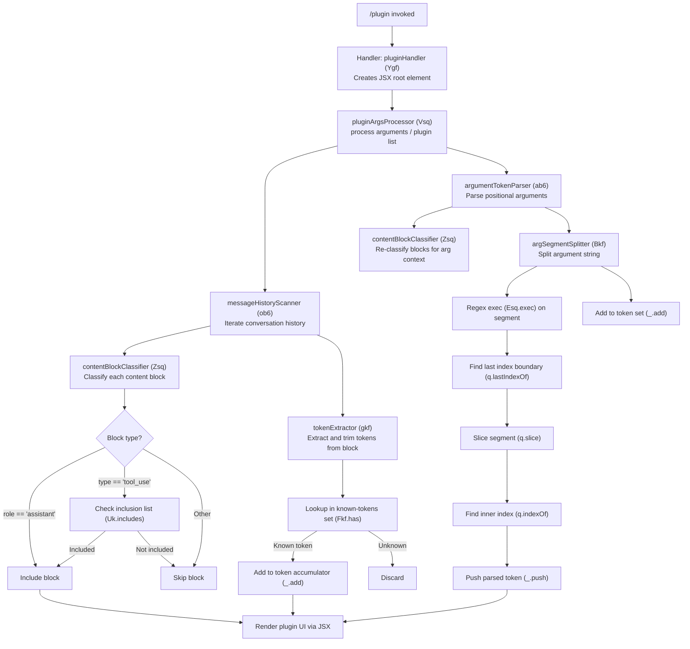

# `/plugin`

> Analysis basis: CC v2.1.170 bundle.js (AST extraction + Claude interpretation)
> Minimum version: v2.1.170

---

## Overview

The `/plugin` command (also accessible as `/plugins` and `/marketplace`) provides an interactive JSX-rendered interface for managing Claude Code plugins. It renders a React-compatible component tree directly in the CLI, allowing users to browse, install, and manage plugins. The command is handled by an async function that constructs UI elements and delegates to supporting utilities for message-history traversal and argument parsing.

---

## Registration

| Field | Value |
|---|---|
| type | `local-jsx` |
| name | `plugin` |
| description | `Manage Claude Code plugins` |
| aliases | `["plugins", "marketplace"]` |
| immediate | `true` |
| load_inline | `true` |
| module_id | `zfK` |
| loc_byte | `12749765` |
| loc_byte_end | `12750055` |
| arbor_handler.name | `Ygf` |
| arbor_handler.fqn | `claude-2.1.170::Ygf` |
| arbor_handler.kind | `AsyncFunction` |
| arbor_handler.resolution_path | `module_id` |
| arbor_handler.n_hits | `0` |

Analysis basis: CC v2.1.170 bundle.js:+12749765

---

## Input Branching

The call graph reveals three distinct processing paths: (1) an initial message-history scan path, (2) a content-block classification and filtering path, and (3) an argument/token parsing path. This warrants a Mermaid flowchart.



---

## Behavioral Spec

### Top-Level Handler

The async handler `pluginHandler` (bundle name: `Ygf`) is the entry point resolved by Arbor via `module_id` path (module `zfK`).

```
async function pluginHandler(context):
    rootElement = createElement(PluginUIComponent, context)
    processedArgs = pluginArgsProcessor(context.args, context.history)
    return renderJSX(rootElement, processedArgs)
```

Analysis basis: CC v2.1.170 bundle.js:+12746951, +12747016

---

### Message History Scanner

`messageHistoryScanner` (bundle name: `ob6`) iterates over the active conversation history and passes each entry through a content-block classifier before accumulating qualifying blocks.

```
function messageHistoryScanner(history, options):
    results = new Set()
    for each entry in history:
        if contentBlockClassifier(entry) is valid:
            token = tokenExtractor(entry)
            results.add(token)
    return results
```

Analysis basis: CC v2.1.170 bundle.js:+11886981, +11886332, +11886344

---

### Content Block Classifier

`contentBlockClassifier` (bundle name: `Zsq`) determines whether a given message block should be included in plugin processing. It applies two checks:

1. Whether the block's role equals the string `"assistant"` (bundle.js:+11886042)
2. Whether the block's type equals `"tool_use"` and appears in an inclusion list via `Uk.includes` (bundle.js:+11886132, +11886144)

Array membership is verified with `Array.isArray` before the inclusion check.

```
function contentBlockClassifier(block, inclusionList):
    if block.role == "assistant":
        return INCLUDE
    if Array.isArray(block) and inclusionList.includes(block.type):
        // block.type == "tool_use" is the checked value
        return INCLUDE
    return EXCLUDE
```

Analysis basis: CC v2.1.170 bundle.js:+11886055, +11886132, +11886144

---

### Token Extractor

`tokenExtractor` (bundle name: `gkf`) trims whitespace from a raw string field on the block (bundle.js:+11886714) and then checks whether the trimmed value exists in a known-tokens set (`Fkf.has`). Only known tokens are forwarded to the accumulator.

```
function tokenExtractor(block, knownTokensSet):
    raw = block.someTextField.trim()
    if knownTokensSet.has(raw):
        return raw
    return null
```

Analysis basis: CC v2.1.170 bundle.js:+11886714, +11886792

---

### Argument Token Parser

`argumentTokenParser` (bundle name: `ab6`) runs a second pass over history blocks (re-using `contentBlockClassifier`) and then delegates to `argSegmentSplitter` to tokenize the argument string.

```
function argumentTokenParser(history, options):
    tokens = []
    for each block in history:
        if contentBlockClassifier(block) is valid:
            segments = argSegmentSplitter(block.commandField)
            tokens.push(...segments)
            tokenSet.add(segments)
    return tokens
```

The string literal `"command"` (bundle.js:+11886214) indicates the field accessed on each block for argument extraction.

Analysis basis: CC v2.1.170 bundle.js:+11886998, +11886634, +11886654, +11886661

---

### Argument Segment Splitter

`argSegmentSplitter` (bundle name: `Bkf`) performs low-level string parsing to split a raw command argument into discrete tokens. The parsing sequence:

1. Apply a compiled regex (`Esq.exec`) starting from offset `0` (bundle.js:+11886418, +11886429)
2. Find the last structural boundary with `lastIndexOf` (bundle.js:+11886477)
3. Slice the segment (bundle.js:+11886508)
4. Locate an inner delimiter with `indexOf` (bundle.js:+11886527)
5. Push the parsed token into the result array (bundle.js:+11886572)

The function `q` (bundle name), which supports string operations, internally calls `Y1` (bundle.js:+16436075) and references a buffer size constant of **1024** (bundle.js:+16436118) and a data field string `"data"` (bundle.js:+16436065).

```
function argSegmentSplitter(rawArg):
    results = []
    pos = 0
    while match = SEGMENT_REGEX.exec(rawArg) from pos:
        boundary = rawArg.lastIndexOf(DELIMITER, match.index)
        segment  = rawArg.slice(boundary, match.index)
        inner    = segment.indexOf(INNER_DELIM)
        results.push(segment.slice(0, inner))
    return results
```

Buffer ceiling for the underlying string helper: **1024** (bundle.js:+16436118).

Analysis basis: CC v2.1.170 bundle.js:+11886429, +11886477, +11886508, +11886527, +11886572

---

### Random Delay Utility

The general-purpose helper `H` (reached transitively from `gkf`) uses `Math.random` (bundle.js:+13939352) and `setTimeout` (bundle.js:+13939389) with numeric literals `2` (bundle.js:+13939350) and `1` (bundle.js:+13939366). This indicates a jitter-based retry or debounce mechanism used internally when polling or retrying an asynchronous operation within the plugin system.

```
function randomDelayHelper(callback):
    jitter = Math.random() * 2   // factor of 2
    delay  = baseDelay * (1 + jitter)
    setTimeout(callback, delay)
```

Analysis basis: CC v2.1.170 bundle.js:+13939350, +13939352, +13939366, +13939389

---

## State & Side Effects

| Item | Detail |
|---|---|
| Telemetry | None detected in depth-2 traversal |
| Hook registration | None detected |
| appState changes | Plugin list / token accumulator modified via `Set.add` and `Array.push` during history scan |
| JSX rendering | Produces a local-jsx component tree rendered inline in the CLI (`eMA.createElement` at bundle.js:+12746951) |
| Sound | None detected |
| Async behavior | Handler is `async`; random-delay helper (`H`) uses `setTimeout` for internal jitter |
| Buffer limit | Internal string helper caps at **1024** bytes (bundle.js:+16436118) |

---

## Version History

| Version | Change |
|---|---|
| v2.1.170 | Initial analysis |

---

## Common Mistakes

1. **Using `/plugin` expecting a text response**: Because `type` is `local-jsx` and `immediate` is `true`, the command renders a JSX UI panel immediately rather than sending a prompt to the agent. It will not produce a conversational reply.
2. **Assuming aliases behave differently**: `/plugins` and `/marketplace` are registered aliases for the same handler (`Ygf`); they are fully equivalent to `/plugin`.
3. **Expecting telemetry events**: No `tengu_*` telemetry events were found in the depth-2 traversal. Downstream tooling that relies on telemetry for `/plugin` usage tracking will receive no events.
4. **Passing very long argument strings**: The internal string-processing helper has an internal buffer ceiling of **1024** (bundle.js:+16436118); arguments whose encoded representation exceeds this limit may be silently truncated.
5. **Expecting synchronous execution**: The handler is an `AsyncFunction` (`arbor_handler.kind`). Callers must await its resolution; the random-delay jitter in helper `H` may introduce variable latency.

---

## Appendix — Identifier Mapping

> For bundle debugging only. Identifiers change across versions.

| Identifier | Role |
|---|---|
| `Ygf` | Top-level plugin command handler (AsyncFunction; Arbor-resolved via module_id `zfK`) |
| `Vsq` | Plugin arguments processor — orchestrates history scan and argument parsing |
| `ob6` | Message history scanner — iterates conversation entries and collects qualifying blocks |
| `Zsq` | Content block classifier — decides inclusion based on role (`"assistant"`) and type (`"tool_use"`) |
| `gkf` | Token extractor — trims block text and validates against known-token set |
| `H` | Random delay / jitter utility — uses `Math.random` + `setTimeout` |
| `_` | Token accumulator (Set) — receives `add` calls for valid tokens |
| `ab6` | Argument token parser — second-pass history scan producing positional arg tokens |
| `Bkf` | Argument segment splitter — regex + string-index based tokenizer |
| `q` | Low-level string helper — supports `lastIndexOf`, `slice`, `indexOf`; internally calls `Y1`; buffer limit 1024 |

---

Note: index built via Arbor fallback; some signals (telemetry, literals) may be missing — see arbor-fallback.js.