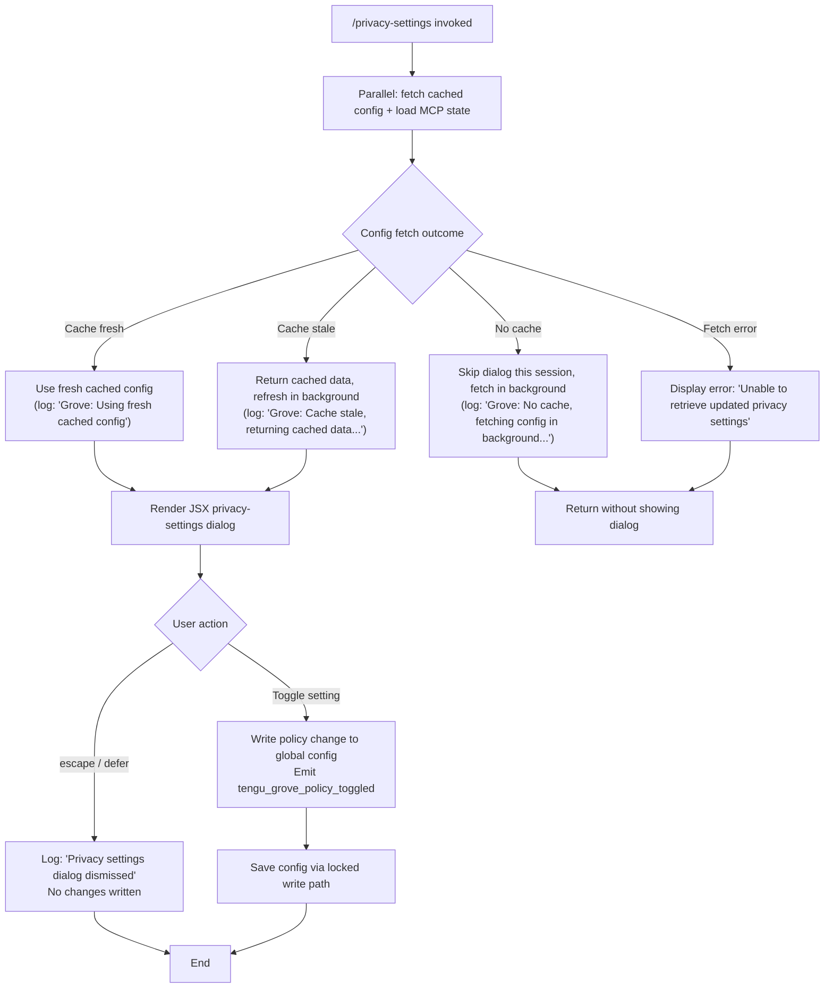

# `/privacy-settings`

> Analysis basis: CC v2.1.170 bundle.js (AST extraction + Claude interpretation)
> Minimum version: v2.1.170

---

## Overview

`/privacy-settings` is a local-jsx command that opens an interactive dialog allowing the user to view and modify their current privacy settings (referred to internally as "Grove" policy). The command resolves current settings by reading from a cached config layer, then presents a JSX-rendered UI that reflects any toggleable privacy policies and writes the result back to the global configuration store.

---

## Registration

| Field | Value |
|---|---|
| type | `local-jsx` |
| name | `privacy-settings` |
| description | `View and update your privacy settings` |
| module_id | `Q4K` |
| load_inline | `true` |
| loc_byte | `12618222` |
| loc_byte_end | `12618414` |
| loc_line | `8903` |
| arbor_handler.name | `UBf` |
| arbor_handler.fqn | `claude-2.1.170::UBf` |
| arbor_handler.kind | `AsyncFunction` |
| arbor_handler.resolution_path | `module_id` |
| arbor_handler.n_hits | `0` |

Analysis basis: CC v2.1.170 bundle.js:+12618222

---

## Input Branching

The handler has four distinct branches based on the outcome of config fetching and user interaction, so a flowchart is used.



---

## Behavioral Spec

### Handler Entry Point — `privacySettingsHandler` (bundle ident: `UBf`)

The main handler is an `AsyncFunction` resolved via the `module_id` path. It is the top-level orchestrator for the command.

```
async function privacySettingsHandler(context):
    // Parallel initialization
    [configData, mcpState] = await Promise.all([
        fetchCurrentConfig(),       // resolves via groveConfigLoader (O66)
        loadMcpManagerState()       // resolves via mcpStateLoader (b2H / dt)
    ])

    if configData is null or fetch failed:
        display error message "Unable to retrieve updated privacy settings"
        return

    // Build JSX element for the privacy dialog
    dialogElement = createElement(privacySettingsComponent, {
        config: configData,
        onDismiss: handleDismiss,
        onToggle: handleToggle
    })

    render(dialogElement)
```

Analysis basis: CC v2.1.170 bundle.js:+12617222

---

### Config Loading with Grove Cache — `groveConfigLoader` (bundle ident: `O66`)

This function implements a stale-while-revalidate caching strategy for the global configuration, referred to internally as the "Grove" pattern.

```
function groveConfigLoader(cacheKey):
    cachedEntry = readConfigCache(cacheKey)       // configFileReader (h6)
    now = Date.now()

    if cachedEntry is null:
        log "Grove: No cache, fetching config in background (dialog skipped this session)"
        triggerBackgroundRefresh()
        return null                               // causes handler to skip dialog

    if (now - cachedEntry.timestamp) > STALE_THRESHOLD:
        log "Grove: Cache stale, returning cached data and refreshing in background"
        triggerBackgroundRefresh()
        return cachedEntry.data                   // returns stale data optimistically

    log "Grove: Using fresh cached config"
    return cachedEntry.data
```

Analysis basis: CC v2.1.170 bundle.js:+7345694 (configFileReader `b7H`), +7345715 (configWatcher `gL`), +7345783 (`Date.now` timestamp check), +7345809 (no-cache log literal), +7345929 (stale log literal), +7346035 (fresh log literal)

---

### Config File Read and Backup — `configFileReader` (bundle ident: `B7H`)

Reads the configuration from disk with error handling and maintains rolling backups.

```
function configFileReader(configPath):
    if access is not yet allowed:
        throw Error("Config accessed before allowed.")    // literal at +3307966

    try:
        raw = fs.readFileSync(configPath, "utf-8")        // encoding literal at +3308049
    catch err:
        if err.code == "ENOENT":                          // literal at +3308196
            return defaultConfig()
        emit telemetry: tengu_config_parse_error          // +3308597
        return null

    parsed = JSON.parse(raw)

    // Rolling backup management (max 5 backups, prefix ".backup.")
    backupDir = path.join(dirname, backups)
    fs.mkdirSync(backupDir, {recursive: true})
    existingBackups = fs.readdirStringSync(backupDir)
        .filter(name => name.startsWith(".backup."))      // literal at +3306819
    if existingBackups.length >= 5:                       // limit literal at +3306952
        remove oldest backup
    fs.copyFileSync(configPath, newBackupPath)

    return parsed
```

Analysis basis: CC v2.1.170 bundle.js:+3307960 (Error), +3308022 (readFileSync), +3308196 (ENOENT), +3308557 (statSync), +3308776 (mkdirSync), +3308834 (readdirStringSync), +3308869 (startsWith), +3309105 (copyFileSync)

---

### Config Save with Lock — `saveConfigWithLock` (bundle ident: `k78`)

Persists privacy setting changes back to disk with advisory file locking and auth-loss protection.

```
async function saveConfigWithLock(configPath, newConfig):
    lockPath = path.dirname(configPath)
    fs.mkdirSync(lockPath, {recursive: true})

    lockStart = Date.now()
    acquired = await acquireLock(lockPath)

    if (Date.now() - lockStart) > LOCK_WARN_THRESHOLD:
        log "Lock acquisition took longer than expected - another Claude instance may be running"
        emit telemetry: tengu_config_lock_contention       // +3306022

    // Re-read from disk before writing (TOCTOU safety)
    onDiskConfig = readConfigFromDisk(configPath)

    // Auth-loss guard (GH #3117)
    if cachedConfig has auth AND onDiskConfig is missing auth:
        log "saveConfigWithLock: re-read config is missing auth that cache has; refusing to write..."
        emit telemetry: tengu_config_auth_loss_prevented   // +3306501
        releaseLock()
        return

    // Write new config
    merged = Object.assign({}, onDiskConfig, newConfig)
    writeConfigToDisk(configPath, merged)

    // Backup rotation: keep max 5 backups, 60-second minimum gap
    manageBackupRotation(configPath, maxBackups=5, minGapMs=60000)   // +3306703, +3306952

    releaseLock()
```

Analysis basis: CC v2.1.170 bundle.js:+3305722 (path ops), +3305807 (lock timing), +3305933 (lock contention literal), +3306022 (telemetry), +3306349 (auth-loss literal), +3306501 (telemetry), +3306703 (60000ms backup gap), +3306952 (5 backup limit)

---

### Privacy Policy Toggle — `groveToggleHandler` (ident via `tengu_grove_policy_toggled`)

Invoked when the user toggles a setting in the dialog.

```
function groveToggleHandler(settingKey, newValue, appState):
    updatedSettings = { ...currentSettings, [settingKey]: newValue }

    emit telemetry: tengu_grove_policy_toggled             // +12617758

    saveGlobalConfig(updatedSettings)                     // routes through saveConfigWithLock

    // Telemetry event carries policy identity; no PII is sent.
```

Analysis basis: CC v2.1.170 bundle.js:+12617756 (config write call `d`), +12617758 (telemetry event), +12617819 (`f6` settings literal path)

---

### Dialog Dismiss Handling

When the user presses `escape` or the dialog action resolves as `defer`, no config write occurs.

```
function handleDismiss(reason):
    // reason is one of: "escape" | "defer"
    // literals at +12617385 ("escape"), +12617399 ("defer")
    log "Privacy settings dialog dismissed"               // literal at +12617410
    return                                                // no write, no telemetry
```

Analysis basis: CC v2.1.170 bundle.js:+12617385, +12617399, +12617410

---

### Config Watcher — `configWatcher` (bundle ident: `gL` → `BSL`)

A file-watch subscription is set up alongside the fetch to detect external config changes and invalidate the Grove cache.

```
function configWatcher(configPath, onChangeCallback):
    // Uses fs.watchFile polling
    watcher = V78.watchFile(configPath, handler)          // +3304217
    
    on change:
        if newMtime != oldMtime:
            invalidateCache()
            onChangeCallback()

    return cleanup: () => V78.unwatchFile(configPath)     // +3304550
```

Analysis basis: CC v2.1.170 bundle.js:+3262391 (watcher init `gL`), +3304217 (watchFile), +3304550 (unwatchFile)

---

### MCP State Pre-loading — `mcpManagerInit` (ident: `M` → `aSH` → `IPA`)

Concurrently with config loading, the handler pre-loads MCP server state so that the privacy dialog can reflect MCP-aware settings (e.g. policy scopes that affect MCP tool access).

```
async function mcpManagerInit(appState):
    // Collects all known MCP server slots
    serverEntries = Object.entries(mcpConfig)

    for each [serverName, serverSlot] of serverEntries:
        connectionResult = await connectOrReuse(serverSlot)
        applyConnectionResult(serverName, connectionResult, appState)

    // Prune orphaned connections
    applyMcpUpdate(appState)
```

Analysis basis: CC v2.1.170 bundle.js:+16199029 (`aSH` entry), +16199317 (`applyMcpUpdate`), +16199867 (`Object.entries`), +16200261 (`aSH` recursive call)

---

## State & Side Effects

| Item | Detail |
|---|---|
| Telemetry: `tengu_grove_policy_toggled` | Fired on every privacy-setting toggle; carries policy key (bundle.js:+12617758) |
| Telemetry: `tengu_config_lock_contention` | Fired when lock acquisition exceeds expected duration (bundle.js:+3306022) |
| Telemetry: `tengu_config_stale_write` | Fired when a stale write is detected (bundle.js:+3306158) |
| Telemetry: `tengu_config_auth_loss_prevented` | Fired when write is aborted to prevent auth token loss (bundle.js:+3306501) |
| Telemetry: `tengu_config_parse_error` | Fired when config JSON fails to parse (bundle.js:+3308597) |
| Telemetry: `tengu_mcp_oauth_flow_start/success/error` | MCP OAuth lifecycle events triggered during concurrent MCP pre-load (bundle.js:+6481584, +6486365, +6487750) |
| Telemetry: `tengu_daemon_config_reload` | Fired when daemon detects config reload (bundle.js:+16545205) |
| Telemetry: `tengu_mcp_skills` | Fired on MCP skill enumeration during pre-load (bundle.js:+6587132) |
| Config write | Writes to `~/.claude.json` (global config) via locked write path when a setting is toggled |
| Config backup | Maintains up to 5 rolling backups with a 60-second minimum gap (bundle.js:+3306703, +3306952) |
| File watch | `fs.watchFile` subscription on config path; cleaned up on dialog close (bundle.js:+3304217, +3304550) |
| JSX render | Mounts a JSX component via `zu6.createElement` (bundle.js:+12617869); no persistent React tree after dialog close |
| appState changes | `groveToggleHandler` propagates new policy values into app state before persisting |
| Sound | None observed in depth-2 traversal |
| Hook registration | `N9` → `LTA.register` (bundle.js:+62328) — internal hook registered during config write pipeline |

---

## Version History

| Version | Change |
|---|---|
| v2.1.170 | Initial analysis |

---

## Common Mistakes

1. **Expecting immediate dialog on first run**: If no Grove cache exists, the command silently skips the dialog and fetches in the background. The user must invoke `/privacy-settings` again after the initial cache is populated.
2. **Assuming settings persist without dismissing**: The dialog only writes changes when the user explicitly toggles a setting. Pressing `escape` or closing via `defer` leaves all settings unchanged.
3. **Running multiple Claude instances simultaneously**: Concurrent instances contend for the config file lock. The second instance will emit `tengu_config_lock_contention` and may experience a delay. The literal `"Lock acquisition took longer than expected - another Claude instance may be running"` (bundle.js:+3305933) is a warning, not a hard error.
4. **Manually editing `~/.claude.json` during a session**: The config watcher will detect the mtime change and invalidate the cache, but a mid-flight dialog may show stale values until re-opened.
5. **Expecting MCP servers to be unaffected**: Privacy settings can influence MCP tool-access scopes. The handler pre-loads MCP state concurrently; changes to privacy policy may alter which MCP tools are accessible in the same session.

---

## Appendix — Identifier Mapping

> For bundle debugging only. Identifiers change across versions.

| Identifier | Role |
|---|---|
| `UBf` | Main handler (`privacySettingsHandler`) — AsyncFunction entry point for `/privacy-settings` |
| `O66` | Grove config loader — stale-while-revalidate cache orchestrator |
| `b7H` | Config file reader — reads + parses config JSON from disk |
| `wq` | Config value accessor — reads individual config fields |
| `O$_` | Config field getter (sub-accessor A) |
| `$$_` | Config field getter (sub-accessor B) |
| `IY` | Config section resolver — handles API key and helper fields |
| `NA` | Config array/includes validator |
| `RC` | Array membership checker (wraps `Array.isArray` + `H.includes`) |
| `bH9` | Config sub-section helper |
| `gL` | Config watcher initializer |
| `h6` | Config file read + watch setup |
| `n6` | Path/filesystem utility (normalize path) |
| `hT_` | Config timestamp helper |
| `B7H` | Config file read with backup rotation |
| `BSL` | File watch subscription manager |
| `N` | Telemetry dispatch / logging utility |
| `PeK` | Debug log helper |
| `MTA` | Log transport initializer |
| `H` | Shared runtime utility (random, setTimeout) |
| `CH` | JSON stringify wrapper |
| `_` | General utility (string/array ops) |
| `u4` | Path segment extractor |
| `FZA` | Path map utility |
| `q` | Async data accessor / Map-like store |
| `A` | String normalization (toLowerCase) |
| `zFH` | Output writer dispatcher |
| `yZA` | Stream write wrapper |
| `EeK` | Async file writer with rotation |
| `mBH` | Batched write scheduler |
| `L4H` | File path join + write helper |
| `$M6` | Filesystem V8 helper |
| `cZA` | Path join utility |
| `La8` | Async file rename/unlink helper |
| `TeK` | Async append-file with mkdir |
| `N9` | Hook registration wrapper |
| `qs9` | Grove background refresh scheduler |
| `W8` | Global config save orchestrator |
| `k78` | Save config with lock (primary locked write path) |
| `ZJH` | Lock state tracker |
| `K69` | Object entries iterator for config slots |
| `QP6` | Timestamp comparison utility |
| `liH` | Lock acquisition helper |
| `d` | Config persistence write (low-level) |
| `I78` | Config re-read + merge validator |
| `M` | MCP manager top-level orchestrator |
| `aSH` | MCP server pool manager |
| `pn` | MCP server slot connector |
| `nE6` | MCP native connector |
| `kt` | MCP connection coordinator |
| `Ag` | MCP SDK server collector |
| `zJ8` | MCP warning/color formatter |
| `cE6` | SSE/HTTP MCP connection handler |
| `vV` | MCP config file watcher |
| `kY` | Config file watcher with Aq callback |
| `Tm_` | MCP watcher teardown |
| `K` | Padded output formatter |
| `L` | Promise-tracking Set wrapper |
| `f` | Stream/connection object |
| `F8` | Utility dispatcher |
| `BZ6` | MCP server filter |
| `Cg9` | MCP capabilities resolver |
| `zU_` | MCP needs-auth cache reader |
| `yPH` | MCP tool hash/fingerprint generator |
| `aD8` | MCP server capability extractor |
| `sD8` | MCP capability hash builder |
| `QP` | SHA-256 hash utility |
| `rD8` | MCP metadata reader |
| `y4` | Config key reader (EE1 wrapper) |
| `M8` | MCP debug log pusher |
| `bJ8` | MCP client connection session |
| `fX7` | MCP protocol framer |
| `Dc` | MCP transport dispatcher |
| `sAH` | MCP auth state helper |
| `tAH` | MCP tool result handler |
| `$1H` | MCP OAuth + HTTP callback server manager |
| `feH` | MCP pending-connection tracker |
| `D` | Process exit / abort controller |
| `uJ8` | MCP needs-auth cache writer |
| `Fn` | MCP reconnect orchestrator |
| `hu` | Transport close helper |
| `Y` | Supervisor write / session manager |
| `U7` | MCP error log pusher |
| `EH` | String coercion utility |
| `MX7` | MCP race condition resolver |
| `LX7` | MCP SSH/URL transport selector |
| `xJ8` | MCP OAuth complete-authentication tool handler |
| `LeH` | Active MCP connection getter |
| `MeH` | Pending MCP connection getter |
| `Fg9` | MCP connection apply + cache-check |
| `m9` | AsyncLocalStorage store getter |
| `Rj8` | MCP cache file path builder |
| `Rm_` | MCP reconnect error handler |
| `J` | Process signal / SIGTERM handler |
| `S` | Background session supervisor |
| `VN` | MCP skills telemetry emitter |
| `Y6` | MCP skills collector |
| `Gm_` | MCP discovery filter (includes check) |
| `y` | Warning message aggregator |
| `mg9` | Async iterator / stream mapper |
| `SF` | Stream mapper core (TypeError guard) |
| `CeH` | Integer parser (radix 10) |
| `Cj8` | Integer parser (radix 20) |
| `Ic8` | MCP connection result applicator |
| `oSH` | MCP hash applicator |
| `pE` | MCP cleanup + VN caller |
| `SeH` | MCP hash + cleanup dispatcher |
| `$` | Daemon status broadcaster |
| `f$K` | Daemon status file writer |
| `Xa` | Low-level status helper |
| `hu6` | Daemon status path builder |
| `IPA` | MCP manager init + retry loop |
| `WJ8` | MCP server allow-list checker |
| `o8` | Async timeout / retry wrapper |
| `O` | Background session state holder |
| `f6` | Settings path resolver |
| `ff6` | Settings path base constant |