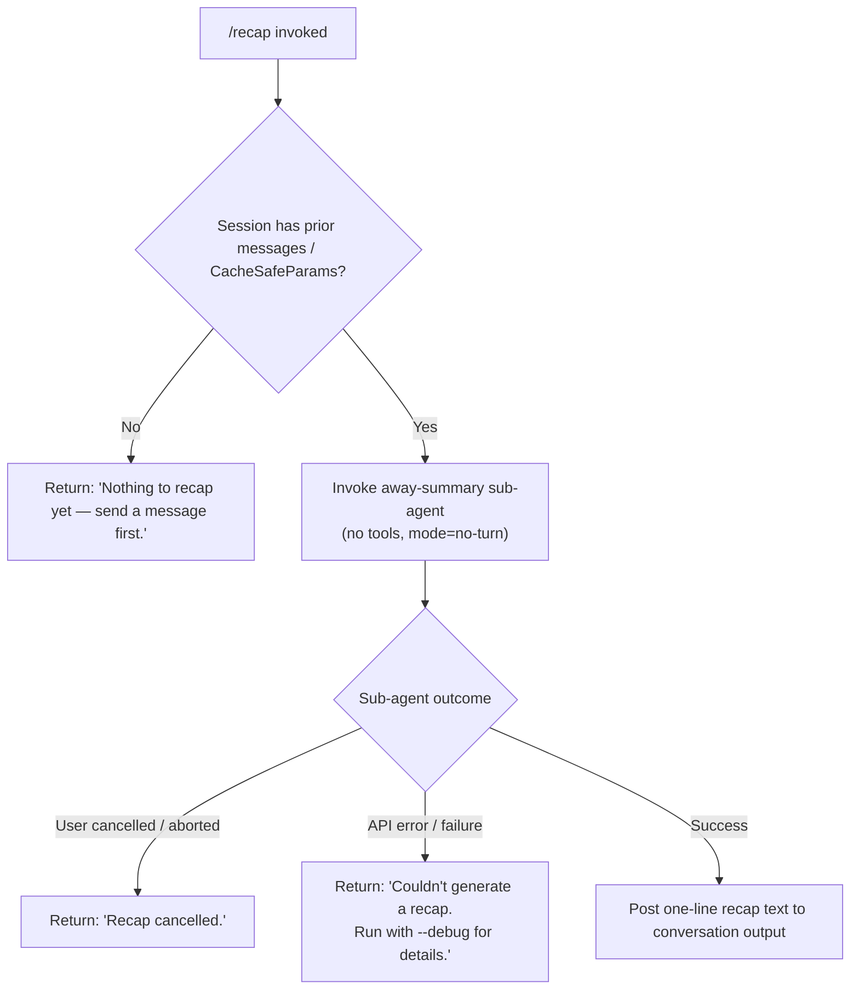

# `/recap`

> Analysis basis: CC v2.1.170 bundle.js (AST extraction + Claude interpretation)
> Minimum version: v2.1.170

---

## Overview

`/recap` triggers an immediate on-demand generation of a single-line summary of the current Claude Code session. It runs as an "away summary" sub-agent call that operates without tool access, producing a concise recap of what has happened in the session so far and posting it as a text message.

---

## Registration

| Field | Value |
|---|---|
| type | `local` |
| name | `recap` |
| description | `Generate a one-line session recap now` |
| loc_byte | `13155895` |
| loc_byte_end | `13156111` |
| loc_line | `9674` |
| supportsNonInteractive | `false` |
| thinClientDispatch | `post-text` |
| load_inline | `true` |
| load_ident | `$rf` |
| arbor_handler.name | `$rf` |
| arbor_handler.fqn | `claude-2.1.170::$rf` |
| arbor_handler.kind | `AsyncFunction` |
| arbor_handler.resolution_path | `load_ident` |
| arbor_handler.n_hits | `0` |

Analysis basis: CC v2.1.170 bundle.js:+13155895

The handler was resolved via the `load_ident` path: the registration embeds a `load: () => Promise.resolve({ call: $rf })` shape (no separate `module_id`). The Arbor symbol graph confirms `$rf` as the unambiguous async handler entry point.

---

## Input Branching

The command has four distinct outcome branches based on session state and the result of the away-summary call.



Analysis basis: CC v2.1.170 bundle.js:+13155645, +13155737, +13155795, +6910407, +6910465

---

## Behavioral Spec

### Handler Entry — `recapCommandHandler` (`$rf`)

The handler is an `AsyncFunction` registered inline via `load_ident`.

```
async function recapCommandHandler(commandContext):
    result = await awaySummaryRunner(commandContext)
    return result
```

Analysis basis: CC v2.1.170 bundle.js:+13155503

### Away-Summary Dispatcher — `awaySummaryRunner` (`xX8`)

This is the primary orchestration function called by the handler. It coordinates session-state checks, sub-agent invocation, abort-signal wiring, and result routing.

```
async function awaySummaryRunner(context):
    # 1. Guard: check that CacheSafeParams are available for the session
    params = getCacheSafeParams(context)         # Z1H
    if params is null or missing:
        log("[awaySummary] no CacheSafeParams saved, skipping")
        return earlyExit(context, mode="no-turn") # literal: "no-turn"

    # 2. Set up abort signal wiring
    abortController = new AbortController()
    context.signal.addEventListener("abort", () => abortController.abort("abort"))

    # 3. Launch the sub-agent query (away_summary mode, no tools)
    queryResult = await subAgentQuery(
        context    = context,
        params     = params,
        abortSignal = abortController.signal,
        mode       = "away_summary"
    )                                            # iG

    # 4. Inspect result shape
    outcome = interpretQueryResult(queryResult, context)  # x8, q.find, wl9

    return outcome
```

Analysis basis: CC v2.1.170 bundle.js:+6910386, +6910405, +6910502, +6910533, +6910580, +6910600, +6910942

### Session-State Guard — `getCacheSafeParams` (`Z1H`)

Retrieves the cached session parameters needed to construct the away-summary prompt. If no parameters have been stored (i.e., the user has not yet sent any message), the guard returns a falsy value and the handler short-circuits with the "Nothing to recap yet" message.

Analysis basis: CC v2.1.170 bundle.js:+6910386

### Sub-Agent Query — `subAgentQueryForRecap` (`iG`)

Constructs and executes a model call configured specifically for the away-summary use case.

```
async function subAgentQueryForRecap(context, params, abortSignal):
    # Record start timestamp
    startTime = Date.now()

    # Build the query turn configuration
    turnConfig = buildSubAgentTurnConfig(params)   # ky8
        # - Reads appState via getAppState
        # - Applies "avoid_prompts" guard                  (+10609779)
        # - Assigns a random UUID to the sub-agent message  # pmq.randomUUID
        # - Sanitizes message content                       # mS

    # Run the main agent loop with tool access denied
    response = await runAgentLoop(
        turnConfig   = turnConfig,
        context      = context,
        abortSignal  = abortSignal,
        toolPolicy   = "deny",               # literal: "deny"   (+6910698)
        mode         = "away_summary"        # literal (+6910781)
    )                                        # wjf (deep query loop)

    # Handle tool-use attempt (should not occur; tool calls are blocked)
    if response.requestedTool:
        emit("Away summary cannot use tools")   # literal (+6910713)

    return response
```

Analysis basis: CC v2.1.170 bundle.js:+10612399, +10612522, +10609779, +10611794, +10612778, +6910698, +6910713, +6910781

### Outcome Routing — `interpretRecapResult` (`x8`, `wl9`)

After the sub-agent returns, the result is matched against known outcome states:

```
function interpretRecapResult(queryResult, context):
    match queryResult.status:
        case "aborted":
            return textMessage("Recap cancelled.")          # (+13155737)
        case "api-error":
            return textMessage(
                "Couldn't generate a recap. Run with --debug for details."
            )                                              # (+13155795)
        case "ok":
            # Extract the final assistant text from the result
            recapText = queryResult.messages
                            .flatMap(extractTextBlocks)    # wl9 → H.flatMap (+6911241)
                            .find(isAssistantText)         # q.find (+6910942)
            return textMessage(recapText)
        default:
            return textMessage(
                "Couldn't generate a recap. Run with --debug for details."
            )
```

Analysis basis: CC v2.1.170 bundle.js:+6910925, +6911014, +6911075, +6910942, +6911031, +6911241, +13155737, +13155795

### Agent Loop — `mainQueryLoop` (`wjf`)

The deep query loop used for the recap sub-agent call shares implementation with the main conversation loop. Key behaviors relevant to the recap use case:

```
function mainQueryLoop(config):
    # Tool policy is "deny" — any tool-use block is rejected immediately
    # Mode is "away_summary" — distinct from "repl_main_thread" (+10559202)
    #   and "subagent" (+10559293)

    # Telemetry markers emitted during execution:
    emit("query_fn_entry")        # (+10559592)
    emit("query_started")         # (+10559624)
    emit("query_setup_start")     # (+10562462)
    emit("query_setup_end")       # (+10562652)
    emit("query_api_loop_start")  # (+10563558)
    emit("query_api_streaming_start") # (+10564299)
    # ... streaming, tool execution, and completion phases follow
    emit("query_api_streaming_end")   # (+10575508)
    emit("command_lifecycle")         # (+10590077)

    return result
```

Analysis basis: CC v2.1.170 bundle.js:+10559202, +10559293, +10559565, +10559592, +10559624, +10562462, +10562652, +10563558, +10564299, +10575508, +10590077

### Transcript Writer — `transcriptFileWriter` (`EeK`, `TeK`)

The recap sub-agent, like all agent turns, may write conversation transcript data to disk. The writer:

1. Resolves the working directory via path join utilities (`E6H.join`, `cZA`). Analysis basis: CC v2.1.170 bundle.js:+208486
2. Checks and rotates existing transcript files (`La8` → `Mh.stat`, `Mh.rename`, `Mh.unlink`). Analysis basis: CC v2.1.170 bundle.js:+207778, +207934, +207974
3. Appends encoded content to the transcript using `Mh.appendFile`. Analysis basis: CC v2.1.170 bundle.js:+208266
4. Tracks byte length via `Buffer.byteLength`. Analysis basis: CC v2.1.170 bundle.js:+208661
5. Registers a cleanup handler via `N9` → `LTA.register`. Analysis basis: CC v2.1.170 bundle.js:+208816, +62328

File rotation uses `.txt` suffix detection (literal: `".txt"`, +207882) and a slice offset of `4` (+207904).

---

## State & Side Effects

| Item | Detail |
|---|---|
| Telemetry — query lifecycle | `tengu_query_error` (+10578356); query-phase markers via literals `query_fn_entry`, `query_started`, `query_setup_start`, `query_setup_end`, `query_api_loop_start`, `query_api_streaming_start`, `query_api_streaming_end` |
| Telemetry — compact | `tengu_auto_compact_rapid_refill_breaker` (+10560512); `tengu_auto_compact_succeeded` (+10560977); `tengu_post_autocompact_turn` (+10587977) |
| Telemetry — refusal/fallback | `tengu_refusal_fallback_suppressed` (+10564006); `tengu_refusal_fallback_triggered` (+10571476); `tengu_model_fallback_triggered` (+10577661) |
| Telemetry — malformed tool use | `tengu_malformed_tool_use_response` (+10583467) |
| Telemetry — stop hooks | `tengu_stop_hook_block_count` (+10584426) |
| Telemetry — fork/subagent | `tengu_forked_agent_default_turns_exceeded` (+10613985); `tengu_fork_agent_query` (+10614428) |
| Telemetry — feature flags | `tengu_feature_ok` (+1014205); `tengu_feature_bad` (+1014267) |
| Telemetry — MCP | `tengu_mcp_tools_refreshed_mid_turn` (+10590724) |
| appState changes | `getAppState` / `setAppState` called by the sub-agent turn builder (`ky8`); `Object.assign` used to merge updated state (+10610812) |
| Tool access | Explicitly denied during the recap sub-agent call; tool-use attempts produce the literal `"Away summary cannot use tools"` (+6910713) |
| Transcript I/O | Appends to session transcript file on disk; rotates files when the `.txt` suffix is detected (+207882); uses `Mh.appendFile`, `Mh.rename`, `Mh.unlink` |
| Abort wiring | An `AbortController` is created and wired to the parent context signal; `"abort"` event on the parent propagates to the sub-agent via `abortController.abort("abort")` (+6910521) |
| Non-interactive | `supportsNonInteractive: false` — `/recap` cannot be used in `--print` / headless mode |
| thinClientDispatch | `post-text` — result is posted as a plain text message in the thin-client protocol |
| Sound | <!-- TODO: not found in depth-2 traversal; needs --depth 4 --> |

---

## Version History

| Version | Change |
|---|---|
| v2.1.170 | Initial analysis |

---

## Common Mistakes

1. **Running `/recap` before sending any message.** The command guards against empty sessions and returns `"Nothing to recap yet — send a message first."` (+13155645). No model call is made.
2. **Expecting tool use during the recap.** The recap sub-agent runs with tool access explicitly denied (`"deny"` policy, +6910698). Any attempt by the model to call a tool produces the `"Away summary cannot use tools"` message and is blocked.
3. **Using `/recap` in non-interactive / headless mode.** The registration sets `supportsNonInteractive: false`, so invoking `/recap` via `--print` or equivalent headless invocation is not supported.
4. **Expecting a multi-line summary.** The command description says "one-line session recap"; the prompt instructs a single-line output. Multi-line content should not be expected from this command.
5. **Confusing `/recap` with automatic compact summaries.** Auto-compact summaries are triggered by the context-length pressure path (literals `query_autocompact_start`, `query_autocompact_end`); `/recap` is a user-initiated, on-demand, single-line summary and does not modify the conversation history.

---

## Appendix — Identifier Mapping

> For bundle debugging only. Identifiers change across versions.

| Identifier | Role |
|---|---|
| `$rf` | Recap command async handler (entry point, resolved via `load_ident`) |
| `xX8` | Away-summary dispatcher / orchestrator |
| `Z1H` | CacheSafeParams retrieval (session-state guard) |
| `N` | Shared utility: message/turn builder used by multiple sub-systems |
| `PeK` | Turn parameter constructor |
| `MTA` | Sub-component of turn parameter construction |
| `H` | General-purpose context/handle object (overloaded across call sites) |
| `CH` | JSON serialisation helper |
| `_` | String/content utilities (`.toUpperCase`, `.load`) |
| `u4` | Text sanitisation / redaction utility |
| `FZA` | Message-array mapper |
| `q` | Data-channel or queue object (`q.at`, `q.find`) |
| `A` | Message array / content buffer |
| `zFH` | Output writer wrapper |
| `yZA` | Low-level write dispatcher (`H.write`) |
| `EeK` | Transcript file writer (outer controller) |
| `mBH` | Batched I/O scheduler (uses `setTimeout`, `setImmediate`, `clearTimeout`) |
| `L4H` | Transcript path builder |
| `n6` | Path/directory utility |
| `$M6` | Directory-existence checker (handles `EISDIR`) |
| `cZA` | Path-join helper for transcript files |
| `La8` | File rotation handler (`stat`, `rename`, `unlink`) |
| `TeK` | Transcript append writer (`mkdir`, `appendFile`) |
| `N9` | Finalizer/cleanup registrar (`LTA.register`) |
| `iG` | Sub-agent query executor for recap (away-summary mode) |
| `ky8` | Sub-agent turn configuration builder |
| `mb` | Model-key resolver |
| `z5H` | State load/dump helper |
| `yXH` | Turn config post-processor |
| `Sp9` | Session-parameter applicator |
| `M` | App-state accessor with caching |
| `vR8` | Response validator / shape checker |
| `mS` | Message content sanitiser (uses `randomBytes` for redaction tokens) |
| `yy8` | Pre-query setup utility |
| `HqH` | Conversation history assembler |
| `e4` | Finalizer registration helper |
| `QuH` | Message filter (filters by `"ant"` provider, +13407879) |
| `Qp` | Query pipeline entry-point (forks to `wjf` and `hS8`) |
| `wjf` | Main agent query loop (deep; handles streaming, tools, compaction, fallbacks) |
| `hS8` | Subagent-exit / session-cleanup handler |
| `SH` | Feature-flag checker (emits `tengu_feature_ok`) |
| `xH` | Feature-flag checker variant (emits `tengu_feature_bad`) |
| `bT` | Abort-state broadcaster |
| `eR6` | In-flight request tracker (`yjf.has`) |
| `DqH` | Post-turn dispatcher |
| `kR8` | Result serialiser |
| `xmq` | Extended request-tracker wrapper |
| `D` | Process-exit / forced-shutdown controller |
| `Qj` | Shutdown sequencer |
| `z` | Daemon-stop broadcaster |
| `qMH` | Pending-message queue manager |
| `Nj` | Queue node constructor |
| `NN7` | Queue find helper |
| `L` | Promise-lifecycle tracker (add/delete with `.finally`) |
| `d` | Logging / debug emitter |
| `hjf` | Forked-agent result handler |
| `K6` | Structured log writer (`ff6`) |
| `x8` | Recap result interpreter / outcome router |
| `P` | Stream/buffer processor (handles `ETOOLARGE`, `utf8`, concat) |
| `X` | Connection object with timeout |
| `J` | Multi-connection manager (`SIGTERM`, kill) |
| `jf` | Stream-end helper |
| `tj5` | Daemon session/worker manager (PTY, attach, respawn, resize) |
| `EH` | String coercion helper |
| `wl9` | Assistant-text extractor (`.flatMap` over message content blocks) |

---

Note: index built via Arbor fallback; some signals (telemetry, literals) may be missing — see arbor-fallback.js.